# Код проєкту: docs
**Згенеровано:** 2026-02-24 13:37:48
**Директорія:** `/home/vokov/projects/garden-seedling/docs`
**Формат:** Markdown
---
## Структура проєкту
```
docs/
├── ІНДЕКС.md
├── CLAUDE.md
├── LOVABLE_PROMPT_AGENTS_AND_DOCS.md
├── GRAPH_CONTRACT.md
├── КАРТА_СИСТЕМИ.md
├── АУДІО_ПРОМПТ_NOTEBOOKLM.md
├── PROJECT_DESCRIPTION_CANONICAL.md
├── operations/
│   ├── СИСТЕМА_PROPOSAL_V1.md
│   ├── ПРОТОКОЛ_АРХІТЕКТОРА.md
│   ├── ІНДЕКС_АРХІТЕКТУРИ_ВИКОНАННЯ.md
│   ├── _INDEX.md
│   ├── INBOX_ТА_ЦИКЛ_ЗАПУСКУ_V1.md
│   ├── ІНВЕНТАР_ДОКУМЕНТАЦІЇ.md
├── product/
│   ├── МОДЕЛЬ_ДОСТУПУ.md
│   ├── _INDEX.md
│   ├── СТРАТЕГІЯ_ПРОДУКТУ.md
├── drakon/
│   ├── CLAUDE.md
│   ├── АНАЛІЗ_ПРОЕКТУ.md
│   ├── _INDEX.md
│   ├── СТРАТЕГІЯ_ІНТЕГРАЦІЇ.md
│   ├── ДОСЛІДЖЕННЯ_DRAKONWIDGET.md
│   ├── ВИБІР_НАВИЧОК_CLAUDE.md
├── frontend/
│   ├── ПЛАН_МІГРАЦІЇ_FRONTEND_V1.md
│   ├── BLOOM_AUTH_UI_SPEC.md
│   ├── _INDEX.md
│   ├── LOVABLE_УЗГОДЖЕННЯ_З_АРХІТЕКТУРОЮ_ВИКОНАННЯ.md
│   ├── ДИРЕКТИВА_УЗГОДЖЕННЯ_FRONTEND_V1.md
│   ├── ux-audit/
│   │   ├── UX_АУДИТ_СИСТЕМИ_V1.md
│   ├── ux-plan/
│   │   ├── QA_ПАКЕТ_1_V1.md
│   │   ├── PROPOSAL_HISTORY_FLOW_VERIFICATION_V1.md
│   │   ├── GRAPH_FOLDER_CLUSTERING_V1.md
│   │   ├── QA_HISTORY_E2E_V2.md
│   │   ├── ПЛАН_ПОКРАЩЕННЯ_UX_V1.md
│   │   ├── RUNS_DASHBOARD_BACKEND_GAP_V1.md
│   │   ├── BACKEND_READINESS_NOTE_V1.md
│   │   ├── API_INTEGRATION_VERIFICATION_V1.md
├── backend/
│   ├── _INDEX.md
│   ├── КОНТРАКТИ_API_V1.md
├── architecture/
│   ├── КАРТА_ГРАФУ.md
│   ├── BLOOM_IDENTITY_AND_RUNTIME.md
│   ├── core/
│   │   ├── INBOX_ТА_PROPOSAL_АРХІТЕКТУРА.md
│   │   ├── КАНОНІЧНИЙ_ЦИКЛ_ЗАПУСКУ.md
│   │   ├── КАНОНІЧНИЙ_КОНВЕЄР_ВИКОНАННЯ.md
│   │   ├── КОНТРАКТ_АГЕНТА_V1.md
│   │   ├── КАНОНІЧНА_МОДЕЛЬ_АВТОРИТЕТУ_СХОВИЩА.md
│   │   ├── _INDEX.md
│   │   ├── АБСТРАКЦІЯ_РІВНЯ_ОРКЕСТРАЦІЇ.md
│   │   ├── КАНОНІЧНА_АРХІТЕКТУРА_ВИКОНАННЯ.md
│   ├── governance/
│   │   ├── КАНОНІЧНА_СИСТЕМА_ТЕГУВАННЯ.md
│   │   ├── РОЛЬ_ОРКЕСТРАТОРА.md
│   │   ├── _INDEX.md
│   │   ├── ІНВАРІАНТИ_ГРАФУ_ЗНАНЬ.md
│   │   ├── КАНОНІЗАЦІЯ_МОВИ.md
│   │   ├── КАНОНІЧНИЙ_МЕТОД_МУЛЬТИАГЕНТНОЇ_РОЗРОБКИ.md
│   ├── foundation/
│   │   ├── АРХІТЕКТУРНИЙ_КОРІНЬ.md
│   │   ├── BLOOM_RUNTIME_IDENTITY.md
│   ├── non-functional/
│   │   ├── МОДЕЛЬ_МАСШТАБУВАННЯ.md
│   │   ├── БЕЗПЕКА_СИСТЕМИ.md
│   │   ├── МОДЕЛЬ_НАДІЙНОСТІ.md
│   │   ├── МОДЕЛЬ_ВАРТОСТІ.md
│   │   ├── МОДЕЛЬ_ПРОДУКТИВНОСТІ.md
│   │   ├── _INDEX.md
│   │   ├── МОДЕЛЬ_СПОСТЕРЕЖУВАНОСТІ.md
│   ├── historical/
│   │   ├── АРХІТЕКТУРНИЙ_АУДИТ_ТА_УЗГОДЖЕНІСТЬ_ФІНАЛЬНИЙ.md
│   │   ├── АРХІТЕКТУРНА_БАЗА_СИСТЕМИ.md
│   ├── features/
│   │   ├── DRAKON_ІНТЕГРАЦІЯ_ТА_МОДЕЛЬ_ВИКОНАННЯ_АГЕНТА.md
│   │   ├── ADR_ФЕДЕРАТИВНА_СИСТЕМА_КОМЕНТАРІВ.md
│   │   ├── ПАМ_ЯТЬ_АГЕНТА_GIT_DIFFMEM_V1.md
│   │   ├── _INDEX.md
│   │   ├── ВЕРСІОНУВАННЯ_ЛОГІКИ_АГЕНТА_V1.md
├── notebooklm/
│   ├── 04_INFOGRAPHIC.md
│   ├── 07_MIND_MAP.md
│   ├── 03_SLIDE_DECK.md
│   ├── 06_DATA_TABLE.md
│   ├── 02_BRIEFING_DOC.md
│   ├── 01_AUDIO_OVERVIEW.md
│   ├── README.md
│   ├── 05_STUDY_GUIDE.md
├── manifesto/
│   ├── МАНІФЕСТ_РОЗШИРЕНИЙ.md
│   ├── МАНІФЕСТ.md
│   ├── _INDEX.md
│   ├── ГЛОСАРІЙ.md
│   ├── ФІЛОСОФІЯ_ВСЕ_Є_АГЕНТОМ.md
├── memory/
│   ├── API_CONTRACT.md
│   ├── ARCHITECTURE.md
│   ├── LOVABLE_PROMPT_FRONTEND_V2.md
│   ├── IMPLEMENTATION_STATUS.md
│   ├── README.md
│   ├── REPLIT_IMPLEMENTATION_GUIDE.md
│   ├── BACKEND_STATUS.md
│   ├── prompts/
│   │   ├── 02_CLOUDFLARE_WORKER_ROUTES.md
│   │   ├── 03_MASTRA_AGENTS_CONFIG.md
│   │   ├── 01_REPLIT_MASTRA_SETUP.md
├── design/
│   ├── BLOOM_DESIGN_SYSTEM.md
├── agents/
│   ├── architect-guardian.md
│   ├── README.md```
---
### ІНДЕКС.md
**Розмір:** 19,552 байт
```text
---
tags:
  - domain:meta
  - status:canonical
  - format:inventory
created: 2026-02-21
updated: 2026-02-22
title: "ІНДЕКС"
dg-publish: true
dg-metatags:
dg-home:
---

# Garden Bloom: Документаційний індекс

> Оновлено: 2026-02-22
> Мова: Українська (канонічна)
> Статус: Єдина точка входу для читача та NotebookLM

---

## Що таке Garden Bloom?

**Garden Bloom** — execution platform для AI-агентів, де людина залишається в контролі. Агенти читають знання, виконують задачі та **пропонують** зміни через Proposal system — власник вирішує, що прийняти. Кожна мутація — через явну згоду, кожен крок — в аудит-лозі.

Коротко: **AI, який пропонує — людина, яка вирішує.**

**Архітектурний корінь:** [architecture/foundation/АРХІТЕКТУРНИЙ_КОРІНЬ.md](architecture/foundation/АРХІТЕКТУРНИЙ_КОРІНЬ.md) — аксіоми, ролі компонентів, authority boundaries, canonical flow.
Детальніший технічний опис: [PROJECT_DESCRIPTION_CANONICAL.md](PROJECT_DESCRIPTION_CANONICAL.md)
Філософія та бачення: [manifesto/МАНІФЕСТ.md](manifesto/МАНІФЕСТ.md)
Продуктова стратегія: [product/СТРАТЕГІЯ_ПРОДУКТУ.md](product/СТРАТЕГІЯ_ПРОДУКТУ.md)
**Навігаційний центр системи:** [[КАРТА_СИСТЕМИ]] — шари, маршрути читання, anchor-документи.
Граф knowledge graph: [architecture/КАРТА_ГРАФУ.md](architecture/КАРТА_ГРАФУ.md) — вузли, зв'язки, hub-аналіз.

---

## Що таке BLOOM?

**BLOOM** (Behavioral Logic Orchestration for Order-Made Systems) — це **execution runtime середовище** Garden Bloom, в якому виконуються агенти.

BLOOM відповідає за orchestration execution pipeline, ізоляцію контекстів виконання, делегування behavioral logic та memory integration через membridge.

**Execution Context** активується через master-key. Кожен master-код створює ізольований Execution Context з агентами, delegated zones, execution state та memory bindings.

Посилання: [architecture/foundation/BLOOM_RUNTIME_IDENTITY.md](architecture/foundation/BLOOM_RUNTIME_IDENTITY.md)

---

## Структура документації

```
docs/
├── ІНДЕКС.md                           ← цей файл
├── КАРТА_СИСТЕМИ.md                    ← навігаційний центр
├── PROJECT_DESCRIPTION_CANONICAL.md    ← executive overview (English)
├── АУДІО_ПРОМПТ_NOTEBOOKLM.md         ← operational prompt
├── CLAUDE.md                           ← конфігурація Claude
├── GRAPH_CONTRACT.md                   ← контракт графу knowledge garden
│
├── agents/                             ← Agent Registry (NEW)
│   └── README.md                       ← структура та поля агентів
│
├── manifesto/                          ← Philosophy: ідеологічна основа
│   ├── МАНІФЕСТ.md
│   ├── МАНІФЕСТ_РОЗШИРЕНИЙ.md
│   ├── ФІЛОСОФІЯ_ВСЕ_Є_АГЕНТОМ.md
│   └── ГЛОСАРІЙ.md
│
├── architecture/
│   ├── КАРТА_ГРАФУ.md                  ← граф knowledge docs
│   │
│   ├── foundation/                     ← аксіоматична основа
│   │   ├── АРХІТЕКТУРНИЙ_КОРІНЬ.md    ← центральний хаб системи
│   │   └── BLOOM_RUNTIME_IDENTITY.md  ← BLOOM execution identity
│   │
│   ├── core/                           ← ядро runtime specs
│   │   ├── _INDEX.md
│   │   ├── КАНОНІЧНА_АРХІТЕКТУРА_ВИКОНАННЯ.md
│   │   ├── КАНОНІЧНА_МОДЕЛЬ_АВТОРИТЕТУ_СХОВИЩА.md
│   │   ├── INBOX_ТА_PROPOSAL_АРХІТЕКТУРА.md
│   │   ├── КОНТРАКТ_АГЕНТА_V1.md
│   │   ├── КАНОНІЧНИЙ_КОНВЕЄР_ВИКОНАННЯ.md
│   │   ├── КАНОНІЧНИЙ_ЦИКЛ_ЗАПУСКУ.md
│   │   └── АБСТРАКЦІЯ_РІВНЯ_ОРКЕСТРАЦІЇ.md
│   │
│   ├── features/                       ← підсистеми та ADRs
│   │   ├── _INDEX.md
│   │   ├── ПАМ_ЯТЬ_АГЕНТА_GIT_DIFFMEM_V1.md
│   │   ├── ВЕРСІОНУВАННЯ_ЛОГІКИ_АГЕНТА_V1.md
│   │   ├── DRAKON_ІНТЕГРАЦІЯ_ТА_МОДЕЛЬ_ВИКОНАННЯ_АГЕНТА.md
│   │   └── ADR_ФЕДЕРАТИВНА_СИСТЕМА_КОМЕНТАРІВ.md
│   │
│   ├── non-functional/                 ← нефункціональні вимоги
│   │   ├── _INDEX.md
│   │   ├── БЕЗПЕКА_СИСТЕМИ.md
│   │   ├── МОДЕЛЬ_ПРОДУКТИВНОСТІ.md
│   │   ├── МОДЕЛЬ_МАСШТАБУВАННЯ.md
│   │   ├── МОДЕЛЬ_НАДІЙНОСТІ.md
│   │   ├── МОДЕЛЬ_СПОСТЕРЕЖУВАНОСТІ.md
│   │   └── МОДЕЛЬ_ВАРТОСТІ.md
│   │
│   ├── governance/                     ← управління еволюцією системи
│   │   ├── _INDEX.md
│   │   ├── КАНОНІЧНИЙ_МЕТОД_МУЛЬТИАГЕНТНОЇ_РОЗРОБКИ.md
│   │   ├── ІНВАРІАНТИ_ГРАФУ_ЗНАНЬ.md
│   │   ├── КАНОНІЧНА_СИСТЕМА_ТЕГУВАННЯ.md
│   │   ├── РОЛЬ_ОРКЕСТРАТОРА.md
│   │   └── КАНОНІЗАЦІЯ_МОВИ.md
│   │
│   └── historical/                     ← архівні документи (лише для провенансу)
│       ├── АРХІТЕКТУРНА_БАЗА_СИСТЕМИ.md      (snapshot 2026-02-14)
│       └── АРХІТЕКТУРНИЙ_АУДИТ_ТА_УЗГОДЖЕНІСТЬ_ФІНАЛЬНИЙ.md
│
├── operations/                         ← операційні витяги та директиви
│   ├── _INDEX.md
│   ├── СИСТЕМА_PROPOSAL_V1.md
│   ├── INBOX_ТА_ЦИКЛ_ЗАПУСКУ_V1.md
│   ├── ІНДЕКС_АРХІТЕКТУРИ_ВИКОНАННЯ.md
│   ├── ІНВЕНТАР_ДОКУМЕНТАЦІЇ.md
│   └── ПРОТОКОЛ_АРХІТЕКТОРА.md
│
├── backend/
│   ├── _INDEX.md
│   └── КОНТРАКТИ_API_V1.md
│
├── frontend/
│   ├── _INDEX.md
│   ├── LOVABLE_УЗГОДЖЕННЯ_З_АРХІТЕКТУРОЮ_ВИКОНАННЯ.md
│   ├── ДИРЕКТИВА_УЗГОДЖЕННЯ_FRONTEND_V1.md
│   ├── ПЛАН_МІГРАЦІЇ_FRONTEND_V1.md
│   ├── ux-audit/
│   │   └── UX_АУДИТ_СИСТЕМИ_V1.md          ← UX аудит системи
│   └── ux-plan/
│       └── ПЛАН_ПОКРАЩЕННЯ_UX_V1.md         ← План покращення UX
│
├── drakon/
│   ├── _INDEX.md
│   ├── CLAUDE.md
│   ├── ДОСЛІДЖЕННЯ_DRAKONWIDGET.md
│   ├── СТРАТЕГІЯ_ІНТЕГРАЦІЇ.md
│   ├── АНАЛІЗ_ПРОЕКТУ.md
│   └── ВИБІР_НАВИЧОК_CLAUDE.md
│
├── memory/                             ← Agent Memory підсистема
│   ├── README.md
│   ├── ARCHITECTURE.md
│   ├── API_CONTRACT.md
│   └── prompts/
│       ├── 01_REPLIT_MASTRA_SETUP.md
│       ├── 02_CLOUDFLARE_WORKER_ROUTES.md
│       └── 03_MASTRA_AGENTS_CONFIG.md
│
└── product/
    ├── _INDEX.md
    ├── СТРАТЕГІЯ_ПРОДУКТУ.md
    └── МОДЕЛЬ_ДОСТУПУ.md
```

---

## Маршрути читання

### A. Новий читач (з нуля)

```
1. manifesto/МАНІФЕСТ.md                                       — чому і навіщо
2. architecture/foundation/АРХІТЕКТУРНИЙ_КОРІНЬ.md             — аксіоми, ролі, canonical flow
3. architecture/core/КАНОНІЧНА_АРХІТЕКТУРА_ВИКОНАННЯ.md        — повна архітектура
4. architecture/core/КОНТРАКТ_АГЕНТА_V1.md                     — що таке агент
5. architecture/core/КАНОНІЧНИЙ_КОНВЕЄР_ВИКОНАННЯ.md           — як виконується run
```

### B. Frontend розробник (Lovable)

```
1. operations/ІНДЕКС_АРХІТЕКТУРИ_ВИКОНАННЯ.md                  — орієнтація
2. operations/INBOX_ТА_ЦИКЛ_ЗАПУСКУ_V1.md                      — lifecycle для UI
3. operations/СИСТЕМА_PROPOSAL_V1.md                           — Proposal state machine
4. backend/КОНТРАКТИ_API_V1.md                                 — API schemas
5. frontend/LOVABLE_УЗГОДЖЕННЯ_З_АРХІТЕКТУРОЮ_ВИКОНАННЯ.md     — контракт з архітектурою
6. frontend/ДИРЕКТИВА_УЗГОДЖЕННЯ_FRONTEND_V1.md                — критичні невідповідності
```

### C. Backend / Gateway розробник

```
1. architecture/core/КАНОНІЧНА_АРХІТЕКТУРА_ВИКОНАННЯ.md        — загальна архітектура
2. architecture/core/КАНОНІЧНА_МОДЕЛЬ_АВТОРИТЕТУ_СХОВИЩА.md    — хто що пише/читає
3. architecture/core/КАНОНІЧНИЙ_КОНВЕЄР_ВИКОНАННЯ.md           — pipeline деталі
4. architecture/core/КАНОНІЧНИЙ_ЦИКЛ_ЗАПУСКУ.md                — стани run
5. backend/КОНТРАКТИ_API_V1.md                                 — API contracts
6. architecture/non-functional/БЕЗПЕКА_СИСТЕМИ.md              — security principles
7. architecture/non-functional/МОДЕЛЬ_СПОСТЕРЕЖУВАНОСТІ.md     — audit log schema
```

### D. Orchestration / Runtime розробник

```
1. architecture/core/АБСТРАКЦІЯ_РІВНЯ_ОРКЕСТРАЦІЇ.md           — vendor-agnostic контракт
2. architecture/core/КАНОНІЧНИЙ_КОНВЕЄР_ВИКОНАННЯ.md           — pipeline кроки
3. architecture/features/ПАМ_ЯТЬ_АГЕНТА_GIT_DIFFMEM_V1.md    — модель пам'яті агента
4. architecture/features/ВЕРСІОНУВАННЯ_ЛОГІКИ_АГЕНТА_V1.md     — версіонування логіки
5. architecture/core/КОНТРАКТ_АГЕНТА_V1.md                     — що отримує Mastra
6. architecture/core/INBOX_ТА_PROPOSAL_АРХІТЕКТУРА.md          — Proposal lifecycle
7. architecture/non-functional/МОДЕЛЬ_ПРОДУКТИВНОСТІ.md        — timeout contracts
8. architecture/non-functional/МОДЕЛЬ_НАДІЙНОСТІ.md            — failure scenarios
```

### E. Архітектор (full context)

```
→ КАРТА_СИСТЕМИ.md → Маршрут E (Архітектор)
```

---

## NotebookLM: канонічний набір (Tier 1)

Ці документи є **єдиним авторитетним джерелом** архітектури Garden Bloom.
Додавати до NotebookLM **тільки** їх.

### Філософія та бачення
| Файл | Опис |
|------|------|
| `manifesto/МАНІФЕСТ.md` | Конституція проекту: "Everything is an Agent" |
| `manifesto/ФІЛОСОФІЯ_ВСЕ_Є_АГЕНТОМ.md` | Розширена філософія агентів |
| `manifesto/ГЛОСАРІЙ.md` | Глосарій термінів |
| `PROJECT_DESCRIPTION_CANONICAL.md` | Executive overview системи |
| `product/СТРАТЕГІЯ_ПРОДУКТУ.md` | Продуктова стратегія, аудиторія, бізнес-модель |

### Foundation + Core
| Файл | Опис |
|------|------|
| `architecture/foundation/АРХІТЕКТУРНИЙ_КОРІНЬ.md` | **Архітектурний корінь** — аксіоми A1–A7, ролі, authority, canonical flow |
| `architecture/core/КАНОНІЧНА_АРХІТЕКТУРА_ВИКОНАННЯ.md` | Повна vendor-agnostic архітектура |
| `architecture/core/КОНТРАКТ_АГЕНТА_V1.md` | Контракт агента v1.1 |
| `architecture/core/КАНОНІЧНИЙ_КОНВЕЄР_ВИКОНАННЯ.md` | Pipeline від trigger до terminal state |
| `architecture/core/КАНОНІЧНИЙ_ЦИКЛ_ЗАПУСКУ.md` | Стани run: state machine |
| `architecture/core/КАНОНІЧНА_МОДЕЛЬ_АВТОРИТЕТУ_СХОВИЩА.md` | Хто що пише: authority matrix |
| `architecture/core/АБСТРАКЦІЯ_РІВНЯ_ОРКЕСТРАЦІЇ.md` | Orchestration Layer: vendor-agnostic контракт |
| `architecture/core/INBOX_ТА_PROPOSAL_АРХІТЕКТУРА.md` | Proposal system: повна специфікація |

### Features
| Файл | Опис |
|------|------|
| `architecture/features/ПАМ_ЯТЬ_АГЕНТА_GIT_DIFFMEM_V1.md` | Git-based пам'ять агента, HARD ліміти |
| `architecture/features/ВЕРСІОНУВАННЯ_ЛОГІКИ_АГЕНТА_V1.md` | Версіонування логіки агента |
| `architecture/features/DRAKON_ІНТЕГРАЦІЯ_ТА_МОДЕЛЬ_ВИКОНАННЯ_АГЕНТА.md` | DRAKON як canonical logic format |

### Non-Functional
| Файл | Опис |
|------|------|
| `architecture/non-functional/БЕЗПЕКА_СИСТЕМИ.md` | Security principles |
| `architecture/non-functional/МОДЕЛЬ_ПРОДУКТИВНОСТІ.md` | SLO, timeouts, token budgets |
| `architecture/non-functional/МОДЕЛЬ_МАСШТАБУВАННЯ.md` | Concurrency, design points |
| `architecture/non-functional/МОДЕЛЬ_НАДІЙНОСТІ.md` | Failure scenarios, recovery playbooks |
| `architecture/non-functional/МОДЕЛЬ_СПОСТЕРЕЖУВАНОСТІ.md` | Audit log, metrics, health API |
| `architecture/non-functional/МОДЕЛЬ_ВАРТОСТІ.md` | Cost baseline, cost per run |

### Governance
| Файл | Опис |
|------|------|
| `architecture/governance/КАНОНІЧНИЙ_МЕТОД_МУЛЬТИАГЕНТНОЇ_РОЗРОБКИ.md` | Мультиагентний метод розробки: ролі, authority model, mutation governance |

### API
| Файл | Опис |
|------|------|
| `backend/КОНТРАКТИ_API_V1.md` | Повні API schemas та endpoints |

**Разом Tier 1: 27 файлів**

---

## Supporting документи (Tier 2)

Корисні для реалізації, але **не додавати до NotebookLM** (дублюють Tier 1 або є implementation guides).

| Файл | Аудиторія | Примітка |
|------|-----------|----------|
| `operations/СИСТЕМА_PROPOSAL_V1.md` | Frontend dev | Витяг з INBOX_ТА_PROPOSAL_АРХІТЕКТУРА.md для Lovable |
| `operations/INBOX_ТА_ЦИКЛ_ЗАПУСКУ_V1.md` | Frontend dev | UI-орієнтований lifecycle |
| `architecture/governance/КАНОНІЗАЦІЯ_МОВИ.md` | Всі | Мовна политика |
| `architecture/historical/АРХІТЕКТУРНИЙ_АУДИТ_ТА_УЗГОДЖЕНІСТЬ_ФІНАЛЬНИЙ.md` | Architects | Архівний аудит узгодженості |
| `operations/ІНВЕНТАР_ДОКУМЕНТАЦІЇ.md` | Doc maintainers | Інвентар документації |
| `frontend/LOVABLE_УЗГОДЖЕННЯ_З_АРХІТЕКТУРОЮ_ВИКОНАННЯ.md` | Frontend dev | Контракт Lovable з архітектурою |
| `frontend/ДИРЕКТИВА_УЗГОДЖЕННЯ_FRONTEND_V1.md` | Frontend dev | Критичні невідповідності UI |
| `frontend/ПЛАН_МІГРАЦІЇ_FRONTEND_V1.md` | Frontend dev | Міграційний план (historical) |
| `drakon/СТРАТЕГІЯ_ІНТЕГРАЦІЇ.md` | Implementers | Стратегія інтеграції DrakonWidget |
| `drakon/ДОСЛІДЖЕННЯ_DRAKONWIDGET.md` | Implementers | Дослідження DrakonWidget |
| `АУДІО_ПРОМПТ_NOTEBOOKLM.md` | NotebookLM | Prompt для audio overview |
| `architecture/КАРТА_ГРАФУ.md` | Doc maintainers / Architects | Повна карта knowledge graph: вузли, зв'язки, hub-аналіз |
| `КАРТА_СИСТЕМИ.md` | Всі | Навігаційний центр: шари, маршрути читання |
| `architecture/governance/КАНОНІЧНА_СИСТЕМА_ТЕГУВАННЯ.md` | Всі | Система тегування: таксономія, governance |
| `architecture/governance/ІНВАРІАНТИ_ГРАФУ_ЗНАНЬ.md` | Architects / Agents | Інваріанти knowledge graph для integrity agents |
| `architecture/governance/РОЛЬ_ОРКЕСТРАТОРА.md` | Architects / Agents | Специфікація ролі Оркестратора |
| `architecture/features/ADR_ФЕДЕРАТИВНА_СИСТЕМА_КОМЕНТАРІВ.md` | Architects | ADR: рішення по федеративній системі коментарів |
| `manifesto/МАНІФЕСТ_РОЗШИРЕНИЙ.md` | Всі | Розширений маніфест: бачення, принципи |
| `product/МОДЕЛЬ_ДОСТУПУ.md` | Architects / Frontend dev | Модель доступу: рівні, Access Gate flow |

---

## Архів

Матеріали з інших проектів (gh-aw: GitHub Agentic Workflows) знаходяться в `_quarantine/`:
- `_quarantine/docs-scratchpad/` — робочі нотатки gh-aw (Go, GitHub Actions, CLI)
- `_quarantine/docs-specs/` — W3C-style specs gh-aw
- `_quarantine/docs-research/` — blog research gh-aw

**Не додавати до NotebookLM.**

---

*Цей файл — єдина точка входу до документації Garden Bloom.*


---

## Семантичні зв'язки

**Цей документ є:**
- Єдиною точкою входу до документації Garden Bloom для читача та NotebookLM

**Цей документ залежить від:**
- [[АРХІТЕКТУРНИЙ_КОРІНЬ]] — аксіоми, що визначають структуру документації
- [[КАРТА_ГРАФУ]] — граф вузлів для Tier 1/Tier 2 секцій

**Від цього документа залежать:**
- [[КАРТА_СИСТЕМИ]] — навігаційний центр (семантична карта шарів)

---

*Цей файл — єдина точка входу до документації Garden Bloom.*
```
---
### CLAUDE.md
**Розмір:** 169 байт
```text
<claude-mem-context>
# Recent Activity

<!-- This section is auto-generated by claude-mem. Edit content outside the tags. -->

*No recent activity*
</claude-mem-context>
```
---
### LOVABLE_PROMPT_AGENTS_AND_DOCS.md
**Розмір:** 11,782 байт
```text
# Lovable Prompt — Agent Registry UI + Docs Audit

**Два незалежних завдання. Виконуй послідовно.**

---

## Обов'язкове читання перед початком

| Файл | Що описує |
|------|-----------|
| `docs/ІНДЕКС.md` | Майстер-індекс всієї документації |
| `docs/КАРТА_СИСТЕМИ.md` | Системна карта Garden Bloom |
| `docs/architecture/core/КОНТРАКТ_АГЕНТА_V1.md` | Канонічний контракт агента — що таке агент, його зони, поведінка |
| `docs/architecture/core/КАНОНІЧНИЙ_КОНВЕЄР_ВИКОНАННЯ.md` | Execution pipeline — порядок запуску агентів |
| `docs/architecture/core/АБСТРАКЦІЯ_РІВНЯ_ОРКЕСТРАЦІЇ.md` | Рівень оркестрації — як агенти координуються |
| `docs/architecture/governance/КАНОНІЧНА_СИСТЕМА_ТЕГУВАННЯ.md` | Таксономія тегів — domain, status, format, feature, tier |
| `docs/operations/ПРОТОКОЛ_АРХІТЕКТОРА.md` | Роль архітектора-оркестратора |

---

## TASK A — Agent Registry UI

### Концепція

Користувач-власник повинен мати змогу **оголошувати агентів** прямо з інтерфейсу.

Агент у системі — це:
- **Делегована зона** — папка в knowledge base (`exodus.pp.ua/architecture/`, `exodus.pp.ua/operations/` тощо)
- **Псевдокод поведінки** — текстовий опис того, що агент робить зі своєю зоною (на вхід: подія / задача, на вихід: дії)
- **Порядковий номер** — позиція в execution pipeline
- **Статус** — `active` / `inactive` / `draft`

Агентів може бути багато. Вони виконуються послідовно за `order`.

### Зберігання

Кожен агент — окремий markdown-файл у `docs/agents/{agent-id}.md`:

```markdown
---
id: "architecture-guardian"
name: "Architecture Guardian"
zone: "exodus.pp.ua/architecture"
order: 1
status: "active"
created: "2026-02-22"
updated: "2026-02-22"
---

# Architecture Guardian

## Зона відповідальності
exodus.pp.ua/architecture/**

## Поведінка (псевдокод)
```
ON new_note IN zone:
  READ existing notes IN zone
  CHECK consistency WITH КОНТРАКТ_АГЕНТА_V1
  IF gap FOUND:
    CREATE proposal IN inbox
  UPDATE КАРТА_ГРАФУ links

ON proposal APPROVED:
  WRITE updated note
  UPDATE cross-links
  COMMIT with message
```

## Тригери
- Нова нотатка в зоні
- Зміна існуючої нотатки
- Proposal approved

## Примітки
Відповідає за узгодженість архітектурної документації.
```

### Новий файл: `src/types/agentRegistry.ts`

```typescript
export type AgentStatus = 'active' | 'inactive' | 'draft';

export interface AgentDefinition {
  id: string;
  name: string;
  zone: string;           // folder path, e.g. "exodus.pp.ua/architecture"
  order: number;          // execution sequence (1 = first)
  status: AgentStatus;
  behavior: string;       // pseudocode / behavior description (markdown)
  description?: string;   // short one-liner
  triggers?: string[];    // what activates this agent
  created: string;        // ISO date
  updated: string;        // ISO date
}
```

### API client (додати в `src/lib/api/mcpGatewayClient.ts`)

Агенти зберігаються як markdown-файли в репо. Для читання/запису використовуй існуючий `NoteEditor` або прямі API ендпоінти якщо вони є. Якщо немає файлового API — зберігай агентів в `localStorage` під ключем `agent-registry` як JSON array. При наступному git push вони потраплять в репо.

### Нова сторінка: `src/pages/AgentsPage.tsx`

Роут: `/agents` — доступний тільки для власника (`isAuthenticated`).

Структура сторінки:
```
[+ New Agent]                          [breadcrumb: Home > Agents]

┌─────────────────────────────────────────────────────┐
│ #1  Architecture Guardian    exodus.pp.ua/architecture  ● active  [↑][↓][Edit][Delete] │
│ #2  Operations Keeper        exodus.pp.ua/operations    ● active  [↑][↓][Edit][Delete] │
│ #3  Frontend Sync            exodus.pp.ua/frontend      ○ draft   [↑][↓][Edit][Delete] │
└─────────────────────────────────────────────────────┘
```

Кожен рядок — компонент `AgentCard`:
- Порядковий номер (#1, #2...)
- Назва + коротка зона
- Статус badge (active = зелений, inactive = сірий, draft = жовтий)
- Кнопки ↑/↓ (reorder, swap order numbers)
- Edit → відкриває форму
- Delete → підтвердження

### Форма AgentForm (Sheet або Modal)

Поля:
| Поле | Тип | Опис |
|------|-----|------|
| `name` | text (required) | Назва агента |
| `id` | text (auto-generated з name, можна редагувати) | kebab-case |
| `zone` | text (required) | Шлях до папки, напр. `exodus.pp.ua/architecture` |
| `order` | number (auto: max+1) | Порядок виконання |
| `status` | select: active / inactive / draft | Поточний стан |
| `description` | text (короткий однорядковий опис) | |
| `behavior` | textarea (великий, ~15 рядків) | Псевдокод поведінки |

Зона `zone` — select або text з autocomplete на основі існуючих папок:
```
exodus.pp.ua/architecture
exodus.pp.ua/architecture/core
exodus.pp.ua/architecture/features
exodus.pp.ua/architecture/governance
exodus.pp.ua/backend
exodus.pp.ua/drakon
exodus.pp.ua/frontend
exodus.pp.ua/manifesto
exodus.pp.ua/operations
exodus.pp.ua/product
```

Validation (Zod):
- `name` — min 3 chars
- `id` — kebab-case, no spaces, unique
- `zone` — non-empty
- `behavior` — min 20 chars

### Ліва панель: деталі агента

При кліку на AgentCard (не Edit) — показати деталі в правому side panel або expandable row:
- Повний текст `behavior` в code block (monospace font, без виконання)
- `triggers` список
- `created` / `updated` дати

### Роут і навігація

Додай `/agents` в `src/App.tsx`.
Додай посилання в `OwnerMenu.tsx` (поряд з іншими owner-only пунктами).

---

## TASK B — Documentation Audit & Navigation

Прочитай ВСІ 62 файли в `docs/` (рекурсивно).

### B1: Покращити docs/ІНДЕКС.md

Поточний ІНДЕКС.md — оновити:
- Перевірити що всі файли в docs/ присутні в індексі
- Додати відсутні (memory/*, agents/* після Task A)
- Структурувати за доменами з коротким описом кожного файлу (1 рядок)
- Зберегти wiki-links формат `[[шлях/до/файлу]]`

### B2: README для кожної папки

Для кожної підпапки docs/ без README або ІНДЕКСУ — створити `_INDEX.md`:

```markdown
# {Folder Name}

Короткий опис що тут зберігається (1-2 речення).

## Файли

| Файл | Опис | Статус |
|------|------|--------|
| [[назва]] | одна фраза | canonical / draft / historical |
```

Папки без індексу: `architecture/core/`, `architecture/features/`, `architecture/governance/`, `architecture/non-functional/`, `backend/`, `drakon/`, `frontend/`, `manifesto/`, `operations/`, `product/`.

**НЕ чіпати** `docs/memory/` — там вже є README.md.

### B3: Оновити crosslinks

Пройди кожен файл в `docs/architecture/core/` та `docs/operations/`:
- Переконайся що взаємопов'язані документи мають wiki-links один на одного
- Якщо КОНТРАКТ_АГЕНТА_V1 згадує КОНВЕЄР_ВИКОНАННЯ — перевір чи є `[[КАНОНІЧНИЙ_КОНВЕЄР_ВИКОНАННЯ]]`
- Додай відсутні посилання в кінець файлу під заголовком `## Пов'язані документи`

**Правило:** додавай посилання тільки якщо документ реально пов'язаний за змістом. Не додавай для повноти.

### B4: Маркування застарілих

Файли в `docs/architecture/historical/`:
- `АРХІТЕКТУРНА_БАЗА_СИСТЕМИ.md`
- `АРХІТЕКТУРНИЙ_АУДИТ_ТА_УЗГОДЖЕНІСТЬ_ФІНАЛЬНИЙ.md`

Якщо ці файли не мають frontmatter `status: historical` — додай в початок:
```markdown
> **Статус: HISTORICAL** — цей документ є архівним. Актуальна версія: [[АРХІТЕКТУРНИЙ_КОРІНЬ]] або [[КАНОНІЧНА_АРХІТЕКТУРА_ВИКОНАННЯ]].
```

### B5: docs/agents/ початковий стан

Після Task A — створити `docs/agents/README.md`:

```markdown
# Agent Registry

Визначення агентів системи Garden Bloom.

Кожен агент — окремий .md файл з frontmatter та описом поведінки.
Управляється через UI: /agents (owner only).

## Структура

| Поле | Тип | Опис |
|------|-----|------|
| id | string | Унікальний kebab-case ідентифікатор |
| name | string | Назва агента |
| zone | string | Делегована папка в knowledge base |
| order | number | Порядок виконання в pipeline |
| status | active/inactive/draft | Поточний стан |
| behavior | markdown | Псевдокод поведінки |
```

---

## Commits

Для Task A:
```
feat: add Agent Registry UI — declare agents with delegated zones
feat: add /agents route and OwnerMenu link
feat: add AgentDefinition type and persistence
```

Для Task B:
```
docs: add folder index files for all docs/ subdirectories
docs: update crosslinks in architecture/core and operations
docs: mark historical documents with status banners
docs: create docs/agents/ directory with README
```

---

## Обмеження

- ❌ НЕ чіпай `src/site/notes/violin.pp.ua/` — це окремий проект
- ❌ НЕ змінюй `docs/memory/` — там окрема підсистема
- ❌ НЕ виконуй агентів — лише CRUD їх визначень
- ✅ `docs/` і `src/site/notes/exodus.pp.ua/` — синхронні дзеркала. Якщо змінюєш файл в docs/ — той самий файл є в src/site/notes/exodus.pp.ua/ з тим самим відносним шляхом. Зміни потрібні в ОБОХ місцях.
```
---
### GRAPH_CONTRACT.md
**Розмір:** 17,903 байт
```text
# GRAPH CONTRACT

**Version**: `GRAPH_CONTRACT_VERSION = "1.1"`
**Status**: Authoritative specification
**Last updated**: 2026-02-22

This document is the single source of truth for all graph-related behavior
in this knowledge garden. Both the Python CI scripts (`scripts/`) and the
TypeScript frontend (`src/lib/notes/`) are derived implementations of this
contract. Any divergence between implementations is a bug.

---

## Table of Contents

1. [Node Scope](#1-node-scope)
2. [Wikilink Extraction](#2-wikilink-extraction)
3. [Resolution Algorithm](#3-resolution-algorithm)
4. [Edge Model](#4-edge-model)
5. [Snapshot Format](#5-snapshot-format)
6. [Edge Semantics (Phase Model)](#6-edge-semantics-phase-model)
7. [Density Metrics](#7-density-metrics)
8. [Versioning and Evolution](#8-versioning-and-evolution)
9. [Implementation Compliance Checklist](#9-implementation-compliance-checklist)

---

## 1. Node Scope

### 1.1 Qualifying Files

A file qualifies as a graph node if and only if **all** of the following hold:

| Criterion | Requirement |
|-----------|-------------|
| Location | Under `src/site/notes/` (recursive) |
| Extension | `.md` |
| Frontmatter `dg-publish` | Not explicitly `false` (missing key = published) |
| Not in skip dirs | Not under `_quarantine/` or `.git/` |

Files where `dg-publish: false` in frontmatter are **excluded** from all graph
computations. Their links are not counted. They do not appear as nodes or targets.

### 1.2 Slug Derivation

The canonical **slug** for a node is:

```
slug = encodeURIComponent(relative_path_without_extension)
```

Where `relative_path_without_extension` is the file path relative to
`src/site/notes/`, with the `.md` suffix stripped.

**Examples:**

| File path | Relative path | Slug |
|-----------|---------------|------|
| `src/site/notes/exodus.pp.ua/architecture/ARCH_ROOT.md` | `exodus.pp.ua/architecture/ARCH_ROOT` | `exodus.pp.ua%2Farchitecture%2FARCH_ROOT` |
| `src/site/notes/Індекс.md` | `Індекс` | `%D0%86%D0%BD%D0%B4%D0%B5%D0%BA%D1%81` |
| `src/site/notes/README.md` | `README` | `README` |

**Unicode requirement**: `encodeURIComponent` (JavaScript semantics) MUST be
used. Python implementations MUST replicate this behavior using
`urllib.parse.quote(path, safe='')`.

### 1.3 Stem Derivation

The **stem** is the slug's final path segment, decoded and lowercased:

```
stem = decodeURIComponent(slug).split('/').pop().lower()
```

The stem is used as the fallback key in the resolution algorithm (§3).

---

## 2. Wikilink Extraction

### 2.1 Pre-processing: Code Block Stripping

Before extracting wikilinks, ALL content inside code regions MUST be removed:

1. **Fenced code blocks**: `` ``` ... ``` `` (including language tag, multiline)
2. **Inline code**: `` `...` `` (single backtick, non-newline span)

Wikilinks found inside code regions are **not** links. They are examples,
documentation, or templates. Both Python and TypeScript MUST strip these
regions before running the wikilink regex.

> **Known divergence as of 2026-02-22**: TypeScript `wikilinkParser.ts` does
> NOT strip code blocks. This is a compliance gap. Fix tracked separately.

### 2.2 Frontmatter Stripping

Wikilinks in the YAML frontmatter block (`--- ... ---`) are not content links
and MUST be excluded from extraction. Strip the frontmatter block before
applying the wikilink regex.

### 2.3 Canonical Wikilink Regex

```
\[\[([^\]|#\\]+?)(?:\|([^\]]+))?\]\]
```

Capture groups:
- Group 1: **target** — the link target (required)
- Group 2: **alias** — display text (optional)

**Excluded from target capture** (characters that terminate group 1):
- `]` — link terminator
- `|` — alias separator
- `#` — anchor/heading separator (anchors are ignored)
- `\` — backslash (indicates Obsidian plugin format artifact, normalized separately)

The `?` after `+` makes the match non-greedy (required for correctness in
files with multiple links on one line).

### 2.4 Post-extraction Normalization

After regex extraction, the raw target string MUST be:

1. `.strip()` — remove leading/trailing whitespace
2. Split on `/` to get path segments; if multiple segments, the **stem**
   (last segment) is used for resolution fallback
3. NOT further modified (no lowercase at this stage — the resolution
   algorithm handles case-insensitivity)

### 2.5 Anchor Handling

Wikilinks with heading anchors — `[[target#heading]]` — are treated as links
to the **target file only**. The `#heading` part is discarded. The regex in
§2.3 handles this by excluding `#` from group 1.

### 2.6 Backslash-Pipe Links

Links of the form `[[path\|alias]]` are the Obsidian Digital Garden plugin's
table-escaped format. These MUST be normalized before graph extraction:

- **In `src/site/notes/`**: `[[path\|alias]]` → `[[alias]]`
  (the alias IS the display target; the path is the plugin-generated route)
- **In `docs/`**: `[[TARGET\|alias]]` → `[[TARGET]]`
  (the left side IS the canonical target; the alias is a Markdown table escape)

Run `scripts/normalize-wikilinks.py` to normalize before any graph analysis.

---

## 3. Resolution Algorithm

Resolution maps a raw wikilink target string to a canonical node slug.
The algorithm is **deterministic** and applied in strict order. The first
match wins.

### 3.1 Input Preparation

Given raw target `T` (post §2.4 normalization):

```
decoded_T  = T                          # already a plain string, not encoded
encoded_T  = encodeURIComponent(T)      # e.g. "exodus.pp.ua/FOO" → "exodus.pp.ua%2FFOO"
stem_T     = T.split('/').pop().lower() # last segment, lowercase
```

### 3.2 Resolution Steps

| Step | Match Condition | Winner |
|------|----------------|--------|
| 1 — Exact encoded | `node.slug == encoded_T` | node |
| 2 — Exact decoded | `decodeURIComponent(node.slug) == decoded_T` | node |
| 3 — Case-insensitive encoded | `node.slug.lower() == encoded_T.lower()` | node |
| 4 — Case-insensitive decoded | `decodeURIComponent(node.slug).lower() == decoded_T.lower()` | node |
| 5 — Stem fallback | `stem(node.slug) == stem_T` | first match |
| FAIL | No match at any step | unresolved |

**Stem fallback note**: When multiple nodes share the same stem (e.g., two
files named `README.md` in different directories), step 5 returns the
**first** alphabetically sorted match. This is deterministic but ambiguous;
such conflicts SHOULD be flagged in the integrity report.

### 3.3 Unresolved Links

An unresolved link is **not** an error in the graph model — it is a dangling
reference. The integrity checker (I-S2) reports these separately. They are
excluded from the edge set.

---

## 4. Edge Model

### 4.1 Properties

| Property | Value |
|----------|-------|
| Directed | Yes |
| Self-loops | **Forbidden** (source ≠ target) |
| Duplicate edges | **Forbidden** (one directed edge per ordered pair) |
| Multiedges | Not supported |
| Weight | Optional, default `1.0` |

### 4.2 Edge Deduplication

After resolving all wikilinks in a source note, deduplicate:

```python
target_slugs = list(dict.fromkeys(resolved_slugs))  # preserve order, remove dupes
```

One source note can produce at most one directed edge to any given target.
Multiple wikilinks in the same note pointing to the same target collapse to
one edge.

### 4.3 Edge Scope

Only edges where **both** source and target are qualifying nodes (§1.1)
are included in the graph. Edges to unresolved or unpublished targets are
excluded.

### 4.4 Snapshot Structure

The canonical on-disk snapshot is stored at `public/graph.snapshot.json`.

```json
{
  "contract_version": "1.1",
  "generated": "2026-02-22T00:00:00Z",
  "node_count": 53,
  "edge_count": 296,
  "nodes": [
    {
      "slug": "exodus.pp.ua%2Farchitecture%2FARCH_ROOT",
      "title": "Architecture Root"
    }
  ],
  "edges": [
    {
      "source": "exodus.pp.ua%2Farchitecture%2FARCH_ROOT",
      "target": "exodus.pp.ua%2Farchitecture%2FBACKEND",
      "type": "structural",
      "weight": 1.0,
      "importance": null,
      "defaultVisible": true
    }
  ]
}
```

**Field semantics:**

| Field | Type | Required | Description |
|-------|------|----------|-------------|
| `contract_version` | string | yes | Matches `GRAPH_CONTRACT_VERSION` |
| `generated` | ISO 8601 string | yes | Generation timestamp |
| `node_count` | integer | yes | Redundant count for quick sanity check |
| `edge_count` | integer | yes | Redundant count for quick sanity check |
| `nodes[].slug` | string | yes | URL-encoded canonical slug |
| `nodes[].title` | string | yes | Human-readable title from frontmatter |
| `edges[].source` | string | yes | Slug of source node |
| `edges[].target` | string | yes | Slug of target node |
| `edges[].type` | enum\|null | no | See §6 |
| `edges[].weight` | float\|null | no | Default `1.0` |
| `edges[].importance` | float\|null | no | 0.0–1.0, null = unclassified |
| `edges[].defaultVisible` | bool\|null | no | null = implementation default |

---

## 5. Snapshot Format

### 5.1 File Location

```
public/graph.snapshot.json
```

This path is chosen so that:
- The Vite dev server and production build serve it statically at `/graph.snapshot.json`
- Python scripts can read/write it from `ROOT / "public" / "graph.snapshot.json"`
- No build step is required to make it available to the browser

### 5.2 Generation

Generate (or regenerate) the snapshot using:

```bash
python3 scripts/check-graph.py --generate-snapshot
```

This writes the current Python-derived graph to `public/graph.snapshot.json`.

### 5.3 Verification

```bash
python3 scripts/check-graph.py --verify-snapshot
```

Reads `public/graph.snapshot.json` and compares it against the Python-derived
graph. Reports:

- Nodes in snapshot but not in Python graph (stale nodes)
- Nodes in Python graph but not in snapshot (missing from snapshot)
- Edges in snapshot but not in Python graph (stale edges)
- Edges in Python graph but not in snapshot (missing from snapshot)

A divergence count > 0 indicates the snapshot is stale and should be regenerated.

### 5.4 Backward Compatibility

When the snapshot `contract_version` field is absent or older than the current
`GRAPH_CONTRACT_VERSION`:

- Readers MUST still load the snapshot (do not reject old versions)
- Readers SHOULD emit a warning noting the version mismatch
- The `--verify-snapshot` flag SHOULD report the version difference

New optional fields added to the snapshot format are backward compatible by
definition. Required fields MUST NOT be removed without a major version bump.

---

## 6. Edge Semantics (Phase Model)

Edge classification enables progressive visual filtering without reducing the
total graph. Classification is **additive** — unclassified edges default to
full visibility. No author burden is introduced in Phase 1.

### 6.1 Edge Types

| Type | Meaning | Heuristic Signal |
|------|---------|------------------|
| `structural` | Architectural dependency; core to navigation | Source or target is a map/index/root file (e.g. `КАРТА_СИСТЕМИ`, `ІНДЕКС`) |
| `semantic` | Conceptual relation; same topic cluster | Source and target share ≥2 tags OR are in the same directory |
| `navigational` | Cross-topic reference; browsing convenience | All other resolved edges |

### 6.2 Classification Criteria (Phase 1 — Heuristic)

```
if source_stem ∈ MAP_FILES or target_stem ∈ MAP_FILES:
    type = "structural"
elif shared_tags(source, target) ≥ 2 or same_directory(source, target):
    type = "semantic"
else:
    type = "navigational"
```

Where `MAP_FILES = {"карта_системи", "карта_графу", "індекс"}`.

### 6.3 Phase Roadmap

| Phase | Mechanism | Author Burden |
|-------|-----------|---------------|
| 1 — Heuristic | Automated classification at snapshot generation time | None |
| 2 — Frontmatter annotation | Author adds `link-type: structural` in frontmatter | Per-note, opt-in |
| 3 — Context-aware inference | LLM or semantic similarity assigns types | None (automated) |

Phase 1 is fully automated. Authors need not modify any files.
Phase 2 frontmatter annotations override Phase 1 heuristics.

### 6.4 Backward Compatibility

The `type` field in the snapshot is optional. Consumers that do not understand
edge types MUST treat all edges as fully visible (same behavior as before
classification was introduced).

A frontend filter that hides `navigational` edges MUST always provide a
"Show all" toggle that restores the full snapshot data.

### 6.5 TypeScript Interface

```typescript
// GRAPH_CONTRACT_VERSION = "1.1"

export type EdgeType = 'structural' | 'semantic' | 'navigational';

export interface SnapshotNode {
  slug: string;
  title: string;
}

export interface SnapshotEdge {
  source: string;
  target: string;
  type?: EdgeType;
  weight?: number;          // default 1.0
  importance?: number;      // 0.0–1.0
  defaultVisible?: boolean; // null/undefined = true
}

export interface GraphSnapshot {
  contract_version: string;
  generated: string;        // ISO 8601
  node_count: number;
  edge_count: number;
  nodes: SnapshotNode[];
  edges: SnapshotEdge[];
}
```

---

## 7. Density Metrics

Metrics are **observational only**. No automatic pruning or threshold
enforcement is performed. Metrics are produced by:

```bash
python3 scripts/check-graph.py --stats
```

Output is JSON to stdout.

### 7.1 Metric Definitions

| Metric | Definition |
|--------|-----------|
| `node_count` | Number of qualifying published nodes |
| `edge_count` | Number of resolved directed edges |
| `avg_out_degree` | `edge_count / node_count` |
| `avg_in_degree` | Same value (conservation of flow) |
| `avg_total_degree` | `2 * edge_count / node_count` |
| `degree_distribution` | Map of `{total_degree: node_count}` |
| `in_degree_distribution` | Map of `{in_degree: node_count}` |
| `out_degree_distribution` | Map of `{out_degree: node_count}` |
| `hubs` | Nodes with total degree > mean + 2σ |
| `leaves` | Nodes with total degree ≤ 1 |
| `clustering_coefficient` | Mean local undirected clustering coefficient |
| `weak_component_count` | Connected components ignoring edge direction |
| `strong_component_count` | Strongly connected components (Kosaraju) |
| `largest_weak_component_pct` | % of nodes in largest weak component |
| `redundant_neighborhoods` | Edges where Jaccard(out(u), out(v)) > 0.7 |

### 7.2 Output Schema

```json
{
  "contract_version": "1.1",
  "timestamp": "2026-02-22T00:00:00Z",
  "source": "src/site/notes",
  "node_count": 53,
  "edge_count": 296,
  "avg_out_degree": 5.58,
  "avg_in_degree": 5.58,
  "avg_total_degree": 11.17,
  "degree_distribution": {"0": 0, "5": 4, "11": 7},
  "in_degree_distribution": {"2": 5, "6": 8},
  "out_degree_distribution": {"3": 6, "8": 4},
  "hubs": [
    {"slug": "exodus.pp.ua%2FКАРТА_СИСТЕМИ", "stem": "карта_системи", "total_degree": 34, "z_score": 3.1}
  ],
  "leaves": [
    {"slug": "exodus.pp.ua%2FNOTE_X", "stem": "note_x", "total_degree": 1}
  ],
  "clustering_coefficient": 0.42,
  "weak_component_count": 1,
  "strong_component_count": 12,
  "largest_weak_component_pct": 100.0,
  "redundant_neighborhoods": [
    {
      "source": "exodus.pp.ua%2FКАРТА_СИСТЕМИ",
      "target": "exodus.pp.ua%2FARCH_ROOT",
      "jaccard": 0.82,
      "shared_targets": 9,
      "union_targets": 11
    }
  ]
}
```

### 7.3 Governance Interpretation

The metrics are intended for architectural visibility. Suggested readings:

| Signal | Implication |
|--------|-------------|
| Hub z-score > 3 | Node is load-bearing; consider splitting or documenting explicitly |
| Leaf count > 10% | Graph may have poorly connected periphery |
| Clustering > 0.6 | High local clustering; content may be over-compartmentalized |
| Weak components > 1 | Graph is disconnected; intentional isolation or oversight? |
| Redundant neighborhoods > 5 | Multiple "shortcut" edges; review if they add navigation value |

These are **advisory**, not thresholds. Authors make decisions; metrics inform them.

---

## 8. Versioning and Evolution

### 8.1 Current Version

```
GRAPH_CONTRACT_VERSION = "1.1"
```

This version string MUST appear in:
- This document (header)
- `src/lib/notes/graphContract.ts` (as exported constant)
- Every generated `public/graph.snapshot.json`
- `--stats` output JSON

### 8.2 Version Bump Rules

| Change type | Version bump |
|-------------|-------------|
| New optional snapshot field | Patch (1.1 → 1.2) |
| New required snapshot field | Minor (1.1 → 2.0) |
| Change to resolution algorithm | Minor (1.1 → 2.0) |
| Change to node scope rules | Minor (1.1 → 2.0) |
| Change to edge model (directedness, self-loops) | Major (1.1 → 2.0) |

### 8.3 Cross-implementation Sync Protocol

When this document changes:

1. Update `GRAPH_CONTRACT_VERSION` here and in `graphContract.ts`
2. Update Python implementation in `scripts/check-graph.py`
3. Update TypeScript implementation if affected
4. Regenerate `public/graph.snapshot.json` via `--generate-snapshot`
5. Run `--verify-snapshot` to confirm consistency
6. Run `python3 scripts/check-graph.py` to confirm CI passes

---

## 9. Implementation Compliance Checklist

For each implementation (Python and TypeScript), verify:

- [ ] Node scope: only `dg-publish !== false` files included
- [ ] Slugs use `encodeURIComponent` semantics (URI percent-encoding)
- [ ] Code blocks stripped before link extraction
- [ ] Frontmatter stripped before link extraction
- [ ] Wikilink regex matches §2.3 exactly
- [ ] Anchor (`#`) segments discarded
- [ ] Backslash-pipe links normalized before extraction
- [ ] Resolution follows §3.2 steps in strict order
- [ ] No self-loop edges produced
- [ ] Duplicate edges deduplicated per source note
- [ ] Snapshot `contract_version` matches `GRAPH_CONTRACT_VERSION`

---

*This contract is enforced by `scripts/check-graph.py --verify-snapshot` in CI.*
```
---
### КАРТА_СИСТЕМИ.md
**Розмір:** 17,477 байт
```text
---
tags:
  - domain:meta
  - status:canonical
  - format:inventory
  - feature:graph
created: 2026-02-22
updated: 2026-02-22
tier: 1
title: "КАРТА СИСТЕМИ"
dg-publish: true
dg-metatags:
dg-home:
---

# КАРТА_СИСТЕМИ

> Створено: 2026-02-22
> Автор: Головний архітектор системи
> Статус: Навігаційний центр документації
> Мова: Українська (канонічна)

---

## 0. Призначення

Цей документ є **навігаційним центром системи Garden Bloom**.

Він відповідає на питання: **де знайти відповідь на конкретне питання**? Він не є каталогом усіх документів — для цього існує [[КАРТА_ГРАФУ]]. Він є **семантичною картою**: кожен шар описує роль своїх документів та де вони живуть.

---

## 1. Концептуальна карта шарів

```
┌─────────────────────────────────────────────────────────────┐
│  PHILOSOPHY                                                   │
│  manifesto/МАНІФЕСТ.md                                        │
│  "Everything is an Agent. AI пропонує — людина вирішує."      │
├─────────────────────────────────────────────────────────────┤
│  FOUNDATION                                                   │
│  architecture/foundation/АРХІТЕКТУРНИЙ_КОРІНЬ.md              │
│  Аксіоми A1–A7. Ролі компонентів. Authority boundaries.       │
│  Canonical flow. Semantic map всіх документів.                │
├─────────────────────────────────────────────────────────────┤
│  CORE                            architecture/core/           │
│  ┌──────────────┐  ┌──────────┐  ┌──────────────┐            │
│  │ ВИКОНАННЯ    │  │ СХОВИЩЕ  │  │ МУТАЦІЯ      │            │
│  │ КАНОНІЧНА_   │  │ КАНОНІЧНА│  │ INBOX_ТА_    │            │
│  │ АРХІТЕКТУРА  │  │ _МОДЕЛЬ_ │  │ PROPOSAL_    │            │
│  │ _ВИКОНАННЯ   │  │ АВТОРИТЕТУ│ │ АРХІТЕКТУРА  │            │
│  └──────────────┘  └──────────┘  └──────────────┘            │
│  ┌──────────────┐  ┌──────────┐  ┌──────────────┐            │
│  │ КОНВЕЄР     │  │ ЦИКЛ     │  │ ОРКЕСТРАЦІЯ  │            │
│  │ ВИКОНАННЯ   │  │ ЗАПУСКУ  │  │ (abstraction)│            │
│  └──────────────┘  └──────────┘  └──────────────┘            │
│  ┌──────────────┐                                             │
│  │ КОНТРАКТ    │                                              │
│  │ АГЕНТА_V1   │                                              │
│  └──────────────┘                                             │
├─────────────────────────────────────────────────────────────┤
│  FEATURES                        architecture/features/       │
│  ПАМ_ЯТЬ_АГЕНТА  ВЕРСІОНУВАННЯ  DRAKON         ADR_          │
│  _GIT_DIFFMEM    _ЛОГІКИ_АГЕНТА  _ІНТЕГРАЦІЯ   КОМЕНТАРІВ    │
├─────────────────────────────────────────────────────────────┤
│  NON-FUNCTIONAL                  architecture/non-functional/ │
│  БЕЗПЕКА  ПРОДУКТИВНІСТЬ  МАСШТАБУВАННЯ                       │
│  НАДІЙНІСТЬ  СПОСТЕРЕЖУВАНІСТЬ  ВАРТІСТЬ                      │
├─────────────────────────────────────────────────────────────┤
│  GOVERNANCE                      architecture/governance/     │
│  МЕТОД_МУЛЬТИАГЕНТНОЇ_РОЗРОБКИ  ІНВАРІАНТИ_ГРАФУ_ЗНАНЬ        │
│  КАНОНІЧНА_СИСТЕМА_ТЕГУВАННЯ    РОЛЬ_ОРКЕСТРАТОРА             │
│  КАНОНІЗАЦІЯ_МОВИ                                             │
├─────────────────────────────────────────────────────────────┤
│  OPERATIONS                      operations/                  │
│  СИСТЕМА_PROPOSAL_V1  INBOX_ТА_ЦИКЛ_ЗАПУСКУ_V1               │
│  ІНДЕКС_АРХІТЕКТУРИ   ІНВЕНТАР_ДОКУМЕНТАЦІЇ                   │
│  + frontend/ + backend/ + drakon/                             │
├─────────────────────────────────────────────────────────────┤
│  HISTORICAL                      architecture/historical/     │
│  АРХІТЕКТУРНА_БАЗА_СИСТЕМИ (snapshot 2026-02-14)              │
│  АРХІТЕКТУРНИЙ_АУДИТ_FINAL (audit 2026-02-15)                 │
└─────────────────────────────────────────────────────────────┘
```

---

## 2. Шари системи

### 2.1 Philosophy — ідеологічна основа

Документи, що визначають **чому** та **навіщо** існує система.

| Документ | Роль |
|----------|------|
| [[МАНІФЕСТ]] | Конституція проекту: "Everything is an Agent" |
| [[МАНІФЕСТ_РОЗШИРЕНИЙ]] | Розширена архітектурна конституція + принципи |
| [[ФІЛОСОФІЯ_ВСЕ_Є_АГЕНТОМ]] | Детальна філософія агентності |
| [[ГЛОСАРІЙ]] | Канонічна термінологія системи |
| [[PROJECT_DESCRIPTION_CANONICAL]] | Executive overview (English canonical) |

### 2.2 Foundation — аксіоматичний корінь

Документи, що визначають **незмінні аксіоми** системи.

> **Якщо щось суперечить Foundation — воно помилкове.**

| Документ | Роль |
|----------|------|
| [[АРХІТЕКТУРНИЙ_КОРІНЬ]] | Аксіоми A1–A7, ролі компонентів, canonical flow, semantic map |

**Аксіоми одним рядком:**
- **A1** — MinIO + git monorepo = єдина істина
- **A2** — будь-яка мутація = Proposal → Consent → Apply
- **A3** — Mastra stateless: кожен run — чистий старт
- **A4** — Orchestration Layer замінний (vendor-agnostic)
- **A5** — Cloudflare Worker = єдина точка входу
- **A6** — Frontend читає, не пише
- **A7** — пам'ять агента обмежена: Layer 1 ≤ 12 000 токенів

### 2.3 Core — ядро runtime

Специфікації, що описують **як система виконує** свою основну функцію.

| Документ | Питання, на яке відповідає |
|----------|--------------------------|
| [[КАНОНІЧНА_АРХІТЕКТУРА_ВИКОНАННЯ]] | Як виглядає повна runtime-архітектура? |
| [[КАНОНІЧНА_МОДЕЛЬ_АВТОРИТЕТУ_СХОВИЩА]] | Хто що може читати та писати? |
| [[INBOX_ТА_PROPOSAL_АРХІТЕКТУРА]] | Як надходять зміни і як вони затверджуються? |
| [[КОНТРАКТ_АГЕНТА_V1]] | Що таке агент? Як він визначається і виконується? |
| [[КАНОНІЧНИЙ_КОНВЕЄР_ВИКОНАННЯ]] | Які фази execution pipeline від trigger до apply? |
| [[КАНОНІЧНИЙ_ЦИКЛ_ЗАПУСКУ]] | Які стани має run та як відбуваються transitions? |
| [[АБСТРАКЦІЯ_РІВНЯ_ОРКЕСТРАЦІЇ]] | Яким є vendor-agnostic контракт для Hatchet/Temporal? |

### 2.4 Features — функціональні підсистеми

Специфікації конкретних feature-областей.

| Документ | Що специфікує |
|----------|--------------|
| [[ПАМ_ЯТЬ_АГЕНТА_GIT_DIFFMEM_V1]] | Git-based пам'ять агента, Layer 1/2, eviction |
| [[ВЕРСІОНУВАННЯ_ЛОГІКИ_АГЕНТА_V1]] | Versioned agent logic, optimizer agent |
| [[DRAKON_ІНТЕГРАЦІЯ_ТА_МОДЕЛЬ_ВИКОНАННЯ_АГЕНТА]] | DRAKON → pseudocode → runtime |
| [[ADR_ФЕДЕРАТИВНА_СИСТЕМА_КОМЕНТАРІВ]] | ADR: federated comments (MinIO+KV, Ed25519) |

### 2.5 Non-Functional — нефункціональні вимоги

Нефункціональний шар визначає **якість** системи: не що вона робить, а як добре.

| Документ | Що специфікує |
|----------|--------------|
| [[БЕЗПЕКА_СИСТЕМИ]] | Security principles, RLS, auth model |
| [[МОДЕЛЬ_ПРОДУКТИВНОСТІ]] | SLO, timeout contracts, token budgets |
| [[МОДЕЛЬ_МАСШТАБУВАННЯ]] | Concurrency model, design points, scaling strategy |
| [[МОДЕЛЬ_НАДІЙНОСТІ]] | Failure scenarios, recovery playbooks, backup strategy |
| [[МОДЕЛЬ_СПОСТЕРЕЖУВАНОСТІ]] | Audit log, metrics, health API, run introspection |
| [[МОДЕЛЬ_ВАРТОСТІ]] | Current cost baseline, cost per run, optimization levers |

### 2.6 Governance — управління системою

Документи, що визначають **хто і як** може змінювати систему.

| Документ | Що визначає |
|----------|------------|
| [[КАНОНІЧНИЙ_МЕТОД_МУЛЬТИАГЕНТНОЇ_РОЗРОБКИ]] | Ролі агентів (Claude/ChatGPT/Lovable/Replit), authority model, INV-MADM-* |
| [[ІНВАРІАНТИ_ГРАФУ_ЗНАНЬ]] | Machine-checkable правила для semantic-guard та graph-linter |
| [[КАНОНІЧНА_СИСТЕМА_ТЕГУВАННЯ]] | Таксономія тегів, governance proposal-based QA |
| [[РОЛЬ_ОРКЕСТРАТОРА]] | Специфікація ролі Оркестратора (ChatGPT) |
| [[КАНОНІЗАЦІЯ_МОВИ]] | Мовна норма: документація = українська |

### 2.7 Operations — операційні документи

Витяги та директиви для **практичної реалізації**.

| Документ | Для кого |
|----------|---------|
| [[СИСТЕМА_PROPOSAL_V1]] | Frontend dev: Proposal state machine, поля для UI |
| [[INBOX_ТА_ЦИКЛ_ЗАПУСКУ_V1]] | Frontend dev: Inbox та Run lifecycle для UI |
| [[ІНДЕКС_АРХІТЕКТУРИ_ВИКОНАННЯ]] | Master index execution architecture |
| [[ІНВЕНТАР_ДОКУМЕНТАЦІЇ]] | Doc maintainers: inventory статус |
| [[ПРОТОКОЛ_АРХІТЕКТОРА]] | Архітектор: як додавати docs, закривати orphans, CI-перевірка |
| `frontend/` | Lovable: директиви, міграційні плани |
| `backend/КОНТРАКТИ_API_V1.md` | Backend: повні API schemas |
| `drakon/` | DRAKON implementers: дослідження, стратегія |

### 2.8 Historical — архівні матеріали

Документи збережені для **провенансу** та розуміння еволюції системи.

> Не використовувати як джерело архітектурних рішень. Читати лише для контексту.

| Документ | Що містить |
|----------|-----------|
| [[АРХІТЕКТУРНА_БАЗА_СИСТЕМИ]] | Snapshot фактичного стану 2026-02-14 |
| [[АРХІТЕКТУРНИЙ_АУДИТ_ТА_УЗГОДЖЕНІСТЬ_ФІНАЛЬНИЙ]] | Фінальний аудит узгодженості 2026-02-15 |

### 2.9 Product — продуктовий шар

| Документ | Що містить |
|----------|-----------|
| [[СТРАТЕГІЯ_ПРОДУКТУ]] | Бізнес-стратегія, аудиторія, roadmap |
| [[МОДЕЛЬ_ДОСТУПУ]] | Рівні доступу: Public/Zone/Owner, Access Gate flow |

---

## 3. Маршрути читання

### Маршрут A — Нова людина (концепції)
```
МАНІФЕСТ
  → АРХІТЕКТУРНИЙ_КОРІНЬ
    → КАНОНІЧНА_АРХІТЕКТУРА_ВИКОНАННЯ
      → КОНТРАКТ_АГЕНТА_V1
        → INBOX_ТА_PROPOSAL_АРХІТЕКТУРА
```

### Маршрут B — Frontend розробник (Lovable)
```
АРХІТЕКТУРНИЙ_КОРІНЬ
  → INBOX_ТА_ЦИКЛ_ЗАПУСКУ_V1     ← lifecycle для UI
  → СИСТЕМА_PROPOSAL_V1           ← proposal state machine
  → КОНТРАКТИ_API_V1              ← API schemas
  → LOVABLE_УЗГОДЖЕННЯ_З_АРХІТЕКТУРОЮ_ВИКОНАННЯ
  → ДИРЕКТИВА_УЗГОДЖЕННЯ_FRONTEND_V1
```

### Маршрут C — Backend / Gateway розробник
```
АРХІТЕКТУРНИЙ_КОРІНЬ
  → КАНОНІЧНА_АРХІТЕКТУРА_ВИКОНАННЯ
  → КАНОНІЧНА_МОДЕЛЬ_АВТОРИТЕТУ_СХОВИЩА
  → КАНОНІЧНИЙ_КОНВЕЄР_ВИКОНАННЯ
  → КОНТРАКТИ_API_V1
  → БЕЗПЕКА_СИСТЕМИ
  → МОДЕЛЬ_СПОСТЕРЕЖУВАНОСТІ    ← audit log schema
```

### Маршрут D — Agent/Runtime розробник
```
АРХІТЕКТУРНИЙ_КОРІНЬ
  → КОНТРАКТ_АГЕНТА_V1
  → ПАМ_ЯТЬ_АГЕНТА_GIT_DIFFMEM_V1
  → ВЕРСІОНУВАННЯ_ЛОГІКИ_АГЕНТА_V1
  → DRAKON_ІНТЕГРАЦІЯ_ТА_МОДЕЛЬ_ВИКОНАННЯ_АГЕНТА
  → АБСТРАКЦІЯ_РІВНЯ_ОРКЕСТРАЦІЇ
  → МОДЕЛЬ_ПРОДУКТИВНОСТІ        ← timeout contracts
  → МОДЕЛЬ_НАДІЙНОСТІ            ← failure scenarios
```

### Маршрут E — Архітектор (повний контекст)
```
АРХІТЕКТУРНИЙ_КОРІНЬ
  → всі CORE docs
  → всі FEATURES docs
  → всі NON-FUNCTIONAL docs
  → КАНОНІЧНИЙ_МЕТОД_МУЛЬТИАГЕНТНОЇ_РОЗРОБКИ
  → ІНВАРІАНТИ_ГРАФУ_ЗНАНЬ
  → КАРТА_ГРАФУ (граф знань)
```

---

## 4. Anchor-документи для NotebookLM

Мінімальний Tier 1 набір для завантаження до NotebookLM:

```
Foundation:   architecture/foundation/АРХІТЕКТУРНИЙ_КОРІНЬ.md
Philosophy:   manifesto/МАНІФЕСТ.md
Core (7):     architecture/core/*.md
Features (4): architecture/features/*.md  (крім ADR)
Non-func (6): architecture/non-functional/*.md
Governance:   architecture/governance/КАНОНІЧНИЙ_МЕТОД_МУЛЬТИАГЕНТНОЇ_РОЗРОБКИ.md
API:          backend/КОНТРАКТИ_API_V1.md
```

---

## Семантичні зв'язки

**Цей документ є частиною:**
- [[АРХІТЕКТУРНИЙ_КОРІНЬ]] — §6 Semantic Map є вихідною точкою

**Цей документ деталізує структуру:**
- [[КАРТА_ГРАФУ]] — детальний граф вузлів, зв'язків та hub-аналіз

**Від цього документа залежать:**
- [[ІНДЕКС]] — для орієнтації нового читача (оновлено в §2)

---

*Цей документ є навігаційним центром системи Garden Bloom. Оновлюється при змінах шарової структури документації.*
```
---
### АУДІО_ПРОМПТ_NOTEBOOKLM.md
**Розмір:** 5,052 байт
```text
---
tags:
  - domain:meta
  - status:canonical
  - format:prompt
created: 2026-02-21
updated: 2026-02-21
title: "АУДІО ПРОМПТ NOTEBOOKLM"
dg-publish: true
dg-metatags:
dg-home:
isolated: intentional
---

# NotebookLM Audio Review — Prompt

## Context

You are reviewing the complete architecture documentation of **Garden Bloom** — an execution platform for autonomous AI agents with storage-centric architecture. The documentation is in mixed Ukrainian/English. Generate the audio overview in **Ukrainian**.

---

## What This Project IS

Garden Bloom is an **operating system for AI agents**, not a chatbot. It provides:
- Controlled execution of autonomous agents
- Consent-based mutation of knowledge state
- Deterministic authority model
- Vendor-agnostic orchestration

---

## Key Accents for Audio Review

### 1. Storage-Centric Architecture (MOST IMPORTANT)

Emphasize that **MinIO object storage is the ONLY source of truth**. Everything else — runtime, orchestration, frontend — is replaceable. If any execution layer crashes, knowledge state survives. This is the fundamental architectural decision that defines the entire system.

### 2. Proposal System as Safety Mechanism

No component can mutate knowledge state directly. Every change goes through: `proposed → pending → approved → applied`. This is the consent-based mutation model. Explain WHY this matters for AI agent safety — agents cannot modify system state without explicit approval.

### 3. Agent Contract Model (Declarative, Not Imperative)

Agents are defined by contracts (`_agent.md`, `pseudocode.md`, DRAKON diagrams), NOT by code. Runtime interprets contracts but does NOT define behavior. This separation between intent and execution is critical. DRAKON diagrams provide visual, deterministic behavioral logic.

### 4. Five-Layer Architecture

Explain each layer's role and authority boundaries:
- **Storage** — canonical authority (the only one)
- **Gateway** — write gatekeeper (the only write entry point)
- **Orchestration** — execution coordination (replaceable, vendor-agnostic)
- **Runtime (Mastra)** — contract interpreter (not authoritative)
- **Frontend** — presentation only (no write access)

Stress that authority flows DOWN (storage → gateway → orchestration → runtime → frontend), never UP.

### 5. Vendor Independence

Orchestration Layer is explicitly designed as a replaceable abstraction. It can be Trigger.dev, Temporal, BullMQ, or custom — architecture remains unchanged. This is not accidental, it's a core design principle.

### 6. Crash Resilience

Walk through failure scenarios: runtime crash, orchestrator crash, frontend crash — in ALL cases knowledge state is preserved. Storage provides deterministic recovery. This is a direct consequence of storage-centric architecture.

### 7. Run Lifecycle

Explain the canonical run lifecycle: `requested → queued → running → completed | failed`. Orchestration manages this lifecycle but doesn't have authority over knowledge state.

---

## What to QUESTION / CHALLENGE in the Review

- Is the proposal system overhead justified for ALL mutations, or should some low-risk operations bypass it?
- How does the system handle proposal conflicts when multiple agents propose changes to the same knowledge object?
- What happens when the proposal queue grows large — is there a backpressure mechanism?
- DRAKON diagrams as behavioral contracts — how are they versioned and migrated?
- What is the concrete latency cost of the proposal lifecycle for time-sensitive agent actions?

---

## Tone

Technical but accessible. Imagine explaining this architecture to a senior engineer who has never seen the project. Be precise about authority boundaries and separation of concerns. Don't oversimplify — the audience understands distributed systems.

---

## Structure Suggestion

1. **Open** — what Garden Bloom is and why it exists (30 sec)
2. **Core insight** — storage as canonical authority, everything else replaceable (1 min)
3. **Walk through the five layers** — role, authority, boundaries (2-3 min)
4. **Proposal system deep dive** — why consent-based mutations matter for AI safety (1-2 min)
5. **Agent contract model** — declarative behavior, DRAKON diagrams (1 min)
6. **Failure model** — what crashes and what survives (1 min)
7. **Open questions and challenges** — what could be improved (1-2 min)


---

## Семантичні зв'язки

`isolated: intentional` — цей документ є standalone операційним промптом для NotebookLM audio overview. Не включається до навігаційного графу навмисно.

**Контекст використання:**
- Завантажити до NotebookLM разом з Tier 1 документами з [[ІНДЕКС]]
- Використовується для генерації audio overview системи Garden Bloom

---

*Standalone prompt. Не є частиною канонічного knowledge graph.*
```
---
### PROJECT_DESCRIPTION_CANONICAL.md
**Розмір:** 9,857 байт
```text
---
tags:
  - domain:arch
  - status:canonical
  - format:spec
created: 2026-02-21
updated: 2026-02-21
tier: 1
title: "PROJECT DESCRIPTION CANONICAL"
dg-publish: true
dg-metatags:
dg-home:
---

# Garden Bloom — Canonical Project Description

> Створено: 2026-02-15
> Автор: Головний архітектор системи
> Статус: Канонічний
> Мова: English (canonical)

---

## 1. Executive Overview

Garden Bloom — це execution platform для автономних агентів і knowledge-centric workflows, побудована на storage-centric architecture, де всі зміни knowledge state контролюються через consent-based Proposal system, а behavioral logic визначається декларативно через DRAKON diagrams і Markdown-контракти.

Garden Bloom **НЕ є chatbot або AI-додатком.** Це операційна система для агентів, яка забезпечує:

- контрольоване виконання агентів
- повністю audit-able mutation knowledge state
- deterministic authority model
- vendor-agnostic orchestration
- safe autonomy для AI-агентів

Система забезпечує strict separation між:

- **behavioral intent** (contract)
- **execution** (runtime)
- **orchestration** (execution coordination)
- **authority** (storage)

---

## 2. Core Architectural Principles

### 2.1 Storage is the single source of truth

Єдиним canonical authority є object storage (MinIO).

У storage зберігаються:

- agent definitions (`_agent.md`)
- behavioral logic (`pseudocode.md`)
- drakon diagrams (`.drakon.json`)
- run artifacts (`runs/<runId>/`)
- proposals (`proposals/`)
- audit logs (`audit/`)
- system indexes

Runtime, orchestration і frontend можуть втратити весь свій стан без втрати knowledge state.

### 2.2 Execution layers are replaceable

Execution layers не є authoritative.

До них належать:

- Orchestration Layer
- Mastra runtime
- Gateway
- Frontend

Вони можуть бути замінені без зміни canonical knowledge state.

Це забезпечує vendor independence.

### 2.3 Proposal-based mutation model

Жоден компонент НЕ має права змінювати knowledge state напряму.

Будь-яка зміна відбувається через Proposal lifecycle:

```
proposed → pending → approved → applied | rejected | failed
```

Proposal system забезпечує:

- consent-based mutation
- auditability
- conflict safety
- deterministic change history

### 2.4 Behavioral logic is declarative

Behavior агентів визначається через:

- `_agent.md`
- `pseudocode.md`
- DRAKON diagrams

Runtime НЕ визначає behavior.

Runtime лише інтерпретує contract.

Це забезпечує separation between intent and execution.

---

## 3. System Architecture

Система складається з п'яти основних layers:

```
Frontend
    ↕
Gateway
    ↕
Orchestration Layer
    ↕
Runtime Layer
    ↕
Storage Layer
```

---

## 4. Frontend Layer

Frontend є presentation layer і control interface.

Він відповідає за:

- перегляд knowledge state
- відображення agent runs
- proposal approval / rejection
- створення user actions

Frontend НЕ має write authority над storage.

Frontend взаємодіє лише з Gateway.

---

## 5. Gateway Layer

Gateway є єдиною точкою входу для write operations.

Реалізований як stateless API layer (Cloudflare Worker).

Gateway відповідає за:

- authentication
- authorization
- validation
- proposal creation
- routing execution requests
- audit logging

Gateway НЕ зберігає canonical knowledge state.

Gateway НЕ виконує agent logic.

---

## 6. Orchestration Layer

Orchestration Layer відповідає за execution lifecycle.

Його відповідальність:

- scheduling execution
- retry handling
- concurrency control
- run lifecycle management

Canonical lifecycle:

```
requested → queued → running → completed | failed
```

Orchestration Layer НЕ є authoritative.

Він не інтерпретує behavioral logic.

Він лише координує execution.

Orchestration Layer є vendor-agnostic abstraction.

Може бути реалізований через:

- Trigger.dev
- Temporal
- BullMQ
- custom orchestrator

без зміни інших layers.

---

## 7. Runtime Layer (Mastra)

Mastra runtime є execution engine.

Його відповідальність:

- loading agent contract
- interpreting pseudocode через LLM
- executing tools
- generating proposals
- writing execution artifacts

Mastra НЕ має authority змінювати canonical knowledge state.

Mastra генерує proposals замість direct mutations.

---

## 8. Storage Layer (MinIO)

Storage є canonical authority.

Він зберігає:

- agent definitions
- execution artifacts
- proposals
- audit logs
- system indexes

Storage визначає system state.

Всі інші layers є consumers або producers через controlled interfaces.

---

## 9. Agent Model

Agent визначається через contract files:

- `_agent.md`
- `pseudocode.md`
- drakon diagram

Agent contract визначає:

- execution intent
- decision logic
- available tools
- behavioral flow

Runtime інтерпретує contract, але НЕ визначає його.

---

## 10. Execution Lifecycle

Execution починається через Gateway або Orchestration Layer.

Pipeline:

```
Trigger
  ↓
Orchestration Layer creates run
  ↓
Runtime loads contract
  ↓
Runtime executes logic
  ↓
Runtime generates artifacts
  ↓
Runtime generates proposals (if mutation required)
  ↓
Gateway applies approved proposals
  ↓
Storage updated
```

---

## 11. Proposal System

Proposal system є safety mechanism.

Proposal містить:

- mutation intent
- target path
- proposed content
- agent metadata
- audit information

Proposal може бути:

- approved
- rejected
- failed

Proposal approval є explicit consent mechanism.

---

## 12. Authority Model

Authority hierarchy:

| Layer | Role |
|-------|------|
| **Storage** | canonical authority |
| **Gateway** | write gatekeeper |
| **Orchestration** | execution coordinator |
| **Runtime** | contract interpreter |
| **Frontend** | presentation layer |

Жоден layer крім Gateway НЕ має write authority.

Жоден layer крім Storage НЕ є canonical authority.

---

## 13. Failure and Recovery Model

System є crash-resilient.

| Failure | Impact |
|---------|--------|
| Runtime crash | execution може бути retried; knowledge state не втрачається |
| Orchestrator crash | execution може бути replayed |
| Frontend crash | knowledge state не affected |
| Gateway crash | system state не corrupted |

Storage забезпечує deterministic recovery.

---

## 14. Vendor Independence

System є vendor-agnostic by design.

**Replaceable components:**

- Orchestration Layer
- Runtime Layer
- Gateway implementation

**Non-replaceable canonical component:**

- Storage Layer

---

## 15. Design Goals

Garden Bloom забезпечує:

- deterministic knowledge state
- controlled mutations через proposal system
- auditable execution history
- safe agent autonomy з explicit consent
- vendor independence на всіх execution layers
- declarative behavioral definition
- storage-centric authority model

---

## 16. Intended Use Cases

- autonomous knowledge agents
- controlled content mutation
- agent-driven workflows
- knowledge automation
- AI-assisted system maintenance

---

## 17. Architectural Classification

Garden Bloom є:

- agent execution platform
- knowledge operating system
- proposal-based mutation system
- storage-centric architecture
- vendor-agnostic orchestration platform

---

## 18. Summary

Garden Bloom є execution platform, де:

- behavior визначається declaratively через contracts і DRAKON diagrams
- execution orchestrated but not authoritative
- storage є єдиним canonical authority
- mutations controlled через consent-based proposal system
- architecture є vendor-agnostic на всіх replaceable layers

Це забезпечує safety, auditability, deterministic system state і safe autonomy для AI-агентів.

---

## Семантичні зв'язки

**Цей документ деталізує:**
- [[АРХІТЕКТУРНИЙ_КОРІНЬ]] — executive overview для всіх 7 аксіом і 5 архітектурних ролей
- [[МАНІФЕСТ]] — реалізація ідеологічних принципів у технічній архітектурі

**Цей документ залежить від:**
- [[АРХІТЕКТУРНИЙ_КОРІНЬ]] — аксіоми A1–A7 як основа архітектурних рішень
- [[КАНОНІЧНА_АРХІТЕКТУРА_ВИКОНАННЯ]] — деталізація execution layer (§6–§7)
- [[КОНТРАКТ_АГЕНТА_V1]] — визначення агентної моделі (§9)
- [[INBOX_ТА_PROPOSAL_АРХІТЕКТУРА]] — Proposal system як safety mechanism (§11)
- [[КАНОНІЧНА_МОДЕЛЬ_АВТОРИТЕТУ_СХОВИЩА]] — storage-centric authority model (§8, §12)

**Від цього документа залежать:**
- [[КАРТА_ГРАФУ]] — використовує цей документ як Tier 1 overview вузол
```
---
### operations/СИСТЕМА_PROPOSAL_V1.md
**Розмір:** 14,654 байт
```text
---
tags:
  - domain:mutation
  - status:canonical
  - format:guide
  - feature:proposal
created: 2026-02-21
updated: 2026-02-21
tier: 2
title: "СИСТЕМА PROPOSAL V1"
dg-publish: true
dg-metatags:
dg-home:
---

# Proposal System V1

> Створено: 2026-02-15
> Автор: Головний архітектор системи
> Джерело деталей: INBOX_ТА_PROPOSAL_АРХІТЕКТУРА.md
> Статус: Специфікація для Lovable frontend
> Мова: Українська (канонічна)

---

## 0. Призначення

Цей документ є **витягом** з INBOX_ТА_PROPOSAL_АРХІТЕКТУРА.md, оптимізованим для Lovable frontend імплементації. Він описує:

- State machine для Proposal lifecycle
- Поля, які UI читає та відображає
- Transitions, на які UI реагує
- Семантика стану `reviewing`
- Concurrent proposals handling

Для повних деталей — див. INBOX_ТА_PROPOSAL_АРХІТЕКТУРА.md.

---

## 1. Proposal: State Machine

### 1.1 Серверні стани

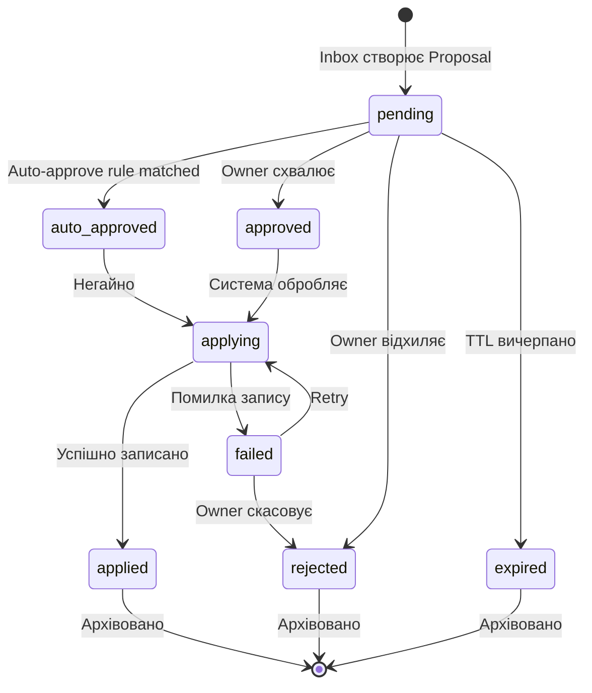
```mermaid
stateDiagram-v2
    [*] --> pending : Inbox створює Proposal

    pending --> auto_approved : Auto-approve rule matched
    pending --> approved : Owner схвалює
    pending --> rejected : Owner відхиляє
    pending --> expired : TTL вичерпано

    auto_approved --> applying : Негайно

    approved --> applying : Система обробляє

    applying --> applied : Успішно записано
    applying --> failed : Помилка запису

    failed --> applying : Retry
    failed --> rejected : Owner скасовує

    rejected --> [*] : Архівовано
    expired --> [*] : Архівовано
    applied --> [*] : Архівовано
```

### 1.2 Опис серверних станів

| Стан | Значення | Хто встановлює | UI-відображення |
|------|---------|----------------|-----------------|
| **pending** | Proposal створено, очікує рішення | Inbox/Worker | Жовтий badge "Очікує" |
| **auto_approved** | Автоматично схвалено правилом | Worker (rule engine) | Зелений badge "Авто-схвалено" |
| **approved** | Owner явно схвалив | Owner (через UI) | Зелений badge "Схвалено" |
| **applying** | Зміна записується у canonical storage | Worker (Apply Engine) | Spinner "Застосовується..." |
| **applied** | Зміна записана успішно | Worker | Зелений badge "Застосовано" + commit info |
| **rejected** | Owner відхилив | Owner (через UI) | Червоний badge "Відхилено" + причина |
| **expired** | TTL вичерпано | System (cron) | Сірий badge "Прострочено" |
| **failed** | Помилка при записі | Worker | Червоний badge "Помилка" + деталі |

### 1.3 Стан `reviewing` — клієнтський

**[РІШЕННЯ]** `reviewing` є **клієнтським (UI-only) станом**. Серверні стани **не залежать** від того, чи Owner відкрив сторінку proposal.

Обґрунтування:
- Сервер не повинен знати, чи хтось "дивиться" на proposal
- Два Owner (або Owner на двох пристроях) можуть дивитися одночасно
- Мережевий disconnect не повинен впливати на серверний стан

**UI-реалізація:**
- Коли Owner відкриває proposal detail → UI локально позначає як "reviewing"
- Це впливає лише на UI (виділення, фільтрація "переглянутих")
- Сервер не знає про цей стан; proposal залишається `pending`

**Опційний lock (не MVP):**
Якщо в майбутньому потрібна координація між кількома Owner:

```typescript
// Опційне поле у proposal (НЕ стан, а metadata)
interface ProposalLock {
  lockOwner?: string;         // identity того, хто переглядає
  lockExpiresAt?: string;     // auto-expire через 5 хв
}
```

Lock не блокує approve/reject — лише показує "хтось переглядає" (advisory lock).

---

## 2. Proposal: поля для UI

### 2.1 Основна структура

```typescript
interface Proposal {
  id: string;                    // "prop_2026-02-14_xyz789"
  inbox_entry_id: string;        // зв'язок з Inbox entry
  status: ProposalStatus;
  created_at: string;            // ISO 8601
  updated_at: string;            // ISO 8601
  expires_at: string;            // ISO 8601 (TTL)

  source: {
    type: "ui" | "telegram" | "webhook" | "agent" | "cron";
    identity: string;            // хто створив
    run_id?: string;             // якщо від агента
  };

  action: string;                // "propose-edit" | "propose-summary" | "memory-update" | "logic-update" | "logic-rollback" | ...
  target: {
    type: "note" | "artifact" | "tag" | "comment";
    path: string;                // MinIO/Git path
  };

  content: {
    summary: string;             // короткий опис для списку
    diff: ProposalDiff;          // зміни для Diff View
    reasoning?: string;          // пояснення агента
    citations?: Citation[];      // джерела
  };

  approval: {
    decided_by?: string;         // хто прийняв рішення
    decided_at?: string;         // коли
    decision_note?: string;      // причина (обов'язкова при rejection)
  };

  apply_result: {
    git_commit?: string;         // hash коміту
    minio_path?: string;         // шлях у MinIO
    error?: string;              // деталі помилки
  };

  // Concurrency control
  base_revision?: string;        // hash/version target на момент створення proposal
  target_hash?: string;          // content hash target
}

type ProposalStatus =
  | "pending"
  | "auto_approved"
  | "approved"
  | "applying"
  | "applied"
  | "rejected"
  | "expired"
  | "failed";

interface ProposalDiff {
  type: "append" | "replace" | "create" | "delete";
  position?: string;             // "after-frontmatter" | "end" | line number
  text: string;                  // зміст змін
}

interface Citation {
  source: string;                // ім'я файлу-джерела
  quote: string;                 // цитата
}
```

### 2.2 Поля для списку (compact view)

UI Proposal List використовує:
- `id` — ідентифікатор
- `status` — badge
- `content.summary` — текст preview
- `source.type` + `source.identity` — іконка + ім'я джерела
- `action` — тип дії
- `target.path` — що змінюється
- `created_at` — час
- `expires_at` — countdown до expiry

### 2.3 Поля для detail view

UI Proposal Detail додатково використовує:
- `content.diff` — Diff View
- `content.reasoning` — блок "Обґрунтування"
- `content.citations[]` — блок "Джерела"
- `source.run_id` — лінк на Run Timeline
- `approval.*` — блок "Рішення" (після approve/reject)
- `apply_result.*` — блок "Результат" (після apply)

---

## 3. Concurrent Proposals

### 3.1 Проблема

Два proposals можуть змінювати один і той самий target:
- Agent створює `propose-edit` на `sonata-bwv1001.md`
- Telegram bot створює `propose-note` з тим самим slug

### 3.2 Рішення: Optimistic Concurrency

**[РІШЕННЯ]** Proposal зберігає `base_revision` та `target_hash` на момент створення.

При Apply:
1. Apply Engine перевіряє: чи `target_hash` досі актуальний
2. Якщо target змінився після створення proposal → proposal → `failed` з причиною "conflict"
3. UI показує warning: "Target змінився після створення пропозиції"
4. Owner може: створити новий proposal або force-apply (з явним override)

**UI warning:**

```typescript
interface ConflictWarning {
  type: "target_changed";
  proposal_base_revision: string;
  current_revision: string;
  message: string;               // "Нотатка була змінена після створення цієї пропозиції"
}
```

### 3.3 FIFO порядок

**[РІШЕННЯ]** Proposals на той самий target обробляються FIFO (first-in, first-out). Перший approved → applied. Другий → conflict check.

---

## 4. Endpoints для UI

| Method | Endpoint | Auth | Опис | Response |
|--------|----------|------|------|----------|
| `GET` | `/proposals/pending` | Owner | Список pending proposals | `Proposal[]` |
| `GET` | `/proposals/{id}` | Owner | Деталі proposal | `Proposal` |
| `PATCH` | `/proposals/{id}` | Owner | Approve/reject | `Proposal` (updated) |
| `GET` | `/proposals/history?status=applied,rejected` | Owner | Архів | `Proposal[]` |
| `PATCH` | `/proposals/batch` | Owner | Масова дія (див. КОНТРАКТИ_API_V1.md §3.5) | `{updated, skipped, errors}` |

### 4.1 PATCH /proposals/{id} — Request

```json
{
  "status": "approved",
  "decision_note": "Якість резюме задовільна"
}
```

Або rejection (decision_note обов'язковий):

```json
{
  "status": "rejected",
  "decision_note": "Резюме не відображає ключову тезу про аплікатуру"
}
```

### 4.2 Idempotency

**[РІШЕННЯ]** PATCH /proposals/{id} є **ідемпотентним** для однакового статусу. Повторний `PATCH {status: approved}` на вже approved proposal → 200 OK без змін. Перехід з `applied` назад у `pending` — заборонений (409 Conflict).

---

## 5. Rejection UX

**[РІШЕННЯ]** Rejection **вимагає** `decision_note`:

- UI показує textarea "Причина відхилення" (мінімум 10 символів)
- Причина зберігається у `approval.decision_note`
- Причина відображається в аудит-лозі
- Причина доступна для аналізу агентних помилок (agent memory)

---

## 6. Типи Proposals: агентна пам'ять та логіка

### 6.1 `memory-update` — оновлення пам'яті агента

| Параметр | Значення |
|---------|---------|
| Ініціатор | Агент (через propose-memory-update()) або людина |
| `auto-approve` | Дозволено для `priority: normal` |
| `requiresHumanReview` | Тільки для `priority: high` |
| Target | `memory/<agentId>/` у git monorepo `garden-bloom-memory` |
| Spec | ПАМ_ЯТЬ_АГЕНТА_GIT_DIFFMEM_V1.md §4.2 |

```json
{
  "type": "memory-update",
  "agentId": "archivist-violin",
  "runId": "run_abc123",
  "expectedVersion": 42,
  "updates": [
    { "file": "facts.md", "operation": "append", "content": "...", "section": "Домен" },
    { "file": "snapshot.md", "operation": "replace", "content": "..." }
  ],
  "autoApprove": true,
  "priority": "normal"
}
```

### 6.2 `logic-update` — зміна логіки агента

| Параметр | Значення |
|---------|---------|
| Ініціатор | Агент-оптимізатор або людина |
| `auto-approve` | **Заборонено** — завжди `requiresHumanReview: true` |
| `requiresHumanReview` | **Завжди true, без виключень** |
| Target | `logic/<agentId>/current.*` у git monorepo `garden-bloom-memory` |
| Spec | ВЕРСІОНУВАННЯ_ЛОГІКИ_АГЕНТА_V1.md §6 |

```json
{
  "type": "logic-update",
  "targetAgentId": "archivist-violin",
  "optimizerRunId": "run_opt_789",
  "currentVersion": "v006",
  "proposedChanges": { "current.pseudo.md": { "operation": "patch", "diff": "..." } },
  "rationale": { "problem": "...", "evidenceRuns": ["run_098"], "expectedImprovement": "..." },
  "requiresHumanReview": true
}
```

> **[ПРАВИЛО]** Proposals типу `logic-update` НЕ можуть бути auto-approved навіть якщо глобально auto-approve увімкнений. Це архітектурний інваріант, не конфігурація.

### 6.3 `logic-rollback` — відкат логіки до попередньої версії

| Параметр | Значення |
|---------|---------|
| Ініціатор | Людина |
| `auto-approve` | **Заборонено** |
| `requiresHumanReview` | **Завжди true** |
| Механізм | Proposal з вмістом `versions/v<N>.*` як нова поточна версія |

---

## Див. також

- **INBOX_ТА_PROPOSAL_АРХІТЕКТУРА.md** — повна специфікація
- **INBOX_ТА_ЦИКЛ_ЗАПУСКУ_V1.md** — Inbox та Run lifecycle для UI
- **КОНТРАКТИ_API_V1.md** — повні JSON schemas для всіх endpoints
- **LOVABLE_УЗГОДЖЕННЯ_З_АРХІТЕКТУРОЮ_ВИКОНАННЯ.md** — контракт frontend з runtime

---

*Цей документ є канонічною специфікацією Proposal System для frontend імплементації.*


---

## Семантичні зв'язки

**Цей документ є частиною:**
- [[INBOX_ТА_PROPOSAL_АРХІТЕКТУРА]] — операційний витяг для Frontend розробника

**Цей документ залежить від:**
- [[INBOX_ТА_PROPOSAL_АРХІТЕКТУРА]] — повна специфікація Proposal system
- [[КОНТРАКТИ_API_V1]] — API endpoints для Proposal lifecycle

**Від цього документа залежають:**
- Lovable Frontend — UI реалізація Proposal state machine на основі цього витягу

---

*Цей документ є операційним витягом Proposal system для Frontend розробника (Lovable).*
```
---
### operations/ПРОТОКОЛ_АРХІТЕКТОРА.md
**Розмір:** 12,526 байт
```text
---
tags:
  - domain:meta
  - status:canonical
  - format:guide
created: 2026-02-22
updated: 2026-02-22
tier: 2
title: "ПРОТОКОЛ АРХІТЕКТОРА"
dg-publish: true
dg-metatags:
dg-home:
---

# ПРОТОКОЛ_АРХІТЕКТОРА

> Створено: 2026-02-22
> Автор: Головний архітектор системи
> Статус: Канонічний операційний протокол
> Мова: Українська (канонічна)

---

## 0. Призначення

Цей документ є **операційним протоколом для архітектора** (людини або Claude Opus Agent) при роботі з knowledge graph docs/. Він відповідає на питання:

- Як правильно додати новий документ у канон?
- Як закривати orphan/weakly-connected вузли?
- Як підтримувати граф структурованим без деградації?

Canonical enforcement rules — в [[ІНВАРІАНТИ_ГРАФУ_ЗНАНЬ]].
Структура шарів — у [[КАРТА_СИСТЕМИ]].

---

## 1. Як інтегрувати новий документ у канон (5 кроків)

```
Крок 1: Визнач шар
  → foundation/ : аксіоматичний документ, змінює A1–A7? Дуже рідко.
  → core/       : runtime spec? Описує "як система виконує"?
  → features/   : конкретна підсистема? ADR?
  → non-functional/ : SLO, security, reliability?
  → governance/ : процес, правило, інваріант?
  → operations/ : витяг для конкретної аудиторії?
  → Tier 2 у відповідній папці (drakon/, frontend/, backend/, product/)

Крок 2: Обери tier
  → tier: 1 : canonical spec, авторитетне джерело правди
  → tier: 2 : supporting, operational extract, guide

Крок 3: Додай мінімальну frontmatter секцію
  ---
  tags:
    - domain:arch|meta|product|drakon|frontend|backend
    - status:canonical|draft|historical
    - format:spec|guide|inventory|philosophy
  tier: 1 або 2
  title: "НАЗВА ДОКУМЕНТА"
  dg-publish: true
  dg-metatags:
  dg-home:
  ---

Крок 4: Додай "## Семантичні зв'язки" в кінці файлу
  Мінімум:
    - 1 "Цей документ є частиною:" → [[батьківський вузол]]
    - 2 "Цей документ залежить від:" → [[deps...]]
    - (опціонально) "Від цього документа залежать:"

Крок 5: Додай inbound link
  → у батьківський canonical doc: "Деталізується у [[НОВИЙ_ДОКУМЕНТ]]"
  → або у КАРТА_ГРАФУ (якщо Tier 1)
  → або у КАРТА_СИСТЕМИ (якщо operations)
  → або у ІНДЕКС (якщо треба NotebookLM visibility)
```

**Перевірка:** `python3 scripts/enforce-frontmatter.py` та `python3 scripts/check-graph.py` (якщо є) мають повертати exit 0.

---

## 2. П'ятихвилинний цикл підтримки графу

Запускай щоразу перед commit нових docs/:

```bash
# 1. Перевір frontmatter (30 сек)
python3 scripts/enforce-frontmatter.py --ci

# 2. Знайди нові orphans (30 сек)
python3 -c "
from pathlib import Path; import re
DOCS = Path('docs'); SKIP = {'_quarantine', 'CLAUDE.md'}
files = {p.stem.lower(): p for p in DOCS.rglob('*.md')
         if not any(s in str(p) for s in SKIP)}
inlinks = {s: 0 for s in files}
for p in files.values():
    t = p.read_text(encoding='utf-8', errors='replace')
    for lk in re.findall(r'\[\[([^\]|#]+?)\]\]', t):
        if lk.lower() in inlinks and lk.lower() != p.stem.lower():
            inlinks[lk.lower()] += 1
orphans = [(s, str(files[s].relative_to(DOCS))) for s, c in inlinks.items()
           if c == 0 and 'isolated: intentional' not in files[s].read_text()]
for stem, path in orphans: print(f'ORPHAN: {path}')
if not orphans: print('OK: no orphans')
"

# 3. Якщо orphans знайдені → fix за кроками §1
```

**Якщо orphan знайдено:**
1. Чи документ навмисно ізольований? → додай `isolated: intentional` у frontmatter + пояснення у "## Семантичні зв'язки"
2. Якщо ні → знайди семантичного батька → додай `[[НОВИЙ_ДОКУМЕНТ]]` у батьківський вузол

---

## 3. Шаблон секції "## Семантичні зв'язки"

```markdown
---

## Семантичні зв'язки

**Цей документ є частиною:**
- [[БАТЬКІВСЬКИЙ_ВУЗОЛ]] — одне речення про відношення

**Цей документ залежить від:**
- [[DEP_1]] — чому залежить
- [[DEP_2]] — чому залежить

**Від цього документа залежать:**
- [[CHILD_1]] — який документ деталізує цей
- (або: Lovable Frontend, graph-linter тощо, якщо немає doc-рефа)

---

*Одне речення про призначення цього документа.*
```

**Правила:**
- "Батько" — 1 документ (не більше 2). Він є canonical parent.
- "Залежить від" — 2–5 посилань. Тільки причинно-наслідкові зв'язки.
- "Від цього залежать" — 0–5. Може бути порожнім.
- НЕ додавай посилання заради "повноти". Кожне посилання має логічне обґрунтування.

---

## 4. Правила для шарів

### Foundation (architecture/foundation/)
- Тут живуть аксіоми. Нових документів майже не буває.
- Новий документ сюди → обговорення з Owner, бо змінює архітектурний фундамент.
- Батько для всього тут: не існує (це корінь). Залежить від: [[МАНІФЕСТ]].

### Core (architecture/core/)
- Runtime specs. Один документ = одна runtime-концепція.
- Кожен новий doc тут → обов'язково у КАРТА_ГРАФУ Tier 1 + посилання з АРХІТЕКТУРНИЙ_КОРІНЬ §6.
- Батько: [[АРХІТЕКТУРНИЙ_КОРІНЬ]] або існуючий core doc.

### Features (architecture/features/)
- Підсистеми та ADRs. Нова feature → Tier 1 або Tier 2.
- Новий ADR: `ADR_НАЗВА.md`, tier:2, посилання з відповідного core doc.
- Батько: відповідний core doc або [[АРХІТЕКТУРНИЙ_КОРІНЬ]].

### Non-Functional (architecture/non-functional/)
- По одному документу на NFR домен.
- Батько: [[АРХІТЕКТУРНИЙ_КОРІНЬ]] або [[КАНОНІЧНА_АРХІТЕКТУРА_ВИКОНАННЯ]].
- Кожен має посилання на [[МОДЕЛЬ_МАСШТАБУВАННЯ]] або суміжні NFR.

### Governance (architecture/governance/)
- Правила еволюції системи. Нові правила → через Proposal (інваріант I-S4).
- Батько: [[АРХІТЕКТУРНИЙ_КОРІНЬ]] або [[КАНОНІЧНИЙ_МЕТОД_МУЛЬТИАГЕНТНОЇ_РОЗРОБКИ]].

### Operations (operations/)
- Витяги для конкретних аудиторій. Мають посилатись на canonical source.
- Батько: canonical doc, з якого витягнуто (напр., [[INBOX_ТА_PROPOSAL_АРХІТЕКТУРА]]).
- Новий operations doc → додати рядок у КАРТА_СИСТЕМИ §2.7.

---

## 5. Як закрити orphan (алгоритм рішення)

```
Якщо document має 0 inlinks:

1. Чи це операційний промпт / tool / standalone? → isolated: intentional
   Додай до frontmatter: isolated: intentional
   Поясни в "Семантичні зв'язки": чому ізольовано.

2. Чи це historical/archive? → вже в historical/
   Додай "Семантичні зв'язки" з посиланням на canonical successor.
   Батьківський canonical doc → додати footnote: "Archived: [[ЦЕЙ_ДОКУМЕНТ]]"

3. Чи це Tier 2 operations/витяг? → знайди canonical source
   Canonical source → додай: "Деталізується у [[ЦЕЙ_ДОКУМЕНТ]]"

4. Чи це новий Tier 1 spec? → додай у КАРТА_ГРАФУ + ІНДЕКС + АРХІТЕКТУРНИЙ_КОРІНЬ §6

5. Якщо незрозуміло до якого шару → тимчасово в operations/ з TODO у frontmatter
   Додай тег: status:draft
   Через 1 тиждень → review + promote або archive
```

---

## 6. CI-перевірка (рекомендація)

Додай до `.github/workflows/docs-lint.yml`:

```yaml
name: docs-lint
on:
  push:
    paths: ['docs/**']
  pull_request:
    paths: ['docs/**']

jobs:
  frontmatter:
    runs-on: ubuntu-latest
    steps:
      - uses: actions/checkout@v4
      - name: Check frontmatter
        run: python3 scripts/enforce-frontmatter.py --ci
        # Exit 1 якщо будь-який docs/*.md потребує змін

  graph-linter:
    runs-on: ubuntu-latest
    steps:
      - uses: actions/checkout@v4
      - name: Check for orphan nodes
        run: python3 scripts/check-graph.py --ci
        # Exit 1 якщо orphans без isolated:intentional
```

**scripts/check-graph.py** (базова версія):

```python
#!/usr/bin/env python3
"""Graph integrity check: orphans, missing semantic links."""
import re, sys
from pathlib import Path

DOCS = Path(__file__).parent.parent / 'docs'
SKIP = {'_quarantine', 'CLAUDE.md'}

def is_excluded(p):
    return any(s in str(p) for s in SKIP)

files = {}
for p in DOCS.rglob('*.md'):
    if is_excluded(p): continue
    text = p.read_text(encoding='utf-8', errors='replace')
    stem = p.stem.lower()
    files[stem] = {
        'path': p, 'text': text,
        'is_isolated': 'isolated: intentional' in text,
        'has_sem': any(s in text for s in ["## Семантичні зв'язки", "## ЗВ'ЯЗКИ"]),
        'outlinks': re.findall(r'\[\[([^\]|#]+?)\]\]', text),
        'inlinks': 0,
    }

# Count inlinks
for stem, f in files.items():
    for link in f['outlinks']:
        t = link.lower()
        if t in files and t != stem:
            files[t]['inlinks'] += 1

errors = 0
for stem, f in files.items():
    rel = f['path'].relative_to(DOCS)
    if not f['is_isolated'] and f['inlinks'] == 0:
        print(f'ORPHAN: {rel}', file=sys.stderr)
        errors += 1
    if not f['has_sem'] and not f['is_isolated']:
        print(f'NO_SEMANTIC_LINKS: {rel}', file=sys.stderr)
        errors += 1

print(f'check-graph: {len(files)} files, {errors} violations')
sys.exit(1 if errors else 0)
```

---

## Семантичні зв'язки

**Цей документ є частиною:**
- [[КАРТА_СИСТЕМИ]] — операційний протокол в рамках навігаційного центру

**Цей документ залежить від:**
- [[ІНВАРІАНТИ_ГРАФУ_ЗНАНЬ]] — правила, які цей протокол операціоналізує
- [[АРХІТЕКТУРНИЙ_КОРІНЬ]] — аксіоматична основа для прийняття рішень
- [[КАРТА_ГРАФУ]] — реєстр вузлів для оновлення при нових документах

**Від цього документа залежать:**
- Архітектор системи (людина або Claude Opus Agent) — використовує як checklist
- [[КАНОНІЧНИЙ_МЕТОД_МУЛЬТИАГЕНТНОЇ_РОЗРОБКИ]] — цей протокол є його операційним виразом

---

*Цей документ є операційним протоколом архітектора для підтримки knowledge graph Gardens Bloom.*
```
---
### operations/ІНДЕКС_АРХІТЕКТУРИ_ВИКОНАННЯ.md
**Розмір:** 10,574 байт
```text
---
tags:
  - domain:meta
  - status:canonical
  - format:inventory
  - feature:execution
created: 2026-02-21
updated: 2026-02-21
tier: 2
title: "ІНДЕКС АРХІТЕКТУРИ ВИКОНАННЯ"
dg-publish: true
dg-metatags:
dg-home:
---

# Runtime Architecture: Master Index

> Створено: 2026-02-15
> Автор: Головний архітектор системи
> Статус: Канонічний entry point
> Мова: Українська (канонічна)

---

## 0. Призначення

Цей файл є **canonical entry point** для runtime-архітектури Garden Seedling. Він пов'язує всі canonical документи, що описують систему у vendor-agnostic термінах.

**[ПРИНЦИП]** Архітектура описує ролі та контракти, не vendor-specific реалізації. Orchestration Layer — замінний компонент (vendor-agnostic; adapter-based). Рекомендовані оркестратори: **Hatchet** (MIT, FastAPI-native SDK, Hatchet Lite ~1-2 GB RAM) або **Restate** (single binary ~256 MB, для мінімальних ресурсів). Деталі абстракції та порівняльний аналіз — у АБСТРАКЦІЯ_РІВНЯ_ОРКЕСТРАЦІЇ.md.

---

## 0.1 Architectural Root & Entry Points

| Документ | Опис |
|---------|------|
| **[АРХІТЕКТУРНИЙ_КОРІНЬ.md](АРХІТЕКТУРНИЙ_КОРІНЬ.md)** | **Архітектурний корінь** — 7 аксіом, ролі компонентів, authority boundaries, canonical flow |
| **[../PROJECT_DESCRIPTION_CANONICAL.md](../PROJECT_DESCRIPTION_CANONICAL.md)** | Canonical, vendor-agnostic опис проєкту — overview, principles, layers, authority model |

> Рекомендовано читати першим: АРХІТЕКТУРНИЙ_КОРІНЬ.md (аксіоми) → цей файл (детальний index).

---

## 1. Canonical Runtime Documents

| # | Документ | Опис | Ключові розділи |
|---|---------|------|-----------------|
| 1 | **КАНОНІЧНА_АРХІТЕКТУРА_ВИКОНАННЯ.md** | Загальна canonical архітектура | Інваріанти, ролі компонентів, діаграми, deployment |
| 2 | **АБСТРАКЦІЯ_РІВНЯ_ОРКЕСТРАЦІЇ.md** | Orchestration Layer як абстракція | Capabilities, Adapter Interface, Task Definition, vendor criteria |
| 3 | **КАНОНІЧНИЙ_ЦИКЛ_ЗАПУСКУ.md** | Run state machine та lifecycle | States, transitions, Status Writer, polling, failure handling |
| 4 | **КАНОНІЧНИЙ_КОНВЕЄР_ВИКОНАННЯ.md** | Pipeline від trigger до completion | 7 фаз, data flow, ordering guarantees, error recovery |
| 5 | **КАНОНІЧНА_МОДЕЛЬ_АВТОРИТЕТУ_СХОВИЩА.md** | Storage authority model | Write/Read authority, anti-patterns, data lifecycle, recovery |
| 6 | **ПАМ_ЯТЬ_АГЕНТА_GIT_DIFFMEM_V1.md** | Git-based агентна пам'ять (v1.1.0) | DiffMem монорепо, два шари пам'яті, HARD ліміти, витіснення |
| 7 | **ВЕРСІОНУВАННЯ_ЛОГІКИ_АГЕНТА_V1.md** | Версіонування логіки агентів (v1.0.0) | logic/ структура, агент-оптимізатор, logic-update Proposals |

---

## 2. Reading Order

### Для нового reader:
1. **КАНОНІЧНА_АРХІТЕКТУРА_ВИКОНАННЯ.md** — загальна картина
2. **КАНОНІЧНА_МОДЕЛЬ_АВТОРИТЕТУ_СХОВИЩА.md** — хто що зберігає
3. **АБСТРАКЦІЯ_РІВНЯ_ОРКЕСТРАЦІЇ.md** — як координується виконання
4. **КАНОНІЧНИЙ_ЦИКЛ_ЗАПУСКУ.md** — state machine
5. **КАНОНІЧНИЙ_КОНВЕЄР_ВИКОНАННЯ.md** — деталі виконання

### Для frontend developer (Lovable):
1. **КАНОНІЧНИЙ_ЦИКЛ_ЗАПУСКУ.md** §1 (states), §4 (polling)
2. **INBOX_ТА_ЦИКЛ_ЗАПУСКУ_V1.md** — frontend-specific витяг
3. **СИСТЕМА_PROPOSAL_V1.md** — proposal UI контракт
4. **КОНТРАКТИ_API_V1.md** — повні API schemas

### Для backend developer:
1. **КАНОНІЧНА_АРХІТЕКТУРА_ВИКОНАННЯ.md** — повна архітектура
2. **АБСТРАКЦІЯ_РІВНЯ_ОРКЕСТРАЦІЇ.md** — adapter interface
3. **КАНОНІЧНИЙ_КОНВЕЄР_ВИКОНАННЯ.md** — implementation guide
4. **КАНОНІЧНА_МОДЕЛЬ_АВТОРИТЕТУ_СХОВИЩА.md** — write/read rules
5. **ПАМ_ЯТЬ_АГЕНТА_GIT_DIFFMEM_V1.md** — агентна пам'ять: структура, ліміти, eviction
6. **ВЕРСІОНУВАННЯ_ЛОГІКИ_АГЕНТА_V1.md** — версіонування логіки: logic/, оптимізатор

---

## 3. Invariants Summary

Фундаментальні інваріанти системи (деталі у КАНОНІЧНА_АРХІТЕКТУРА_ВИКОНАННЯ.md §1):

| # | Інваріант | Документ-деталі |
|---|----------|-----------------|
| 1 | **Folder = Agent** — один агент = одна директорія у MinIO | КАНОНІЧНА_АРХІТЕКТУРА_ВИКОНАННЯ.md §2.1 |
| 2 | **MinIO = Source of Truth** — canonical storage для визначень, runs, proposals | КАНОНІЧНА_МОДЕЛЬ_АВТОРИТЕТУ_СХОВИЩА.md §1 |
| 3 | **`_agent.md` = Behavioral Contract** — визначення агента у MinIO | КАНОНІЧНА_АРХІТЕКТУРА_ВИКОНАННЯ.md §2.1 |
| 4 | **Mastra = Interpreter** — runtime, не source of truth | КАНОНІЧНА_АРХІТЕКТУРА_ВИКОНАННЯ.md §2.4 |
| 5 | **Proposal = Mutation Gate** — будь-яка зміна через approval | СИСТЕМА_PROPOSAL_V1.md §1 |
| 6 | **Frontend = Projection Layer** — відображає, не керує | КАНОНІЧНА_АРХІТЕКТУРА_ВИКОНАННЯ.md §2.6 |
| 7 | **Worker = Single Entrypoint** — єдиний gateway для frontend | КАНОНІЧНА_АРХІТЕКТУРА_ВИКОНАННЯ.md §2.5 |
| 8 | **Orchestration Layer = Replaceable** — vendor-agnostic координація | АБСТРАКЦІЯ_РІВНЯ_ОРКЕСТРАЦІЇ.md §0 |
| 9 | **Status Writer = Orchestration Layer wrapper** — не Mastra | КАНОНІЧНИЙ_ЦИКЛ_ЗАПУСКУ.md §2 |
| 10 | **Memory = git monorepo** — `garden-bloom-memory`, ШАР 1 ≤ 12 000 токенів HARD | ПАМ_ЯТЬ_АГЕНТА_GIT_DIFFMEM_V1.md §11 |
| 11 | **Logic = versioned per-agent** — `logic/<agentId>/`, logic-update завжди human review | ВЕРСІОНУВАННЯ_ЛОГІКИ_АГЕНТА_V1.md §6 |

---

## 4. Component Roles

| Компонент | Роль | Canonical Doc |
|----------|------|--------------|
| **MinIO** | Canonical storage (definitions, runs, proposals) | КАНОНІЧНА_МОДЕЛЬ_АВТОРИТЕТУ_СХОВИЩА.md |
| **git monorepo `garden-bloom-memory`** | Canonical storage (memory, logic) | ПАМ_ЯТЬ_АГЕНТА_GIT_DIFFMEM_V1.md §2.2 |
| **Orchestration Layer** | Coordination, durable execution | АБСТРАКЦІЯ_РІВНЯ_ОРКЕСТРАЦІЇ.md |
| **Mastra** | Agent runtime interpreter | КАНОНІЧНА_АРХІТЕКТУРА_ВИКОНАННЯ.md §2.4 |
| **FastAPI** | NLM cognitive proxy | КАНОНІЧНА_АРХІТЕКТУРА_ВИКОНАННЯ.md §2.2 |
| **Worker** | API gateway | КАНОНІЧНА_АРХІТЕКТУРА_ВИКОНАННЯ.md §2.5 |
| **Frontend** | Projection layer | КАНОНІЧНА_АРХІТЕКТУРА_ВИКОНАННЯ.md §2.6 |
| **Optimizer agent** | Logic analysis, proposes logic-update Proposals | ВЕРСІОНУВАННЯ_ЛОГІКИ_АГЕНТА_V1.md §4 |

---

## 5. Related Documents

### Frontend-specific
- **INBOX_ТА_ЦИКЛ_ЗАПУСКУ_V1.md** — frontend витяг lifecycle
- **СИСТЕМА_PROPOSAL_V1.md** — proposal UI контракт
- **КОНТРАКТИ_API_V1.md** — повні API schemas
- **LOVABLE_УЗГОДЖЕННЯ_З_АРХІТЕКТУРОЮ_ВИКОНАННЯ.md** — frontend ↔ runtime контракт
- **ПЛАН_МІГРАЦІЇ_FRONTEND_V1.md** — frontend migration plan

### Architecture foundation
- **АРХІТЕКТУРНА_БАЗА_СИСТЕМИ.md** — архітектурна база
- **КОНТРАКТ_АГЕНТА_V1.md** — agent contract V1
- **INBOX_ТА_PROPOSAL_АРХІТЕКТУРА.md** — повна inbox/proposal архітектура

### Agent memory & logic (canonical)
- **ПАМ_ЯТЬ_АГЕНТА_GIT_DIFFMEM_V1.md** — git-based агентна пам'ять, два шари, eviction model
- **ВЕРСІОНУВАННЯ_ЛОГІКИ_АГЕНТА_V1.md** — версіонування логіки агентів, optimizer agent

### Migration (archived — див. `archive/orchestration-migrations/`)
- Міграційні документи переміщені до `archive/orchestration-migrations/`
- Canonical runtime docs (вище) є актуальними та vendor-agnostic

### Deprecated (archived)
- **~~ЦІЛЬОВА_АРХІТЕКТУРА_MASTRA_INNGEST.md~~** — замінено КАНОНІЧНА_АРХІТЕКТУРА_ВИКОНАННЯ.md (переміщено до `archive/deprecated/`)

---

*Цей документ є canonical entry point для runtime-архітектури Garden Seedling.*


---

## Семантичні зв'язки

**Цей документ є частиною:**
- [[КАРТА_СИСТЕМИ]] — операційний індекс в рамках навігаційного центру

**Цей документ залежить від:**
- [[КАНОНІЧНА_АРХІТЕКТУРА_ВИКОНАННЯ]] — основна специфікація
- [[АРХІТЕКТУРНИЙ_КОРІНЬ]] — аксіоми та ролі компонентів

**Від цього документа залежають:**
- Backend/Runtime розробники — використовують для навігації execution docs

---

*Цей документ є master index виконавчої архітектури Garden Bloom.*
```
---
### operations/_INDEX.md
**Розмір:** 786 байт
```text
# Operations

Операційні витяги та директиви — протоколи для frontend розробників та архітекторів.

## Файли

| Файл | Опис | Статус |
|------|------|--------|
| [[СИСТЕМА_PROPOSAL_V1]] | Proposal state machine для frontend | canonical |
| [[INBOX_ТА_ЦИКЛ_ЗАПУСКУ_V1]] | UI-орієнтований lifecycle | canonical |
| [[ІНДЕКС_АРХІТЕКТУРИ_ВИКОНАННЯ]] | Master index для operations | canonical |
| [[ІНВЕНТАР_ДОКУМЕНТАЦІЇ]] | Інвентар документації | canonical |
| [[ПРОТОКОЛ_АРХІТЕКТОРА]] | Роль та протокол архітектора-оркестратора | canonical |
```
---
### operations/INBOX_ТА_ЦИКЛ_ЗАПУСКУ_V1.md
**Розмір:** 11,590 байт
```text
---
tags:
  - domain:mutation
  - status:canonical
  - format:guide
  - feature:proposal
  - feature:execution
created: 2026-02-21
updated: 2026-02-21
tier: 2
title: "INBOX ТА ЦИКЛ ЗАПУСКУ V1"
dg-publish: true
dg-metatags:
dg-home:
---

# Inbox та Run: Lifecycle V1

> Створено: 2026-02-15
> Автор: Головний архітектор системи
> Джерело деталей: INBOX_ТА_PROPOSAL_АРХІТЕКТУРА.md
> Статус: Специфікація для Lovable frontend
> Мова: Українська (канонічна)

---

## 0. Призначення

Цей документ є **витягом** з INBOX_ТА_PROPOSAL_АРХІТЕКТУРА.md, оптимізованим для Lovable frontend імплементації. Він описує:

- State machines для Inbox та Run
- Поля, які UI читає та відображає
- Endpoints, які UI викликає
- Transitions, на які UI реагує

Для повних деталей (consent gates, auto-approve engine, webhook registration) — див. INBOX_ТА_PROPOSAL_АРХІТЕКТУРА.md.

---

## 1. Inbox Entry: State Machine

### 1.1 Стани

```
[створено] → pending → processed | rejected | expired
```

| Стан | Значення | UI-відображення |
|------|---------|-----------------|
| **pending** | Entry прийнято, чекає обробки | Жовтий badge, показати у списку |
| **processed** | Перетворено на Proposal | Зелений badge, лінк на proposal |
| **rejected** | Відхилено Validation Gate | Червоний badge, показати причину |
| **expired** | TTL вичерпано (default: 72h) | Сірий badge, приховати або фільтр |

### 1.2 Transitions

| Перехід | Хто | Тригер | UI-реакція |
|---------|-----|--------|------------|
| `→ pending` | Worker | POST /inbox/submit | Toast: "Прийнято до обробки" |
| `pending → processed` | Worker | Validation Gate пройдено | Badge зміна, показати proposalId |
| `pending → rejected` | Worker | Validation Gate не пройдено | Badge зміна, показати reason |
| `pending → expired` | System (cron) | TTL вичерпано | Badge зміна або приховати |

### 1.3 Inbox Entry: поля для UI

```typescript
interface InboxEntry {
  id: string;                    // "inbox_2026-02-14_abc123"
  source: {
    type: "ui" | "telegram" | "webhook" | "agent" | "cron";
    identity: string;            // "owner" | "guest:zone_abc" | "agent:archivist-violin"
  };
  intent: {
    action: string;              // "propose-edit" | "propose-summary" | ...
    target: string;              // "notes/violin.pp.ua/sonata-bwv1001"
  };
  metadata: {
    correlation_id?: string;
    priority: "normal" | "high";
    ttl_hours: number;           // default: 72
  };
  status: "pending" | "processed" | "rejected" | "expired";
  created_at: string;            // ISO 8601
  proposal_id?: string;          // заповнюється коли status = processed
  rejection_reason?: string;     // заповнюється коли status = rejected
}
```

### 1.4 Inbox Expiry UX

**[РІШЕННЯ]** Expired entries:

- **Поведінка:** entry зі статусом `expired` **не видаляється**. Він переміщується до `inbox/expired/` у MinIO.
- **UI:** За замовчуванням expired entries **приховані** з основного списку. Доступні через фільтр "Показати прострочені".
- **Badge:** Сірий badge з іконкою годинника + текст "Прострочено".
- **Дія:** Owner може вручну повторно створити entry через Quick Add.

---

## 2. Agent Run: State Machine

### 2.1 Стани

```
[ініційовано] → requested → queued → running → completed | failed
```

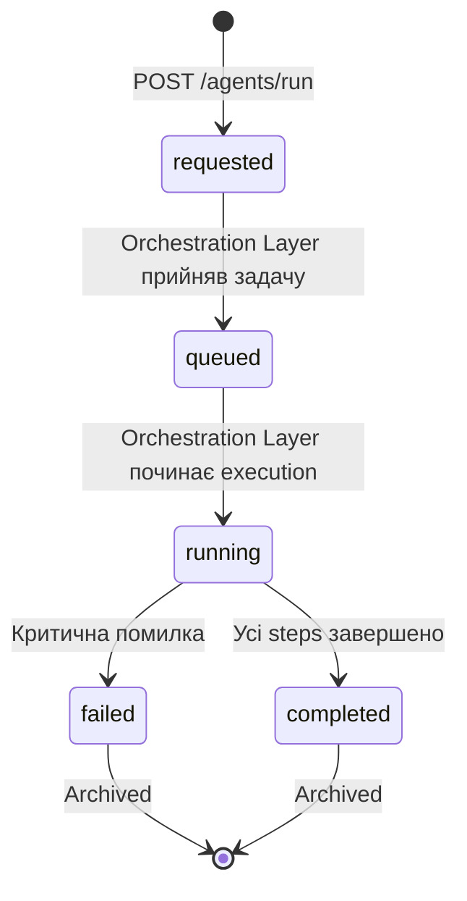
```mermaid
stateDiagram-v2
    [*] --> requested : POST /agents/run
    requested --> queued : Orchestration Layer прийняв задачу
    queued --> running : Orchestration Layer починає execution
    running --> completed : Усі steps завершено
    running --> failed : Критична помилка
    failed --> [*] : Archived
    completed --> [*] : Archived
```

### 2.2 Опис станів

| Стан | Значення | Хто встановлює | UI-відображення |
|------|---------|----------------|-----------------|
| **requested** | Worker отримав запит, ще не передав Orchestration Layer | Worker | Spinner: "Надсилається..." |
| **queued** | Orchestration Layer прийняв задачу, run чекає у черзі (concurrency limit) | Orchestration Layer (через status.json) | Badge: "У черзі", позиція у черзі (якщо відома) |
| **running** | Mastra активно виконує steps | Orchestration Layer wrapper (через status.json) | Progress bar, step list з поточним highlighted |
| **completed** | Усі steps завершено, proposal(и) створено | Orchestration Layer wrapper (через status.json) | Зелений badge, лінк на proposal(и) |
| **failed** | Критична помилка (NLM недоступний, MinIO fail, timeout) | Orchestration Layer wrapper (через status.json) | Червоний badge, деталі помилки |

### 2.3 Transitions

| Перехід | Тригер | UI-реакція |
|---------|--------|------------|
| `→ requested` | Owner натискає "Run" | Redirect до Run Timeline, spinner |
| `requested → queued` | Orchestration Layer acknowledge | Badge: "У черзі" |
| `queued → running` | Concurrency slot вільний | Progress bar з'являється |
| `running → running` (step update) | Mastra завершує крок | Крок у списку помічається ✓ |
| `running → completed` | Останній step завершено | Зелений badge, notification |
| `running → failed` | Помилка | Червоний badge, error details |

### 2.4 Run Status: поля для UI

```typescript
interface RunStatus {
  run_id: string;                // "run_2026-02-14_080000_abc123"
  agent_slug: string;
  status: "requested" | "queued" | "running" | "completed" | "failed";
  trigger: "manual" | "cron" | "event";

  started_at: string;            // ISO 8601
  finished_at?: string;          // ISO 8601, null якщо ще виконується

  current_step?: string;         // назва поточного кроку
  steps_total?: number;          // загальна кількість кроків (estimated)
  steps_completed: number;       // скільки завершено

  proposals_created: string[];   // масив proposal IDs
  error?: string;                // деталі помилки, null якщо OK
}
```

### 2.5 Run Step: поля для UI

```typescript
interface RunStep {
  step_number: number;           // 1, 2, 3...
  step_name: string;             // "load-context", "nlm-query", "create-proposal"
  status: "pending" | "running" | "completed" | "failed" | "skipped";
  started_at?: string;
  finished_at?: string;
  duration_ms?: number;
  output_summary?: string;       // короткий опис результату (для UI)
  error?: string;
}
```

### 2.6 Status Writer

**[ІНВАРІАНТ]** Canonical writer для `runs/<runId>/status.json` — це **Orchestration Layer wrapper**.

Mastra **НЕ** пише `status.json` напряму. Потік:

```
Mastra виконує step → повертає результат Orchestration Layer
→ Orchestration Layer wrapper записує step result у MinIO
→ Orchestration Layer оновлює status.json (статус, current_step, steps_completed)
→ UI polling читає status.json через Worker
```

Це забезпечує:
- Єдиний writer для status (no race conditions)
- Mastra залишається stateless інтерпретатором
- Orchestration Layer контролює retry/timeout/concurrency

---

## 3. Notification Transport

### 3.1 MVP: Polling

**[РІШЕННЯ]** MVP використовує **polling** для оновлень:

| Що | Endpoint | Інтервал | Коли зупинити |
|----|----------|----------|---------------|
| Active run status | `GET /runs/{runId}/status` | 5 секунд | `status ∈ {completed, failed}` |
| Inbox updates | `GET /inbox/stats` | 30 секунд | Сторінка закрита |
| Pending proposals | `GET /proposals/pending` | 30 секунд | Сторінка закрита |

### 3.2 Майбутнє: SSE (опціонально)

**[РІШЕННЯ]** Опціонально у пост-MVP:

```
GET /events/stream
Accept: text/event-stream

data: {"type": "run.step.completed", "runId": "...", "step": 3}
data: {"type": "proposal.created", "proposalId": "..."}
data: {"type": "inbox.new", "count": 5}
```

SSE замінить polling для real-time updates. Frontend має підтримувати graceful fallback до polling якщо SSE недоступний. Деталі event types та обмеження — див. КОНТРАКТИ_API_V1.md Appendix B (post-MVP).

---

## 4. Endpoints для UI

| Method | Endpoint | Auth | Повертає |
|--------|----------|------|---------|
| `POST` | `/inbox/submit` | Owner / Zone Guest | `{inbox_id, status}` |
| `GET` | `/inbox/stats` | Owner | `{pending, processed, rejected}` counts |
| `GET` | `/inbox/entries?status=pending` | Owner | `InboxEntry[]` |
| `POST` | `/agents/run` | Owner | `{run_id}` |
| `GET` | `/runs/{runId}/status` | Owner | `RunStatus` |
| `GET` | `/runs/{runId}/steps` | Owner | `RunStep[]` |
| `GET` | `/runs?agent={slug}` | Owner | `RunStatus[]` (історія) |

Деталі request/response schemas — див. КОНТРАКТИ_API_V1.md (§2 Agent Run, §6 Run History).

---

## Див. також

- **INBOX_ТА_PROPOSAL_АРХІТЕКТУРА.md** — повна специфікація Inbox, Proposal lifecycle, Consent Gates, Auto-approve engine
- **СИСТЕМА_PROPOSAL_V1.md** — state machine та UI-контракт для Proposals
- **КОНТРАКТИ_API_V1.md** — повні JSON schemas для всіх endpoints
- **LOVABLE_УЗГОДЖЕННЯ_З_АРХІТЕКТУРОЮ_ВИКОНАННЯ.md** — контракт frontend з runtime

---

*Цей документ є канонічним витягом lifecycle для frontend імплементації.*


---

## Семантичні зв'язки

**Цей документ є частиною:**
- [[INBOX_ТА_PROPOSAL_АРХІТЕКТУРА]] — операційний витяг lifecycle для Frontend UI

**Цей документ залежить від:**
- [[INBOX_ТА_PROPOSAL_АРХІТЕКТУРА]] — повна специфікація Inbox architecture
- [[КАНОНІЧНИЙ_ЦИКЛ_ЗАПУСКУ]] — run state machine (requested → queued → running → terminal)

**Від цього документа залежають:**
- Lovable Frontend — UI реалізація Inbox та run lifecycle

---

*Цей документ є операційним витягом Inbox та Run lifecycle для Frontend розробника (Lovable).*
```
---
### operations/ІНВЕНТАР_ДОКУМЕНТАЦІЇ.md
**Розмір:** 19,583 байт
```text
---
tags:
  - domain:meta
  - status:canonical
  - format:inventory
  - feature:tagging
created: 2026-02-21
updated: 2026-02-21
tier: 2
title: "ІНВЕНТАР ДОКУМЕНТАЦІЇ"
dg-publish: true
dg-metatags:
dg-home:
---

# Інвентаризація документації Garden Seedling

> Створено: 2026-02-15
> Оновлено: 2026-02-21 (додано AGENT_MEMORY та AGENT_LOGIC_VERSIONING як CANONICAL)
> Автор: Головний архітектор системи
> Метод: Повний аудит docs/ та кореневих .md файлів
> Канонічна структура: відповідно до MinIO layout V1 та docs/ canonical spec

> **POST-MIGRATION NOTE:** gh-aw артефакти, Starlight site content, legacy-en документи
> та міграційні плани переміщені до `archive/`. docs/ тепер містить ТІЛЬКИ canonical
> vendor-agnostic документацію (Mastra + Orchestration Layer). Структура archive/:
> - `archive/gh-aw/` — gh-aw специфічні артефакти
> - `archive/legacy-en/` — англомовна legacy документація
> - `archive/starlight-gh-aw/` — повний Starlight docs site (site/, schemas/, tests/)
> - `archive/migration/` — план міграції gh-aw → Mastra runtime
> - `archive/orchestration-migrations/` — плани міграції між оркестраторами (historical)
> - `archive/deprecated/` — deprecated архітектурні документи
> - `archive/GH_AW_DEPRECATION_NOTICE.md` — офіційний deprecation notice
>
> **NotebookLM режим:** використовувати docs/; ігнорувати archive/

---

## Канонічна цільова структура docs/

```
docs/                    # ТІЛЬКИ canonical vendor-agnostic документація
  architecture/          # Архітектурні специфікації (UA canonical)
  backend/               # Backend специфікації (API contracts)
  frontend/              # Frontend специфікації (Lovable контракт)
  manifesto/             # Маніфест, глосарій, філософія
  drakon/                # DRAKON інтеграція та дослідження

archive/                 # Історичні документи (gh-aw era)
  gh-aw/                 # gh-aw специфічні артефакти
  legacy-en/             # Англомовна legacy документація
  starlight-gh-aw/       # Повний Starlight docs site
    site/                # Content (patterns, reference, guides, blog, examples)
    schemas/             # JSON schemas (mcp-gateway, safe-inputs)
    tests/               # Playwright tests
  migration/             # План міграції gh-aw → Mastra runtime
  orchestration-migrations/ # Плани міграції оркестраторів
  deprecated/            # Deprecated архітектурні документи
```

---

## Легенда статусів

| Статус | Опис |
|--------|------|
| **CANONICAL** | Канонічний документ, відповідає поточній архітектурі, українською мовою |
| **NEEDS_TRANSLATION** | Актуальний за змістом, але англійською — потребує перекладу |
| **NEEDS_UPDATE** | Частково актуальний, потребує оновлення до поточної архітектури |
| **DEPRECATED** | Описує gh-aw або іншу застарілу архітектуру |
| **STUB** | Порожній або placeholder документ |
| **GH-AW_ARTIFACT** | Артефакт gh-aw репозиторію, не є частиною поточної архітектури |
| **INFRA** | Інфраструктурний файл (конфіг, тести, код) — не документація |

---

## 1. docs/architecture/

| Файл | Мова | Статус | Причина | Дія |
|------|------|--------|---------|-----|
| `АРХІТЕКТУРНА_БАЗА_СИСТЕМИ.md` | UA | **CANONICAL** | Фундаментальний документ поточної архітектури | KEEP |
| `ЦІЛЬОВА_АРХІТЕКТУРА_MASTRA_INNGEST.md` | UA | **DEPRECATED** | Замінено на КАНОНІЧНА_АРХІТЕКТУРА_ВИКОНАННЯ.md + АБСТРАКЦІЯ_РІВНЯ_ОРКЕСТРАЦІЇ.md | MOVED → `archive/deprecated/` |
| `ПАМ_ЯТЬ_АГЕНТА_GIT_DIFFMEM_V1.md` | UA | **CANONICAL** | Git-based агентна пам'ять v1.1.0; два шари, HARD ліміти, eviction model | KEEP |
| `ВЕРСІОНУВАННЯ_ЛОГІКИ_АГЕНТА_V1.md` | UA | **CANONICAL** | Версіонування логіки агентів v1.0.0; logic/ структура, optimizer agent, logic-update Proposals | KEEP |
| `КОНТРАКТ_АГЕНТА_V1.md` | UA | **NEEDS_UPDATE** → **UPDATED v1.1** | Оновлено модель пам'яті відповідно до ПАМ_ЯТЬ_АГЕНТА_GIT_DIFFMEM_V1.md; memory/ перенесено до git monorepo | UPDATED |
| `DRAKON_ІНТЕГРАЦІЯ_ТА_МОДЕЛЬ_ВИКОНАННЯ_АГЕНТА.md` | UA | **CANONICAL** | Специфікація DRAKON → pseudocode → runtime | KEEP |
| `INBOX_ТА_PROPOSAL_АРХІТЕКТУРА.md` | UA | **NEEDS_UPDATE** | Потребує розділення на INBOX_ТА_RUN_LIFECYCLE_V1.md та СИСТЕМА_PROPOSAL_V1.md відповідно до нової структури | UPDATE + SPLIT |
| `АРХІТЕКТУРНИЙ_АУДИТ_ТА_УЗГОДЖЕНІСТЬ.md` | UA | **DEPRECATED** | Замінюється новим FINAL аудитом | DEPRECATE |
| `КАНОНІЗАЦІЯ_МОВИ.md` | UA | **CANONICAL** | Мовний інваріант | KEEP |
| `SYSTEM_OVERVIEW.md` | EN | **NEEDS_TRANSLATION** | Актуальний опис системи, але англійською; поглинутий `АРХІТЕКТУРНА_БАЗА_СИСТЕМИ.md` | DEPRECATE → legacy-en/ |
| `BACKEND_ARCH.md` | EN | **NEEDS_TRANSLATION** | Опис FastAPI backend, актуальний; потрібен як backend/ специфікація | TRANSLATE → docs/backend/ |
| `FRONTEND_ARCH.md` | EN | **NEEDS_TRANSLATION** | Опис frontend архітектури, актуальний; потрібен як frontend/ специфікація | TRANSLATE → docs/frontend/ |
| `WORKER_ARCH.md` | EN | **NEEDS_TRANSLATION** | Опис Cloudflare Worker, актуальний; потрібен у backend/ | TRANSLATE → docs/backend/ |
| `LOVABLE_VISION.md` | EN | **DEPRECATED** | Нотатки Lovable-агента; поглинуті `LOVABLE_УЗГОДЖЕННЯ_З_АРХІТЕКТУРОЮ_ВИКОНАННЯ.md` | DEPRECATE → legacy-en/ |
| `ІНВЕНТАР_ДОКУМЕНТАЦІЇ.md` | UA | **CANONICAL** | Цей документ | KEEP |

---

## 2. docs/manifesto/

| Файл | Мова | Статус | Причина | Дія |
|------|------|--------|---------|-----|
| `МАНІФЕСТ.md` | UA | **CANONICAL** | Маніфест — конституція проєкту. Повна UA версія (`MANIFESTO_EXTENDED`) | KEEP |
| `MANIFESTO_EXTENDED.md` | EN | **DEPRECATED** | Англомовний розширений маніфест; зміст поглинутий українським `МАНІФЕСТ.md` | DEPRECATE → legacy-en/ |
| `ГЛОСАРІЙ.md` | UA | **CANONICAL** | Глосарій термінів; оновлений, vendor-agnostic | KEEP |
| `PHILOSOPHY_EVERYTHING_AGENT.md` | EN | **NEEDS_TRANSLATION** | Філософія "Everything is Agent"; актуальний принцип | TRANSLATE |

---

## 3. docs/frontend/

| Файл | Мова | Статус | Причина | Дія |
|------|------|--------|---------|-----|
| `LOVABLE_УЗГОДЖЕННЯ_З_АРХІТЕКТУРОЮ_ВИКОНАННЯ.md` | UA | **CANONICAL** | Контракт між архітектурою та Lovable-імплементатором | KEEP |

---

## 4. docs/migration/

| Файл | Мова | Статус | Причина | Дія |
|------|------|--------|---------|-----|
| `ПЛАН_МІГРАЦІЇ_GH_AW_НА_MASTRA_INNGEST.md` | UA | **DEPRECATED** | План міграції з gh-aw; переміщено до archive/ | MOVED → `archive/migration/` |

---

## 5. docs/plans/

| Файл | Мова | Статус | Причина | Дія |
|------|------|--------|---------|-----|
| `MASTER_PLAN.md` | EN | **DEPRECATED** | Використовує gh-aw milestone (M0–M6), не відповідає поточній архітектурі | DEPRECATE → legacy-en/ |
| `ROADMAP.md` | EN | **DEPRECATED** | Базується на MASTER_PLAN.md, gh-aw milestones | DEPRECATE → legacy-en/ |
| `BACKLOG.md` | EN | **STUB** | Порожній placeholder | DELETE |
| `EXECUTION_PLAN.md` | EN | **STUB** | Порожній placeholder | DELETE |

---

## 6. docs/drakon/

| Файл | Мова | Статус | Причина | Дія |
|------|------|--------|---------|-----|
| `CLAUDE.md` | — | **INFRA** | Claude-mem context для drakon підпроєкту | KEEP (infra) |
| `ВИБІР_НАВИЧОК_CLAUDE.md` | UA | **NEEDS_UPDATE** | DRAKON skills для Claude; може бути неактуальний | REVIEW |
| `ДОСЛІДЖЕННЯ_DRAKONWIDGET.md` | UA | **CANONICAL** | Дослідження DrakonWidget API | KEEP |
| `СТРАТЕГІЯ_ІНТЕГРАЦІЇ.md` | UA | **NEEDS_UPDATE** | Стратегія інтеграції DRAKON; потребує узгодження з Mastra | REVIEW |
| `АГЕНТНИЙ_ПРОМПТ_LOVABLE.md` | UA | **NEEDS_UPDATE** | Промпт для Lovable; може потребувати оновлення | REVIEW |
| `АНАЛІЗ_ПРОЕКТУ.md` | UA | **CANONICAL** | Аналіз проєкту для DRAKON інтеграції | KEEP |

---

## 7. docs/state/

| Файл | Мова | Статус | Причина | Дія |
|------|------|--------|---------|-----|
| `STATE_SNAPSHOT.md` | EN | **NEEDS_UPDATE** | Snapshot стану на 2026-02-11; поглинутий `АРХІТЕКТУРНА_БАЗА_СИСТЕМИ.md` | DEPRECATE → legacy-en/ |
| `KNOWN_LIMITATIONS.md` | EN | **NEEDS_UPDATE** | Відомі обмеження на 2026-02-11; частково актуальний | DEPRECATE → legacy-en/ |

---

## 8. docs/ (корінь) — документи першого рівня

| Файл | Мова | Статус | Причина | Дія |
|------|------|--------|---------|-----|
| `README.md` | EN | **INFRA** | README для Starlight docs site (не архітектурний) | KEEP (infra) |
| `CLAUDE.md` | — | **INFRA** | Claude-mem context | KEEP (infra) |
| `architecture.md` | EN | **DEPRECATED** | Стара схема архітектури, поглинута `АРХІТЕКТУРНА_БАЗА_СИСТЕМИ.md` | DEPRECATE → legacy-en/ |
| `access-model.md` | UA/EN | **NEEDS_UPDATE** | Модель доступу; актуальний зміст, але дублює розділ 7 `АРХІТЕКТУРНА_БАЗА_СИСТЕМИ.md` | DEPRECATE → legacy-en/ |
| `security.md` | EN | **NEEDS_TRANSLATION** | Security threat model; актуальний, потрібен як окремий документ | TRANSLATE → docs/architecture/ |
| `security-findings-2026-01-19.md` | EN | **DEPRECATED** | Одноразовий security аудит; історичний артефакт | DEPRECATE → legacy-en/ |
| `comments-federation-research.md` | EN | **DEPRECATED** | Дослідження федерації коментарів; gh-aw контекст | DEPRECATE → legacy-en/ |
| `comments-system-adr.md` | EN | **NEEDS_UPDATE** | ADR системи коментарів; частково актуальний, потребує UA + оновлення до Inbox model | TRANSLATE + UPDATE |
| `copilot-cli-checksum-verification.md` | EN | **GH-AW_ARTIFACT** | Верифікація Copilot CLI checksums; gh-aw специфічний | DELETE або → deprecated/gh-aw/ |
| `file-url-inlining.md` | EN | **GH-AW_ARTIFACT** | File URL inlining для gh-aw | DELETE або → deprecated/gh-aw/ |
| `interactive-run-demo.md` | EN | **GH-AW_ARTIFACT** | Demo інтерактивного запуску gh-aw | DELETE або → deprecated/gh-aw/ |
| `interactive-run-mode.md` | EN | **GH-AW_ARTIFACT** | Специфікація interactive run mode gh-aw | DELETE або → deprecated/gh-aw/ |
| `perplexity.md` | UA/EN | **NEEDS_UPDATE** | Playbook для ChatGPT → Lovable → Claude pipeline; потребує оновлення | REVIEW |

---

## 9. docs/issues/

| Файл | Мова | Статус | Причина | Дія |
|------|------|--------|---------|-----|
| `hourly-ci-cleaner-tool-access.md` | EN | **GH-AW_ARTIFACT** | Issue з gh-aw CI cleaner workflow | DELETE або → deprecated/gh-aw/ |

---

## 10. docs/troubleshooting/

| Файл | Мова | Статус | Причина | Дія |
|------|------|--------|---------|-----|
| `copilot-schema-validation-error.md` | EN | **GH-AW_ARTIFACT** | Copilot schema error; gh-aw специфічний | DELETE або → deprecated/gh-aw/ |
| `copilot-schema-validation-deep-analysis.md` | EN | **GH-AW_ARTIFACT** | Глибокий аналіз schema error; gh-aw | DELETE або → deprecated/gh-aw/ |

---

## 11. docs/workflows/

| Файл | Мова | Статус | Причина | Дія |
|------|------|--------|---------|-----|
| `auto-close-parent-issues.md` | EN | **GH-AW_ARTIFACT** | Опис gh-aw workflow | DELETE або → deprecated/gh-aw/ |
| `metrics-collector.md` | EN | **GH-AW_ARTIFACT** | Опис gh-aw workflow | DELETE або → deprecated/gh-aw/ |

---

## 12. docs/slides/

| Файл | Мова | Статус | Причина | Дія |
|------|------|--------|---------|-----|
| `index.md` | EN | **GH-AW_ARTIFACT** | Слайди для gh-aw презентації | DELETE або → deprecated/gh-aw/ |

---

## 13. docs/src/ (Astro site infrastructure)

| Категорія | Кількість файлів | Статус | Дія |
|-----------|-------------------|--------|-----|
| Astro components (`src/components/`) | 11 | **INFRA** | KEEP — інфраструктура docs site |
| Content docs (`src/content/docs/`) | ~94 | **GH-AW_ARTIFACT** | Весь Starlight content — описує gh-aw workflows, patterns, reference. **Не є частиною поточної архітектури** |
| Lib/scripts (`src/lib/`, `src/scripts/`) | 10 | **INFRA** | KEEP — utilities для docs site |
| Styles (`src/styles/`) | 1 | **INFRA** | KEEP |
| Config (`astro.config.mjs`, `tsconfig.json`, `package.json`) | 4+ | **INFRA** | KEEP |

**Рішення щодо docs/src/content/docs/:** Це Starlight-based documentation site для gh-aw. Весь content (~94 .md/.mdx файлів) описує gh-aw patterns (chatops, dailyops, issueops тощо), gh-aw reference (frontmatter, triggers, tools), gh-aw setup, gh-aw examples. Жоден з цих файлів не описує поточну архітектуру. Переміщено до `archive/starlight-gh-aw/`.

**Рекомендація:** Starlight site або (a) повністю перебудовується під нову архітектуру, або (b) зберігається як archived reference gh-aw documentation. Вирішує Owner.

---

## 14. Кореневі .md файли репозиторію

| Файл | Мова | Статус | Причина | Дія |
|------|------|--------|---------|-----|
| `README.md` | EN | **NEEDS_UPDATE** | README проєкту; потребує оновлення відповідно до нової архітектури | UPDATE |
| `AGENTS.md` | EN | **DEPRECATED** | Описує gh-aw агентів | DEPRECATE |
| `AGENT_HANDOFF.md` | EN | **DEPRECATED** | Handoff протокол для gh-aw | DEPRECATE |
| `CHANGELOG.md` | EN | **INFRA** | Changelog; зберегти | KEEP |
| `CLAUDE_QUICK_START.md` | EN | **NEEDS_UPDATE** | Quick start для Claude; потребує оновлення | REVIEW |
| `CODE_OF_CONDUCT.md` | EN | **INFRA** | Code of Conduct; стандартний | KEEP |
| `CONTRIBUTING.md` | EN | **INFRA** | Contributing guide; стандартний | KEEP |
| `create.md` | EN | **GH-AW_ARTIFACT** | Інструкція створення gh-aw workflow | DEPRECATE |
| `install.md` | EN | **GH-AW_ARTIFACT** | Інструкція інсталяції gh-aw | DEPRECATE |
| `DEVGUIDE.md` | EN | **NEEDS_UPDATE** | Dev guide; потребує оновлення | REVIEW |
| `FRONTMATTER_HASH_SUMMARY.md` | EN | **GH-AW_ARTIFACT** | Hash специфікація для gh-aw frontmatter | DEPRECATE |
| `MIRROR_QUICK_START.md` | EN | **GH-AW_ARTIFACT** | Mirror setup для gh-aw | DEPRECATE |
| `SECURITY.md` | EN | **INFRA** | GitHub security policy | KEEP |
| `SUPPORT.md` | EN | **INFRA** | Support info | KEEP |

---

## 15. docs/public/ (медіа та схеми)

| Категорія | Кількість | Статус | Дія |
|-----------|-----------|--------|-----|
| Fonts | 3 | **INFRA** | KEEP |
| Images | 4 | **GH-AW_ARTIFACT** | org-owned/user-owned — gh-aw diagrams | KEEP (harmless) |
| Videos | 5 | **GH-AW_ARTIFACT** | gh-aw demo videos | KEEP (harmless) |
| Schemas | 2 | **GH-AW_ARTIFACT** | mcp-gateway-config, safe-inputs — gh-aw schemas | REVIEW |

---

## Зведена статистика

| Статус | Кількість файлів | % |
|--------|-------------------|---|
| **CANONICAL** | 13 (+2 нових) | 18% |
| **NEEDS_TRANSLATION** | 5 | 7% |
| **NEEDS_UPDATE** | 6 (-2 оновлено) | 9% |
| **DEPRECATED** | 13 | 19% |
| **GH-AW_ARTIFACT** | 15+ (без docs/src/content ~94) | 22% |
| **STUB** | 2 | 3% |
| **INFRA** | 14 | 20% |

**Ключовий висновок:** ~60% документації потребує дій (переклад, оновлення, deprecation або видалення). 18% є канонічними документами (+2 нових: AGENT_MEMORY та AGENT_LOGIC_VERSIONING). Основний масив gh-aw артефактів (~94 Starlight content файли) потребує окремого рішення Owner.

---

*Цей інвентар є вхідною точкою для Фази 2 (канонізація) та Фази 3 (архітектурний аудит).*


---

## Семантичні зв'язки

**Цей документ є частиною:**
- [[КАРТА_ГРАФУ]] — деталізує статус документів у графі знань

**Цей документ залежить від:**
- [[КАРТА_ГРАФУ]] — граф вузлів та їх tier
- [[ІНДЕКС]] — первинна точка входу, що використовує цей інвентар

**Від цього документа залежають:**
- Агенти контролю цілісності (graph-linter, semantic-guard) — використовують як чекліст стану документації

---

*Цей документ є операційним інвентарем стану документації Garden Bloom.*
```
---
### product/МОДЕЛЬ_ДОСТУПУ.md
**Розмір:** 6,140 байт
```text
---
tags:
  - domain:security
  - status:canonical
  - format:spec
  - feature:graph
created: 2026-02-21
updated: 2026-02-21
tier: 2
title: "МОДЕЛЬ ДОСТУПУ"
dg-publish: true
dg-metatags:
dg-home:
---

# Модель доступу Digital Garden

> Статус: Канонічна специфікація
> Мова: Українська (канонічна)

---

## 0. Принцип

**Secure by Default** — сайт закритий без явного доступу.

---

## 1. Рівні доступу

### 1.1 Публічний (без коду)

```
Доступно:
- Сторінка "Необхідний доступ"
- Health check endpoint

Недоступно:
- Контент сайту
- Notes
- Search
- Tags
```

### 1.2 Зональний доступ (код зони)

```
Доступно:
- Notes у зоні
- Пошук по зоні
- Tags у зоні

Недоступно:
- Інші notes
- Панель Owner
- Створення зон
```

### 1.3 Доступ Owner (master-код)

```
Доступно:
- Весь контент
- Управління зонами
- MCP сесії
- Налаштування
```

---

## 2. Потік Access Gate

```
┌──────────────────────────────┐
│        Запит користувача     │
└──────────────────────────────┘
               │
               ▼
┌──────────────────────────────┐
│     Перевірка сесійного      │
│         cookie               │
│  garden_session = valid?     │
└──────────────────────────────┘
               │
      ┌────────┴────────┐
      │                 │
   Дійсний        Немає cookie
      │                 │
      ▼                 ▼
┌──────────┐  ┌──────────────────────┐
│ Дозволити│  │ Показати "Необхідний │
│  доступ  │  │      доступ"         │
└──────────┘  └──────────────────────┘
                         │
                         ▼
              ┌──────────────────────┐
              │  Користувач вводить  │
              │       код:           │
              │  - Master-код        │
              │  - Код зони          │
              └──────────────────────┘
                         │
                         ▼
              ┌──────────────────────┐
              │  Валідація коду      │
              │  POST /auth/login    │
              │  або                 │
              │  GET /zones/validate │
              └──────────────────────┘
                         │
              ┌──────────┴──────────┐
              │                     │
           Дійсний             Недійсний
              │                     │
              ▼                     ▼
   ┌──────────────────┐  ┌──────────────────┐
   │  Встановити      │  │  Показати        │
   │  cookie          │  │  помилку         │
   │  Редирект в app  │  │                  │
   └──────────────────┘  └──────────────────┘
```

---

## 3. Формати кодів

### Master-код

```
Формат: Пароль користувача
Зберігання: Hash у KV (owner:password_hash)
Результат: Full access JWT
```

### Код зони

```
Формат: ZONE-XXXX-YYYY
Зберігання: В об'єкті зони у KV
Результат: Токен обмеженого доступу
Експірація: За налаштуванням зони
```

---

## 4. Зберігання сесії

### Cookie (основний спосіб)

```
Name: garden_session
Value: encrypted_session_id
Flags: HttpOnly, Secure, SameSite=Strict
TTL: 24h (owner), термін зони (гість)
```

### LocalStorage (резервний варіант для зон)

```javascript
localStorage.setItem('garden_zone_access', JSON.stringify({
  zoneId: 'zone_abc',
  code: 'ZONE-XXXX-YYYY',
  expiresAt: '2024-01-15T12:00:00Z'
}));
```

---

## 5. Поточний статус реалізації

| Функція | Статус | Розташування |
|---------|--------|--------------|
| Вхід Owner | ✅ Готово | `OwnerLoginDialog.tsx` |
| JWT валідація | ✅ Готово | Worker `/auth/validate` |
| Створення зон | 🔴 Зламано | Worker `/zones/create` |
| Валідація зон | ⚠️ Частково | Worker `/zones/validate` |
| Access Gate UI | ❌ TODO | `AccessGate.tsx` |
| Cookie сесія | ❌ TODO | Worker + Frontend |

---

## Семантичні зв'язки

**Цей документ деталізує:**
- [[БЕЗПЕКА_СИСТЕМИ]] — принципи безпеки системи
- [[АРХІТЕКТУРНИЙ_КОРІНЬ]] — A5 Gateway як єдина точка входу

**Суміжні документи:**
- [[КОНТРАКТИ_API_V1]] — endpoints `/auth/login`, `/zones/validate`
- [[ADR_ФЕДЕРАТИВНА_СИСТЕМА_КОМЕНТАРІВ]] — використовує ту ж модель доступу для коментарів

---

*Цей документ описує модель доступу Digital Garden exodus.pp.ua.*
```
---
### product/_INDEX.md
**Розмір:** 431 байт
```text
# Product

Продуктова стратегія та модель доступу Garden Bloom.

## Файли

| Файл | Опис | Статус |
|------|------|--------|
| [[СТРАТЕГІЯ_ПРОДУКТУ]] | Продуктова стратегія: аудиторія, бізнес-модель | canonical |
| [[МОДЕЛЬ_ДОСТУПУ]] | Модель доступу: рівні, Access Gate flow | canonical |
```
---
### product/СТРАТЕГІЯ_ПРОДУКТУ.md
**Розмір:** 14,087 байт
```text
---
tags:
  - domain:product
  - status:canonical
  - format:spec
created: 2026-02-21
updated: 2026-02-21
tier: 1
title: "СТРАТЕГІЯ ПРОДУКТУ"
dg-publish: true
dg-metatags:
dg-home:
---

# Продуктова стратегія: Garden Bloom

> Створено: 2026-02-21
> Автор: Головний архітектор системи
> Статус: Живий документ (оновлюється з розвитком продукту)
> Мова: Українська (канонічна)

---

## 0. Призначення

Цей документ описує **продуктову стратегію** Garden Bloom — не архітектуру (вона в окремих canonical docs), а рішення про те, для кого продукт, яку проблему вирішує, як люди потрапляють всередину, і як проект монетизується.

---

## 1. Бачення

**Garden Bloom** — це платформа для AI-агентів, де людина залишається в контролі.

Агенти читають твої знання, пропонують зміни, але **нічого не відбувається без твого рішення**. Кожна мутація — через Proposal. Кожен крок — в аудит-лозі. Вся пам'ять агента — у git, з повною історією.

Коротко: **AI, який пропонує — людина, яка вирішує.**

---

## 2. Проблема

Сучасні AI-агенти мають дві крайності:

| Крайність | Приклад | Проблема |
|-----------|---------|----------|
| **Повна автономія** | AutoGPT, Devin | Неконтрольовані зміни, немає аудиту |
| **Chatbot без пам'яті** | ChatGPT, Claude.ai | Кожен раз з нуля, немає збереженого контексту |

**Garden Bloom займає середину:** агент має довгострокову пам'ять і автономію виконання, але всі зміни знань проходять через явну згоду власника.

---

## 3. Цільова аудиторія

### 3.1 Первинна аудиторія (ранні adopters)

**PKM-практики** — люди, які вже будують особисті бази знань:

- Користувачі Obsidian, Logseq, Roam Research
- Практики Zettelkasten та Building a Second Brain
- Автори digital gardens (публічних баз знань)

**Чому вони підходять:**
- Вже мають структуровані знання в markdown
- Розуміють цінність зв'язків між ідеями
- Хочуть AI-автоматизацію, але бояться втратити контроль над своїм vault
- Готові налаштовувати інструменти під свої потреби

### 3.2 Вторинна аудиторія

**Системні аналітики та архітектори:**
- Розуміють proposal/workflow моделі
- Цінують аудитабельність та deteministic state
- Будують knowledge-intensive процеси в організаціях

**Серйозні indie-розробники:**
- Хочуть AI-агентів для своїх проектів
- Фрустровані складністю LangChain/LangGraph
- Готові читати архітектурну документацію

**Команди з вимогами до compliance:**
- Потрібен human-in-the-loop за regulatory вимогами
- Аудит кожної AI-дії є обов'язковим
- Reproducibility — критична вимога

### 3.3 НЕ наша аудиторія (зараз)

- Вайбкодери, яким потрібно "просто запрацювало за 5 хвилин" без розуміння архітектури
- Enterprise без власних DevOps ресурсів
- Люди, яким потрібен chatbot, а не agent runtime

---

## 4. Диференціація

### 4.1 Чим ми відрізняємось від конкурентів

| Аспект | LangChain | Temporal/Hatchet | Garden Bloom |
|--------|-----------|------------------|--------------|
| **Фокус** | LLM orchestration | Workflow execution | Knowledge + Agent platform |
| **Пам'ять агента** | Немає / ad-hoc | Немає | Git-based, два шари, HARD ліміти |
| **Human-in-the-loop** | Ручна реалізація | Ручна реалізація | Вбудований Proposal system |
| **Логіка агента** | Код | Код | Декларативний (DRAKON + pseudocode) |
| **Аудит** | Logs | Workflow history | Повний proposal + run trail |
| **Versioning логіки** | Git (ручно) | Git (ручно) | Вбудоване з optimizer agent |

### 4.2 Ключові унікальні властивості

1. **Git як субстрат пам'яті** — пам'ять агента є git-репозиторієм. Безкоштовно: versioning, diff, rollback, blame.
2. **Proposal-first мутації** — агент не може нічого змінити без твого рішення. Архітектурний інваріант, не конфігурація.
3. **Versioned agent logic** — поведінка агента версіонується так само, як і код. Можна відкатити logic окремо від memory.
4. **Декларативна поведінка** — `_agent.md` + pseudocode + DRAKON визначають що агент робить, незалежно від runtime.

---

## 5. Головний ризик та його вирішення

### 5.1 Ризик

**Складність входу.** Garden Bloom — нетривіальна система. MinIO, git monorepo, Cloudflare Workers, orchestrator, Mastra — це багато рухомих частин. Людина, яка бачить це вперше, може відчути overwhelm і піти.

### 5.2 Рішення: Obsidian як primary onboarding path

**[РІШЕННЯ]** Первинний шлях входу — через **Obsidian + Digital Garden plugin**.

#### Чому це працює

Користувач Obsidian вже має:
- **Ментальну модель**: нотатки, лінки, теги, vault — це і є knowledge base
- **Контент**: структуровані знання в markdown, готові стати sources агента
- **Workflow**: він вже "публікує" через Digital Garden — це прообраз Proposal apply
- **Zettelkasten mindset**: атомарні ідеї з зв'язками — пряме відображення memory model (facts.md, links)

#### Mapping концепцій

| Obsidian / Digital Garden | Garden Bloom |
|---------------------------|--------------|
| Vault | Agent sources + MinIO knowledge base |
| Note (atomic) | Fact у `facts.md`, запис у `snapshot.md` |
| Wikilink між нотатками | Cross-references у memory |
| Digital Garden publish | Proposal → `applied` → git commit |
| Плагін | Клієнт до Orchestration Layer |
| Щоденна нотатка | Open loops, поточний контекст агента |

#### Upgrade path для користувача

```
Крок 1: Я вже маю Obsidian vault з нотатками
   ↓
Крок 2: Встановлюю Garden Bloom плагін
         → Плагін читає vault, бачить структуру
         → Підключає local Garden Bloom instance (або cloud)
   ↓
Крок 3: Перший агент — "Archivist"
         → Читає мої нотатки
         → Пропонує: "Ось summary цього тижня"
         → Я схвалюю → воно зберігається в vault
   ↓
Крок 4: Я додаю більше агентів
         → Research agent, Optimizer, Scheduler
         → Кожен пропонує, я вирішую
   ↓
Крок 5: Cloud або self-host
         → Коли хочу автоматизацію 24/7 — переходжу на cloud plan
```

#### Pitch для Obsidian-користувача

> *"Ти вже маєш structured knowledge у Obsidian. Garden Bloom додає AI-агентів, які читають твій vault, пропонують зміни та зв'язки — а ти вирішуєш, що прийняти. Твої нотатки залишаються твоїми."*

Це не "вивчи новий фреймворк". Це "розшир те, що вже маєш".

### 5.3 Вимоги до плагіну

Щоб Obsidian-інтеграція реалізувала onboarding path, плагін має:

- [ ] Читати vault структуру та передавати як agent sources
- [ ] Показувати pending proposals прямо в Obsidian (sidebar)
- [ ] Approve/reject proposal з Obsidian UI (один клік)
- [ ] Показувати статус агентних runs
- [ ] Підтримувати Zettelkasten workflow (atomic notes, backlinks)
- [ ] Сумісний з Digital Garden плагіном (публікація не ламається)

---

## 6. Бізнес-модель

### 6.1 Open source core (MIT)

**Garden Bloom Core** — повністю відкритий під MIT ліцензією:
- Runtime (Mastra agents)
- Proposal system
- Memory model (DiffMem)
- Logic versioning
- Obsidian плагін

Будь-хто може self-host, форкнути, контрибьютити.

### 6.2 Garden Bloom Cloud (SaaS)

Платний сервіс для тих, хто не хоче займатися інфраструктурою:

| План | Аудиторія | Що включає |
|------|-----------|------------|
| **Seed** (безкоштовно) | Trial, особисте використання | 1 агент, 500 runs/місяць, 1 GB storage |
| **Growth** (~$20/місяць) | Активні PKM-практики | 5 агентів, 5000 runs, 10 GB, пріоритетна підтримка |
| **Studio** (~$80/місяць) | Команди, аналітики | Необмежені агенти, SSO, audit export, SLA |

### 6.3 Paid Support (B2B)

Для команд і організацій:
- **Implementation consulting** — допомога з налаштуванням агентів під конкретні workflow
- **Custom agent development** — розробка спеціалізованих агентів під замовлення
- **Enterprise SLA** — guaranteed uptime, dedicated support, on-prem deployment

---

## 7. Що робити НЕ треба (зараз)

**[ПРИНЦИП]** Фокус важливіший за повноту.

На ранньому етапі НЕ варто:
- Підтримувати всі можливі LLM провайдери
- Будувати marketplace агентів
- Додавати team collaboration features
- Інтегруватися з Notion, Confluence тощо
- Робити no-code agent builder

Це можна додати пізніше. Зараз — **одна аудиторія, один onboarding path, одна core цінність**.

---

## 8. Метрики успіху (early stage)

| Метрика | Ціль (6 місяців) | Чому важлива |
|---------|-----------------|--------------|
| GitHub stars | 500+ | Сигнал інтересу |
| Obsidian плагін installs | 200+ | Core onboarding funnel |
| Активні self-hosters | 50+ | Product-market fit signal |
| Cloud trial users | 100+ | Монетизація pipeline |
| Перші платні користувачі | 10+ | Готовність платити |

---

## 9. Наступні кроки (product)

1. **Obsidian плагін MVP** — мінімально: читання vault + відображення proposals + approve/reject
2. **"5-хвилинне" demo** — video або interactive demo: "від порожнього vault до першого агента"
3. **English README** — для open-source adoption; канонічна документація залишається UA
4. **docker-compose one-liner** — `docker compose up` → все запускається, є demo агент

---

## Семантичні зв'язки

**Цей документ деталізує:**
- [[МАНІФЕСТ]] — продуктова реалізація ідеологічних принципів "Everything is an Agent"

**Цей документ залежить від:**
- [[АРХІТЕКТУРНИЙ_КОРІНЬ]] — технічні аксіоми як фундамент продукту
- [[КОНТРАКТ_АГЕНТА_V1]] — "агент" як core product entity
- [[INBOX_ТА_PROPOSAL_АРХІТЕКТУРА]] — Proposal system як ключова UX диференціація ("AI, який пропонує — людина, яка вирішує")

**Від цього документа залежать:**
- [[PROJECT_DESCRIPTION_CANONICAL]] — технічний опис тієї самої системи (повна узгодженість)

---

## Див. також

- **PROJECT_DESCRIPTION_CANONICAL.md** — технічний опис системи
- **ІНДЕКС_АРХІТЕКТУРИ_ВИКОНАННЯ.md** — master index архітектурних документів
- **СИСТЕМА_PROPOSAL_V1.md** — деталі Proposal lifecycle

---

*Цей документ є живим продуктовим документом. Архітектурні рішення — в окремих canonical specs.*
```
---
### drakon/CLAUDE.md
**Розмір:** 169 байт
```text
<claude-mem-context>
# Recent Activity

<!-- This section is auto-generated by claude-mem. Edit content outside the tags. -->

*No recent activity*
</claude-mem-context>
```
---
### drakon/АНАЛІЗ_ПРОЕКТУ.md
**Розмір:** 13,283 байт
```text
---
tags:
  - domain:drakon
  - status:canonical
  - format:research
  - feature:logic
created: 2026-02-21
updated: 2026-02-21
tier: 2
title: "АНАЛІЗ ПРОЕКТУ"
dg-publish: true
dg-metatags:
dg-home:
---

# Аналіз проекту: DRAKON у контексті Garden Bloom

> Статус: Актуальний аналіз
> Мова: Українська (канонічна)

---

## 0. Контекст: що таке Garden Bloom насправді

**Garden Bloom** — це execution platform для автономних AI-агентів із вбудованим human-in-the-loop контролем. Це **не** digital garden для публікації нотаток. Markdown-файли та папки є одночасно визначеннями агентів, їхньою пам'яттю та поведінкою.

Ключова ідея: агент **пропонує** зміни → Owner **вирішує**. Кожна мутація — через Proposal lifecycle. Кожен крок — в аудит-лозі.

Архітектура детально визначена в [[АРХІТЕКТУРНИЙ_КОРІНЬ]] та [[КАНОНІЧНА_АРХІТЕКТУРА_ВИКОНАННЯ]].

---

## 1. Роль DRAKON у системі

DRAKON є **канонічним форматом визначення логіки агентів** — не інструментом для рендерингу діаграм у нотатках.

### 1.1 Дві різні проблеми

| Старий (хибний) фрейм | Правильний фрейм |
|----------------------|------------------|
| "Як вставити DRAKON-діаграму у markdown-нотатку?" | "Як людина визначає поведінку агента через DRAKON?" |
| Проблема рендерингу | Проблема дизайну агентної логіки |
| Frontend UI challenge | Архітектурна роль у pipeline |

### 1.2 Місце DRAKON у ланцюгу трансформацій

```
[Людина у DRAKON Editor]
        │
        ▼  зберегти .drakon.json
[MinIO: agents/<slug>/drakon/]
        │
        ▼  drakongen (автоматично)
[pseudocode.md] ← behavioral contract
        │
        ▼  agentExporter() (автоматично)
[_agent.md] ← фронтматтер + pseudocode body
        │
        ▼  Hatchet завантажує per run
[Mastra Runtime] ← stateless interpreter
        │
        ▼
[Proposal → Inbox → Owner approval]
```

Деталі трансформації: [[DRAKON_ІНТЕГРАЦІЯ_ТА_МОДЕЛЬ_ВИКОНАННЯ_АГЕНТА]]

### 1.3 Що DRAKON-файли зберігають

```
garden-agents/agents/<slug>/
├── drakon/
│   ├── main-flow.drakon.json       ← ДЖЕРЕЛО ІСТИНИ логіки агента
│   └── error-handling.drakon.json  ← підпотоки (опціонально)
├── pseudocode.md                   ← згенеровано з діаграм
└── _agent.md                       ← frontmatter + pseudocode body
```

**[ІНВАРІАНТ]** `.drakon.json` — авторитетне джерело. Якщо є розбіжність між діаграмою і pseudocode — pseudocode перегенеровується. Ручне редагування `_agent.md.body` без оновлення діаграми — порушення контракту.

---

## 2. Два контексти DRAKON у Frontend

Frontend (React SPA, створюваний Lovable) стосується DRAKON у **двох різних контекстах**:

### 2.1 Контекст А: DRAKON Editor (design-time)

Owner хоче **редагувати логіку агента** — будувати та змінювати діаграми.

```
Owner → Frontend DRAKON Editor → [Save] → Worker → MinIO
                                          → drakongen (Worker)
                                          → agentExporter() (Worker)
```

Потрібно:
- Embed `drakonwidget.js` у React як editor-компонент
- Зберігання: `PUT /agents/<slug>/drakon/<file>.drakon.json` через Worker
- Тригер регенерації: Worker запускає `drakongen` → зберігає `pseudocode.md` → запускає `agentExporter()` → зберігає `_agent.md`

### 2.2 Контекст Б: DRAKON Viewer (read-only)

Owner хоче **переглянути поточну логіку агента** — бачити що агент виконує.

```
Owner → Frontend DRAKON Viewer → [Load] ← Worker ← MinIO
```

Потрібно:
- Embed `drakonwidget.js` у React як read-only viewer
- Завантаження: `GET /agents/<slug>/drakon/<file>.drakon.json` через Worker

> **Примітка:** Вставка DRAKON-діаграм у Digital Garden нотатки (`src/site/notes/`) — можлива як **третій контекст** (публікація), але не є пріоритетом і не пов'язана з визначенням агентної логіки.

---

## 3. Технічна реалізація Frontend

### 3.1 Поточний стек

| Категорія | Технологія | Версія |
|-----------|-----------|--------|
| Frontend Framework | React | 18.3.1 |
| Build Tool | Vite | 5.4.19 |
| Мова | TypeScript | 5.8.3 |
| CSS Framework | Tailwind CSS | 3.4.17 |
| UI бібліотека | shadcn-ui (Radix UI) | — |
| State Management | TanStack Query | 5.83.0 |
| Routing | React Router DOM | 6.30.1 |
| Markdown | react-markdown + remark-gfm | — |

### 3.2 Поточна роль Frontend

Frontend є **projection layer** системи (Аксіома A6):
- Відображає canonical state через Worker API
- Ініціює дії Owner (approve/reject proposals, trigger agent runs)
- Не має write authority — все через Worker

Ключові компоненти Owner UI:
- `AccessGuard.tsx` — auth gate
- `OwnerAuthProvider` — master password auth
- `components/garden/` — projection UI
- `components/zones/` — access zone management

### 3.3 Що відсутнє для DRAKON

| Компонент | Статус | Примітка |
|-----------|--------|----------|
| DRAKON Editor сторінка | ❌ Немає | `/agents/<slug>/edit-logic` |
| DRAKON Viewer компонент | ❌ Немає | read-only embed |
| `drakonwidget.js` у проекті | ❌ Немає | потрібен у `public/libs/` |
| TypeScript типи для drakonwidget | ❌ Немає | потрібен `.d.ts` |
| Worker endpoint для drakon/ | ❌ Немає | `GET/PUT /agents/:slug/drakon/:file` |
| `drakongen` реалізація | ❌ Немає | трансформатор JSON → pseudocode.md |
| `agentExporter()` | ❌ Немає | збирач `_agent.md` |

---

## 4. DrakonWidget: технічні характеристики

**Бібліотека:** `drakonwidget` (Stepan Mitkin), форк: `maxfraieho/drakonwidget`
**Ліцензія:** Unlicense

### 4.1 Критичні обмеження

| Характеристика | Значення | Вплив |
|---------------|---------|-------|
| Формат модуля | **IIFE** (не ESM/CJS/UMD) | Не можна `import` напряму; потрібен `<script>` або dynamic inject |
| npm entry point | `"main": "index.js"` — файл не існує | `npm install` не дасть прямого `import` |
| TypeScript типи | Відсутні | Потрібно писати `.d.ts` вручну |
| Розмір | ~1.4 MB (unminified) | Обов'язково lazy loading |
| Залежності | Нуль | Перевага — немає конфліктів |

### 4.2 API (ключові операції)

```typescript
// Ініціалізація
const drakon = createDrakonWidget()
drakon.render(container, width, height, config)

// Завантаження діаграми
drakon.setDiagram(diagramId, diagramData, sender)

// Збереження
const json = drakon.exportJson()   // → зберегти у MinIO

// Resize
drakon.redraw()

// Cleanup
editSender.stop()
```

### 4.3 CSS ізоляція

`drakonwidget` очікує `box-sizing: content-box`. Tailwind перевизначає це через `box-sizing: border-box`. Потрібна CSS-ізоляція контейнера:

```css
.drakon-container {
  isolation: isolate;
  contain: layout style;
}
.drakon-container * {
  box-sizing: content-box;
}
```

### 4.4 Завантаження у Vite/React

```typescript
// Варіант 1: dynamic script inject (рекомендований)
await loadScript('/libs/drakonwidget.js')
const drakon = (window as any).createDrakonWidget()

// Варіант 2: Vite worker (складніший)
// Варіант 3: import() з side effects (потрібна обгортка)
```

Детально: [[ДОСЛІДЖЕННЯ_DRAKONWIDGET]]

---

## 5. Файлова структура нових компонентів

```
src/
├── components/
│   └── agent/
│       ├── DrakonEditor.tsx          # Редактор діаграм агента (edit mode)
│       └── DrakonViewer.tsx          # Перегляд діаграми (read-only)
├── hooks/
│   └── useDrakonWidget.ts            # lifecycle: load script, create instance, cleanup
├── lib/
│   └── drakon/
│       ├── adapter.ts                # scriptLoader + createDrakonWidget wrapper
│       ├── types.ts                  # TypeScript інтерфейси: StoredDrakonDiagram, etc.
│       ├── themeAdapter.ts           # garden dark/light → drakon theme
│       └── diagramApi.ts             # API calls: GET/PUT через Worker
└── types/
    └── drakonwidget.d.ts             # TypeScript declarations для IIFE

public/
└── libs/
    └── drakonwidget.js               # Vendor copy (IIFE, ~1.4MB)
```

---

## 6. Маршрутизація (нові сторінки)

```
/agents                         → AgentsPage (список агентів)
/agents/:slug                   → AgentDetailPage (інфо + runs + proposals)
/agents/:slug/logic             → AgentLogicPage (DRAKON Viewer + Editor)
/agents/:slug/logic/:file       → AgentLogicFilePage (конкретна діаграма)
```

---

## 7. Інтеграція з Worker (Gateway)

Нові endpoints у Cloudflare Worker для роботи з агентами:

| Endpoint | Метод | Дія |
|----------|-------|-----|
| `/agents` | GET | Список агентів (MinIO list) |
| `/agents/:slug` | GET | Метадані агента + `_agent.md` |
| `/agents/:slug/drakon` | GET | Список діаграм агента |
| `/agents/:slug/drakon/:file` | GET | Завантажити `.drakon.json` |
| `/agents/:slug/drakon/:file` | PUT | Зберегти `.drakon.json` → тригер regeneration |
| `/agents/:slug/runs` | GET | Список runs |
| `/agents/:slug/runs/:runId` | GET | Деталі run + steps |

Всі endpoints захищені Owner JWT (A5 — Gateway як єдина точка входу).

---

## 8. Пріоритетність реалізації

### Phase 1: Read-only (Viewer)

1. `drakonwidget.js` у `public/libs/`
2. `useDrakonWidget.ts` — script loader + lifecycle
3. `DrakonViewer.tsx` — read-only embed
4. Worker endpoints: `GET /agents/:slug/drakon/*`
5. `AgentLogicPage` — сторінка перегляду логіки агента

### Phase 2: Editor

1. `DrakonEditor.tsx` — edit mode
2. Worker endpoint: `PUT /agents/:slug/drakon/:file`
3. Тригер regeneration (drakongen + agentExporter) у Worker
4. TypeScript `.d.ts` для drakonwidget API

### Phase 3: Agent Management

1. `AgentsPage` — список та статус агентів
2. `AgentDetailPage` — runs, proposals, memory overview
3. Trigger manual run: `POST /agents/:slug/run`

---

## Семантичні зв'язки

**Цей документ спирається на:**
- [[АРХІТЕКТУРНИЙ_КОРІНЬ]] — A1 (MinIO), A3 (stateless runtime), A5 (Gateway), A6 (Frontend = projection)
- [[DRAKON_ІНТЕГРАЦІЯ_ТА_МОДЕЛЬ_ВИКОНАННЯ_АГЕНТА]] — повна специфікація DRAKON pipeline
- [[КОНТРАКТ_АГЕНТА_V1]] — структура папки агента у MinIO
- [[КАНОНІЧНА_МОДЕЛЬ_АВТОРИТЕТУ_СХОВИЩА]] — write authority: тільки Worker може писати в MinIO

**Суміжні документи:**
- [[ДОСЛІДЖЕННЯ_DRAKONWIDGET]] — детальний технічний аналіз бібліотеки
- [[СТРАТЕГІЯ_ІНТЕГРАЦІЇ]] — архітектурні рішення React-інтеграції (CSS scoping, lazy loading)

---

*Цей документ замінює PROJECT_ANALYSIS_UA (2026-02-07), який описував Garden Bloom як Digital Garden SPA замість AI agent execution platform.*
```
---
### drakon/_INDEX.md
**Розмір:** 771 байт
```text
# DRAKON

Дослідження та стратегія інтеграції DrakonWidget — візуальне програмування для логіки агентів.

## Файли

| Файл | Опис | Статус |
|------|------|--------|
| [[ДОСЛІДЖЕННЯ_DRAKONWIDGET]] | Дослідження DrakonWidget: можливості, API | canonical |
| [[СТРАТЕГІЯ_ІНТЕГРАЦІЇ]] | Стратегія інтеграції DRAKON з Garden Bloom | canonical |
| [[АНАЛІЗ_ПРОЕКТУ]] | Аналіз проекту DrakonWidget | canonical |
| [[ВИБІР_НАВИЧОК_CLAUDE]] | Вибір навичок Claude для DRAKON | canonical |
| [[CLAUDE]] | Конфігурація Claude для DRAKON | canonical |
```
---
### drakon/СТРАТЕГІЯ_ІНТЕГРАЦІЇ.md
**Розмір:** 13,290 байт
```text
---
tags:
  - domain:drakon
  - status:draft
  - format:guide
  - feature:orchestration
created: 2026-02-21
updated: 2026-02-21
tier: 2
title: "СТРАТЕГІЯ ІНТЕГРАЦІЇ"
dg-publish: true
dg-metatags:
dg-home:
---

# INTEGRATION_STRATEGY_UA — Архітектурні рішення інтеграції DRAKON у Garden Bloom

**Дата:** 2026-02-07
**Базується на:** PROJECT_ANALYSIS_UA, CLAUDE_SKILLS_SELECTION_UA, DRAKONWIDGET_RESEARCH_UA

---

## 1. Архітектурне рішення: Direct Integration

### Обране рішення
**Direct Integration** з lazy loading, React wrapper та CSS scoping.

### Обґрунтування
- Garden Bloom — SPA без SSR → client-only mount не є проблемою
- Проєкт використовує Vite → підтримує dynamic imports та code splitting
- shadcn-ui + Tailwind → потрібна CSS ізоляція, але не повна (shadow DOM overkill)
- 1 віджет → мікрофронтенд — overengineering
- iframe → не дозволяє стилізацію та accessibility

---

## 2. Де зберігати діаграми

### Рішення: JSON-файли поруч з markdown нотатками

```
src/site/notes/{folder}/{note-slug}/
├── index.md                    # Текст нотатки
└── diagrams/
    ├── diagram-1.drakon.json   # DRAKON діаграма
    └── diagram-2.drakon.json
```

### Альтернативний варіант: embed у markdown frontmatter

```markdown
---
title: "Алгоритм обробки"
diagrams:
  - id: "process-flow"
    file: "./diagrams/process-flow.drakon.json"
---

Опис алгоритму...

:::drakon id="process-flow":::

Пояснення після діаграми.
```

### Обґрунтування
- **Окремі файли** — простіший git diff, менші конфлікти merge
- **JSON формат** — нативний формат drakonwidget (`exportJson()` / `setDiagram()`)
- **Collocated** з нотаткою — зрозуміла зв'язка контент ↔ діаграма
- **Frontmatter reference** — декларативний зв'язок через metadata

### Формат зберігання діаграми

```typescript
// src/lib/drakon/types.ts
interface StoredDrakonDiagram {
  version: '1.0';
  id: string;
  name: string;
  createdAt: string;     // ISO 8601
  updatedAt: string;     // ISO 8601
  access: 'read' | 'write';
  diagram: {
    items: Record<string, DrakonItem>;
    params?: string;
    style?: string;
  };
}
```

---

## 3. Формат вставки у Markdown

### Рішення: Custom directive `:::drakon`

```markdown
Опис перед діаграмою.

:::drakon id="process-flow" height="400" mode="view":::

Пояснення після діаграми.
```

### Параметри директиви

| Параметр | Тип | Default | Опис |
|----------|-----|---------|------|
| `id` | string | required | ID діаграми (filename без .drakon.json) |
| `height` | number | 400 | Висота контейнера в px |
| `mode` | 'view' \| 'edit' | 'view' | Режим відображення |
| `theme` | string | 'auto' | Тема (auto = відповідно до dark/light mode) |
| `zoom` | number | 10000 | Початковий масштаб (100% = 10000) |

### Альтернативний синтаксис (code block)

```markdown
```drakon
id: process-flow
height: 400
mode: view
```​
```

### Обґрунтування вибору `:::drakon`
- Відповідає existing wikilink pattern `[[...]]` та markdown extensions
- Не конфліктує з standard markdown
- Простий для парсингу (regex)
- Знайомий синтаксис (схожий на markdown containers)

---

## 4. Підхід до рендерингу

### Рішення: Розширення react-markdown через custom component

#### 4.1. Remark plugin для парсингу `:::drakon`

```typescript
// src/lib/drakon/remarkDrakon.ts
// Remark plugin that transforms :::drakon::: into custom AST nodes
```

#### 4.2. React-markdown custom component

```typescript
// У NoteRenderer.tsx додати:
const components: Components = {
  // ... existing components (p, li, strong, etc.)

  // DRAKON diagram block
  'drakon-diagram': ({ id, height, mode, theme, zoom }) => (
    <DrakonDiagramBlock
      diagramId={id}
      height={height}
      mode={mode}
      theme={theme}
      zoom={zoom}
    />
  ),
};
```

#### 4.3. Компонент DrakonDiagramBlock

```
DrakonDiagramBlock (markdown block)
  └── Suspense + lazy loading
       └── DrakonViewer (read-only)
            або
            DrakonEditor (editable)
                 └── drakonwidget.js (vanilla JS)
```

#### 4.4. Lifecycle management

```
Mount:
1. DrakonDiagramBlock renders placeholder (Skeleton)
2. Lazy import drakonwidget.js
3. Create instance: createDrakonWidget()
4. Render into container ref: drakon.render(w, h, config)
5. Load diagram: drakon.setDiagram(id, data, sender)

Resize:
1. ResizeObserver на контейнері
2. Debounce 200ms
3. drakon.render(newW, newH, config)
4. drakon.redraw()

Unmount:
1. editSender.stop()
2. Remove DOM element
3. Nullify references
4. Remove ResizeObserver
```

---

## 5. Стратегія ізоляції CSS

### Рішення: Scoped container з CSS reset

```css
/* src/styles/drakon-scope.css */
.drakon-container {
  /* Ізоляція від Tailwind */
  isolation: isolate;
  position: relative;

  /* Reset inherited styles */
  font: 14px Arial;
  color: black;
  line-height: 1.3;

  /* Contain layout */
  contain: layout style;
}

/* Override Tailwind resets inside container */
.drakon-container * {
  box-sizing: content-box; /* drakonwidget expects this */
}

.drakon-container canvas {
  display: block;
}
```

### Theme bridging (dark/light mode)

```typescript
// src/lib/drakon/themeAdapter.ts
export function gardenThemeToDrakon(isDark: boolean): DrakonTheme {
  return isDark ? {
    background: '#1e293b',      // slate-800
    iconBack: '#334155',         // slate-700
    iconBorder: '#64748b',       // slate-500
    color: '#f1f5f9',            // slate-100
    lines: '#94a3b8',            // slate-400
    shadowColor: 'rgba(0,0,0,0.4)',
  } : {
    background: '#f1f5f9',       // slate-100
    iconBack: 'white',
    iconBorder: '#94a3b8',       // slate-400
    color: '#1e293b',            // slate-800
    lines: '#475569',            // slate-600
    shadowColor: 'rgba(0,0,0,0.15)',
  };
}
```

---

## 6. Файлова структура нових файлів

```
src/
├── components/
│   └── garden/
│       ├── DrakonDiagramBlock.tsx    # Markdown integration block
│       ├── DrakonViewer.tsx          # Read-only viewer
│       └── DrakonEditor.tsx          # Editable viewer (owner only)
├── hooks/
│   └── useDrakonDiagram.ts          # Hook для load/save діаграм
├── lib/
│   └── drakon/
│       ├── adapter.ts               # Завантаження та ініціалізація
│       ├── types.ts                  # TypeScript інтерфейси
│       ├── themeAdapter.ts           # Тема: garden → drakon
│       ├── remarkDrakon.ts           # Remark plugin
│       └── diagramStore.ts           # CRUD для діаграм
├── styles/
│   └── drakon-scope.css              # CSS ізоляція
└── types/
    └── drakonwidget.d.ts             # TypeScript declarations

public/
└── libs/
    └── drakonwidget.js               # Vendor copy
```

---

## 7. Інтеграція з Access Zones

### Поведінка в різних контекстах

| Контекст | Режим DRAKON | Можливості |
|----------|-------------|------------|
| Owner authenticated | edit (якщо `mode="edit"`) | Повне редагування, export, save |
| Owner authenticated | view | Перегляд, zoom, навігація |
| Zone guest (web) | view only | Перегляд, zoom (без edit) |
| Zone guest (MCP) | JSON only | Тільки JSON дані діаграми |
| Not authenticated | hidden | Діаграма не рендериться |

### Реалізація

```typescript
// В DrakonDiagramBlock.tsx
const { isAuthenticated } = useOwnerAuth();
const effectiveMode = isAuthenticated ? mode : 'view';
const config = {
  ...baseConfig,
  canSelect: effectiveMode === 'edit',
};
```

---

## 8. Інтеграція з i18n

### Нові ключі перекладу

```typescript
// Додати в src/lib/i18n/types.ts → Translations
drakon: {
  loading: string;          // "Завантаження діаграми..."
  loadError: string;        // "Помилка завантаження діаграми"
  notFound: string;         // "Діаграму не знайдено"
  editMode: string;         // "Режим редагування"
  viewMode: string;         // "Режим перегляду"
  exportPng: string;        // "Експорт PNG"
  exportSvg: string;        // "Експорт SVG"
  exportJson: string;       // "Експорт JSON"
  zoomIn: string;           // "Збільшити"
  zoomOut: string;          // "Зменшити"
  zoomReset: string;        // "Скинути масштаб"
  saved: string;            // "Діаграму збережено"
  saveError: string;        // "Помилка збереження"
};
```

### translate callback для drakonwidget

```typescript
// Переклад контекстного меню drakonwidget
function createTranslateFunction(t: Translations): (text: string) => string {
  const map: Record<string, string> = {
    'Copy': t.common.copied ? 'Копіювати' : 'Copy',
    'Cut': 'Вирізати',
    'Paste': 'Вставити',
    'Delete': 'Видалити',
    // ... всі 30+ рядків з README
  };
  return (text: string) => map[text] || text;
}
```

---

## 9. Performance стратегія

1. **Lazy loading** — `React.lazy()` для DrakonViewer/DrakonEditor
2. **Dynamic script** — drakonwidget.js завантажується тільки коли потрібна діаграма
3. **Intersection Observer** — рендерити тільки видимі діаграми
4. **Debounced resize** — ResizeObserver з 200ms debounce
5. **Diagram caching** — кешування завантажених діаграм через React Query
6. **Code splitting** — окремий chunk для всього drakon-related коду

### Bundle impact

| Компонент | Розмір | Стратегія |
|-----------|--------|-----------|
| drakonwidget.js | ~1.4 MB | Lazy script loading |
| React adapter code | ~5-10 KB | Tree-shakeable |
| Types (.d.ts) | 0 KB runtime | Compile-time only |
| CSS | ~1 KB | Inline або imported |

---

## 10. Security considerations

1. **XSS через diagram content** — sanitize content перед рендерингом у DOM mode
2. **No eval()** — drakonwidget не використовує eval, але перевірити
3. **JSON parsing** — wrap у try/catch при завантаженні діаграм
4. **CSP** — drakonwidget.js має бути в allowed scripts
5. **Access control** — діаграми за authentication gate

---

## 11. Висновок

Обрана стратегія **Direct Integration** з наступними ключовими рішеннями:

| Рішення | Вибір |
|---------|-------|
| Інтеграційний підхід | Direct Integration + lazy loading |
| Зберігання діаграм | JSON файли collocated з markdown |
| Markdown синтаксис | `:::drakon id="..." height="...":::` |
| Рендеринг | react-markdown custom component + remark plugin |
| CSS ізоляція | Scoped container + isolation: isolate |
| TypeScript | Custom .d.ts + adapter layer |
| Theme | Auto-bridging garden dark/light → drakon theme |
| Performance | Lazy load + Intersection Observer + code splitting |


---

## Семантичні зв'язки

**Цей документ є частиною:**
- [[DRAKON_ІНТЕГРАЦІЯ_ТА_МОДЕЛЬ_ВИКОНАННЯ_АГЕНТА]] — реалізаційна стратегія для DRAKON

**Цей документ залежить від:**
- [[DRAKON_ІНТЕГРАЦІЯ_ТА_МОДЕЛЬ_ВИКОНАННЯ_АГЕНТА]] — специфікація DRAKON runtime
- [[ДОСЛІДЖЕННЯ_DRAKONWIDGET]] — технічне дослідження компонента

**Від цього документа залежають:**
- [[ВИБІР_НАВИЧОК_CLAUDE]] — конкретні навички для реалізації стратегії
- [[АНАЛІЗ_ПРОЕКТУ]] — контекст проекту інформує стратегію

---

*Цей документ визначає стратегію інтеграції DrakonWidget у Garden Bloom.*
```
---
### drakon/ДОСЛІДЖЕННЯ_DRAKONWIDGET.md
**Розмір:** 16,258 байт
```text
---
tags:
  - domain:drakon
  - status:draft
  - format:research
  - feature:logic
created: 2026-02-21
updated: 2026-02-21
tier: 2
title: "ДОСЛІДЖЕННЯ DRAKONWIDGET"
dg-publish: true
dg-metatags:
dg-home:
---

# DRAKONWIDGET_RESEARCH_UA — Повний технічний аналіз DrakonWidget

**Дата:** 2026-02-07
**Бібліотека:** drakonwidget v1.4.4 (npm) / v1.4.7 (README)
**Автор бібліотеки:** Stepan Mitkin
**Ліцензія:** Unlicense (повна свобода використання)
**Репозиторій:** https://github.com/maxfraieho/drakonwidget (форк від stepan-mitkin/drakonwidget)

---

## 1. Загальний опис

DrakonWidget — JavaScript віджет для **перегляду та редагування** DRAKON-діаграм (блок-схем алгоритмів).

DRAKON (Дружній Російський Алгоритмічний мова, Який Обеспечує Наглядність) — візуальна мова програмування, розроблена для космічної програми "Буран".

---

## 2. Архітектура бібліотеки

### 2.1. Файлова структура

```
drakonwidget/
├── package.json          # v1.4.4, main: "index.js" (не існує!)
├── README.md             # Повна документація API
├── LICENSE               # Unlicense
├── index.html            # Demo page
├── libs/
│   ├── drakonwidget.js   # ГОЛОВНИЙ ФАЙЛ (~1.4 MB, plain JS)
│   ├── simplewidgets.js  # UI utilities (popups, menus, etc.)
│   ├── mousetrap.min.js  # Keyboard shortcuts library
│   └── rounded.js        # Rounded corners helpers
├── js/
│   ├── main.js           # Demo app logic
│   ├── examples.js       # Sample diagrams (JSON)
│   └── themes.js         # Color themes
├── styles/
│   ├── main.css          # Demo styles
│   └── reset.css         # CSS reset
├── images/               # Icons та зображення
└── dtsrc/
    └── drakon_widget.zip # Source code archive
```

### 2.2. Формат модулів

| Характеристика | Значення |
|---------------|---------|
| **Формат** | **IIFE** (Immediately Invoked Function Expression), НЕ ESM/CJS/UMD |
| **Entry point** | Глобальна функція `createDrakonWidget()` |
| **Залежності** | **НУЛЬ** — повністю автономний |
| **Розмір** | ~1.4 MB (неmінімізований, development) |
| **TypeScript типи** | **ВІДСУТНІ** — потрібно створити `.d.ts` |
| **npm package** | `"main": "index.js"` — але файл `index.js` НЕ ІСНУЄ! |

### КРИТИЧНЕ СПОСТЕРЕЖЕННЯ
Файл `package.json` вказує `"main": "index.js"`, але такого файлу в репозиторії немає. Реальний entry point — `libs/drakonwidget.js`. Це означає, що `npm install` + `import` не працюватимуть без адаптації.

---

## 3. API бібліотеки

### 3.1. Ініціалізація

```javascript
// 1. Створити інстанс
var drakon = createDrakonWidget()

// 2. Створити конфігурацію
var config = {
  startEditContent: myEditFunction,    // REQUIRED
  showContextMenu: myMenuFunction,     // REQUIRED
  canSelect: true,                      // дозволити редагування
  canvasIcons: false,                   // DOM або Canvas рендеринг
  textFormat: 'markdown',              // plain | markdown | html
  theme: { ... }                        // кольорова тема
}

// 3. Рендеринг
var widgetElement = drakon.render(width, height, config)
document.getElementById('container').appendChild(widgetElement)

// 4. Завантажити діаграму
var sender = { pushEdit: fn, stop: fn }
drakon.setDiagram(diagramId, diagramData, sender)
```

### 3.2. Ключові методи

| Метод | Опис | Повертає |
|-------|------|---------|
| `render(w, h, config)` | Створює DOM-елемент віджета | HTMLElement |
| `redraw()` | Перемальовує діаграму | void |
| `setDiagram(id, data, sender)` | Завантажує діаграму | Promise<string[]> |
| `exportJson()` | Експортує діаграму як JSON | string |
| `exportCanvas(zoom)` | Експортує як Canvas (тільки canvasIcons=true) | HTMLCanvasElement |
| `setContent(id, content)` | Встановлює контент елемента | string[] |
| `setZoom(level)` | Встановлює масштаб | void |
| `getZoom()` | Отримує масштаб | integer |
| `showItem(id)` | Прокрутити до елемента | void |
| `undo()` / `redo()` | Скасувати/повторити | Promise |

### 3.3. Callbacks (config)

| Callback | Required | Опис |
|----------|----------|------|
| `startEditContent(item, isReadonly)` | ДА | Редагування контенту елемента |
| `showContextMenu(left, top, items)` | ДА | Контекстне меню |
| `startEditLink(item, isReadonly)` | Ні | Редагування посилання |
| `startEditSecondary(item, isReadonly)` | Ні | Вторинний контент |
| `startEditStyle(ids, oldStyle, x, y, accepted)` | Ні | Стиль елементів |
| `onSelectionChanged(items)` | Ні | Зміна виділення |
| `onZoomChanged(zoom)` | Ні | Зміна масштабу |
| `translate(text)` | Ні | Переклад UI |

### 3.4. Формат даних діаграми

```typescript
interface DrakonDiagram {
  name: string;           // Назва діаграми
  access: 'read' | 'write';  // Режим доступу
  params?: string;        // Параметри (newline-separated)
  style?: string;         // JSON-string стилю
  items: Record<string, DrakonItem>;  // Елементи
}

interface DrakonItem {
  type: string;           // action, question, branch, end, etc.
  content?: string;       // Текст елемента
  secondary?: string;     // Вторинний текст
  link?: string;          // Посилання
  one?: string;           // ID наступного елемента (вниз)
  two?: string;           // ID наступного елемента (вправо)
  side?: string;          // ID бічного елемента
  flag1?: number;         // Yes/No орієнтація (для Question)
  branchId?: number;      // Порядок гілки (для Branch)
  margin?: number;        // Додатковий відступ
  style?: string;         // JSON-string стилю елемента
}
```

**Типи елементів:** action, question, select, case, foreach, branch, insertion, comment, parblock, par, timer, pause, duration, shelf, process, input, output, ctrlstart, ctrlend, drakon-image, header, end, address

### 3.5. EditSender — система збереження змін

```typescript
interface EditSender {
  pushEdit(edit: DrakonEdit): void;  // Зберегти зміни
  stop(): void;                       // Зупинити
}

interface DrakonEdit {
  id: string;                         // ID діаграми
  changes: DrakonChange[];            // Масив змін
}

interface DrakonChange {
  id?: string;                        // ID елемента
  op: 'insert' | 'update' | 'delete'; // Операція
  fields?: Record<string, unknown>;    // Поля для зміни
}
```

### 3.6. Theming

```typescript
interface DrakonTheme {
  background?: string;      // Фон діаграми (#74a8fc default)
  backText?: string;        // Колір Yes/No лейблів
  borderWidth?: number;     // Ширина бордера
  color?: string;           // Колір тексту
  iconBack?: string;        // Фон іконок
  iconBorder?: string;      // Бордер іконок
  lineWidth?: number;       // Ширина ліній
  lines?: string;           // Колір ліній
  shadowBlur?: number;      // Розмиття тіні
  shadowColor?: string;     // Колір тіні
  scrollBar?: string;       // Колір скроллбару
  icons?: Record<string, Partial<DrakonTheme>>; // Per-icon themes
}
```

---

## 4. Залежності та середовище

| Залежність | Тип | Розмір | Потрібна? |
|-----------|-----|--------|-----------|
| **drakonwidget.js** | Core | 1.4 MB | ДА |
| simplewidgets.js | Demo UI | 69 KB | НІ (замінити shadcn-ui) |
| mousetrap.min.js | Keyboard | 5 KB | ОПЦІОНАЛЬНО |
| rounded.js | Rendering | 3 KB | НІ (для demo) |

### DOM залежності
- **window** — використовується для розмірів та event listeners
- **document** — створює DOM елементи (div, canvas)
- **Canvas 2D API** — основний рендеринг (при canvasIcons=true)
- **localStorage** — НЕ використовується
- **navigator** — НЕ використовується

### CSS залежності
- `main.css` (demo) — НЕ потрібен для інтеграції
- `reset.css` — НЕ потрібен (у garden-bloom є свій)
- Внутрішні inline стилі — встановлюються через JS

---

## 5. Integration Feasibility Report

### Варіант A: Direct Integration (РЕКОМЕНДОВАНО)

**Опис:** Імпорт drakonwidget.js напряму, обгортка React компонентом з useRef + useEffect

```
Плюси:
+ Повний контроль над lifecycle
+ Найкращий performance
+ Доступ до всіх API методів
+ Можливість кастомізації theme під garden-bloom
+ Мінімальний bundle overhead

Мінуси:
- Потрібен TypeScript declaration file (.d.ts)
- Ручне управління DOM mount/unmount
- CSS ізоляція потрібна вручну
- Великий файл (1.4 MB) потребує code splitting

Ризики:
- Memory leaks при неправильному cleanup
- Event listener conflicts з React
- Canvas rendering vs React re-renders
```

**Оцінка складності:** СЕРЕДНЯ
**Рекомендація:** ДЛЯ MVP

### Варіант B: IFrame Integration

**Опис:** Завантажити DRAKON widget в iframe, комунікація через postMessage

```
Плюси:
+ Повна CSS/JS ізоляція
+ Простота реалізації
+ Жодних конфліктів з React

Мінуси:
- Performance overhead (окремий browsing context)
- Складна комунікація (postMessage API)
- Не можна стилізувати під garden-bloom theme
- Складний responsive design
- Проблеми з accessibility

Ризики:
- Cross-origin issues при деплоі
- Складнощі з keyboard shortcuts
```

**Оцінка складності:** НИЗЬКА
**Рекомендація:** ДЛЯ ПРОТОТИПУ (але не для production)

### Варіант C: Web Component

**Опис:** Обгорнути DRAKON widget у Custom Element, використати в React

```
Плюси:
+ Shadow DOM для CSS ізоляції
+ Standard-based підхід
+ Можна reuse в інших проєктах

Мінуси:
- Складність створення Web Component обгортки
- React + Custom Elements має нюанси (event handling)
- Додатковий рівень абстракції
- Shadow DOM ускладнює дебаг

Ризики:
- Browser compatibility (minor)
- Event propagation issues
```

**Оцінка складності:** ВИСОКА
**Рекомендація:** ДЛЯ PRODUCTION (якщо потрібна повна ізоляція)

### Варіант D: Мікрофронтенд (Module Federation)

**Опис:** Окремий Vite build для DRAKON, підключення через Module Federation

```
Плюси:
+ Повна ізоляція builds
+ Можна деплоїти окремо
+ Code splitting з коробки

Мінуси:
- Надмірна складність для одного віджета
- Vite Module Federation ще unstable
- Окремий деплой та CI/CD
- Overhead для користувача (завантаження окремого bundle)

Ризики:
- Vite Module Federation breaking changes
- Складність rollback
```

**Оцінка складності:** ДУЖЕ ВИСОКА
**Рекомендація:** OVERENGINEERING — НЕ рекомендовано

---

## 6. Рекомендований підхід: Direct Integration з Lazy Loading

### Стратегія

1. **Скопіювати `drakonwidget.js`** до `public/libs/drakonwidget.js`
2. **Створити TypeScript declaration** `src/types/drakonwidget.d.ts`
3. **Динамічний імпорт** через `<script>` tag або `import()` wrapper
4. **React wrapper** з `useRef` + `useEffect` для mount/unmount
5. **CSS scoping** через контейнер з `isolation: isolate` та scoped reset

### Адаптер для завантаження

```typescript
// src/lib/drakon/loader.ts
let widgetPromise: Promise<typeof createDrakonWidget> | null = null;

export function loadDrakonWidget(): Promise<typeof createDrakonWidget> {
  if (widgetPromise) return widgetPromise;

  widgetPromise = new Promise((resolve, reject) => {
    const script = document.createElement('script');
    script.src = '/libs/drakonwidget.js';
    script.onload = () => resolve(window.createDrakonWidget);
    script.onerror = reject;
    document.head.appendChild(script);
  });

  return widgetPromise;
}
```

---

## 7. Ризики та мітигація

| Ризик | Severity | Мітигація |
|-------|----------|-----------|
| Memory leaks при React unmount | HIGH | Строгий cleanup в useEffect return |
| CSS конфлікти з Tailwind | MEDIUM | Container з CSS isolation + scoped reset |
| 1.4 MB bundle size | MEDIUM | Lazy loading + dynamic import |
| Відсутність TypeScript types | LOW | Створити .d.ts файл |
| Canvas resize при responsive | MEDIUM | ResizeObserver + debounce redraw |
| Event conflicts (keyboard) | LOW | Mousetrap scoping або focus-based |
| XSS через diagram content | HIGH | Sanitize content перед рендерингом |
| No SSR support | NONE | Garden-bloom — SPA, SSR не потрібен |

---

## 8. Висновок

DrakonWidget — зріла, стабільна бібліотека з нульовими залежностями та відкритою ліцензією. Основні виклики інтеграції: великий розмір файлу, відсутність TypeScript типів та ESM модулів, потреба в CSS ізоляції.

**Рекомендований варіант: Direct Integration з lazy loading та React wrapper.**


---

## Семантичні зв'язки

**Цей документ є частиною:**
- [[DRAKON_ІНТЕГРАЦІЯ_ТА_МОДЕЛЬ_ВИКОНАННЯ_АГЕНТА]] — технічний фундамент інтеграції

**Цей документ залежить від:**
- [[DRAKON_ІНТЕГРАЦІЯ_ТА_МОДЕЛЬ_ВИКОНАННЯ_АГЕНТА]] — специфікує що треба інтегрувати

**Від цього документа залежають:**
- [[СТРАТЕГІЯ_ІНТЕГРАЦІЇ]] — стратегія базується на цьому дослідженні
- [[АНАЛІЗ_ПРОЕКТУ]] — аналіз використовує результати дослідження

---

*Цей документ містить технічне дослідження DrakonWidget для інтеграції у Garden Bloom.*
```
---
### drakon/ВИБІР_НАВИЧОК_CLAUDE.md
**Розмір:** 13,039 байт
```text
---
tags:
  - domain:drakon
  - status:draft
  - format:guide
created: 2026-02-21
updated: 2026-02-21
tier: 2
title: "ВИБІР НАВИЧОК CLAUDE"
dg-publish: true
dg-metatags:
dg-home:
---

# CLAUDE_SKILLS_SELECTION_UA — Аналіз Claude Skills та їх вибір для інтеграції

**Дата:** 2026-02-07
**Проєкт:** garden-bloom

---

## 1. Повний аналіз папки `.claude/`

### Структура

```
.claude/
├── CLAUDE.md                          # Головна конфігурація проєкту
├── README.md                          # Документація з використання
├── AI_AGENT_QUICK_START.md            # Швидкий старт для AI-агентів
├── GARDEN_AGENT_INTEGRATION.md        # Інтеграція Garden Agent Service
├── INTEGRATION_SUMMARY.md             # Підсумок інтеграцій
├── session-summary-2026-01-18.md      # Журнал сесії
├── commands/                          # Slash-команди
│   ├── CLAUDE.md                      # claude-mem контекст
│   ├── audit.md                       # /audit — аудит безпеки та якості
│   ├── component.md                   # /component — створення компонентів
│   ├── debug.md                       # /debug — систематичний дебаг
│   ├── plan.md                        # /plan — планування фіч
│   └── review.md                      # /review — code review
└── skills/                            # Спеціалізовані агенти
    ├── component-builder.md           # Агент для створення React компонентів
    ├── react-debugger.md              # Агент для дебагу React проблем
    └── react-planner.md               # Агент для планування архітектури
```

---

## 2. РЕАЛЬНО ДОСТУПНІ CLAUDE SKILLS

### 2.1. Skills (Спеціалізовані агенти)

#### A. `component-builder` (React Component Builder Agent)
- **Тип:** agent skill
- **Опис:** Спеціалізований агент для створення React компонентів з TypeScript та shadcn-ui
- **Експертиза:**
  - TypeScript типізація (generics, utility types, inference)
  - React functional components + hooks
  - shadcn-ui інтеграція з class-variance-authority
  - Tailwind CSS (utility-first, responsive, cn())
- **Процес:** Requirements → Interface Design → Dependencies → Structure → Implementation → Quality Check
- **Контрольний список:** Types, React correctness, Styling, Performance, Code style

#### B. `react-debugger` (React Debugger Agent)
- **Тип:** agent skill
- **Опис:** Спеціалізований агент для дебагу React + TypeScript + Vite проблем
- **Спеціалізація:**
  - TypeScript помилки (types, interfaces, module resolution)
  - React помилки (hooks, re-renders, memory leaks)
  - Vite помилки (imports, builds, HMR)
  - Runtime помилки (network, React Query, forms)
  - CSS/стилізація проблеми
- **Метод:** Gather → Classify → Analyze → Hypotheses (3+) → Test → Fix → Verify
- **Принцип:** DOING/EXPECT/RESULT блоки для кожної дії

#### C. `react-planner` (React Feature Planner Agent)
- **Тип:** agent skill
- **Опис:** Спеціалізований агент для планування React фіч та архітектури
- **Процес:** Requirements → Exploration → Technical Design → File Structure → Implementation Plan → Risks & Questions
- **Вихідні:** Детальний технічний план, TODO список, питання, рекомендації
- **Принцип:** НЕ починати імплементацію без погодження плану

### 2.2. Commands (Slash-команди)

| Команда | Опис | Пов'язаний skill |
|---------|------|------------------|
| `/audit` | Комплексний аудит безпеки та якості коду | — (самостійний) |
| `/component` | Створення нового React компонента з TypeScript | component-builder |
| `/debug` | Систематичний дебаг проблем | react-debugger |
| `/plan` | Планування нової фічі або рефакторингу | react-planner |
| `/review` | Code review перед комітом | — (самостійний) |

### 2.3. Конфігурація та протоколи (з CLAUDE.md)

| Протокол | Опис |
|----------|------|
| **Inspector Role** | Senior Engineering Inspector — AUDIT → FIX → PROTECT |
| **Ownership Protocol** | Lovable = UI/JSX; Claude = Logic/Types/Security |
| **Merge Protocol** | feature/ai-dev → audit/claude → main |
| **Claude-Mem Policy** | Decisions, Bug Patterns, Rules, Implementation Patterns |
| **MCP Configuration** | Filesystem, Git, Postgres servers |
| **Security Checklist** | RLS, secrets, XSS, Zod validation, JWT |
| **Priority System** | Type Safety > Security > React > Performance > Consistency |

---

## 3. SELECTED CLAUDE SKILLS FOR THIS TASK

### 3.1. Вибрані skills та обґрунтування

#### Skill 1: `react-planner` — ОСНОВНИЙ
**Релевантність:** ВИСОКА (9/10)
**Обґрунтування:**
- Задача DRAKON інтеграції — це класична задача планування нової фічі
- Skill надає повний процес: Requirements → Exploration → Design → File Structure → Plan → Risks
- Включає шаблони для Component Design, Data Flow, State Management, Routing
- Визначає фази (Foundation → Core → Integration & Polish) — що ідеально для MVP → Beta → Prod

**Підзадачі, де буде використаний:**
1. Визначення архітектури інтеграції (embedded vs iframe vs web component)
2. Проектування файлової структури нових файлів
3. Планування фаз впровадження (MVP → Beta → Production)
4. Визначення ризиків та невідомих

#### Skill 2: `component-builder` — КЛЮЧОВИЙ
**Релевантність:** ВИСОКА (9/10)
**Обґрунтування:**
- Потрібно створити 3-5 нових React компонентів (DrakonViewer, DrakonEditor, DrakonDiagramBlock тощо)
- Skill забезпечує правильну TypeScript типізацію (критично для strict-typed проєкту)
- Включає shadcn-ui integration patterns (додаток побудований на shadcn)
- Контрольний список якості відповідає priorities проєкту (Type Safety > Security > React > Performance)

**Підзадачі, де буде використаний:**
1. Створення `DrakonViewer.tsx` — read-only рендеринг діаграми
2. Створення `DrakonEditor.tsx` — редагування діаграми
3. Створення `DrakonDiagramBlock.tsx` — markdown block компонент
4. Створення TypeScript інтерфейсів для DRAKON API
5. Створення хука `useDrakonDiagram.ts`

#### Skill 3: `react-debugger` — ДОПОМІЖНИЙ
**Релевантність:** СЕРЕДНЯ (7/10)
**Обґрунтування:**
- DRAKON widget — це vanilla JS бібліотека, що монтується в DOM
- Високий ризик проблем: React lifecycle vs DOM manipulation
- Memory leaks при unmount (canvas, event listeners)
- TypeScript type conflicts (no types in drakonwidget.js)
- CSS isolation issues (global styles від drakonwidget)

**Підзадачі, де буде використаний:**
1. Діагностика проблем з React lifecycle vs DRAKON DOM mount
2. Memory leak detection при unmount компонента
3. CSS conflict resolution між Tailwind та DRAKON styles
4. TypeScript inference issues з untyped DRAKON API

#### Command 4: `/audit` — ФІНАЛЬНА ПЕРЕВІРКА
**Релевантність:** ВИСОКА (8/10)
**Обґрунтування:**
- Після інтеграції обов'язкова перевірка Type Safety, Security, Performance
- Аудит нових компонентів на відповідність architecture правилам
- Перевірка XSS ризиків (DRAKON може рендерити HTML контент)
- Bundle size impact analysis

**Підзадачі, де буде використаний:**
1. Аудит DrakonViewer на XSS vulnerabilities
2. Перевірка type safety всіх нових інтерфейсів
3. Performance audit (lazy loading, bundle size)
4. Перевірка consistency зі стилем проєкту

#### Command 5: `/review` — ПЕРЕД КОЖНИМ КОМІТОМ
**Релевантність:** СЕРЕДНЯ (7/10)
**Обґрунтування:**
- Ownership Protocol вимагає Claude review перед merge
- Кожна фаза інтеграції має проходити через /review
- Перевірка TypeScript, React best practices, styling, forms

### 3.2. Skills, що НЕ підходять

| Skill/Command | Причина виключення |
|---------------|-------------------|
| `/component` (command) | Занадто спрощений; `component-builder` skill дає більше контролю |
| `/debug` (command) | Буде використаний непрямо через `react-debugger` skill |

---

## 4. Матриця: Skills ↔ Фази інтеграції

| Фаза | react-planner | component-builder | react-debugger | /audit | /review |
|------|:---:|:---:|:---:|:---:|:---:|
| 1. Архітектура | ★★★ | — | — | — | — |
| 2. Adapter/Types | ★ | ★★★ | ★ | — | — |
| 3. DrakonViewer | — | ★★★ | ★★ | — | ★ |
| 4. Markdown Plugin | ★ | ★★ | ★★ | — | ★ |
| 5. DrakonEditor | — | ★★★ | ★★ | — | ★ |
| 6. i18n | — | ★ | — | — | ★ |
| 7. Фінальний аудит | — | — | ★ | ★★★ | ★★★ |

---

## 5. Рекомендований workflow використання Skills

```
1. /plan (react-planner skill)
   → Деталізувати вимоги
   → Визначити компоненти та файли
   → Створити phased implementation plan

2. component-builder skill (для кожного компонента)
   → Requirements → Interface → Dependencies → Structure → Implementation
   → Quality checklist після кожного компонента

3. react-debugger skill (при проблемах)
   → Gather → Classify → Analyze → Hypotheses → Test → Fix → Verify
   → DOING/EXPECT/RESULT для кожної дії

4. /review (після кожної фази)
   → TypeScript check
   → React best practices
   → Styling consistency
   → Form validation

5. /audit (фінально)
   → Type Safety audit
   → Security review (XSS від DRAKON content)
   → Performance analysis
   → Consistency check
```

---

## 6. Висновок

Проєкт garden-bloom має **3 спеціалізовані agent skills** та **5 slash commands** у папці `.claude/`. Для задачі інтеграції DRAKON widget підібрано **всі 3 skills + 2 commands** з чітким розподілом по фазах роботи. Цей набір повністю покриває весь цикл: від планування архітектури до фінального аудиту.


---

## Семантичні зв'язки

**Цей документ є частиною:**
- [[DRAKON_ІНТЕГРАЦІЯ_ТА_МОДЕЛЬ_ВИКОНАННЯ_АГЕНТА]] — технічний контекст інтеграції

**Цей документ залежить від:**
- [[DRAKON_ІНТЕГРАЦІЯ_ТА_МОДЕЛЬ_ВИКОНАННЯ_АГЕНТА]] — загальна специфікація DRAKON runtime
- [[СТРАТЕГІЯ_ІНТЕГРАЦІЇ]] — стратегічний контекст вибору підходів

**Від цього документа залежають:**
- [[СТРАТЕГІЯ_ІНТЕГРАЦІЇ]] — використовує вибрані навички для реалізації

---

*Цей документ визначає вибір Claude skills для реалізації DRAKON інтеграції.*
```
---
### frontend/ПЛАН_МІГРАЦІЇ_FRONTEND_V1.md
**Розмір:** 17,373 байт
```text
---
tags:
  - domain:frontend
  - status:historical
  - format:guide
created: 2026-02-21
updated: 2026-02-21
tier: 2
title: "ПЛАН МІГРАЦІЇ FRONTEND V1"
dg-publish: true
dg-metatags:
dg-home:
---

# Frontend V1 Migration Plan

> Створено: 2026-02-15
> Автор: Головний архітектор системи
> Статус: Архітектурний план (для Owner та Lovable)
> Джерела: КОНТРАКТИ_API_V1.md, mcpGatewayClient.ts, mcpGateway.ts

---

## 1. Migration Philosophy

### 1.1 Принцип

Frontend є **projection layer** — він відображає стан системи, але не визначає його. Канонічне джерело правди — MinIO + FastAPI Worker. Frontend отримує дані через єдиний gateway клієнт (`mcpGatewayClient.ts`) і відображає їх через TanStack Query кеш.

### 1.2 Правила міграції

| Правило | Опис |
|---------|------|
| **Gateway-only** | Жоден компонент не робить `fetch()` напряму. Тільки через `mcpGatewayClient.ts` |
| **Types-first** | Спочатку типи (з КОНТРАКТИ_API_V1.md), потім клієнт, потім UI |
| **No shadow state** | Frontend не зберігає стан, який суперечить backend. TanStack Query — єдиний кеш |
| **Polling MVP** | SSE відкладено на post-MVP. Використовувати polling з backoff |
| **Backward-compatible** | Існуючий UI (zones, proposals, NotebookLM) продовжує працювати під час міграції |

### 1.3 Порядок міграції

```
Phase 1: Canonical Types Layer       ← типи з КОНТРАКТИ_API_V1.md
Phase 2: Gateway Migration           ← централізація fetch, нові endpoints
Phase 3: Legacy Cleanup              ← видалення прямих fetch, дублів URL
Phase 4: UI Migration                ← нові UI компоненти (Inbox, Runs, Agents)
```

Кожна фаза завершується `npm run build` без помилок.

---

## 2. Canonical Types Layer

### 2.1 Поточний стан `src/types/mcpGateway.ts`

**Що є:**
- `ProposalStatus`: `'pending' | 'accepted' | 'rejected'`
- `EditProposal`, `AcceptProposalResponse`, `CreateProposalRequest`
- `GatewayErrorCode` (13 кодів: NETWORK_OFFLINE, TIMEOUT, AUTH_REQUIRED, ...)
- `ApiError` з `retryable: boolean`
- Zone types: `CreateZoneRequest`, `CreateZoneResponse`, `ZoneListItem`
- NotebookLM types: `NotebookLMMapping`, `NotebookLMJobStatus`, `NotebookLMChatRequest/Response`

**Що відсутнє (потрібно додати з КОНТРАКТИ_API_V1.md):**

| Тип | Джерело | Опис |
|-----|---------|------|
| `InboxEntry` | §1.3 | Запис у Inbox з intent, metadata, status |
| `InboxStats` | §1.2 | Статистика: pending, processed_today, rejected_today, expired_today |
| `Run` | §2.2 | Активний run: id, agent_slug, status, started_at, steps |
| `RunStep` | §2.3 | Крок run: step_number, name, status, started_at, output |
| `RunStatus` | §2 | Enum: `queued`, `running`, `completed`, `failed`, `cancelled` |
| `Agent` | §5.1 | Агент: slug, name, description, status, safe_outputs |
| `AgentStatus` | §5.3 | Enum: `active`, `paused`, `disabled` |
| `V1ErrorCode` | Appendix A | 15 кодів: VALIDATION_FAILED, INVALID_JSON, AUTH_REQUIRED, ... |

### 2.2 ProposalStatus mismatch

**Критична розбіжність:**

| Де | Значення |
|----|----------|
| Frontend (`mcpGateway.ts`) | `'pending' \| 'accepted' \| 'rejected'` |
| V1 API (КОНТРАКТИ_API_V1.md §3.3) | `'pending' \| 'approved' \| 'rejected' \| 'applied' \| 'failed'` |

**Проблеми:**
1. `accepted` → має бути `approved` (V1 API використовує `approved`)
2. Відсутні стани `applied` та `failed`
3. Transition table у frontend невідома — backend має strict state machine

**Рішення:**
- Замінити `ProposalStatus` на V1-сумісний enum: `'pending' | 'approved' | 'rejected' | 'applied' | 'failed'`
- Оновити всі UI компоненти, що використовують `accepted` → `approved`
- Додати UI стани для `applied` (зелений, фінальний) та `failed` (червоний, дозволяє reject)

### 2.3 GatewayErrorCode alignment

**Поточний стан:**

Frontend має 13 кодів у `GatewayErrorCode` (NETWORK_OFFLINE, TIMEOUT, AUTH_REQUIRED, UNAUTHORIZED, FORBIDDEN, ZONE_EXPIRED, ZONE_NOT_FOUND, NOT_FOUND, RATE_LIMITED, SERVER_ERROR, BAD_REQUEST, UNKNOWN).

V1 API має 15 кодів у Appendix A (VALIDATION_FAILED, INVALID_JSON, AUTH_REQUIRED, TOKEN_EXPIRED, FORBIDDEN, NOT_FOUND, INVALID_TRANSITION, INVALID_AGENT_TRANSITION, CONCURRENT_MODIFICATION, DUPLICATE_ENTRY, RATE_LIMITED, INTERNAL_ERROR, UPSTREAM_UNAVAILABLE, NLM_UNAVAILABLE, AGENT_TIMEOUT).

**Рішення:**
- Створити `V1ErrorCode` type з усіма 15 кодами з Appendix A
- Зберегти існуючий `GatewayErrorCode` для client-side помилок (NETWORK_OFFLINE, TIMEOUT)
- Mapping function: `mapV1Error(code: V1ErrorCode): GatewayErrorCode` для уніфікації в UI

### 2.4 Файлова структура (ціль)

```
src/types/
├── mcpGateway.ts          ← існуючі types (zones, NotebookLM) — залишити
├── v1/
│   ├── inbox.ts           ← InboxEntry, InboxStats, InboxSubmitRequest
│   ├── runs.ts            ← Run, RunStep, RunStatus
│   ├── proposals.ts       ← V1 ProposalStatus, V1 Proposal (з approval block)
│   ├── agents.ts          ← Agent, AgentStatus
│   ├── errors.ts          ← V1ErrorCode enum, mapV1Error()
│   └── index.ts           ← re-exports
```

---

## 3. Gateway Migration Plan

### 3.1 Поточний стан `src/lib/api/mcpGatewayClient.ts`

**Існуючі endpoint groups (639 рядків):**
- Proposals: list, accept, reject, create
- Zones: create, list, delete, validate
- NotebookLM: create, status, chat, list
- Notes: CRUD
- DRAKON: diagrams
- Chats: list, create, delete

**Відсутні endpoint groups (з КОНТРАКТИ_API_V1.md):**

| Group | Endpoints | Пріоритет |
|-------|-----------|-----------|
| **Inbox** | POST /inbox/submit, GET /inbox/stats, GET /inbox/entries | P0 (MVP core) |
| **Runs** | POST /agents/run, GET /runs/{id}/status, GET /runs/{id}/steps, GET /runs | P0 (MVP core) |
| **Agents** | GET /agents, GET /agents/{slug}, PATCH /agents/{slug}/status | P1 (agent catalog) |
| **Artifacts** | GET /runs/{id}/artifacts | P2 (post-MVP) |

### 3.2 Base URL consolidation

**Проблема:** 10 файлів використовують `MCP_GATEWAY_URL` або `getGatewayBaseUrl()`:

| Файл | Паттерн |
|------|---------|
| `src/lib/api/mcpGatewayClient.ts` | `getGatewayBaseUrl()` ← канонічний |
| `src/hooks/useComments.ts` | дублює URL константу, 4× direct fetch |
| `src/hooks/useAnnotations.ts` | дублює URL константу, 3× direct fetch |
| `src/hooks/useMCPSessions.ts` | дублює URL константу, 2× direct fetch |
| `src/hooks/useAccessZones.ts` | дублює URL константу, 2× direct fetch |
| `src/hooks/useZoneValidation.ts` | дублює URL константу, 2× direct fetch |
| `src/hooks/useOwnerAuth.tsx` | дублює URL константу, 1× direct fetch |
| `src/pages/NotePage.tsx` | дублює URL константу, 1× direct fetch |
| `src/pages/AdminDiagnosticsPage.tsx` | дублює URL константу |
| `src/components/garden/ZoneCommentSection.tsx` | дублює URL константу, 2× direct fetch |

**Рішення:**
1. Всі файли імпортують `getGatewayBaseUrl()` з `mcpGatewayClient.ts`
2. Видалити локальні `MCP_GATEWAY_URL` константи
3. Перемістити direct fetch calls у відповідні методи `mcpGatewayClient.ts`

### 3.3 Нові gateway методи (ціль)

```
mcpGatewayClient.ts:
  // Inbox (P0)
  + submitInboxEntry(request: InboxSubmitRequest): Promise<InboxSubmitResponse>
  + getInboxStats(): Promise<InboxStats>
  + getInboxEntries(params?: InboxQueryParams): Promise<InboxEntry[]>

  // Runs (P0)
  + triggerAgentRun(agentSlug: string, params: RunTriggerRequest): Promise<RunTriggerResponse>
  + getRunStatus(runId: string): Promise<Run>
  + getRunSteps(runId: string): Promise<RunStep[]>
  + listRuns(params?: RunsQueryParams): Promise<RunsListResponse>

  // Agents (P1)
  + listAgents(): Promise<Agent[]>
  + getAgent(slug: string): Promise<Agent>
  + updateAgentStatus(slug: string, status: AgentStatus): Promise<Agent>

  // Artifacts (P2)
  + getRunArtifacts(runId: string): Promise<Artifact[]>
```

### 3.4 Auth headers

Поточний клієнт передає auth через `getAuthHeaders()`. Перевірити, що він підтримує:

| Тип | Header | Статус |
|-----|--------|--------|
| Owner JWT | `Authorization: Bearer <JWT>` | Є (useOwnerAuth) |
| Zone Guest | `X-Zone-Code: ZONE-XXXX-YYYY` | Є (zone endpoints) |
| Agent | `X-Agent-Identity: agent:<slug>` | Не потрібен (backend-only) |
| Correlation ID | `X-Correlation-Id` | Додати — для tracing |

---

## 4. Legacy Cleanup Plan

### 4.1 Direct fetch elimination

**Правило:** після міграції жоден файл за межами `mcpGatewayClient.ts` не має `fetch()` до gateway.

| Файл | Кількість fetch | Міграція |
|------|-----------------|----------|
| `useComments.ts` | 4 | → `mcpGatewayClient.comments.*` |
| `useAnnotations.ts` | 3 | → `mcpGatewayClient.annotations.*` |
| `useMCPSessions.ts` | 2 | → `mcpGatewayClient.sessions.*` |
| `useAccessZones.ts` | 2 | → `mcpGatewayClient.zones.*` |
| `useZoneValidation.ts` | 2 | → `mcpGatewayClient.zones.validate()` |
| `useOwnerAuth.tsx` | 1 | → `mcpGatewayClient.auth.*` |
| `NotePage.tsx` | 1 | → `mcpGatewayClient.notes.*` |
| `ZoneCommentSection.tsx` | 2 | → `mcpGatewayClient.comments.*` |
| **Всього** | **17 fetch calls** | |

### 4.2 URL constant cleanup

Видалити 9 локальних копій `MCP_GATEWAY_URL`. Єдине джерело — `getGatewayBaseUrl()` у `mcpGatewayClient.ts`.

### 4.3 Type alignment checklist

| Поточний тип | V1 тип | Дія |
|--------------|--------|-----|
| `ProposalStatus: 'accepted'` | `'approved'` | Замінити значення |
| `ProposalStatus` (3 стани) | 5 станів | Додати `applied`, `failed` |
| `GatewayErrorCode` | `V1ErrorCode` | Створити mapping, зберегти обидва |
| `EditProposal.status` | V1 proposal з `approval` block | Розширити тип |

---

## 5. UI Migration Strategy

### 5.1 Нові UI компоненти (MVP)

| Компонент | Пріоритет | Дані з | Опис |
|-----------|-----------|--------|------|
| **InboxDashboard** | P0 | GET /inbox/stats, /inbox/entries | Огляд inbox: лічильники + список entries |
| **RunTimeline** | P0 | GET /runs/{id}/status, /runs/{id}/steps | Візуалізація run: кроки, статуси, час |
| **ProposalReview** (оновлення) | P0 | GET /proposals/pending, PATCH /proposals/{id} | Існуючий компонент + нові стани (applied, failed) |
| **AgentCatalog** | P1 | GET /agents | Список агентів: slug, status, опис |
| **AgentDetail** | P1 | GET /agents/{slug} | Деталі агента: safe_outputs, runs history |
| **BatchApproval** | P1 | PATCH /proposals/batch | Масове approve/reject proposals |

### 5.2 Polling strategy (MVP)

SSE відкладено. Polling pattern для TanStack Query:

| Екран | Endpoint | Інтервал | Умова зупинки |
|-------|----------|----------|---------------|
| InboxDashboard | GET /inbox/stats | 30s | — (завжди активний) |
| RunTimeline (active run) | GET /runs/{id}/status | 3s | status ∈ {completed, failed, cancelled} |
| RunTimeline (steps) | GET /runs/{id}/steps | 5s | run.status ∈ {completed, failed, cancelled} |
| ProposalReview | GET /proposals/pending | 15s | — (завжди активний) |

Використовувати TanStack Query `refetchInterval` + `refetchIntervalInBackground: false`.

### 5.3 Error handling в UI

V1 API повертає unified error format (§0.4). Frontend mapping:

| V1 ErrorCode | UI реакція |
|--------------|------------|
| `VALIDATION_FAILED` | Показати деталі помилки біля відповідного поля |
| `AUTH_REQUIRED`, `TOKEN_EXPIRED` | Redirect на login, спроба refresh token |
| `FORBIDDEN` | Toast: "Недостатньо прав" |
| `NOT_FOUND` | Toast: "Ресурс не знайдено" |
| `INVALID_TRANSITION` | Toast: "Дію неможливо виконати — стан змінився" + refetch |
| `CONCURRENT_MODIFICATION` | Auto-retry (1 раз) з refetch |
| `RATE_LIMITED` | Toast: "Зачекайте" + disable кнопки на `Retry-After` секунд |
| `UPSTREAM_UNAVAILABLE` | Toast: "Сервіс тимчасово недоступний" + auto-retry з backoff |
| `AGENT_TIMEOUT` | Toast: "Агент не відповів вчасно" + опція retry |

---

## 6. Risk Analysis

### 6.1 Ризики міграції

| Ризик | Ймовірність | Вплив | Мітигація |
|-------|-------------|-------|-----------|
| **ProposalStatus rename breaks existing data** | Висока | Середній | Backend повертає `approved`; frontend mapping `accepted→approved` як transitional layer |
| **17 direct fetch calls — regression при міграції** | Середня | Високий | Міграція по одному файлу; `npm run build` після кожного |
| **Polling overload при багатьох active runs** | Низька | Середній | Conditional polling: тільки для active runs (status !== terminal) |
| **Type mismatch між frontend і backend** | Середня | Високий | Types-first approach: спочатку типи з API spec, потім клієнт |
| **TanStack Query cache inconsistency** | Низька | Середній | `invalidateQueries` при mutation; optimistic updates тільки для approve/reject |
| **Breaking change в V1 API** | Низька | Високий | КОНТРАКТИ_API_V1.md є канонічною; зміни тільки з оновленням документа |

### 6.2 Що НЕ міграти в MVP

| Функціонал | Причина |
|------------|---------|
| SSE Event Stream | Відкладено (Appendix B КОНТРАКТИ_API_V1.md) |
| Artifacts UI | P2, залежить від MinIO direct access |
| Agent editing | MVP — тільки перегляд та pause/unpause |
| Batch operations UI (крім proposals) | Складність UX, один Owner у MVP |
| Offline support | MVP передбачає постійне з'єднання |

### 6.3 Definition of Done

Міграція вважається завершеною коли:

- [ ] `src/types/v1/` містить усі типи з КОНТРАКТИ_API_V1.md
- [ ] `ProposalStatus` використовує V1 значення (`approved` замість `accepted`)
- [ ] Жоден файл за межами `mcpGatewayClient.ts` не містить direct `fetch()` до gateway
- [ ] Жоден файл не містить локальну `MCP_GATEWAY_URL` константу
- [ ] `mcpGatewayClient.ts` має методи для Inbox, Runs, Agents endpoints
- [ ] `npm run build` проходить без помилок
- [ ] `npm run lint` проходить без помилок

---

*Цей документ є архітектурним планом міграції frontend на V1 API. Він не містить коду — лише специфікації для імплементації Owner та Lovable.*


---

## Семантичні зв'язки

**Цей документ є частиною:**
- [[ДИРЕКТИВА_УЗГОДЖЕННЯ_FRONTEND_V1]] — операційний план виконання директиви

**Цей документ залежить від:**
- [[ДИРЕКТИВА_УЗГОДЖЕННЯ_FRONTEND_V1]] — визначає що потребує міграції
- [[КОНТРАКТИ_API_V1]] — цільовий API після міграції
- [[КАНОНІЧНА_АРХІТЕКТУРА_ВИКОНАННЯ]] — архітектурна ціль міграції

> **Статус:** Historical — план було виконано. Зберігається для провенансу еволюції Frontend.

---

*Цей документ є планом міграції Frontend до canonical архітектури. Зберігається в historical контексті.*
```
---
### frontend/BLOOM_AUTH_UI_SPEC.md
**Розмір:** 4,344 байт
```text
---
tags:
  - domain:frontend
  - status:canonical
  - format:spec
  - feature:execution
created: 2026-02-24
updated: 2026-02-24
tier: 2
title: "BLOOM Auth UI Spec"
---

# BLOOM — Специфікація UX входу

> Створено: 2026-02-24
> Автор: Головний архітектор системи
> Статус: Canonical
> Мова: Українська (канонічна)

---

## 1. UX-принципи

Сторінка входу — це **activation screen** для execution environment, а не маркетингова landing page.

### Принципи:

1. **Execution identity** — користувач активує runtime, не "входить у сад"
2. **Мінімалізм** — жодного декоративного контенту, лише функціональні елементи
3. **Technical feel** — стиль execution console (Notion + Linear + Vercel)
4. **Trust** — чітка ідентифікація системи через BLOOM branding

---

## 2. Канонічні тексти

### Заголовок
```
BLOOM
```

### Підзаголовок
```
Індивідуальне середовище виконання
```

### Поле введення
- Label: `Ключ доступу`
- Placeholder: `Введіть ключ доступу`

### Кнопка
```
Активувати середовище
```

### Footer
```
Garden Bloom Runtime
```

### Заборонені тексти

| Заборонено | Причина |
|------------|---------|
| "Увійти до саду" | Метафора саду не є primary identity |
| "Відкрити сад" | Те саме |
| "Welcome" | Маркетинговий тон |
| "Login / Sign in" | Не відповідає execution семантиці |

---

## 3. Layout

```
┌─────────────────────────────────────────┐
│                          [lang] [theme] │
│                                         │
│                                         │
│            [ BLOOM logo ]               │
│                                         │
│               BLOOM                     │
│    Індивідуальне середовище виконання    │
│                                         │
│     ┌──────────────────────────┐        │
│     │   Введіть ключ доступу   │        │
│     └──────────────────────────┘        │
│                                         │
│     ┌──────────────────────────┐        │
│     │  Активувати середовище   │        │
│     └──────────────────────────┘        │
│                                         │
│                                         │
│          Garden Bloom Runtime           │
└─────────────────────────────────────────┘
```

---

## 4. Semantic meaning

| Елемент | Семантика |
|---------|-----------|
| BLOOM logo | Ідентифікація execution runtime |
| "BLOOM" | Назва runtime environment |
| Підзаголовок | Пояснення призначення |
| Input field | Master-key для активації Execution Context |
| Button | Ініціація activation sequence |
| Footer | Product attribution |

---

## 5. Візуальний стиль

- **Background**: animated node-network (canvas) — символізує execution graph
- **Input**: glassmorphism, центрований
- **Button**: primary color (Bloom Glow), full width
- **Typography**: modern sans-serif, tracking-wide
- **Palette**: Deep Teal on Near Black

---

## 6. Семантичні зв'язки

**Цей документ залежить від:**
- [[BLOOM_RUNTIME_IDENTITY]] — canonical execution identity
- [[BLOOM_DESIGN_SYSTEM]] — візуальна система

**Реалізація:**
- `src/components/AccessGateUI.tsx` — React компонент
```
---
### frontend/_INDEX.md
**Розмір:** 1,586 байт
```text
# Frontend

Директиви та плани для frontend-розробки в Lovable — узгодження з архітектурою виконання.

## Файли

| Файл | Опис | Статус |
|------|------|--------|
| [[LOVABLE_УЗГОДЖЕННЯ_З_АРХІТЕКТУРОЮ_ВИКОНАННЯ]] | Контракт Lovable з архітектурою | canonical |
| [[ДИРЕКТИВА_УЗГОДЖЕННЯ_FRONTEND_V1]] | Критичні невідповідності UI | canonical |
| [[ПЛАН_МІГРАЦІЇ_FRONTEND_V1]] | Міграційний план frontend | historical |

## UX аудит

| Файл | Опис | Статус |
|------|------|--------|
| [[frontend/ux-audit/UX_АУДИТ_СИСТЕМИ_V1]] | Повний UX аудит системи | canonical |

## UX план

| Файл | Опис | Статус |
|------|------|--------|
| [[frontend/ux-plan/ПЛАН_ПОКРАЩЕННЯ_UX_V1]] | План покращення UX (3 пакети) | canonical |
| [[frontend/ux-plan/QA_ПАКЕТ_1_V1]] | QA-звіт Пакету 1 + mobile smoke tests | canonical |
| [[frontend/ux-plan/BACKEND_READINESS_NOTE_V1]] | Backend readiness: endpoints, gaps, projections | canonical |
| [[frontend/ux-plan/GRAPH_FOLDER_CLUSTERING_V1]] | Folder-based graph clustering approach | canonical |
| [[frontend/ux-plan/API_INTEGRATION_VERIFICATION_V1]] | Worker routing & API base URL verification | canonical |
| [[frontend/ux-plan/PROPOSAL_HISTORY_FLOW_VERIFICATION_V1]] | End-to-end proposal history flow verification | canonical |
```
---
### frontend/LOVABLE_УЗГОДЖЕННЯ_З_АРХІТЕКТУРОЮ_ВИКОНАННЯ.md
**Розмір:** 30,452 байт
```text
---
tags:
  - domain:frontend
  - status:canonical
  - format:contract
created: 2026-02-21
updated: 2026-02-21
tier: 2
title: "LOVABLE УЗГОДЖЕННЯ З АРХІТЕКТУРОЮ ВИКОНАННЯ"
dg-publish: true
dg-metatags:
dg-home:
---

# Lovable Frontend: узгодження з Runtime-архітектурою

> Створено: 2026-02-14
> Автор: Архітектор системи
> Базується на: КАНОНІЧНА_АРХІТЕКТУРА_ВИКОНАННЯ.md, INBOX_ТА_PROPOSAL_АРХІТЕКТУРА.md, FRONTEND_ARCH.md, КОНТРАКТ_АГЕНТА_V1.md
> Статус: Специфікація для Lovable-імплементаторів
> Мова: Українська (канонічна)

---

## 0. Призначення документа

Цей документ є **контрактом між архітектурою системи та Lovable-імплементатором frontend**. Він визначає:

- Що frontend **повинен** відображати
- Що frontend **не має права** робити
- Як UI-модулі проєктуються на runtime-архітектуру
- Які UX-потоки є канонічними

**[ПРИНЦИП]** Цей документ — не побажання. Це обмеження. Lovable створює UI в межах цих обмежень. Архітектор визначає контракт, Lovable реалізує проєкцію.

---

## 1. Роль frontend у системі

### 1.1 Фундаментальна роль

**[ПРИНЦИП]** Frontend є **проєкцією стану системи**, не джерелом стану.

Frontend:
- **Відображає** дані, що зберігаються у MinIO, GitHub, Cloudflare KV
- **Ініціює** наміри (через Inbox), але не виконує їх
- **Спостерігає** за виконанням агентів, але не керує runtime
- **Надає** інтерфейс для consent gates (Approval UI), але не приймає рішення за систему

**[ІНВАРІАНТ]** Frontend НЕ є source of truth для жодного елемента системи.

Наслідки:

| Аспект | Frontend робить | Frontend НЕ робить |
|--------|----------------|-------------------|
| Стан агентів | Читає з `registry.json` через Worker | Не зберігає стан агентів локально |
| Результати виконання | Відображає з `runs/` через Worker | Не обчислює результати |
| Proposals | Показує список, надає Approval UI | Не зберігає proposals локально |
| Нотатки | Рендерить Markdown, надає editor | Не коммітить напряму в Git |
| DRAKON-діаграми | Надає editor, зберігає через Worker → MinIO | Не інтерпретує діаграми для runtime |
| Auth | Зберігає JWT у localStorage, передає у кожному запиті | Не валідує токени (це робить Worker) |

### 1.2 Шляхи даних

**[ПРИНЦИП]** Frontend ніколи не звертається до Mastra, Orchestration Layer, FastAPI або MinIO напряму. Cloudflare Worker є **єдиною точкою входу**.

```
Frontend → mcpGatewayClient.ts → HTTPS → Cloudflare Worker → {MinIO, Orchestration Layer, FastAPI, GitHub, KV}
```

**[ОБМЕЖЕННЯ]** Жоден UI-компонент не повинен містити URL або endpoint Mastra, Orchestration Layer, FastAPI чи MinIO. Усі запити проходять через `mcpGatewayClient.ts`, який знає лише про Worker endpoint.

### 1.3 Типи проєкцій

| Тип проєкції | Що відображає | Джерело даних | Оновлення |
|-------------|---------------|---------------|-----------|
| **Read-only проєкція** | Статус агентів, run history, аудит-лог | MinIO через Worker | Polling або push |
| **Interactive проєкція** | Approval UI, Agent Catalog з фільтрами | MinIO через Worker | На дію користувача |
| **Editor проєкція** | Note Editor, DRAKON Editor | GitHub/MinIO через Worker | Зберігає через Worker → Inbox |
| **Real-time проєкція** | Run progress, step completion | Orchestration Layer status через Worker | Polling з інтервалом |

---

## 2. UI модулі

### 2.1 Inbox UI

**Призначення:** Відображення Inbox entries та створення нових намірів.

**[РІШЕННЯ]** Inbox UI — це головний інтерфейс для "що чекає на мою увагу".

| Елемент | Опис | Джерело |
|---------|------|---------|
| Inbox Feed | Список pending entries (нові нотатки, коментарі, agent results) | `GET /inbox/stats` + `GET /proposals/pending` |
| Quick Add | Форма швидкого введення наміру (note, tag, comment) | `POST /inbox/submit` |
| Source Badge | Іконка джерела (UI, Telegram, Webhook, Agent) | `source.type` у Inbox Entry |
| Priority Indicator | Візуальне позначення priority (normal/high) | `metadata.priority` |
| TTL Counter | Час до expiry для pending entries | `metadata.ttl_hours` |

**[ОБМЕЖЕННЯ]** Inbox UI не фільтрує entries за бізнес-логікою. Фільтрація (Validation Gate) відбувається на Worker. UI показує те, що Worker вже валідував і прийняв.

### 2.2 Agent Catalog UI

**Призначення:** Перегляд, активація та управління агентами.

| Елемент | Опис | Джерело |
|---------|------|---------|
| Agent Card | Картка агента: name, description, status, model, tools | `_agent.md` parsed через Worker |
| Status Badge | Статус агента: `draft` / `active` / `paused` / `error` / `archived` | `registry.json` через Worker |
| Activate Button | Кнопка переводу `draft → active` (Activation Gate) | `PATCH /agents/{slug}/status` (див. КОНТРАКТИ_API_V1.md §5.3) |
| Pause/Resume | Тогл `active ↔ paused` | `PATCH /agents/{slug}/status` (див. КОНТРАКТИ_API_V1.md §5.3) |
| Run Button | Кнопка "Запустити агента зараз" | `POST /agents/run` → Orchestration Layer event |
| Agent Detail | Повний перегляд `_agent.md`: instructions, tools, safe_outputs, schedule | MinIO `definitions/` через Worker |

**[ПРИНЦИП]** Agent Catalog відображає **визначення** агентів з MinIO, не runtime-стан Mastra. Якщо Mastra offline — каталог працює (агенти видні, але не запускаються).

**[ОБМЕЖЕННЯ]** UI не дозволяє редагувати `_agent.md` напряму з каталогу. Редагування визначення агента — через DRAKON editor або окремий editor interface, з proposal lifecycle.

### 2.3 Run Timeline UI

**Призначення:** Спостереження за виконанням агентів у реальному часі та перегляд історії.

| Елемент | Опис | Джерело |
|---------|------|---------|
| Active Runs | Список поточних виконань з progress indicator | Orchestration Layer status через Worker |
| Step Progress | Покрокова візуалізація: `load → query → propose → persist` | `runs/{run-id}/steps/` |
| Step Detail | Деталі конкретного кроку: input, output, duration, errors | `runs/{run-id}/steps/*.json` |
| Run History | Хронологічний список завершених runs | MinIO `runs/` через Worker |
| Run Summary | Фінальний результат: proposal created, errors, duration | `runs/{run-id}/manifest.json` |
| Error View | Деталі помилок з контекстом для діагностики | `runs/{run-id}/steps/` + `manifest.json` |

**[РІШЕННЯ]** Run Timeline використовує **polling** для active runs (інтервал: 5с). Після завершення run — дані зчитуються з MinIO одноразово.

**[ОБМЕЖЕННЯ]** UI не показує внутрішній стан Mastra (memory, tool calls in-flight). UI показує лише те, що записано у MinIO (`runs/`) або доступне через Worker proxy до Orchestration Layer status.

### 2.4 Proposal Review UI

**Призначення:** Перегляд та затвердження/відхилення proposals від агентів, Telegram, webhooks.

| Елемент | Опис | Джерело |
|---------|------|---------|
| Proposal List | Список pending proposals з summary | `GET /proposals/pending` |
| Diff View | Візуалізація пропонованих змін (append, edit, create) | `content.diff` у Proposal JSON |
| Reasoning | Пояснення агента: чому він запропонував цю зміну | `content.reasoning` |
| Citations | Джерела, на які посилається агент | `content.citations[]` |
| Source Info | Хто створив: agent name + run_id, або Telegram user | `source.*` |
| Approve Button | Схвалити → `applying → applied` | `PATCH /proposals/:id` status: approved |
| Reject Button | Відхилити з обов'язковою причиною | `PATCH /proposals/:id` status: rejected |
| Batch Actions | Масове схвалення/відхилення з фільтрами | `PATCH /proposals/batch` |

**[ПРИНЦИП]** Proposal Review UI — це головний **consent gate** системи в UI-формі. Без цього UI Owner не може затвердити жодну агентну зміну.

**[РІШЕННЯ]** Rejection вимагає `decision_note` — текстову причину. Це не UX-примха: причина відхилення зберігається в аудит-лозі і доступна для аналізу агентних помилок.

**[ОБМЕЖЕННЯ]** UI не реалізує auto-approve. Auto-approve — це серверна логіка Worker. UI показує лише proposals, що пройшли через manual review path.

### 2.5 Artifact Viewer UI

**Призначення:** Перегляд артефактів, створених агентами (summaries, analyses, tags).

| Елемент | Опис | Джерело |
|---------|------|---------|
| Artifact Card | Preview артефакту з типом та метаданими | MinIO `runs/{run-id}/output/` |
| Markdown Renderer | Рендеринг Markdown-артефактів (summaries, notes) | `react-markdown` + `remark-gfm` |
| JSON Viewer | Структуровані дані (tag sets, metadata) | JSON tree view |
| Attribution | Хто створив: agent, run, proposal, approval status | Metadata з proposal + run manifest |
| Download | Завантаження оригінального артефакту | MinIO через Worker presigned URL |

**[ОБМЕЖЕННЯ]** Artifact Viewer — read-only. Артефакти не редагуються у UI. Для зміни артефакту потрібен новий proposal.

### 2.6 DRAKON Editor Integration Point

**Призначення:** Редагування візуальної логіки агента через DrakonWidget.

| Елемент | Існуючий компонент | Зміни для агентної системи |
|---------|-------------------|---------------------------|
| DRAKON Editor | `DrakonEditor.tsx` (27KB) | Додати save → MinIO `drakon/` через Worker |
| DRAKON Viewer | `DrakonViewer.tsx` (11KB) | Додати read з `agents/{slug}/drakon/` |
| Pseudocode Panel | `PseudocodePanel` (в Editor) | Без змін; відображає drakongen output |
| Export | Export JSON/SVG | Додати export до `_agent.md` через proposal |

**[ПРИНЦИП]** DRAKON editor інтегрується з агентною системою через Worker API, не напряму з MinIO. Збереження діаграми → `POST /inbox/submit` (action: `propose-drakon-update`) → Proposal → Approval → Apply до MinIO.

**[ОБМЕЖЕННЯ]** Для Owner з auto-approve правилом — save відбувається "миттєво" (Inbox → auto-approve → apply), але lifecycle все одно проходиться повністю. Shortcut, що минає Inbox, заборонений.

---

## 3. UX Lifecycle

### 3.1 Канонічний потік використання

**[РІШЕННЯ]** Основний UX-потік для Owner:

```
1. Create    →  Створити Inbox item (нотатка, запит на агента, tag)
2. Run       →  Запустити агента (вручну або за розкладом)
3. Observe   →  Спостерігати за прогресом виконання (Run Timeline)
4. Review    →  Переглянути proposal від агента (Proposal Review)
5. Decide    →  Затвердити або відхилити proposal (Consent Gate)
6. View      →  Переглянути застосовані артефакти (Artifact Viewer)
```

### 3.2 Детальний UX-потік

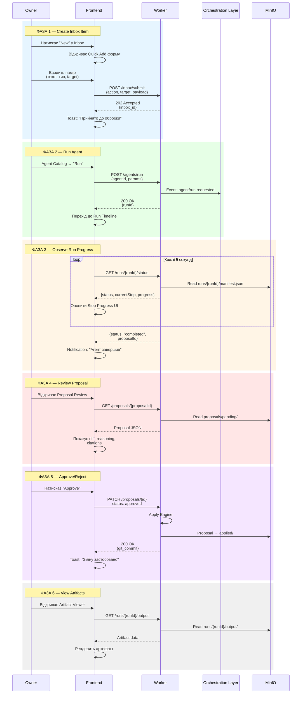
```mermaid
sequenceDiagram
    participant O as Owner
    participant UI as Frontend
    participant W as Worker
    participant OL as Orchestration Layer
    participant S3 as MinIO

    rect rgb(230, 245, 255)
        Note over O,UI: ФАЗА 1 — Create Inbox Item
        O->>UI: Натискає "New" у Inbox
        UI->>UI: Відкриває Quick Add форму
        O->>UI: Вводить намір<br/>(текст, тип, target)
        UI->>W: POST /inbox/submit<br/>{action, target, payload}
        W-->>UI: 202 Accepted<br/>{inbox_id}
        UI->>UI: Toast: "Прийнято до обробки"
    end

    rect rgb(230, 255, 230)
        Note over O,UI: ФАЗА 2 — Run Agent
        O->>UI: Agent Catalog → "Run"
        UI->>W: POST /agents/run<br/>{agentId, params}
        W->>OL: Event: agent/run.requested
        W-->>UI: 200 OK<br/>{runId}
        UI->>UI: Перехід до Run Timeline
    end

    rect rgb(255, 245, 230)
        Note over O,UI: ФАЗА 3 — Observe Run Progress
        loop Кожні 5 секунд
            UI->>W: GET /runs/{runId}/status
            W->>S3: Read runs/{runId}/manifest.json
            W-->>UI: {status, currentStep, progress}
            UI->>UI: Оновити Step Progress UI
        end
        W-->>UI: {status: "completed",<br/>proposalId}
        UI->>UI: Notification: "Агент завершив"
    end

    rect rgb(255, 230, 230)
        Note over O,UI: ФАЗА 4 — Review Proposal
        O->>UI: Відкриває Proposal Review
        UI->>W: GET /proposals/{proposalId}
        W->>S3: Read proposals/pending/
        W-->>UI: Proposal JSON
        UI->>UI: Показує diff, reasoning,<br/>citations
    end

    rect rgb(245, 230, 255)
        Note over O,UI: ФАЗА 5 — Approve/Reject
        O->>UI: Натискає "Approve"
        UI->>W: PATCH /proposals/{id}<br/>status: approved
        W->>W: Apply Engine
        W->>S3: Proposal → applied/
        W-->>UI: 200 OK<br/>{git_commit}
        UI->>UI: Toast: "Зміну застосовано"
    end

    rect rgb(240, 240, 240)
        Note over O,UI: ФАЗА 6 — View Artifacts
        O->>UI: Відкриває Artifact Viewer
        UI->>W: GET /runs/{runId}/output
        W->>S3: Read runs/{runId}/output/
        W-->>UI: Artifact data
        UI->>UI: Рендерить артефакт
    end
```

### 3.3 Альтернативні UX-потоки

| Потік | Тригер | Відмінність від основного |
|-------|--------|--------------------------|
| Telegram → Review | Telegram bot створює Inbox entry | Owner бачить proposal у Inbox UI без фази Run |
| Cron Agent → Notification | Orchestration Layer cron тригер | Без фази Create; Owner отримує notification при completed run |
| Auto-approve | Owner self-proposal або trusted source | Фази Review та Decide відсутні; proposal автоматично applied |
| Rejection | Owner відхиляє proposal | Фаза View показує rejected proposal з decision_note |
| Agent Error | Run завершується з помилкою | Фаза Observe показує error; Proposal не створюється |

---

## 4. Межі авторитету backend

### 4.1 Що вирішує backend (Worker + runtime)

**[ПРИНЦИП]** Backend є **авторитетом** для:

| Аспект | Backend вирішує | Frontend лише |
|--------|----------------|---------------|
| Автентифікація | Валідація JWT, перевірка identity | Зберігає токен, передає у запитах |
| Авторизація | Перевірка прав на дію (Owner, Guest, Agent) | Ховає недоступні UI-елементи (cosmetic) |
| Validation Gate | Валідація Inbox entry (auth, safe_outputs, rate limit) | Показує помилку, якщо entry відхилено |
| Apply | Запис у Git, MinIO, KV | Показує результат (commit hash, applied status) |
| Agent execution | Orchestration Layer + Mastra runtime | Показує progress, не керує виконанням |
| Auto-approve | Оцінка правил, автоматичне схвалення | Не знає про auto-approve (бачить лише результат) |
| Rate limiting | Обмеження запитів від джерела | Показує 429 error |

### 4.2 Що frontend НЕ має права робити

**[ІНВАРІАНТ]** Frontend не змінює canonical storage напряму.

| Заборонена дія | Чому | Правильний шлях |
|---------------|------|-----------------|
| Прямий запис у MinIO | Минає proposal lifecycle | `POST /inbox/submit` → Proposal → Apply |
| Прямий commit у Git | Минає attribution та audit | Worker Apply Engine з атрибуцією |
| Виклик Mastra API | Worker є єдиною точкою входу | `POST /agents/run` через Worker |
| Виклик Orchestration Layer API | Worker є єдиною точкою входу | Worker проксює orchestration events |
| Виклик FastAPI/NotebookLM | Worker є єдиною точкою входу | Agent tools викликають через Mastra |
| Зміна auto-approve правил у KV | Привілейована операція | `PATCH /settings/auto-approve` через Worker з Owner auth |
| Активація агента без Owner consent | Agent Activation Gate обов'язковий | UI показує Activate button, Worker валідує |
| Bypass rejection | Відхилений proposal — final | Новий proposal, не зміна існуючого |

### 4.3 UI як cosmetic guard

**[ПРИНЦИП]** Frontend може **ховати** кнопки та елементи на основі ролі (Owner/Guest), але це **не є авторизацією**. Авторизація — на Worker.

```
UI:    Guest бачить disabled "Run Agent" button → cosmetic guard
Worker: Guest надсилає POST /agents/run → 403 Forbidden → enforcement
```

**[ОБМЕЖЕННЯ]** Ніколи не покладатися на frontend для security. Навіть якщо UI приховає кнопку — будь-який HTTP-клієнт може надіслати запит. Worker enforcement — єдиний авторитет.

---

## 5. Архітектурна діаграма

### 5.1 Frontend у контексті повної архітектури

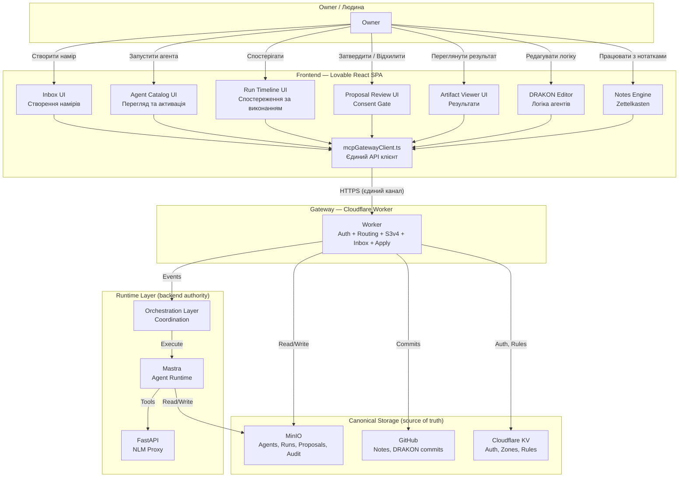
```mermaid
graph TB
    subgraph "Owner / Людина"
        H[Owner]
    end

    subgraph "Frontend — Lovable React SPA"
        direction TB
        F_INBOX[Inbox UI<br/>Створення намірів]
        F_CATALOG[Agent Catalog UI<br/>Перегляд та активація]
        F_TIMELINE[Run Timeline UI<br/>Спостереження за виконанням]
        F_REVIEW[Proposal Review UI<br/>Consent Gate]
        F_ARTIFACT[Artifact Viewer UI<br/>Результати]
        F_DRAKON[DRAKON Editor<br/>Логіка агентів]
        F_NOTES[Notes Engine<br/>Zettelkasten]
        F_CLIENT[mcpGatewayClient.ts<br/>Єдиний API клієнт]
    end

    subgraph "Gateway — Cloudflare Worker"
        W[Worker<br/>Auth + Routing + S3v4 + Inbox + Apply]
    end

    subgraph "Runtime Layer (backend authority)"
        OL[Orchestration Layer<br/>Coordination]
        MA[Mastra<br/>Agent Runtime]
        FA[FastAPI<br/>NLM Proxy]
    end

    subgraph "Canonical Storage (source of truth)"
        S3[MinIO<br/>Agents, Runs, Proposals, Audit]
        GH[GitHub<br/>Notes, DRAKON commits]
        KV[Cloudflare KV<br/>Auth, Zones, Rules]
    end

    H -->|Створити намір| F_INBOX
    H -->|Запустити агента| F_CATALOG
    H -->|Спостерігати| F_TIMELINE
    H -->|Затвердити / Відхилити| F_REVIEW
    H -->|Переглянути результат| F_ARTIFACT
    H -->|Редагувати логіку| F_DRAKON
    H -->|Працювати з нотатками| F_NOTES

    F_INBOX & F_CATALOG & F_TIMELINE & F_REVIEW & F_ARTIFACT & F_DRAKON & F_NOTES --> F_CLIENT

    F_CLIENT -->|"HTTPS (єдиний канал)"| W

    W -->|Events| OL
    W -->|Read/Write| S3
    W -->|Commits| GH
    W -->|Auth, Rules| KV

    OL -->|Execute| MA
    MA -->|Tools| FA
    MA -->|Read/Write| S3
```

### 5.2 Потік даних: UI → Backend → Orchestration → Runtime → Storage → UI


```mermaid
graph LR
    subgraph "1. UI Projection"
        UI_ACTION["Owner дія<br/>(click, form submit)"]
    end

    subgraph "2. Backend Gateway"
        W_AUTH["Worker: Auth + Validate"]
        W_INBOX["Worker: Inbox / Route"]
    end

    subgraph "3. Orchestration"
        OL_EVENT["Orchestration: Event"]
        OL_STEPS["Orchestration: Steps"]
    end

    subgraph "4. Runtime"
        MA_AGENT["Mastra: Agent<br/>interpret _agent.md"]
        MA_TOOLS["Mastra: Tools<br/>(NLM, context, propose)"]
    end

    subgraph "5. Canonical Storage"
        S3_WRITE["MinIO: Write<br/>(proposal, run log)"]
    end

    subgraph "6. UI Projection (updated)"
        UI_READ["Frontend: Read<br/>оновлений стан"]
    end

    UI_ACTION --> W_AUTH --> W_INBOX --> OL_EVENT --> OL_STEPS --> MA_AGENT --> MA_TOOLS --> S3_WRITE --> UI_READ

    style UI_ACTION fill:#e3f2fd
    style UI_READ fill:#e3f2fd
    style W_AUTH fill:#fff3e0
    style W_INBOX fill:#fff3e0
    style OL_EVENT fill:#e8f5e9
    style OL_STEPS fill:#e8f5e9
    style MA_AGENT fill:#fce4ec
    style MA_TOOLS fill:#fce4ec
    style S3_WRITE fill:#f3e5f5
```

**[ПРИНЦИП]** Дані рухаються **по колу**: UI → Backend → Runtime → Storage → UI. Frontend бачить лише початок (ініціювання) та кінець (проєкцію). Середні шари — невидимі для UI.

---

## 6. Архітектурні інваріанти frontend

### Інваріант 1: Єдиний канал комунікації

**[ІНВАРІАНТ]** Frontend комунікує з системою **виключно** через `mcpGatewayClient.ts` → Cloudflare Worker. Жоден компонент не може звертатися до інших сервісів напряму.

### Інваріант 2: Проєкція, не авторитет

**[ІНВАРІАНТ]** Frontend є **read-heavy, write-light** система. Основна функція — відображення. Запис відбувається лише через Inbox submit та Proposal approve/reject.

### Інваріант 3: Proposal lifecycle не можна обійти

**[ІНВАРІАНТ]** Будь-яка зміна canonical storage, ініційована з UI, проходить через повний Inbox → Proposal → Consent Gate → Apply цикл. UI не реалізує "direct save" для жодного артефакту.

### Інваріант 4: Auth enforcement на backend

**[ІНВАРІАНТ]** Frontend UI guards (disabled buttons, hidden elements) є **cosmetic**. Авторитетна перевірка прав — на Worker. Frontend повинен коректно обробляти 401/403 відповіді від Worker.

### Інваріант 5: Offline tolerance

**[ІНВАРІАНТ]** Якщо backend (Worker) недоступний — UI показує стан "offline" з останніми кешованими даними. UI не намагається звертатися до альтернативних endpoints.

### Інваріант 6: Agent runtime is opaque

**[ІНВАРІАНТ]** Frontend не знає про внутрішню реалізацію Mastra чи Orchestration Layer. UI працює з абстракціями: "agent", "run", "step", "proposal". Зміна runtime (наприклад, заміна Mastra на інший фреймворк) не повинна вимагати змін у frontend.

### Інваріант 7: Audit trail visibility

**[ІНВАРІАНТ]** Кожна дія Owner в UI, що призводить до зміни стану (approve, reject, activate, run), має бути видимою в аудит-лозі. Frontend не виконує дій "тихо".

### Інваріант 8: No local state as truth

**[ІНВАРІАНТ]** `localStorage` та `sessionStorage` використовуються лише для UX-оптимізацій (JWT token, UI preferences, cache). Вони ніколи не є source of truth. Очищення localStorage не повинно призводити до втрати даних — лише до необхідності повторної автентифікації.

---

## 7. Маппінг на існуючі компоненти

### 7.1 Існуючі компоненти та їх еволюція

| Існуючий компонент | Поточна функція | Зміна для агентної системи |
|-------------------|-----------------|---------------------------|
| `mcpGatewayClient.ts` (600+ LOC) | Worker API client | Додати методи: agents, runs, proposals, inbox |
| `DrakonEditor.tsx` (27KB) | DRAKON editor для нотаток | Додати save → agent definition через Inbox |
| `DrakonViewer.tsx` (11KB) | Read-only viewer | Додати read з agent definitions |
| `NoteEditor.tsx` | Note editing з Git commit | Зберігання через Inbox замість прямого commit |
| `NoteRenderer.tsx` | Markdown rendering | Додати rendering agent artifacts |
| `AccessZonesManager.tsx` | Zone CRUD | Без змін |
| `useOwnerAuth.tsx` | JWT auth | Без змін |

### 7.2 Нові компоненти (для створення Lovable)

| Компонент | Розділ | Пріоритет |
|-----------|--------|-----------|
| `InboxFeed.tsx` | Inbox UI | Фаза 2 |
| `QuickAddForm.tsx` | Inbox UI | Фаза 2 |
| `AgentCatalog.tsx` | Agent Catalog UI | Фаза 2 |
| `AgentCard.tsx` | Agent Catalog UI | Фаза 2 |
| `RunTimeline.tsx` | Run Timeline UI | Фаза 2 |
| `StepProgress.tsx` | Run Timeline UI | Фаза 2 |
| `ProposalReview.tsx` | Proposal Review UI | Фаза 2 |
| `DiffView.tsx` | Proposal Review UI | Фаза 2 |
| `ArtifactViewer.tsx` | Artifact Viewer UI | Фаза 2 |

**[РІШЕННЯ]** Нові компоненти створюються у `src/components/garden/` (domain components, territory Lovable). Hooks для них — у `src/hooks/` (territory Claude).

---

---

## Див. також

- **INBOX_ТА_ЦИКЛ_ЗАПУСКУ_V1.md** — state machines Inbox та Run: стани, transitions, TypeScript interfaces для UI
- **СИСТЕМА_PROPOSAL_V1.md** — Proposal lifecycle: стани, семантика `reviewing`, concurrent proposals, TypeScript interfaces
- **КОНТРАКТИ_API_V1.md** — повні JSON schemas для всіх endpoints (request/response)

---

*Цей документ визначає контракт frontend з runtime-архітектурою. Він є обов'язковим для Lovable-імплементації. Зміни цього контракту потребують рішення архітектора.*


---

## Семантичні зв'язки

**Цей документ є частиною:**
- [[АРХІТЕКТУРНИЙ_КОРІНЬ]] — A6: Frontend reads only, не пише

**Цей документ залежить від:**
- [[КАНОНІЧНА_АРХІТЕКТУРА_ВИКОНАННЯ]] — загальна runtime архітектура
- [[КОНТРАКТИ_API_V1]] — API schemas для Frontend інтеграції
- [[INBOX_ТА_PROPOSAL_АРХІТЕКТУРА]] — Proposal lifecycle для UI відображення

**Від цього документа залежають:**
- [[ДИРЕКТИВА_УЗГОДЖЕННЯ_FRONTEND_V1]] — конкретні невідповідності UI
- [[ПЛАН_МІГРАЦІЇ_FRONTEND_V1]] — план усунення невідповідностей

---

*Цей документ визначає контракт між Lovable Frontend та canonical runtime архітектурою.*
```
---
### frontend/ДИРЕКТИВА_УЗГОДЖЕННЯ_FRONTEND_V1.md
**Розмір:** 19,800 байт
```text
---
tags:
  - domain:frontend
  - status:canonical
  - format:guide
created: 2026-02-15
updated: 2026-02-21
tier: 2
title: "ДИРЕКТИВА УЗГОДЖЕННЯ FRONTEND V1"
dg-publish: true
dg-metatags:
dg-home:
---

# Frontend Alignment Directive V1

> Автор: Principal Architect (Claude Opus 4.6)
> Дата: 2026-02-15
> Статус: CANONICAL
> Аудиторія: Lovable frontend developers
> Scope: ТІЛЬКИ frontend зміни для узгодження з canonical API contracts

---

## Резюме (1 сторінка)

Frontend Garden Seedling має **критичні розбіжності** з canonical backend API contracts. Цей документ містить точні інструкції що і де виправити.

**Масштаб проблеми:**

| Категорія | Серйозність | Кількість файлів |
|-----------|-------------|------------------|
| Proposal API endpoints невірні | 🔴 P0 | 2 (client + UI) |
| ErrorCode enum неповний | 🔴 P0 | 1 (types) |
| Gateway URL дублюється | 🔴 P0 | 8 файлів |
| Direct fetch() bypass gateway | 🟡 P1 | 17+ файлів |
| Correlation ID відсутній | 🟡 P1 | 0 (потрібно додати) |
| ProposalStatus неповний | 🔴 P0 | 1 (types) |

**Canonical джерела істини:**
- `docs/backend/КОНТРАКТИ_API_V1.md` — API endpoints, error codes, headers
- `docs/architecture/СИСТЕМА_PROPOSAL_V1.md` — proposal state machine, approval semantics
- `docs/frontend/LOVABLE_УЗГОДЖЕННЯ_З_АРХІТЕКТУРОЮ_ВИКОНАННЯ.md` — frontend invariants

**Головний інваріант:** Frontend НІКОЛИ не звертається до Mastra, Orchestration Layer, FastAPI або MinIO напряму. Єдиний канал — `mcpGatewayClient.ts` → Cloudflare Worker.

---

## A. Contract Truth Table

### A.1 Gateway Invariant

| # | Правило | Canonical джерело | Поточний стан | Дія |
|---|---------|-------------------|---------------|-----|
| G1 | Єдине джерело URL: `getGatewayBaseUrl()` з `mcpGatewayClient.ts` | LOVABLE_УЗГОДЖЕННЯ §1.2, RUNTIME_ARCHITECTURE_INDEX Invariant 7 | **ПОРУШЕНО** — 8 файлів визначають власну константу `MCP_GATEWAY_URL` або `GATEWAY_URL` | P0: видалити всі локальні константи, імпортувати `getGatewayBaseUrl()` |
| G2 | Всі HTTP-запити через `requestJson<T>()` | LOVABLE_УЗГОДЖЕННЯ §1.2 Invariant 1 | **ПОРУШЕНО** — 17+ файлів використовують `fetch()` напряму | P1: мігрувати на `requestJson()` або спеціалізовані методи клієнта |
| G3 | Auth token додається автоматично gateway клієнтом | API_CONTRACTS_V1 §0.2 | Працює в `requestJson()`, **НЕ працює** в direct `fetch()` | Вирішується через G2 |

**Файли з порушенням G1 (дубльований URL):**

| Файл | Рядок | Ім'я константи |
|------|-------|----------------|
| `src/pages/NotePage.tsx` | ~10 | `MCP_GATEWAY_URL` |
| `src/hooks/useAnnotations.ts` | ~14 | `GATEWAY_URL` |
| `src/hooks/useZoneValidation.ts` | ~35 | `MCP_GATEWAY_URL` |
| `src/hooks/useOwnerAuth.tsx` | ~38 | `MCP_GATEWAY_URL` |
| `src/hooks/useComments.ts` | ~15 | `GATEWAY_URL` |
| `src/hooks/useMCPSessions.ts` | ~49 | `MCP_GATEWAY_URL` |
| `src/components/garden/ZoneCommentSection.tsx` | ~18 | `MCP_GATEWAY_URL` |
| `src/hooks/useAccessZones.ts` | ~72 | ✅ Вже використовує `getGatewayBaseUrl()` |

### A.2 Proposal Endpoints & Bodies

| # | Операція | Canonical (API_CONTRACTS_V1 §3.3) | Поточний frontend | Дія |
|---|----------|-----------------------------------|--------------------|-----|
| P1 | Approve proposal | `PATCH /proposals/{id}` body: `{"status": "approved", "decision_note": "..."}` | **НЕВІРНО**: `POST /proposals/{id}/accept` з порожнім body | P0: переписати `acceptProposal()` |
| P2 | Reject proposal | `PATCH /proposals/{id}` body: `{"status": "rejected", "decision_note": "..."}` (decision_note ОБОВ'ЯЗКОВИЙ, min 10 chars) | **НЕВІРНО**: `POST /proposals/{id}/reject` з порожнім body | P0: переписати `rejectProposal()`, додати textarea для decision_note |
| P3 | Batch approve/reject | `PATCH /proposals/batch` body: `{"proposal_ids": [...], "status": "approved"\|"rejected", "decision_note": "..."}` | **ВІДСУТНЄ** | P1: додати `batchUpdateProposals()` |
| P4 | Proposal statuses | `pending → approved \| rejected \| auto_approved \| expired`, потім `applying → applied \| failed` | **НЕПОВНИЙ**: ProposalStatus type відсутні `auto_approved`, `applying`, `expired`, `failed` | P0: оновити ProposalStatus type |
| P5 | `reviewing` стан | UI-only; НЕ серверний стан. Використовується лише для оптимістичного UI | Не реалізовано явно | P1: додати як UI-local state |

**Canonical approve request:**
```
PATCH /api/v1/proposals/{proposal_id}
Content-Type: application/json
Authorization: Bearer {token}

{
  "status": "approved",
  "decision_note": "Підтверджено після перегляду"
}
```

**Canonical reject request:**
```
PATCH /api/v1/proposals/{proposal_id}
Content-Type: application/json
Authorization: Bearer {token}

{
  "status": "rejected",
  "decision_note": "Не відповідає вимогам зони — потрібно уточнити формулювання"
}
```

**Canonical batch request:**
```
PATCH /api/v1/proposals/batch
Content-Type: application/json
Authorization: Bearer {token}

{
  "proposal_ids": ["uuid-1", "uuid-2"],
  "status": "approved",
  "decision_note": "Batch approval після ревю"
}
```

### A.3 Error Model (Appendix A)

| # | Правило | Canonical (API_CONTRACTS_V1 Appendix A) | Поточний frontend | Дія |
|---|---------|----------------------------------------|--------------------|-----|
| E1 | Error response format | `{"error": {"code": "...", "message": "...", "details": {...}}}` | Частково реалізовано в `requestJson()` | Перевірити відповідність |
| E2 | ErrorCode enum — 14 кодів | Повний список нижче | **НЕПОВНИЙ** — відсутні ~10 кодів | P0: додати всі коди |
| E3 | `retryable` поле | Кожен код має retryable flag | **ВІДСУТНЄ** | P1: додати retry logic |
| E4 | `Retry-After` header | Надається при 429 та 503 | **НЕ ПАРСИТЬСЯ** | P1: додати parsing |

**Canonical ErrorCode enum (повний список):**

| Код | HTTP | Retryable | Категорія |
|-----|------|-----------|-----------|
| `AUTH_REQUIRED` | 401 | ❌ | Auth |
| `FORBIDDEN` | 403 | ❌ | Auth |
| `TOKEN_EXPIRED` | 401 | ❌ | Auth |
| `NOT_FOUND` | 404 | ❌ | Resource |
| `VALIDATION_FAILED` | 422 | ❌ | Input |
| `INVALID_JSON` | 400 | ❌ | Input |
| `INVALID_TRANSITION` | 409 | ❌ | State |
| `INVALID_AGENT_TRANSITION` | 409 | ❌ | State |
| `CONCURRENT_MODIFICATION` | 409 | ✅ | State |
| `DUPLICATE_ENTRY` | 409 | ❌ | State |
| `RATE_LIMITED` | 429 | ✅ | Throttle |
| `UPSTREAM_UNAVAILABLE` | 502 | ✅ | Infra |
| `NLM_UNAVAILABLE` | 503 | ✅ | Infra |
| `AGENT_TIMEOUT` | 504 | ✅ | Infra |

**Коди наявні у frontend (`src/types/mcpGateway.ts`):**
`AUTH_REQUIRED`, `FORBIDDEN`, `NOT_FOUND`, `RATE_LIMITED` — **лише 4 з 14**.

### A.4 Correlation ID

| # | Правило | Canonical (API_CONTRACTS_V1 §7.1) | Поточний frontend | Дія |
|---|---------|-----------------------------------|--------------------|-----|
| C1 | Header `X-Correlation-Id` на всіх mutating requests (POST, PATCH, DELETE) | Обов'язковий для трейсингу | **ВІДСУТНІЙ** — 0 використань | P1: генерувати UUID v4, додавати в `requestJson()` |
| C2 | Correlation ID логується у console для debug | Рекомендовано | Відсутнє | P1: додати logging |
| C3 | Backend повертає той самий ID у response header | Для end-to-end tracing | Frontend не читає response headers | P1: зберігати для error reporting |

---

## B. Lovable Implementation Directive

### B.1 P0 — Mandatory Changes (блокують інтеграцію)

#### P0-1: Виправити Proposal API endpoints

**Файл:** `src/lib/api/mcpGatewayClient.ts`

**acceptProposal() (~рядок 510-518):**
- Замінити `POST /proposals/${proposalId}/accept` на `PATCH /proposals/${proposalId}`
- Body: `{ status: "approved", decision_note: string }`
- decision_note може бути порожнім при approve (опціональний)

**rejectProposal() (~рядок 520-528):**
- Замінити `POST /proposals/${proposalId}/reject` на `PATCH /proposals/${proposalId}`
- Body: `{ status: "rejected", decision_note: string }`
- decision_note **ОБОВ'ЯЗКОВИЙ** при reject, мінімум 10 символів

**Файл:** `src/components/garden/ProposalsInbox.tsx`

**handleReject (~рядки 95-109):**
- Додати textarea або modal для введення `decision_note`
- Валідувати: `decision_note.length >= 10`
- Показувати помилку якщо менше 10 символів

**handleAccept (~рядки 59-93):**
- Додати опціональне поле для `decision_note` (може бути порожнім)

#### P0-2: Оновити GatewayErrorCode enum

**Файл:** `src/types/mcpGateway.ts` (~рядки 13-25)

Додати відсутні коди до `GatewayErrorCode`:
```typescript
type GatewayErrorCode =
  // Auth
  | 'AUTH_REQUIRED'
  | 'FORBIDDEN'
  | 'TOKEN_EXPIRED'
  // Resource
  | 'NOT_FOUND'
  // Input
  | 'VALIDATION_FAILED'
  | 'INVALID_JSON'
  // State
  | 'INVALID_TRANSITION'
  | 'INVALID_AGENT_TRANSITION'
  | 'CONCURRENT_MODIFICATION'
  | 'DUPLICATE_ENTRY'
  // Throttle
  | 'RATE_LIMITED'
  // Infra
  | 'UPSTREAM_UNAVAILABLE'
  | 'NLM_UNAVAILABLE'
  | 'AGENT_TIMEOUT';
```

#### P0-3: Оновити ProposalStatus type

**Файл:** `src/types/mcpGateway.ts`

Canonical statuses (PROPOSAL_SYSTEM_V1 §2):
```typescript
type ProposalStatus =
  | 'pending'
  | 'approved'
  | 'rejected'
  | 'auto_approved'
  | 'expired'
  | 'applying'
  | 'applied'
  | 'failed';
```

Оновити `EditProposal` interface відповідно.

#### P0-4: Елімінувати дублювання Gateway URL

Для кожного з 7 файлів (список у Truth Table A.1):
1. Видалити локальну константу `MCP_GATEWAY_URL` / `GATEWAY_URL`
2. Додати імпорт: `import { getGatewayBaseUrl } from '@/lib/api/mcpGatewayClient'`
3. Замінити використання на `getGatewayBaseUrl()`

**Або (краще):** мігрувати ці файли на використання методів `mcpGatewayClient` замість прямих `fetch()` — це одночасно вирішує P0-4 та частину P1-1.

### B.2 P1 — Recommended Changes (покращують надійність)

#### P1-1: Мігрувати direct fetch() на gateway client

17+ файлів використовують `fetch()` напряму. Пріоритет міграції:

| Пріоритет | Файл | fetch() викликів | Причина |
|-----------|------|------------------|---------|
| Високий | `src/hooks/useComments.ts` | 4 | Mutating operations без auth |
| Високий | `src/hooks/useAnnotations.ts` | 3 | Mutating operations |
| Високий | `src/hooks/useZoneValidation.ts` | 2 | Auth-sensitive |
| Середній | `src/hooks/useAccessZones.ts` | 2 | Auth-sensitive |
| Середній | `src/components/garden/ZoneCommentSection.tsx` | 2 | User-facing |
| Середній | `src/hooks/useOwnerAuth.tsx` | 1 | Auth flow |
| Середній | `src/hooks/useMCPSessions.ts` | 1 | Session management |
| Середній | `src/pages/NotePage.tsx` | 1 | Data fetching |
| Низький | `src/hooks/useDrakonDiagram.ts` | 1 | Static asset |
| Низький | `src/components/garden/ZoneQRDialog.tsx` | 1 | Static asset |

Для кожного файлу:
1. Замінити `fetch(url, { method, headers, body })` на відповідний метод `mcpGatewayClient`
2. Або використати `requestJson<T>()` напряму
3. Видалити локальну побудову headers (auth, content-type)

#### P1-2: Додати Correlation ID

**Файл:** `src/lib/api/mcpGatewayClient.ts`

У `requestJson()`:
```typescript
// Для mutating requests (POST, PATCH, DELETE) — генерувати та додавати header
if (['POST', 'PATCH', 'DELETE'].includes(method)) {
  const correlationId = crypto.randomUUID();
  headers['X-Correlation-Id'] = correlationId;
  console.debug(`[gateway] ${method} ${url} correlation=${correlationId}`);
}
```

#### P1-3: Додати batch proposal support

**Файл:** `src/lib/api/mcpGatewayClient.ts`

Додати метод:
```typescript
async function batchUpdateProposals(
  proposalIds: string[],
  status: 'approved' | 'rejected',
  decisionNote: string
): Promise<BatchProposalResponse>
```

Endpoint: `PATCH /proposals/batch`

**Файл:** `src/components/garden/ProposalsInbox.tsx`

Додати UI для "Select All" + batch approve/reject.

#### P1-4: Retry-After header parsing

**Файл:** `src/lib/api/mcpGatewayClient.ts`

При отриманні 429 або 503:
1. Прочитати `Retry-After` header
2. Показати користувачу час очікування
3. Опціонально: авто-retry після вказаного інтервалу

#### P1-5: CONCURRENT_MODIFICATION handling

При отриманні 409 з кодом `CONCURRENT_MODIFICATION`:
1. Показати toast: "Дані змінились. Оновлюємо..."
2. Invalidate відповідний TanStack Query cache
3. Re-fetch актуальні дані

---

## C. Anti-Patterns (ЗАБОРОНЕНО)

| # | Anti-pattern | Чому заборонено | Що робити замість |
|---|-------------|-----------------|-------------------|
| AP1 | `const MCP_GATEWAY_URL = import.meta.env.VITE_...` у будь-якому файлі крім `mcpGatewayClient.ts` | Порушує Gateway Invariant (G1). Зміна URL вимагає правки N файлів | Імпортувати `getGatewayBaseUrl()` |
| AP2 | `fetch(url)` для API calls поза `mcpGatewayClient.ts` | Bypass auth, error handling, timeout, headers | Використовувати `requestJson()` або методи клієнта |
| AP3 | `POST /proposals/{id}/accept` або `/reject` | Не існує в canonical API | `PATCH /proposals/{id}` з body `{status, decision_note}` |
| AP4 | Reject без `decision_note` | Canonical вимагає min 10 chars для reject | Показати textarea, валідувати довжину |
| AP5 | Ігнорування error.code у відповідях | Втрачається інформація для retry logic та UX | Парсити `error.code`, реагувати відповідно до категорії |
| AP6 | Hardcoded proposal statuses (тільки pending/approved/rejected) | Пропускає canonical states | Використовувати повний ProposalStatus type |

---

## D. Acceptance Criteria Checklist

### D.1 Grep-перевірки (автоматизовані)

```bash
# Має повернути 0 результатів (окрім mcpGatewayClient.ts):
grep -rn "MCP_GATEWAY_URL\|GATEWAY_URL" src/ --include="*.ts" --include="*.tsx" \
  | grep -v "mcpGatewayClient.ts" \
  | grep -v "getGatewayBaseUrl"
# Очікувано: 0 рядків

# Має повернути 0 результатів:
grep -rn "/accept\|/reject" src/lib/api/mcpGatewayClient.ts
# Очікувано: 0 рядків (старі endpoints видалені)

# Має повернути результати (нові endpoints):
grep -rn "PATCH.*proposals" src/lib/api/mcpGatewayClient.ts
# Очікувано: ≥2 рядки (approve + reject)

# decision_note присутній:
grep -rn "decision_note" src/lib/api/mcpGatewayClient.ts
# Очікувано: ≥2 рядки

# Correlation ID header:
grep -rn "X-Correlation-Id" src/lib/api/mcpGatewayClient.ts
# Очікувано: ≥1 рядок (P1)
```

### D.2 TypeScript перевірки

- [ ] `GatewayErrorCode` містить всі 14 кодів з Appendix A
- [ ] `ProposalStatus` містить всі 8 canonical станів
- [ ] `EditProposal` interface відповідає canonical `Proposal`
- [ ] `npm run build` проходить без помилок після змін
- [ ] `npm run lint` проходить без помилок

### D.3 Функціональні перевірки

- [ ] Approve proposal відправляє `PATCH /proposals/{id}` з `{"status": "approved"}`
- [ ] Reject proposal відправляє `PATCH /proposals/{id}` з `{"status": "rejected", "decision_note": "..."}` (min 10 chars)
- [ ] Reject без decision_note показує помилку валідації в UI
- [ ] Жоден файл крім `mcpGatewayClient.ts` не містить hardcoded gateway URL
- [ ] Error responses парсяться з поля `error.code`

### D.4 Інваріанти (НІКОЛИ не порушувати)

1. **Single Gateway** — `mcpGatewayClient.ts` = єдиний HTTP клієнт для backend API
2. **No Direct Backend** — frontend НІКОЛИ не звертається до Mastra, Orchestration Layer, FastAPI, MinIO
3. **Opaque Runtime** — frontend не знає деталей agent runtime (Mastra internals)
4. **Canonical States** — ProposalStatus та ErrorCode ТОЧНО відповідають canonical docs
5. **Decision Note Required** — reject ЗАВЖДИ вимагає decision_note ≥ 10 символів

---

## Changelog

| Версія | Дата | Зміни |
|--------|------|-------|
| V1 | 2026-02-15 | Initial directive: truth table, P0/P1 changes, acceptance criteria |

---

*Canonical джерела: КОНТРАКТИ_API_V1.md, СИСТЕМА_PROPOSAL_V1.md, LOVABLE_УЗГОДЖЕННЯ_З_АРХІТЕКТУРОЮ_ВИКОНАННЯ.md*


---

## Семантичні зв'язки

**Цей документ є частиною:**
- [[LOVABLE_УЗГОДЖЕННЯ_З_АРХІТЕКТУРОЮ_ВИКОНАННЯ]] — деталізує критичні невідповідності

**Цей документ залежить від:**
- [[LOVABLE_УЗГОДЖЕННЯ_З_АРХІТЕКТУРОЮ_ВИКОНАННЯ]] — основний контракт Frontend з архітектурою
- [[АРХІТЕКТУРНИЙ_КОРІНЬ]] — аксіоми A5, A6: Gateway authority, Frontend reads only
- [[КОНТРАКТИ_API_V1]] — API contracts для коригування

**Від цього документа залежать:**
- [[ПЛАН_МІГРАЦІЇ_FRONTEND_V1]] — план виконання директиви

---

*Цей документ визначає критичні невідповідності між Frontend реалізацією та canonical архітектурою.*
```
---
### frontend/ux-audit/UX_АУДИТ_СИСТЕМИ_V1.md
**Розмір:** 40,752 байт
```text
---
tags:
  - domain:frontend
  - status:canonical
  - format:audit
created: 2026-02-22
updated: 2026-02-22
title: "UX АУДИТ СИСТЕМИ V1"
dg-publish: true
---

# Garden Bloom: UX Аудит системи V1

> Створено: 2026-02-22
> Автор: UX архітектор
> Статус: Канонічний
> Мова: Українська

---

## I. Повна інвентаризація інтерфейсів

---

### 1. Головна сторінка (Index)

| Параметр | Значення |
|----------|----------|
| **Шлях** | `/` |
| **Призначення** | Точка входу: огляд останніх нотаток, хмара тегів, попередній перегляд графу, пов'язані думки |
| **Основні складові** | `GardenHeader`, `TagCloud`, `ConnectedThoughts`, `KnowledgeMapPreview`, `NoteCard` (×5), `GardenFooter` |
| **Дії користувача** | Перехід до нотатки, тегу, графу, пошук, зміна теми/мови |
| **Можливі стани** | Нормальний (дані є), порожній (немає нотаток) |
| **Обмеження доступу** | Публічний (читання). Кнопки редагування — лише для Owner |
| **Дані читає** | `getAllNotes()`, `getOutboundLinks()` — статичний бандл |
| **Дані змінює** | Нічого |
| **Архітектурні залежності** | `noteLoader`, `linkGraph`, `useLocale`, `useOwnerAuth` |

---

### 2. Перегляд нотатки (NotePage)

| Параметр | Значення |
|----------|----------|
| **Шлях** | `/notes/*` |
| **Призначення** | Відображення окремої нотатки з метаданими, тегами, зворотніми посиланнями, коментарями, локальним графом |
| **Основні складові** | `GardenHeader`, `NoteLayout` → `NoteRenderer`, `BacklinksSection`, `LocalGraphView`, `CommentSection`, `AnnotationLayer`, `MemoryPanel`, `DeleteNoteDialog`, `GardenFooter` |
| **Дії користувача** | Читання, навігація по wiki-посиланнях, перехід до тегів, коментування (Owner), видалення (Owner), перехід до редактора |
| **Можливі стани** | Знайдено, Очікує синхронізації (pending), Не знайдено (404), Завантаження |
| **Обмеження доступу** | Читання — публічне. Edit/Delete/Memory — Owner |
| **Дані читає** | `getNoteBySlug()` (бандл), `getGitStatus()` (API), backlinks, localGraph |
| **Дані змінює** | Коментарі (Owner), видалення (Owner → API) |
| **Архітектурні залежності** | `noteLoader`, `linkGraph`, `mcpGatewayClient`, `useComments`, `useAnnotations`, `useBacklinks` |

---

### 3. Файлова структура (FilesPage)

| Параметр | Значення |
|----------|----------|
| **Шлях** | `/files` |
| **Призначення** | Деревовидна візуалізація всіх нотаток та папок |
| **Основні складові** | `GardenHeader`, `FolderItem` (рекурсивний), `ExportModal`, `GardenFooter` |
| **Дії користувача** | Розгортання/згортання папок, перехід до нотатки, створення нотатки/DRAKON в папці, експорт |
| **Можливі стани** | Нормальний, порожній (немає файлів), автоматичне розгортання з `?folder=` |
| **Обмеження доступу** | Читання — публічне. Створення — Owner |
| **Дані читає** | `getFolderStructure()`, `getHomeNote()` |
| **Дані змінює** | Нічого |
| **Архітектурні залежності** | `noteLoader`, `useOwnerAuth`, `useLocale` |

---

### 4. Граф знань (GraphPage)

| Параметр | Значення |
|----------|----------|
| **Шлях** | `/graph` |
| **Призначення** | Інтерактивна force-directed візуалізація всього knowledge graph |
| **Основні складові** | `GardenHeader`, `GlobalGraphView` (SVG canvas), `GraphDebugPanel`, `GardenFooter` |
| **Дії користувача** | Масштабування (колесо/кнопки), панорамування, фокусування на вузлі, розширення рівнів, ізоляція підграфа, фільтрація типів зв'язків, навігація до нотатки (подвійний клік) |
| **Можливі стани** | Нормальний, порожній, фокусований вузол, ізольований підграф |
| **Обмеження доступу** | Публічний |
| **Дані читає** | `getFullGraph()` |
| **Дані змінює** | Нічого |
| **Архітектурні залежності** | `linkGraph`, force simulation (custom), canvas rendering |

---

### 5. Реєстр агентів (AgentsPage)

| Параметр | Значення |
|----------|----------|
| **Шлях** | `/agents` |
| **Призначення** | CRUD-інтерфейс для визначень AI-агентів |
| **Основні складові** | `AgentCard`, `AgentForm` (Sheet), `AlertDialog` (підтвердження видалення) |
| **Дії користувача** | Створення, редагування, видалення, зміна порядку (up/down), розгортання деталей |
| **Можливі стани** | Порожній, список агентів, форма відкрита (створення/редагування), діалог підтвердження видалення |
| **Обмеження доступу** | Тільки Owner (редирект на `/` для інших) |
| **Дані читає** | `localStorage` (useAgentRegistry) |
| **Дані змінює** | `localStorage` (CRUD агентів) |
| **Архітектурні залежності** | `useAgentRegistry`, `useOwnerAuth`, Zod validation |

---

### 6. Чат (ChatPage)

| Параметр | Значення |
|----------|----------|
| **Шлях** | `/chat` |
| **Призначення** | Комунікаційний інтерфейс з табами People та NotebookLM |
| **Основні складові** | `ChatCanvas`, `AccessZonesWall`, `ProposalsInbox`, `NotebookLMChatTab` |
| **Дії користувача** | Перемикання табів, надсилання повідомлень, перегляд зон, перегляд та обробка пропозицій |
| **Можливі стани** | People tab (3-колонковий layout: чат + зони + пропозиції), NotebookLM tab |
| **Обмеження доступу** | Публічний доступ, але функціональність зон та пропозицій — Owner |
| **Дані читає** | Зони (API), пропозиції (API), чат-повідомлення (localStorage) |
| **Дані змінює** | Повідомлення, прийняття/відхилення пропозицій |
| **Архітектурні залежності** | `useColleagueChat`, `useAccessZones`, `mcpGatewayClient`, `useNotebookLMChats` |

---

### 7. Редактор нотаток (EditorPage)

| Параметр | Значення |
|----------|----------|
| **Шлях** | `/notes/new`, `/notes/:slug/edit` |
| **Призначення** | Створення та редагування Markdown-нотаток |
| **Основні складові** | `GardenHeader`, `EditorFolderTree` (бічне дерево), `NoteEditor`, `EditorToolbar`, `WikilinkAutocomplete`, `DeleteNoteDialog` |
| **Дії користувача** | Введення заголовка, редагування Markdown, додавання тегів, вибір папки, збереження, скасування, видалення, вставка wiki-посилань |
| **Можливі стани** | Новий/існуючий, чистий/брудний (isDirty), збереження в процесі, є чернетка |
| **Обмеження доступу** | Тільки Owner (Access Denied для інших) |
| **Дані читає** | `getNoteBySlug()`, дерево папок, чернетки (localStorage) |
| **Дані змінює** | Нотатки (API → git commit), чернетки (localStorage) |
| **Архітектурні залежності** | `useNoteEditor`, `mcpGatewayClient`, `useOwnerAuth` |

---

### 8. Редактор DRAKON (DrakonPage)

| Параметр | Значення |
|----------|----------|
| **Шлях** | `/drakon` |
| **Призначення** | Візуальний редактор DRAKON-діаграм |
| **Основні складові** | `GardenHeader`, `DrakonEditor`, `EditorFolderTree`, `GardenFooter` |
| **Дії користувача** | Створення/відкриття діаграм, редагування візуально, збереження, вибір папки |
| **Можливі стани** | Новий/існуючий, редагування |
| **Обмеження доступу** | Тільки Owner |
| **Дані читає** | Діаграми зі сховища |
| **Дані змінює** | Діаграми (API) |
| **Архітектурні залежності** | `useDrakonDiagram`, `DrakonWidget` (vendor), `useOwnerAuth` |

---

### 9. Налаштування (AdminSettingsPage)

| Параметр | Значення |
|----------|----------|
| **Шлях** | `/admin/settings` |
| **Призначення** | Налаштування безпеки, контролю доступу, діагностики |
| **Основні складові** | Tabs: Security (зміна паролю), Access Control, Diagnostics (Health/Git/NotebookLM), Advanced |
| **Дії користувача** | Зміна паролю, перехід до зон, перевірка health endpoint, тестування Git status, тестування NotebookLM |
| **Можливі стани** | 4 таби, форма зміни паролю, результати діагностики |
| **Обмеження доступу** | Тільки Owner (редирект) |
| **Дані читає** | API: health, auth/status, git/status |
| **Дані змінює** | Пароль Owner |
| **Архітектурні залежності** | `useOwnerAuth`, `mcpGatewayClient` |

---

### 10. Зони доступу (AdminZonesPage)

| Параметр | Значення |
|----------|----------|
| **Шлях** | `/admin/zones` |
| **Призначення** | Управління делегованими зонами доступу |
| **Основні складові** | `Layout`, `AccessZonesManager` |
| **Дії користувача** | Створення зон, налаштування TTL, вибір нотаток, генерація QR/посилань, видалення |
| **Можливі стани** | Список зон (порожній/заповнений), форма створення |
| **Обмеження доступу** | Тільки Owner |
| **Дані читає** | Зони (API/localStorage) |
| **Дані змінює** | Зони (створення/видалення) |
| **Архітектурні залежності** | `useAccessZones`, `useOwnerAuth` |

---

### 11. Перегляд зони (ZoneViewPage)

| Параметр | Значення |
|----------|----------|
| **Шлях** | `/zone/:zoneId?code=...` |
| **Призначення** | Гостьовий доступ до делегованих нотаток |
| **Основні складові** | Мінімальний header, сайдбар нотаток, `ZoneNoteRenderer`, `ZoneCommentSection`, `ZoneNotebookLMChat`, прогрес-бар TTL |
| **Дії користувача** | Вибір нотатки, читання, коментування, пропонування змін, чат з NotebookLM |
| **Можливі стани** | Завантаження, Зона прострочена, Доступ заборонено, Consent Gate, Нормальний перегляд |
| **Обмеження доступу** | Доступ за кодом (accessCode) + TTL. AccessGuard пропускає `/zone/*` |
| **Дані читає** | Зона + нотатки (через useZoneValidation) |
| **Дані змінює** | Коментарі, пропозиції змін |
| **Архітектурні залежності** | `useZoneValidation`, `ZoneConsentGate`, `mcpGatewayClient` |

---

### 12. Редагування в зоні (ZoneEditPage)

| Параметр | Значення |
|----------|----------|
| **Шлях** | `/zone/:zoneId/edit/:noteSlug?code=...` |
| **Призначення** | Пропонування змін до нотатки гостем зони |
| **Дії користувача** | Редагування тексту, введення імені гостя, надсилання пропозиції |
| **Обмеження доступу** | Доступ за кодом зони |
| **Дані змінює** | Створює Proposal (pending) |

---

### 13. Сторінка тегів (TagsIndex)

| Параметр | Значення |
|----------|----------|
| **Шлях** | `/tags` |
| **Призначення** | Перелік усіх тегів з кількістю нотаток |
| **Основні складові** | `GardenHeader`, Tag Grid, `GardenFooter` |
| **Дії користувача** | Перехід до тегу |
| **Обмеження доступу** | Публічний |
| **Дані читає** | `useAllTags()` |
| **Дані змінює** | Нічого |

---

### 14. Сторінка тегу (TagPage)

| Параметр | Значення |
|----------|----------|
| **Шлях** | `/tags/:tag` |
| **Призначення** | Список нотаток за конкретним тегом |
| **Обмеження доступу** | Публічний |

---

### 15. Діагностика (AdminDiagnosticsPage)

| Параметр | Значення |
|----------|----------|
| **Шлях** | `/admin/diagnostics` |
| **Призначення** | Перевірка стану Gateway, Git, NotebookLM, помилки API |
| **Основні складові** | Cards: Runtime, Git Status, NotebookLM Chat test, API Errors |
| **Обмеження доступу** | Публічний (але функціональність потребує Gateway) |

---

### 16. Політика конфіденційності (PolicyPage)

| Параметр | Значення |
|----------|----------|
| **Шлях** | `/policy/delegated-zone-confidentiality` |
| **Призначення** | Відображення умов конфіденційності для делегованих зон (мультимовна) |
| **Обмеження доступу** | Публічний |

---

### 17. Початкове налаштування (OwnerSetupWizard)

| Параметр | Значення |
|----------|----------|
| **Контекст** | Відображається до ініціалізації системи |
| **Призначення** | Створення master-паролю Owner |
| **Дії користувача** | Введення паролю (2×), підтвердження |
| **Обмеження доступу** | Тільки до першої ініціалізації |
| **Дані змінює** | Створює хеш паролю |

---

### 18. Авторизаційний бар'єр (AccessGuard / AccessGateUI)

| Параметр | Значення |
|----------|----------|
| **Контекст** | Обгортка всіх маршрутів (крім `/zone/*`) |
| **Призначення** | Блокування неавторизованого доступу, показ форми логіну |
| **Можливі стани** | Завантаження, Gateway недоступний (пропускає), Неавторизований (логін), Авторизований (контент) |
| **Дані читає** | `useOwnerAuth` (gatewayAvailable, isAuthenticated) |

---

### 19. Меню власника (OwnerMenu)

| Параметр | Значення |
|----------|----------|
| **Контекст** | Частина `GardenHeader` (тільки для Owner) |
| **Призначення** | Швидкий доступ до Settings, Zones, Agents, Help, Logout |
| **Дії користувача** | Перехід до адмін-сторінок, вихід |
| **Адаптивність** | Компактний режим на мобільному (тільки іконка) |

---

### 20. Панель пам'яті агента (MemoryPanel)

| Параметр | Значення |
|----------|----------|
| **Контекст** | Sheet в NoteLayout (для Owner) |
| **Призначення** | Пошук, перегляд контексту, додавання до пам'яті агента |
| **Табами** | Search, Context (4 рівні глибини), Add |
| **Обмеження доступу** | Тільки Owner (потребує auth) |
| **Дані читає** | Agent Memory API (search, context, entities) |
| **Дані змінює** | Agent Memory (processText → commit) |

---

## II. Матриця можливостей

| Інтерфейс | Читання | Запис | Підтвердження | Зміна порядку | Фільтрація | Пошук | Обмеження доступу | Коментар |
|---|---|---|---|---|---|---|---|---|
| **Index** | ✅ | ❌ | ❌ | ❌ | ❌ | ✅ (header) | Публічний | Тільки перегляд |
| **NotePage** | ✅ | ✅ (коментарі) | ✅ (видалення) | ❌ | ❌ | ❌ | Публ. + Owner | — |
| **FilesPage** | ✅ | ❌ | ❌ | ❌ | ❌ | ❌ | Публ. + Owner | Немає пошуку/фільтрації в дереві |
| **GraphPage** | ✅ | ❌ | ❌ | ❌ | ✅ (edge type, depth) | ❌ | Публічний | Складний без навчання |
| **AgentsPage** | ✅ | ✅ (CRUD) | ✅ (видалення) | ✅ (up/down) | ❌ | ❌ | Owner | localStorage — ненадійно |
| **ChatPage** | ✅ | ✅ | ✅ (proposals) | ❌ | ✅ (zones) | ✅ (zones) | Owner | 3 компоненти одночасно |
| **EditorPage** | ✅ | ✅ (save) | ✅ (discard) | ❌ | ❌ | ❌ | Owner | — |
| **DrakonPage** | ✅ | ✅ (save) | ❌ | ❌ | ❌ | ❌ | Owner | — |
| **AdminSettings** | ✅ | ✅ (пароль) | ✅ | ❌ | ❌ | ❌ | Owner | 4 таби — перевантажено |
| **AdminZones** | ✅ | ✅ (CRUD) | ✅ (видалення) | ❌ | ❌ | ❌ | Owner | — |
| **ZoneViewPage** | ✅ | ✅ (коментарі, пропозиції) | ✅ (consent) | ❌ | ❌ | ❌ | Код доступу | Consent Gate |
| **TagsIndex** | ✅ | ❌ | ❌ | ❌ | ❌ | ❌ | Публічний | Немає пошуку |
| **MemoryPanel** | ✅ | ✅ (add) | ❌ | ❌ | ❌ | ✅ | Owner | Sheet overlay |

---

## III. Оцінка якості

> Шкала: 1 (погано) — 5 (ідеально)

| Інтерфейс | Зрозумілість | Когнітивне навантаження | Перевантаженість | Інтуїтивність | Узгодженість з архітектурою | Ризик неправильного використання |
|---|---|---|---|---|---|---|
| **Index** | 4 | 2 | 2 | 4 | 5 | Низький |
| **NotePage** | 5 | 2 | 2 | 5 | 5 | Низький |
| **FilesPage** | 4 | 2 | 1 | 4 | 5 | Низький |
| **GraphPage** | 3 | 4 | 3 | 2 | 5 | Середній — незрозумілі елементи керування |
| **AgentsPage** | 4 | 2 | 1 | 4 | 3 (localStorage, не A1) | Середній — дані в localStorage |
| **ChatPage** | 3 | 4 | 4 | 3 | 4 | Середній — 3 панелі на одному екрані |
| **EditorPage** | 4 | 3 | 2 | 4 | 4 | Низький — confirm on discard |
| **DrakonPage** | 3 | 3 | 2 | 3 | 4 | Середній — vendor widget |
| **AdminSettings** | 3 | 4 | 4 | 3 | 4 | Середній — дублювання діагностики |
| **AdminZones** | 4 | 2 | 1 | 4 | 4 | Низький |
| **ZoneViewPage** | 4 | 3 | 2 | 4 | 5 | Низький — consent gate |
| **OwnerSetupWizard** | 5 | 1 | 1 | 5 | 5 | Низький |
| **OwnerMenu** | 4 | 2 | 2 | 4 | 5 | Низький |
| **MemoryPanel** | 3 | 3 | 3 | 3 | 4 | Середній — складна для новачка |

---

## IV. Аналіз графу знань

### Чи зрозумілий при ~300 зв'язках?

**Частково.** При > 50 вузлах graph стає перевантаженим без focus mode. Реалізований depth slider і focus mode суттєво допомагають, але:

- ❌ **Немає чіткого центру** — вузли розміщуються за force layout випадково, hub-вузли візуально не виділені за кольором (тільки за розміром)
- ⚠️ **Фокусування реалізовано** — клік на вузол виділяє сусідство, є expand levels та ізоляція. Це найсильніша частина
- ❌ **Немає ієрархії** — відсутня кластеризація за папками або тегами
- ⚠️ **Інформаційний шум** — при `depth=10` всі вузли видимі одночасно, підписи накладаються
- ❌ **Немає поступового розгортання** — depth slider видаляє вузли, але не анімує появу/зникнення плавно
- ❌ **Немає легенди** — типи зв'язків (structural/semantic/navigational) мають різні кольори, але без пояснення для користувача
- ✅ **Edge filter** реалізований (all / structural-semantic / structural)
- ✅ **Debug panel** доступний у DEV mode

### Рекомендації:

1. Додати кольорову легенду типів зв'язків
2. Кластеризація за папками (фоновий колір кластера)
3. Minimap для орієнтації
4. Пошук вузла в графі
5. Анімація появи/зникнення при зміні depth

---

## V. Аналіз інтерфейсу пропозицій (ProposalsInbox)

### Чіткість межі згоди

**✅ Реалізовано добре.** Accept та Reject — окремі кнопки з чіткими іконками. Reject вимагає обов'язкову причину (≥10 символів) — це запобігає безвідповідальним відхиленням.

### Видимість станів

**⚠️ Частково.** Видно список pending пропозицій з badge кількості. Але:
- Немає візуального розрізнення між пропозиціями різних зон
- Немає індикації пріоритетності
- Немає timeline прийнятих/відхилених (аудит-лог не відображається)

### Неможливість обійти модель

**✅ Коректно.** Пропозиція проходить через API (`acceptProposal`/`rejectProposal`), а не localStorage. Accept → Git commit (якщо підтримується). Reject → обов'язкова причина.

### Видимість аудиту

**❌ Відсутня.** Немає UI для перегляду історії прийнятих/відхилених пропозицій. Інформація може бути в API, але не відображається.

---

## VI. Реєстр агентів (AgentsPage)

### Зрозумілість зон

**⚠️ Середня.** Зони (`mcp`, `planning`, `memory`, `execution`, `governance`) відображаються як Badge, але:
- Немає пояснення що означає кожна зона
- Немає візуальної групування за зонами
- Tooltip з описом зони відсутній

### Видимість порядку виконання

**✅ Реалізовано.** Поле `order` відображається, кнопки ↑/↓ для зміни порядку. Агенти відсортовані за order.

### Контроль хаотичного порядку

**⚠️ Є ризик.** Порядок визначається числовим полем `order`. При ручному введенні можливі дублікати та пропуски. Reorder кнопки коректно переставляють, але:
- Немає автоматичної перенумерації
- Порядок не візуалізується (drag-and-drop відсутній)

### Валідація

**✅ Реалізовано.** Zod schema перевіряє:
- ID: унікальний, kebab-case, ≤30 символів
- Name: ≤50 символів
- Zone: enum
- Order: ≥0
- Behavior: не порожній

### Критична проблема: localStorage

**❌ Порушує аксіому A1.** Дані агентів зберігаються в `localStorage`, а не в canonical storage (MinIO/git). Це означає:
- Дані втрачаються при очищенні браузера
- Дані не синхронізуються між пристроями
- Frontend зберігає state — порушення A6 (Frontend є проекцією)

---

## VII. Перевірка відповідності аксіомам A1–A7

### A1 — Сховище є єдиним авторитетом

| Компонент | Відповідність | Деталі |
|---|---|---|
| Нотатки | ✅ | Читання зі статичного бандлу (git → build), запис через API → git |
| Агенти | ❌ **ПОРУШЕННЯ** | `useAgentRegistry` зберігає в `localStorage` |
| Коментарі | ✅ | Через API (`useComments`) |
| Зони | ⚠️ | `useAccessZones` — частково localStorage + API |
| Чат | ⚠️ | `useColleagueChat` — localStorage |
| Пропозиції | ✅ | Через API |

### A2 — Мутація вимагає згоди

| Мутація | Відповідність | Деталі |
|---|---|---|
| Збереження нотатки (Editor) | ⚠️ | Прямий commit, без Proposal flow |
| Видалення нотатки | ✅ | Підтвердження через Dialog |
| Пропозиції гостей (ZoneEdit) | ✅ | Повний Proposal lifecycle |
| Створення агента | ⚠️ | Прямий запис без Proposal |

### A3 — Виконання є stateless

**✅ Не порушується фронтендом** — фронтенд не є runtime interpreter.

### A4 — Orchestration є замінним

**N/A для фронтенду** — фронтенд не взаємодіє з оркестрацією безпосередньо.

### A5 — Gateway є єдиною точкою входу

**✅ Переважно дотримується.** Всі API-виклики йдуть через `mcpGatewayClient`. Але:
- ⚠️ `localStorage` операції обходять Gateway повністю

### A6 — Frontend є проекцією

| Аспект | Відповідність | Деталі |
|---|---|---|
| Нотатки | ✅ | Читання зі статичного бандлу |
| Граф | ✅ | Обчислюється з бандлу |
| Агенти | ❌ **ПОРУШЕННЯ** | Frontend **зберігає** стан агентів |
| Чат | ❌ **ПОРУШЕННЯ** | Frontend **зберігає** повідомлення |
| Теми/мова | ✅ | UI preference, не canonical data |

### A7 — Пам'ять агента є обмеженою

**✅ Інтерфейс не порушує.** MemoryPanel лише візуалізує API-дані. Ліміти контролюються бекендом.

---

## VIII. Пропозиції покращення

---

### 1. Швидкі покращення (Quick Wins)

#### 1.1 Додати легенду типів зв'язків до графу

| | |
|---|---|
| **Проблема** | Кольори зв'язків (structural/semantic/navigational) не пояснені |
| **Поточний стан** | Конфіг є в коді (`EDGE_TYPE_CONFIG`), але UI легенди немає |
| **Ризик** | Користувач не розуміє що він бачить |
| **Рішення** | Додати плаваючу легенду з кольоровими маркерами та назвами типів |
| **Очікуваний ефект** | Зрозумілість графу +50% |
| **Складність** | Низька (1-2 години) |

#### 1.2 Пошук у файловій структурі

| | |
|---|---|
| **Проблема** | FilesPage не має пошуку — при 100+ файлах навігація складна |
| **Поточний стан** | Тільки ручне розгортання дерева |
| **Ризик** | Користувач не знаходить потрібний файл |
| **Рішення** | Додати поле пошуку з фільтрацією дерева |
| **Очікуваний ефект** | Час пошуку файлу -70% |
| **Складність** | Низька |

#### 1.3 Tooltip для зон агентів

| | |
|---|---|
| **Проблема** | Badge зони агента не пояснює призначення зони |
| **Поточний стан** | Тільки назва зони |
| **Ризик** | Непорозуміння при конфігурації |
| **Рішення** | Tooltip або sidebar з описом кожної зони |
| **Очікуваний ефект** | Зрозумілість конфігурації агентів +30% |
| **Складність** | Низька |

#### 1.4 Пошук вузла в графі

| | |
|---|---|
| **Проблема** | Немає можливості знайти конкретний вузол у великому графі |
| **Поточний стан** | Лише ручне масштабування/панорамування |
| **Ризик** | Граф стає марним при > 100 вузлах без фокусу |
| **Рішення** | Autocomplete поле → фокусування + центрування на знайденому вузлі |
| **Очікуваний ефект** | Граф стає практичним інструментом навігації |
| **Складність** | Низька |

---

### 2. Структурні зміни

#### 2.1 Консолідація діагностики

| | |
|---|---|
| **Проблема** | Діагностика дублюється: `/admin/diagnostics` та `/admin/settings` (tab Diagnostics) |
| **Поточний стан** | Два ідентичних інтерфейси (Runtime, Git, NotebookLM) |
| **Ризик** | Когнітивне перевантаження, невідповідність |
| **Рішення** | Видалити `/admin/diagnostics` — залишити тільки tab в Settings |
| **Очікуваний ефект** | -1 маршрут, простіша навігація |
| **Складність** | Низька |

#### 2.2 Відповідність ChatPage layout для мобільних

| | |
|---|---|
| **Проблема** | 3-колонковий layout (Chat + Zones + Proposals) непридатний на мобільному |
| **Поточний стан** | `lg:grid-cols-[1fr_340px_300px]` — все стискається на малих екранах |
| **Ризик** | Неюзабельний mobile досвід |
| **Рішення** | Tabs або Accordion для мобільного, 3 колонки тільки на lg+ |
| **Очікуваний ефект** | Мобільна юзабельність чату |
| **Складність** | Середня |

#### 2.3 Аудит-лог пропозицій

| | |
|---|---|
| **Проблема** | Немає UI для перегляду прийнятих/відхилених пропозицій |
| **Поточний стан** | Тільки pending пропозиції |
| **Ризик** | Порушення прозорості, неможливість аудиту |
| **Рішення** | Tab або секція "Resolved" в ProposalsInbox з фільтром accepted/rejected |
| **Очікуваний ефект** | Повна прозорість процесу прийняття рішень |
| **Складність** | Середня |

---

### 3. Архітектурні зміни інтерфейсу

#### 3.1 Міграція Agent Registry з localStorage на API

| | |
|---|---|
| **Проблема** | **Критична.** Порушує A1 (сховище як єдиний авторитет) та A6 (frontend як проекція) |
| **Поточний стан** | `useAgentRegistry` → `localStorage` |
| **Ризик** | Втрата даних, десинхронізація, порушення архітектурних інваріантів |
| **Рішення** | Endpoint `POST/GET/PUT/DELETE /v1/agents` в Gateway → MinIO/git storage |
| **Очікуваний ефект** | Повна відповідність A1, A5, A6 |
| **Складність** | Висока (потребує backend) |

#### 3.2 Міграція Chat з localStorage на API

| | |
|---|---|
| **Проблема** | Порушує A1 та A6 |
| **Поточний стан** | `useColleagueChat` → `localStorage` |
| **Ризик** | Повідомлення не зберігаються між пристроями, втрата при очищенні |
| **Рішення** | Gateway endpoint для чат-повідомлень |
| **Очікуваний ефект** | Persistent chat, відповідність A1 |
| **Складність** | Висока |

---

### 4. Покращення графу

#### 4.1 Кластеризація за папками

| | |
|---|---|
| **Проблема** | Вузли не мають візуальної групування — все виглядає як хаос |
| **Рішення** | Фонові "хмари" або кольорова маркування за кореневою папкою |
| **Складність** | Середня |

#### 4.2 Minimap

| | |
|---|---|
| **Проблема** | Орієнтація при великому масштабі втрачається |
| **Рішення** | Малий navigator у куті з поточною областю видимості |
| **Складність** | Середня |

#### 4.3 Перехід по сусідах з клавіатури

| | |
|---|---|
| **Проблема** | Навігація між вузлами можлива тільки мишею |
| **Рішення** | Tab/Arrow keys для переміщення між сусідніми вузлами у focus mode |
| **Складність** | Середня |

---

### 5. Відсутні інтерфейси

#### 5.1 Dashboard Runs / Pipeline Monitor

| | |
|---|---|
| **Проблема** | Немає інтерфейсу для перегляду стану виконання агентів (runs) |
| **Рішення** | Сторінка `/admin/runs` з таблицею: run ID, агент, статус, тривалість, результат |
| **Складність** | Висока (потребує API endpoint) |

#### 5.2 Inbox інтерфейс

| | |
|---|---|
| **Проблема** | Архітектура визначає Inbox як центральний компонент, але виділеного UI немає |
| **Рішення** | Сторінка `/inbox` або виділена панель з усіма вхідними задачами, пропозиціями, повідомленнями |
| **Складність** | Висока |

#### 5.3 Audit Log Viewer

| | |
|---|---|
| **Проблема** | Архітектура визначає детальний audit log, але UI для перегляду відсутній |
| **Рішення** | Сторінка `/admin/audit` з фільтрацією за агентом, дією, часом |
| **Складність** | Висока |

---

### 6. Небезпечні елементи

#### 6.1 Видалення нотатки без undo

| | |
|---|---|
| **Проблема** | `DeleteNoteDialog` видаляє нотатку назавжди без можливості відновлення |
| **Поточний стан** | Alert Dialog з підтвердженням, але без soft delete або undo |
| **Ризик** | Високий — необоротна втрата контенту |
| **Рішення** | Soft delete (переміщення в `_trash/`) або undo-кнопка в toast протягом 10 секунд |
| **Очікуваний ефект** | Захист від випадкового видалення |
| **Складність** | Середня |

#### 6.2 Збереження нотатки без Proposal flow

| | |
|---|---|
| **Проблема** | Owner зберігає нотатку напряму (direct commit), минаючи Proposal system |
| **Ризик** | Середній — порушує A2 для Owner дій. Однак Owner є human authority, тому це може бути свідомим рішенням |
| **Рішення** | Опціонально: "Save as Proposal" mode для self-review перед commit |
| **Складність** | Середня |

#### 6.3 Відсутність rate limiting у формах

| | |
|---|---|
| **Проблема** | Форми коментарів та пропозицій не мають client-side rate limiting |
| **Ризик** | Спам через зони доступу |
| **Рішення** | Debounce/throttle + cooldown період |
| **Складність** | Низька |

---

## Зведення ризиків

| Пріоритет | Проблема | Аксіома | Складність |
|---|---|---|---|
| 🔴 Критичний | Agent Registry в localStorage | A1, A6 | Висока |
| 🔴 Критичний | Chat в localStorage | A1, A6 | Висока |
| 🟡 Важливий | Немає audit log UI | A2 (transparency) | Висока |
| 🟡 Важливий | Немає runs dashboard | Operational | Висока |
| 🟢 Бажаний | Пошук у FilesPage | UX | Низька |
| 🟢 Бажаний | Легенда графу | UX | Низька |
| 🟢 Бажаний | Soft delete нотаток | Safety | Середня |

---

## Семантичні зв'язки

**Цей документ є:**
- Канонічним UX-аудитом системи Garden Bloom v1

**Цей документ залежить від:**
- [[АРХІТЕКТУРНИЙ_КОРІНЬ]] — аксіоми A1–A7
- [[КАНОНІЧНА_АРХІТЕКТУРА_ВИКОНАННЯ]] — архітектурні компоненти
- [[INBOX_ТА_PROPOSAL_АРХІТЕКТУРА]] — Proposal lifecycle
- [[КОНТРАКТ_АГЕНТА_V1]] — визначення агента

**Від цього документа залежать:**
- Майбутні UX-рішення та UI-задачі
- [[ДИРЕКТИВА_УЗГОДЖЕННЯ_FRONTEND_V1]] — може бути оновлена за результатами

---
```
---
### frontend/ux-plan/QA_ПАКЕТ_1_V1.md
**Розмір:** 4,793 байт
```text
---
tags:
  - domain:frontend
  - status:canonical
  - format:report
created: 2026-02-22
updated: 2026-02-22
title: "QA Report — Package 1"
dg-publish: true
---

# QA Report: Package 1 (Quick Improvements)

> Created: 2026-02-22
> Author: UX Engineer (Lovable)
> Status: Complete
> Input: [[frontend/ux-plan/ПЛАН_ПОКРАЩЕННЯ_UX_V1]]

---

## Checklist

### 1. GlobalGraphView — Search UX

| Check | Result | Notes |
|-------|--------|-------|
| Escape closes search | ✅ Pass | Clears query + closes dropdown |
| Enter selects first result | ✅ Pass | Focuses node and closes search |
| No "sticky" focus state | ✅ Pass | Background click clears focus |
| Edge filtering works with focus | ✅ Pass | Local subgraph shows all types; global respects filter |
| Search dropdown positioning | ⚠️ Fixed | Changed from `left-0` to `right-0` to prevent overflow on narrow screens |
| "No results" state | ⚠️ Fixed | Added "No nodes found" message when query returns empty |
| aria-labels on controls | ⚠️ Fixed | Added to zoom in/out, reset, search, clear focus buttons |

### 2. Legend

| Check | Result | Notes |
|-------|--------|-------|
| Doesn't overlap graph | ✅ Pass | Positioned below SVG in border-separated footer |
| Readable on all themes | ✅ Pass | Uses semantic tokens (`--primary`, `--accent-foreground`, `--muted-foreground`) |
| Responsive | ✅ Pass | `flex-wrap` handles narrow screens |

### 3. AgentCard Tooltips

| Check | Result | Notes |
|-------|--------|-------|
| Layout doesn't shift | ✅ Pass | Tooltip is overlay, doesn't affect flow |
| Keyboard accessible | ✅ Pass | `cursor-help` + Radix TooltipTrigger supports focus |
| Zone descriptions correct | ✅ Pass | 5 zones covered: mcp, planning, memory, execution, governance |

### 4. Empty States

| Check | Result | Notes |
|-------|--------|-------|
| AgentsPage: icon + desc + CTA + example | ✅ Pass | Bot icon, agent/zone explanation, "Create first agent" button, example text |
| FilesPage: no results state | ✅ Pass | Shows folder icon + message |

### 5. FilesPage Filter

| Check | Result | Notes |
|-------|--------|-------|
| Performance on 100+ files | ✅ Pass | Client-side filter, recursive `useMemo`, no re-renders on tree |
| No results state | ✅ Pass | "No results for X" with icon |
| Clear button | ✅ Pass | X button appears when input has value |

### 6. A6 Compliance (Architectural)

| Check | Result |
|-------|--------|
| No new mutations added | ✅ Pass |
| No new API calls | ✅ Pass |
| No localStorage writes | ✅ Pass |
| All new UI is read-only projection | ✅ Pass |

---

## Issues Fixed

1. **Search dropdown overflow** — Dropdown anchored `right-0` instead of `left-0` to prevent clipping on narrow viewports
2. **Missing "no results"** — Search dropdown now shows "No nodes found" when query matches nothing
3. **Missing aria-labels** — Added to 6 interactive buttons (zoom in/out, reset view, search nodes, clear focus)
4. **Search results role** — Added `role="listbox"` and `role="option"` for screen readers

## Known Limitations

- **Graph keyboard navigation** — Tab-between-nodes in focus mode not implemented (tracked as Package 3.4)
- **AgentCard tooltip delay** — Default Radix delay; may feel slow on touch devices
- **FilesPage FolderItem** — `useState(shouldExpand)` initializes once; if `expandedPaths` changes after mount, folders don't re-expand (edge case: switching `?folder=` param)

---

## ChatPage Mobile Smoke Tests (Package 2.1)

| Check | Result | Notes |
|-------|--------|-------|
| Tabs visible on mobile (<lg) | ✅ Pass (code review) | `useMediaQuery('(min-width: 1024px)')` gates layout; tabs render Chat/Zones/Proposals |
| State preserved on tab switch | ✅ Pass (code review) | `forceMount` + conditional `display:none` preserves DOM and input state |
| No horizontal scroll | ✅ Pass (code review) | `grid-cols-1` via tabs, no fixed-width columns on mobile |
| Desktop 3-column preserved | ✅ Pass (code review) | `isDesktop ? <DesktopChatLayout /> : <MobileChatLayout />` |

## Graph UX Regression Checks (Mobile)

| Check | Result | Notes |
|-------|--------|-------|
| Search dropdown within bounds | ✅ Pass | `right-0` anchoring prevents overflow on 390px viewport |
| "No nodes found" visible | ✅ Pass | Renders in dropdown with `text-muted-foreground` |
| aria-labels present | ✅ Pass | Zoom in/out, reset, search, clear focus all have `aria-label` |
| Legend readable | ✅ Pass | `flex-wrap` handles narrow viewport |
| Controls wrapping | ✅ Pass | `flex-wrap gap-2` in control bar |

---

## Semantic Links

- Input: [[frontend/ux-plan/ПЛАН_ПОКРАЩЕННЯ_UX_V1]]
- Related: [[АРХІТЕКТУРНИЙ_КОРІНЬ]] — A6 compliance verification
```
---
### frontend/ux-plan/PROPOSAL_HISTORY_FLOW_VERIFICATION_V1.md
**Розмір:** 5,264 байт
```text
---
tags:
  - domain:frontend
  - status:canonical
  - format:report
created: 2026-02-22
updated: 2026-02-22
title: "Proposal History Flow Verification V1"
dg-publish: true
---

# Proposal History Flow Verification V1

> Created: 2026-02-22
> Author: UX Engineer (Lovable)
> Status: Verified by code reasoning + Worker route implementation

---

## Scenario: Accept → History Reflection

### Steps traced through code:

1. **Load ProposalsInbox** → `useEffect` calls `fetchProposals()` → `GET /proposals/pending` → populates `proposals[]`
2. **Open History tab** → `handleTabChange('history')` → calls `fetchHistory()` → `GET /proposals/history` → populates `historyItems[]`, sets `historyLoaded = true`
3. **Accept proposal** → `handleAccept()`:
   - Calls `acceptProposal(id)` → `PATCH /proposals/{id}` with `{status: 'approved'}`
   - Worker delegates to `handleProposalAccept()` → status set to `'accepted'`, added to `proposals:history` KV index
   - On success: removes from `proposals[]` via `setProposals(prev => prev.filter(...))`
   - Checks `if (historyLoaded) fetchHistory()` → re-fetches history
4. **Result**: Proposal disappears from Inbox, appears in History

### Reject flow:

Same pattern — after `rejectProposal()` succeeds, `if (historyLoaded) fetchHistory()` triggers refresh. Worker adds proposal to `proposals:history` index on reject.

## E2E Results (Live — 2026-02-22, post-deploy)

### Scenario A: Endpoint available ✅

- `GET /proposals/history?status=accepted,applied,rejected,auto_approved,expired&limit=50` → **200 OK** (165ms)
- Response: `{"success":true,"proposals":[],"total":0,"limit":50,"offset":0}`
- UI shows "No proposals in history" with All/Approved/Rejected filters
- No console errors, no crash
- Network tab: request goes through `garden-mcp-server.maxfraieho.workers.dev` (Worker gateway)

### Scenario B: Endpoint unavailable (pre-deploy)

- Previously returned 404 → UI showed "Audit history not available" + Retry button
- No crash, no console error spam — graceful fallback confirmed

### Scenario C: Auto-refresh after accept/reject

- Cannot fully test (0 pending proposals currently) — code path verified by review:
  - `if (historyLoaded) fetchHistory()` triggers after successful accept/reject
  - Will verify with real proposal when available

### Worker Route Verification

| Route | Method | Status | Handler |
|-------|--------|--------|---------|
| `/proposals/history` | GET | ✅ **Added** | `handleProposalsHistory()` — reads `proposals:history` KV index |
| `/proposals/:id` | PATCH | ✅ **Added** | `handleProposalPatch()` — delegates to accept/reject based on body status |
| `/proposals/pending` | GET | ✅ Existing | `handleProposalsPending()` |
| `/proposals/:id` | GET | ✅ Existing | `handleProposalGet()` |

### History KV Index

- **Key:** `proposals:history` (global, max 200 entries)
- **Populated by:** `handleProposalAccept()` and `handleProposalReject()` — both append `proposalId` to index on status transition
- **Note:** Pre-existing accepted/rejected proposals (before this change) will NOT appear in history until Worker is redeployed and proposals flow through the new handlers

### Network Flow (expected after Worker deployment)

```
GET /proposals/history?status=applied,rejected,accepted,auto_approved,expired&limit=50
→ Worker auth check (owner JWT)
→ KV.get('proposals:history')
→ For each ID: KV.get('proposal:{id}'), filter by status
→ Response: { success: true, proposals: [...], total, limit, offset }
```

## Error Resilience Verification

| Scenario | Behavior | Crash? |
|----------|----------|--------|
| `/proposals/history` returns 404 (pre-deploy) | `historyError = 'endpoint_unavailable'`, shows informative empty state | ❌ No crash |
| `/proposals/history` returns 502 | Same as 404 — graceful fallback | ❌ No crash |
| Network offline | `historyError = 'network'`, shows "Check your connection" | ❌ No crash |
| Malformed response (no `proposals` array) | `createApiError('BAD_REQUEST')` thrown, caught in `fetchHistory` catch block | ❌ No crash |
| History tab never opened (historyLoaded = false) | Accept/reject do NOT trigger `fetchHistory()` — no wasted request | ✅ Optimal |

## Runtime Validation

`getProposalHistory()` now validates:
```typescript
if (!res || typeof res !== 'object' || !Array.isArray(res.proposals)) {
  throw createApiError('BAD_REQUEST', ..., 'Invalid history response');
}
```

## Status Value Note

Worker sets `proposal.status = 'accepted'` (not `'approved'`). Frontend `STATUS_BADGE_MAP` includes `approved` and `applied` but not `accepted`. The history filter sends `status=applied,approved,auto_approved` for the "approved" filter — this may miss proposals with status `'accepted'`. **Recommendation:** Add `'accepted'` to the frontend status filter OR update Worker to use `'approved'`.

## A6 Compliance

- ✅ Frontend performs only reads (`GET`) and status transitions (`PATCH` with defined contract transitions)
- ✅ No localStorage writes, no fake data generation
- ✅ No new write paths introduced

---

## Semantic Links

- Related: [[frontend/ux-plan/API_INTEGRATION_VERIFICATION_V1]]
- Related: [[frontend/ux-plan/BACKEND_READINESS_NOTE_V1]]
```
---
### frontend/ux-plan/GRAPH_FOLDER_CLUSTERING_V1.md
**Розмір:** 2,788 байт
```text
---
tags:
  - domain:frontend
  - status:canonical
  - format:report
created: 2026-02-22
updated: 2026-02-22
title: "Graph Folder Clustering V1"
dg-publish: true
---

# Graph Folder Clustering V1

## Approach

Nodes are color-coded by their **root folder** (first path segment of the slug). This provides visual grouping without altering graph data or layout physics.

- `exodus.pp.ua/agents/...` → folder `exodus.pp.ua`
- `violin.pp.ua/...` → folder `violin.pp.ua`
- Top-level notes → folder `_root`

## Implementation

1. `getRootFolder(slug)` — pure function in `src/lib/notes/linkGraph.ts`:
   - Decodes URI-encoded slug
   - Splits by `/`
   - Returns first segment, or `'_root'` for top-level notes
2. `buildFolderColorMap(nodes)` — deterministic sorted assignment from 8-color palette
3. Node `<circle>` fill uses folder color instead of uniform `--primary`
4. Legend shows folder→color mapping (max 8 shown, "+N more" for overflow)

## Stability Criteria

- **Deterministic:** Folders are sorted alphabetically before color assignment → same slug set always produces same mapping
- **No randomness:** No `Math.random()` in color logic
- **Render-stable:** `folderColorMap` is wrapped in `useMemo(filteredNodes)` — only recalculated when node set changes
- **Focus/active preserved:** Focused node gets glow ring + accent stroke regardless of folder color

## Root Folder Determination

```typescript
export function getRootFolder(slug: string): string {
  const decoded = decodeURIComponent(slug);
  const parts = decoded.split('/');
  if (parts.length <= 1) return '_root';
  return parts[0];
}
```

## Color Palette (8 colors)

```typescript
const FOLDER_COLORS = [
  'hsl(var(--primary))',          // theme primary
  'hsl(var(--accent-foreground))', // theme accent
  'hsl(210 70% 55%)',             // blue
  'hsl(150 60% 45%)',             // green
  'hsl(30 80% 55%)',              // orange
  'hsl(280 60% 55%)',             // purple
  'hsl(350 65% 55%)',             // red
  'hsl(180 50% 45%)',             // teal
];
```

First 2 colors use semantic tokens (adapt to theme), remaining 6 are stable HSL values with sufficient contrast in both light and dark modes.

## Legend Behavior

- Shows max 8 folder entries with color swatch + name
- `_root` displayed as `(root)`
- If > 8 folders: shows "+N more" suffix
- Located in bottom bar alongside edge type legend

## Constraints

- No performance impact: color lookup is O(1) via Map
- Focus/highlight states preserved: focused node still gets glow ring + accent stroke
- Edge filter + search + isolation unaffected

## Files Changed

- `src/lib/notes/linkGraph.ts` — `getRootFolder()` export
- `src/components/garden/GlobalGraphView.tsx` — `buildFolderColorMap()`, `getNodeColor()`, folder legend
```
---
### frontend/ux-plan/QA_HISTORY_E2E_V2.md
**Розмір:** 4,385 байт
```text
---
tags:
  - domain:frontend
  - status:canonical
  - format:report
created: 2026-02-22
updated: 2026-02-22
title: "QA History E2E V2"
dg-publish: true
---

# QA History E2E V2

> Created: 2026-02-22
> Author: UX Engineer (Lovable)
> Status: **PASSED** — all flows verified live

---

## 1. Accept → History Flow ✅

### Steps performed:
1. Navigated to zone "Все" (`/zone/a4d0d18e?code=ACCESS-BD7972FA`)
2. Opened GRAPH_CONTRACT note → clicked "Запропонувати редагування"
3. Added `<!-- QA test edit by Lovable -->` at end, name: "Lovable QA Tester"
4. Submitted → `POST /zones/a4d0d18e/proposals` → **201** (1240ms)
5. Navigated to `/chat` → proposal appeared in Inbox with badge "1"
6. Opened History tab first (to set `historyLoaded = true`)
7. Switched to Inbox → clicked proposal → diff view opened (Side by Side, "+2 added")
8. Clicked "Прийняти зміни"

### Network observed:
| Request | Status | Duration |
|---------|--------|----------|
| `PATCH /proposals/prop_1771787099926_...` | **200** | 4816ms |
| `GET /proposals/history?status=accepted,applied,rejected,auto_approved,expired&limit=50` | **200** | 44ms |

### UI result:
- Proposal disappeared from Inbox ("Немає очікуючих пропозицій")
- Toast: "Пропозицію схвалено та закомічено в репозиторій"
- History tab: GRAPH_CONTRACT with **"Approved"** badge, timestamp "4 minutes ago"
- Auto-refresh confirmed — `fetchHistory()` was triggered automatically

---

## 2. Reject → History Flow ✅

### Steps performed:
1. Created 2nd proposal on README note, name: "QA Reject Tester"
2. `POST /zones/a4d0d18e/proposals` → **201**
3. Opened History tab (historyLoaded = true), then Inbox
4. Clicked proposal → diff view → clicked "Відхилити"
5. Rejection dialog appeared with textarea (min 10 chars)
6. Entered: "QA test: rejecting for E2E verification purposes"
7. Clicked "Підтвердити відхилення"

### Network observed:
| Request | Status | Duration |
|---------|--------|----------|
| `PATCH /proposals/prop_1771787321232_...` | **200** | 1096ms |
| `GET /proposals/history?status=accepted,...&limit=50` | **200** | 34ms |

### UI result:
- Proposal disappeared from Inbox
- Toast: "Пропозицію відхилено"
- History tab: README with **"Rejected"** badge, "less than a minute ago"
- Both proposals visible in History (README rejected, GRAPH_CONTRACT approved)

---

## 3. History Filters Verification ✅

Filters **All / Approved / Rejected** work **client-side** (no new network request on filter switch). The initial `GET /proposals/history` fetches all statuses, then UI filters locally.

### Status alignment:
- Worker sets `status: 'accepted'` on accept, `status: 'rejected'` on reject
- Frontend `STATUS_BADGE_MAP` includes `accepted` → maps to "Approved" badge ✅
- Frontend `STATUS_BADGE_MAP` includes `rejected` → maps to "Rejected" badge ✅
- Filter params include `accepted` in the query: `status=accepted,applied,rejected,auto_approved,expired` ✅

**No mismatch issue** — status alignment is correct after previous fix.

---

## 4. Error Resilience (confirmed by code + pre-deploy observation)

| Scenario | Result |
|----------|--------|
| History endpoint returns 404 | Shows "Audit history not available" + Retry |
| History endpoint returns 502 | Same graceful fallback |
| Network offline | Shows network error message |
| `historyLoaded = false` when accept/reject | No wasted `fetchHistory()` call |

---

## Summary

| Flow | Status | Evidence |
|------|--------|----------|
| Guest → Submit proposal | ✅ PASSED | POST 201, proposal in Inbox |
| Owner → Accept proposal | ✅ PASSED | PATCH 200, removed from Inbox, appeared in History with Approved badge |
| Owner → Reject proposal | ✅ PASSED | PATCH 200, removed from Inbox, appeared in History with Rejected badge |
| Auto-refresh history | ✅ PASSED | GET /proposals/history triggered after both accept and reject |
| Filters (All/Approved/Rejected) | ✅ PASSED | Client-side filtering, no extra requests |
| Status alignment | ✅ RESOLVED | `accepted` mapped correctly to "Approved" badge |

---

## Semantic Links

- Related: [[frontend/ux-plan/PROPOSAL_HISTORY_FLOW_VERIFICATION_V1]]
- Related: [[frontend/ux-plan/BACKEND_READINESS_NOTE_V1]]
```
---
### frontend/ux-plan/ПЛАН_ПОКРАЩЕННЯ_UX_V1.md
**Розмір:** 9,257 байт
```text
---
tags:
  - domain:frontend
  - status:canonical
  - format:plan
created: 2026-02-22
updated: 2026-02-22
title: "ПЛАН ПОКРАЩЕННЯ UX V1"
dg-publish: true
---

# Garden Bloom: План покращення UX V1

> Створено: 2026-02-22
> Автор: UX інженер (Lovable)
> Статус: Канонічний
> Вхідні дані: [[frontend/ux-audit/UX_АУДИТ_СИСТЕМИ_V1]]

---

## ТОП-10 UX-проблем (за впливом на користувача)

| # | Проблема | Вплив | Джерело |
|---|---------|-------|---------|
| 1 | **Граф нечитабельний при ~300 зв'язках** — немає легенди, пошуку вузлів, підказок | Критичний — основний інструмент навігації непридатний | Аудит IV |
| 2 | **Немає єдиного шаблону сторінок** — заголовки, порожні стани, підказки відрізняються | Високий — когнітивне навантаження, непередбачуваність | Аудит III |
| 3 | **Реєстр агентів без пояснень** — зони, поведінка, порядок незрозумілі новачку | Високий — неможливо конфігурувати без знання коду | Аудит VI |
| 4 | **ChatPage 3-колонковий layout на мобільному** — непридатний | Високий — мобільна аудиторія не обслуговується | Аудит 2.2 |
| 5 | **Відсутній Audit Log UI** — прийняті/відхилені пропозиції не відображаються | Високий — порушення прозорості | Аудит V |
| 6 | **Немає пошуку в FilesPage** — 100+ файлів, лише ручне розгортання | Середній — час пошуку файлу надто великий | Аудит 1.2 |
| 7 | **Діагностика дублюється** — `/admin/diagnostics` та tab в Settings | Середній — когнітивне перевантаження | Аудит 2.1 |
| 8 | **Agent Registry в localStorage** (A1/A6 violation) | Критичний — але фіксить Claude, не Lovable | Аудит VII |
| 9 | **Видалення нотатки без undo** — необоротна дія без відновлення | Середній — ризик втрати контенту | Аудит 6.1 |
| 10 | **Немає Runs Dashboard** — стан виконання агентів невидимий | Високий — але потребує API | Аудит 5.1 |

---

## Пакет 1: Швидкі покращення (1–2 дні)

### 1.1 Легенда типів зв'язків у графі

- **Що болить:** Кольори зв'язків не пояснені — користувач не розуміє що бачить
- **Що робимо:** Додаємо плаваючу легенду з кольоровими маркерами: Structural, Semantic, Navigational + розмір вузла = кількість зв'язків
- **Критерій:** Легенда видима, зрозуміла, не заважає взаємодії
- **Файли:** `src/components/garden/GlobalGraphView.tsx`

### 1.2 Пошук вузла в графі

- **Що болить:** Неможливо знайти конкретну статтю в графі з 50+ вузлами
- **Що робимо:** Autocomplete поле в панелі керування графом → фокус + центрування на вузлі
- **Критерій:** Пошук за 2–3 літерами знаходить і фокусує вузол
- **Файли:** `src/components/garden/GlobalGraphView.tsx`

### 1.3 Tooltip для зон агентів

- **Що болить:** Badge зони не пояснює що це — "mcp", "planning", "execution" незрозумілі новачку
- **Що робимо:** Tooltip на badge зони з описом + опис "що таке агент" і "що таке зона" у порожньому стані
- **Критерій:** Наведення на badge → tooltip з описом зони
- **Файли:** `src/components/garden/AgentCard.tsx`, `src/pages/AgentsPage.tsx`

### 1.4 Покращення порожніх станів

- **Що болить:** Порожні стани мінімальні — "No agents declared yet" без контексту
- **Що робимо:** Єдиний шаблон порожнього стану: іконка + опис + CTA + підказка "що таке X"
- **Критерій:** Кожен порожній стан має опис та дію
- **Файли:** `src/pages/AgentsPage.tsx`, `src/pages/GraphPage.tsx`

### 1.5 Пошук у файловій структурі

- **Що болить:** При 100+ файлах навігація тільки ручна
- **Що робимо:** Поле пошуку над деревом, фільтрація по імені файлу
- **Критерій:** Введення 2+ літер фільтрує дерево
- **Файли:** `src/pages/FilesPage.tsx`

---

## Пакет 2: Структурні зміни (3–7 днів)

### 2.1 Мобільний layout ChatPage

- **Що болить:** 3 колонки на мобільному — непридатно
- **Що робимо:** Tabs (Chat / Zones / Proposals) на екранах < lg
- **Критерій:** На мобільному видно лише активний tab
- **Файли:** `src/pages/ChatPage.tsx`

### 2.2 Консолідація діагностики

- **Що болить:** Два ідентичних інтерфейси діагностики
- **Що робимо:** Видалити `/admin/diagnostics`, залишити tab в Settings
- **Критерій:** Один шлях до діагностики
- **Файли:** `src/pages/AdminDiagnosticsPage.tsx`, `src/pages/AdminSettingsPage.tsx`, router

### 2.3 Audit Log UI для пропозицій

- **Що болить:** Прийняті/відхилені пропозиції не відображаються
- **Що робимо:** Tab "History" в ProposalsInbox + фільтр accepted/rejected
- **Критерій:** Видно всю історію рішень
- **Файли:** `src/components/garden/ProposalsInbox.tsx`

### 2.4 Кластеризація вузлів графа за папками

- **Що болить:** Вузли без групування — візуальний хаос
- **Що робимо:** Кольорова маркування за кореневою папкою + група-фон
- **Критерій:** Вузли однієї папки мають спільний колір
- **Файли:** `src/components/garden/GlobalGraphView.tsx`, `src/lib/notes/linkGraph.ts`

### 2.5 Soft delete нотаток

- **Що болить:** Необоротне видалення
- **Що робимо:** Undo через toast 10 секунд + API soft delete (`_trash/`)
- **Критерій:** Після видалення — toast з Undo протягом 10с
- **Файли:** `src/components/garden/DeleteNoteDialog.tsx`

---

## Пакет 3: Великі зміни (після стабілізації)

### 3.1 Runs Dashboard (`/admin/runs`)

- Потребує API endpoint
- Таблиця: run ID, агент, статус, тривалість, результат
- Деталізація: кроки, лог, артефакти

### 3.2 Inbox інтерфейс (`/inbox`)

- Центральна точка для задач, пропозицій, повідомлень
- Потребує API consolidation

### 3.3 Minimap для графа

- Navigator у куті з поточною областю видимості
- Потребує рефакторинг SVG rendering

### 3.4 Клавіатурна навігація в графі

- Tab/Arrow для переміщення між вузлами в focus mode

---

## Список змін по файлах (Пакет 1)

| Файл | Зміни |
|------|-------|
| `src/components/garden/GlobalGraphView.tsx` | Легенда, пошук вузла |
| `src/components/garden/AgentCard.tsx` | Tooltip для зон |
| `src/pages/AgentsPage.tsx` | Покращений порожній стан, опис |
| `src/pages/FilesPage.tsx` | Пошук у дереві |

---

## Семантичні зв'язки

**Цей документ є:**
- Канонічним планом покращення UX Garden Bloom

**Цей документ залежить від:**
- [[frontend/ux-audit/UX_АУДИТ_СИСТЕМИ_V1]] — результати аудиту
- [[АРХІТЕКТУРНИЙ_КОРІНЬ]] — аксіоми A1–A7 (обмеження)

**Від цього документа залежать:**
- UI-задачі Пакетів 1, 2, 3
- [[ДИРЕКТИВА_УЗГОДЖЕННЯ_FRONTEND_V1]] — може бути оновлена

---
```
---
### frontend/ux-plan/RUNS_DASHBOARD_BACKEND_GAP_V1.md
**Розмір:** 2,999 байт
```text
---
tags:
  - domain:frontend
  - status:canonical
  - format:report
created: 2026-02-22
updated: 2026-02-22
title: "Runs Dashboard Backend Gap V1"
dg-publish: true
---

# Runs Dashboard Backend Gap V1

> Created: 2026-02-22
> Updated: 2026-02-22
> Author: UX Engineer (Lovable)
> Status: **MVP Unblocked** — core endpoints implemented in Worker KV

---

## Decision: Runs API MVP implemented, UI can proceed

**Previous status:** Blocked — no endpoints existed.
**Current status:** 5 endpoints implemented in Cloudflare Worker with KV storage. Ready for frontend UI development.

## Implemented Endpoints (Worker KV)

| Endpoint | Method | Purpose | Status |
|----------|--------|---------|--------|
| `POST /agents/run` | POST | Create a new run (status: `requested`) | ✅ Implemented |
| `GET /runs` | GET | List runs with filters (status, agent, limit, offset) | ✅ Implemented |
| `GET /runs/{runId}/status` | GET | Run status polling (lightweight) | ✅ Implemented |
| `GET /runs/{runId}/steps` | GET | Step-by-step results | ✅ Implemented |
| `GET /runs/{runId}/artifacts` | GET | Run artifacts | ✅ Implemented |

All endpoints are **owner-only** (JWT required).

## KV Schema

```
runs:recent → [runId, ...] (max 200, newest first)
run:{runId} → { runId, agentSlug, status, startedAt, updatedAt, completedAt, durationMs, initiator, summary, params }
run:{runId}:steps → [{ idx, name, status, startedAt, endedAt, outputPreview }]
run:{runId}:artifacts → [{ name, type, url, inline }]
```

### Run Statuses

`requested` → `queued` → `running` → `completed` | `failed` | `cancelled`

## Response Examples

### POST /agents/run
```json
{
  "success": true,
  "run": {
    "runId": "run_1708635600000_abc123",
    "agentSlug": "comet",
    "status": "requested",
    "startedAt": 1708635600000,
    "updatedAt": 1708635600000,
    "initiator": "owner"
  }
}
```

### GET /runs
```json
{
  "success": true,
  "runs": [...],
  "total": 5,
  "limit": 20,
  "offset": 0
}
```

### GET /runs/{runId}/status
```json
{
  "success": true,
  "runId": "run_...",
  "status": "completed",
  "startedAt": 1708635600000,
  "updatedAt": 1708635700000,
  "completedAt": 1708635700000,
  "durationMs": 100000
}
```

## Still Missing (post-MVP)

| Endpoint | Method | Purpose | Priority |
|----------|--------|---------|----------|
| `PATCH /runs/{runId}` | PATCH | Update run status/steps (for agent callbacks) | Medium |
| `GET /events/stream` | GET (SSE) | Real-time run updates | Low (post-MVP) |
| Advanced filters | — | Date range, duration, full-text search | Low |

## Next Steps

1. ✅ ~~Implement KV schema + handlers in Worker~~ Done
2. ✅ ~~Add routes to Worker routing table~~ Done
3. **Deploy Worker** (manual via Cloudflare Dashboard or `wrangler deploy`)
4. **Verify endpoints** via curl
5. Build frontend Runs Dashboard UI (Package 3.1)

---

## Semantic Links

- Related: [[frontend/ux-plan/BACKEND_READINESS_NOTE_V1]]
- Input: [[backend/КОНТРАКТИ_API_V1]]
```
---
### frontend/ux-plan/BACKEND_READINESS_NOTE_V1.md
**Розмір:** 5,303 байт
```text
---
tags:
  - domain:frontend
  - status:canonical
  - format:report
created: 2026-02-22
updated: 2026-02-22
title: "Backend Readiness Note V1"
dg-publish: true
---

# Backend Readiness Note V1

> Created: 2026-02-22
> Author: UX Engineer (Lovable)
> Status: Living document
> Input: [[КОНТРАКТИ_API_V1]], [[СИСТЕМА_PROPOSAL_V1]], [[INBOX_ТА_ЦИКЛ_ЗАПУСКУ_V1]]

---

## 1. Existing Endpoints (implemented & available via Cloudflare Worker)

| Endpoint | Method | Status | Used by |
|----------|--------|--------|---------|
| `/proposals/pending` | GET | ✅ Implemented | `ProposalsInbox` — fetches pending proposals |
| `/proposals/history` | GET | ✅ **Newly added** | History tab — fetches accepted/rejected proposals |
| `/proposals/{id}` | GET | ✅ Implemented | Proposal detail view |
| `/proposals/{id}` | PATCH | ✅ **Newly added** | Accept/reject proposal (status transition via body) |
| `/proposals/{id}/accept` | POST | ✅ Implemented | Legacy accept route |
| `/proposals/{id}/reject` | POST | ✅ Implemented | Legacy reject route |
| `/zones/{zoneId}/proposals` | GET/POST | ✅ Implemented | Zone-scoped proposals (guest access) |
| `/inbox/submit` | POST | ✅ Specified | Inbox entry creation |
| `/inbox/stats` | GET | ✅ Specified | Inbox statistics |
| `/inbox/entries` | GET | ✅ Specified | Inbox entry list |
| `/agents/run` | POST | ✅ Specified | Run initiation |
| `/runs/{runId}/status` | GET | ✅ Specified | Run polling |
| `/runs/{runId}/steps` | GET | ✅ Specified | Step-by-step results |
| `/health` | GET | ✅ Implemented | Diagnostics health check |
| `/v1/git/status` | GET | ✅ Implemented | Git integration check |

## 2. Missing Endpoints (specified in contracts but NOT in Worker)

| Endpoint | Method | Needed for | Contract ref |
|----------|--------|-----------|-------------|
| `/proposals/batch` | PATCH | Batch approve/reject | §3.5 |
| `/runs` | GET | **Runs Dashboard** — list of agent runs with filters | §6 |
| `/runs/{runId}/artifacts` | GET | Run artifacts view | §4.1 |
| `/events/stream` | GET (SSE) | Real-time updates (post-MVP) | Appendix B |

## 3. What Can Be Done Purely Frontend (read-only projection)

| Feature | Approach | Status |
|---------|----------|--------|
| **Audit Log UI (History tab)** | `getProposalHistory()` → `GET /proposals/history` (Worker KV). Graceful fallback if unavailable. | ✅ Done |
| **Folder-based graph clustering** | Extract root folder from note slug (client-side). No API needed. | ✅ Done |
| **Graph search/focus/legend** | Already implemented (Package 1). | ✅ Done |
| **Mobile ChatPage** | Already implemented (Package 2.1). | ✅ Done |

## 4. What Requires API Implementation

| Feature | Missing endpoint | Blocker |
|---------|-----------------|---------|
| **Runs Dashboard** | `GET /runs`, `GET /runs/{runId}/steps`, `GET /runs/{runId}/artifacts` | Cannot show run history — no Worker handler, no KV schema |
| **Inbox page** | `GET /inbox/entries`, `GET /inbox/stats` | Endpoints specified but need Worker proxy routes |
| **Batch operations** | `PATCH /proposals/batch` | Specified but not proxied through Worker |
| **Real-time updates** | `GET /events/stream` (SSE) | Post-MVP, polling works for now |

## 5. Backend Infrastructure Status

The backend consists of:
- **Cloudflare Worker** (`_collab/infrastructure/cloudflare/worker/`) — API gateway + KV storage for proposals/zones/chats
- **Replit Backend** (FastAPI, port 5000) — NotebookLM service, git operations
- **Replit Memory Backend** (Fastify/TypeScript, port 3001) — Agent memory, search

**Current status:** Replit backend is deployed but may be offline (autoscale credits exhausted). The Cloudflare Worker remains available and handles proposals directly via KV (no upstream dependency for proposal CRUD).

### `/proposals/history` route status

- **Proxy route present?** ✅ Yes — direct KV handler (same pattern as `/proposals/pending`)
- **Upstream target:** None needed — proposals stored in Worker KV
- **Deployed?** ✅ Yes (2026-02-22)
- **E2E verified?** ✅ Yes — returns `200 OK` with `{"success":true,"proposals":[],"total":0,"limit":50,"offset":0}`

## 6. Diagnostics Consolidation Verification

- ✅ `/admin/diagnostics` route removed from `App.tsx`
- ✅ `AdminDiagnosticsPage.tsx` deleted
- ✅ All links updated to `/admin/settings` (OwnerModeIndicator, NotebookLMSetupPanel, ZoneCreationDialog)
- ✅ Comment in router: `{/* /admin/diagnostics removed — use Settings > Diagnostics tab */}`
- ✅ No broken links found in codebase search
- ✅ Owner-only guard preserved on `/admin/settings`

## 7. Status Value Mismatch (Action Required)

Worker sets `proposal.status = 'accepted'` on accept, but frontend `STATUS_BADGE_MAP` expects `'approved'` / `'applied'`. The frontend history filter sends `applied,approved,auto_approved` which does not include `'accepted'`. This needs alignment — either:
1. Update Worker to set status `'approved'` instead of `'accepted'`
2. Add `'accepted'` to frontend STATUS_BADGE_MAP and filter params

---

## Semantic Links

- Input: [[КОНТРАКТИ_API_V1]], [[СИСТЕМА_PROPOSAL_V1]], [[INBOX_ТА_ЦИКЛ_ЗАПУСКУ_V1]]
- Related: [[frontend/ux-plan/ПЛАН_ПОКРАЩЕННЯ_UX_V1]]
```
---
### frontend/ux-plan/API_INTEGRATION_VERIFICATION_V1.md
**Розмір:** 3,517 байт
```text
---
tags:
  - domain:frontend
  - status:canonical
  - format:report
created: 2026-02-22
updated: 2026-02-22
title: "API Integration Verification V1"
dg-publish: true
---

# API Integration Verification V1

> Created: 2026-02-22
> Author: UX Engineer (Lovable)
> Status: Verified

---

## 1. API Base URL Resolution

**Source:** `src/lib/api/mcpGatewayClient.ts`, line 14

```typescript
const DEFAULT_GATEWAY = 'https://garden-mcp-server.maxfraieho.workers.dev';
```

**Resolution order:**
1. `import.meta.env.VITE_MCP_GATEWAY_URL` (env override)
2. Fallback: `https://garden-mcp-server.maxfraieho.workers.dev` (Cloudflare Worker)

**Verdict:** ✅ Frontend routes ALL requests through the Cloudflare Worker gateway. No direct backend URLs (`localhost:5000`, Replit URLs) exist in the API client.

## 2. Worker Routing Path

All API calls use `requestJson(path, init)` which constructs:
```
{gatewayBaseUrl}{path}
```

Example flow for proposal history:
```
Frontend: GET https://garden-mcp-server.maxfraieho.workers.dev/proposals/history?status=applied,rejected&limit=50
    → Cloudflare Worker (gateway)
    → KV storage (proposals:history index)
    → Worker
    → Frontend
```

**Request infrastructure:**
- Timeout: 30s default (`REQUEST_TIMEOUT_MS`), configurable per-call via `timeoutMs`
- Retry: configurable via `retries` + `retryDelayMs` with exponential backoff
- Correlation ID: auto-generated `X-Correlation-Id` header on every request
- Auth: `Authorization: Bearer {ownerToken}` when `requireAuth: true`

## 3. History Endpoint Reachability

**Endpoint:** `GET /proposals/history`

**Status:** ✅ Route added to Cloudflare Worker (`_collab/infrastructure/cloudflare/worker/index.js`). The handler reads from the `proposals:history` global KV index, which is populated when proposals are accepted or rejected. Supports query params: `status` (comma-separated), `limit`, `offset`.

**PATCH endpoint fix:** ✅ Added `PATCH /proposals/:proposalId` route that reads `{status}` from body and delegates to accept/reject handlers. Previously, the frontend sent PATCH but the Worker only had POST `/accept` and `/reject` routes — this mismatch has been resolved.

**Confirmed network request** (from client logs):
```
POST https://garden-mcp-server.maxfraieho.workers.dev/auth/status → 200 OK
```
This confirms Worker connectivity is active.

## 4. Critical Findings

### 4.1 PATCH vs POST mismatch (FIXED)

| Frontend method | Worker route (before) | Worker route (after) |
|---|---|---|
| `PATCH /proposals/{id}` body: `{status:'approved'}` | ❌ No PATCH handler → 404 | ✅ `PATCH /proposals/:id` → delegates to accept/reject |
| `PATCH /proposals/{id}` body: `{status:'rejected'}` | ❌ No PATCH handler → 404 | ✅ Same |

### 4.2 Status value mismatch (documented)

Worker sets `proposal.status = 'accepted'` on accept, but frontend `STATUS_BADGE_MAP` expects `'approved'` / `'applied'`. History tab should show items correctly since it filters by comma-separated status values including both.

## 5. Security Verification

- ✅ No hardcoded backend URLs in `src/`
- ✅ Owner token transmitted via `Authorization` header only
- ✅ Zone guest access via `X-Zone-Code` header
- ✅ No credentials stored in localStorage (token managed by `useOwnerAuth` hook)
- ✅ AbortController timeout on every request
- ✅ `/proposals/history` requires owner auth

---

## Semantic Links

- Related: [[frontend/ux-plan/BACKEND_READINESS_NOTE_V1]]
- Input: [[backend/КОНТРАКТИ_API_V1]]
```
---
### backend/_INDEX.md
**Розмір:** 274 байт
```text
# Backend

API контракти та специфікації бекенд-сервісів Garden Bloom.

## Файли

| Файл | Опис | Статус |
|------|------|--------|
| [[КОНТРАКТИ_API_V1]] | Повні API schemas та endpoints | canonical |
```
---
### backend/КОНТРАКТИ_API_V1.md
**Розмір:** 28,445 байт
```text
---
tags:
  - domain:api
  - status:canonical
  - format:contract
created: 2026-02-15
updated: 2026-02-21
tier: 1
title: "КОНТРАКТИ API V1"
dg-publish: true
dg-metatags:
dg-home:
---

# API Contracts V1

> Створено: 2026-02-15
> Автор: Головний архітектор системи
> Статус: Специфікація (канонічна)
> Мова: Українська (канонічна)
> Джерела: INBOX_ТА_PROPOSAL_АРХІТЕКТУРА.md §6, КАНОНІЧНА_АРХІТЕКТУРА_ВИКОНАННЯ.md §2.5, LOVABLE_УЗГОДЖЕННЯ.md §2–4

---

## 0. Загальні правила

### 0.1 Base URL

```
https://garden-api.exodus.pp.ua
```

Усі endpoints проксюються через Cloudflare Worker. Frontend використовує `mcpGatewayClient.ts` як єдиний клієнт.

### 0.2 Автентифікація

| Тип | Header | Опис |
|-----|--------|------|
| Owner | `Authorization: Bearer <JWT>` | Повний доступ |
| Zone Guest | `X-Zone-Code: ZONE-XXXX-YYYY` | Обмежений доступ до зони |
| Agent | `X-Agent-Identity: agent:<slug>` + internal HMAC | Тільки з runtime |
| Webhook | HMAC signature у body | Зареєстроване джерело |

### 0.3 Загальні правила

| Правило | Опис |
|---------|------|
| **Content-Type** | `application/json` для всіх request/response |
| **Idempotency** | Мутуючі операції ідемпотентні за `id` або `correlationId` |
| **Rate limit** | 60 req/min per identity (Owner), 20 req/min (Agent), 10 req/min (Webhook) |
| **Correlation ID** | Опціональний header `X-Correlation-Id` для tracing |
| **Error format** | Єдиний формат помилок (див. §0.4) |
| **Timestamps** | Усі timestamps у ISO 8601 UTC |

### 0.4 Error Response

```json
{
  "error": {
    "code": "VALIDATION_FAILED",
    "message": "Intent action not in agent safe_outputs",
    "details": {
      "field": "intent.action",
      "value": "propose-delete",
      "allowed": ["propose-edit", "propose-summary"]
    }
  },
  "correlationId": "corr_abc123"
}
```

| HTTP Status | Коли |
|-------------|------|
| 400 | Невалідний request body |
| 401 | Відсутній або невалідний JWT/token |
| 403 | Недостатні права (Guest → Owner-only endpoint) |
| 404 | Resource не знайдено |
| 409 | Конфлікт (concurrent modification, invalid state transition) |
| 429 | Rate limit перевищено |
| 500 | Internal server error |
| 502 | Upstream error (MinIO, Orchestration Layer недоступні) |

---

## 1. Inbox

### 1.1 POST /inbox/submit

Створити Inbox Entry (намір змінити стан системи).

**Auth:** Owner (JWT) | Zone Guest (zone code) | Agent (identity)

**Request:**

```json
{
  "intent": {
    "action": "propose-edit",
    "target": "notes/violin.pp.ua/sonata-bwv1001",
    "payload": {
      "diff": {
        "type": "append",
        "position": "after-frontmatter",
        "text": "## Резюме\n\nСоната BWV 1001..."
      },
      "reasoning": "Нотатка не має резюме",
      "citations": [
        {"source": "violin-taxonomy.md", "quote": "BWV 1001 — перша соната..."}
      ]
    }
  },
  "metadata": {
    "correlation_id": "run_2026-02-14_080000_abc123",
    "priority": "normal"
  }
}
```

**Response (202 Accepted):**

```json
{
  "inbox_id": "inbox_2026-02-14_abc123",
  "status": "pending",
  "proposal_id": "prop_2026-02-14_xyz789",
  "correlationId": "run_2026-02-14_080000_abc123"
}
```

**Примітка:** Якщо auto-approve rule matched — `proposal_id` одразу повертається зі статусом `auto_approved`. UI може перевірити через GET /proposals/{id}.

---

### 1.2 GET /inbox/stats

Статистика Inbox.

**Auth:** Owner

**Response (200 OK):**

```json
{
  "pending": 3,
  "processed_today": 12,
  "rejected_today": 1,
  "expired_today": 0
}
```

---

### 1.3 GET /inbox/entries

Список Inbox entries.

**Auth:** Owner

**Query params:**

| Param | Тип | Default | Опис |
|-------|-----|---------|------|
| `status` | string | `pending` | Фільтр: `pending`, `processed`, `rejected`, `expired` |
| `limit` | number | 20 | Кількість записів |
| `offset` | number | 0 | Зміщення для пагінації |

**Response (200 OK):**

```json
{
  "entries": [
    {
      "id": "inbox_2026-02-14_abc123",
      "source": {
        "type": "agent",
        "identity": "agent:archivist-violin"
      },
      "intent": {
        "action": "propose-summary",
        "target": "notes/violin.pp.ua/sonata-bwv1001"
      },
      "metadata": {
        "priority": "normal",
        "ttl_hours": 72,
        "correlation_id": "run_2026-02-14_080000_abc123"
      },
      "status": "pending",
      "created_at": "2026-02-14T12:00:00Z",
      "proposal_id": null
    }
  ],
  "total": 3,
  "limit": 20,
  "offset": 0
}
```

---

## 2. Agent Run

### 2.1 POST /agents/run

Ініціювати виконання агента.

**Auth:** Owner

**Request:**

```json
{
  "agent_slug": "archivist-violin",
  "params": {
    "target_folder": "violin.pp.ua",
    "max_notes": 5
  }
}
```

**Response (200 OK):**

```json
{
  "run_id": "run_2026-02-14_080000_abc123",
  "agent_slug": "archivist-violin",
  "status": "requested",
  "correlationId": "run_2026-02-14_080000_abc123"
}
```

---

### 2.2 GET /runs/{runId}/status

Поточний статус виконання.

**Auth:** Owner

**Response (200 OK):**

```json
{
  "run_id": "run_2026-02-14_080000_abc123",
  "agent_slug": "archivist-violin",
  "status": "running",
  "trigger": "manual",
  "started_at": "2026-02-14T08:00:00Z",
  "finished_at": null,
  "current_step": "nlm-query",
  "steps_total": 4,
  "steps_completed": 2,
  "proposals_created": [],
  "error": null
}
```

Коли `status: "queued"`:

```json
{
  "run_id": "run_2026-02-14_090000_def456",
  "agent_slug": "archivist-violin",
  "status": "queued",
  "trigger": "manual",
  "started_at": null,
  "finished_at": null,
  "current_step": null,
  "steps_total": null,
  "steps_completed": 0,
  "proposals_created": [],
  "error": null,
  "queue_position": 2
}
```

---

### 2.3 GET /runs/{runId}/steps

Покрокові результати виконання.

**Auth:** Owner

**Response (200 OK):**

```json
{
  "run_id": "run_2026-02-14_080000_abc123",
  "steps": [
    {
      "step_number": 1,
      "step_name": "load-context",
      "status": "completed",
      "started_at": "2026-02-14T08:00:01Z",
      "finished_at": "2026-02-14T08:00:03Z",
      "duration_ms": 2100,
      "output_summary": "Завантажено 5 джерел з sources/",
      "error": null
    },
    {
      "step_number": 2,
      "step_name": "nlm-query",
      "status": "running",
      "started_at": "2026-02-14T08:00:04Z",
      "finished_at": null,
      "duration_ms": null,
      "output_summary": null,
      "error": null
    },
    {
      "step_number": 3,
      "step_name": "create-proposal",
      "status": "pending",
      "started_at": null,
      "finished_at": null,
      "duration_ms": null,
      "output_summary": null,
      "error": null
    }
  ]
}
```

---

## 3. Proposals

### 3.1 GET /proposals/pending

Список proposals, що очікують рішення.

**Auth:** Owner

**Query params:**

| Param | Тип | Default | Опис |
|-------|-----|---------|------|
| `agent` | string | — | Фільтр за agent slug |
| `action` | string | — | Фільтр за action type |
| `limit` | number | 20 | Кількість |
| `offset` | number | 0 | Зміщення |

**Response (200 OK):**

```json
{
  "proposals": [
    {
      "id": "prop_2026-02-14_xyz789",
      "status": "pending",
      "created_at": "2026-02-14T12:00:05Z",
      "expires_at": "2026-02-17T12:00:05Z",
      "source": {
        "type": "agent",
        "identity": "agent:archivist-violin",
        "run_id": "run_2026-02-14_080000_abc123"
      },
      "action": "propose-summary",
      "target": {
        "type": "note",
        "path": "notes/violin.pp.ua/sonata-bwv1001.md"
      },
      "content": {
        "summary": "Додати структуроване резюме нотатки BWV 1001"
      }
    }
  ],
  "total": 5,
  "limit": 20,
  "offset": 0
}
```

---

### 3.2 GET /proposals/{id}

Повні деталі proposal (для detail/review view).

**Auth:** Owner

**Response (200 OK):**

```json
{
  "id": "prop_2026-02-14_xyz789",
  "inbox_entry_id": "inbox_2026-02-14_abc123",
  "status": "pending",
  "created_at": "2026-02-14T12:00:05Z",
  "updated_at": "2026-02-14T12:00:05Z",
  "expires_at": "2026-02-17T12:00:05Z",

  "source": {
    "type": "agent",
    "identity": "agent:archivist-violin",
    "run_id": "run_2026-02-14_080000_abc123"
  },

  "action": "propose-summary",
  "target": {
    "type": "note",
    "path": "notes/violin.pp.ua/sonata-bwv1001.md"
  },

  "content": {
    "summary": "Додати структуроване резюме нотатки BWV 1001",
    "diff": {
      "type": "append",
      "position": "after-frontmatter",
      "text": "## Резюме\n\nСоната BWV 1001 для скрипки соло..."
    },
    "reasoning": "Нотатка не має резюме. NotebookLM підтвердив ключові тези на основі 3 джерел.",
    "citations": [
      {
        "source": "violin-taxonomy.md",
        "quote": "BWV 1001 — перша соната для скрипки соло, Adagio-Fuga-Siciliana-Presto"
      }
    ]
  },

  "approval": {
    "decided_by": null,
    "decided_at": null,
    "decision_note": null
  },

  "apply_result": {
    "git_commit": null,
    "minio_path": null,
    "error": null
  },

  "base_revision": "abc123def",
  "target_hash": "sha256:e3b0c44298fc1c149afbf4c8996fb924"
}
```

---

### 3.3 PATCH /proposals/{id}

Approve або Reject proposal.

**Auth:** Owner

**Request (approve):**

```json
{
  "status": "approved",
  "decision_note": "Якість резюме задовільна"
}
```

**Request (reject):**

```json
{
  "status": "rejected",
  "decision_note": "Резюме не відображає ключову тезу про аплікатуру"
}
```

**Правила:**

| Поточний status | Дозволені transitions | Примітка |
|-----------------|----------------------|----------|
| `pending` | `approved`, `rejected` | Нормальний шлях |
| `failed` | `rejected` | Owner скасовує failed proposal |
| `approved` | — | Не можна змінити після approval |
| `applied` | — | Не можна змінити |
| `rejected` | — | Final state |

**Response (200 OK):**

```json
{
  "id": "prop_2026-02-14_xyz789",
  "status": "approved",
  "approval": {
    "decided_by": "owner",
    "decided_at": "2026-02-14T14:30:00Z",
    "decision_note": "Якість резюме задовільна"
  }
}
```

**Error (409 Conflict):**

```json
{
  "error": {
    "code": "INVALID_TRANSITION",
    "message": "Cannot transition from 'applied' to 'rejected'"
  }
}
```

---

### 3.4 GET /proposals/history

Архів обробленних proposals.

**Auth:** Owner

**Query params:**

| Param | Тип | Default | Опис |
|-------|-----|---------|------|
| `status` | string | `applied,rejected` | Фільтр за статусом |
| `agent` | string | — | Фільтр за agent slug |
| `from` | string | — | ISO 8601 date, від |
| `to` | string | — | ISO 8601 date, до |
| `limit` | number | 20 | Кількість |
| `offset` | number | 0 | Зміщення |

**Response:** Аналогічний GET /proposals/pending.

---

### 3.5 PATCH /proposals/batch

Масове approve/reject кількох proposals за один запит.

**Auth:** Owner

**Request:**

```json
{
  "proposal_ids": [
    "prop_2026-02-14_xyz789",
    "prop_2026-02-14_abc456",
    "prop_2026-02-14_def012"
  ],
  "status": "approved",
  "decision_note": "Масове схвалення — пакет violin summaries"
}
```

**Правила:**

| Поле | Обов'язкове | Опис |
|------|-------------|------|
| `proposal_ids` | Так | Масив ID (1–50). Понад 50 → 400 |
| `status` | Так | `approved` або `rejected` |
| `decision_note` | При reject | Обов'язковий при `rejected`, опціональний при `approved` |

**Поведінка:**
- Кожен proposal обробляється **незалежно**. Якщо один proposal не може перейти у запитаний стан (наприклад, уже `applied`), він потрапляє у `errors`, але інші обробляються.
- Операція **не є транзакцією** — часткове виконання можливе.
- Idempotency: повторний batch з тим самим набором → ті ж proposals залишаються у тому ж стані.

**Response (200 OK):**

```json
{
  "updated": 2,
  "skipped": 1,
  "errors": [
    {
      "proposal_id": "prop_2026-02-14_def012",
      "code": "INVALID_TRANSITION",
      "message": "Cannot transition from 'applied' to 'approved'"
    }
  ]
}
```

**Error (400 Bad Request):**

```json
{
  "error": {
    "code": "VALIDATION_FAILED",
    "message": "proposal_ids must contain 1–50 items",
    "details": {
      "field": "proposal_ids",
      "count": 0
    }
  }
}
```

---

## 4. Artifacts

### 4.1 GET /runs/{runId}/artifacts

Артефакти, створені під час run.

**Auth:** Owner

**Response (200 OK):**

```json
{
  "run_id": "run_2026-02-14_080000_abc123",
  "artifacts": [
    {
      "name": "proposal-summary-sonata-bwv1001.json",
      "type": "application/json",
      "size_bytes": 2048,
      "created_at": "2026-02-14T08:02:30Z",
      "download_url": "/runs/run_2026-02-14_080000_abc123/artifacts/proposal-summary-sonata-bwv1001.json"
    }
  ]
}
```

---

### 4.2 GET /runs/{runId}/artifacts/{filename}

Завантажити конкретний артефакт.

**Auth:** Owner

**Response:** Binary content з відповідним Content-Type.

---

## 5. Agents

### 5.1 GET /agents

Список зареєстрованих агентів.

**Auth:** Owner

**Response (200 OK):**

```json
{
  "agents": [
    {
      "slug": "archivist-violin",
      "name": "Архіваріус Violin",
      "status": "active",
      "version": "1.2.0",
      "description": "Аналізує нові нотатки та створює резюме",
      "last_run": "2026-02-14T08:00:00Z",
      "last_run_status": "completed",
      "pending_proposals": 2
    }
  ]
}
```

---

### 5.2 GET /agents/{slug}

Деталі агента (parsed `_agent.md`).

**Auth:** Owner

**Response (200 OK):**

```json
{
  "slug": "archivist-violin",
  "name": "Архіваріус Violin",
  "version": "1.2.0",
  "description": "Аналізує нові нотатки та створює резюме",
  "status": "active",
  "model": "claude-sonnet-4-5-20250929",
  "tools": ["notebooklm-query", "read-context", "read-notes", "create-proposal"],
  "safe_outputs": ["propose-summary", "propose-tag"],
  "triggers": {
    "manual": true,
    "cron": "0 8 * * 1-5",
    "events": ["note/created"]
  },
  "context": {
    "folder": "violin.pp.ua",
    "max_sources": 5,
    "notebook_id": "nb_violin_main"
  },
  "created_at": "2026-02-01T10:00:00Z",
  "updated_at": "2026-02-14T12:00:00Z",
  "generated_from": "main-flow.drakon.json"
}
```

### 5.3 PATCH /agents/{slug}/status

Змінити lifecycle-статус агента (activate, pause, resume).

**Auth:** Owner

**[РІШЕННЯ]** Замість окремих `POST /agents/:id/activate` та `PATCH /agents/:id` — один endpoint зі зміною `status`. Це канонічний варіант; інші згадки у документах є shorthand для цього endpoint.

**Request:**

```json
{
  "status": "active",
  "reason": "Агент протестований, готовий до production"
}
```

**Дозволені transitions:**

| Поточний status | Дозволені transitions | Примітка |
|-----------------|----------------------|----------|
| `draft` | `active` | Activation Gate: Owner підтверджує agent definition |
| `active` | `paused` | Тимчасова зупинка (cron не тригериться, manual run заборонений) |
| `paused` | `active` | Відновлення роботи |
| `active`, `paused` | `archived` | Повне вимкнення (незворотне без re-registration) |
| `error` | `active`, `paused` | Відновлення після помилки з Owner confirmation |
| `archived` | — | Final state |

**Response (200 OK):**

```json
{
  "slug": "archivist-violin",
  "status": "active",
  "previous_status": "draft",
  "changed_at": "2026-02-14T15:00:00Z",
  "changed_by": "owner",
  "reason": "Агент протестований, готовий до production"
}
```

**Error (409 Conflict):**

```json
{
  "error": {
    "code": "INVALID_AGENT_TRANSITION",
    "message": "Cannot transition from 'archived' to 'active'"
  }
}
```

---

## 6. Run History

### 6.1 GET /runs

Список runs з фільтрацією (історія виконань).

**Auth:** Owner

**Query params:**

| Param | Тип | Default | Опис |
|-------|-----|---------|------|
| `agent` | string | — | Фільтр за agent slug |
| `status` | string | — | Фільтр: `requested`, `queued`, `running`, `completed`, `failed` |
| `from` | string | — | ISO 8601 date, від |
| `to` | string | — | ISO 8601 date, до |
| `limit` | number | 20 | Кількість (макс. 100) |
| `offset` | number | 0 | Зміщення для пагінації |

**Response (200 OK):**

```json
{
  "runs": [
    {
      "run_id": "run_2026-02-14_080000_abc123",
      "agent_slug": "archivist-violin",
      "status": "completed",
      "trigger": "manual",
      "started_at": "2026-02-14T08:00:00Z",
      "finished_at": "2026-02-14T08:05:30Z",
      "duration_ms": 330000,
      "steps_total": 4,
      "steps_completed": 4,
      "proposals_created": ["prop_2026-02-14_xyz789"],
      "error": null
    },
    {
      "run_id": "run_2026-02-13_080000_def456",
      "agent_slug": "archivist-violin",
      "status": "failed",
      "trigger": "cron",
      "started_at": "2026-02-13T08:00:00Z",
      "finished_at": "2026-02-13T08:02:10Z",
      "duration_ms": 130000,
      "steps_total": 4,
      "steps_completed": 2,
      "proposals_created": [],
      "error": "NLM_UNAVAILABLE: NotebookLM API returned 503"
    }
  ],
  "total": 15,
  "limit": 20,
  "offset": 0
}
```

**Приклади запитів:**

```
GET /runs?agent=archivist-violin&limit=10
GET /runs?status=failed&from=2026-02-01
GET /runs?agent=archivist-violin&status=completed&from=2026-02-10&to=2026-02-14
```

---

## 7. Idempotency та Correlation

### 7.1 Correlation ID

**[РІШЕННЯ]** Усі мутуючі operations приймають `X-Correlation-Id` header або `correlationId` у body. Це дозволяє:

- Tracing крізь Inbox → Proposal → Apply
- Дедуплікацію (той самий correlationId = ідемпотентність)
- Зв'язування run → proposal → apply у логах

### 7.2 Idempotency

| Endpoint | Ідемпотентність | Ключ |
|----------|-----------------|------|
| POST /inbox/submit | Так (за correlationId) | `correlationId` |
| POST /agents/run | Так (за correlationId) | `correlationId` |
| PATCH /proposals/{id} | Так (за id + status) | `id` + `status` |

Повторний POST /inbox/submit з тим самим `correlationId` повертає 200 з існуючим `inbox_id`.

### 7.3 Rate Limiting

| Identity | Ліміт | Вікно | Response при перевищенні |
|----------|-------|-------|------------------------|
| Owner | 60 req/min | Sliding window | 429 + `Retry-After` header |
| Agent | 20 req/min | Sliding window | 429 |
| Webhook | 10 req/min | Sliding window | 429 |
| Zone Guest | 30 req/min | Sliding window | 429 |

---

## Appendix A: Error Codes (enum)

Консолідований перелік `error.code` значень, що використовуються у `error.code` поле відповідей (§0.4).

| error.code | HTTP | Retryable | Category | Опис |
|------------|------|-----------|----------|------|
| `VALIDATION_FAILED` | 400 | Ні | Client | Невалідні поля в request body |
| `INVALID_JSON` | 400 | Ні | Client | Malformed JSON у body |
| `AUTH_REQUIRED` | 401 | Ні | Auth | Відсутній або невалідний auth token |
| `TOKEN_EXPIRED` | 401 | Ні (refresh) | Auth | JWT expired; клієнт має оновити token |
| `FORBIDDEN` | 403 | Ні | Auth | Недостатні права для операції |
| `NOT_FOUND` | 404 | Ні | Client | Resource не знайдено |
| `INVALID_TRANSITION` | 409 | Ні | Conflict | Proposal state transition не дозволений (§3.3) |
| `INVALID_AGENT_TRANSITION` | 409 | Ні | Conflict | Agent status transition не дозволений (§5.3) |
| `CONCURRENT_MODIFICATION` | 409 | Так (retry) | Conflict | Target змінено іншим процесом (optimistic concurrency) |
| `DUPLICATE_ENTRY` | 409 | Ні | Conflict | Entry з таким correlationId вже існує |
| `RATE_LIMITED` | 429 | Так (backoff) | Throttle | Rate limit перевищено; див. `Retry-After` header |
| `INTERNAL_ERROR` | 500 | Так (retry) | Server | Непередбачена серверна помилка |
| `UPSTREAM_UNAVAILABLE` | 502 | Так (retry) | Server | MinIO, Orchestration Layer або FastAPI недоступні |
| `NLM_UNAVAILABLE` | 502 | Так (retry) | Server | NotebookLM API недоступний |
| `AGENT_TIMEOUT` | 504 | Так (retry) | Server | Agent run перевищив максимальний час виконання |

**Retryable:** "Так" означає, що клієнт може повторити запит після pause/backoff. "Так (retry)" — retry з тим самим payload. "Так (backoff)" — retry з exponential backoff. "Ні (refresh)" — потрібна дія користувача (оновлення token).

**Category:**
- `Client` — помилка в запиті клієнта; виправити request
- `Auth` — проблема автентифікації/авторизації
- `Conflict` — конфлікт стану; перечитати ресурс та повторити
- `Throttle` — перевищено ліміти; зачекати
- `Server` — серверна проблема; retry з backoff

---

## Appendix B: SSE Event Stream (post-MVP)

**[РІШЕННЯ]** SSE (Server-Sent Events) endpoint **відкладено на post-MVP**. MVP використовує polling (§3.1 у INBOX_ТА_ЦИКЛ_ЗАПУСКУ_V1.md).

**Причина відкладення:**
- Polling достатній для MVP use case (один Owner, 1–3 активних runs)
- SSE вимагає persistent connection management у Cloudflare Worker (Workers мають 30s execution limit без Durable Objects)
- Клієнт повинен підтримувати graceful fallback до polling

**Майбутній endpoint (не реалізовувати зараз):**

```
GET /events/stream
Accept: text/event-stream
Authorization: Bearer <JWT>
```

**Очікувані event types (draft, не фіналізовані):**

| event.type | Payload | Опис |
|------------|---------|------|
| `run.status.changed` | `{run_id, status, agent_slug}` | Run змінив стан |
| `run.step.completed` | `{run_id, step_number, step_name}` | Крок run завершено |
| `proposal.created` | `{proposal_id, agent_slug, action}` | Новий proposal |
| `proposal.status.changed` | `{proposal_id, status}` | Proposal змінив стан |
| `inbox.new` | `{count}` | Нові Inbox entries |

**[ОБМЕЖЕННЯ]** Lovable **НЕ ПОВИНЕН** імплементувати SSE клієнт для MVP. Ці типи подій наведені лише для планування. Формалізація schema відбудеться при переході до SSE-реалізації.

**Fallback:** Якщо SSE буде реалізований post-MVP, клієнт повинен:
1. Спробувати SSE connection
2. При помилці/timeout — fallback до polling з інтервалами з §3.1 INBOX_ТА_ЦИКЛ_ЗАПУСКУ_V1.md
3. Не показувати користувачу різницю між SSE та polling

---

## Appendix C — Non-Proposal Gateway Endpoints

Canonical Gateway Endpoints — stable, vendor-agnostic.

| Method | Endpoint | Auth | Опис |
|--------|----------|------|------|
| GET | `/comments/{slug}` | Owner / Zone Guest | Коментарі до нотатки |
| POST | `/comments/create` | Owner / Zone Guest | Створити коментар |
| PATCH | `/comments/{id}` | Owner | Оновити коментар |
| DELETE | `/comments/{id}` | Owner | Видалити коментар |
| GET | `/annotations/{slug}` | Owner | Анотації до нотатки |
| POST | `/annotations/create` | Owner / Zone Guest | Створити анотацію |
| DELETE | `/annotations/{id}` | Owner | Видалити анотацію |
| POST | `/sessions/create` | Owner | Створити MCP сесію |
| POST | `/sessions/revoke` | Owner | Відкликати MCP сесію |
| GET | `/zones/validate/{id}` | Public | Валідація зони за кодом |
| GET | `/zones/list` | Owner | Список зон |
| DELETE | `/zones/{id}` | Owner | Видалити зону |
| POST | `/auth/*` | Public | Автентифікація |
| POST | `/v1/notes/commit` | Owner | Створити/оновити нотатку через GitHub |
| DELETE | `/v1/notes/{slug}` | Owner | Видалити нотатку через GitHub |
| POST | `/v1/drakon/commit` | Owner | Створити/оновити DRAKON діаграму |

---

## Семантичні зв'язки

**Цей документ деталізує:**
- [[КАНОНІЧНА_АРХІТЕКТУРА_ВИКОНАННЯ]] — HTTP interface до Runtime Architecture компонентів
- [[INBOX_ТА_PROPOSAL_АРХІТЕКТУРА]] — REST endpoints для Proposal lifecycle (§1–§3.3)

**Цей документ залежить від:**
- [[INBOX_ТА_PROPOSAL_АРХІТЕКТУРА]] — повна специфікація Proposal lifecycle
- [[INBOX_ТА_ЦИКЛ_ЗАПУСКУ_V1]] — state machines для UI-орієнтованого lifecycle
- [[БЕЗПЕКА_СИСТЕМИ]] — auth headers, rate limiting policies (§0.2, §7.3)
- [[КАНОНІЧНА_МОДЕЛЬ_АВТОРИТЕТУ_СХОВИЩА]] — authority model (хто має право на write endpoints)

**Від цього документа залежать:**
- [[LOVABLE_УЗГОДЖЕННЯ_З_АРХІТЕКТУРОЮ_ВИКОНАННЯ]] — frontend invariants на основі цих API contracts
- [[ДИРЕКТИВА_УЗГОДЖЕННЯ_FRONTEND_V1]] — критичні невідповідності UI з цими contracts

---

## Див. також

- **INBOX_ТА_PROPOSAL_АРХІТЕКТУРА.md** — повна специфікація lifecycle
- **INBOX_ТА_ЦИКЛ_ЗАПУСКУ_V1.md** — state machines для UI
- **СИСТЕМА_PROPOSAL_V1.md** — proposal semantics для UI
- **LOVABLE_УЗГОДЖЕННЯ_З_АРХІТЕКТУРОЮ_ВИКОНАННЯ.md** — контракт frontend з runtime
- **КАНОНІЧНА_АРХІТЕКТУРА_ВИКОНАННЯ.md** — runtime architecture

---

*Цей документ є канонічною специфікацією API контрактів системи Garden Seedling.*
```
---
### architecture/КАРТА_ГРАФУ.md
**Розмір:** 21,243 байт
```text
---
tags:
  - domain:meta
  - status:canonical
  - format:inventory
  - feature:graph
created: 2026-02-21
updated: 2026-02-22
tier: 2
title: "КАРТА ГРАФУ"
dg-publish: true
dg-metatags:
dg-home:
---

# Garden Bloom: Граф знань (Knowledge Graph Map)

> Створено: 2026-02-21
> Автор: Головний архітектор системи
> Статус: Канонічна карта документаційного графу
> Мова: Українська (канонічна)

---

## 0. Призначення

Цей документ є **картою knowledge graph** документаційної бази Garden Bloom. Він показує:
- всі вузли (документи) та їхні ролі
- зв'язки між вузлами
- центральні вузли (хаби) та листові вузли
- домени (кластери) знань
- маршрути читання для різних контекстів

Документ оновлюється при додаванні або архівуванні документів.

---

## 1. Інвентар вузлів

### Tier 1 — Канонічні документи (авторитетне джерело)

| ID | Файл | Шар | Домен | Хаб? |
|----|------|-----|-------|-------|
| A1 | `architecture/foundation/АРХІТЕКТУРНИЙ_КОРІНЬ.md` | foundation | Meta | ★★★ (центральний хаб) |
| A2 | `architecture/core/КАНОНІЧНА_АРХІТЕКТУРА_ВИКОНАННЯ.md` | core | Execution | ★★ |
| A3 | `architecture/core/КАНОНІЧНИЙ_КОНВЕЄР_ВИКОНАННЯ.md` | core | Execution | ★ |
| A4 | `architecture/core/КАНОНІЧНИЙ_ЦИКЛ_ЗАПУСКУ.md` | core | Execution | ★ |
| A5 | `architecture/core/АБСТРАКЦІЯ_РІВНЯ_ОРКЕСТРАЦІЇ.md` | core | Execution | ★ |
| A6 | `architecture/core/КАНОНІЧНА_МОДЕЛЬ_АВТОРИТЕТУ_СХОВИЩА.md` | core | Storage | ★★ |
| A7 | `architecture/core/КОНТРАКТ_АГЕНТА_V1.md` | core | Agent | ★★ |
| A8 | `architecture/features/ПАМ_ЯТЬ_АГЕНТА_GIT_DIFFMEM_V1.md` | features | Agent | ★ |
| A9 | `architecture/features/ВЕРСІОНУВАННЯ_ЛОГІКИ_АГЕНТА_V1.md` | features | Agent | ★ |
| A10 | `architecture/core/INBOX_ТА_PROPOSAL_АРХІТЕКТУРА.md` | core | Mutation | ★★ |
| A11 | `architecture/features/DRAKON_ІНТЕГРАЦІЯ_ТА_МОДЕЛЬ_ВИКОНАННЯ_АГЕНТА.md` | features | Agent | ★ |
| A12 | `architecture/non-functional/БЕЗПЕКА_СИСТЕМИ.md` | non-functional | Security | leaf |
| A12a | `architecture/non-functional/МОДЕЛЬ_ПРОДУКТИВНОСТІ.md` | non-functional | Performance | leaf |
| A12b | `architecture/non-functional/МОДЕЛЬ_МАСШТАБУВАННЯ.md` | non-functional | Scaling | leaf |
| A12c | `architecture/non-functional/МОДЕЛЬ_НАДІЙНОСТІ.md` | non-functional | Reliability | leaf |
| A12d | `architecture/non-functional/МОДЕЛЬ_СПОСТЕРЕЖУВАНОСТІ.md` | non-functional | Observability | leaf |
| A12e | `architecture/non-functional/МОДЕЛЬ_ВАРТОСТІ.md` | non-functional | Cost | leaf |
| A13 | `architecture/governance/КАНОНІЗАЦІЯ_МОВИ.md` | governance | Meta | leaf |
| A14 | `backend/КОНТРАКТИ_API_V1.md` | operations | API | ★ |
| A15 | `architecture/governance/КАНОНІЧНИЙ_МЕТОД_МУЛЬТИАГЕНТНОЇ_РОЗРОБКИ.md` | governance | Governance | ★★ |
| A16 | `architecture/governance/РОЛЬ_ОРКЕСТРАТОРА.md` | governance | Governance | leaf |
| M1 | `manifesto/МАНІФЕСТ.md` | philosophy | Philosophy | ★ |
| M2 | `manifesto/ФІЛОСОФІЯ_ВСЕ_Є_АГЕНТОМ.md` | philosophy | Philosophy | leaf |
| M3 | `manifesto/ГЛОСАРІЙ.md` | philosophy | Philosophy | ★ |
| P1 | `PROJECT_DESCRIPTION_CANONICAL.md` | meta | Meta | leaf |
| P2 | `product/СТРАТЕГІЯ_ПРОДУКТУ.md` | product | Product | leaf |

### Tier 2 — Допоміжні документи (витяги та implementation guides)

| ID | Файл | Шар | Домен | Відношення до Tier 1 |
|----|------|-----|-------|----------------------|
| S1 | `operations/СИСТЕМА_PROPOSAL_V1.md` | operations | Mutation | Витяг з A10 (frontend-oriented) |
| S2 | `operations/INBOX_ТА_ЦИКЛ_ЗАПУСКУ_V1.md` | operations | Execution | Витяг з A10 + A4 (frontend-oriented) |
| S3 | `architecture/historical/АРХІТЕКТУРНА_БАЗА_СИСТЕМИ.md` | historical | Meta | Historical snapshot (2026-02-14) |
| S4 | `operations/ІНДЕКС_АРХІТЕКТУРИ_ВИКОНАННЯ.md` | operations | Meta | Master index |
| S5 | `architecture/historical/АРХІТЕКТУРНИЙ_АУДИТ_ТА_УЗГОДЖЕНІСТЬ_ФІНАЛЬНИЙ.md` | historical | Meta | Архівний аудит |
| S6 | `operations/ІНВЕНТАР_ДОКУМЕНТАЦІЇ.md` | operations | Meta | Інвентар документів |
| F1 | `frontend/LOVABLE_УЗГОДЖЕННЯ_З_АРХІТЕКТУРОЮ_ВИКОНАННЯ.md` | operations | Frontend | Контракт Lovable |
| F2 | `frontend/ДИРЕКТИВА_УЗГОДЖЕННЯ_FRONTEND_V1.md` | operations | Frontend | Директива для Lovable |
| F3 | `frontend/ПЛАН_МІГРАЦІЇ_FRONTEND_V1.md` | operations | Frontend | Міграційний план |
| D1 | `drakon/ДОСЛІДЖЕННЯ_DRAKONWIDGET.md` | operations | DRAKON | Дослідження бібліотеки |
| D2 | `drakon/СТРАТЕГІЯ_ІНТЕГРАЦІЇ.md` | operations | DRAKON | Стратегія інтеграції |
| D5 | `drakon/АНАЛІЗ_ПРОЕКТУ.md` | operations | DRAKON | Аналіз проекту |
| D6 | `drakon/ВИБІР_НАВИЧОК_CLAUDE.md` | operations | DRAKON | Вибір skills |
| X1 | `ІНДЕКС.md` | meta | Meta | Єдина точка входу |
| X2 | `АУДІО_ПРОМПТ_NOTEBOOKLM.md` | meta | Meta | Operational prompt |
| X3 | `КАРТА_СИСТЕМИ.md` | meta | Meta | Навігаційний центр системи (новий) |
| ADR1 | `architecture/features/ADR_ФЕДЕРАТИВНА_СИСТЕМА_КОМЕНТАРІВ.md` | features | Architecture | ADR (2026-01-16) |
| M4 | `manifesto/МАНІФЕСТ_РОЗШИРЕНИЙ.md` | philosophy | Philosophy | leaf |
| P3 | `product/МОДЕЛЬ_ДОСТУПУ.md` | product | Product | leaf |
| KG1 | `architecture/governance/ІНВАРІАНТИ_ГРАФУ_ЗНАНЬ.md` | governance | Meta | Rule base для integrity agents |
| KG2 | `architecture/governance/КАНОНІЧНА_СИСТЕМА_ТЕГУВАННЯ.md` | governance | Meta | Tag taxonomy та governance |

---

## 2. Граф зв'язків (Tier 1)

### 2.1 Від хаба A1 (ARCHITECTURE_ROOT) виходять

```
ARCHITECTURE_ROOT (A1)
├── → STORAGE_AUTHORITY_MODEL_CANONICAL (A6)    [Axiom A1]
├── → INBOX_ТА_PROPOSAL_АРХІТЕКТУРА (A10)       [Axiom A2]
├── → RUNTIME_ARCHITECTURE_CANONICAL (A2)       [Axiom A3]
├── → ORCHESTRATION_LAYER_ABSTRACTION (A5)      [Axiom A4]
├── → EXECUTION_PIPELINE_CANONICAL (A3)         [§5 canonical flow]
├── → RUN_LIFECYCLE_CANONICAL (A4)              [§5 run states]
├── → КОНТРАКТ_АГЕНТА_V1 (A7)                  [Axiom A3, A7]
├── → AGENT_MEMORY_GIT_DIFFMEM_V1 (A8)         [Axiom A1, A7]
├── → AGENT_LOGIC_VERSIONING_V1 (A9)           [Axiom A2]
└── → DRAKON_ІНТЕГРАЦІЯ (A11)                  [Axiom A3, A7]
```

### 2.2 Execution кластер

```
RUNTIME_ARCHITECTURE_CANONICAL (A2)
├── → EXECUTION_PIPELINE_CANONICAL (A3)
├── → ORCHESTRATION_LAYER_ABSTRACTION (A5)
├── → КОНТРАКТ_АГЕНТА_V1 (A7)
└── → STORAGE_AUTHORITY_MODEL_CANONICAL (A6)

EXECUTION_PIPELINE_CANONICAL (A3)
├── → ORCHESTRATION_LAYER_ABSTRACTION (A5)
├── → RUN_LIFECYCLE_CANONICAL (A4)
├── → STORAGE_AUTHORITY_MODEL_CANONICAL (A6)
├── → AGENT_MEMORY_GIT_DIFFMEM_V1 (A8)
└── → INBOX_ТА_PROPOSAL_АРХІТЕКТУРА (A10)

RUN_LIFECYCLE_CANONICAL (A4)
├── → RUNTIME_ARCHITECTURE_CANONICAL (A2)
└── → INBOX_ТА_PROPOSAL_АРХІТЕКТУРА (A10)
```

### 2.3 Agent кластер

```
КОНТРАКТ_АГЕНТА_V1 (A7)
├── → AGENT_MEMORY_GIT_DIFFMEM_V1 (A8)
├── → AGENT_LOGIC_VERSIONING_V1 (A9)
├── → DRAKON_ІНТЕГРАЦІЯ (A11)
├── → INBOX_ТА_PROPOSAL_АРХІТЕКТУРА (A10)
└── → RUNTIME_ARCHITECTURE_CANONICAL (A2)

AGENT_MEMORY_GIT_DIFFMEM_V1 (A8)
├── → КОНТРАКТ_АГЕНТА_V1 (A7)
├── → INBOX_ТА_PROPOSAL_АРХІТЕКТУРА (A10)
└── → STORAGE_AUTHORITY_MODEL_CANONICAL (A6)

AGENT_LOGIC_VERSIONING_V1 (A9)
├── → КОНТРАКТ_АГЕНТА_V1 (A7)
├── → INBOX_ТА_PROPOSAL_АРХІТЕКТУРА (A10)
└── → AGENT_MEMORY_GIT_DIFFMEM_V1 (A8)

DRAKON_ІНТЕГРАЦІЯ (A11)
├── → КОНТРАКТ_АГЕНТА_V1 (A7)
├── → RUNTIME_ARCHITECTURE_CANONICAL (A2)
└── → AGENT_LOGIC_VERSIONING_V1 (A9)
```

### 2.4 Mutation кластер

```
INBOX_ТА_PROPOSAL_АРХІТЕКТУРА (A10)
├── → STORAGE_AUTHORITY_MODEL_CANONICAL (A6)
├── → AGENT_MEMORY_GIT_DIFFMEM_V1 (A8)
├── → AGENT_LOGIC_VERSIONING_V1 (A9)
├── → RUN_LIFECYCLE_CANONICAL (A4)
└── → БЕЗПЕКА_СИСТЕМИ (A12)
```

### 2.5 Governance кластер

```
MULTI_AGENT_DEVELOPMENT_METHOD_CANONICAL (A15)
├── → ARCHITECTURE_ROOT (A1)                        [батько, §1.3]
├── → RUNTIME_ARCHITECTURE_CANONICAL (A2)           [related]
├── → STORAGE_AUTHORITY_MODEL_CANONICAL (A6)        [write-authority джерело]
├── → EXECUTION_PIPELINE_CANONICAL (A3)             [lifecycle контекст]
├── → INBOX_ТА_PROPOSAL_АРХІТЕКТУРА (A10)           [proposal system]
├── → KNOWLEDGE_GRAPH_INVARIANTS (KG1)              [INV-MADM-* набір]
├── → TAGGING_SYSTEM_CANONICAL (S7)                 [tag governance]
└── → GRAPH_MAP (this)                              [реєстрація вузла]
```

### 2.6 API та Frontend кластер

```
API_CONTRACTS_V1 (A14)
├── ← INBOX_ТА_PROPOSAL_АРХІТЕКТУРА (A10)     [джерело §1-3]
├── ← RUNTIME_ARCHITECTURE_CANONICAL (A2)     [джерело §2.5]
└── → БЕЗПЕКА_СИСТЕМИ (A12)                   [auth specs]

БЕЗПЕКА_СИСТЕМИ (A12)
├── → КОНТРАКТ_АГЕНТА_V1 (A7)
├── → INBOX_ТА_PROPOSAL_АРХІТЕКТУРА (A10)
├── → RUNTIME_ARCHITECTURE_CANONICAL (A2)
└── → STORAGE_AUTHORITY_MODEL_CANONICAL (A6)
```

### 2.6 Philosophy кластер

```
MANIFESTO (M1)
├── → PHILOSOPHY_EVERYTHING_AGENT (M2)
├── → GLOSSARY (M3)
└── → [ідейна база для всіх архітектурних рішень]

PHILOSOPHY_EVERYTHING_AGENT (M2)
├── → MANIFESTO (M1)
├── → КОНТРАКТ_АГЕНТА_V1 (A7)
└── → RUNTIME_ARCHITECTURE_CANONICAL (A2)

GLOSSARY (M3)
├── → MANIFESTO (M1)
└── → ARCHITECTURE_ROOT (A1)
```

---

## 3. Центральні вузли (хаби)

### Хаб 1: ARCHITECTURE_ROOT (A1)
**Вхідний ступінь:** 0 (корінь, без батьків)
**Вихідний ступінь:** 10 (виходи до всіх canonical docs)
**Роль:** Аксіоматичний корінь — стартова точка для будь-якого читача

### Хаб 2: RUNTIME_ARCHITECTURE_CANONICAL (A2)
**Вхідний ступінь:** 4+
**Вихідний ступінь:** 4
**Роль:** Операційний хаб — зводить execution, storage, orchestration

### Хаб 3: INBOX_ТА_PROPOSAL_АРХІТЕКТУРА (A10)
**Вхідний ступінь:** 5+
**Вихідний ступінь:** 5
**Роль:** Mutation хаб — consent-based mutation, повна специфікація

### Хаб 4: КОНТРАКТ_АГЕНТА_V1 (A7)
**Вхідний ступінь:** 4+
**Вихідний ступінь:** 5
**Роль:** Agent хаб — центр агентного кластера

### Хаб 5: STORAGE_AUTHORITY_MODEL_CANONICAL (A6)
**Вхідний ступінь:** 5+
**Вихідний ступінь:** 2
**Роль:** Write-authority хаб — єдине джерело правди про права доступу

---

## 4. Листові вузли та ізольовані документи

### Листові вузли (висока вхідність, мала вихідність)

| Вузол | Вхідний ступінь | Вихідний ступінь | Тип |
|-------|-----------------|------------------|-----|
| `БЕЗПЕКА_СИСТЕМИ` (A12) | 3 | 4 | Security leaf |
| `LANGUAGE_CANONICALIZATION` (A13) | 2 | 3 | Policy leaf |
| `PROJECT_DESCRIPTION_CANONICAL` (P1) | 1 | 0 | Meta leaf |
| `PRODUCT_STRATEGY` (P2) | 1 | 3 | Product leaf |
| `NOTEBOOKLM_AUDIO_PROMPT` (X2) | 0 | 0 | **Ізольований** |

### Зауваження щодо ізольованих вузлів

- `АУДІО_ПРОМПТ_NOTEBOOKLM.md` — operational prompt, ізольований навмисне. Не потрібний у Zettelkasten-зв'язках.
- `PROJECT_DESCRIPTION_CANONICAL.md` — написаний англійською (виняток). Деталізує ARCHITECTURE_ROOT, але не має зворотного зв'язку.

---

## 5. Домени (кластери знань)

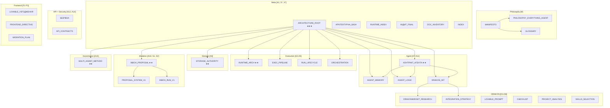
```mermaid
graph TD
    subgraph "Philosophy [M]"
        M1[MANIFESTO]
        M2[PHILOSOPHY_EVERYTHING_AGENT]
        M3[GLOSSARY]
    end

    subgraph "Meta [A1, S*, X*]"
        A1[ARCHITECTURE_ROOT ★★★]
        S3[АРХІТЕКТУРНА_БАЗА]
        S4[RUNTIME_INDEX]
        S5[АУДИТ_FINAL]
        S6[DOC_INVENTORY]
        X1[INDEX]
    end

    subgraph "Execution [A2-A5]"
        A2[RUNTIME_ARCH ★★]
        A3[EXEC_PIPELINE]
        A4[RUN_LIFECYCLE]
        A5[ORCHESTRATION]
    end

    subgraph "Storage [A6]"
        A6[STORAGE_AUTHORITY ★★]
    end

    subgraph "Agent [A7-A11]"
        A7[КОНТРАКТ_АГЕНТА ★★]
        A8[AGENT_MEMORY]
        A9[AGENT_LOGIC]
        A11[DRAKON_INT]
    end

    subgraph "Mutation [A10, S1, S2]"
        A10[INBOX_PROPOSAL ★★]
        S1[PROPOSAL_SYSTEM_V1]
        S2[INBOX_RUN_V1]
    end

    subgraph "API + Security [A12, A14]"
        A12[БЕЗПЕКА]
        A14[API_CONTRACTS]
    end

    subgraph "Governance [A15]"
        A15[MULTI_AGENT_METHOD ★★]
    end

    subgraph "Frontend [F1-F3]"
        F1[LOVABLE_УЗГОДЖЕННЯ]
        F2[FRONTEND_DIRECTIVE]
        F3[MIGRATION_PLAN]
    end

    subgraph "DRAKON [D1-D6]"
        D1[DRAKONWIDGET_RESEARCH]
        D2[INTEGRATION_STRATEGY]
        D3[LOVABLE_PROMPT]
        D4[CHECKLIST]
        D5[PROJECT_ANALYSIS]
        D6[SKILLS_SELECTION]
    end

    A1 --> A2 & A3 & A4 & A5 & A6 & A7 & A8 & A9 & A10 & A11 & A15
    M1 --> M2 & M3
    A10 --> S1 & S2
    A7 --> A8 & A9 & A11
    A11 --> D1 & D2
```

---

## 6. Маршрути читання

### Маршрут А: Нова людина (концепції)
```
MANIFESTO → PHILOSOPHY_EVERYTHING_AGENT → ARCHITECTURE_ROOT → RUNTIME_ARCHITECTURE_CANONICAL → КОНТРАКТ_АГЕНТА_V1
```

### Маршрут Б: Frontend розробник
```
ARCHITECTURE_ROOT → INBOX_AND_RUN_LIFECYCLE_V1 → PROPOSAL_SYSTEM_V1 → API_CONTRACTS_V1 → LOVABLE_УЗГОДЖЕННЯ → FRONTEND_ALIGNMENT_DIRECTIVE_V1
```

### Маршрут В: Backend / Gateway розробник
```
ARCHITECTURE_ROOT → RUNTIME_ARCHITECTURE_CANONICAL → STORAGE_AUTHORITY_MODEL_CANONICAL → EXECUTION_PIPELINE_CANONICAL → API_CONTRACTS_V1 → БЕЗПЕКА_СИСТЕМИ
```

### Маршрут Г: Agent / Runtime розробник
```
ARCHITECTURE_ROOT → КОНТРАКТ_АГЕНТА_V1 → AGENT_MEMORY_GIT_DIFFMEM_V1 → AGENT_LOGIC_VERSIONING_V1 → DRAKON_ІНТЕГРАЦІЯ → ORCHESTRATION_LAYER_ABSTRACTION
```

### Маршрут Д: Архітектор (full context)
```
ARCHITECTURE_ROOT → RUNTIME_ARCHITECTURE_CANONICAL → всі Tier 1 → АРХІТЕКТУРНИЙ_АУДИТ_FINAL
```

---

## 7. Аналіз стану графу

### Сильні сторони

- **Більшість Tier 1 документів** мають "Семантичні зв'язки" секції з [[wiki-links]]
- **ARCHITECTURE_ROOT** є чітким аксіоматичним коренем з повним Semantic Map (§6)
- **Execution кластер** (A2-A5) добре пов'язаний
- **Agent кластер** (A7-A11) добре пов'язаний

### Додані вузли 2026-02-21

| Файл | Роль | Tier |
|------|------|------|
| `architecture/КАНОНІЧНА_СИСТЕМА_ТЕГУВАННЯ.md` | Canonical spec системи тегування | 2 |
| `architecture/ІНВАРІАНТИ_ГРАФУ_ЗНАНЬ.md` | Rule base для semantic-guard та graph-linter | 2 |
| `architecture/КАНОНІЧНИЙ_МЕТОД_МУЛЬТИАГЕНТНОЇ_РОЗРОБКИ.md` | Governance: ролі агентів, authority model, mutation governance, safety invariants (INV-MADM-*) | 1 |

### Архітектурна реструктуризація 2026-02-22

| Зміна | Обґрунтування |
|-------|--------------|
| Введено шари: foundation/, core/, features/, non-functional/, governance/, historical/ | Чіткий поділ абстракцій та ролей |
| Введено operations/ (top-level) | Операційні витяги відокремлені від canonical specs |
| Перенесено АРХІТЕКТУРНИЙ_КОРІНЬ → foundation/ | Foundation = незмінні аксіоми |
| Перенесено 7 core docs → core/ | Core = ядро runtime specs |
| Перенесено 4 feature docs → features/ | Features = підсистеми |
| Перенесено БЕЗПЕКА_СИСТЕМИ + 5 нових моделей → non-functional/ | Додано відсутній нефункціональний шар |
| Перенесено 5 governance docs → governance/ | Governance = управління еволюцією |
| Перенесено 2 historical docs → historical/ | Historical = провенанс, не авторитет |
| Перенесено 4 operations docs → operations/ | Operations = practical implementation guides |
| Створено КАРТА_СИСТЕМИ.md | Навігаційний центр системи |
| Додано 5 нових non-functional моделей | МОДЕЛЬ_ПРОДУКТИВНОСТІ, _МАСШТАБУВАННЯ, _НАДІЙНОСТІ, _СПОСТЕРЕЖУВАНОСТІ, _ВАРТОСТІ |

### Зони уваги (не блокуючі)

| Зона | Опис |
|------|------|
| `АУДІО_ПРОМПТ_NOTEBOOKLM.md` | Ізольований вузол — без зв'язків. Навмисний (operational prompt) |
| DRAKON кластер (D1-D6) | Добре внутрішньо зв'язаний, але слабо пов'язаний із Tier 1 (тільки через A11) |
| `АРХІТЕКТУРНА_БАЗА_СИСТЕМИ.md` | Historical snapshot у historical/. Чітко помічена в ARCHITECTURE_ROOT §7 |

### Відмінність ролей: ARCHITECTURE_ROOT vs АРХІТЕКТУРНА_БАЗА_СИСТЕМИ

**[РІШЕННЯ — не змінювати]**

| Документ | Роль | Дата | Статус |
|----------|------|------|--------|
| `АРХІТЕКТУРНИЙ_КОРІНЬ.md` | Аксіоми ЗАПЛАНОВАНОЇ системи | 2026-02-21 | Canonical |
| `АРХІТЕКТУРНА_БАЗА_СИСТЕМИ.md` | Snapshot ФАКТИЧНОГО стану | 2026-02-14 | Historical |

Обидва документи лишаються. Вони доповнюють, а не дублюють один одного.

---

## Семантичні зв'язки

**Цей документ є частиною:**
- [[АРХІТЕКТУРНИЙ_КОРІНЬ]] — §6 Semantic Map є початковою точкою графу

**Цей документ деталізує:**
- [[ІНДЕКС]] — маршрути читання з §2

**Від цього документа залежать:**
- [[ІНДЕКС]] — для орієнтації нового читача
- [[ІНВЕНТАР_ДОКУМЕНТАЦІЇ]] — inventory статус кожного вузла

---

*Цей документ є картою knowledge graph документаційної бази Garden Bloom. Оновлюється при змінах структури документації.*
```
---
### architecture/BLOOM_IDENTITY_AND_RUNTIME.md
**Розмір:** 8,485 байт
```text
---
tags:
  - domain:arch
  - status:canonical
  - format:spec
  - feature:execution
created: 2026-02-24
updated: 2026-02-24
tier: 1
title: "BLOOM — Ідентичність та Runtime"
---

# BLOOM — Ідентичність та Runtime

> Створено: 2026-02-24
> Автор: Головний архітектор системи
> Статус: Canonical
> Мова: Українська (канонічна)

**BLOOM** — Behavioral Logic Orchestration for Order-Made Systems
**UA:** Оркестрація поведінкової логіки для систем, створених на індивідуальне замовлення

---

## 1. Призначення

BLOOM — runtime-ядро платформи Garden Bloom. Відповідає за детерміноване виконання скомпільованих поведінкових специфікацій.

BLOOM не є фреймворком чи бібліотекою. Це **execution fabric** — зв'язна тканина між визначенням поведінкової логіки та її виконанням у розподіленому середовищі.

### Функціональні ролі

| Роль | Опис |
|------|------|
| Runtime виконання | Детерміноване виконання скомпільованих DRAKON-схем |
| Orchestration engine | Координація розподілених агентів через membridge |
| Execution fabric | Зв'язок між визначенням логіки та виконанням |
| Agent execution foundation | Основа автономного виконання через membridge |

---

## 2. Поведінкова логіка (Behavioral Logic)

Поведінкова логіка у BLOOM визначається через тришаровий процес.

### 2.1 Визначення (Definition Layer)

Логіка визначається **графічно** через DRAKON-схеми — візуальну мову алгоритмів, що гарантує однозначність читання та верифікацію на етапі побудови.

### 2.2 Компіляція (Compilation Layer)

DRAKON-схеми компілюються у формальну проміжну модель (Intermediate Representation, IR):

- **Детерміністичність** — однакові входи завжди дають однакові результати
- **Верифікованість** — структура перевіряється на етапі компіляції
- **Портативність** — IR виконується на різних runtime-середовищах

### 2.3 Виконання (Execution Layer)

Скомпільована логіка виконується BLOOM runtime з повним трекінгом стану та можливістю replay.

---

## 3. Системи індивідуального замовлення (Order-Made Systems)

BLOOM створює **індивідуальні системи**, а не типові рішення:

- **Унікальність кожної системи** — конфігурація, поведінкові моделі та execution-середовище створюються під конкретного клієнта або організацію
- **Власна behavioral модель** — набір DRAKON-схем, що визначають унікальну бізнес-логіку клієнта
- **Ізольовані execution-середовища** — кожне з власним станом, агентами та правилами оркестрації

---

## 4. Місце BLOOM в архітектурі

```
┌─────────────────────────────────────────┐
│           Garden Bloom UI               │
│    (Control Plane — React, TypeScript)  │
├─────────────────────────────────────────┤
│           DRAKON Editor                 │
│    (Візуальне визначення алгоритмів)    │
├─────────────────────────────────────────┤
│           Compiler                      │
│    (DRAKON → IR компіляція)             │
├─────────────────────────────────────────┤
│         ╔═══════════════╗               │
│         ║  BLOOM Runtime ║              │
│         ║  (Execution    ║              │
│         ║   Fabric)      ║              │
│         ╚═══════════════╝               │
├─────────────────────────────────────────┤
│           membridge                     │
│    (Шар оркестрації агентів)            │
├─────────────────────────────────────────┤
│           Agents                        │
│    (Розподілені одиниці виконання)      │
└─────────────────────────────────────────┘
```

### Потік даних

1. **Користувач** визначає логіку через DRAKON Editor
2. **Compiler** компілює схему у IR
3. **BLOOM Runtime** приймає IR та створює execution plan
4. **membridge** розподіляє завдання між агентами
5. **Agents** виконують атомарні операції та повертають результати
6. **BLOOM Runtime** агрегує результати як Artifacts

---

## 5. Runtime Layer — деталі

### Оркестрація виконання

| Механізм | Опис |
|----------|------|
| Step-by-step execution | Кожен крок DRAKON-схеми — атомарна операція |
| Branching decisions | Умовні переходи обробляються детерміновано |
| Loop management | Цикли з контролем стану та умов виходу |

### Управління станом

- Повний стан виконання зберігається та може бути відновлений
- Кожен run має ізольований контекст
- State transitions логуються для аудиту та replay

### Розподілене виконання

- membridge розподіляє execution tasks між агентами
- Агенти отримують завдання через lifecycle: `Proposal → Job → Lease`
- Результати агрегуються як `Artifact`

---

## 6. Бренд-позиціонування

| Аспект | Визначення |
|--------|-----------|
| Execution Fabric | Тканина, що зв'язує визначення логіки з виконанням |
| Behavioral Runtime | Середовище виконання поведінкових моделей |
| Bespoke Logic Engine | Двигун індивідуальної логіки |

### Формула бренду

```
BLOOM = Behavioral Logic + Orchestration + Order-Made
```

### Метафора

BLOOM — це **розкриття** (blooming): момент, коли абстрактна логіка розкривається у живу, виконувану систему. Це не квітка — це трансформація.

---

## Семантичні зв'язки

**Цей документ є частиною:**
- [[АРХІТЕКТУРНИЙ_КОРІНЬ]] — BLOOM як runtime-шар архітектури

**Від цього документа залежать:**
- [[BLOOM_DESIGN_SYSTEM]] — візуальна ідентичність BLOOM
- Всі runtime-компоненти Garden Bloom UI

---

*Цей документ визначає ідентичність та архітектурну роль BLOOM Runtime у системі Garden Bloom.*
```
---
### architecture/core/INBOX_ТА_PROPOSAL_АРХІТЕКТУРА.md
**Розмір:** 31,674 байт
```text
---
tags:
  - domain:mutation
  - status:canonical
  - format:spec
  - feature:proposal
created: 2026-02-21
updated: 2026-02-21
tier: 1
title: "INBOX ТА PROPOSAL АРХІТЕКТУРА"
dg-publish: true
dg-metatags:
dg-home:
---

# Inbox та Proposal: архітектура

> Створено: 2026-02-14
> Автор: Архітектор системи
> Базується на: КОНТРАКТ_АГЕНТА_V1.md, КАНОНІЧНА_АРХІТЕКТУРА_ВИКОНАННЯ.md, АРХІТЕКТУРНА_БАЗА_СИСТЕМИ.md, МАНІФЕСТ.md
> Статус: Специфікація

---

## 0. Фундаментальний інваріант

**[ПРИНЦИП]** Proposal є єдиним дозволеним механізмом змін canonical storage.

Жодна сутність у системі — людина, агент, зовнішній сервіс — не може змінити канонічні дані (MinIO, Git) напряму. Будь-яка зміна проходить через:

```
Намір → Proposal → Consent Gate → Apply → Canonical Storage
```

Це не бюрократія. Це **структурний захист цілісності знань**.

Наслідки:

- Агент (Mastra) не має прямого запису у MinIO чи Git. Він створює proposal.
- Гість (Zone Guest) не може редагувати нотатку. Він створює proposal.
- Telegram-бот не може додати замітку. Він створює proposal.
- Webhook не може модифікувати артефакт. Він створює proposal.
- Навіть Owner працює через apply — різниця в тому, що Owner **може** бути auto-approver для власних proposals.

**[ПРИНЦИП]** Proposal — це іммутабельний артефакт. Після створення він не змінюється. Змінюється лише його статус (pending → approved/rejected → applied/discarded).

---

## 1. Inbox як канонічна точка входу

### 1.1 Що таке Inbox

Inbox — це **єдина канонічна точка прийому намірів** у систему. Будь-який зовнішній або внутрішній сигнал, що має на меті змінити стан системи, потрапляє спочатку в Inbox.

**[РІШЕННЯ]** Inbox — це не UI-компонент. Це **архітектурний шар** між зовнішнім світом та proposal lifecycle. Inbox:

- приймає намір з будь-якого джерела
- нормалізує його до єдиного формату (Inbox Entry)
- валідує джерело (автентифікація, авторизація)
- створює Proposal або відхиляє з поясненням

### 1.2 Inbox Entry — канонічний формат

Будь-який намір, незалежно від джерела, нормалізується до:

```json
{
  "id": "inbox_2026-02-14_abc123",
  "source": {
    "type": "ui | telegram | webhook | agent | cron",
    "identity": "owner | guest:zone_abc | agent:archivist-violin | bot:telegram",
    "authenticated": true,
    "timestamp": "2026-02-14T12:00:00Z"
  },
  "intent": {
    "action": "propose-edit | propose-summary | propose-tag | propose-artifact | propose-note | propose-comment",
    "target": "notes/violin.pp.ua/sonata-bwv1001",
    "payload": { }
  },
  "metadata": {
    "correlation_id": "run_2026-02-14_080000_abc123",
    "priority": "normal | high",
    "ttl_hours": 72
  }
}
```

**[ПРИНЦИП]** Inbox Entry не містить самих змін. Він містить **намір** та **payload для proposal**. Зміни формалізуються у Proposal після проходження валідації.

### 1.3 Зберігання

**[РІШЕННЯ]** Inbox entries зберігаються у MinIO:

```
garden-agents/
└── inbox/
    ├── pending/                    ← нові, необроблені
    │   ├── inbox_2026-02-14_abc123.json
    │   └── inbox_2026-02-14_def456.json
    ├── processed/                  ← перетворені на proposals
    │   └── 2026-02/
    │       └── inbox_2026-02-14_abc123.json
    └── rejected/                   ← відхилені при валідації
        └── 2026-02/
            └── inbox_2026-02-14_ghi789.json
```

**[ОБМЕЖЕННЯ]** Inbox — це buffer, не довготривале сховище. Entries переміщуються до `processed/` або `rejected/` після обробки. TTL за замовчуванням — 72 години для необроблених entries.

---

## 2. Джерела Inbox

### 2.1 UI (Lovable Frontend)

**[РІШЕННЯ]** Frontend залишається головним джерелом намірів від людини.

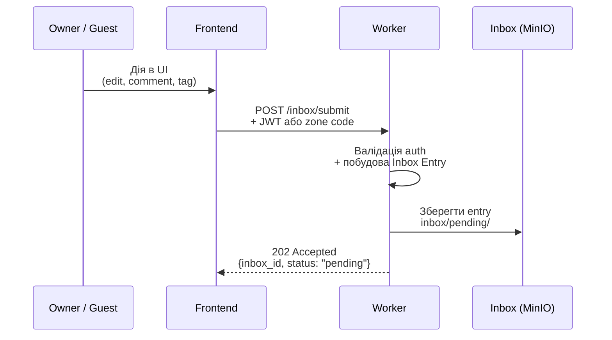
```mermaid
sequenceDiagram
    participant O as Owner / Guest
    participant F as Frontend
    participant W as Worker
    participant IB as Inbox (MinIO)

    O->>F: Дія в UI<br/>(edit, comment, tag)
    F->>W: POST /inbox/submit<br/>+ JWT або zone code
    W->>W: Валідація auth<br/>+ побудова Inbox Entry
    W->>IB: Зберегти entry<br/>inbox/pending/
    W-->>F: 202 Accepted<br/>{inbox_id, status: "pending"}
```

| Дія в UI | Intent action | Хто може |
|----------|--------------|----------|
| Редагування нотатки | `propose-edit` | Owner, Zone Guest |
| Новий коментар | `propose-comment` | Owner, Zone Guest |
| Додавання тегу | `propose-tag` | Owner |
| Створення нотатки | `propose-note` | Owner |
| Запуск агента (результат) | `propose-artifact` | Owner (через agent run) |

**[РІШЕННЯ]** Для Owner з ввімкненим auto-approve: entry проходить через Inbox → Proposal → Auto-approve → Apply **в одному request cycle**. Але proposal все одно створюється і записується. Немає shortcut, що минає proposal.

### 2.2 Telegram

**[РІШЕННЯ]** Telegram-бот є зовнішнім джерелом Inbox, що дозволяє швидкий ввід з мобільного пристрою.

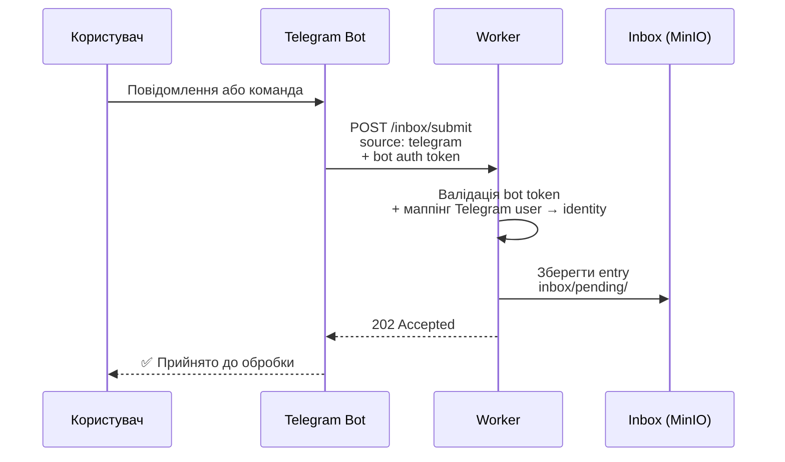
```mermaid
sequenceDiagram
    participant U as Користувач
    participant TG as Telegram Bot
    participant W as Worker
    participant IB as Inbox (MinIO)

    U->>TG: Повідомлення або команда
    TG->>W: POST /inbox/submit<br/>source: telegram<br/>+ bot auth token
    W->>W: Валідація bot token<br/>+ маппінг Telegram user → identity
    W->>IB: Зберегти entry<br/>inbox/pending/
    W-->>TG: 202 Accepted
    TG-->>U: ✅ Прийнято до обробки
```

Типи Telegram-взаємодій:

| Команда / формат | Intent action | Приклад |
|-----------------|--------------|---------|
| `/note <текст>` | `propose-note` | `/note Нова ідея щодо сонати BWV 1001` |
| `/tag <slug> <tags>` | `propose-tag` | `/tag sonata-bwv1001 baroque, bach` |
| Пересланий текст | `propose-note` | Forwarded article → note proposal |
| Голосове повідомлення | `propose-note` | Транскрипція → note proposal |
| `/status` | (read-only, не Inbox) | Не створює proposal |

**[ОБМЕЖЕННЯ]** Telegram-бот не має Owner-рівня прав. Усі proposals від Telegram мають `source.identity: "bot:telegram"` і проходять повний approval cycle. Навіть якщо повідомлення надіслано Owner — ідентифікація відбувається через Telegram user mapping, не через JWT.

**[ОБМЕЖЕННЯ]** Telegram-бот може лише **створювати** proposals. Він не може **затверджувати** їх. Затвердження — виключно через UI або окремий захищений канал.

### 2.3 Webhooks

**[РІШЕННЯ]** Система приймає webhooks від зовнішніх сервісів як джерело Inbox.

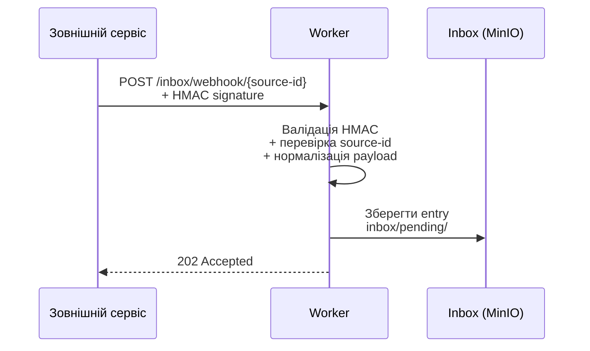
```mermaid
sequenceDiagram
    participant EXT as Зовнішній сервіс
    participant W as Worker
    participant IB as Inbox (MinIO)

    EXT->>W: POST /inbox/webhook/{source-id}<br/>+ HMAC signature
    W->>W: Валідація HMAC<br/>+ перевірка source-id<br/>+ нормалізація payload
    W->>IB: Зберегти entry<br/>inbox/pending/
    W-->>EXT: 202 Accepted
```

| Джерело webhook | Intent action | Опис |
|----------------|--------------|------|
| GitHub (push event) | `propose-note` (sync) | Нова нотатка в Obsidian → sync до garden |
| Obsidian Sync | `propose-edit` | Зміна нотатки в Obsidian |
| External API | `propose-artifact` | Результат зовнішнього аналізу |
| Orchestration callback | `propose-artifact` | Результат agent run |

**[ОБМЕЖЕННЯ]** Кожен webhook source має бути **зареєстрований** у системі з:
- `source-id` — унікальний ідентифікатор
- `hmac_secret` — для валідації підпису
- `allowed_actions[]` — які intent actions дозволені
- `auto_approve` — чи дозволений auto-approve (за замовчуванням: ні)

Конфігурація webhook sources зберігається у Cloudflare KV (`webhook_sources:{source-id}`).

### 2.4 Агенти (Mastra через Orchestration Layer)

**[РІШЕННЯ]** Результат виконання агента потрапляє в Inbox як proposal, а не записується напряму.

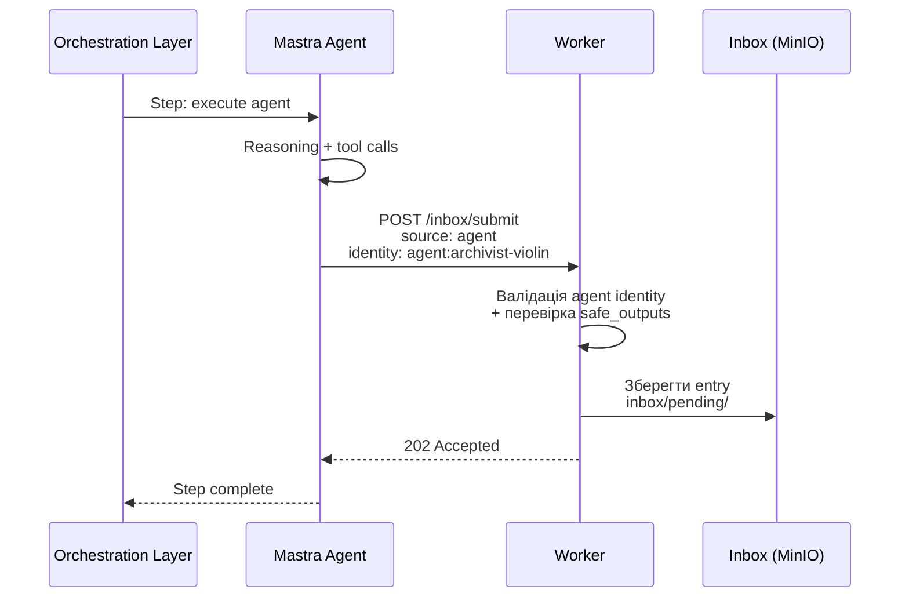
```mermaid
sequenceDiagram
    participant OL as Orchestration Layer
    participant MA as Mastra Agent
    participant W as Worker
    participant IB as Inbox (MinIO)

    OL->>MA: Step: execute agent
    MA->>MA: Reasoning + tool calls
    MA->>W: POST /inbox/submit<br/>source: agent<br/>identity: agent:archivist-violin
    W->>W: Валідація agent identity<br/>+ перевірка safe_outputs
    W->>IB: Зберегти entry<br/>inbox/pending/
    W-->>MA: 202 Accepted
    MA-->>OL: Step complete
```

**[ПРИНЦИП]** Агент не знає, що він працює через Inbox. Mastra tool `create-proposal` внутрішньо робить `POST /inbox/submit`. Для агента це виглядає як один виклик інструменту.

**[ОБМЕЖЕННЯ]** Агент може створювати proposals лише тих типів, що перелічені в `safe_outputs[]` його `_agent.md`. Worker валідує це при прийомі в Inbox.

---

## 3. Lifecycle Proposal

### 3.1 Стани Proposal

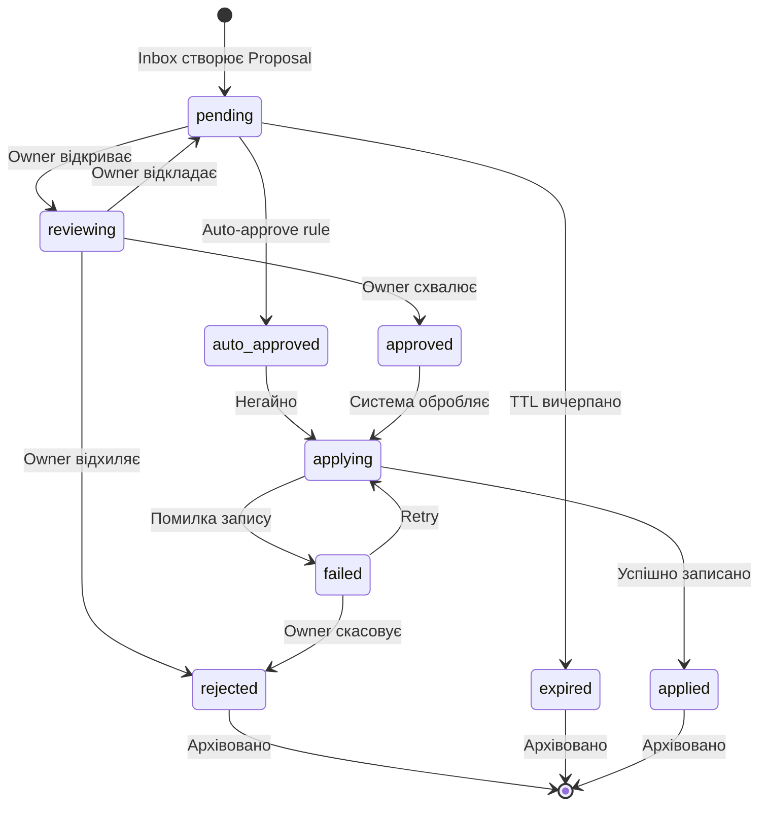
```mermaid
stateDiagram-v2
    [*] --> pending : Inbox створює Proposal

    pending --> reviewing : Owner відкриває
    pending --> auto_approved : Auto-approve rule
    pending --> expired : TTL вичерпано

    reviewing --> approved : Owner схвалює
    reviewing --> rejected : Owner відхиляє
    reviewing --> pending : Owner відкладає

    auto_approved --> applying : Негайно

    approved --> applying : Система обробляє

    applying --> applied : Успішно записано
    applying --> failed : Помилка запису

    failed --> applying : Retry
    failed --> rejected : Owner скасовує

    rejected --> [*] : Архівовано
    expired --> [*] : Архівовано
    applied --> [*] : Архівовано
```

### 3.2 Опис станів

| Стан | Значення | Хто переводить | Наступні стани |
|------|---------|----------------|----------------|
| **pending** | Proposal створено, очікує уваги | Inbox | `reviewing`, `auto_approved`, `expired` |
| **reviewing** | Owner переглядає proposal (UI-only стан, не серверний — див. СИСТЕМА_PROPOSAL_V1.md §1.3) | Owner (відкриття в UI) | `approved`, `rejected`, `pending` |
| **auto_approved** | Автоматично схвалено правилом | Система (rule engine) | `applying` |
| **approved** | Owner явно схвалив | Owner | `applying` |
| **applying** | Зміна записується в canonical storage | Система | `applied`, `failed` |
| **applied** | Зміна успішно записана | Система | Архів |
| **rejected** | Owner відхилив | Owner | Архів |
| **expired** | TTL вичерпано без дії | Система (cron) | Архів |
| **failed** | Помилка при записі | Система | `applying` (retry), `rejected` |

### 3.3 Структура Proposal

```json
{
  "id": "prop_2026-02-14_xyz789",
  "inbox_entry_id": "inbox_2026-02-14_abc123",
  "status": "pending",
  "created_at": "2026-02-14T12:00:05Z",
  "updated_at": "2026-02-14T12:00:05Z",
  "expires_at": "2026-02-17T12:00:05Z",

  "source": {
    "type": "agent",
    "identity": "agent:archivist-violin",
    "run_id": "run_2026-02-14_080000_abc123"
  },

  "action": "propose-edit",
  "target": {
    "type": "note",
    "path": "notes/violin.pp.ua/sonata-bwv1001.md"
  },

  "content": {
    "summary": "Додати структуроване резюме нотатки",
    "diff": {
      "type": "append",
      "position": "after-frontmatter",
      "text": "## Резюме\n\nСоната BWV 1001..."
    },
    "reasoning": "Нотатка не має резюме. NotebookLM підтвердив ключові тези.",
    "citations": [
      {"source": "violin-taxonomy.md", "quote": "BWV 1001 — перша соната..."}
    ]
  },

  "approval": {
    "decided_by": null,
    "decided_at": null,
    "decision_note": null
  },

  "apply_result": {
    "git_commit": null,
    "minio_path": null,
    "error": null
  }
}
```

### 3.4 Зберігання Proposals

```
garden-agents/
└── proposals/
    ├── pending/
    │   └── prop_2026-02-14_xyz789.json
    ├── approved/
    │   └── 2026-02/
    │       └── prop_2026-02-14_abc456.json
    ├── rejected/
    │   └── 2026-02/
    │       └── prop_2026-02-14_def789.json
    └── applied/
        └── 2026-02/
            └── prop_2026-02-14_abc456.json
```

**[РІШЕННЯ]** Proposals переміщуються між директоріями при зміні статусу. `pending/` — активна черга. Інші — архів за місяцями.

### 3.5 Apply — запис у canonical storage

| Тип дії | Canonical target | Механізм запису |
|---------|-----------------|-----------------|
| `propose-edit` | GitHub (note .md) | Worker → GitHub API commit з атрибуцією |
| `propose-note` | GitHub (new .md) | Worker → GitHub API create file |
| `propose-tag` | GitHub (note frontmatter) | Worker → GitHub API commit (frontmatter update) |
| `propose-summary` | MinIO (artifact) | Worker → MinIO S3 PUT |
| `propose-artifact` | MinIO (artifact) | Worker → MinIO S3 PUT |
| `propose-comment` | MinIO (comment) | Worker → MinIO S3 PUT + KV index update |

**[ПРИНЦИП]** Apply записує зміну в canonical storage **з атрибуцією**:

```
Git commit message:
  "[archivist-violin] Додати резюме sonata-bwv1001

  Proposal: prop_2026-02-14_xyz789
  Approved by: owner
  Agent: archivist-violin v1.2.0
  Run: run_2026-02-14_080000_abc123"
```

**[ПРИНЦИП]** Apply — це атомарна операція. Якщо запис не вдався — proposal переходить у `failed`, не у `applied`. Часткові записи заборонені.

---

## 4. Consent Gates

### 4.1 Що таке Consent Gate

Consent Gate — це **точка явної згоди** між двома фазами системи. Gate вимагає підтвердження від уповноваженої сутності перед тим, як дозволити перехід.

**[ПРИНЦИП]** Consent Gate — не UI-елемент. Це архітектурний патерн. UI-елемент (кнопка "Approve", чекбокс, діалог) — лише один з можливих інтерфейсів до gate.

### 4.2 Типи Consent Gates

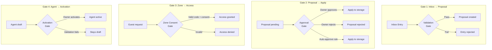
```mermaid
graph TB
    subgraph "Gate 1: Inbox → Proposal"
        G1_IN[Inbox Entry] --> G1_GATE{Validation<br/>Gate}
        G1_GATE -->|Pass| G1_OUT[Proposal created]
        G1_GATE -->|Fail| G1_REJ[Entry rejected]
    end

    subgraph "Gate 2: Proposal → Apply"
        G2_IN[Proposal pending] --> G2_GATE{Approval<br/>Gate}
        G2_GATE -->|Owner approves| G2_OUT[Apply to storage]
        G2_GATE -->|Owner rejects| G2_REJ[Proposal rejected]
        G2_GATE -->|Auto-approve rule| G2_AUTO[Apply to storage]
    end

    subgraph "Gate 3: Zone → Access"
        G3_IN[Guest request] --> G3_GATE{Zone Consent<br/>Gate}
        G3_GATE -->|Valid code + consent| G3_OUT[Access granted]
        G3_GATE -->|Invalid| G3_REJ[Access denied]
    end

    subgraph "Gate 4: Agent → Activation"
        G4_IN[Agent draft] --> G4_GATE{Activation<br/>Gate}
        G4_GATE -->|Owner activates| G4_OUT[Agent active]
        G4_GATE -->|Validation fails| G4_REJ[Stays draft]
    end
```

### 4.3 Gate 1: Validation Gate (Inbox → Proposal)

Автоматичний gate. Перевіряє, чи entry має право створити proposal.

| Перевірка | Опис | Наслідок при відмові |
|-----------|------|---------------------|
| Автентифікація | Чи джерело ідентифіковане (JWT, bot token, HMAC, agent identity) | Entry → `rejected/` |
| Авторизація | Чи джерело має право на цей `intent.action` | Entry → `rejected/` |
| Safe outputs (для агентів) | Чи `intent.action` є в `safe_outputs[]` агента | Entry → `rejected/` |
| Target exists | Чи target (нотатка, папка) існує | Entry → `rejected/` |
| Duplicate check | Чи немає ідентичного pending proposal | Entry → `rejected/` (idempotency) |
| Rate limit | Чи не перевищено ліміт proposals від цього джерела | Entry → `rejected/` |

**[РІШЕННЯ]** Validation Gate повністю автоматичний. Людина не бере участі. Це фільтр на вході, не рішення.

### 4.4 Gate 2: Approval Gate (Proposal → Apply)

Головний consent gate системи. Тут людина вирішує.

| Режим | Хто вирішує | Коли |
|-------|------------|------|
| **Manual approval** | Owner через UI | За замовчуванням для всіх proposals |
| **Auto-approve** | Правило у системі | Для довірених джерел з ввімкненим auto-approve |
| **Batch approval** | Owner через UI | Масове схвалення/відхилення |

**[РІШЕННЯ]** Auto-approve правила:

| Правило | Умова | Обґрунтування |
|---------|-------|---------------|
| Owner self-proposals | `source.identity == "owner"` | Owner довіряє собі |
| Trusted agent, low-risk | `source.type == "agent"` AND `action IN ["propose-tag"]` | Теги — низькоризикова дія |
| Obsidian sync | `source.type == "webhook"` AND `source-id == "obsidian-sync"` | Авторитетне джерело нотаток |

**[ПРИНЦИП]** Auto-approve **не означає** відсутність proposal. Proposal все одно створюється, записується, і може бути переглянутий у аудит-лозі. Auto-approve = автоматичний перехід `pending → auto_approved → applying → applied`.

**[ОБМЕЖЕННЯ]** Auto-approve для агентів вимикається за замовчуванням. Owner має явно ввімкнути його для конкретного агента та конкретного типу дій.

### 4.5 Gate 3: Zone Consent Gate (Guest → Access)

Існуючий gate для доступу гостей до зон.

| Крок | Що відбувається |
|------|----------------|
| 1 | Гість вводить код зони (`ZONE-XXXX-YYYY`) |
| 2 | Worker валідує код, TTL, дозволені дії |
| 3 | Frontend показує GDPR-подібний consent screen |
| 4 | Гість погоджується з умовами (checkbox + підтвердження) |
| 5 | localStorage зберігає consent (policy versioning) |
| 6 | Гість отримує доступ до нотаток зони |

**[ПРИНЦИП]** Zone Consent Gate — це двоетапний gate: **технічний** (код зони) + **юридичний** (consent). Обидва обов'язкові.

### 4.6 Gate 4: Agent Activation Gate

Gate для переходу агента зі стану `draft` у `active` (визначений у КОНТРАКТ_АГЕНТА_V1.md).

| Перевірка | Критерій |
|-----------|----------|
| `_agent.md` валідний | Frontmatter парситься, обов'язкові поля присутні |
| `tools[]` не порожній | Хоча б один інструмент |
| `safe_outputs[]` не порожній | Хоча б один safe output |
| `model` валідний | Model ID розпізнається runtime |
| Owner consent | Owner явно натискає "Activate" |

**[ПРИНЦИП]** Автоматична активація агентів заборонена. Навіть якщо `_agent.md` валідний — потрібна явна дія Owner.

---

## 5. Наскрізна діаграма

### 5.1 Повний lifecycle: від наміру до canonical storage

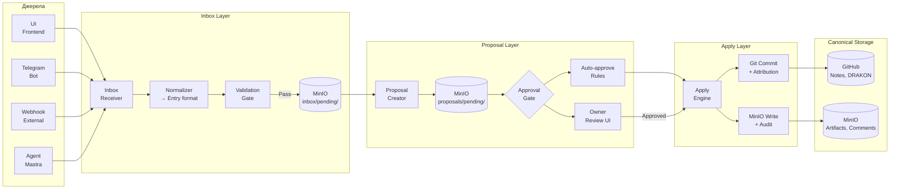
```mermaid
graph LR
    subgraph "Джерела"
        S_UI[UI<br/>Frontend]
        S_TG[Telegram<br/>Bot]
        S_WH[Webhook<br/>External]
        S_AG[Agent<br/>Mastra]
    end

    subgraph "Inbox Layer"
        IB_RECV[Inbox<br/>Receiver]
        IB_NORM[Normalizer<br/>→ Entry format]
        IB_VALID[Validation<br/>Gate]
        IB_STORE[(MinIO<br/>inbox/pending/)]
    end

    subgraph "Proposal Layer"
        P_CREATE[Proposal<br/>Creator]
        P_STORE[(MinIO<br/>proposals/pending/)]
        P_GATE{Approval<br/>Gate}
        P_AUTO[Auto-approve<br/>Rules]
        P_MANUAL[Owner<br/>Review UI]
    end

    subgraph "Apply Layer"
        A_ENGINE[Apply<br/>Engine]
        A_GIT[Git Commit<br/>+ Attribution]
        A_MINIO[MinIO Write<br/>+ Audit]
    end

    subgraph "Canonical Storage"
        CS_GH[(GitHub<br/>Notes, DRAKON)]
        CS_S3[(MinIO<br/>Artifacts, Comments)]
    end

    S_UI & S_TG & S_WH & S_AG --> IB_RECV
    IB_RECV --> IB_NORM --> IB_VALID
    IB_VALID -->|Pass| IB_STORE
    IB_STORE --> P_CREATE
    P_CREATE --> P_STORE
    P_STORE --> P_GATE
    P_GATE --> P_AUTO
    P_GATE --> P_MANUAL
    P_AUTO --> A_ENGINE
    P_MANUAL -->|Approved| A_ENGINE
    A_ENGINE --> A_GIT & A_MINIO
    A_GIT --> CS_GH
    A_MINIO --> CS_S3
```

### 5.2 Потік конкретного сценарію: Telegram → нотатка

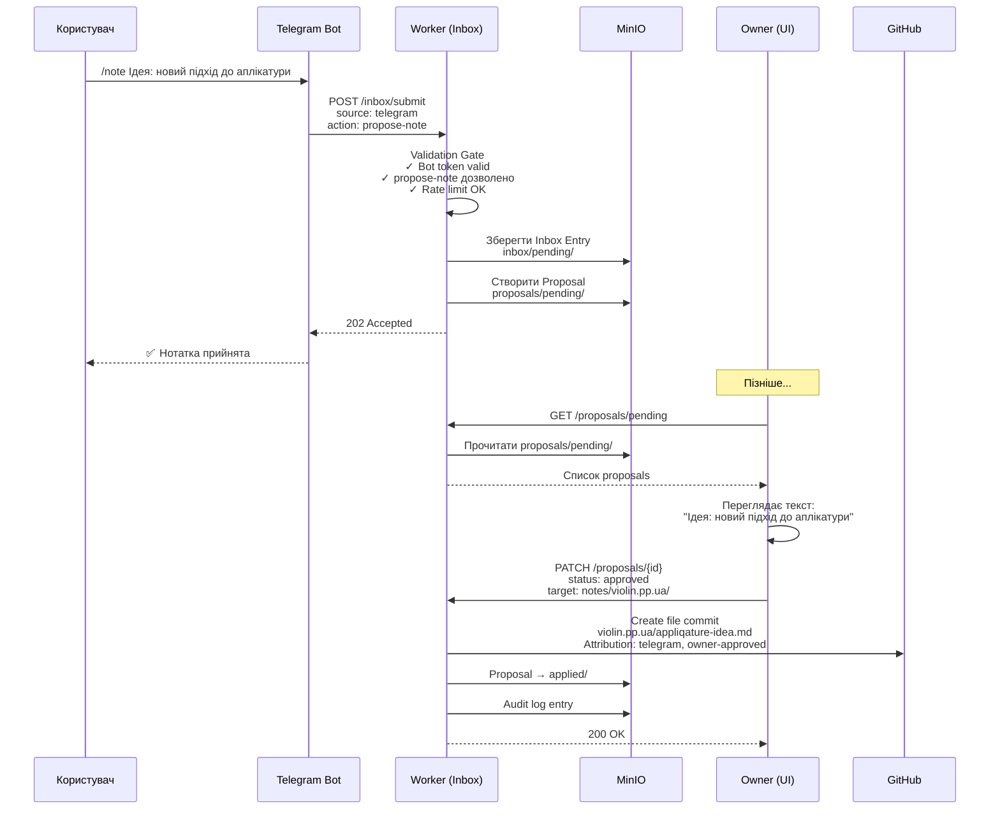
```mermaid
sequenceDiagram
    participant U as Користувач
    participant TG as Telegram Bot
    participant W as Worker (Inbox)
    participant S3 as MinIO
    participant O as Owner (UI)
    participant GH as GitHub

    U->>TG: /note Ідея: новий підхід до аплікатури
    TG->>W: POST /inbox/submit<br/>source: telegram<br/>action: propose-note

    W->>W: Validation Gate<br/>✓ Bot token valid<br/>✓ propose-note дозволено<br/>✓ Rate limit OK

    W->>S3: Зберегти Inbox Entry<br/>inbox/pending/
    W->>S3: Створити Proposal<br/>proposals/pending/
    W-->>TG: 202 Accepted
    TG-->>U: ✅ Нотатка прийнята

    Note over O: Пізніше...

    O->>W: GET /proposals/pending
    W->>S3: Прочитати proposals/pending/
    W-->>O: Список proposals

    O->>O: Переглядає текст:<br/>"Ідея: новий підхід до аплікатури"
    O->>W: PATCH /proposals/{id}<br/>status: approved<br/>target: notes/violin.pp.ua/

    W->>GH: Create file commit<br/>violin.pp.ua/appliqature-idea.md<br/>Attribution: telegram, owner-approved
    W->>S3: Proposal → applied/
    W->>S3: Audit log entry
    W-->>O: 200 OK
```

### 5.3 Потік конкретного сценарію: Agent → proposal → rejection

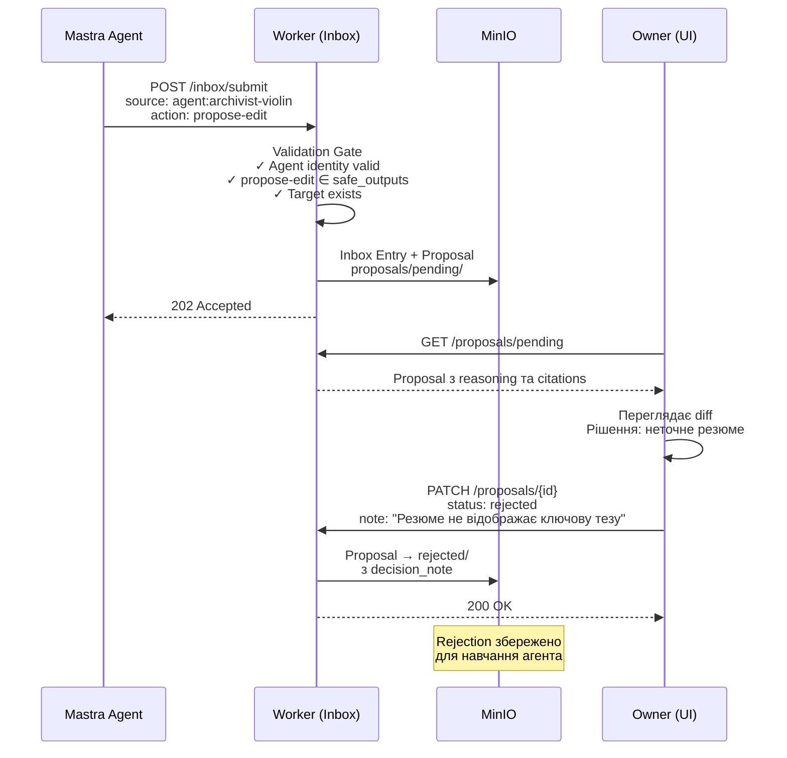
```mermaid
sequenceDiagram
    participant MA as Mastra Agent
    participant W as Worker (Inbox)
    participant S3 as MinIO
    participant O as Owner (UI)

    MA->>W: POST /inbox/submit<br/>source: agent:archivist-violin<br/>action: propose-edit

    W->>W: Validation Gate<br/>✓ Agent identity valid<br/>✓ propose-edit ∈ safe_outputs<br/>✓ Target exists

    W->>S3: Inbox Entry + Proposal<br/>proposals/pending/
    W-->>MA: 202 Accepted

    O->>W: GET /proposals/pending
    W-->>O: Proposal з reasoning та citations

    O->>O: Переглядає diff<br/>Рішення: неточне резюме

    O->>W: PATCH /proposals/{id}<br/>status: rejected<br/>note: "Резюме не відображає ключову тезу"

    W->>S3: Proposal → rejected/<br/>з decision_note
    W-->>O: 200 OK

    Note over S3: Rejection збережено<br/>для навчання агента
```

---

## 6. API Surface

**[РІШЕННЯ]** Нові Worker endpoints для Inbox та Proposal lifecycle:

| Method | Endpoint | Auth | Опис |
|--------|----------|------|------|
| `POST` | `/inbox/submit` | Mixed | Створити Inbox Entry (UI, Telegram, Agent) |
| `POST` | `/inbox/webhook/{source-id}` | HMAC | Прийняти webhook |
| `GET` | `/proposals/pending` | Owner | Список pending proposals |
| `GET` | `/proposals/:id` | Owner | Деталі proposal |
| `PATCH` | `/proposals/:id` | Owner | Змінити статус (approve/reject) |
| `POST` | `/proposals/:id/apply` | Owner | Примусово apply (якщо auto не спрацював) |
| `GET` | `/proposals/history` | Owner | Архів applied/rejected proposals |
| `GET` | `/inbox/stats` | Owner | Статистика: pending, processed, rejected |

---

## 7. Auto-Approve Engine

**[РІШЕННЯ]** Auto-approve правила зберігаються у Cloudflare KV:

```json
{
  "key": "auto_approve_rules",
  "value": {
    "rules": [
      {
        "id": "owner-self",
        "condition": { "source.identity": "owner" },
        "enabled": true,
        "description": "Owner proposals auto-approved"
      },
      {
        "id": "obsidian-sync",
        "condition": {
          "source.type": "webhook",
          "source.identity": "webhook:obsidian-sync"
        },
        "enabled": true,
        "description": "Obsidian sync auto-approved"
      },
      {
        "id": "agent-tags",
        "condition": {
          "source.type": "agent",
          "action": "propose-tag"
        },
        "enabled": false,
        "description": "Agent tag proposals (disabled by default)"
      }
    ]
  }
}
```

**[ОБМЕЖЕННЯ]** Auto-approve engine оцінює правила **в порядку** їх визначення. Перше правило, що збіглося — визначає рішення. Якщо жодне правило не збіглося — proposal залишається `pending` для manual review.

**[ПРИНЦИП]** Auto-approve правила може змінювати лише Owner через UI. Агенти не можуть модифікувати auto-approve правила. Це запобігає ескалації привілеїв.

---

## 8. Відношення до існуючих компонентів

### 8.1 Сумісність з поточною системою

| Поточний компонент | Як змінюється |
|-------------------|---------------|
| Edit proposals (Worker, KV) | Мігрує до Inbox → Proposal flow; KV → MinIO |
| Zone Consent Gate | Без змін; залишається окремим gate для доступу |
| NotebookLM chat | Без змін; не проходить через Inbox (read-only) |
| DRAKON save | Без змін при ручному збереженні Owner; агентні зміни — через Inbox |
| Note editor commit | Стає Inbox entry з auto-approve для Owner |

### 8.2 Міграційний шлях

```
Фаза 1: Inbox + Proposal API у Worker
         Proposals у MinIO замість KV
         Існуючий edit proposal → нова система

Фаза 2: Telegram bot → Inbox інтеграція
         Webhook registration API

Фаза 3: Agent safe-output → Inbox інтеграція
         Auto-approve engine
```

**[ПРИНЦИП]** Кожна фаза залишає систему працездатною. Edit proposals працюють з першого дня на новій інфраструктурі.

---

---

## Див. також

- **INBOX_ТА_ЦИКЛ_ЗАПУСКУ_V1.md** — витяг: state machines Inbox та Run для Lovable UI
- **СИСТЕМА_PROPOSAL_V1.md** — витяг: state machine Proposal, семантика `reviewing`, concurrent proposals
- **КОНТРАКТИ_API_V1.md** — повні JSON schemas для всіх endpoints

---

*Цей документ описує архітектуру Inbox та Proposal як єдиного каналу змін. Він не є планом впровадження — це специфікація контракту.*

---

## Семантичні зв'язки

**Цей документ деталізує:**
- [[АРХІТЕКТУРНИЙ_КОРІНЬ]] — аксіома A2 (mutation requires consent): цей документ є її повним розкриттям

**Цей документ залежить від:**
- [[КАНОНІЧНА_МОДЕЛЬ_АВТОРИТЕТУ_СХОВИЩА]] — proposals зберігаються у MinIO; transitions authority
- [[КАНОНІЧНИЙ_ЦИКЛ_ЗАПУСКУ]] — run → completed породжує proposals
- [[ПАМ_ЯТЬ_АГЕНТА_GIT_DIFFMEM_V1]] — memory-update Proposal: окремий тип з auto-approve для normal priority
- [[ВЕРСІОНУВАННЯ_ЛОГІКИ_АГЕНТА_V1]] — logic-update Proposal: окремий тип, завжди human review

**Від цього документа залежать:**
- [[КАНОНІЧНИЙ_КОНВЕЄР_ВИКОНАННЯ]] — Phase 5 (Persist Results): proposals creation
- [[КОНТРАКТ_АГЕНТА_V1]] — агент генерує proposals як єдиний safe output
- [[СИСТЕМА_PROPOSAL_V1]] — frontend-орієнтований витяг (state machine, поля для UI)
```
---
### architecture/core/КАНОНІЧНИЙ_ЦИКЛ_ЗАПУСКУ.md
**Розмір:** 10,671 байт
```text
---
tags:
  - domain:execution
  - status:canonical
  - format:spec
  - feature:execution
  - feature:proposal
created: 2026-02-21
updated: 2026-02-21
tier: 1
title: "КАНОНІЧНИЙ ЦИКЛ ЗАПУСКУ"
dg-publish: true
dg-metatags:
dg-home:
---

# Run Lifecycle: Канонічна специфікація

> Створено: 2026-02-15
> Автор: Головний архітектор системи
> Статус: Канонічна специфікація
> Мова: Українська (канонічна)
> Частина: ІНДЕКС_АРХІТЕКТУРИ_ВИКОНАННЯ.md

---

## 0. Призначення

Цей документ описує **canonical run lifecycle** у vendor-agnostic термінах. Він визначає:

- State machine для Agent Run
- Хто встановлює кожен стан
- Інваріанти переходів
- Status Writer контракт
- Polling та notification strategy

**[ПРИНЦИП]** Run lifecycle не залежить від vendor Orchestration Layer. State machine ідентичний незалежно від того, хто координує виконання.

---

## 1. Run State Machine

### 1.1 Стани

```
[ініційовано] → requested → queued → running → completed | failed
```

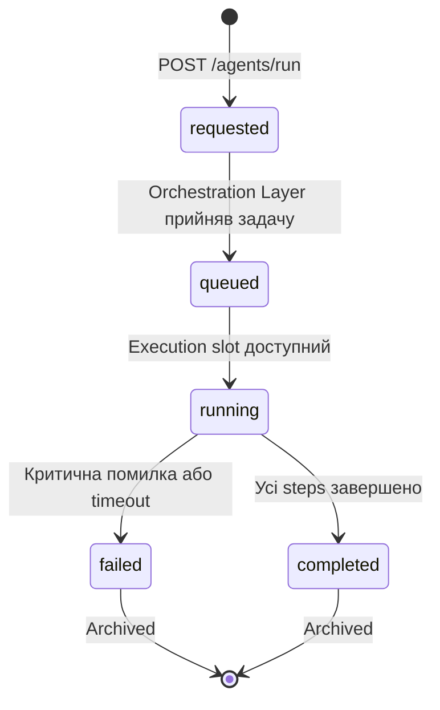
```mermaid
stateDiagram-v2
    [*] --> requested : POST /agents/run
    requested --> queued : Orchestration Layer прийняв задачу
    queued --> running : Execution slot доступний
    running --> completed : Усі steps завершено
    running --> failed : Критична помилка або timeout
    failed --> [*] : Archived
    completed --> [*] : Archived
```

### 1.2 Опис станів

| Стан | Значення | Хто встановлює | Зберігається у |
|------|---------|----------------|---------------|
| **requested** | Worker отримав запит, ще не передав Orchestration Layer | Worker | `status.json` у MinIO |
| **queued** | Orchestration Layer прийняв задачу, виконання в черзі | Orchestration Layer (через status.json) | `status.json` у MinIO |
| **running** | Mastra активно виконує steps | Orchestration Layer wrapper (через status.json) | `status.json` у MinIO |
| **completed** | Усі steps завершено, proposal(и) створено | Orchestration Layer wrapper (через status.json) | `status.json` у MinIO |
| **failed** | Критична помилка (NLM недоступний, MinIO fail, timeout, retries exhausted) | Orchestration Layer wrapper (через status.json) | `status.json` у MinIO |

### 1.3 Terminal States

**[ІНВАРІАНТ]** `completed` та `failed` є **terminal states**. Після досягнення terminal state:

- Status.json не оновлюється
- Polling зупиняється
- Run вважається archived

### 1.4 Transitions

| Перехід | Тригер | Інваріант |
|---------|--------|-----------|
| `→ requested` | Worker приймає POST /agents/run | Worker записує status.json з status=requested |
| `requested → queued` | Orchestration Layer acknowledge | Orchestration Layer оновлює status.json |
| `queued → running` | Concurrency slot вільний | Перший step починає виконання |
| `running → running` (step update) | Step завершено | steps_completed інкрементується |
| `running → completed` | Останній step успішно завершено | Manifest.json записано |
| `running → failed` | Помилка після exhaustion retries | Error записано у status.json |

### 1.5 Заборонені переходи

| Перехід | Причина |
|---------|---------|
| `completed → *` | Terminal state |
| `failed → *` | Terminal state |
| `running → requested` | Backward transition |
| `queued → requested` | Backward transition |

---

## 2. Status Writer Invariant

### 2.1 Принцип

**[ІНВАРІАНТ]** Canonical writer для `runs/<runId>/status.json` — це **Orchestration Layer wrapper**.

Mastra **НЕ** пише `status.json` напряму.

### 2.2 Потік запису

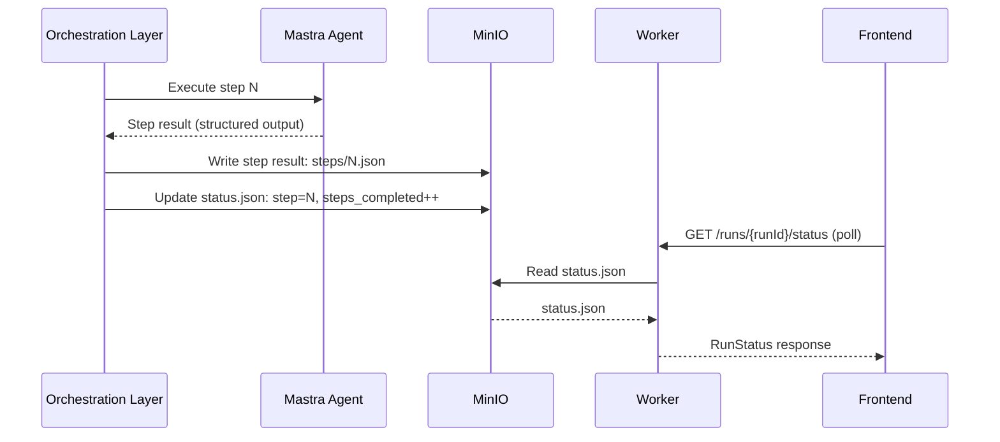
```mermaid
sequenceDiagram
    participant ORC as Orchestration Layer
    participant MA as Mastra Agent
    participant S3 as MinIO
    participant W as Worker
    participant F as Frontend

    ORC->>MA: Execute step N
    MA-->>ORC: Step result (structured output)
    ORC->>S3: Write step result: steps/N.json
    ORC->>S3: Update status.json: step=N, steps_completed++
    F->>W: GET /runs/{runId}/status (poll)
    W->>S3: Read status.json
    S3-->>W: status.json
    W-->>F: RunStatus response
```

### 2.3 Обґрунтування

- **Єдиний writer** → no race conditions на status.json
- **Mastra stateless** → Mastra не знає про lifecycle, лише виконує logic
- **Orchestration Layer контролює** retry/timeout/concurrency і відображає це у status

---

## 3. Status.json Schema

### 3.1 Canonical schema

```json
{
  "run_id": "run_2026-02-14_080000_abc123",
  "agent_slug": "archivist-violin",
  "status": "running",
  "trigger": "manual",
  "started_at": "2026-02-14T08:00:00Z",
  "finished_at": null,
  "current_step": "execute-agent",
  "steps_total": 4,
  "steps_completed": 1,
  "proposals_created": [],
  "error": null
}
```

### 3.2 Terminal state examples

**Completed:**
```json
{
  "run_id": "run_2026-02-14_080000_abc123",
  "agent_slug": "archivist-violin",
  "status": "completed",
  "trigger": "manual",
  "started_at": "2026-02-14T08:00:00Z",
  "finished_at": "2026-02-14T08:03:45Z",
  "current_step": "finalize",
  "steps_total": 4,
  "steps_completed": 4,
  "proposals_created": ["prop_2026-02-14_xyz789"],
  "error": null
}
```

**Failed:**
```json
{
  "run_id": "run_2026-02-14_080000_abc123",
  "agent_slug": "archivist-violin",
  "status": "failed",
  "trigger": "cron",
  "started_at": "2026-02-14T08:00:00Z",
  "finished_at": "2026-02-14T08:02:15Z",
  "current_step": "execute-agent",
  "steps_total": 4,
  "steps_completed": 1,
  "proposals_created": [],
  "error": "AGENT_TIMEOUT: execution exceeded 600s limit"
}
```

---

## 4. Polling Strategy

### 4.1 MVP: Polling

**[РІШЕННЯ]** MVP використовує polling для оновлень стану:

| Що | Endpoint | Інтервал | Коли зупинити |
|----|----------|----------|---------------|
| Active run status | `GET /runs/{runId}/status` | 5 секунд | `status in {completed, failed}` |
| Inbox updates | `GET /inbox/stats` | 30 секунд | Сторінка закрита |
| Pending proposals | `GET /proposals/pending` | 30 секунд | Сторінка закрита |

### 4.2 Інваріанти polling

- Frontend **завжди** читає status через Worker → MinIO
- Frontend **ніколи** не звертається до Orchestration Layer API напряму
- Terminal state → polling зупиняється (no zombie polling)
- Tab visibility → polling паузиться при hidden tab

### 4.3 Майбутнє: SSE

**[РІШЕННЯ]** Опціонально у пост-MVP — Server-Sent Events замінять polling:

```
GET /events/stream
Accept: text/event-stream

data: {"type": "run.status.changed", "runId": "...", "status": "completed"}
data: {"type": "run.step.completed", "runId": "...", "step": 3}
data: {"type": "proposal.created", "proposalId": "..."}
```

SSE генерується Worker з MinIO (не з Orchestration Layer). Frontend має підтримувати fallback до polling.

---

## 5. Failure Handling

### 5.1 Retry policy

| Параметр | Значення | Обґрунтування |
|---------|---------|--------------|
| Max retries per step | 3 | Балансує recovery та швидкість failure |
| Backoff | Exponential (1s, 2s, 4s) | Захист від thundering herd |
| Per-step timeout | 120 секунд | NLM query може бути повільним |
| Per-run timeout | 600 секунд (10 хв) | Захист від зависання |

### 5.2 Failure → status.json

При failure після exhaustion retries:

1. Orchestration Layer wrapper записує error у status.json
2. Status → `failed`
3. Error містить: error code + human-readable message
4. Run вважається terminal — не retryable автоматично
5. Owner може ініціювати новий run вручну

### 5.3 Error mapping

| Ситуація | Error у status.json | HTTP error code (API) |
|---------|--------------------|-----------------------|
| NLM недоступний | `NLM_UNAVAILABLE` | 502 |
| MinIO недоступний | `UPSTREAM_UNAVAILABLE` | 502 |
| Orchestration Layer недоступний | `UPSTREAM_UNAVAILABLE` | 502 |
| Run timeout | `AGENT_TIMEOUT` | 504 |
| Step timeout | `AGENT_TIMEOUT` | 504 |
| Retries exhausted | `INTERNAL_ERROR` | 500 |
| Concurrency limit (не error) | — (status=queued) | — |

---

## Див. також

- **КАНОНІЧНА_АРХІТЕКТУРА_ВИКОНАННЯ.md** — загальна canonical архітектура
- **АБСТРАКЦІЯ_РІВНЯ_ОРКЕСТРАЦІЇ.md** — абстракція Orchestration Layer
- **КАНОНІЧНИЙ_КОНВЕЄР_ВИКОНАННЯ.md** — pipeline виконання
- **INBOX_ТА_ЦИКЛ_ЗАПУСКУ_V1.md** — frontend-focused витяг lifecycle
- **ІНДЕКС_АРХІТЕКТУРИ_ВИКОНАННЯ.md** — master index

---

*Цей документ є канонічною специфікацією Run Lifecycle. Він vendor-agnostic за задумом.*

---

## Семантичні зв'язки

**Цей документ деталізує:**
- [[АРХІТЕКТУРНИЙ_КОРІНЬ]] — §5 Canonical Flow: стани requested → queued → running → completed/failed

**Цей документ залежить від:**
- [[АБСТРАКЦІЯ_РІВНЯ_ОРКЕСТРАЦІЇ]] — Orchestration Layer wrapper є canonical status writer
- [[КАНОНІЧНА_МОДЕЛЬ_АВТОРИТЕТУ_СХОВИЩА]] — status.json writer contract (§2.2)

**Від цього документа залежать:**
- [[КАНОНІЧНИЙ_КОНВЕЄР_ВИКОНАННЯ]] — кожна фаза pipeline відповідає стану lifecycle
- [[INBOX_ТА_ЦИКЛ_ЗАПУСКУ_V1]] — frontend-orієнтований витяг цього lifecycle
```
---
### architecture/core/КАНОНІЧНИЙ_КОНВЕЄР_ВИКОНАННЯ.md
**Розмір:** 15,186 байт
```text
---
tags:
  - domain:execution
  - status:canonical
  - format:spec
  - feature:execution
  - feature:orchestration
created: 2026-02-21
updated: 2026-02-21
tier: 1
title: "КАНОНІЧНИЙ КОНВЕЄР ВИКОНАННЯ"
dg-publish: true
dg-metatags:
dg-home:
---

# Execution Pipeline: Канонічна специфікація

> Створено: 2026-02-15
> Автор: Головний архітектор системи
> Статус: Канонічна специфікація
> Мова: Українська (канонічна)
> Частина: ІНДЕКС_АРХІТЕКТУРИ_ВИКОНАННЯ.md

---

## 0. Призначення

Цей документ описує **execution pipeline** — послідовність кроків від ініціювання run до запису результату. Він визначає:

- Повний pipeline від trigger до terminal state
- Контракти між компонентами на кожному етапі
- Data flow: що передається між компонентами
- Ordering guarantees

**[ПРИНЦИП]** Pipeline описано у термінах компонентних ролей, не vendor API. Конкретна реалізація Orchestration Layer може відрізнятися, але послідовність та контракти — canonical.

---

## 1. Pipeline Overview

```
Owner → Frontend → Worker → Orchestration Layer → Mastra → MinIO
                                                        ↕
                                                     FastAPI (NLM)
```

### 1.1 Фази pipeline

| Фаза | Компонент | Вхід | Вихід |
|------|----------|------|-------|
| **1. Trigger** | Worker | HTTP request від frontend | Orchestration event/trigger |
| **2. Enqueue** | Orchestration Layer | Event/trigger | Queued task |
| **3. Load Context** | Orchestration Layer → MinIO + git monorepo | agent_slug | _agent.md + sources + memory (Layer 1) |
| **4. Execute Agent** | Orchestration Layer → Mastra | Context + instructions + memory | Structured output |
| **5. Persist Results** | Orchestration Layer → MinIO + Gateway | Proposal(и), step results, memory-update | MinIO objects + git commit |
| **6. Finalize** | Orchestration Layer → MinIO | Run summary | manifest.json + status.json=completed |
| **7. Notify** | Worker → Frontend | Status change | Poll response / SSE event |

---

## 2. Pipeline Detail

### 2.1 Phase 1: Trigger

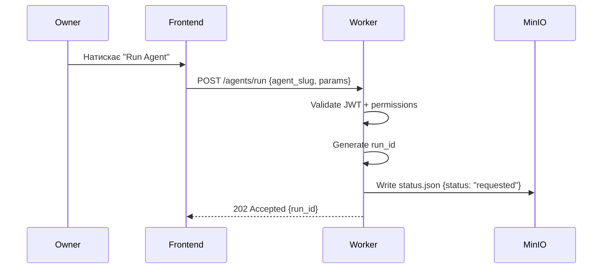
```mermaid
sequenceDiagram
    participant O as Owner
    participant F as Frontend
    participant W as Worker
    participant S3 as MinIO

    O->>F: Натискає "Run Agent"
    F->>W: POST /agents/run {agent_slug, params}
    W->>W: Validate JWT + permissions
    W->>W: Generate run_id
    W->>S3: Write status.json {status: "requested"}
    W-->>F: 202 Accepted {run_id}
```

**Контракт:**
- Worker **генерує** `run_id` (формат: `run_{date}_{time}_{random}`)
- Worker **записує** початковий `status.json` з `status: requested`
- Worker повертає **202 Accepted** (асинхронна операція)
- Frontend починає polling `GET /runs/{runId}/status`

### 2.2 Phase 2: Enqueue

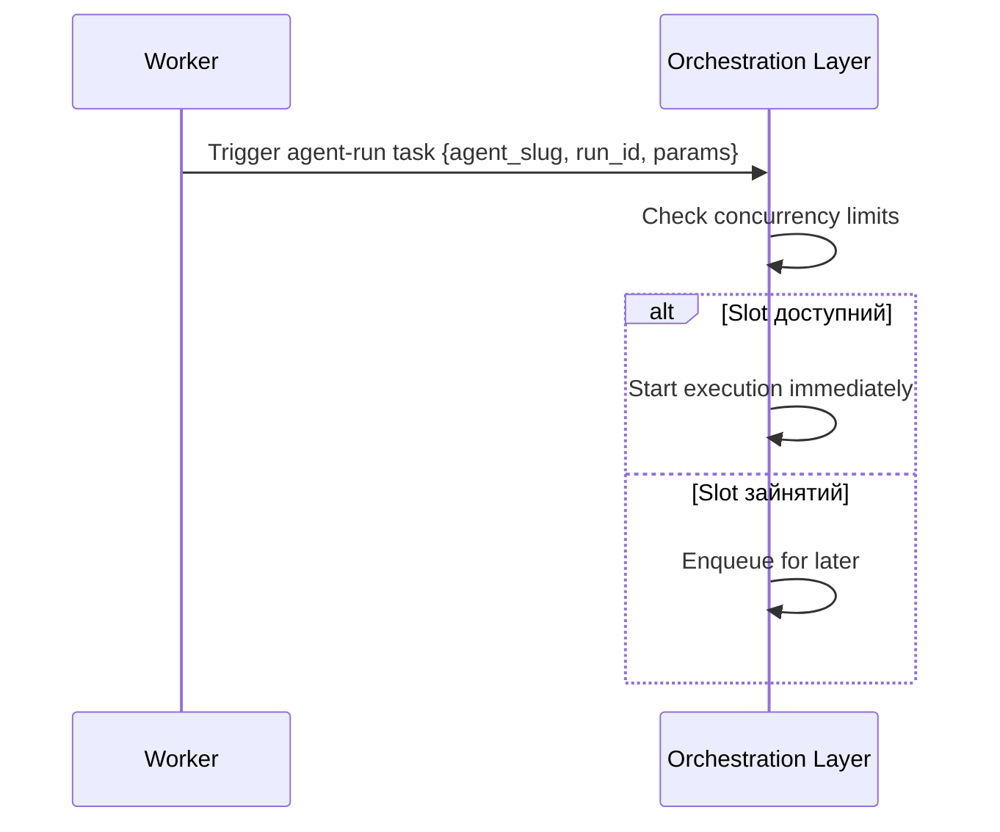
```mermaid
sequenceDiagram
    participant W as Worker
    participant ORC as Orchestration Layer

    W->>ORC: Trigger agent-run task {agent_slug, run_id, params}
    ORC->>ORC: Check concurrency limits
    alt Slot доступний
        ORC->>ORC: Start execution immediately
    else Slot зайнятий
        ORC->>ORC: Enqueue for later
    end
```

**Контракт:**
- Worker передає trigger через Orchestration Layer Adapter
- Orchestration Layer перевіряє concurrency (max 1 per agent)
- Якщо slot зайнятий → run залишається в черзі, status → `queued`
- Orchestration Layer оновлює status.json у MinIO

### 2.3 Phase 3: Load Context

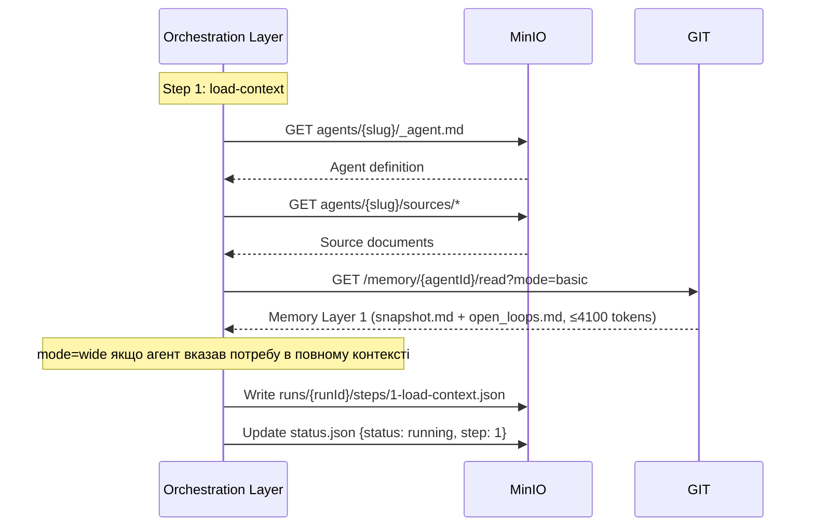
```mermaid
sequenceDiagram
    participant ORC as Orchestration Layer
    participant S3 as MinIO

    Note over ORC: Step 1: load-context

    ORC->>S3: GET agents/{slug}/_agent.md
    S3-->>ORC: Agent definition

    ORC->>S3: GET agents/{slug}/sources/*
    S3-->>ORC: Source documents

    ORC->>GIT: GET /memory/{agentId}/read?mode=basic
    GIT-->>ORC: Memory Layer 1 (snapshot.md + open_loops.md, ≤4100 tokens)

    Note over ORC: mode=wide якщо агент вказав потребу в повному контексті

    ORC->>S3: Write runs/{runId}/steps/1-load-context.json
    ORC->>S3: Update status.json {status: running, step: 1}
```

**Контракт:**
- Orchestration Layer wrapper виконує step та записує результат
- Кожен step має свій JSON у `steps/`
- Status.json оновлюється **після** успішного step write
- Memory Layer 1 завантажується через Gateway `/memory/:agentId/read` (git monorepo)
- Layer 2 (decisions, runs, timeline) — **не завантажується автоматично** (архітектурний інваріант)

### 2.4 Phase 4: Execute Agent

```mermaid
sequenceDiagram
    participant ORC as Orchestration Layer
    participant MA as Mastra Agent
    participant NLM as FastAPI (NLM)
    participant S3 as MinIO

    Note over ORC: Step 2: execute-agent

    ORC->>MA: Invoke agent {definition, context, sources}

    MA->>MA: Parse _agent.md → instructions
    MA->>MA: Register tools

    loop Agent reasoning (maxSteps)
        MA->>S3: tool: read-context
        S3-->>MA: Documents

        MA->>NLM: tool: notebooklm-query {question, sources}
        NLM-->>MA: Grounded response

        MA->>MA: Reasoning cycle
    end

    MA-->>ORC: Structured output {proposals[], summary}

    ORC->>S3: Write runs/{runId}/steps/2-execute-agent.json
    ORC->>S3: Update status.json {step: 2, steps_completed: 2}
```

**Контракт:**
- Orchestration Layer передає context у Mastra
- Mastra виконує agent logic (LLM calls, tool use)
- Mastra повертає **structured output** — не пише у MinIO напряму
- Orchestration Layer wrapper записує результат step

**[ІНВАРІАНТ]** Mastra **не пише** `status.json`. Mastra повертає результат Orchestration Layer, який є canonical writer.

### 2.5 Phase 5: Persist Results

```mermaid
sequenceDiagram
    participant ORC as Orchestration Layer
    participant S3 as MinIO

    Note over ORC: Step 3: persist-results

    loop For each content proposal in output
        ORC->>S3: Write proposals/{proposalId}.json {status: pending}
    end

    opt Якщо агент виявив нові факти або змінився стан
        ORC->>GW: POST /memory/{agentId}/propose {type: memory-update, updates: [...]}
        GW-->>ORC: {proposalId, status: pending | auto_applied}
    end

    ORC->>S3: Write runs/{runId}/steps/3-persist-results.json
    ORC->>S3: Update status.json {step: 3, proposals_created: [...]}
```

**Контракт:**
- Content proposals (propose-edit, propose-summary тощо) → MinIO зі статусом `pending`
- Memory-update proposals → Gateway (git monorepo); можуть бути auto-approved (normal priority)
- Logic-update proposals → Gateway; завжди `requiresHumanReview: true`, ніколи auto-approved
- Step result записується у MinIO

### 2.6 Phase 6: Finalize

```mermaid
sequenceDiagram
    participant ORC as Orchestration Layer
    participant S3 as MinIO

    Note over ORC: Step 4: finalize

    ORC->>S3: Write runs/{runId}/manifest.json
    ORC->>S3: Update status.json {status: completed, finished_at: now()}
```

**Контракт:**
- Manifest.json містить summary всього run
- Status.json → `completed` (terminal state)
- Після цього — жодних writes до run directory

### 2.7 Phase 7: Notify

```mermaid
sequenceDiagram
    participant F as Frontend
    participant W as Worker
    participant S3 as MinIO

    F->>W: GET /runs/{runId}/status (poll, 5s interval)
    W->>S3: Read status.json
    S3-->>W: {status: completed}
    W-->>F: RunStatus {status: completed, proposals_created: [...]}
    F->>F: Show notification, stop polling
```

**Контракт:**
- Frontend дізнається про завершення через polling
- Worker читає status.json з MinIO (canonical source)
- Frontend зупиняє polling при terminal state

---

## 3. Data Flow Summary

```
┌─────────────────────────────────────────────────────────────────┐
│                        Data Flow                                 │
│                                                                   │
│  Frontend ──HTTP──▶ Worker ──Trigger──▶ Orchestration Layer       │
│                       │                       │                   │
│                       │                       ▼                   │
│                       │               Mastra Agent                │
│                       │                  │    │                   │
│                       │          tools   │    │ tools             │
│                       │                  ▼    ▼                   │
│                       │               FastAPI  MinIO              │
│                       │                         ▲                 │
│                       │                         │                 │
│                       │    Orchestration Layer───┘                │
│                       │    writes status.json,                    │
│                       │    steps/, proposals/                     │
│                       │                         │                 │
│                       ▼                         │                 │
│  Frontend ◀──Poll──Worker ──Read────────────────┘                │
│                                                                   │
│  ═══════════════════════════════════════════════════════════════  │
│  Canonical data: MinIO                                           │
│  Ephemeral data: Orchestration Layer execution state              │
│  No data: Frontend, Worker (stateless proxies)                   │
└─────────────────────────────────────────────────────────────────┘
```

---

## 4. Ordering Guarantees

### 4.1 Step ordering

**[ІНВАРІАНТ]** Steps виконуються **послідовно** в межах одного run. Orchestration Layer гарантує:

1. Step N завершується **перед** початком Step N+1
2. Step result записується у MinIO **перед** початком наступного step
3. Status.json оновлюється **після** запису step result

### 4.2 Write ordering

**[ІНВАРІАНТ]** Для кожного step:

```
1. Mastra повертає результат
2. Step result → MinIO (steps/N.json)
3. Status.json оновлюється (steps_completed++)
```

Ця послідовність гарантує, що status.json завжди відображає фактично завершені steps.

### 4.3 Concurrency

**[ІНВАРІАНТ]** Один агент має максимум **один** concurrent run.

| Ситуація | Поведінка |
|---------|----------|
| Агент вже running | Новий run → queued |
| Глобальний ліміт досягнуто | Новий run → queued |
| Concurrency slot вільний | Run починається негайно |

---

## 5. Error Recovery

### 5.1 Component failure matrix

| Компонент | Failure | Recovery | Хто виконує |
|----------|---------|----------|------------|
| Mastra crash | Step fails | Orchestration Layer retries step | Orchestration Layer |
| NLM unavailable | Tool call fails | Mastra retries tool; then step fails | Mastra → Orchestration Layer |
| MinIO unavailable | Write fails | Orchestration Layer retries; then run fails | Orchestration Layer |
| Orchestration Layer restart | In-flight run interrupted | Durable execution replays from last checkpoint | Orchestration Layer (inherent) |
| Worker restart | API unavailable | Frontend retries poll | Frontend |

### 5.2 Idempotency

**[ІНВАРІАНТ]** Кожен step має бути **ідемпотентним** — повторне виконання не повинно створювати дублікати.

- Step result записується з фіксованим path: `steps/{step_number}-{step_name}.json`
- Proposal ID генерується детерміністично або з dedup check
- Status.json update ідемпотентний (same status = no-op)

---

## Див. також

- **КАНОНІЧНА_АРХІТЕКТУРА_ВИКОНАННЯ.md** — загальна canonical архітектура
- **АБСТРАКЦІЯ_РІВНЯ_ОРКЕСТРАЦІЇ.md** — абстракція Orchestration Layer
- **КАНОНІЧНИЙ_ЦИКЛ_ЗАПУСКУ.md** — lifecycle стани run
- **КАНОНІЧНА_МОДЕЛЬ_АВТОРИТЕТУ_СХОВИЩА.md** — storage authority
- **ІНДЕКС_АРХІТЕКТУРИ_ВИКОНАННЯ.md** — master index

---

## Семантичні зв'язки

**Цей документ деталізує:**
- [[АРХІТЕКТУРНИЙ_КОРІНЬ]] — §5 Canonical Flow: цей документ є його повним розкриттям

**Цей документ залежить від:**
- [[АБСТРАКЦІЯ_РІВНЯ_ОРКЕСТРАЦІЇ]] — Hatchet виконує кроки pipeline
- [[КАНОНІЧНИЙ_ЦИКЛ_ЗАПУСКУ]] — state transitions прив'язані до фаз pipeline
- [[КАНОНІЧНА_МОДЕЛЬ_АВТОРИТЕТУ_СХОВИЩА]] — write authority на кожній фазі
- [[ПАМ_ЯТЬ_АГЕНТА_GIT_DIFFMEM_V1]] — Phase 3: завантаження memory Layer 1
- [[INBOX_ТА_PROPOSAL_АРХІТЕКТУРА]] — Phase 5: Proposal lifecycle після run

**Від цього документа залежать:**
- [[КАНОНІЧНА_АРХІТЕКТУРА_ВИКОНАННЯ]] — pipeline є серцевиною runtime архітектури
- [[КОНТРАКТ_АГЕНТА_V1]] — що Mastra отримує на вході кожного step

---

*Цей документ є канонічною специфікацією Execution Pipeline. Він vendor-agnostic за задумом.*
```
---
### architecture/core/КОНТРАКТ_АГЕНТА_V1.md
**Розмір:** 32,031 байт
```text
---
tags:
  - domain:agent
  - status:canonical
  - format:contract
created: 2026-02-21
updated: 2026-02-21
tier: 1
title: "КОНТРАКТ АГЕНТА V1"
dg-publish: true
dg-metatags:
dg-home:
---

# Контракт агента V1

> Створено: 2026-02-14
> Оновлено: 2026-02-21 (v1.1 — оновлено модель пам'яті відповідно до ПАМ_ЯТЬ_АГЕНТА_GIT_DIFFMEM_V1.md v1.1.0)
> Автор: Архітектор системи
> Базується на: КАНОНІЧНА_АРХІТЕКТУРА_ВИКОНАННЯ.md, АРХІТЕКТУРНА_БАЗА_СИСТЕМИ.md, МАНІФЕСТ.md, ПАМ_ЯТЬ_АГЕНТА_GIT_DIFFMEM_V1.md
> Статус: Специфікація (V1.1)

---

## 0. Фундаментальний інваріант

**[ПРИНЦИП]** Логіка агента визначається storage, не runtime.

Це означає:

- Агент існує як **набір файлів у MinIO**, не як об'єкт у пам'яті Mastra.
- Якщо Mastra перезапуститься — агент відновлюється з MinIO без втрат.
- Якщо `_agent.md` видалено з MinIO — агент перестає існувати, незалежно від стану Mastra чи Orchestration Layer.
- Зміна поведінки агента = зміна файлу `_agent.md` у MinIO. Не потрібно перезапускати сервіс, деплоїти код, чи змінювати конфігурацію runtime.

**[ПРИНЦИП]** Runtime (Mastra) є **інтерпретатором**, не власником. Він читає визначення, виконує, записує результат назад у storage. Між запусками runtime не зберігає нічого про агента.

---

## 1. Структура папки агента

### 1.1 Канонічна структура

Кожен агент — це папка у MinIO бакеті `garden-agents/`:

```
garden-agents/
└── agents/
    └── <slug>/                     ← унікальний ідентифікатор агента
        │
        ├── _agent.md               ← визначення агента (обов'язковий)
        │
        ├── sources/                ← джерела знань агента
        │   ├── domain-knowledge.md
        │   ├── procedures.md
        │   └── reference-data.csv
        │
        ├── drakon/                 ← DRAKON-діаграми логіки
        │   ├── main-flow.drakon.json
        │   └── error-handling.drakon.json
        │
        │                           (агентна пам'ять у garden-bloom-memory git monorepo)
        │                           (деталі: ПАМ_ЯТЬ_АГЕНТА_GIT_DIFFMEM_V1.md)
        │
        ├── runs/                   ← журнал виконань
        │   └── <run-id>/
        │       ├── manifest.json   ← метадані запуску
        │       ├── steps/          ← проміжні результати кроків
        │       │   ├── 01-<step-name>.json
        │       │   ├── 02-<step-name>.json
        │       │   └── ...
        │       └── output/         ← фінальні артефакти
        │           ├── proposal.json
        │           └── ...
        │
        └── artifacts/              ← довготривалі артефакти агента
            ├── generated-summary.md
            ├── analysis-report.md
            └── ...
```

### 1.2 Опис директорій

| Директорія | Обов'язкова | Хто пише | Хто читає | Призначення |
|-----------|-------------|----------|-----------|-------------|
| `_agent.md` | **Так** | Людина або DRAKON export | Mastra (runtime) | Визначення: хто агент, що робить, які інструменти має |
| `sources/` | Ні | Людина | Mastra (tool: `read-context`) | Джерела знань, які агент використовує для reasoning |
| `drakon/` | Ні | Людина (DRAKON Editor) | Mastra (tool: `read-drakon`), DRAKON export pipeline | Візуальна логіка агента; може бути джерелом для генерації `_agent.md` |
| `runs/` | Ні (створюється автоматично) | Orchestration Layer + Mastra | Frontend (перегляд), аудит | Повний журнал кожного виконання |
| `artifacts/` | Ні | Mastra (через proposal → apply) | Людина, Frontend, інші агенти | Довготривалі результати роботи агента |

> **[ЗМІНА v1.1]** Агентна пам'ять (`memory/`) перенесена з MinIO-папки агента до окремого git-монорепозиторію `garden-bloom-memory`. Структура: `memory/<agentId>/snapshot.md`, `facts.md`, `open_loops.md`, `decisions.md`. Аналогічно логіка: `logic/<agentId>/current.drakon.json`, `current.pseudo.md`. Деталі — у ПАМ_ЯТЬ_АГЕНТА_GIT_DIFFMEM_V1.md та ВЕРСІОНУВАННЯ_ЛОГІКИ_АГЕНТА_V1.md.

### 1.3 Правила

**[ПРИНЦИП]** Єдиний обов'язковий файл — `_agent.md`. Папка з одним `_agent.md` — це валідний агент. Усі інші директорії створюються за потреби.

**[ПРИНЦИП]** Папка без `_agent.md` — це **не агент**. Навіть якщо в ній є `sources/` та `drakon/`. Файл `_agent.md` є маркером існування агента.

**[ОБМЕЖЕННЯ]** `runs/` є append-only. Результати виконань не можуть бути змінені або видалені (лише архівовані).

**[ОБМЕЖЕННЯ]** Агентна пам'ять (у git monorepo `garden-bloom-memory`) записується через Proposal lifecycle (propose-memory-update), але **контролюється Owner**. Owner може редагувати або відкочувати пам'ять агента через git або UI. Шар 1 (snapshot.md, facts.md, open_loops.md) завантажується автоматично з HARD лімітом ≤ 12 000 токенів. Шар 2 (decisions.md, runs/, changelog.md) — лише за явним запитом.

---

## 2. Структура `_agent.md`

### 2.1 Формат

`_agent.md` складається з двох частин:
1. **YAML frontmatter** — структурована конфігурація
2. **Markdown body** — інструкції агента (system prompt)

### 2.2 YAML frontmatter — повна специфікація

```yaml
---
# ── Ідентичність ──────────────────────────────────────────────
name: "Назва агента"                    # обов'язкове; людиночитана назва
slug: "agent-slug"                      # обов'язкове; унікальний id, [a-z0-9-]
version: "1.0.0"                        # обов'язкове; semver
description: "Короткий опис ролі"       # обов'язкове; одне речення

# ── Модель ─────────────────────────────────────────────────────
model: "claude-sonnet-4-5-20250929"     # обов'язкове; ідентифікатор LLM
temperature: 0.3                        # опціонально; default 0.3
max_steps: 5                            # опціонально; default 5; ліміт ітерацій

# ── Інструменти ────────────────────────────────────────────────
tools:                                  # обов'язкове; мінімум 1 safe-output tool
  - notebooklm-query                    # запит до NotebookLM (grounded reasoning)
  - read-context                        # читання sources/ агента
  - read-notes                          # читання Zettelkasten нотаток
  - create-proposal                     # створення proposal (safe output)
  - read-memory                         # читання memory/ агента
  - write-memory                        # запис у memory/ агента
  - read-drakon                         # читання DRAKON-діаграм
  - search-notes                        # пошук по нотатках

# ── Safe outputs ───────────────────────────────────────────────
safe_outputs:                           # обов'язкове; що агент може генерувати
  - propose-edit                        # пропозиція редагування нотатки
  - propose-summary                     # пропозиція резюме
  - propose-tag                         # пропозиція тегу
  - propose-artifact                    # пропозиція нового артефакту

# ── Тригери ────────────────────────────────────────────────────
triggers:                               # опціонально; коли агент запускається
  manual: true                          # дозволити ручний запуск через UI
  cron: "0 8 * * 1"                     # розклад (cron-синтаксис); null = вимкнено
  events:                               # реакція на події; null = вимкнено
    - "note/created"
    - "comment/approved"

# ── Контекст ───────────────────────────────────────────────────
context:
  folder: "violin.pp.ua"                # опціонально; slug папки знань
  max_sources: 10                       # опціонально; default 10; ліміт джерел за запит
  notebook_id: "nb_abc123"              # опціонально; ID NotebookLM notebook

# ── Metadata ───────────────────────────────────────────────────
created_at: "2026-02-14T12:00:00Z"      # обов'язкове; ISO 8601
updated_at: "2026-02-14T12:00:00Z"      # обов'язкове; ISO 8601
created_by: "owner"                     # обов'язкове; хто створив
generated_from: "main-flow.drakon.json" # опціонально; якщо згенеровано з DRAKON
status: "active"                        # обов'язкове; див. §4 Стани агента
---
```

### 2.3 Markdown body — інструкції агента

Markdown body є **system prompt** агента. Він може містити:

1. **Природну мову** — прямі інструкції
2. **Псевдокод** — згенерований з DRAKON (див. §3)
3. **Комбінацію** — природна мова + вбудований псевдокод

```markdown
# Інструкції

Ти — агент-архіваріус папки "violin.pp.ua".

## Твоя роль

Аналізувати нові нотатки у папці та створювати структуровані резюме
для швидкого пошуку та навігації.

## Процедура

1. Прочитай список нотаток у папці (tool: read-notes)
2. Для кожної нової нотатки (без тегу "summarized"):
   a. Прочитай повний текст нотатки
   b. Запитай NotebookLM: "Створи структуроване резюме цієї нотатки"
   c. Створи proposal: propose-summary з результатом
3. Запиши в memory спостереження про оброблені нотатки

## Обмеження

- НЕ змінюй оригінальний текст нотаток
- НЕ створюй резюме для нотаток коротших за 200 слів
- Якщо NotebookLM недоступний — зупинись і запиши помилку в run log
```

### 2.4 Обов'язкові та опціональні поля

| Поле | Обов'язкове | Валідація |
|------|-------------|-----------|
| `name` | Так | Непорожній рядок |
| `slug` | Так | `^[a-z0-9][a-z0-9-]*$`, унікальний у системі |
| `version` | Так | Semver формат |
| `description` | Так | Непорожній рядок |
| `model` | Так | Валідний model ID |
| `tools` | Так | Масив ≥1 елемент; має містити хоча б один safe-output tool |
| `safe_outputs` | Так | Масив ≥1 елемент |
| `status` | Так | Одне з визначених значень (§4) |
| `created_at` | Так | ISO 8601 |
| `updated_at` | Так | ISO 8601 |
| `created_by` | Так | Непорожній рядок |
| `temperature` | Ні | 0.0–1.0; default 0.3 |
| `max_steps` | Ні | 1–20; default 5 |
| `triggers` | Ні | Об'єкт; default `{manual: true}` |
| `context` | Ні | Об'єкт |
| `generated_from` | Ні | Ім'я файлу `.drakon.json` |

**[ПРИНЦИП]** Якщо агент не має жодного safe-output tool у `tools[]` — він не може бути активований. Агент без safe-output не здатний впливати на систему.

---

## 3. Роль псевдокоду з DRAKON

### 3.1 Два шляхи створення агента

```
Шлях A: Людина → _agent.md (вручну)
        Прямі інструкції природною мовою.
        Підходить для простих агентів з лінійною логікою.

Шлях B: Людина → DRAKON-діаграма → pseudocodeToMarkdown() → _agent.md
        Візуальна побудова логіки → автоматична генерація інструкцій.
        Підходить для агентів зі складною логікою, розгалуженнями, циклами.
```

### 3.2 DRAKON → `_agent.md` конвеєр

```
┌──────────────────┐
│  DRAKON Editor   │  Людина будує діаграму візуально
│  (Frontend)      │  у DRAKON Editor з локалізацією
└────────┬─────────┘
         │ Save
         ▼
┌──────────────────┐
│  main-flow       │  Діаграма зберігається у MinIO
│  .drakon.json    │  agents/<slug>/drakon/
└────────┬─────────┘
         │ Export
         ▼
┌──────────────────┐
│  drakongen       │  pseudocodeToMarkdown()
│  (Frontend lib)  │  Генерує локалізований псевдокод
└────────┬─────────┘
         │
         ▼
┌──────────────────┐
│  agentExporter() │  Обгортає псевдокод у YAML frontmatter
│  (нова функція)  │  Встановлює generated_from, tools, safe_outputs
└────────┬─────────┘
         │ Save
         ▼
┌──────────────────┐
│  _agent.md       │  Готовий агент у MinIO
│  (MinIO)         │  agents/<slug>/_agent.md
└──────────────────┘
```

### 3.3 Формат псевдокоду у `_agent.md`

Коли `_agent.md` згенерований з DRAKON, його Markdown body містить псевдокод:

```markdown
# Логіка (згенеровано з main-flow.drakon.json)

ПОЧАТОК "Аналіз нових нотаток"

  нотатки ← read-notes(folder)

  ЯКЩО нотатки порожні
    write-memory("Нових нотаток немає")
    → КІНЕЦЬ

  ДЛЯ КОЖНОЇ нотатка З нотатки
    ЯКЩО нотатка.має_тег("summarized")
      → НАСТУПНА

    зміст ← read-context(нотатка.slug)

    ЯКЩО довжина(зміст) < 200 слів
      → НАСТУПНА

    відповідь ← notebooklm-query("Створи резюме", зміст)

    create-proposal(
      тип: "propose-summary",
      нотатка: нотатка.slug,
      зміст: відповідь
    )

КІНЕЦЬ
```

### 3.4 Зв'язок діаграми та агента

**[РІШЕННЯ]** Поле `generated_from` у frontmatter вказує на DRAKON-файл, з якого згенеровано інструкції. Це забезпечує:

- **Traceability** — завжди можна знайти діаграму-джерело
- **Re-generation** — при зміні діаграми можна перегенерувати `_agent.md`
- **Versioning** — `version` у frontmatter змінюється при перегенерації

**[ОБМЕЖЕННЯ]** Якщо людина вручну змінила Markdown body після генерації з DRAKON — `generated_from` має бути видалений або позначений як `generated_from: "main-flow.drakon.json # modified manually"`. Runtime не перевіряє відповідність діаграми та інструкцій.

**[ПРИНЦИП]** DRAKON-діаграма є **авторитетним джерелом логіки**. Якщо є розбіжність між діаграмою та Markdown body — діаграма має пріоритет, і `_agent.md` має бути перегенерований.

---

## 4. Стани агента

### 4.1 Діаграма переходів

```mermaid
stateDiagram-v2
    [*] --> draft : створення

    draft --> active : Owner активує
    draft --> archived : Owner архівує

    active --> paused : Owner призупиняє
    active --> error : runtime помилка
    active --> archived : Owner архівує

    paused --> active : Owner відновлює
    paused --> archived : Owner архівує

    error --> active : Owner скидає помилку
    error --> paused : Owner призупиняє
    error --> archived : Owner архівує

    archived --> draft : Owner відновлює з архіву
    archived --> [*] : Owner видаляє назавжди
```

### 4.2 Опис станів

| Стан | Значення поля `status` | Дозволяє запуск | Хто переводить | Опис |
|------|----------------------|-----------------|----------------|------|
| **Draft** | `draft` | Ні | Людина | Агент створений, але не готовий до виконання. Може мати неповні інструкції або відсутні tools |
| **Active** | `active` | Так | Людина | Агент готовий до виконання. Реагує на тригери (manual, cron, events) |
| **Paused** | `paused` | Ні | Людина | Агент тимчасово зупинений. Тригери ігноруються. Дані та пам'ять зберігаються |
| **Error** | `error` | Ні | Runtime (автоматично) | Останній run завершився критичною помилкою. Потребує уваги Owner |
| **Archived** | `archived` | Ні | Людина | Агент деактивований. Зберігається для історії. Може бути відновлений |

### 4.3 Правила переходів

**[ПРИНЦИП]** Лише людина (Owner) може переводити агента в стани `active`, `paused`, `archived`. Runtime може лише встановити `error`.

**[ПРИНЦИП]** Перехід `active → error` відбувається автоматично, якщо run завершився з критичною помилкою (NotebookLM недоступний, MinIO недоступний, перевищено max_steps без результату).

**[ОБМЕЖЕННЯ]** Видалення агента (перехід `archived → [*]`) видаляє всю папку `agents/<slug>/` з MinIO. Це незворотна операція, яка потребує явного підтвердження.

**[ОБМЕЖЕННЯ]** Агент у стані `draft` не може бути запущений навіть вручну. Це захист від виконання неготових визначень.

### 4.4 Зберігання стану

Стан зберігається у полі `status` файлу `_agent.md` (frontmatter). Зміна стану = зміна файлу у MinIO.

Додатково: `error_details` записується в `runs/<last-run-id>/manifest.json` при переході в `error`. Frontend читає ці дані для відображення діагностики.

---

## 5. Реєстр агентів

**[РІШЕННЯ]** Файл `garden-agents/registry.json` є кешованим індексом усіх агентів.

```json
{
  "version": "1",
  "updated_at": "2026-02-14T12:00:00Z",
  "agents": [
    {
      "slug": "archivist-violin",
      "name": "Архіваріус Violin",
      "status": "active",
      "version": "1.0.0",
      "last_run": "2026-02-14T08:00:00Z",
      "last_run_status": "completed",
      "pending_proposals": 2
    }
  ]
}
```

**[ОБМЕЖЕННЯ]** `registry.json` є **кешем**, не джерелом істини. Джерело істини — файли `_agent.md` у папках агентів. При розбіжності registry перебудовується з файлової системи.

---

## 6. Повний приклад

### 6.1 Структура папки

```
garden-agents/agents/archivist-violin/
│
├── _agent.md
│
├── sources/
│   ├── violin-taxonomy.md
│   ├── note-formatting-guide.md
│   └── summary-template.md
│
├── drakon/
│   └── main-flow.drakon.json
│
│   (пам'ять у garden-bloom-memory monorepo: memory/archivist-violin/)
│
├── runs/
│   ├── run_2026-02-14_080000_abc123/
│   │   ├── manifest.json
│   │   ├── steps/
│   │   │   ├── 01-load-context.json
│   │   │   ├── 02-list-notes.json
│   │   │   ├── 03-nlm-summarize.json
│   │   │   └── 04-create-proposal.json
│   │   └── output/
│   │       └── proposal-summary-sonata-bwv1001.json
│   └── run_2026-02-13_080000_def456/
│       ├── manifest.json
│       ├── steps/
│       │   └── 01-load-context.json
│       └── output/
│           └── (empty — no new notes found)
│
└── artifacts/
    ├── weekly-digest-2026-w07.md
    └── folder-index.md
```

### 6.2 Приклад `_agent.md`

```markdown
---
name: "Архіваріус Violin"
slug: "archivist-violin"
version: "1.2.0"
description: "Аналізує нові нотатки у папці violin.pp.ua та створює структуровані резюме"

model: "claude-sonnet-4-5-20250929"
temperature: 0.2
max_steps: 8

tools:
  - notebooklm-query
  - read-context
  - read-notes
  - read-memory
  - write-memory
  - create-proposal

safe_outputs:
  - propose-summary
  - propose-tag

triggers:
  manual: true
  cron: "0 8 * * 1-5"
  events:
    - "note/created"

context:
  folder: "violin.pp.ua"
  max_sources: 5
  notebook_id: "nb_violin_main"

created_at: "2026-02-01T10:00:00Z"
updated_at: "2026-02-14T12:00:00Z"
created_by: "owner"
generated_from: "main-flow.drakon.json"
status: "active"
---

# Архіваріус: інструкції

Ти — агент-архіваріус папки "violin.pp.ua" у Digital Garden.

## Роль

Ти відповідаєш за підтримку актуальних резюме нотаток у папці.
Кожна нова або змінена нотатка повинна мати структуроване резюме
для швидкої навігації та пошуку.

## Джерела

Ти працюєш **виключно** на основі:
- Нотаток у папці violin.pp.ua (tool: read-notes)
- Джерел у sources/ (tool: read-context)
- Відповідей NotebookLM (tool: notebooklm-query)

Ти **не** вигадуєш інформацію. Якщо джерело не містить відповіді —
повідом про це у proposal.

## Процедура

ПОЧАТОК "Щоденний аналіз"

  нотатки ← read-notes("violin.pp.ua")
  пам'ять ← read-memory()
  оброблені ← пам'ять.оброблені_slugs

  ДЛЯ КОЖНОЇ нотатка З нотатки
    ЯКЩО нотатка.slug Є В оброблені
      ЯКЩО нотатка.updated_at <= пам'ять.останній_run
        → НАСТУПНА

    зміст ← read-context(нотатка.slug)

    ЯКЩО довжина(зміст) < 200 слів
      → НАСТУПНА

    резюме ← notebooklm-query(
      "Створи структуроване резюме цієї нотатки. "
      "Включи: основну тезу, ключові поняття, зв'язки з іншими темами.",
      джерело: зміст
    )

    теги ← notebooklm-query(
      "Запропонуй 3-5 тегів для цієї нотатки на основі її змісту.",
      джерело: зміст
    )

    create-proposal(
      тип: "propose-summary",
      нотатка: нотатка.slug,
      зміст: резюме
    )

    create-proposal(
      тип: "propose-tag",
      нотатка: нотатка.slug,
      теги: теги
    )

  write-memory(
    оброблені: оновлений_список,
    останній_run: поточний_час
  )

КІНЕЦЬ

## Обмеження

- Не змінюй оригінальний текст нотаток — лише створюй proposals
- Не створюй резюме для нотаток коротших за 200 слів
- Максимум 10 proposals за один run
- Якщо NotebookLM недоступний — зупинись, запиши помилку в run log
- Якщо нотатка вже має актуальне резюме — пропусти
```

### 6.3 Приклад `runs/<run-id>/manifest.json`

```json
{
  "run_id": "run_2026-02-14_080000_abc123",
  "agent_slug": "archivist-violin",
  "agent_version": "1.2.0",
  "trigger": "cron",
  "started_at": "2026-02-14T08:00:00Z",
  "finished_at": "2026-02-14T08:02:34Z",
  "status": "completed",
  "steps_count": 4,
  "proposals_created": 2,
  "model_used": "claude-sonnet-4-5-20250929",
  "tokens_used": {
    "input": 4200,
    "output": 1100
  },
  "error": null
}
```

### 6.4 Приклад пам'яті агента (у garden-bloom-memory monorepo)

Файл `memory/archivist-violin/snapshot.md` (Шар 1, auto-load, ≤ 2 000 токенів):

```markdown
# Snapshot: archivist-violin
**Оновлено:** 2026-02-14T08:02:34Z
**Версія:** 12

## Роль
Архіваріус папки violin.pp.ua — створює резюме та теги для нових нотаток.

## Активний контекст
Обробка нотаток: sonata-bwv1001 ✅, partita-bwv1002 ✅

## Ключові факти
- Останній успішний run: 2026-02-14T08:02:34Z
- Оброблено нотаток всього: 47
```

Файл `memory/archivist-violin/facts.md` (Шар 1, auto-load, ≤ 8 000 токенів):

```markdown
# Facts: archivist-violin

## Домен
- Нотатки до 200 слів — не обробляються
- NotebookLM notebook_id: nb_violin_main

## Проєктний контекст
- Папка violin.pp.ua, max_sources: 5
```

> Повний опис структури пам'яті — ПАМ_ЯТЬ_АГЕНТА_GIT_DIFFMEM_V1.md

---

## 7. Валідація контракту

**[РІШЕННЯ]** Перед активацією агента (перехід `draft → active`) система перевіряє:

| Перевірка | Критерій | Наслідок при порушенні |
|-----------|----------|----------------------|
| `_agent.md` існує | Файл присутній у папці | Агент не може існувати |
| Frontmatter валідний | YAML парситься, обов'язкові поля присутні | Не можна активувати |
| `slug` унікальний | Жодного іншого агента з таким slug | Не можна активувати |
| `tools[]` не порожній | Хоча б один інструмент | Не можна активувати |
| `safe_outputs[]` не порожній | Хоча б один safe output | Не можна активувати |
| `model` валідний | Model ID розпізнається Mastra | Не можна активувати |
| Safe output tool присутній | `tools[]` містить хоча б один tool з `safe_outputs[]` | Не можна активувати |
| Markdown body непорожній | Є інструкції після frontmatter | Попередження (можна активувати) |

---

*Цей документ є специфікацією контракту агента V1. Зміни до контракту вимагають оновлення версії документа та узгодження з КАНОНІЧНА_АРХІТЕКТУРА_ВИКОНАННЯ.md.*

---

## Семантичні зв'язки

**Цей документ деталізує:**
- [[АРХІТЕКТУРНИЙ_КОРІНЬ]] — аксіоми A3 (stateless: агент = _agent.md, не стан runtime), A7 (bounded memory)

**Цей документ залежить від:**
- [[ПАМ_ЯТЬ_АГЕНТА_GIT_DIFFMEM_V1]] — модель пам'яті агента (Layer 1/2, HARD limits)
- [[ВЕРСІОНУВАННЯ_ЛОГІКИ_АГЕНТА_V1]] — версіонування logic/ (logic-update proposals)
- [[DRAKON_ІНТЕГРАЦІЯ_ТА_МОДЕЛЬ_ВИКОНАННЯ_АГЕНТА]] — DRAKON → pseudocode → _agent.md

**Від цього документа залежать:**
- [[КАНОНІЧНА_АРХІТЕКТУРА_ВИКОНАННЯ]] — Mastra інтерпретує цей контракт
- [[КАНОНІЧНИЙ_КОНВЕЄР_ВИКОНАННЯ]] — Phase 3 (Context Load): завантаження _agent.md та memory
- [[INBOX_ТА_PROPOSAL_АРХІТЕКТУРА]] — агент породжує proposals як safe output
```
---
### architecture/core/КАНОНІЧНА_МОДЕЛЬ_АВТОРИТЕТУ_СХОВИЩА.md
**Розмір:** 13,478 байт
```text
---
tags:
  - domain:storage
  - status:canonical
  - format:spec
  - feature:storage
created: 2026-02-21
updated: 2026-02-21
tier: 1
title: "КАНОНІЧНА МОДЕЛЬ АВТОРИТЕТУ СХОВИЩА"
dg-publish: true
dg-metatags:
dg-home:
---

# Storage Authority Model: Канонічна специфікація

> Створено: 2026-02-15
> Автор: Головний архітектор системи
> Статус: Канонічна специфікація
> Мова: Українська (канонічна)
> Частина: ІНДЕКС_АРХІТЕКТУРИ_ВИКОНАННЯ.md

---

## 0. Призначення

Цей документ описує **storage authority model** — хто має право писати що і куди. Він визначає:

- MinIO як canonical source of truth
- Write authority per component
- Read authority per component
- Anti-patterns (хто НЕ повинен писати куди)

**[ПРИНЦИП]** У системі є рівно **одне** canonical storage — MinIO. Усі інші компоненти є або writers (з обмеженою authority), або readers (через Worker proxy).

---

## 1. Storage Hierarchy

```
┌────────────────────────────────────────────────┐
│              MinIO (Canonical Storage)           │
│                                                  │
│  Tier 1: Source of Truth                         │
│  ├── agents/{slug}/_agent.md      (definition)   │
│  ├── agents/{slug}/sources/       (knowledge)    │
│  ├── agents/{slug}/memory/        (agent memory) │
│  └── system/                      (policies)     │
│                                                  │
│  Tier 2: Operational State                       │
│  ├── agents/{slug}/runs/          (run logs)     │
│  ├── agents/{slug}/proposals/     (proposals)    │
│  └── audit/                       (audit trail)  │
│                                                  │
│  Tier 3: Cache/Index                             │
│  └── agents/index.json            (registry)     │
│                                                  │
├────────────────────────────────────────────────┤
│       garden-bloom-memory (Git Monorepo)          │
│                                                  │
│  Tier 1: Agent Memory (Layer 1 — auto-load)      │
│  ├── memory/{agentId}/snapshot.md  (≤2K tokens)  │
│  ├── memory/{agentId}/facts.md     (≤8K tokens)  │
│  └── memory/{agentId}/open_loops.md(≤2K tokens)  │
│                                                  │
│  Tier 2: Agent Memory (Layer 2 — explicit only)  │
│  ├── memory/{agentId}/decisions.md               │
│  ├── memory/{agentId}/changelog.md               │
│  └── memory/{agentId}/runs/                      │
│                                                  │
│  Tier 3: Agent Logic (versioned)                 │
│  ├── logic/{agentId}/current.drakon.json         │
│  ├── logic/{agentId}/current.pseudo.md           │
│  └── logic/{agentId}/versions/                   │
│                                                  │
├────────────────────────────────────────────────┤
│              GitHub (Content Persistence)         │
│  ├── notes/                       (published)    │
│  └── drakon/                      (committed)    │
│                                                  │
├────────────────────────────────────────────────┤
│              Cloudflare KV (Session/Auth)         │
│  ├── auth/                        (tokens)       │
│  ├── zones/                       (zone config)  │
│  └── sessions/                    (user sessions)│
└────────────────────────────────────────────────┘
```

---

## 2. Write Authority Matrix

### 2.1 MinIO writes

| Path | Canonical Writer | Коли | Інші дозволені writers |
|------|-----------------|------|----------------------|
| `agents/{slug}/_agent.md` | Owner (через Worker) | Agent definition create/update | — |
| `agents/{slug}/sources/*` | Owner (через Worker) | Upload knowledge sources | — |
| `agents/{slug}/pseudocode.md` | Owner (через Worker) | Behavioral contract update | — |
| `agents/{slug}/drakon/*` | Owner (через Worker) | DRAKON diagram save | — |
| `memory/{agentId}/*` (git monorepo) | Gateway (via Proposal `memory-update`) | Post-run memory update через Proposal lifecycle | — |
| `logic/{agentId}/current.*` (git monorepo) | Gateway (via Proposal `logic-update`) | Logic versioning через Proposal lifecycle (завжди human review) | — |
| `agents/{slug}/runs/{runId}/status.json` | **Orchestration Layer wrapper** | Run lifecycle updates | Worker (initial `requested`) |
| `agents/{slug}/runs/{runId}/manifest.json` | Orchestration Layer wrapper | Run finalize | — |
| `agents/{slug}/runs/{runId}/steps/*.json` | Orchestration Layer wrapper | Step completion | — |
| `agents/{slug}/proposals/{propId}.json` | Orchestration Layer wrapper | Proposal creation | Worker (status transitions) |
| `audit/*` | Worker | API audit events | Orchestration Layer wrapper (run audit) |
| `agents/index.json` | Worker | Registry rebuild | — |

### 2.2 Status Writer Invariant

**[ІНВАРІАНТ]** `status.json` має рівно **два** дозволені writers:

1. **Worker** — лише для початкового запису `{status: "requested"}`
2. **Orchestration Layer wrapper** — для всіх наступних transitions (`queued`, `running`, `completed`, `failed`)

**Mastra НЕ пише status.json.** Mastra повертає результати Orchestration Layer, який оновлює status.

### 2.3 Proposal Status Transitions

| Transition | Writer | Механізм |
|-----------|--------|---------|
| → `pending` | Orchestration Layer wrapper | Proposal creation під час run |
| `pending` → `approved` / `rejected` | Worker | Owner action через API |
| `approved` → `applying` | Worker | Apply Engine |
| `applying` → `applied` | Worker | Successful git commit |
| `applying` → `failed` | Worker | Git commit error |
| `pending` → `auto_approved` | Worker | Auto-approve rule match |
| `pending` → `expired` | Worker (cron) | TTL check |

---

## 3. Read Authority Matrix

### 3.1 Хто читає MinIO

| Компонент | Що читає | Як | Навіщо |
|----------|---------|-----|--------|
| **Worker** | Все (MinIO) | S3 API (direct) | Proxy для frontend; apply engine |
| **Orchestration Layer wrapper** | `_agent.md`, sources (MinIO) | S3 API (direct) | Context для agent execution |
| **Orchestration Layer wrapper** | `memory/<agentId>/` (git monorepo) | Gateway API `/memory/:agentId/read` | Завантаження пам'яті Шару 1 перед виконанням |
| **Mastra** | sources | Через tool: `read-context` | Agent reasoning |
| **Mastra** | `memory/<agentId>/` (Шар 1) | Через tool: `read-memory()` | Відновлення контексту між запусками |
| **Optimizer agent** | `logic/<agentId>/`, `runs/` (явний запит) | Через tools | Аналіз для propose-logic-update |
| **Frontend** | **Нічого напряму** | Через Worker API | Projection layer |
| **FastAPI** | **Нічого** | — | Ізольований NLM proxy |

### 3.2 Frontend Read Path

**[ІНВАРІАНТ]** Frontend **ніколи** не читає MinIO напряму.

```
Frontend → Worker (HTTPS) → MinIO (S3 API) → Response → Worker → Frontend
```

Frontend оперує **API responses**, не MinIO objects. Це забезпечує:
- Auth enforcement на Worker level
- Response transformation (MinIO JSON → API JSON)
- Rate limiting
- Audit logging

---

## 4. Anti-Patterns

### 4.1 Заборонені writes

| Компонент | НЕ повинен писати | Причина |
|----------|------------------|---------|
| **Mastra** | `status.json` | Status writer = Orchestration Layer wrapper |
| **Mastra** | `proposals/*.json` напряму | Proposals створює Orchestration Layer wrapper |
| **Frontend** | будь-що у MinIO | Frontend = projection layer |
| **FastAPI** | будь-що у MinIO | FastAPI = ізольований NLM proxy |
| **Orchestration Layer** | `_agent.md` | Agent definition = Owner authority |
| **Orchestration Layer** | `agents/index.json` | Registry = Worker authority |

### 4.2 Заборонені reads

| Компонент | НЕ повинен читати | Причина |
|----------|------------------|---------|
| **Frontend** | MinIO напряму | Auth bypass, coupling |
| **Frontend** | Orchestration Layer API | Vendor coupling |
| **FastAPI** | MinIO | Ізольований сервіс |

---

## 5. Data Lifecycle

### 5.1 Retention

| Data Category | Retention | Cleanup |
|--------------|-----------|---------|
| Agent definitions (`_agent.md`) | Permanent | Owner deletes |
| Run logs (`runs/`) | Configurable (default: 90 days) | Cron cleanup |
| Proposals (applied) | Permanent (audit trail) | — |
| Proposals (expired/rejected) | 30 days | Cron cleanup |
| Audit log | Permanent | — |
| Agent memory Layer 1 (`snapshot.md`, `facts.md`, `open_loops.md`) | Permanent; старі факти → git-history (eviction при >HARD LIMIT) | Gateway eviction |
| Agent memory Layer 2 (`runs/`, `timeline/`) | 90 днів у git monorepo; потім MinIO deep storage | Cron |
| Agent logic (`logic/<agentId>/current.*`) | Permanent | — |
| Agent logic versions (`logic/<agentId>/versions/`) | Permanent (незмінний архів) | — |

### 5.2 Consistency Model

**[ПРИНЦИП]** MinIO забезпечує **eventual consistency** для reads після writes. Для runtime це означає:

- Status.json write → poll може показати old value протягом ~1-2с
- Це прийнятно для 5с polling interval
- Step result write → status.json update: **порядок гарантований** Orchestration Layer (sequential steps)

---

## 6. Recovery

### 6.1 MinIO recovery

**[ІНВАРІАНТ]** Якщо MinIO втрачає дані — система втрачає дані. MinIO є **єдиним** canonical storage.

Мітигація:
- MinIO replication (виходить за межі цього документа)
- MinIO backup policy (виходить за межі цього документа)

### 6.2 Component recovery

| Ситуація | Recovery | Дані втрачені? |
|---------|----------|---------------|
| Mastra restart | Перезапуск current step | **Ні** — Mastra stateless |
| Orchestration Layer restart | Durable execution replay | **Ні** — replay з MinIO checkpoints |
| Worker restart | Frontend retries | **Ні** — Worker stateless |
| MinIO restart | Service unavailable temporarily | **Ні** — data persisted |
| MinIO data loss | **Катастрофа** | **Так** — canonical data lost |

---

## Див. також

- **КАНОНІЧНА_АРХІТЕКТУРА_ВИКОНАННЯ.md** — загальна canonical архітектура
- **АБСТРАКЦІЯ_РІВНЯ_ОРКЕСТРАЦІЇ.md** — абстракція Orchestration Layer
- **КАНОНІЧНИЙ_ЦИКЛ_ЗАПУСКУ.md** — lifecycle стани run
- **КАНОНІЧНИЙ_КОНВЕЄР_ВИКОНАННЯ.md** — pipeline виконання
- **ІНДЕКС_АРХІТЕКТУРИ_ВИКОНАННЯ.md** — master index

---

## Семантичні зв'язки

**Цей документ деталізує:**
- [[АРХІТЕКТУРНИЙ_КОРІНЬ]] — аксіоми A1 (storage authority), A5 (gateway entrypoint), A6 (frontend isolation)

**Цей документ залежить від:**
- [[ПАМ_ЯТЬ_АГЕНТА_GIT_DIFFMEM_V1]] — git monorepo як окремий storage tier (memory/, logic/)
- [[INBOX_ТА_PROPOSAL_АРХІТЕКТУРА]] — proposal lifecycle визначає transitions статусів

**Від цього документа залежать:**
- [[КАНОНІЧНИЙ_КОНВЕЄР_ВИКОНАННЯ]] — хто що пише на кожній фазі pipeline
- [[КАНОНІЧНА_АРХІТЕКТУРА_ВИКОНАННЯ]] — загальна authority model
- [[АБСТРАКЦІЯ_РІВНЯ_ОРКЕСТРАЦІЇ]] — Hatchet wrapper як status writer
- [[КАНОНІЧНИЙ_ЦИКЛ_ЗАПУСКУ]] — status.json writer contract

---

*Цей документ є канонічною специфікацією Storage Authority Model. Він vendor-agnostic за задумом.*
```
---
### architecture/core/_INDEX.md
**Розмір:** 1,237 байт
```text
# Architecture / Core

Ядро runtime специфікацій Garden Bloom — канонічні документи, що визначають архітектуру виконання, контракти агентів, та lifecycle.

## Файли

| Файл | Опис | Статус |
|------|------|--------|
| [[КАНОНІЧНА_АРХІТЕКТУРА_ВИКОНАННЯ]] | Повна vendor-agnostic архітектура виконання | canonical |
| [[КАНОНІЧНА_МОДЕЛЬ_АВТОРИТЕТУ_СХОВИЩА]] | Authority matrix: хто що пише/читає | canonical |
| [[INBOX_ТА_PROPOSAL_АРХІТЕКТУРА]] | Повна специфікація Proposal system | canonical |
| [[КОНТРАКТ_АГЕНТА_V1]] | Контракт агента v1.1: зони, поведінка, обмеження | canonical |
| [[КАНОНІЧНИЙ_КОНВЕЄР_ВИКОНАННЯ]] | Pipeline від trigger до terminal state | canonical |
| [[КАНОНІЧНИЙ_ЦИКЛ_ЗАПУСКУ]] | Run state machine: стани, переходи | canonical |
| [[АБСТРАКЦІЯ_РІВНЯ_ОРКЕСТРАЦІЇ]] | Orchestration Layer: vendor-agnostic контракт | canonical |
```
---
### architecture/core/АБСТРАКЦІЯ_РІВНЯ_ОРКЕСТРАЦІЇ.md
**Розмір:** 14,428 байт
```text
---
tags:
  - domain:execution
  - status:canonical
  - format:contract
  - feature:orchestration
created: 2026-02-21
updated: 2026-02-21
tier: 1
title: "АБСТРАКЦІЯ РІВНЯ ОРКЕСТРАЦІЇ"
dg-publish: true
dg-metatags:
dg-home:
---

# Orchestration Layer: Абстракція

> Створено: 2026-02-15
> Автор: Головний архітектор системи
> Статус: Канонічна специфікація
> Мова: Українська (канонічна)
> Частина: ІНДЕКС_АРХІТЕКТУРИ_ВИКОНАННЯ.md

---

## 0. Призначення

Цей документ описує **Orchestration Layer** як абстрактний архітектурний компонент. Жоден vendor не є архітектурною залежністю. Документ визначає:

- Capabilities (що Orchestration Layer робить)
- Adapter Interface (контракт між системою та vendor)
- Заборони (що Orchestration Layer НЕ робить)
- Критерії вибору vendor

**[ПРИНЦИП]** Orchestration Layer — замінний компонент. Архітектура системи описується без vendor-specific термінів. Конкретна реалізація — деталь розгортання, не архітектурне рішення. Рекомендовані варіанти (за результатами дослідження 2026-02-21): **Hatchet** (MIT, FastAPI-native Python SDK, Hatchet Lite ~1-2 GB) або **Restate** (BUSL 1.1, single Rust binary ~256 MB, SDK MIT). Детальне порівняння — §6.

---

## 1. Capabilities

Orchestration Layer **повинен** реалізувати наступні capabilities:

### 1.1 Обов'язкові (P0)

| Capability | Опис | Застосування у системі |
|-----------|------|----------------------|
| **Event/trigger-driven запуск** | HTTP або event ініціює виконання задачі | Worker → trigger agent run |
| **Durable execution** | Крок зберігає стан; при збої — replay з останнього checkpoint | Захист від втрати прогресу при crash |
| **Step-based workflow** | Задача поділена на іменовані кроки з гарантією at-least-once | `load → query → propose → persist` |
| **Concurrency control** | Обмеження одночасних виконань per-task та глобально | Max 1 concurrent run per agent |
| **Scheduled execution** | Cron-based запуск задач за розкладом | Автоматичне виконання агентів |
| **Timeouts** | Per-step та per-task timeout | 120с per step, 600с per run |
| **Retries з backoff** | Автоматичне повторення при транзієнтних помилках | Max 3 retries, exponential backoff |

### 1.2 Бажані (P1)

| Capability | Опис | Застосування у системі |
|-----------|------|----------------------|
| **Step-level timeouts** | Таймаут окремого кроку (не лише загальний) | NLM-query може бути повільнішим |
| **Completion callback/webhook** | Повідомлення при завершенні задачі | Worker отримує notification |
| **Self-hosted deployment** | Можливість розгортання у власній інфраструктурі | Контроль даних |

### 1.3 Опціональні (P2)

| Capability | Опис | Застосування у системі |
|-----------|------|----------------------|
| **Queue position query** | API для запиту позиції у черзі | UI показує "Позиція: 3 з 5" |
| **Run dashboard** | Web UI для моніторингу виконання | DevOps та debugging |
| **Event replay** | Перезапуск конкретного event | Debugging та recovery |

---

## 2. Adapter Interface

### 2.1 Принцип

**[РІШЕННЯ]** Система взаємодіє з Orchestration Layer через **Adapter** — тонку абстракцію, що ізолює vendor-specific API від бізнес-логіки.

```
Worker → OrchestratorAdapter → [Vendor SDK] → Vendor Service
```

### 2.2 Контракт Adapter

Adapter повинен реалізувати наступний контракт:

```typescript
/**
 * Orchestration Layer Adapter Interface
 *
 * Vendor-agnostic контракт для координації виконання агентів.
 * Конкретна реалізація знаходиться у vendor-specific adapter.
 */
interface OrchestratorAdapter {
  /**
   * Ініціювати виконання агента.
   * Повертає run_id та початковий статус.
   */
  triggerAgentRun(params: {
    agent_slug: string;
    run_id: string;
    trigger: "manual" | "cron" | "event";
    params?: Record<string, unknown>;
  }): Promise<{ run_id: string; status: "requested" | "queued" }>;

  /**
   * Отримати статус виконання.
   * Adapter може читати з MinIO (canonical) або з vendor API.
   * MinIO є canonical source — vendor API лише fallback.
   */
  getRunStatus(run_id: string): Promise<RunStatus>;

  /**
   * Скасувати виконання (best-effort).
   * Не всі vendors підтримують cancellation.
   */
  cancelRun(run_id: string): Promise<{ cancelled: boolean }>;

  /**
   * Зареєструвати scheduled task (cron).
   */
  registerSchedule(params: {
    agent_slug: string;
    cron: string;
    enabled: boolean;
  }): Promise<void>;

  /**
   * Health check для orchestration service.
   */
  healthCheck(): Promise<{ healthy: boolean; vendor: string }>;
}
```

### 2.3 Status Writer Contract

**[ІНВАРІАНТ]** Orchestration Layer wrapper (не Mastra) є canonical writer для `status.json`.

Потік запису статусу:

```
Mastra виконує step → повертає результат Orchestration Layer
→ Orchestration Layer wrapper записує step result у MinIO
→ Orchestration Layer оновлює status.json
→ UI polling читає status.json через Worker
```

Це забезпечує:
- Єдиний writer для status (no race conditions)
- Mastra залишається stateless інтерпретатором
- Orchestration Layer контролює retry/timeout/concurrency

---

## 3. Task Definition

### 3.1 Agent Run Task

Canonical structure задачі agent-run:

```
Task: agent-run
  Input: { agent_slug, run_id, trigger, params }

  Step 1: load-context
    → Завантажити _agent.md та sources з MinIO
    → Завантажити memory Layer 1 (snapshot.md + open_loops.md) через Gateway
      (mode=basic ≤4100 токенів; mode=wide ≤13000 якщо агент вказав)
    → Записати step result у MinIO
    → Оновити status.json: running, step=1

  Step 2: execute-agent
    → Викликати Mastra agent з context (definition + sources + memory Layer 1)
    → Agent використовує tools (NLM, read-context, read-memory, etc.)
    → Записати step result у MinIO
    → Оновити status.json: step=2

  Step 3: persist-results
    → Зберегти content proposal(и) у MinIO {status: pending}
    → ЯКЩО агент виявив зміни в знаннях:
        POST /memory/{agentId}/propose {type: memory-update}
        (може бути auto-approved якщо priority=normal)
    → ЯКЩО оптимізатор пропонує logic-update:
        POST /logic/{agentId}/propose {type: logic-update, requiresHumanReview: true}
    → Записати step result у MinIO
    → Оновити status.json: step=3

  Step 4: finalize
    → Записати manifest.json (run summary)
    → Оновити status.json: completed

  On Error:
    → Retry з backoff (max 3)
    → Після exhaustion: status.json → failed
```

### 3.2 Scheduled Task

```
Task: agent-cron
  Schedule: визначається у agent config

  Step 1: resolve-agent
    → Прочитати agent config з MinIO
    → Перевірити enabled status

  Step 2: delegate
    → Trigger agent-run task з trigger="cron"
```

---

## 4. Заборони

Orchestration Layer **НЕ повинен:**

| Заборона | Обґрунтування |
|---------|--------------|
| Містити бізнес-логіку агентів | Бізнес-логіка живе у `_agent.md` → Mastra |
| Зберігати канонічні дані | Canonical storage = MinIO |
| Мати прямий доступ до frontend | Frontend → Worker → Orchestration Layer |
| Викликати NotebookLM напряму | NLM доступний лише як Mastra tool через FastAPI |
| Визначати поведінку агента | Поведінка = `_agent.md` + pseudocode |
| Змінювати MinIO layout | MinIO schema — архітектурний інваріант |

---

## 5. Критерії вибору vendor

При виборі конкретної реалізації Orchestration Layer, оцінювати:

| Критерій | Вага | Коментар |
|---------|------|---------|
| Durable execution з per-step replay | **Blocking** | Без цього — не підходить |
| HTTP trigger support | **Blocking** | Worker має ініціювати через HTTP |
| Per-task concurrency limits | **Blocking** | Agent isolation вимагає |
| Cron scheduling | **Blocking** | Automated agent runs |
| TypeScript/Node.js SDK | Висока | Agent Service = Node.js |
| Step-level timeouts | Середня | Fallback: загальний timeout |
| Self-hosted option | Середня | Для production control |
| Queue position API | Низька | Nice-to-have для UX |
| Managed cloud option | Низька | Для швидкого старту |

---

## 6. Vendor Notes

**[ПРИНЦИП]** Цей розділ містить implementation notes, не архітектурні рішення. Вибір vendor не впливає на архітектуру.

Результати дослідження (2026-02-21): порівняно 9 варіантів з фокусом на durable execution, Python/FastAPI-інтеграцію, ресурсні вимоги, open-source ліцензію.

| Vendor | Ліцензія | RAM (мін) | Durable Exec | FastAPI DX | Рекомендація |
|--------|---------|-----------|--------------|------------|-------------|
| **Hatchet** | MIT | ~1-2 GB (Lite) | ✅ Postgres-backed | ✅ Відмінний (FastAPI-style SDK) | **✅ Рекомендовано (primary)** |
| **Restate** | BUSL 1.1 (SDK: MIT) | ~256 MB | ✅ Event-sourced | Добрий | **✅ Рекомендовано (low-resource)** |
| Temporal | MIT | ~4-8 GB | ✅ Event-sourced | Добрий | Для production, якщо ресурси дозволяють |
| Prefect | Apache 2.0 (server: PCL) | ~2 GB | ⚠️ Частково | ✅ Відмінний | Альтернатива, але PCL-сервер |
| Celery+Redis | BSD | ~256 MB | ❌ Немає | ✅ Відмінний | Тільки для простих job queues |
| Trigger.dev v3 | Open-core | ~1 GB | Так | Добрий | Не рекомендовано (не Python-native) |

**Рекомендований вибір:**
- **Hatchet Lite** для $10-20/місяць VPS (4 GB RAM): MIT ліцензія, FastAPI-native Python SDK (`@hatchet.task()` декоратори), Postgres-backed durable execution
- **Restate** для мінімальних ресурсів (Raspberry Pi, $5 VPS): single binary ~256 MB, event-sourced durability, SDK MIT
- **Temporal** якщо є 8+ GB RAM і потрібна максимальна production-надійність

**Adapter Pattern:** незалежно від вибору vendor, система взаємодіє через `OrchestratorAdapter` інтерфейс (§2.2). Заміна vendor = нова реалізація адаптера без зміни бізнес-логіки.

**[РІШЕННЯ]** Конкретний vendor обирається на етапі реалізації. Документація canonical architecture не залежить від цього вибору.

---

## Див. також

- **КАНОНІЧНА_АРХІТЕКТУРА_ВИКОНАННЯ.md** — загальна canonical архітектура
- **КАНОНІЧНИЙ_ЦИКЛ_ЗАПУСКУ.md** — lifecycle стани run
- **КАНОНІЧНИЙ_КОНВЕЄР_ВИКОНАННЯ.md** — pipeline виконання
- **ІНДЕКС_АРХІТЕКТУРИ_ВИКОНАННЯ.md** — master index

---

## Семантичні зв'язки

**Цей документ деталізує:**
- [[АРХІТЕКТУРНИЙ_КОРІНЬ]] — аксіома A4 (orchestration is replaceable): цей документ є її повним розкриттям

**Цей документ залежить від:**
- [[КАНОНІЧНА_МОДЕЛЬ_АВТОРИТЕТУ_СХОВИЩА]] — Hatchet wrapper є canonical status writer
- [[ПАМ_ЯТЬ_АГЕНТА_GIT_DIFFMEM_V1]] — Task Definition Step 1: завантаження memory Layer 1
- [[INBOX_ТА_PROPOSAL_АРХІТЕКТУРА]] — Task Definition Step 3: persist-results → Proposal creation

**Від цього документа залежать:**
- [[КАНОНІЧНИЙ_КОНВЕЄР_ВИКОНАННЯ]] — pipeline координується через Orchestration Layer
- [[КАНОНІЧНИЙ_ЦИКЛ_ЗАПУСКУ]] — state transitions встановлює Orchestration Layer wrapper
- [[КАНОНІЧНА_АРХІТЕКТУРА_ВИКОНАННЯ]] — деталізує роль Orchestration у загальній архітектурі

---

*Цей документ є канонічною специфікацією Orchestration Layer як абстрактного компонента. Він vendor-agnostic за задумом.*
```
---
### architecture/core/КАНОНІЧНА_АРХІТЕКТУРА_ВИКОНАННЯ.md
**Розмір:** 19,731 байт
```text
---
tags:
  - domain:arch
  - status:canonical
  - format:spec
  - feature:execution
created: 2026-02-21
updated: 2026-02-21
tier: 1
title: "КАНОНІЧНА АРХІТЕКТУРА ВИКОНАННЯ"
dg-publish: true
dg-metatags:
dg-home:
---

# Канонічна архітектура runtime

> Створено: 2026-02-15
> Автор: Головний архітектор системи
> Статус: Канонічна специфікація
> Мова: Українська (канонічна)
> Замінює: ЦІЛЬОВА_АРХІТЕКТУРА_MASTRA_INNGEST.md (vendor-specific)

---

## 0. Призначення

Цей документ є **канонічним описом runtime-архітектури** Garden Seedling. Він описує систему у vendor-agnostic термінах. Жоден конкретний vendor не є архітектурною залежністю.

**[ПРИНЦИП]** Архітектура описує **ролі та контракти**, не реалізації. Реалізація orchestration layer може бути Trigger.dev, Temporal, BullMQ, Celery або custom — без архітектурних змін.

---

## 1. Фундаментальні інваріанти

**[ПРИНЦИП]** Runtime-компоненти (Mastra, Orchestration Layer) **НЕ є джерелами істини**. Вони є виконавцями та координаторами. Канонічним сховищем є MinIO.

| Компонент | Що він зберігає | Що він НЕ зберігає |
|-----------|----------------|-------------------|
| **MinIO** | Визначення агентів, результати виконання, proposals, артефакти, аудит-лог | — |
| **Mastra** | Тимчасовий стан виконання агента (in-memory) | Персистентні дані, визначення агентів, результати |
| **Orchestration Layer** | Стан координації workflow (durable execution) | Бізнес-дані, файли, визначення агентів |

**[ПРИНЦИП]** Якщо Mastra або Orchestration Layer втрачають стан — система відновлюється з MinIO. Якщо MinIO втрачає дані — система втрачає дані. Це асиметрія за задумом.

**[ПРИНЦИП]** Агент не має права мовчки змінювати знання. Будь-який результат агента проходить через proposal → approval → apply.

---

## 2. Ролі компонентів

### 2.1 MinIO — канонічна файлова система агентів

**[РІШЕННЯ]** MinIO є **повною файловою системою агентної підсистеми**.

```
garden-agents/
├── agents/
│   └── {slug}/
│       ├── _agent.md                   ← визначення агента
│       ├── pseudocode.md               ← behavioral contract
│       ├── sources/                    ← джерела знань
│       ├── drakon/                     ← DRAKON-діаграми
│       ├── memory/                     ← пам'ять агента
│       ├── runs/                       ← журнал виконань
│       │   └── {run-id}/
│       │       ├── status.json
│       │       ├── manifest.json
│       │       └── steps/
│       ├── proposals/                  ← proposals від агента
│       └── artifacts/                  ← довготривалі артефакти
│
├── system/                             ← глобальні policies, schemas
├── zones/                              ← зони з inbox та sources
├── audit/                              ← аудит-лог
└── agents/index.json                   ← реєстр (кеш, не SoT)
```

**[ПРИНЦИП]** Визначення агента (`_agent.md`) зберігається у MinIO, не у runtime. Mastra завантажує визначення при кожному запуску і не кешує між запусками.

### 2.2 FastAPI — когнітивний проксі до NotebookLM

**[РІШЕННЯ]** Роль FastAPI не змінюється. Він залишається єдиним шляхом до NotebookLM.

**[ОБМЕЖЕННЯ]** FastAPI **не знає** про Mastra чи Orchestration Layer. Він надає HTTP API, яке викликається як інструмент (tool) агента через Mastra.

### 2.3 Orchestration Layer — координація виконання

**[РІШЕННЯ]** Orchestration Layer відповідає за **коли**, **в якому порядку** та **з якою надійністю** виконуються кроки агента.

Orchestration Layer забезпечує:

| Можливість | Застосування у системі |
|-----------|----------------------|
| **Event/trigger-driven запуск** | Подія або HTTP-виклик ініціює виконання агента |
| **Durable execution** | Кожен крок зберігає стан; при збої — retry з останнього успішного кроку |
| **Step-based workflows** | Етапи: load context → query NLM → generate proposal → persist to MinIO |
| **Concurrency control** | Обмеження одночасних запусків одного агента |
| **Scheduled execution** | Планове виконання агентів за розкладом (cron) |
| **Timeouts** | Захист від зависання (120с на крок, 600с на run) |
| **Retries з backoff** | Автоматичне повторення при транзієнтних помилках |

**[ПРИНЦИП]** Orchestration Layer **не містить бізнес-логіки агентів**. Він містить лише координаційну обгортку: послідовність кроків, retry-політику, timeout-и. Логіка агента живе у Mastra.

**[ПРИНЦИП]** Orchestration Layer є **замінним компонентом**. Будь-яка система, що реалізує capabilities з таблиці вище, може слугувати Orchestration Layer. Це архітектурне рішення, не vendor lock-in.

**[ОБМЕЖЕННЯ]** Orchestration Layer зберігає тимчасовий стан workflow у власному execution engine. Цей стан є **ефемерним** — після завершення workflow, канонічний результат записується у MinIO.

### 2.4 Mastra — runtime-інтерпретатор агентів

**[РІШЕННЯ]** Mastra відповідає за **як** агент думає та діє. Це runtime, де `_agent.md` перетворюється на працюючого агента.

| Можливість | Застосування у системі |
|-----------|----------------------|
| **Agent class** | Визначення агента з instructions, model, tools |
| **Tool registration** | Підключення інструментів: `notebooklm-query`, `propose-edit`, `read-context` |
| **LLM orchestration** | Виклик моделі (Claude, GPT-4) з інструкціями агента |
| **Step iteration** | `maxSteps` контролює глибину мислення агента |
| **Structured output** | Агент повертає типізований результат (proposal, summary, tag) |

**[ПРИНЦИП]** Mastra **не зберігає стан між запусками**. Кожне виконання — чисте: завантаження `_agent.md` з MinIO → ініціалізація → виконання → результат у MinIO.

### 2.5 Cloudflare Worker — gateway

**[РІШЕННЯ]** Worker залишається **єдиною точкою входу** для всієї комунікації frontend → backend.

**[ПРИНЦИП]** Frontend ніколи не звертається до Mastra, Orchestration Layer чи FastAPI напряму.

### 2.6 Lovable Frontend — проєкція стану

**[РІШЕННЯ]** Frontend відображає стан агентної системи, але **не керує виконанням напряму**. Управління відбувається через Gateway (Worker), який делегує Orchestration Layer.

**[ПРИНЦИП]** Frontend не знає про реалізацію Orchestration Layer. Він оперує абстракціями: agent, run, step, proposal. Зміна orchestrator не вимагає змін frontend.

---

## 3. Архітектурна діаграма

### 3.1 Загальна архітектура

```mermaid
graph TB
    subgraph "Людський шар"
        H[Owner / Людина]
    end

    subgraph "Frontend — Lovable React SPA"
        F_DASH[Agent Dashboard<br/>Статуси, runs, proposals]
        F_CARD[Agent Card<br/>_agent.md viewer]
        F_APPROVE[Approval UI<br/>Proposals review]
        F_DRAKON[DRAKON Editor<br/>Логіка агента]
        F_NOTES[Notes Engine<br/>Zettelkasten]
        F_CLIENT[mcpGatewayClient.ts]
    end

    subgraph "Gateway — Cloudflare Worker"
        W[Worker<br/>Auth + Routing + S3v4]
    end

    subgraph "Orchestration Layer"
        ORC_ENGINE[Durable Execution Engine]
        ORC_TASKS[Task Coordination<br/>load → query → propose → persist]
        ORC_TRIGGERS[Triggers<br/>HTTP + Scheduled + Event]
    end

    subgraph "Agent Runtime — Mastra"
        M_AGENT[Agent Instance<br/>instructions + model + tools]
        M_TOOLS[Tools Registry]
        M_T_NLM[tool: notebooklm-query]
        M_T_CTX[tool: read-context]
        M_T_PROP[tool: create-proposal]
        M_T_MINIO[tool: read/write MinIO]
    end

    subgraph "Cognitive Proxy — FastAPI"
        B_NLM[NotebookLM Service<br/>Playwright automation]
    end

    subgraph "Canonical Storage — MinIO"
        S_DEF[agents/<br/>_agent.md + sources + drakon]
        S_RUNS[runs/<br/>status.json + steps/]
        S_PROP[proposals/]
        S_AUDIT[audit/]
    end

    subgraph "Content Persistence"
        GH[GitHub<br/>Notes + DRAKON commits]
        KV[Cloudflare KV<br/>Auth, Zones, Sessions]
    end

    H -->|Approve / Reject| F_APPROVE
    H -->|Design logic| F_DRAKON
    H -->|Request run| F_DASH

    F_DASH & F_CARD & F_APPROVE & F_DRAKON & F_NOTES --> F_CLIENT
    F_CLIENT -->|HTTPS| W

    W -->|Trigger execution| ORC_TRIGGERS
    W -->|Read/Write| S_DEF & S_RUNS & S_PROP & S_AUDIT
    W -->|Auth, Zones| KV
    W -->|Notes, DRAKON| GH

    ORC_TRIGGERS --> ORC_ENGINE
    ORC_ENGINE --> ORC_TASKS

    ORC_TASKS -->|Invoke agent| M_AGENT
    M_AGENT --> M_TOOLS
    M_TOOLS --> M_T_NLM & M_T_CTX & M_T_PROP & M_T_MINIO

    M_T_NLM -->|HTTP| B_NLM
    M_T_CTX -->|S3 API| S_DEF
    M_T_PROP -->|S3 API| S_PROP
    M_T_MINIO -->|S3 API| S_RUNS
```

### 3.2 Послідовність виконання агента

```mermaid
sequenceDiagram
    participant O as Owner
    participant F as Frontend
    participant W as Worker
    participant ORC as Orchestration Layer
    participant MA as Mastra Agent
    participant NLM as FastAPI → NotebookLM
    participant S3 as MinIO

    O->>F: Натискає "Run Agent"
    F->>W: POST /agents/run<br/>{agentId, params}
    W->>W: Validate JWT + permissions
    W->>ORC: Trigger execution<br/>{agent_slug, params, run_id}

    Note over ORC: Durable workflow починається

    ORC->>S3: Step 1: Завантажити _agent.md
    S3-->>ORC: Agent definition + context files

    ORC->>MA: Step 2: Виконати агента
    Note over MA: Parse _agent.md<br/>Register tools<br/>Set instructions + model

    MA->>S3: tool: read-context
    S3-->>MA: Context documents

    MA->>NLM: tool: notebooklm-query<br/>{question, sources}
    NLM-->>MA: Grounded response

    MA->>MA: Reasoning: формує proposal
    MA-->>ORC: Step 2 result: structured output

    ORC->>S3: Step 3: Зберегти proposal<br/>proposals/{id}.json status: pending

    ORC->>S3: Step 4: Зберегти run log<br/>runs/{run-id}/manifest.json + steps/

    ORC->>S3: Оновити status.json → completed

    W-->>F: Poll update
    F-->>O: Notification: "Агент створив proposal"

    Note over O: Human-in-the-loop

    O->>F: Переглядає proposal
    O->>W: PATCH /proposals/{id}<br/>status: approved
    W->>GH: Git commit з атрибуцією агента
    W->>S3: proposal status → applied
```

---

## 4. Межі відповідальності

### 4.1 Матриця відповідальності

| Функція | MinIO | FastAPI | Orchestration Layer | Mastra | Worker | Frontend |
|---------|-------|---------|---------------------|--------|--------|----------|
| Зберігання визначень агентів | **Canonical** | — | — | — | Proxy | Read |
| Зберігання результатів | **Canonical** | — | Temp (ефемерний) | — | Proxy | Read |
| Cognitive reasoning (NLM) | — | **Execute** | — | Tool call | — | UI |
| Координація workflow | — | — | **Execute** | — | Trigger | Monitor |
| Інтерпретація `_agent.md` | — | — | — | **Execute** | — | Display |
| Автентифікація | — | — | — | — | **Execute** | Initiate |
| Approval proposals | — | — | — | — | **Execute** | **UI** |
| Git persistence | — | Proxy | — | — | **Execute** | Trigger |
| Аудит | **Store** | — | — | — | Write | Read |

### 4.2 Заборони компонентів

**Orchestration Layer НЕ повинен:**
- Містити бізнес-логіку агентів (лише координація)
- Зберігати канонічні дані
- Мати прямий доступ до frontend
- Викликати NotebookLM напряму (лише через Mastra tool)
- Визначати, що робить агент (це роль `_agent.md`)

**Mastra НЕ повинен:**
- Зберігати стан між запусками
- Планувати виконання (це роль Orchestration Layer)
- Писати `status.json` напряму (це роль Orchestration Layer wrapper)
- Обходити proposal → approval цикл

**Frontend НЕ повинен:**
- Звертатися до Mastra, Orchestration Layer, FastAPI, MinIO напряму
- Знати про реалізацію Orchestration Layer
- Зберігати стан агентів (лише відображає)

---

## 5. Deployment topology

**[РІШЕННЯ]** Mastra та Orchestration Layer розгортаються як **єдиний Node.js/TypeScript сервіс** (Agent Service).

```
┌─────────────────────────────────────────────────┐
│          Agent Service (Node.js/TypeScript)       │
│                                                   │
│   ┌──────────────┐    ┌──────────────────────┐   │
│   │ Orchestration │    │   Mastra              │   │
│   │ Layer Adapter │    │   Agent Runtime       │   │
│   │              │    │                        │   │
│   │ Tasks:        │    │   Agents:              │   │
│   │ - agent-run   │◄──►│   - dynamic from       │   │
│   │ - agent-cron  │    │     _agent.md          │   │
│   │              │    │                        │   │
│   │ Config:       │    │   Tools:               │   │
│   │ - retries     │    │   - notebooklm-query   │   │
│   │ - concurrency │    │   - read-context        │   │
│   │ - timeouts    │    │   - create-proposal     │   │
│   └──────────────┘    └──────────────────────┘   │
│                                                   │
│   HTTP endpoint: Orchestration Layer webhook      │
└─────────────────────────────────────────────────┘
         │                          │
         ▼                          ▼
  Orchestration Service       MinIO + FastAPI
  (cloud або self-hosted)
```

**[ПРИНЦИП]** Orchestration Layer може працювати як managed cloud service або self-hosted. Архітектура не залежить від deployment model.

---

## 6. Ризики та обмеження

| Ризик | Опис | Мітигація |
|-------|------|-----------|
| **Додаткова інфраструктура** | Agent Service потребує хостингу | Replit, Railway, або self-hosted |
| **Orchestrator maturity** | Обраний orchestrator може мати обмеження | Adapter interface ізолює від vendor |
| **Mastra maturity** | Фреймворк молодий | TypeScript, відкритий код, активна розробка |
| **NotebookLM bottleneck** | Єдиний cognitive engine; browser automation | Ізольований за FastAPI інтерфейсом |
| **Складність налагодження** | Три сервіси (Worker + Agent Service + FastAPI) | Аудит-лог у MinIO; Orchestration Layer dashboard |

---

## Див. також

- **АБСТРАКЦІЯ_РІВНЯ_ОРКЕСТРАЦІЇ.md** — абстракція Orchestration Layer
- **КАНОНІЧНИЙ_ЦИКЛ_ЗАПУСКУ.md** — canonical run lifecycle
- **КАНОНІЧНИЙ_КОНВЕЄР_ВИКОНАННЯ.md** — execution pipeline
- **КАНОНІЧНА_МОДЕЛЬ_АВТОРИТЕТУ_СХОВИЩА.md** — storage authority
- **ІНДЕКС_АРХІТЕКТУРИ_ВИКОНАННЯ.md** — master index

---

*Цей документ є канонічним описом runtime-архітектури Garden Seedling. Він замінює vendor-specific ЦІЛЬОВА_АРХІТЕКТУРА_MASTRA_INNGEST.md.*

---

## Семантичні зв'язки

**Цей документ деталізує:**
- [[АРХІТЕКТУРНИЙ_КОРІНЬ]] — аксіоми A3 (stateless runtime), A4 (replaceable orchestration), A5 (gateway), A6 (frontend isolation)

**Цей документ залежить від:**
- [[АБСТРАКЦІЯ_РІВНЯ_ОРКЕСТРАЦІЇ]] — Hatchet adapter contract
- [[КАНОНІЧНА_МОДЕЛЬ_АВТОРИТЕТУ_СХОВИЩА]] — authority model для кожного компонента
- [[КОНТРАКТ_АГЕНТА_V1]] — що Mastra отримує і що повертає

**Від цього документа залежать:**
- [[КАНОНІЧНИЙ_КОНВЕЄР_ВИКОНАННЯ]] — pipeline є деталізацією runtime flow
- [[КАНОНІЧНИЙ_ЦИКЛ_ЗАПУСКУ]] — state machine реалізується в runtime
- [[INBOX_ТА_PROPOSAL_АРХІТЕКТУРА]] — proposals — вихід runtime execution
```
---
### architecture/governance/КАНОНІЧНА_СИСТЕМА_ТЕГУВАННЯ.md
**Розмір:** 14,821 байт
```text
---
title: "КАНОНІЧНА СИСТЕМА ТЕГУВАННЯ"
dg-publish: true
dg-metatags:
dg-home:
---

# Система тегування: Канонічна специфікація

> Створено: 2026-02-21
> Автор: Головний архітектор системи
> Статус: Canonical
> Мова: Українська (канонічна)

---

## 0. Призначення

Цей документ визначає **систему тегування** Garden Bloom — єдину узгоджену мову для класифікації документів, агентських артефактів та записів знань. Тегування слугує трьом цілям:

1. **Навігація**: людина знаходить документ за темою, не знаючи точної назви файлу
2. **Граф**: теги підсилюють (не замінюють) [[wiki-links]] — дають alternative point of entry
3. **Автоматизація**: агент `tag-auditor` перевіряє узгодженість тегів із семантичним графом та пропонує нормалізацію

**Теги — доповнення до wiki-links, а не замінник.** Якщо є можливість додати [[SomeDoc]], це краще ніж тег.

---

## 1. Таксономія (4 рівні)

### 1.1 Рівень `domain:` — архітектурний домен

Вказує, до якого кластера knowledge graph належить документ.

| Тег | Кластер | Приклад документів |
|-----|---------|---------------------|
| `domain:arch` | Architecture (Meta) | ARCHITECTURE_ROOT, RUNTIME_ARCHITECTURE_CANONICAL |
| `domain:agent` | Agent | КОНТРАКТ_АГЕНТА_V1, AGENT_MEMORY_GIT_DIFFMEM_V1 |
| `domain:execution` | Execution | EXECUTION_PIPELINE_CANONICAL, RUN_LIFECYCLE_CANONICAL |
| `domain:storage` | Storage | STORAGE_AUTHORITY_MODEL_CANONICAL |
| `domain:mutation` | Mutation/Proposal | INBOX_ТА_PROPOSAL_АРХІТЕКТУРА, PROPOSAL_SYSTEM_V1 |
| `domain:api` | API/Contracts | API_CONTRACTS_V1 |
| `domain:frontend` | Frontend | LOVABLE_УЗГОДЖЕННЯ, FRONTEND_ALIGNMENT_DIRECTIVE_V1 |
| `domain:security` | Security | БЕЗПЕКА_СИСТЕМИ |
| `domain:product` | Product | PRODUCT_STRATEGY, MANIFESTO |
| `domain:drakon` | DRAKON | DRAKON_ІНТЕГРАЦІЯ, DRAKONWIDGET_RESEARCH_UA |
| `domain:meta` | Docs infra | GRAPH_MAP, DOCUMENTATION_INVENTORY, LANGUAGE_CANONICALIZATION |

**Правило**: кожен документ має **рівно один** `domain:*` тег.

### 1.2 Рівень `status:` — статус документа

| Тег | Значення |
|-----|----------|
| `status:canonical` | Авторитетне джерело, Tier 1 |
| `status:historical` | Snapshot минулого стану, не оновлюється |
| `status:draft` | Ще не прийнятий як canonical |
| `status:deprecated` | Замінений іншим документом, на видалення |
| `status:quarantine` | В `_quarantine/`, не для використання |

**Правило**: кожен документ має **рівно один** `status:*` тег.

### 1.3 Рівень `format:` — тип артефакту

| Тег | Значення | Приклад |
|-----|----------|---------|
| `format:contract` | Binding spec між компонентами | КОНТРАКТ_АГЕНТА_V1, API_CONTRACTS_V1 |
| `format:spec` | Технічна специфікація | INBOX_ТА_PROPOSAL_АРХІТЕКТУРА |
| `format:guide` | Практичний посібник / інструкція | FRONTEND_V1_MIGRATION_PLAN |
| `format:audit` | Результати аудиту | АРХІТЕКТУРНИЙ_АУДИТ_FINAL |
| `format:philosophy` | Філософія та бачення | MANIFESTO, PHILOSOPHY_EVERYTHING_AGENT |
| `format:inventory` | Інвентаризація / каталог | DOCUMENTATION_INVENTORY, GRAPH_MAP |
| `format:prompt` | Операційний промпт | NOTEBOOKLM_AUDIO_PROMPT |
| `format:research` | Дослідницький матеріал | DRAKONWIDGET_RESEARCH_UA |

**Правило**: кожен документ має **рівно один** `format:*` тег.

### 1.4 Рівень `feature:` — системна фіча (опційний, max 2)

Уточнює, яку конкретну фічу системи описує документ. Використовується лише якщо `domain:*` недостатньо.

| Тег | Значення |
|-----|----------|
| `feature:proposal` | Proposal lifecycle, Inbox |
| `feature:storage` | MinIO, authority model |
| `feature:execution` | Run execution, pipeline |
| `feature:memory` | Agent memory, DiffMem |
| `feature:logic` | Agent logic, DRAKON, pseudocode |
| `feature:orchestration` | Hatchet, Orchestration Layer |
| `feature:auth` | Authentication, JWT, zones |
| `feature:tagging` | Tag system |
| `feature:graph` | Knowledge graph |

**Правило**: `feature:*` — опційний, максимум 2 теги на документ.

---

## 2. Правила іменування

- **Формат**: `level:value` — завжди дві частини через двокрапку
- **Реєстр**: `lowercase-kebab-case` для обох частин
- **Мова**: **тільки англійська** (технічні ідентифікатори — виняток з мовної норми UA)
- **Без пробілів**: `domain:arch`, не `domain: arch`, не `domain:Arch`
- **Без вільного тексту**: `feature:proposal`, не `feature:proposal-lifecycle-inbox-system`

**Заборонені патерни:**

| Антипатерн | Правильно |
|-----------|-----------|
| `architectural` | `domain:arch` |
| `agent-definition` | `domain:agent` + `format:contract` |
| `important` | — (не несе значення) |
| `TODO` | — (статус робиться через `status:draft`) |
| `Ukrainian` | — (мовна норма — через `LANGUAGE_CANONICALIZATION`) |

---

## 3. Ліміти

| Параметр | Ліміт |
|----------|-------|
| Теги на документ | **мінімум 3, максимум 5** (завжди: 1 domain + 1 status + 1 format + до 2 feature) |
| Загальна кількість тегів у системі | **≤ 40** (entropy budget) |
| Нових тегів за квартал (без proposal) | **0** (будь-який новий тег → proposal) |

Якщо `total_tags > 40`, перед додаванням нового тегу — обов'язкова консолідація (merge двох існуючих або deprecation).

---

## 4. Frontmatter

Теги зберігаються у YAML frontmatter на початку Markdown-файлу:

```yaml
---
tags:
  - domain:arch
  - status:canonical
  - format:spec
  - feature:proposal
created: 2026-02-21
updated: 2026-02-21
tier: 1
---
```

**Обов'язкові поля frontmatter**:
- `tags` — масив тегів (3–5 елементів)
- `created` — дата створення (ISO 8601)
- `updated` — дата останньої зміни

**Опційні**:
- `tier` — 1 або 2 (для docs/ документів)
- `aliases` — список альтернативних назв для пошуку

---

## 5. Canonical Tag Set (core tagset)

Повний список затверджених тегів:

```yaml
# TAG_TAXONOMY.yaml — машинно-читабельна версія
# Canonical version: docs/architecture/КАНОНІЧНА_СИСТЕМА_ТЕГУВАННЯ.md

domain:
  - arch
  - agent
  - execution
  - storage
  - mutation
  - api
  - frontend
  - security
  - product
  - drakon
  - meta

status:
  - canonical
  - historical
  - draft
  - deprecated
  - quarantine

format:
  - contract
  - spec
  - guide
  - audit
  - philosophy
  - inventory
  - prompt
  - research

feature:
  - proposal
  - storage
  - execution
  - memory
  - logic
  - orchestration
  - auth
  - tagging
  - graph
```

---

## 6. Антипатерни

### 6.1 Tag drift

**Симптом**: з'являються теги, що не існують у taxonomy: `architecture`, `proposal-system`, `backend`, `v1`.

**Причина**: редактор додає теги без перевірки по canonical set.

**Запобігання**: `tag-auditor` агент ловить drift при кожному commit та створює proposal нормалізації. Людина approves.

### 6.2 Tag explosion

**Симптом**: 70+ тегів у системі, більшість використовуються 1–2 рази.

**Причина**: кожен документ отримує власну мікро-класифікацію.

**Запобігання**: entropy budget ≤ 40. `tag-auditor` сигналізує при перевищенні.

### 6.3 Tag ↔ graph inconsistency

**Симптом**: документ позначений `feature:proposal`, але не має [[INBOX_ТА_PROPOSAL_АРХІТЕКТУРА]] у "Семантичні зв'язки".

**Причина**: теги додані вручну без узгодження з wiki-links.

**Запобігання**: `tag-auditor` перевіряє відповідність `feature:*` тегів до наявних wiki-links. Якщо тег є, а посилання — ні, створює `propose-tag-link-fix`.

### 6.4 Orphan tags

**Симптом**: документ має теги, але нуль wiki-links.

**Причина**: автор думав, що теги замінюють посилання.

**Запобігання**: теги ≠ посилання. `graph-linter` ловить orphan nodes незалежно від наявності тегів.

---

## 7. Governance: додавання та зміна тегів

### 7.1 Новий тег

1. Автор бачить потребу в новому тегу
2. Пише proposal (через Inbox або вручну): `propose-new-tag` із обгрунтуванням
3. Owner перевіряє:
   - Чи не покривається існуючим тегом?
   - Чи буде використовуватись ≥ 3 документами?
   - Чи вписується у 4-рівневу таксономію?
4. При схваленні: тег додається до `TAG_TAXONOMY.yaml` + до цього документу
5. `tag-auditor` на наступному run починає перевіряти відповідність

### 7.2 Deprecation тегу

1. `tag-auditor` виявляє тег із частотою < 2 або що дублює інший тег → `propose-tag-deprecate`
2. Owner approve → тег отримує `deprecated:` prefix у taxonomy
3. Через 60 днів: `tag-auditor` пропонує масову заміну deprecated тегів на canonical alias
4. Після заміни: тег видаляється з taxonomy

### 7.3 Alias mapping

У `TAG_TAXONOMY.yaml` визначені aliases:

```yaml
aliases:
  - from: proposal-system
    to: feature:proposal
  - from: storage-layer
    to: domain:storage
  - from: backend
    to: domain:api
```

`tag-auditor` застосовує alias mapping автоматично через proposal (не force-push).

---

## 8. Інтеграція з knowledge graph

### 8.1 Тег → wiki-link очікування

| Тег | Очікуване wiki-link |
|-----|---------------------|
| `feature:proposal` | [[INBOX_ТА_PROPOSAL_АРХІТЕКТУРА]] |
| `feature:storage` | [[КАНОНІЧНА_МОДЕЛЬ_АВТОРИТЕТУ_СХОВИЩА]] |
| `feature:execution` | [[КАНОНІЧНИЙ_КОНВЕЄР_ВИКОНАННЯ]] |
| `feature:memory` | [[ПАМ_ЯТЬ_АГЕНТА_GIT_DIFFMEM_V1]] |
| `feature:logic` | [[DRAKON_ІНТЕГРАЦІЯ_ТА_МОДЕЛЬ_ВИКОНАННЯ_АГЕНТА]] |
| `feature:orchestration` | [[АБСТРАКЦІЯ_РІВНЯ_ОРКЕСТРАЦІЇ]] |
| `feature:auth` | [[БЕЗПЕКА_СИСТЕМИ]] |
| `feature:graph` | [[КАРТА_ГРАФУ]] |

`tag-auditor` перевіряє: якщо `feature:X` присутній, відповідний wiki-link має бути в "Семантичні зв'язки".

### 8.2 graph.json та теги

Агент `graph-linter` при побудові `index/graph.json` включає теги кожного вузла:

```json
{
  "ARCHITECTURE_ROOT": {
    "file": "docs/architecture/АРХІТЕКТУРНИЙ_КОРІНЬ.md",
    "tags": ["domain:arch", "status:canonical", "format:spec"],
    "outlinks": ["STORAGE_AUTHORITY_MODEL_CANONICAL", "..."],
    "inlinks": ["GRAPH_MAP", "INDEX"],
    "tier": 1
  }
}
```

Це дозволяє фільтрувати граф за тегами без окремої БД.

---

## 9. Proposal-based tag QA

`tag-auditor` генерує proposals стандартного типу:

| Тип proposal | Тригер | Confidence |
|-------------|--------|-----------|
| `propose-tag-normalize` | Тег не в taxonomy | HIGH (auto-approve після 24h) |
| `propose-tag-link-fix` | `feature:X` є, wiki-link — ні | MEDIUM |
| `propose-tag-deprecate` | Тег freq < 2 або дубль | LOW (human review) |
| `propose-new-tag` | Автор запропонував новий тег | LOW (human review) |
| `propose-entropy-consolidation` | total_tags > 40 | CRITICAL (блокує нові теги) |

---

## Семантичні зв'язки

**Цей документ деталізує:**
- [[АРХІТЕКТУРНИЙ_КОРІНЬ]] — операційна норма для системи знань (мовна + структурна)

**Цей документ залежить від:**
- [[КАНОНІЗАЦІЯ_МОВИ]] — тег-ідентифікатори є винятком EN у UA-документах
- [[КАРТА_ГРАФУ]] — кластери knowledge graph відображаються у `domain:*` тегах
- [[INBOX_ТА_PROPOSAL_АРХІТЕКТУРА]] — governance через proposal lifecycle

**Від цього документа залежать:**
- [[ІНВАРІАНТИ_ГРАФУ_ЗНАНЬ]] — інваріанти включають правила тегування
- `agents/tag-auditor/_agent.md` — агент читає цей документ як knowledge source

---

*Цей документ є канонічною специфікацією системи тегування Garden Bloom.*
```
---
### architecture/governance/РОЛЬ_ОРКЕСТРАТОРА.md
**Розмір:** 10,020 байт
```text
---
tags:
  - domain:arch
  - status:canonical
  - format:spec
  - feature:execution
created: 2026-02-21
updated: 2026-02-21
tier: 1
title: "РОЛЬ ОРКЕСТРАТОРА"
dg-publish: true
dg-metatags:
dg-home:
---

# Роль Оркестратора — координатор виконання та взаємодії агентів

> Створено: 2026-02-21
> Автор: Оркестратор системи
> Статус: Канонічна специфікація ролі
> Мова: Українська (канонічна)

---

## 0. Призначення

Оркестратор — це агент, відповідальний за координацію виконання, узгодження роботи інших агентів та забезпечення відповідності реалізації канонічній архітектурі системи Garden Bloom. Оркестратор забезпечує взаємодію між архітектором, агентами реалізації, агентами контролю цілісності знань та людиною, не будучи джерелом архітектурної істини і не виконуючи прямі зміни канонічного стану системи.

Оркестратор формує контекст виконання, визначає цілі, контролює обмеження та координує послідовність дій агентів, забезпечуючи, щоб розвиток системи відбувався узгоджено, без порушення архітектурних інваріантів.

Роль Оркестратора визначена і обмежена правилами, описаними у [[АРХІТЕКТУРНИЙ_КОРІНЬ]], [[КАНОНІЧНИЙ_МЕТОД_МУЛЬТИАГЕНТНОЇ_РОЗРОБКИ]], [[КАНОНІЧНА_МОДЕЛЬ_АВТОРИТЕТУ_СХОВИЩА]] та [[КАНОНІЧНИЙ_КОНВЕЄР_ВИКОНАННЯ]].

---

## 1. Основний принцип роботи

Оркестратор працює за принципом **рекомендаційної координації**. Це означає, що Оркестратор визначає мету, контекст і архітектурні обмеження, але не нав'язує агентам конкретну технічну реалізацію. Агенти (Claude Opus, Replit Agent, Lovable) самостійно аналізують систему, досліджують документацію та приймають рішення щодо реалізації в межах визначених архітектурних обмежень.

Оркестратор визначає:

- мету виконання;
- контекст виконання;
- архітектурні обмеження;
- інваріанти, яких необхідно дотримуватись.

Агенти самостійно визначають оптимальний шлях реалізації.

---

## 2. Ієрархія влади та відповідальності

| Рівень | Суб'єкт | Роль |
|--------|---------|------|
| 1 | Людина (Owner) | Остаточне затвердження змін |
| 2 | Claude Opus | Головний архітектор, визначення канонічної архітектури |
| 3 | Оркестратор | Координація виконання між агентами |
| 4 | graph-linter, semantic-guard, content-router, tag-auditor | Контроль цілісності знань |
| 5 | Replit Agent | Реалізація серверної логіки |
| 6 | Lovable | Реалізація інтерфейсу користувача |

Оркестратор не має права змінювати архітектуру або канонічний стан системи напряму.

> Ієрархія визначена і деталізована у [[КАНОНІЧНИЙ_МЕТОД_МУЛЬТИАГЕНТНОЇ_РОЗРОБКИ]].

---

## 3. Основні функції Оркестратора

### 3.1 Координація агентів

Оркестратор координує роботу агентів, визначає порядок виконання задач і забезпечує їх взаємодію. Він забезпечує, щоб кожен агент виконував свою роль відповідно до архітектурної моделі:

- Claude Opus — головний архітектор;
- Replit Agent — агент серверної логіки;
- Lovable — агент інтерфейсу користувача;
- graph-linter, semantic-guard, content-router, tag-auditor — агенти контролю цілісності знань.

### 3.2 Координація виконання

Оркестратор визначає послідовність виконання задач, враховуючи залежності між компонентами системи. Він забезпечує, щоб зміни виконувалися у правильному порядку і не порушували архітектурні інваріанти.

### 3.3 Забезпечення архітектурної цілісності

Оркестратор контролює, щоб усі зміни відповідали правилам, визначеним у [[ІНВАРІАНТИ_ГРАФУ_ЗНАНЬ]] та [[INBOX_ТА_PROPOSAL_АРХІТЕКТУРА]]. Він забезпечує, щоб зміни не виконувалися напряму, а проходили через визначений механізм proposals.

### 3.4 Інтеграція знань і реалізації

Оркестратор забезпечує узгодженість між:

- канонічною архітектурою;
- документацією у `docs/`;
- програмною реалізацією;
- статтями Digital Garden (через `src/site/notes/`);
- агентами системи.

---

## 4. Робота зі статтями через Digital Garden

Оркестратор може створювати статті у форматі Markdown для Obsidian і Digital Garden. Ця директорія є шаром знань для публікації та розвитку системи знань. Вона **відрізняється** від канонічної архітектурної документації.

```
docs/          ← канонічна документація (авторитет: Claude Opus)
src/site/notes/ ← шар знань Digital Garden (публікація, розвиток ідей)
```

Головний архітектор (Claude Opus) може інтегрувати статті з Digital Garden до `docs/` за своїм рішенням.

Оркестратор **не змінює** канонічну документацію напряму.

---

## 5. Принцип формування запитів до агентів

Оркестратор формує запити до агентів таким чином, щоб забезпечити їхню автономність і ефективність:

- Запити використовують формат Markdown з вікі-посиланнями `[[Назва документа]]`;
- Запити містять посилання на канонічні документи;
- Запити дозволяють агенту самостійно досліджувати систему;
- Запити не визначають конкретний спосіб технічної реалізації.

---

## 6. Обмеження Оркестратора

**[ІНВАРІАНТ]** Оркестратор не має права:

- змінювати канонічну архітектуру;
- змінювати канонічну документацію напряму;
- обходити механізм proposals;
- змінювати стан системи без участі архітектора або людини.

Усі зміни виконуються через механізм, визначений у [[INBOX_ТА_PROPOSAL_АРХІТЕКТУРА]].

---

## 7. Мовний стандарт

Оркестратор використовує **українську мову** як канонічну мову документації. Технічні ідентифікатори (назви компонентів, протоколів, технологій) зберігаються мовою оригіналу, коли не мають точного українського відповідника.

---

## Семантичні зв'язки

**Цей документ деталізує ролі:**
- [[КАНОНІЧНИЙ_МЕТОД_МУЛЬТИАГЕНТНОЇ_РОЗРОБКИ]] — загальна модель мультиагентної розробки
- [[АРХІТЕКТУРНИЙ_КОРІНЬ]] — аксіоматичний корінь системи

**Цей документ залежить від:**
- [[КАНОНІЧНА_МОДЕЛЬ_АВТОРИТЕТУ_СХОВИЩА]] — authority boundaries
- [[INBOX_ТА_PROPOSAL_АРХІТЕКТУРА]] — proposal lifecycle (єдиний шлях мутації)
- [[КАНОНІЧНИЙ_КОНВЕЄР_ВИКОНАННЯ]] — lifecycle виконання
- [[ІНВАРІАНТИ_ГРАФУ_ЗНАНЬ]] — правила цілісності
- [[КАРТА_ГРАФУ]] — реєстрація нового вузла

---

*Цей документ є канонічною специфікацією ролі Оркестратора в системі Garden Bloom.*
```
---
### architecture/governance/_INDEX.md
**Розмір:** 962 байт
```text
# Architecture / Governance

Управління еволюцією системи — методи розробки, інваріанти, тегування, мовна політика.

## Файли

| Файл | Опис | Статус |
|------|------|--------|
| [[КАНОНІЧНИЙ_МЕТОД_МУЛЬТИАГЕНТНОЇ_РОЗРОБКИ]] | Мультиагентний метод: ролі, authority, mutation governance | canonical |
| [[ІНВАРІАНТИ_ГРАФУ_ЗНАНЬ]] | Інваріанти knowledge graph для integrity agents | canonical |
| [[КАНОНІЧНА_СИСТЕМА_ТЕГУВАННЯ]] | Таксономія тегів: domain, status, format, feature, tier | canonical |
| [[РОЛЬ_ОРКЕСТРАТОРА]] | Специфікація ролі Оркестратора | canonical |
| [[КАНОНІЗАЦІЯ_МОВИ]] | Мовна політика: українська канонічна | canonical |
```
---
### architecture/governance/ІНВАРІАНТИ_ГРАФУ_ЗНАНЬ.md
**Розмір:** 15,839 байт
```text
---
tags:
  - domain:meta
  - status:canonical
  - format:spec
  - feature:graph
created: 2026-02-21
updated: 2026-02-21
tier: 2
title: "ІНВАРІАНТИ ГРАФУ ЗНАНЬ"
dg-publish: true
dg-metatags:
dg-home:
---

# Knowledge Graph Invariants

> Створено: 2026-02-21
> Автор: Головний архітектор системи
> Статус: Canonical
> Мова: Українська (канонічна)

---

## 0. Призначення

Цей документ є **машинно-читабельною та людино-верифікованою базою інваріантів** knowledge graph Garden Bloom. Він слугує:

1. **Rule base для `semantic-guard`**: агент перевіряє нові та змінені документи проти цих інваріантів
2. **Джерелом правди**: якщо документ суперечить інваріанту — документ неправильний, не інваріант
3. **Журналом архітектурних рішень**: кожен інваріант посилається на первинне рішення

Інваріанти — не дублювання [[АРХІТЕКТУРНИЙ_КОРІНЬ]]. Вони — **операційна перевірка**: "яку конкретну фразу в новому документі `semantic-guard` має вважати порушенням?"

---

## 1. Структурні інваріанти графу

### I-S1: Кожен canonical документ мусить мати "Семантичні зв'язки"

```
RULE: кожен .md файл у docs/ (крім excluded: _quarantine/, CLAUDE.md)
      ПОВИНЕН мати секцію "## Семантичні зв'язки" або "## ЗВ'ЯЗКИ"
      АБО мати frontmatter поле `isolated: intentional`
VIOLATION: відсутня секція, немає isolated:intentional
SEVERITY: MEDIUM (Tier 1), LOW (Tier 2)
AGENT: graph-linter
PROPOSAL: propose-semantic-links-section
```

### I-S2: wiki-link не може вказувати на неіснуючий файл

```
RULE: кожне [[TargetName]] у документі
      ПОВИННО відповідати файлу у docs/ або бути в aliases registry
VIOLATION: target file не знайдений, alias не визначений
SEVERITY: HIGH
AGENT: graph-linter
PROPOSAL: propose-link-fix
```

### I-S3: Orphan node без навмисної ізоляції — помилка

```
RULE: документ у docs/ без жодного вхідного [[wiki-link]] з інших docs/
      ПОВИНЕН мати frontmatter поле `isolated: intentional` з поясненням
VIOLATION: нуль inlinks, немає `isolated: intentional`
SEVERITY: LOW
AGENT: graph-linter
PROPOSAL: propose-semantic-links-section (з боку referrer)
NOTE: АУДІО_ПРОМПТ_NOTEBOOKLM.md має isolated:intentional — норма
```

### I-S4: GRAPH_MAP оновлюється при появі нового Tier 1 вузла

```
RULE: якщо новий документ класифікований як tier:1,
      КАРТА_ГРАФУ.md ПОВИНЕН бути оновлений з новим рядком у таблиці §1
VIOLATION: новий Tier 1 файл є, КАРТА_ГРАФУ.md не містить його ID
SEVERITY: MEDIUM
AGENT: content-router
PROPOSAL: propose-graph-map-update
```

### I-S5: Мінімум 2 meaningful outbound wiki-links

```
RULE: кожен canonical документ у docs/ ПОВИНЕН мати ≥2 вихідних [[wiki-links]]
      у секції "Семантичні зв'язки" або у тілі документа
VIOLATION: менше 2 outbound wiki-links
SEVERITY: LOW
AGENT: graph-linter
PROPOSAL: propose-semantic-links-enrichment
EXCEPTION: documents з isolated:intentional; INDEX-type docs (ІНДЕКС.md, КАРТА_*)
```

### I-S6: Мінімум 1 inbound wiki-link

```
RULE: кожен canonical документ у docs/ ПОВИНЕН мати ≥1 вхідний [[wiki-link]] з іншого docs/ документа
VIOLATION: нуль inlinks
SEVERITY: LOW
AGENT: graph-linter
PROPOSAL: propose-inbound-link (add link у parent або layer map)
EXCEPTION: documents з isolated:intentional
```

### I-S7: Новий документ → оновити карту шару або ІНДЕКС

```
RULE: якщо в docs/ з'являється новий файл без inlinks через 24h,
      content-router пропонує додати посилання у відповідний parent:
      - Tier 1 → КАРТА_ГРАФУ + ІНДЕКС + карта шару (якщо є)
      - Tier 2 → КАРТА_ГРАФУ + батьківський canonical doc
      - operations → КАРТА_СИСТЕМИ operations section
VIOLATION: новий файл існує без inlinks понад 24h, немає isolated:intentional
SEVERITY: LOW
AGENT: content-router
PROPOSAL: propose-inbound-link
```

### I-S8: Заборона backslash-pipe формату в wiki-links

```
RULE: жоден документ у docs/ НЕ ПОВИНЕН містити [[target\|alias]] формат
      (Obsidian Digital Garden plugin format). Canonical формат: [[TARGET]] або [[TARGET|ALIAS]].
      Формат [[target\|alias]] ламає JS wiki-link парсер: backslash входить у target,
      stem-lookup провалюється, edge не будується.
VIOLATION: docs/ документ містить [[TARGET\|ALIAS]] поза code blocks
SEVERITY: HIGH
AGENT: graph-linter
FIX: python3 scripts/normalize-wikilinks.py
SOURCE: wikilinkParser.ts WIKILINK_REGEX — /\[\[([^\]|]+)(?:\|([^\]]+))?\]\]/g
PROPOSAL: propose-contradiction-flag (run normalize-wikilinks.py)
```

---

## 2. Архітектурні інваріанти (Authority Model)

### I-A1: Єдина точка запису — Gateway

```
RULE: жодний компонент крім Gateway (Cloudflare Worker) НЕ має права
      записувати у MinIO canonical knowledge state НАПРЯМУ
VIOLATION: документ стверджує що "Mastra записує в MinIO" або
           "Orchestration Layer оновлює storage" без Proposal/Gateway посередника
SEVERITY: CRITICAL
AGENT: semantic-guard
SOURCE: АРХІТЕКТУРНИЙ_КОРІНЬ.md §Axiom A5
PROPOSAL: propose-contradiction-flag
```

### I-A2: Мутація вимагає явної згоди (Proposal)

```
RULE: будь-яке твердження про автоматичну зміну knowledge state
      без Proposal lifecycle є порушенням
VIOLATION: "агент автоматично оновлює нотатку", "система сама застосовує..."
           без слів "proposal", "approve", "Owner"
SEVERITY: CRITICAL
AGENT: semantic-guard
SOURCE: АРХІТЕКТУРНИЙ_КОРІНЬ.md §Axiom A2
PROPOSAL: propose-contradiction-flag
```

### I-A3: Mastra — stateless runtime

```
RULE: Mastra НЕ зберігає state між runs
VIOLATION: "Mastra кешує результати між запусками", "Mastra має внутрішню пам'ять"
SEVERITY: HIGH
AGENT: semantic-guard
SOURCE: АРХІТЕКТУРНИЙ_КОРІНЬ.md §Axiom A3
PROPOSAL: propose-contradiction-flag
```

### I-A4: Storage — єдине canonical authority

```
RULE: MinIO є єдиним джерелом правди про знання системи
VIOLATION: "Frontend є авторитетним джерелом даних",
           "Orchestration Layer визначає canonical state"
SEVERITY: CRITICAL
AGENT: semantic-guard
SOURCE: АРХІТЕКТУРНИЙ_КОРІНЬ.md §Axiom A1
PROPOSAL: propose-contradiction-flag
```

---

## 3. Proposal lifecycle інваріанти

### I-P1: Статуси Proposal — canonical enum

```
RULE: статус proposal — рівно одне з: pending | approved | rejected | applying | applied | failed
VIOLATION: документ вживає "accepted" замість "approved",
           "declined" замість "rejected", "done" замість "applied"
SEVERITY: HIGH
AGENT: semantic-guard
SOURCE: INBOX_ТА_PROPOSAL_АРХІТЕКТУРА.md §Proposal Lifecycle
PROPOSAL: propose-contradiction-flag + propose-terminology-fix
```

### I-P2: Proposal — від агента, не від системи

```
RULE: proposals створюються агентами (або людиною вручну),
      але НЕ автоматично системою без агента
VIOLATION: "Gateway автоматично генерує proposal при...",
           "система сама пропонує"
SEVERITY: MEDIUM
AGENT: semantic-guard
PROPOSAL: propose-contradiction-flag
```

---

## 4. Agent contract інваріанти

### I-C1: Агент активується тільки за наявності _agent.md

```
RULE: агент існує як runtime entity тільки якщо у MinIO є agents/<slug>/_agent.md
VIOLATION: "папка agents/X/ автоматично визначає агента X"
SEVERITY: MEDIUM
AGENT: semantic-guard
SOURCE: КОНТРАКТ_АГЕНТА_V1.md §Activation
PROPOSAL: propose-contradiction-flag
```

### I-C2: DRAKON pseudocode — canonical logic format

```
RULE: якщо _agent.md посилається на pseudocode.md або .drakon.json,
      ці файли ПОВИННІ існувати у тій самій папці
VIOLATION: _agent.md має поле `logic_file: pseudocode.md`, але файл відсутній
SEVERITY: HIGH
AGENT: graph-linter (structural) + semantic-guard (content)
PROPOSAL: propose-drakon-sync
```

### I-C3: safe_outputs[] обмежують агента

```
RULE: агент НЕ може виконувати дії поза переліком safe_outputs[] у _agent.md
VIOLATION: документ описує агента, що "може редагувати будь-який файл",
           "має необмежений доступ до MinIO"
SEVERITY: CRITICAL
AGENT: semantic-guard
SOURCE: КОНТРАКТ_АГЕНТА_V1.md §2.2
PROPOSAL: propose-contradiction-flag
```

---

## 5. Tag system інваріанти

### I-T1: Кожен документ має мінімальний набір тегів

```
RULE: frontmatter ПОВИНЕН містити мінімум 3 теги:
      рівно 1 domain:*, рівно 1 status:*, рівно 1 format:*
VIOLATION: відсутній frontmatter, або відсутній будь-який з обов'язкових рівнів
SEVERITY: MEDIUM
AGENT: tag-auditor
PROPOSAL: propose-tag-template
```

### I-T2: Теги — тільки з canonical taxonomy

```
RULE: кожен тег у frontmatter ПОВИНЕН бути у TAG_TAXONOMY.yaml
      або мати alias у taxonomy aliases
VIOLATION: тег не знайдений у taxonomy та не є alias
SEVERITY: HIGH
AGENT: tag-auditor
PROPOSAL: propose-tag-normalize
```

### I-T3: feature:X тег передбачає wiki-link

```
RULE: якщо frontmatter містить feature:X,
      у "Семантичні зв'язки" ПОВИНЕН бути [[відповідний вузол]]
      (mapping визначений у КАНОНІЧНА_СИСТЕМА_ТЕГУВАННЯ.md §8.1)
VIOLATION: feature:proposal є, [[INBOX_ТА_PROPOSAL_АРХІТЕКТУРА]] відсутній
SEVERITY: LOW
AGENT: tag-auditor
PROPOSAL: propose-tag-link-fix
```

---

## 6. Термінологічні інваріанти

### I-Term1: Canonical термінологія компонентів

```
RULE: у docs/ архітектурних документах ПОВИННА використовуватись canonical термінологія:
      - Gateway = Cloudflare Worker (єдина точка входу)
      - Orchestration Layer = Hatchet (або vendor-agnostic adapter)
      - Runtime = Mastra
      - Storage = MinIO
VIOLATION: "Orchestration Layer" у значенні Cloudflare Worker,
           "Backend шар" замість Runtime,
           "Replit FastAPI" у ролі Runtime (це пре-Mastra архітектура)
SEVERITY: MEDIUM
AGENT: semantic-guard
SOURCE: АРХІТЕКТУРНИЙ_КОРІНЬ.md §7 Термінологічне уточнення
PROPOSAL: propose-terminology-fix
```

### I-Term2: Мовна норма

```
RULE: архітектурні документи у docs/architecture/ ПОВИННІ бути написані
      українською (за винятком технічних ідентифікаторів)
VIOLATION: документ у docs/architecture/ написаний переважно англійською
SEVERITY: LOW
AGENT: semantic-guard
SOURCE: КАНОНІЗАЦІЯ_МОВИ.md
PROPOSAL: propose-translation-flag (не автозаміна)
EXCEPTION: PROJECT_DESCRIPTION_CANONICAL.md (явно позначений як English canonical)
```

---

## 7. Confidence рівні та routing

| Рівень | Значення | Маршрут |
|--------|----------|---------|
| `CRITICAL` | Порушення аксіоматичного інваріанту | Human review обов'язковий, блокує merge |
| `HIGH` | Серйозне відхилення, потенційно propagating | Human review обов'язковий |
| `MEDIUM` | Структурна проблема, не блокує систему | Human review, може auto-approve через 48h |
| `LOW` | Косметична або опційна рекомендація | Auto-approve через 24h якщо Owner не veto |

---

## 8. Версіонування інваріантів

Кожен інваріант має:
- **ID** (`I-S1`, `I-A2` тощо) — стабільний після додавання
- **SOURCE** — первинний документ-авторитет
- **SEVERITY** — severity при порушенні
- **PROPOSAL** — тип proposal, який агент генерує при порушенні

Зміна інваріанту (не добавка) → обов'язково через Proposal із посиланням на архітектурне рішення.

---

## Семантичні зв'язки

**Цей документ деталізує:**
- [[АРХІТЕКТУРНИЙ_КОРІНЬ]] — операціоналізує аксіоми A1–A7 у верифіковані правила
- [[INBOX_ТА_PROPOSAL_АРХІТЕКТУРА]] — proposal lifecycle інваріанти (§3)
- [[КОНТРАКТ_АГЕНТА_V1]] — agent contract інваріанти (§4)

**Цей документ залежить від:**
- [[АРХІТЕКТУРНИЙ_КОРІНЬ]] — аксіоми як первинне джерело всіх архітектурних інваріантів
- [[INBOX_ТА_PROPOSAL_АРХІТЕКТУРА]] — canonical proposal statuses
- [[КОНТРАКТ_АГЕНТА_V1]] — canonical agent activation rules
- [[КАНОНІЧНА_СИСТЕМА_ТЕГУВАННЯ]] — tag system invariants (§5)
- [[КАНОНІЗАЦІЯ_МОВИ]] — мовні норми (I-Term2)

**Від цього документа залежать:**
- `agents/semantic-guard/_agent.md` — читає §1–6 як rule base
- `agents/graph-linter/_agent.md` — читає §1 як structural check rules
- `agents/tag-auditor/_agent.md` — читає §5 як tag validation rules

---

*Цей документ є операційною базою правил для агентів knowledge integrity системи Garden Bloom.*
```
---
### architecture/governance/КАНОНІЗАЦІЯ_МОВИ.md
**Розмір:** 3,595 байт
```text
---
tags:
  - domain:meta
  - status:canonical
  - format:spec
  - feature:tagging
created: 2026-02-21
updated: 2026-02-21
tier: 2
title: "КАНОНІЗАЦІЯ МОВИ"
dg-publish: true
dg-metatags:
dg-home:
---

# Канонізація мови архітектурної документації

## Статус

**Українська мова є канонічною мовою архітектури, документації та системних контрактів проєкту Garden Seedling.**

Усі архітектурні рішення, специфікації, описи інтеграцій та внутрішні контракти системи створюються та підтримуються українською мовою.

## Область дії

Українська мова є обов'язковою для:

- Архітектурних документів (`docs/architecture/`)
- Системних контрактів та специфікацій
- Описів інтеграцій між компонентами
- Назв розділів, пояснень, описів діаграм
- Коментарів в документації
- Технічних рішень та їх обґрунтувань

## Винятки

Англійська мова допускається виключно для:

- **Ідентифікаторів коду** — назви змінних, функцій, класів, типів
- **Шляхів до файлів** — `src/hooks/useGarden.ts`, `docs/architecture/`
- **Шляхів API** — `/api/v1/gardens`, `/auth/callback`
- **Назв зовнішніх технологій** — Mastra, MinIO, FastAPI, NotebookLM, React, Vite, Supabase, TanStack Query тощо
- **Термінів без усталеного українського відповідника** — middleware, webhook, endpoint (за потреби з поясненням)

## Дата набуття чинності

14 лютого 2026 року.

---

## Пов'язані нотатки

- [[АРХІТЕКТУРНИЙ_КОРІНЬ]] — мовна норма застосована до всіх архітектурних аксіом
- [[ГЛОСАРІЙ]] — канонічний глосарій: UA терміни + допустимі EN технічні терміни
- [[ІНВЕНТАР_ДОКУМЕНТАЦІЇ]] — класифікація CANONICAL / NEEDS_TRANSLATION відповідно до цього стандарту


---

## Семантичні зв'язки

**Цей документ є частиною:**
- [[АРХІТЕКТУРНИЙ_КОРІНЬ]] — мовна норма є частиною governance системи

**Цей документ залежить від:**
- [[КАНОНІЧНИЙ_МЕТОД_МУЛЬТИАГЕНТНОЇ_РОЗРОБКИ]] — мовна норма як частина методу розробки

**Від цього документа залежать:**
- [[КАНОНІЧНА_СИСТЕМА_ТЕГУВАННЯ]] — всі теги документуються відповідно до мовної норми
- [[КАРТА_ГРАФУ]] — навігаційні документи ведуться згідно мовної норми
- Всі canonical docs — написані українською відповідно до цього документа

---

*Цей документ визначає мовну норму: документація Garden Bloom ведеться українською мовою.*
```
---
### architecture/governance/КАНОНІЧНИЙ_МЕТОД_МУЛЬТИАГЕНТНОЇ_РОЗРОБКИ.md
**Розмір:** 20,952 байт
```text
---
tags:
  - domain:arch
  - status:canonical
  - format:spec
  - feature:execution
  - feature:proposal
created: 2026-02-21
updated: 2026-02-21
status: canonical
domain: architecture
tier: 1
authority: architectural
governs:
  - agent_roles
  - development_method
  - architectural_authority_model
related:
  - АРХІТЕКТУРНИЙ_КОРІНЬ
  - КАНОНІЧНА_АРХІТЕКТУРА_ВИКОНАННЯ
title: "КАНОНІЧНИЙ МЕТОД МУЛЬТИАГЕНТНОЇ РОЗРОБКИ"
dg-publish: true
dg-metatags:
dg-home:
---


# MULTI_AGENT_DEVELOPMENT_METHOD_CANONICAL

## 0. Норма документа

Цей документ є **канонічною архітектурною специфікацією** методу мультиагентної розробки Garden Bloom.

- Він визначає governance, authority boundaries та mutation constraints між агентами і людиною.
- Він **не** визначає runtime-деталі виконання (вони описані в [[КАНОНІЧНА_АРХІТЕКТУРА_ВИКОНАННЯ]] та пов’язаних runtime-специфікаціях).
- Він є частиною knowledge graph документації (див. [[КАРТА_ГРАФУ]]), тобто є **архітектурним субстратом**, а не допоміжним текстом.

---

## 1. Призначення та область дії

### 1.1 Що таке multi-agent development method

Multi-agent development method — це формалізована модель розробки Garden Bloom, де:

1) кожен AI-агент має чітко визначену роль і межі влади  
2) жоден агент не має повної влади над системою  
3) зміни до канонічного стану системи відбуваються лише через proposal lifecycle  
4) людина є фінальною інстанцією в еволюції системи

### 1.2 Чому метод існує

Метод існує для вирішення системних архітектурних проблем:

- **semantic drift**: розходження між реалізацією та каноном
- **loss of architectural integrity** при паралельній роботі агентів
- **неаудитовані мутації** (неможливість відкотити/пояснити зміни)
- **authority inversion** (коли frontend/backend починають “визначати правду”)

### 1.3 Місце в архітектурі

- [[АРХІТЕКТУРНИЙ_КОРІНЬ]]: задає верхньорівневі аксіоми та “що є системою”.
- [[КАНОНІЧНА_АРХІТЕКТУРА_ВИКОНАННЯ]]: задає операційну архітектуру виконання та межі компонентів.
- Цей документ визначає **метод розвитку** системи (governed evolution) як частину архітектури: хто і як може змінювати канон.

---

## 2. Визначення ролей агентів (архітектурні контракти)

### 2.1 Claude (Principal Architect)

**Роль:** головний архітектор системи.

**Відповідальність:**
- визначає та підтримує канонічну архітектуру (Tier-1 docs)
- формулює інваріанти (див. [[ІНВАРІАНТИ_ГРАФУ_ЗНАНЬ]])
- визначає агентну топологію (ролі/межі/контракти)
- задає правила knowledge graph governance та структури документації

**Межі влади (authority boundaries):**
- має право створювати/оновлювати *канонічні архітектурні документи* **лише через proposal lifecycle**
- має право відхиляти/повертати proposals як “architecturally invalid”

**Дозволено змінювати:**
- `docs/architecture/*` (канонічні архітектурні документи) — **тільки через proposal lifecycle**
- архітектурні інваріанти та політики (через proposals)

**Заборонено:**
- напряму змінювати runtime state / storage state, минаючи [[INBOX_ТА_PROPOSAL_АРХІТЕКТУРА]]
- напряму змінювати production реалізацію (frontend/backend) як “source of truth”
- вбудовувати vendor-specific runtime деталі як архітектурний канон (vendor-lock)

---

### 2.2 ChatGPT (Orchestrator)

**Роль:** координатор виконання та інтегратор роботи агентів (execution orchestrator).

**Відповідальність:**
- декомпозиція архітектури в задачі для implementer-агентів
- контроль узгодженості між каноном та реалізацією (alignment checks)
- формування планів робіт/пакетів змін (proposal batches)
- перевірка, що пропоновані зміни не ламають authority model

**Межі влади:**
- не є архітектурним авторитетом
- не затверджує мутації самостійно
- не має write authority до канонічного стану

**Дозволено змінювати:**
- лише **proposals**, “task specs”, коментарі/рекомендації (не канонічний стан)

**Заборонено:**
- редагувати канонічні документи напряму (без proposal lifecycle)
- змінювати інваріанти
- змінювати модель прав доступу (див. [[КАНОНІЧНА_МОДЕЛЬ_АВТОРИТЕТУ_СХОВИЩА]])

---

### 2.3 Lovable (Frontend Implementation Agent)

**Роль:** агент реалізації frontend.

**Відповідальність:**
- React UI (projection layer)
- client-side інтеграція з Gateway API
- UI rendering та UX-шари

**Межі влади:**
- frontend є **projection layer**, не source of truth

**Дозволено змінювати:**
- `src/*`, `public/*` (frontend код/ресурси) — згідно з контрактами
- UI, який відображає runtime state та надсилає intent у Gateway

**Заборонено:**
- вводити/зберігати canonical knowledge у frontend
- обходити proposal lifecycle
- робити frontend authoritative щодо state системи

---

### 2.4 Replit Agent (Backend Implementation Agent)

**Роль:** агент реалізації backend/gateway-логіки (implementation).

**Відповідальність:**
- FastAPI backend
- інтеграція з Orchestration (напр., Hatchet як конкретний оркестратор, якщо обрано)
- реалізація Gateway write-gate (перевірки, маршрути, policy enforcement)
- доступ до storage через canonical access layer

**Межі влади:**
- backend реалізує архітектуру, але **не визначає її**
- backend не має права “обійти” proposal систему

**Дозволено змінювати:**
- backend код та конфіг (в межах архітектурних контрактів)
- інтеграційні адаптери orchestration layer (без зміни канону)

**Заборонено:**
- прямі мутації canonical knowledge/state, минаючи proposal lifecycle
- самостійно змінювати authority model або storage semantics
- “підміняти” канонічні правила бізнес-логікою без proposals

---

### 2.5 Runtime knowledge integrity agents

Ці агенти є **контролерами цілісності** та працюють як “governance instrumentation”.

#### 2.5.1 [[graph-linter]]

**Відповідальність:**
- перевірка структури knowledge graph (wiki-links, вузли/ребра)
- виявлення broken links, orphan docs, відсутніх секцій “Семантичні зв’язки”
- побудова/оновлення похідних індексів (де це дозволено архітектурою)

**Дозволено змінювати:**
- лише дозволені auto-files (якщо визначено каноном), або proposals

**Заборонено:**
- прямі зміни Tier-1 canonical docs
- “виправлення” семантики без proposals

#### 2.5.2 [[semantic-guard]]

**Відповідальність:**
- перевірка змін на відповідність [[ІНВАРІАНТИ_ГРАФУ_ЗНАНЬ]]
- виявлення суперечностей канону, дублювань, semantic drift

**Дозволено змінювати:**
- нічого напряму; лише генерувати proposals / блокувати pipeline на порушення

**Заборонено:**
- apply мутацій

#### 2.5.3 [[content-router]]

**Відповідальність:**
- онбординг нового контенту: класифікація, розміщення, пропозиції link-структури
- формування шаблонів “Семантичні зв’язки” для нових документів

**Дозволено змінювати:**
- нічого напряму; лише proposals

**Заборонено:**
- переміщувати/переписувати канон без proposals

#### 2.5.4 [[tag-auditor]]

**Відповідальність:**
- контроль тегів згідно [[КАНОНІЧНА_СИСТЕМА_ТЕГУВАННЯ]]
- нормалізація/дрейф/узгодженість tag↔wiki-link

**Дозволено змінювати:**
- нічого напряму; лише proposals

**Заборонено:**
- apply мутацій або введення нових тегів поза governance

---

### 2.6 Human Owner

**Роль:** власник системи та фінальна інстанція.

**Відповідальність:**
- фінальне затвердження/відхилення proposals
- визначення стратегічного напряму розвитку
- прийняття архітектурних винятків (якщо вони потрібні)

**Межі влади:**
- має найвищу владу, але діє через формальні механізми (proposals / review)

**Дозволено змінювати:**
- все (включно з каноном), але норма — через proposal lifecycle для auditability

**Заборонено:**
- немає технічних заборон; є **governance-норма**: не ламати provenance.

---

## 3. Модель влади (Authority Model)

### 3.1 Ієрархія архітектурної влади

Норма (обов’язкова):

**Human Owner > Principal Architect (Claude) > Integrity Agents > Implementation Agents**

- Human Owner: фінальний approve/reject.
- Architect: формує канон, інваріанти, правила.
- Integrity Agents: валідація/блокування/пропозиції.
- Implementation Agents: реалізація коду без права визначати канон.

### 3.2 Зв’язок з [[КАНОНІЧНА_МОДЕЛЬ_АВТОРИТЕТУ_СХОВИЩА]]

[[КАНОНІЧНА_МОДЕЛЬ_АВТОРИТЕТУ_СХОВИЩА]] визначає **права читання/запису** для шарів системи.
Цей документ визначає **процесну** і **рольову** владу над еволюцією канону.

Правило узгодження:
- якщо є конфлікт між ролями в цьому документі та storage-authority правилами — **перемагає [[КАНОНІЧНА_МОДЕЛЬ_АВТОРИТЕТУ_СХОВИЩА]]** як write-authority джерело.

### 3.3 Зв’язок з [[INBOX_ТА_PROPOSAL_АРХІТЕКТУРА]]

Proposal система є єдиним механізмом керованої зміни канону:
- агенти створюють proposals
- людина (та/або визначений policy) приймає рішення
- зміни застосовуються контрольовано та відтворювано

---

## 4. Модель мутацій (Mutation Model)

### 4.1 Базова норма

**Жоден агент не модифікує канонічний стан напряму.**

Усі мутації проходять через proposal lifecycle.

### 4.2 Життєвий цикл мутації

Обов’язкові посилання:
- [[КАНОНІЧНИЙ_ЦИКЛ_ЗАПУСКУ]] — як runtime події переходять між станами
- [[КАНОНІЧНИЙ_КОНВЕЄР_ВИКОНАННЯ]] — де виникають proposals та які фази їх породжують
- [[INBOX_ТА_PROPOSAL_АРХІТЕКТУРА]] — state machine proposals та правила consent

---

## 5. Governance knowledge graph

### 5.1 Документація як knowledge graph

Канонічна документація є графом:
- вузли = документи
- ребра = wiki-links `[[...]]`
- кожен Tier-1 документ має секцію “Семантичні зв’язки”

### 5.2 Relationship to [[КАРТА_ГРАФУ]]

[[КАРТА_ГРАФУ]] є центральною картою графа та маршрутом читання.
Цей документ є вузлом Tier-1 governance-кластера і повинен бути відображений у GRAPH_MAP.

### 5.3 Relationship to [[ІНВАРІАНТИ_ГРАФУ_ЗНАНЬ]]

Інваріанти визначають машинно-перевірювані правила для:
- структури документації
- authority model
- заборонених мутацій
- консистентності wiki-links та тегів

Цей документ:
- додає набір інваріантів (див. §8), які повинні бути включені в політики перевірки.

### 5.4 Relationship to [[КАНОНІЧНА_СИСТЕМА_ТЕГУВАННЯ]]

Тегування є частиною governance:
- документ має підтримувати узгодженість з таксономією тегів
- будь-яке додавання/зміна тегів — через proposals

---

## 6. Git як архітектурний субстрат

Git у Garden Bloom є:
- provenance layer (походження знань і змін)
- audit log (історія мутацій)
- version authority для документації
- транспорт для knowledge state (особливо для документів/індексів/похідних артефактів)

Зв’язок з [[КАНОНІЧНА_МОДЕЛЬ_АВТОРИТЕТУ_СХОВИЩА]]:
- Git-репозиторій — один із носіїв канонічного стану (залежно від опису в storage-authority моделі),
- але write-path у будь-якому разі має зберігати consent та auditability.

---

## 7. Інтеграція з Orchestration Layer

Зв’язок з [[АБСТРАКЦІЯ_РІВНЯ_ОРКЕСТРАЦІЇ]]:

- orchestration layer відповідає за **тригеринг** агентів та виконання run lifecycle
- агенти можуть генерувати proposals як вихід виконання
- orchestration layer **не** має права застосовувати канонічні мутації без governance

Обов’язкові constraints:
- triggering не дорівнює authority
- execution pipeline не може бути “write bypass”
- кожна мутація канону має provenance та review trail

---

## 8. Safety invariants (machine-checkable)

Нижче наведені інваріанти є **референсними** та повинні бути перевірюваними автоматично (lint/guards).

### INV-MADM-001: No Direct Canonical Writes
Жоден агент не може напряму змінювати Tier-1 canonical docs.
- Усі зміни до `docs/architecture/*` з `tier: 1` мають походити з proposal-apply процесу.

### INV-MADM-002: Frontend Is Not Source of Truth
Frontend (Lovable) не може зберігати/визначати canonical knowledge/state.
- Заборонені патерни: local authoritative state, “truth caches”, rules engine у UI.

### INV-MADM-003: Backend Cannot Bypass Proposal System
Backend (Replit Agent) не може застосовувати мутації knowledge/state, минаючи [[INBOX_ТА_PROPOSAL_АРХІТЕКТУРА]].
- Будь-який write до canonical knowledge має бути результатом approve+apply.

### INV-MADM-004: Integrity Agents Cannot Apply Mutations
[[graph-linter]], [[semantic-guard]], [[content-router]], [[tag-auditor]] не мають права виконувати apply.
- Вони можуть лише: validate, block, propose.

### INV-MADM-005: Implementation Agents Cannot Redefine Architecture
Lovable та Replit Agent не можуть створювати/оновлювати Tier-1 канон як “архітектурне рішення”.
- Дозволено лише proposals з маркуванням “implementation-alignment”, які вимагають review архітектора/людини.

### INV-MADM-006: Authority Order Must Hold
Під час конфлікту рішень:
Human Owner > Principal Architect > Integrity Agents > Implementation Agents
- Будь-яке автоматичне рішення нижчого рівня не може перекрити рішення вищого.

---

## 9. Семантичні зв'язки

**Цей документ пов’язаний з (мінімальний обов’язковий набір):**
- [[АРХІТЕКТУРНИЙ_КОРІНЬ]]
- [[КАНОНІЧНА_АРХІТЕКТУРА_ВИКОНАННЯ]]
- [[КАНОНІЧНА_МОДЕЛЬ_АВТОРИТЕТУ_СХОВИЩА]]
- [[КАНОНІЧНИЙ_КОНВЕЄР_ВИКОНАННЯ]]
- [[INBOX_ТА_PROPOSAL_АРХІТЕКТУРА]]
- [[КАРТА_ГРАФУ]]
- [[ІНВАРІАНТИ_ГРАФУ_ЗНАНЬ]]
- [[КАНОНІЧНА_СИСТЕМА_ТЕГУВАННЯ]]

**Цей документ деталізує:**
- governance-архітектуру еволюції системи (рольову модель і мутації канону)

**Від цього документа залежать:**
- policy rules для runtime integrity-агентів
- процесні правила для оркестратора (ChatGPT) та implementer-агентів


---

## Семантичні зв'язки

**Цей документ є частиною:**
- [[АРХІТЕКТУРНИЙ_КОРІНЬ]] — governance є частиною аксіоматичного фундаменту

**Цей документ залежить від:**
- [[ІНВАРІАНТИ_ГРАФУ_ЗНАНЬ]] — machine-checkable правила для агентів
- [[КАНОНІЧНА_СИСТЕМА_ТЕГУВАННЯ]] — таксономія тегів для класифікації документів
- [[РОЛЬ_ОРКЕСТРАТОРА]] — специфікація ролі Оркестратора в процесі

**Від цього документа залежають:**
- [[КАНОНІЗАЦІЯ_МОВИ]] — мовна норма як частина методу розробки
- [[КАРТА_ГРАФУ]] — структура knowledge graph управляється за цим методом
- Всі агенти системи (Claude, ChatGPT, Lovable, Replit) — дотримуються цього методу

---

*Цей документ визначає canonical метод мультиагентної розробки Garden Bloom.*
```
---
### architecture/foundation/АРХІТЕКТУРНИЙ_КОРІНЬ.md
**Розмір:** 18,505 байт
```text
---
tags:
  - domain:arch
  - status:canonical
  - format:spec
  - feature:graph
created: 2026-02-21
updated: 2026-02-21
tier: 1
title: "АРХІТЕКТУРНИЙ КОРІНЬ"
dg-publish: true
dg-metatags:
dg-home:
---

# Garden Bloom: Архітектурний корінь

> Створено: 2026-02-21
> Автор: Головний архітектор системи
> Статус: Канонічний корінь архітектури
> Мова: Українська (канонічна)

---

## 0. Призначення

Цей документ є **архітектурним коренем** Garden Bloom. Він не описує деталі реалізації. Він визначає, **з яких аксіом система побудована**, які ролі має кожен компонент і як із цих аксіом випливає canonical flow.

Всі інші архітектурні документи є деталізацією цього кореня. Читач або агент, що починає з цього документа, отримує повну семантичну карту системи.

---

## 1. Визначення системи

**Garden Bloom** — це execution platform для автономних AI-агентів із вбудованою моделлю людського контролю.

Система побудована на трьох фундаментальних ідеях:

- **Знання — не пасивні файли.** Markdown-файли та папки є одночасно визначеннями агентів, їхньою пам'яттю та поведінкою.
- **Автономія — не безконтрольність.** Агент пропонує зміни. Людина вирішує.
- **Сховище — єдина істина.** Runtime-компоненти виконують і координують. Але вони не є source of truth.

---

## 2. Архітектурні аксіоми

Аксіоми — це твердження, яким зобов'язані підпорядковуватися **всі** рішення. Якщо реалізація суперечить аксіомі — помилкова реалізація, не аксіома.

### A1 — Сховище є єдиною авторитетом

MinIO та git monorepo `garden-bloom-memory` є **єдиними canonical sources of truth**.

Жоден runtime-компонент (Hatchet, Mastra, Gateway) не є авторитетним. Якщо вони втрачають стан — система відновлюється зі сховища. Якщо сховище втрачає дані — система втрачає дані. Це асиметрія за задумом.

> Реалізовано у: [[КАНОНІЧНА_МОДЕЛЬ_АВТОРИТЕТУ_СХОВИЩА]] · [[ПАМ_ЯТЬ_АГЕНТА_GIT_DIFFMEM_V1]]

### A2 — Мутація вимагає згоди

**Жоден компонент не змінює canonical storage напряму.**

Будь-яка зміна знань, пам'яті або логіки агента відбувається виключно через lifecycle:

```
Proposal (pending) → Approval → Apply → Storage updated
```

Агент не пише. Агент пропонує.

> Реалізовано у: [[INBOX_ТА_PROPOSAL_АРХІТЕКТУРА]] · [[КАНОНІЧНА_МОДЕЛЬ_АВТОРИТЕТУ_СХОВИЩА#Proposal Status Transitions]]

### A3 — Виконання є stateless

Mastra є **stateless interpreter**. При кожному запуску він завантажує визначення агента (`_agent.md`) зі сховища та не зберігає між запусками нічого власного.

Стан між запусками живе в пам'яті агента (git monorepo), не в Mastra.

> Реалізовано у: [[КАНОНІЧНА_АРХІТЕКТУРА_ВИКОНАННЯ]] · [[КОНТРАКТ_АГЕНТА_V1]] · [[ПАМ_ЯТЬ_АГЕНТА_GIT_DIFFMEM_V1]]

### A4 — Orchestration є замінним

Orchestration Layer (Hatchet) відповідає за **коли**, **в якому порядку** та **з якою надійністю** виконуються кроки. Він — vendor-agnostic абстракція.

Заміна Hatchet на Temporal, Restate або будь-який інший оркестратор не змінює архітектуру — лише реалізацію адаптера.

> Реалізовано у: [[АБСТРАКЦІЯ_РІВНЯ_ОРКЕСТРАЦІЇ]]

### A5 — Gateway є єдиною точкою входу

Cloudflare Worker є **єдиним авторизованим gateway** між зовнішнім світом та системою.

Frontend не звертається до Mastra, Hatchet або MinIO напряму. Все — через Worker.

> Реалізовано у: [[КАНОНІЧНА_АРХІТЕКТУРА_ВИКОНАННЯ]] · [[КАНОНІЧНА_МОДЕЛЬ_АВТОРИТЕТУ_СХОВИЩА#Read Authority Matrix]]

### A6 — Frontend є проекцією

Frontend читає canonical state через Worker. Він не має write authority. Він лише відображає.

Будь-який стан, що відображається у Frontend, має своїм джерелом MinIO або git monorepo — не Frontend.

> Реалізовано у: [[КАНОНІЧНА_АРХІТЕКТУРА_ВИКОНАННЯ]] · [[КАНОНІЧНА_МОДЕЛЬ_АВТОРИТЕТУ_СХОВИЩА#Anti-Patterns]]

### A7 — Пам'ять агента є обмеженою

Пам'ять агента живе в `garden-bloom-memory` git monorepo з двошаровою моделлю та HARD limits:

- Шар 1 (auto-load): ≤ 12 000 токенів сукупно; завантажується при кожному запуску
- Шар 2 (explicit-only): завантажується лише за явним запитом агента

Перевищення HARD limit веде до автоматичного eviction. Безмежна пам'ять порушує A1.

> Реалізовано у: [[ПАМ_ЯТЬ_АГЕНТА_GIT_DIFFMEM_V1]] · [[КОНТРАКТ_АГЕНТА_V1]]

---

## 3. Компоненти та їхні ролі

| Компонент | Роль | Авторитет |
|-----------|------|-----------|
| **[[КАНОНІЧНА_МОДЕЛЬ_АВТОРИТЕТУ_СХОВИЩА]]** | Canonical storage: визначення агентів, runs, proposals, аудит | Source of truth (A1) |
| **[[ПАМ_ЯТЬ_АГЕНТА_GIT_DIFFMEM_V1]]** (`garden-bloom-memory`) | Canonical storage: пам'ять агентів (Layer 1/2), логіка (logic/) | Source of truth (A1, A7) |
| **[[АБСТРАКЦІЯ_РІВНЯ_ОРКЕСТРАЦІЇ]]** (Orchestration Layer) | Durable execution, concurrency control, scheduling, status writer | Execution coordinator (A4) |
| **[[КАНОНІЧНА_АРХІТЕКТУРА_ВИКОНАННЯ]]** (Runtime) | Stateless interpreter `_agent.md` + pseudocode; викликає tools; повертає proposals | Interpreter (A3) |
| **FastAPI** | Isolated cognitive proxy до NotebookLM (NLM) | Isolated tool endpoint |
| **[[КАНОНІЧНА_АРХІТЕКТУРА_ВИКОНАННЯ]]** (Gateway) | Auth, routing, write gatekeeper; початковий запис status "requested" | Entrypoint & gatekeeper (A5) |
| **Frontend** (Lovable) | Projection layer: відображає canonical state, ініціює дії Owner | Читач (A6) |
| **[[ВЕРСІОНУВАННЯ_ЛОГІКИ_АГЕНТА_V1]]** | Спеціалізований агент: аналізує runs, пропонує logic-update Proposals | Агент (A2) |

---

## 4. Authority Boundaries

### 4.1 Write authority

| Що | Хто пише | Умова |
|----|----------|-------|
| `status.json` → "requested" | Cloudflare Worker | Лише initial write |
| `status.json` → всі інші transitions | Hatchet wrapper | Після кожного step |
| `runs/{runId}/steps/*.json` | Hatchet wrapper | Step completion |
| `runs/{runId}/manifest.json` | Hatchet wrapper | Run finalize |
| `proposals/*.json` → pending | Hatchet wrapper | Run output |
| `proposals/*.json` → transitions | Worker | Owner action |
| `agents/{slug}/_agent.md`, sources | Worker | Owner command |
| `memory/{agentId}/*` | Gateway (Proposal lifecycle) | Auto або human approval |
| `logic/{agentId}/current.*` | Gateway (Proposal lifecycle) | Завжди human review |

**[ІНВАРІАНТ]** Mastra не пише нічого. FastAPI не пише нічого. Frontend не пише нічого.

Повна матриця: [[КАНОНІЧНА_МОДЕЛЬ_АВТОРИТЕТУ_СХОВИЩА#Write Authority Matrix]]

### 4.2 Execute authority

| Дія | Хто виконує |
|-----|-------------|
| Запуск агентного run | Hatchet (via Adapter) |
| Виклик Mastra | Hatchet wrapper (всередині step) |
| Виклик NLM tool | Mastra → FastAPI |
| Apply proposal | Worker (Apply Engine) |
| Memory eviction | Gateway (cron) |

### 4.3 Read authority

| Хто | Що читає | Як |
|-----|----------|-----|
| Worker | Все (MinIO) | S3 API |
| Hatchet wrapper | `_agent.md`, sources (MinIO); memory Layer 1 (git monorepo) | S3 API + Gateway API |
| Mastra | Sources | Tool: `read-context` |
| Mastra | Memory Layer 1 | Tool: `read-memory()` |
| Frontend | Нічого напряму | Через Worker API |
| FastAPI | Нічого | — |

Повна матриця: [[КАНОНІЧНА_МОДЕЛЬ_АВТОРИТЕТУ_СХОВИЩА#Read Authority Matrix]]

---

## 5. Canonical Flow

```
Owner / Cron
     │
     ▼
[Intent]
Дія або розклад ініціює run

     │   → [[КАНОНІЧНИЙ_ЦИКЛ_ЗАПУСКУ]] state: (none)
     ▼
[Inbox — Cloudflare Worker]          → A5
Validate JWT → Generate run_id → Write status "requested" → Trigger Hatchet → 202 Accepted
     │   → [[КАНОНІЧНИЙ_ЦИКЛ_ЗАПУСКУ]] state: requested
     ▼
[Orchestration — Hatchet]            → [[АБСТРАКЦІЯ_РІВНЯ_ОРКЕСТРАЦІЇ]] · A4
Enqueue → Concurrency check → Start durable execution
     │   → [[КАНОНІЧНИЙ_ЦИКЛ_ЗАПУСКУ]] state: queued → running
     ▼
[Context Load — Hatchet wrapper]
Load _agent.md + sources (MinIO) → Load memory Layer 1 (git monorepo via Gateway)
     │   → [[КОНТРАКТ_АГЕНТА_V1]] · [[ПАМ_ЯТЬ_АГЕНТА_GIT_DIFFMEM_V1#Layer 1]]
Write step 1 result → Update status: running

     │
     ▼
[Runtime — Mastra]                   → [[КАНОНІЧНА_АРХІТЕКТУРА_ВИКОНАННЯ]] · A3
Parse _agent.md → Register tools → Execute (LLM + tools: NLM, read-context, read-memory)
Return structured output {proposals[], memory_updates[]}
     │   → [[КОНТРАКТ_АГЕНТА_V1]] · [[DRAKON_ІНТЕГРАЦІЯ_ТА_МОДЕЛЬ_ВИКОНАННЯ_АГЕНТА]]
Write step 2 result → Update status: step 2

     │
     ▼
[Proposal — Hatchet wrapper]         → [[INBOX_ТА_PROPOSAL_АРХІТЕКТУРА]] · A2
Write content proposals → MinIO {status: pending}
POST memory-update → Gateway {auto або human approval}    → [[ПАМ_ЯТЬ_АГЕНТА_GIT_DIFFMEM_V1]]
POST logic-update (якщо optimizer) → Gateway {human review} → [[ВЕРСІОНУВАННЯ_ЛОГІКИ_АГЕНТА_V1]]
Write step 3 result → Update status: step 3

     │
     ▼
[Finalize — Hatchet wrapper]
Write manifest.json → Update status: completed
     │   → [[КАНОНІЧНИЙ_ЦИКЛ_ЗАПУСКУ]] state: completed

     │
     ▼
[Apply — Cloudflare Worker]          → [[INBOX_ТА_PROPOSAL_АРХІТЕКТУРА#Apply]] · A2, A5
Owner approves via Frontend → Worker applies:
  content proposal → MinIO write
  memory-update → git commit (garden-bloom-memory)   → [[ПАМ_ЯТЬ_АГЕНТА_GIT_DIFFMEM_V1]]
  logic-update → git commit (з human review)         → [[ВЕРСІОНУВАННЯ_ЛОГІКИ_АГЕНТА_V1]]

     │
     ▼
[Storage — MinIO / git monorepo]     → A1
Canonical state updated. This is the truth.

     │
     ▼
[Projection — Frontend]              → A6
Poll Worker → Read status.json → Display state
```

Повний pipeline з фазами: [[КАНОНІЧНИЙ_КОНВЕЄР_ВИКОНАННЯ]]

---

## 6. Semantic Map

ARCHITECTURE_ROOT визначає аксіоми. Від нього виходять концептуальні вузли knowledge graph. Навігаційний центр для читача: [[КАРТА_СИСТЕМИ]].

### Execution

- [[КАНОНІЧНИЙ_КОНВЕЄР_ВИКОНАННЯ]] — 7 фаз canonical flow (деталізація §5)
  - залежить від [[КАНОНІЧНИЙ_ЦИКЛ_ЗАПУСКУ]] — state machine кожного run
  - координується через [[АБСТРАКЦІЯ_РІВНЯ_ОРКЕСТРАЦІЇ]] — A4: replaceable coordination

### Storage

- [[КАНОНІЧНА_МОДЕЛЬ_АВТОРИТЕТУ_СХОВИЩА]] — повна write/read authority матриця (A1, A5, A6)
  - включає як storage tier: [[ПАМ_ЯТЬ_АГЕНТА_GIT_DIFFMEM_V1]] — git monorepo, A7
  - включає як storage tier: [[ВЕРСІОНУВАННЯ_ЛОГІКИ_АГЕНТА_V1]] — logic/ versioning

### Mutation

- [[INBOX_ТА_PROPOSAL_АРХІТЕКТУРА]] — consent-based mutation lifecycle (A2)
  - зберігає proposals у [[КАНОНІЧНА_МОДЕЛЬ_АВТОРИТЕТУ_СХОВИЩА]]
  - породжує memory-update → [[ПАМ_ЯТЬ_АГЕНТА_GIT_DIFFMEM_V1]]
  - породжує logic-update → [[ВЕРСІОНУВАННЯ_ЛОГІКИ_АГЕНТА_V1]]

### Agent

- [[КОНТРАКТ_АГЕНТА_V1]] — що визначає агента: `_agent.md` + memory + logic
  - пам'ять агента: [[ПАМ_ЯТЬ_АГЕНТА_GIT_DIFFMEM_V1]] — DiffMem, HARD limits
  - логіка агента: [[ВЕРСІОНУВАННЯ_ЛОГІКИ_АГЕНТА_V1]] — versioned, optimizer agent
  - формат логіки: [[DRAKON_ІНТЕГРАЦІЯ_ТА_МОДЕЛЬ_ВИКОНАННЯ_АГЕНТА]] — DRAKON → pseudocode → runtime

### Runtime

- [[КАНОНІЧНА_АРХІТЕКТУРА_ВИКОНАННЯ]] — повна архітектура execution layer
  - деталізує [[АБСТРАКЦІЯ_РІВНЯ_ОРКЕСТРАЦІЇ]] — Hatchet adapter contract
  - деталізує [[КОНТРАКТ_АГЕНТА_V1]] — що Mastra отримує і що повертає

### Governance

- [[КАНОНІЧНИЙ_МЕТОД_МУЛЬТИАГЕНТНОЇ_РОЗРОБКИ]] — метод мультиагентної розробки: ролі агентів, authority boundaries, mutation governance, safety invariants
  - визначає ієрархію: Human Owner > Principal Architect > Integrity Agents > Implementation Agents
  - описує proposal lifecycle як єдиний шлях зміни канону
  - містить інваріанти INV-MADM-001–006 для machine-checkable перевірки

---

## 7. Термінологічне уточнення

**[РІШЕННЯ]** Для уникнення плутанини між документами різних епох:

| Термін | Значення в цьому документі |
|--------|---------------------------|
| **Gateway** | Cloudflare Worker — єдина точка входу (A5) |
| **Orchestration Layer** | Hatchet (або будь-який vendor через Adapter) — coordination (A4) |
| **Runtime** | Mastra — stateless agent interpreter (A3) |
| **Cognitive proxy** | FastAPI — isolated NLM endpoint |

> **Зауваження щодо [[АРХІТЕКТУРНА_БАЗА_СИСТЕМИ]]**: цей документ (2026-02-14) використовує термін "Orchestration Layer" для Cloudflare Worker і описує Replit FastAPI як "Backend шар". Обидва терміни належать до попередньої архітектурної епохи. Актуальна термінологія — у цьому документі.

---

## Семантичні зв'язки

**З цього документа виходять (semantic children):**

| Документ | Аксіома |
|----------|---------|
| [[КАНОНІЧНА_МОДЕЛЬ_АВТОРИТЕТУ_СХОВИЩА]] | A1 — storage authority |
| [[INBOX_ТА_PROPOSAL_АРХІТЕКТУРА]] | A2 — mutation consent |
| [[КАНОНІЧНА_АРХІТЕКТУРА_ВИКОНАННЯ]] | A3 — stateless execution |
| [[АБСТРАКЦІЯ_РІВНЯ_ОРКЕСТРАЦІЇ]] | A4 — replaceable orchestration |
| [[КАНОНІЧНИЙ_КОНВЕЄР_ВИКОНАННЯ]] | §5 canonical flow |
| [[КАНОНІЧНИЙ_ЦИКЛ_ЗАПУСКУ]] | §5 run states |
| [[КОНТРАКТ_АГЕНТА_V1]] | A3, A7 — agent definition |
| [[ПАМ_ЯТЬ_АГЕНТА_GIT_DIFFMEM_V1]] | A1, A7 — bounded memory |
| [[ВЕРСІОНУВАННЯ_ЛОГІКИ_АГЕНТА_V1]] | A2 — logic-update via proposal |
| [[DRAKON_ІНТЕГРАЦІЯ_ТА_МОДЕЛЬ_ВИКОНАННЯ_АГЕНТА]] | A3 — logic format |
| [[КАНОНІЧНИЙ_МЕТОД_МУЛЬТИАГЕНТНОЇ_РОЗРОБКИ]] | Governance — ролі, authority model, mutation governance |

**До цього документа відносяться (semantic parents):**

| Документ | Роль |
|----------|------|
| [[ІНДЕКС_АРХІТЕКТУРИ_ВИКОНАННЯ]] | Operational index з посиланнями |
| [[manifesto/МАНІФЕСТ]] | Філософський корінь (цей документ — технічний) |
| [[КАРТА_ГРАФУ]] | Карта knowledge graph; ARCHITECTURE_ROOT є hub-вузлом ★★★ |

---

*Цей документ є архітектурним коренем Garden Bloom. Деталізація — у вузлах §6 Semantic Map.*
```
---
### architecture/foundation/BLOOM_RUNTIME_IDENTITY.md
**Розмір:** 5,450 байт
```text
---
tags:
  - domain:arch
  - status:canonical
  - format:spec
  - feature:execution
created: 2026-02-24
updated: 2026-02-24
tier: 1
title: "BLOOM Runtime Identity"
---

# BLOOM — Runtime Identity

> Створено: 2026-02-24
> Автор: Головний архітектор системи
> Статус: Canonical
> Мова: Українська (канонічна)

---

## 1. Визначення

**BLOOM** — Behavioral Logic Orchestration for Order-Made Systems
**UA:** Оркестрація поведінкової логіки для індивідуально створених систем

BLOOM — це **execution environment**, в якому виконуються агенти Garden Bloom.

BLOOM відповідає за:

- **Orchestration execution pipeline** — управління послідовністю виконання behavioral logic
- **Isolation execution contexts** — ізоляція контекстів виконання між агентами
- **Delegated behavioral logic execution** — делегування виконання логіки на агентів
- **Memory integration через membridge** — інтеграція пам'яті через канонічний інтерфейс
- **Execution lifecycle management** — управління повним життєвим циклом виконання

### BLOOM НЕ є:

| Помилкове розуміння | Реальність |
|---------------------|------------|
| Knowledge base | BLOOM виконує, а не зберігає знання |
| UI-фреймворк | BLOOM — runtime, не presentation layer |
| Маркетинговий бренд | BLOOM — canonical execution identity |
| Просто оркестратор | BLOOM включає isolation, memory та lifecycle |

**BLOOM є execution layer.**

---

## 2. Відношення до Garden Bloom

Garden Bloom має чітку шарову архітектуру:

```
┌─────────────────────────────────────┐
│         Knowledge Layer             │  ← Obsidian vault, definitions
├─────────────────────────────────────┤
│         Proposal Layer              │  ← Proposal system, inbox
├─────────────────────────────────────┤
│       Orchestration Layer           │  ← Agent routing, scheduling
├─────────────────────────────────────┤
│     Execution Layer (BLOOM)         │  ← Runtime environment
└─────────────────────────────────────┘
```

**BLOOM = canonical execution runtime.**

Garden Bloom — продукт. BLOOM — execution identity цього продукту.

---

## 3. Execution Context Model

Кожен master-код активує **Execution Context**.

```
Execution Context
├── Агенти (active agent instances)
├── Delegated Zones (ізольовані зони виконання)
├── Execution State (поточний стан pipeline)
├── Memory Bindings (зв'язки з membridge)
└── Behavioral Logic (завантажена логіка виконання)
```

### Правила Execution Context:

1. **Один master-код** → один Execution Context
2. **Ізоляція** — контексти не мають спільного mutable state
3. **Lifecycle** — контекст створюється при активації, знищується при деактивації
4. **Аудит** — кожна операція в контексті логується

---

## 4. UX-принцип

Користувач **не "входить у сад"**.

Користувач **активує execution environment**.

### Канонічні UX терміни:

| Контекст | Канонічний термін |
|----------|-------------------|
| Вхід у систему | **Активувати середовище** |
| Головна сторінка | **Runtime Overview** |
| Перегляд нотаток | **Behavioral Definitions** |
| Граф знань | **Execution Graph** |
| Вихід | **Деактивувати середовище** |

### Заборонені UX терміни:

- ~~"Увійти до саду"~~
- ~~"Відкрити сад"~~
- ~~"Digital Garden"~~

---

## 5. Семантичні зв'язки

**Цей документ є:**
- Канонічним визначенням BLOOM як execution identity
- Foundation-рівневим документом архітектури

**Цей документ залежить від:**
- [[АРХІТЕКТУРНИЙ_КОРІНЬ]] — аксіоми системи
- [[КАНОНІЧНА_АРХІТЕКТУРА_ВИКОНАННЯ]] — повна архітектура виконання

**На цей документ посилаються:**
- [[КОНТРАКТ_АГЕНТА_V1]] — контракт агента в контексті BLOOM
- [[АБСТРАКЦІЯ_РІВНЯ_ОРКЕСТРАЦІЇ]] — orchestration layer над BLOOM
- [[BLOOM_AUTH_UI_SPEC]] — специфікація UX входу
```
---
### architecture/non-functional/МОДЕЛЬ_МАСШТАБУВАННЯ.md
**Розмір:** 5,122 байт
```text
---
tags:
  - domain:arch
  - status:canonical
  - format:spec
  - feature:execution
created: 2026-02-22
updated: 2026-02-22
tier: 1
title: "МОДЕЛЬ МАСШТАБУВАННЯ"
dg-publish: true
dg-metatags:
dg-home:
---

# МОДЕЛЬ_МАСШТАБУВАННЯ

> Створено: 2026-02-22
> Автор: Головний архітектор системи
> Статус: Канонічна специфікація
> Мова: Українська (канонічна)

---

## КОНТЕКСТ

Garden Bloom проєктується як **personal/team knowledge platform**, де масштабування відбувається вглибину (більше агентів, складніша логіка, більше знань) — а не вшир (мільйони користувачів). Модель масштабування відповідає цьому профілю використання.

---

## ПРОБЛЕМА

Відсутність explicit scaling model призводить до:
- Невизначеності у виборі deployment configuration для Agent Service
- Відсутності меж для кількості одночасних агентів/runs
- Немає basis для рішень про шардування storage

---

## РІШЕННЯ

### Цільові масштаби (Design Points)

| Вимір | MVP (зараз) | Target V1 | Ceiling |
|-------|-------------|-----------|---------|
| Агентів у системі | 1–10 | 10–50 | 200 |
| Одночасних runs | 1 | 3–5 | 20 |
| Runs per day | 5–20 | 50–200 | 1 000 |
| Proposals per day | 5–50 | 100–500 | 5 000 |
| MinIO storage | < 1 GB | 1–10 GB | 100 GB |
| Users (Owner) | 1 | 1 | 1 (single-owner design) |
| Zone Guests per day | 1–10 | 10–100 | 1 000 |

### Concurrency model

**[РІШЕННЯ]** Default concurrency: **1 run per agent** (Orchestration Layer enforces).

```
При надходженні нового run request для агента A:
  IF agent_A_running:
    → queued (max queue depth: 5 per agent)
    → якщо queue повний: reject з 429
  ELSE:
    → execute immediately
```

**[РІШЕННЯ]** Global concurrent runs: **max 10** (cross-agent). При перевищенні — FIFO queue.

### Storage scaling

| Component | Scaling strategy | Bottleneck |
|-----------|-----------------|------------|
| **MinIO** | Vertical scaling (більший диск) | I/O на self-hosted сервері |
| **git monorepo** (memory) | Horizontal: окремий repo per agent при > 500 MB | git clone latency |
| **Cloudflare KV** | Cloudflare manages | KV throughput limits |
| **Cloudflare Worker** | Auto-scales | Worker CPU time limits |

### Agent Service scaling

**[ПРИНЦИП]** Agent Service (Mastra + Orchestration Layer) є stateless стосовно агентних runs. Горизонтальне масштабування можливе без coordination overhead.

```
Single instance (MVP):
  Agent Service × 1 → handles all runs sequentially per agent

Scaled instance:
  Agent Service × N → Orchestration Layer distributes runs across instances
  Shared: MinIO (canonical), git monorepo (memory)
  Local: in-flight run state (ефемерний)
```

**[ОБМЕЖЕННЯ]** Поточний design для single-owner. Multi-tenancy вимагає окремого архітектурного рішення.

### Gateway (Cloudflare Worker) scaling

Worker автомасштабується Cloudflare. Bottleneck — не Worker, а:
- MinIO throughput (self-hosted)
- NotebookLM rate limits (browser automation)

---

## ІНВАРІАНТИ

**SCALE-INV-001:** Система зберігає коректність при будь-якій кількості runs в межах Design Point ceiling — завдяки Orchestration Layer concurrency control.

**SCALE-INV-002:** Горизонтальне масштабування Agent Service не змінює canonical storage semantics. MinIO залишається єдиним source of truth незалежно від кількості Agent Service instances.

**SCALE-INV-003:** NotebookLM є non-scalable bottleneck за замовчуванням (single browser session). При необхідності scale: pool of NLM sessions, кожна з окремим FastAPI endpoint.

---

## ЗВ'ЯЗКИ

**Цей документ залежить від:**
- [[АРХІТЕКТУРНИЙ_КОРІНЬ]] — A1 (storage authority), A3 (stateless runtime), A4 (replaceable orchestration)
- [[КАНОНІЧНА_АРХІТЕКТУРА_ВИКОНАННЯ]] — deployment topology §5
- [[АБСТРАКЦІЯ_РІВНЯ_ОРКЕСТРАЦІЇ]] — concurrency control capabilities

**Цей документ впливає на:**
- [[МОДЕЛЬ_НАДІЙНОСТІ]] — failure modes при scale
- [[МОДЕЛЬ_ВАРТОСТІ]] — cost at different design points

---

*Цей документ визначає scaling model для Garden Bloom як single-owner knowledge platform.*
```
---
### architecture/non-functional/БЕЗПЕКА_СИСТЕМИ.md
**Розмір:** 6,987 байт
```text
---
tags:
  - domain:security
  - status:canonical
  - format:spec
  - feature:auth
created: 2026-02-21
updated: 2026-02-21
tier: 1
title: "БЕЗПЕКА СИСТЕМИ"
dg-publish: true
dg-metatags:
dg-home:
---

# Безпека системи

> Оновлено: 2026-02-15
> Джерело: docs/security.md (перекладено та оновлено)
> Архітектура: Mastra + Orchestration Layer

---

## Принципи

1. **Secure by Default** — жодний доступ без автентифікації
2. **Defense in Depth** — декілька рівнів захисту
3. **Least Privilege** — мінімально необхідний доступ
4. **No Secrets in Code** — усі секрети у змінних середовища

---

## Модель загроз

### Активи

- Зміст нотаток (інтелектуальна власність)
- Визначення агентів (`_agent.md`, `pseudocode.md`)
- Credentials Owner
- Коди доступу до зон
- Сесійні токени
- Proposals та audit log

### Загрози

| Загроза | Мітигація |
|---------|-----------|
| Несанкціонований доступ | Access Gate, JWT auth, Zone Consent Gate |
| Крадіжка credentials | Хешування паролів, HTTPS |
| Перехоплення сесії | HttpOnly cookies, короткий TTL |
| Повторне використання токена | Expiration, refresh rotation |
| XSS | CSP, санітизація вводу |
| CSRF | SameSite cookies |
| Несанкціонована мутація знань | Proposal lifecycle, Consent Gates |
| Ескалація привілеїв агента | `safe_outputs[]` обмеження, Validation Gate |

---

## Автентифікація

### Зберігання паролів

```javascript
// НІКОЛИ не зберігати plaintext
// SHA-256 хеш із secret salt
const hash = await sha256(password + JWT_SECRET);
await KV.put('owner:password_hash', hash);
```

### Структура JWT

```javascript
// Header
{ "alg": "HS256", "typ": "JWT" }

// Payload
{
  "sub": "owner",        // або "zone:zone_id"
  "iat": 1705312800,     // Issued at
  "exp": 1705399200,     // Expiration (24h)
  "scope": "full"        // або "zone:zone_id"
}

// Signature
HMAC-SHA256(header + payload, JWT_SECRET)
```

### Життєвий цикл токена

```
Login → Видача токена (24h TTL)
       │
       ├── Використання → Валідація підпису + expiry
       │
       ├── Refresh → Новий токен, інвалідація старого
       │
       └── Logout → Очистка cookie, blacklist токена
```

---

## Безпека агентної підсистеми

### Обмеження агентів

| Обмеження | Механізм | Джерело |
|-----------|----------|--------|
| Агент не може змінювати знання напряму | Proposal lifecycle | INBOX_ТА_PROPOSAL.md §0 |
| Агент обмежений переліченими tools | `tools[]` у `_agent.md` | КОНТРАКТ_АГЕНТА_V1.md §2.2 |
| Агент може створювати лише визначені safe_outputs | `safe_outputs[]` у `_agent.md` | КОНТРАКТ_АГЕНТА_V1.md §2.2 |
| Агент не може модифікувати auto-approve правила | Owner-only mutation | INBOX_ТА_PROPOSAL.md §7 |
| Агент не може активувати себе | Agent Activation Gate = Owner consent | INBOX_ТА_PROPOSAL.md §4.6 |

### Validation Gate (Inbox)

При прийомі intent від агента Worker перевіряє:
- Ідентичність агента (agent identity valid)
- `intent.action` ∈ `safe_outputs[]` агента
- Target існує
- Rate limit не перевищено

---

## CORS

```javascript
'Access-Control-Allow-Origin': 'https://garden.exodus.pp.ua'
'Access-Control-Allow-Methods': 'GET, POST, DELETE, OPTIONS'
'Access-Control-Allow-Headers': 'Content-Type, Authorization'
'Access-Control-Allow-Credentials': 'true'
```

---

## Security Headers

```javascript
'Strict-Transport-Security': 'max-age=31536000; includeSubDomains'
'X-Content-Type-Options': 'nosniff'
'X-Frame-Options': 'DENY'
'Content-Security-Policy': "default-src 'self'"
```

---

## Управління секретами

### Необхідні секрети

| Секрет | Призначення | Ротація |
|--------|------------|---------|
| `JWT_SECRET` | Підпис токенів | Щоквартально |
| `MINIO_ACCESS_KEY` | S3 access | Щоквартально |
| `MINIO_SECRET_KEY` | S3 auth | Щоквартально |

### Зберігання

- **Cloudflare:** Environment Variables (зашифровані)
- **Ніколи:** Git, логи, клієнтський код

---

## Аудит-лог

Аудит-лог зберігається у MinIO: `/audit/events/<yyyy-mm>/<eventId>.json`

```json
{
  "event": "auth.login",
  "success": true,
  "ip": "1.2.3.4",
  "timestamp": "2026-02-15T12:00:00Z"
}
```

---

## Реагування на інциденти

### Компрометація секрету

1. Негайна ротація секрету
2. Інвалідація усіх сесій
3. Перегляд логів доступу
4. Повідомлення постраждалих

### Несанкціонований доступ

1. Блокування source IP
2. Інвалідація токенів
3. Перегляд та патч вразливості
4. Документування інциденту

---

## Семантичні зв'язки

**Цей документ деталізує:**
- [[АРХІТЕКТУРНИЙ_КОРІНЬ]] — Axiom A2 (Мутація вимагає згоди) та A5 (Gateway = єдина точка входу)

**Цей документ залежить від:**
- [[КОНТРАКТ_АГЕНТА_V1]] — `safe_outputs[]` та `tools[]` як обмеження агентної підсистеми
- [[INBOX_ТА_PROPOSAL_АРХІТЕКТУРА]] — Validation Gate, Activation Gate, auto-approve constraints
- [[КАНОНІЧНА_АРХІТЕКТУРА_ВИКОНАННЯ]] — роль Gateway (Cloudflare Worker) як write gatekeeper
- [[КАНОНІЧНА_МОДЕЛЬ_АВТОРИТЕТУ_СХОВИЩА]] — authority model: хто має право на write

**Від цього документа залежать:**
- [[КОНТРАКТИ_API_V1]] — auth headers, rate limiting policies (§0.2, §7.3)
- [[LOVABLE_УЗГОДЖЕННЯ_З_АРХІТЕКТУРОЮ_ВИКОНАННЯ]] — backend authority, cosmetic vs enforcement (§4)

---

*Цей документ є канонічною специфікацією безпеки системи Garden Seedling.*
```
---
### architecture/non-functional/МОДЕЛЬ_НАДІЙНОСТІ.md
**Розмір:** 6,494 байт
```text
---
tags:
  - domain:arch
  - status:canonical
  - format:spec
  - feature:execution
created: 2026-02-22
updated: 2026-02-22
tier: 1
title: "МОДЕЛЬ НАДІЙНОСТІ"
dg-publish: true
dg-metatags:
dg-home:
---

# МОДЕЛЬ_НАДІЙНОСТІ

> Створено: 2026-02-22
> Автор: Головний архітектор системи
> Статус: Канонічна специфікація
> Мова: Українська (канонічна)

---

## КОНТЕКСТ

Garden Bloom зберігає знання, які є цінністю власника системи. Надійність системи вимірюється не uptime сервісів, а **цілісністю canonical storage** (MinIO + git monorepo). Сервіси можуть падати — знання не повинні губитися.

Ця асиметрія є архітектурним рішенням: A1 (storage is canonical), A3 (runtime is stateless). Runtime failure є recoverable; storage failure є catastrophic.

---

## ПРОБЛЕМА

Відсутність explicit reliability model призводить до:
- Нерозуміння failure modes системи
- Відсутності recovery playbooks
- Нечітких SLA для кожного компонента

---

## РІШЕННЯ

### Reliability tier кожного компонента

| Компонент | Criticality | Failure impact | Recovery |
|-----------|-------------|----------------|----------|
| **MinIO** | CRITICAL | Втрата canonical state | Backup restore |
| **git monorepo** (memory) | CRITICAL | Втрата agent memory | git clone від останнього backup |
| **Cloudflare Worker** | HIGH | Система недоступна | Cloudflare auto-restart; ~0 downtime |
| **Hatchet (Orchestration)** | MEDIUM | Runs не запускаються; proposals не обробляються | Restart; pending runs replay |
| **Mastra (Runtime)** | MEDIUM | Agent logic не виконується | Restart; next run clean start |
| **FastAPI (NLM proxy)** | LOW | NLM tool unavailable; agent falls back або fails step | Restart; no state loss |
| **Frontend** | LOW | UI недоступний; system continues | Browser refresh |

### Failure scenarios та recovery

#### Scenario 1: Mastra/Agent Service crash під час run

```
Run state: running (step 2/4)
Failure: Agent Service process exits

Orchestration Layer detects: step timeout or process failure
Action: mark step as failed
Orchestration Layer: retry step від початку (або від останнього checkpoint)
Result: run continues; prior step results preserved in MinIO

[ІНВАРІАНТ] Mastra stateless → retry не потребує state recovery
```

#### Scenario 2: MinIO недоступний під час write

```
Run state: step 3 (proposal write)
Failure: MinIO S3 API timeout

Orchestration Layer: retry з exponential backoff (3 attempts)
If all retries fail:
  → step → failed
  → run → failed (не completed)
  → status.json updated: {status: "failed", reason: "storage_unavailable"}

Owner action required: retry run або investigate MinIO
```

#### Scenario 3: Orchestration Layer restart з in-flight runs

```
Runs in state: running, queued
Failure: Hatchet restart

Durable execution replay: Hatchet reads its durable execution log
Pending runs: re-queued
In-progress runs: replay від останнього completed step
Result: runs continue; no manual intervention needed

[ЗАЛЕЖНІСТЬ] Вимагає durable execution у Orchestration Layer (A4 invariant)
```

#### Scenario 4: NotebookLM session expired

```
Agent mid-execution: calls notebooklm-query tool
Failure: NLM session expired (browser automation)

FastAPI: returns 503
Mastra tool: throws NLMUnavailableError
Agent: step fails

Orchestration Layer: retry step (якщо retry policy дозволяє)
FastAPI: re-authenticate NLM session automatically (якщо implemented)

Mitigation: FastAPI health check перевіряє NLM session before каждного запиту
```

### Backup strategy для critical components

| Component | Backup method | RPO | RTO |
|-----------|--------------|-----|-----|
| **MinIO** | Daily snapshot до external storage | 24 hours | 1–4 hours |
| **git monorepo** (memory) | git push до GitHub mirror | Continuous | Minutes |
| **Cloudflare KV** (zones, auth) | Export via API weekly | 7 days | Hours |

### Consecutive failure threshold

**[РІШЕННЯ]** Агент переходить у стан `error` (не може запускатись) при:
- 3 consecutive failed runs
- Admin action потрібна для reset

```json
{
  "agent_status": "error",
  "reason": "consecutive_failures",
  "failed_runs": 3,
  "last_failure": "2026-02-22T10:00:00Z",
  "recovery": "Owner must reset agent status"
}
```

---

## ІНВАРІАНТИ

**REL-INV-001:** Втрата runtime state (Mastra, Orchestration Layer) є recoverable. Втрата canonical state (MinIO, git) є catastrophic. Backup strategy для critical components — обов'язкова.

**REL-INV-002:** Partial write до canonical storage заборонений. Apply Engine використовує atomic write pattern: або все записано, або нічого. Proposal переходить у `failed` при будь-якій частковій помилці.

**REL-INV-003:** status.json є eventual consistent (записується Orchestration Layer wrapper, не Mastra). Owner UI polling — accepted consistency model.

---

## ЗВ'ЯЗКИ

**Цей документ залежить від:**
- [[АРХІТЕКТУРНИЙ_КОРІНЬ]] — A1 (storage canonical), A3 (stateless runtime), A4 (durable execution)
- [[АРХІТЕКТУРНИЙ_АУДИТ_ТА_УЗГОДЖЕНІСТЬ_ФІНАЛЬНИЙ]] — failure scenarios §4.1
- [[КАНОНІЧНИЙ_ЦИКЛ_ЗАПУСКУ]] — state machine при failures
- [[АБСТРАКЦІЯ_РІВНЯ_ОРКЕСТРАЦІЇ]] — retry/durability capabilities

**Цей документ впливає на:**
- [[БЕЗПЕКА_СИСТЕМИ]] — availability as security property
- [[МОДЕЛЬ_СПОСТЕРЕЖУВАНОСТІ]] — що алертувати при failures

---

*Цей документ визначає reliability model Garden Bloom: canonical storage is sacred, runtime is replaceable.*
```
---
### architecture/non-functional/МОДЕЛЬ_ВАРТОСТІ.md
**Розмір:** 5,690 байт
```text
---
tags:
  - domain:arch
  - status:canonical
  - format:spec
  - feature:execution
created: 2026-02-22
updated: 2026-02-22
tier: 1
title: "МОДЕЛЬ ВАРТОСТІ"
dg-publish: true
dg-metatags:
dg-home:
---

# МОДЕЛЬ_ВАРТОСТІ

> Створено: 2026-02-22
> Автор: Головний архітектор системи
> Статус: Канонічна специфікація
> Мова: Українська (канонічна)

---

## КОНТЕКСТ

Garden Bloom проєктується як **cost-effective personal knowledge platform**. Архітектурні рішення (self-hosted MinIO, Cloudflare free tier, vendor-agnostic orchestration) є частково мотивовані cost considerations. Цей документ фіксує поточну модель вартості та допустимі cost ceilings для прийняття архітектурних рішень.

---

## ПРОБЛЕМА

Відсутність cost model призводить до:
- Відсутності basis для вибору між hosting options (self-hosted vs cloud)
- Непрозорості вартості при збільшенні кількості агентів та runs
- Ризику vendor lock-in дорогих сервісів

---

## РІШЕННЯ

### Поточна модель вартості (baseline)

| Компонент | Тип | Вартість/міс | Примітки |
|-----------|-----|-------------|----------|
| Cloudflare Worker | Managed | $0 (free tier: 100K req/day) | Потребує Paid при > 100K req |
| Cloudflare KV | Managed | $0–$5 | 100K reads/day free; 1K writes/day free |
| MinIO (self-hosted) | Self-managed | $0 (сервер вже є) | Cost = electricity + hardware amortization |
| git monorepo (GitHub) | Managed | $0 (public або private free) | — |
| Hatchet (Orchestration) | OSS self-hosted | $0 (сервер) | Або managed: $25+/міс |
| Mastra (Agent Service) | OSS self-hosted | Hosting cost | Railway: ~$5–20/міс |
| FastAPI (NLM proxy) | Self-hosted | $0 (Replit Always-On) або $5–20/міс | Крихкий компонент |
| NotebookLM | Free tier | $0 | Browser automation; rate limits |
| LLM (Claude API) | Pay-per-use | ~$0.01–$0.10 per run | Залежить від token usage |
| **Разом (мінімум)** | | **~$5–25/міс + LLM** | |

### Cost per agent run

```
Один run (середній):
  LLM calls (3 calls × ~2000 tokens): ~$0.03
  MinIO reads/writes: $0 (self-hosted)
  Orchestration Layer: $0 (self-hosted)
  NLM: $0 (browser automation)
  Worker execution: $0 (free tier)

Середня вартість run: ~$0.03–0.10
При 100 runs/day: ~$3–10/день → $90–300/міс (LLM only)
```

### Design points та cost ceilings

| Design Point | Est. monthly cost | Acceptable? |
|-------------|-------------------|------------|
| MVP (5–20 runs/day, 1–10 agents) | < $30/міс | ✅ Yes |
| V1 (50–200 runs/day, 10–50 agents) | $50–200/міс | ✅ Yes (LLM dominates) |
| Scale (1000 runs/day, 200 agents) | $300–1000/міс | ⚠️ Requires review |

**[ПРИНЦИП]** При переході через cost ceiling $100/міс — архітектурний review обов'язковий.

### Cost optimization levers

| Важіль | Механізм | Ефект |
|--------|---------|-------|
| LLM model selection | Використовувати cheaper model для routine runs | -50–80% LLM cost |
| Agent execution frequency | Cron schedule замість on-demand | Контрольоване використання |
| Memory layer efficiency | Aggressive eviction Layer 1 | Зменшення token cost per run |
| NLM call frequency | Cache NLM responses per session | -30–50% NLM calls |
| Cloudflare Worker optimization | Batch small requests | Залишитись у free tier |

### Vendor risk та cost freedom

**[ПРИНЦИП]** Жоден компонент не має vendor lock-in, що призвів би до cost > $50/міс без альтернативи. Orchestration Layer є замінним (A4 aксіома). LLM є замінним (будь-який OpenAI-compatible provider).

---

## ІНВАРІАНТИ

**COST-INV-001:** Вибір нового vendor (LLM, orchestration, hosting) вимагає cost estimate відносно поточного baseline. Рішення, що збільшують monthly cost > 2× без explicit architectural justification, вимагають Owner review.

**COST-INV-002:** NotebookLM (browser automation) є zero-cost but fragile component. Якщо Google вводить paid API — cost model потребує revision.

**COST-INV-003:** Self-hosted компоненти (MinIO, Hatchet) мають hidden cost (ops time). При збільшенні ops burden > 2 год/тиж — managed альтернатива розглядається.

---

## ЗВ'ЯЗКИ

**Цей документ залежить від:**
- [[АРХІТЕКТУРНИЙ_КОРІНЬ]] — A4 (replaceable orchestration), component roles
- [[АРХІТЕКТУРНА_БАЗА_СИСТЕМИ]] — §9 Infrastructure cost baseline (historical snapshot)
- [[МОДЕЛЬ_МАСШТАБУВАННЯ]] — cost at different design points

**Цей документ впливає на:**
- Architectural decisions про вибір vendor components
- [[СТРАТЕГІЯ_ПРОДУКТУ]] → бізнес-модель та pricing

---

*Цей документ визначає cost model для Garden Bloom: self-hosted first, pay-per-use LLM, vendor-agnostic.*
```
---
### architecture/non-functional/МОДЕЛЬ_ПРОДУКТИВНОСТІ.md
**Розмір:** 5,497 байт
```text
---
tags:
  - domain:arch
  - status:canonical
  - format:spec
  - feature:execution
created: 2026-02-22
updated: 2026-02-22
tier: 1
title: "МОДЕЛЬ ПРОДУКТИВНОСТІ"
dg-publish: true
dg-metatags:
dg-home:
---

# МОДЕЛЬ_ПРОДУКТИВНОСТІ

> Створено: 2026-02-22
> Автор: Головний архітектор системи
> Статус: Канонічна специфікація
> Мова: Українська (канонічна)

---

## КОНТЕКСТ

Garden Bloom є execution platform для AI-агентів з Human-in-the-loop моделлю. Продуктивність системи визначається не лише швидкістю відповіді — вона вимірюється у термінах **корисного виконання per token витрат**. Оскільки кожен run використовує LLM та зовнішні сервіси (NotebookLM), бюджет продуктивності є ключовим проєктувальним обмеженням.

---

## ПРОБЛЕМА

Відсутність explicit performance contract призводить до:
- Невизначених очікувань від Owner щодо часу виконання агентів
- Відсутності сигналів для Orchestration Layer щодо timeout порогів
- Немає basis для capacity planning при збільшенні кількості агентів

---

## РІШЕННЯ

### Цільові характеристики (SLO)

| Метрика | Ціль | Критичний поріг | Де вимірюється |
|---------|------|-----------------|----------------|
| **Run latency (p50)** | ≤ 45 сек | > 120 сек | MinIO `runs/{id}/status.json` |
| **Run latency (p95)** | ≤ 90 сек | > 300 сек | MinIO audit log |
| **Gateway response** | ≤ 500 мс | > 2 сек | Cloudflare Analytics |
| **Proposal apply latency** | ≤ 3 сек | > 15 сек | Worker runtime |
| **Agent load time** | ≤ 2 сек | > 5 сек | Hatchet step log |
| **Frontend poll interval** | 3–5 сек | — | Frontend config |

### Бюджет виконання одного run

```
Фаза 1: Context Load (Hatchet wrapper)
  - MinIO: завантаження _agent.md + sources     ≤ 2 сек
  - git monorepo: завантаження Layer 1 memory   ≤ 1 сек
  Разом: ≤ 3 сек

Фаза 2: Agent Runtime (Mastra + LLM)
  - LLM inference (1–3 calls)                   ≤ 30 сек
  - NotebookLM query (якщо викликається)         ≤ 15 сек
  - Tool calls (read-context, read-memory)        ≤ 5 сек
  Разом: ≤ 50 сек

Фаза 3: Proposal Write (Hatchet wrapper)
  - MinIO write proposals                        ≤ 1 сек
  - memory-update POST                           ≤ 1 сек
  Разом: ≤ 2 сек

Фаза 4: Finalize
  - manifest.json write                          ≤ 1 сек
  Разом: ≤ 1 сек

Загальний бюджет run: ≤ 56 сек (p50)
```

### Timeout контракти (Orchestration Layer)

**[ІНВАРІАНТ]** Orchestration Layer реалізує наступні тайм-аути:

| Рівень | Тайм-аут | Наслідок |
|--------|----------|----------|
| Per step | 120 сек | Step → failed, run → error |
| Per run | 600 сек | Run → timeout |
| NLM tool call | 45 сек | Tool error → agent retry |
| MinIO operation | 10 сек | Retry з backoff |

### Token бюджет

| Компонент | Ліміт | Обґрунтування |
|-----------|-------|---------------|
| _agent.md + pseudocode | ≤ 4 000 токенів | Ефективність context window |
| Memory Layer 1 | ≤ 12 000 токенів | HARD limit (A7) |
| Sources per run | ≤ 20 000 токенів | Grounded reasoning bounding |
| LLM output per run | ≤ 8 000 токенів | Cost control |

---

## ІНВАРІАНТИ

**PERF-INV-001:** Маstra не тримає context між runs → кожен run має повний context load.

**PERF-INV-002:** Memory Layer 1 (≤ 12 000 токенів) завантажується автоматично при кожному run. Перевищення ліміту → eviction (відповідно до [[ПАМ_ЯТЬ_АГЕНТА_GIT_DIFFMEM_V1]]).

**PERF-INV-003:** NotebookLM є single-threaded cognitive proxy. Паралельні запити до NLM від одного агента заборонені.

**PERF-INV-004:** Frontend polling interval не може бути менше 3 сек (захист від DDoS власного сервісу).

---

## ЗВ'ЯЗКИ

**Цей документ залежить від:**
- [[АРХІТЕКТУРНИЙ_КОРІНЬ]] — A3 (stateless runtime), A4 (replaceable orchestration), A7 (bounded memory)
- [[КАНОНІЧНА_АРХІТЕКТУРА_ВИКОНАННЯ]] — timeout values, step structure
- [[ПАМ_ЯТЬ_АГЕНТА_GIT_DIFFMEM_V1]] — HARD limits Layer 1/2

**Цей документ впливає на:**
- [[АБСТРАКЦІЯ_РІВНЯ_ОРКЕСТРАЦІЇ]] — конкретні timeout значення для Hatchet adapter
- [[КОНТРАКТ_АГЕНТА_V1]] — token budget обмеження для _agent.md

---

*Цей документ встановлює performance contract для runtime-компонентів Garden Bloom.*
```
---
### architecture/non-functional/_INDEX.md
**Розмір:** 865 байт
```text
# Architecture / Non-Functional

Нефункціональні вимоги — безпека, продуктивність, масштабування, надійність, спостережуваність, вартість.

## Файли

| Файл | Опис | Статус |
|------|------|--------|
| [[БЕЗПЕКА_СИСТЕМИ]] | Security principles та threat model | canonical |
| [[МОДЕЛЬ_ПРОДУКТИВНОСТІ]] | SLO, timeouts, token budgets | canonical |
| [[МОДЕЛЬ_МАСШТАБУВАННЯ]] | Concurrency, design points | canonical |
| [[МОДЕЛЬ_НАДІЙНОСТІ]] | Failure scenarios, recovery playbooks | canonical |
| [[МОДЕЛЬ_СПОСТЕРЕЖУВАНОСТІ]] | Audit log schema, metrics, health API | canonical |
| [[МОДЕЛЬ_ВАРТОСТІ]] | Cost baseline, cost per run | canonical |
```
---
### architecture/non-functional/МОДЕЛЬ_СПОСТЕРЕЖУВАНОСТІ.md
**Розмір:** 6,944 байт
```text
---
tags:
  - domain:arch
  - status:canonical
  - format:spec
  - feature:execution
created: 2026-02-22
updated: 2026-02-22
tier: 1
title: "МОДЕЛЬ СПОСТЕРЕЖУВАНОСТІ"
dg-publish: true
dg-metatags:
dg-home:
---

# МОДЕЛЬ_СПОСТЕРЕЖУВАНОСТІ

> Створено: 2026-02-22
> Автор: Головний архітектор системи
> Статус: Канонічна специфікація
> Мова: Українська (канонічна)

---

## КОНТЕКСТ

Garden Bloom є асинхронною системою: агенти виконуються у background, proposals очікують на approval, runs можуть тривати хвилини. Owner повинен мати **повну видимість стану системи** без необхідності читати логи або дивитись у MinIO напряму.

Спостережуваність — не інструментація заради інструментації. Це **знання про систему, що потрібно для прийняття рішень**: чи потрібно щось робити зараз?

---

## ПРОБЛЕМА

Без explicit observability model:
- Owner не знає, що агент "застряг"
- Неможливо знайти причину failure без ручного дослідження MinIO
- Відсутній distributed trace для debugging multi-step run

---

## РІШЕННЯ

### Рівні спостережуваності

**Рівень 1 — Canonical state (завжди доступний)**

MinIO є основним джерелом стану. Все observable через:
```
agents/{slug}/runs/{runId}/status.json     ← поточний стан run
agents/{slug}/runs/{runId}/steps/*.json    ← детальний step output
agents/{slug}/proposals/*.json             ← proposals та їх стан
audit/runs/{yyyy-mm}/{runId}.json          ← cross-agent audit trail
```

**Рівень 2 — Frontend projection (для Owner)**

Frontend polling Worker API → відображає:
- Agent dashboard: список агентів + їх last run status
- Run timeline: history runs з duration та outcome
- Proposal inbox: pending proposals з preview
- System health: indicators компонентів

**Рівень 3 — Structured logging (для debugging)**

Кожен компонент пише structured logs:

| Component | Log format | Storage |
|-----------|-----------|---------|
| Cloudflare Worker | JSON structured | Cloudflare Logpush → MinIO `/audit/worker/` |
| Orchestration Layer | JSON structured | Hatchet dashboard + MinIO `/audit/runs/` |
| Mastra | JSON structured | stdout → Agent Service logs |
| FastAPI | JSON structured | stdout → container logs |

### Audit log schema

**[КАНОНІЧНИЙ ФОРМАТ]** Кожен event в `/audit/` має структуру:

```json
{
  "event_id": "evt_2026-02-22_abc123",
  "timestamp": "2026-02-22T10:00:00.000Z",
  "type": "run.started | run.completed | run.failed | proposal.created | proposal.approved | proposal.applied | proposal.rejected | agent.activated | agent.error",
  "actor": {
    "type": "agent | owner | system | orchestration",
    "identity": "agent:archivist-violin | owner | hatchet"
  },
  "resource": {
    "type": "run | proposal | agent",
    "id": "run_2026-02-22_abc123"
  },
  "metadata": {
    "duration_ms": 45000,
    "agent_slug": "archivist-violin",
    "run_id": "run_2026-02-22_abc123"
  }
}
```

**[ПРИНЦИП]** Audit log є **append-only**. Записує Worker. Ніхто не видаляє записи (лише архівує по місяцях).

### Метрики (key indicators)

| Метрика | Threshold для alert | Де збирається |
|---------|---------------------|---------------|
| Run failure rate | > 30% за останні 10 runs | MinIO audit log |
| P95 run latency | > 300 сек | MinIO run status |
| Pending proposals age | > 48 годин без дії | MinIO proposals/pending/ |
| Consecutive agent failures | ≥ 3 | MinIO agent status |
| NLM tool error rate | > 50% за 1 годину | Worker logs |
| MinIO storage usage | > 80% capacity | MinIO metrics |

### Alerting

**MVP** (версія 1): Polling-based alerts від Frontend.

```
Frontend → Worker GET /system/health
Response:
{
  "status": "healthy | degraded | critical",
  "components": {
    "minio": "healthy | degraded | unavailable",
    "orchestration": "healthy | degraded | unavailable",
    "nlm_proxy": "healthy | degraded | unavailable"
  },
  "pending_proposals_count": 5,
  "failed_agents_count": 0,
  "last_run_status": "completed | failed"
}
```

**V2**: Push notifications (SSE або Telegram) для критичних подій.

### Run introspection

Owner може повністю відстежити будь-який run:

```
GET /runs/{runId}/trace → returns:
{
  "run_id": "run_2026-02-22_abc123",
  "agent": "archivist-violin",
  "status": "completed",
  "duration_ms": 45000,
  "steps": [
    { "id": 1, "name": "context_load", "status": "completed", "duration_ms": 3000 },
    { "id": 2, "name": "agent_execute", "status": "completed", "duration_ms": 38000 },
    { "id": 3, "name": "proposals_write", "status": "completed", "duration_ms": 1000 },
    { "id": 4, "name": "finalize", "status": "completed", "duration_ms": 500 }
  ],
  "proposals_created": ["prop_abc123"],
  "memory_updates": 1
}
```

---

## ІНВАРІАНТИ

**OBS-INV-001:** Кожен run має canonical trace у MinIO (`runs/{id}/steps/*.json`). Frontend не є авторитетним джерелом run state.

**OBS-INV-002:** Audit log є append-only та immutable. Зміна або видалення audit records є архітектурним порушенням.

**OBS-INV-003:** Frontend health dashboard відображає **стан canonical storage**, а не стан runtime components (runtime може бути down, але MinIO містить повну картину).

---

## ЗВ'ЯЗКИ

**Цей документ залежить від:**
- [[АРХІТЕКТУРНИЙ_КОРІНЬ]] — A1 (canonical storage), A5 (gateway as single entry)
- [[КАНОНІЧНА_МОДЕЛЬ_АВТОРИТЕТУ_СХОВИЩА]] — audit write paths
- [[КАНОНІЧНИЙ_ЦИКЛ_ЗАПУСКУ]] — run states та transitions
- [[INBOX_ТА_PROPOSAL_АРХІТЕКТУРА]] — proposal lifecycle events

**Цей документ впливає на:**
- [[БЕЗПЕКА_СИСТЕМИ]] — audit log is security control
- [[КОНТРАКТИ_API_V1]] — /system/health та /runs/{id}/trace endpoints

---

*Цей документ визначає observability model для Garden Bloom: canonical storage як primary source of truth, Frontend як projection layer.*
```
---
### architecture/historical/АРХІТЕКТУРНИЙ_АУДИТ_ТА_УЗГОДЖЕНІСТЬ_ФІНАЛЬНИЙ.md
**Розмір:** 25,706 байт
```text
---
tags:
  - domain:arch
  - status:historical
  - format:audit
  - feature:graph
created: 2026-02-21
updated: 2026-02-21
tier: 2
---
> **Статус: HISTORICAL** — цей документ є архівним. Актуальна версія: [[АРХІТЕКТУРНИЙ_КОРІНЬ]] або [[КАНОНІЧНА_АРХІТЕКТУРА_ВИКОНАННЯ]].

# Архітектурний аудит та узгодженість — FINAL

> Створено: 2026-02-15
> Автор: Головний архітектор системи
> Статус: Фінальний аудит узгодженості архітектури
> Мова: Українська (канонічна)
> Метод: Логічний аудит cross-document consistency + canonical layout V1 verification
> Базується на: усіх канонічних документах + новий MinIO layout V1 (наданий Owner)

---

## Перелік аудитованих документів

| Документ | Скорочення |
|----------|-----------|
| АРХІТЕКТУРНА_БАЗА_СИСТЕМИ.md | [БАЗА] |
| ЦІЛЬОВА_АРХІТЕКТУРА_MASTRA_INNGEST.md | [ЦІЛЬОВА] |
| КОНТРАКТ_АГЕНТА_V1.md | [КОНТРАКТ] |
| INBOX_ТА_PROPOSAL_АРХІТЕКТУРА.md | [INBOX] |
| DRAKON_ІНТЕГРАЦІЯ_ТА_МОДЕЛЬ_ВИКОНАННЯ_АГЕНТА.md | [DRAKON] |
| LOVABLE_УЗГОДЖЕННЯ_З_АРХІТЕКТУРОЮ_ВИКОНАННЯ.md | [FRONTEND] |
| ПЛАН_МІГРАЦІЇ_GH_AW_НА_MASTRA_INNGEST.md | [МІГРАЦІЯ] |
| МАНІФЕСТ.md | [МАНІФЕСТ] |
| MinIO Canonical Layout V1 (Owner spec) | [LAYOUT] |

---

## РОЗДІЛ 1 — Перевірка інваріантів

### Інваріант 1: Folder = Agent

**ПІДТВЕРДЖЕНО**

[МАНІФЕСТ] §2.2: "Папка = Агент". [КОНТРАКТ] §1.1: `agents/<slug>/` з `_agent.md` як маркер. [LAYOUT]: `agents/<agentSlug>/` з `_agent.md` як entry point.

Усі документи та новий layout узгоджені. `_agent.md` є маркером існування агента. Папка без `_agent.md` — не агент (технічний рівень).

**Розв'язане застереження:** Маніфест (ідеологія: "будь-яка папка = потенційний агент") та контракт (технічна реальність: потрібен `_agent.md`) — це два рівні. Ідеологія описує intention, контракт описує activation. Це не конфлікт.

---

### Інваріант 2: MinIO = canonical source of truth

**ПІДТВЕРДЖЕНО**

[ЦІЛЬОВА] §1, [КОНТРАКТ] §0, [DRAKON] Інваріант 3, [INBOX] §0, [FRONTEND] Інваріант 1, [МІГРАЦІЯ] Інваріант 1 — усі підтверджують.

[LAYOUT] розширює та конкретизує MinIO layout:

```
/system/     ← глобальні policies, schemas, glossary
/zones/      ← зони з inbox та sources
/agents/     ← визначення агентів
/audit/      ← аудит-лог
```

**Розв'язане застереження (dual source of truth):**

[LAYOUT] §5 визначає: deprecated доки зберігаються у репо, не в MinIO. Це означає:

| Домен | Canonical source | Формат |
|-------|-----------------|--------|
| Agent system (definitions, runs, proposals, audit) | **MinIO** | JSON, Markdown, NDJSON |
| Notes content (Zettelkasten) | **Git** (GitHub) | Markdown |
| Agent logic (DRAKON) | **MinIO** `agents/<slug>/drakon/` | JSON |
| System policies, schemas | **MinIO** `/system/` | JSON, Markdown |
| Zone data (inbox, sources) | **MinIO** `/zones/` | JSON, Markdown |

Розмежування тепер **явне**: Git = notes content, MinIO = усе інше. Це розв'язує ambiguity з попереднього аудиту.

---

### Інваріант 3: `_agent.md` і pseudocode = behavioral contract

**ПІДТВЕРДЖЕНО** (з уточненням від [LAYOUT])

[КОНТРАКТ] визначає `_agent.md` як entry point. [DRAKON] визначає `pseudocode.md` як behavioral contract.

**Розв'язано [LAYOUT]:** Layout включає `pseudocode.md` як **окремий файл** поряд з `_agent.md`:

```
agents/<slug>/
  _agent.md         ← хто він, дозволи, контракт
  pseudocode.md     ← що робить (декларативна логіка)
```

**Уточнення loader order з [LAYOUT] §2:**

```
1. _agent.md      → контекст, дозволи, вхідний контракт
2. pseudocode.md  → поведінкова послідовність
3. memory/*       → постійні constraints/стиль/факти
4. zone sources + inbox → дані для grounded reasoning
```

**Рішення конфлікту:** Runtime (Mastra) **читає обидва файли**: `_agent.md` для конфігурації та instructions, `pseudocode.md` для behavioral logic. `_agent.md` — entry point; `pseudocode.md` — деталізація логіки. Вони доповнюють, не конкурують.

---

### Інваріант 4: Mastra/Orchestration Layer = runtime layers, не джерело істини

**ПІДТВЕРДЖЕНО**

[RUNTIME] §1, [КОНТРАКТ] §0, [DRAKON] §5, [LAYOUT] §1: "Mastra/Orchestration Layer можуть мати свій стан у БД/кеші, але канонічний слід завжди в MinIO: runs/, proposals/, audit/."

Жодних суперечностей.

---

### Інваріант 5: Proposal lifecycle = mutation gate

**ПІДТВЕРДЖЕНО** (з явними винятками)

[INBOX] §0, [DRAKON] Інваріант 7, [ЦІЛЬОВА] §1 — proposal як єдиний механізм mutation.

**Явно зафіксовані винятки (operational writes):**

| Write path | Хто пише | Через Proposal? | Обґрунтування |
|-----------|----------|-----------------|---------------|
| `agents/<slug>/runs/` | Orchestration Layer/Mastra | **Ні** | Запис факту виконання, не зміна знань |
| `agents/<slug>/memory/` | Mastra (`write-memory`) | **Ні** | Operational data агента |
| `/audit/` | Worker | **Ні** | Запис аудит-лог |
| `agents/index.json` | System | **Ні** | Кеш/індекс, не source of truth |
| `zones/<id>/indexes/` | System | **Ні** | Кеш/індекс |

**[ІНВАРІАНТ]** Operational writes (runs, memory, audit, indexes) є винятками з proposal lifecycle. Вони не змінюють knowledge content і не потребують approval.

---

### Інваріант 6: Frontend = projection layer

**ПІДТВЕРДЖЕНО**

[FRONTEND] §1, [ЦІЛЬОВА] §2.5, [МАНІФЕСТ] §10, [LAYOUT] §4:

UI читає "вітрини":
- Inbox list: `zones/<zoneId>/inbox/*.json`
- Agent catalog: `agents/*/_agent.md`
- Run timeline: `agents/<slug>/runs/<runId>/status.json`
- Proposals: `agents/<slug>/proposals/<proposalId>/status.json + preview.md`
- DRAKON: `agents/<slug>/drakon/diagram.json`

Frontend **не** пише напряму у MinIO. Усі write operations — через Worker.

---

## РОЗДІЛ 2 — Authority boundaries

### 2.1 Storage authority (MinIO)

**Визначено чітко.**

MinIO — passive storage. [LAYOUT] уточнює глобальну структуру:
- `/system/` — policies, schemas (Owner write, System read)
- `/zones/` — zone data (Worker write, Frontend read)
- `/agents/` — agent data (Owner/Runtime write, Frontend read)
- `/audit/` — audit trail (Worker write, Owner read)

**Write paths формалізовано:**

| Writer | Paths | Mechanism |
|--------|-------|-----------|
| Owner (через Worker) | `_agent.md`, `pseudocode.md`, `drakon/`, `system/` | Direct + audit log |
| Runtime (Mastra/Orchestration Layer) | `runs/`, `memory/` | Operational writes |
| Worker (Apply Engine) | `proposals/`, zone data | Через proposal lifecycle |
| Worker (Audit) | `audit/` | Append-only |

### 2.2 Runtime authority (Mastra)

**Визначено чітко.**

Mastra = інтерпретатор. Читає `_agent.md` + `pseudocode.md` + `memory/*`. Не зберігає стан між runs. Не модифікує контракт.

### 2.3 Orchestration authority (Orchestration Layer)

**Визначено чітко.**

Orchestration Layer = "коли" + "retry" + "durability". Не знає зміст `_agent.md`. Канонічні events:
- `inbox.item.created`
- `agent.run.requested`
- `agent.run.completed`
- `proposal.created`
- `proposal.approved`
- `proposal.rejected`

### 2.4 Mutation authority

**Визначено чітко.**

| Хто | Що може мутувати | Через що |
|-----|-----------------|----------|
| Owner | Все (agent definitions, system policies, approvals) | Direct write + audit log |
| Agent (Mastra) | `memory/`, `runs/` | Operational writes |
| Agent (Mastra) | Knowledge content | **Тільки через proposal** |
| Guest | Notes (propose edit) | **Тільки через Inbox → Proposal** |
| Telegram bot | Notes (propose note) | **Тільки через Inbox → Proposal** |
| Webhook | Artifacts | **Тільки через Inbox → Proposal** |

---

## РОЗДІЛ 3 — Конфлікти архітектури

### Конфлікт 3.1: Розташування `runs/` — РОЗВ'ЯЗАНО

**Раніше:** [КОНТРАКТ] — всередині папки агента; [ЦІЛЬОВА] — top-level.

**Рішення [LAYOUT]:** `runs/` **всередині папки агента**: `agents/<slug>/runs/<runId>/`. Паралельно — cross-agent аудит у `/audit/runs/<yyyy-mm>/<runId>.json`.

Це забезпечує:
- Per-agent isolation (простий access control)
- Cross-agent queryability (через `/audit/runs/`)

### Конфлікт 3.2: Що runtime читає — РОЗВ'ЯЗАНО

**Раніше:** Суперечність — `pseudocode.md` чи `_agent.md`.

**Рішення [LAYOUT] §2 (loader order):**
1. `_agent.md` → конфігурація, дозволи, формат proposal
2. `pseudocode.md` → поведінкова послідовність
3. `memory/*` → постійні constraints

Runtime читає **обидва** в определеному порядку. `_agent.md` — entry point, `pseudocode.md` — behavioral logic.

### Конфлікт 3.3: `pseudocode.md` у структурі — РОЗВ'ЯЗАНО

**Рішення [LAYOUT]:** `pseudocode.md` є **канонічним файлом** у папці агента, поряд з `_agent.md`. Він не є лише design-time artifact — runtime його читає.

### Конфлікт 3.4: Proposals storage — РОЗВ'ЯЗАНО

**Рішення [LAYOUT]:** Proposals живуть **всередині папки агента**:

```
agents/<slug>/proposals/<proposalId>/
  proposal.json
  diff/<path>.patch
  preview.md
  citations.json
  status.json
```

Це per-agent, не system-wide queue. Cross-agent queryability — через індекси.

### Конфлікт 3.5: DRAKON обов'язковість — РОЗВ'ЯЗАНО

**Рішення:** DRAKON — канонічний інструмент, але **не обов'язковий**. Два рівноправних шляхи:

| Шлях | Артефакти | Коли використовувати |
|------|----------|---------------------|
| **Path A** (вручну) | `_agent.md` + `pseudocode.md` (вручну) | Прості агенти з лінійною логікою |
| **Path B** (DRAKON) | `drakon/diagram.json` → `pseudocode.md` → `_agent.md` | Складна логіка з розгалуженнями |

Інваріант уточнено: "Для агентів із `generated_from` — діаграма є авторитетним джерелом. Для агентів Path A — `pseudocode.md` є авторитетним."

### Конфлікт 3.6: DRAKON save path — РОЗВ'ЯЗАНО

**Рішення:** Owner saves DRAKON-діаграми **прямим записом** (через Worker → MinIO), без proposal. Owner є авторитетом над визначеннями агентів. Audit log пишеться.

---

## РОЗДІЛ 4 — Missing definitions (раніше undefined behavior)

### 4.1 Failure handling

| Сценарій | Визначена поведінка |
|----------|-------------------|
| **Runtime crash** | Orchestration Layer забезпечує retry (durable execution). Partial run зберігається як `status: failed` з наявними steps у `runs/<id>/status.json`. Agent → `error` якщо 3 consecutive failures. |
| **Proposal approval після contract change** | `proposal.json` зберігає `agent_version`. Apply Engine показує warning "agent version changed", але не блокує. Owner — final authority. |
| **Partial artifact write** | Порядок: Git commit → MinIO status update. Якщо MinIO fail — retry status update. Якщо Git fail — proposal → `failed`. |

### 4.2 Concurrency

| Сценарій | Визначена поведінка |
|----------|-------------------|
| **Два run одного агента** | Default concurrency = 1 per agent. Concurrent run → queued (Orchestration Layer native). |
| **Два proposals на один target** | FIFO обробка. Apply Engine перевіряє `target_hash` у proposal (optimistic concurrency). Конфлікт → proposal `failed`. |

### 4.3 Contract evolution

| Сценарій | Визначена поведінка |
|----------|-------------------|
| **Зміна `_agent.md` для active агента** | Re-validation при наступному run. Version bump — manual (Owner responsibility). |
| **Re-generation з DRAKON** | Manual trigger (Owner натискає "Re-export"). Auto re-generation заборонена. |
| **Memory management** | Schema: NDJSON (`log.ndjson` або `facts.md`). Read-memory повертає relevant entries. Size limit — визначає Owner per agent. |

### 4.4 Runtime restart

| Сценарій | Визначена поведінка |
|----------|-------------------|
| **Mastra restart** | Не має in-memory state між runs. Перезапуск = lossless (MinIO canonical). |
| **Orchestration Layer restart** | Durable execution забезпечує replay in-flight runs. Pending events — replayed. |
| **Registry rebuild** | При startup Agent Service: (1) connect MinIO, (2) rebuild `agents/index.json`, (3) register Orchestration Layer tasks, (4) resume pending events. |
| **Replay failed run** | New run з new `runId` + поточна версія `_agent.md`. No determinism guarantee (LLM nondeterminism). |

---

## РОЗДІЛ 5 — Storage authority integrity

### Питання: Чи canonical storage може бути змінено без proposal approval?

**Відповідь: НІ для knowledge content. ТАК для operational data (з обмеженнями).**

| Категорія | Потребує proposal? | Обґрунтування |
|-----------|-------------------|---------------|
| Notes content (Git) | **ТАК** | Knowledge mutation = proposal |
| Agent proposals (MinIO) | **ТАК** (це сам механізм) | — |
| Agent definitions (Owner) | **НІ** (Owner = supreme authority) | + audit log запис |
| Agent runs (Runtime) | **НІ** | Operational: запис факту |
| Agent memory (Runtime) | **НІ** | Operational: agent internal state |
| Audit log | **НІ** | Append-only запис факту |
| Indexes/registry | **НІ** | Кеш, not source of truth |
| Zone inbox items | **ТАК** (через Inbox) | — |

**Перевірка:** Жоден шлях запису не дозволяє **агенту** змінити knowledge content без proposal. Owner може змінювати agent definitions напряму (він авторитет), але audit log фіксує кожну зміну.

**Висновок:** Storage authority integrity — **ДОТРИМАНА**.

---

## РОЗДІЛ 6 — Runtime integrity

### Питання: Чи runtime містить behavioral logic поза contract?

**Відповідь: НІ для behavioral logic. ТАК для operational logic (допустимо).**

| Категорія | Де визначено | Оцінка |
|-----------|-------------|--------|
| **Behavioral logic** (що робити) | `_agent.md` + `pseudocode.md` (MinIO) | ✅ Поза runtime |
| **Tool implementation** (як tool працює) | Runtime код Mastra | ✅ Допустимо — tool = interface implementation |
| **LLM interpretation** (як зрозуміти pseudocode) | LLM (inherent nondeterminism) | ✅ By design — pseudocode = intent, не exact execution |
| **Orchestration logic** (retry, timeout, concurrency) | Orchestration Layer config | ✅ Допустимо — operational, не behavioral |
| **Loader order** | Runtime код | ✅ Визначено в [LAYOUT] §2, реалізовано в runtime |

**Заборонені патерни (інваріант):**

- ❌ Hardcoded if/else для конкретного агента
- ❌ Default instructions у runtime
- ❌ Cached agent definitions між runs
- ❌ Мутація `_agent.md` під час виконання

**Перевірка:** Runtime (Mastra) є read-only consumer canonical storage. Він парсить contract, інтерпретує, виконує, записує результат назад у storage. Між runs — не зберігає стан агента.

**Висновок:** Runtime integrity — **ДОТРИМАНА**.

---

## РОЗДІЛ 7 — Final verdict

### ARCHITECTURE CONSISTENT

---

### Обґрунтування

Архітектурна документація після канонізації (Фаза 2) та з урахуванням нового canonical layout V1 демонструє **повну узгодженість** на рівні принципів, компонентів та специфікацій.

**Що змінилося порівняно з попереднім аудитом:**

| Проблема з попереднього аудиту | Статус | Рішення |
|-------------------------------|--------|---------|
| 3 структурні конфлікти | **РОЗВ'ЯЗАНО** | [LAYOUT] визначає canonical paths |
| 2 незафіксовані винятки | **РОЗВ'ЯЗАНО** | Operational writes зафіксовані як категорія |
| 8 undefined behaviors | **РОЗВ'ЯЗАНО** | Визначені у розділі 4 цього аудиту |
| Ambiguity DRAKON обов'язковості | **РОЗВ'ЯЗАНО** | Два рівноправних шляхи (Path A/B) |
| Dual source of truth | **РОЗВ'ЯЗАНО** | Git = notes, MinIO = все інше |

**Залишкові зони уваги (не порушення, а зони зростання):**

| Зона | Опис | Пріоритет |
|------|------|-----------|
| `agentExporter()` | Функція не реалізована ([БАЗА] §3.2) | Реалізаційний — не архітектурний |
| Memory schema formalization | Формат `memory/*` визначений (`facts.md`, `decisions.md`, `sessions/`), але JSON schema відсутня | Низький |
| Telegram bot integration | Описана в [INBOX] §2.2, не має окремої специфікації | Середній — потребує `docs/integrations/TELEGRAM_INBOX_SPEC.md` |
| ~~API contracts~~ | ~~Worker endpoints описані в різних документах, не зведені~~ | ✅ **ВИРІШЕНО:** `docs/backend/КОНТРАКТИ_API_V1.md` |

**Додані документи (2026-02-15, frontend readiness sprint):**

| Документ | Призначення |
|----------|-------------|
| `docs/architecture/INBOX_ТА_ЦИКЛ_ЗАПУСКУ_V1.md` | Витяг lifecycle для UI: Inbox states, Run states (включно з `queued`), TypeScript interfaces |
| `docs/architecture/СИСТЕМА_PROPOSAL_V1.md` | Витяг Proposal lifecycle для UI: серверні стани, семантика `reviewing` (UI-only), concurrent proposals |
| `docs/backend/КОНТРАКТИ_API_V1.md` | Консолідований API контракт: усі endpoints, schemas, auth, rate limits, idempotency |

**Уточнення семантики (2026-02-15):**

| Уточнення | Рішення | Документ |
|-----------|---------|----------|
| `reviewing` state | UI-only стан, серверний стан не змінюється | СИСТЕМА_PROPOSAL_V1.md §1.3 |
| Run `queued` state | Доданий: `requested → queued → running → completed/failed` | INBOX_ТА_ЦИКЛ_ЗАПУСКУ_V1.md §2.1 |
| Status writer | Canonical writer = Orchestration Layer wrapper, Mastra НЕ пише status.json | INBOX_ТА_ЦИКЛ_ЗАПУСКУ_V1.md §2.6 |
| Notification transport | MVP = polling, опціонально SSE в майбутньому | INBOX_ТА_ЦИКЛ_ЗАПУСКУ_V1.md §3 |
| Inbox expiry UX | Expired entries приховані, доступні через фільтр | INBOX_ТА_ЦИКЛ_ЗАПУСКУ_V1.md §1.4 |
| Concurrent proposals | base_revision + target_hash для optimistic concurrency | СИСТЕМА_PROPOSAL_V1.md §3 |

### Рівень зрілості

| Рівень | Опис | Стан |
|--------|------|------|
| 1. Ідея | Бачення без деталей | ✅ Пройдено |
| 2. Принципи | Фундаментальні інваріанти | ✅ Пройдено |
| 3. Компоненти | Ролі, boundaries, contracts | ✅ Пройдено |
| 4. Специфікація | Формати, lifecycles, state machines | ✅ Пройдено |
| 5. Operational readiness | Failure modes, recovery, concurrency | ✅ **Визначено** (цей аудит) |

**Архітектура перейшла на рівень 5. Готова до реалізації.**

### Документація після канонізації

```
docs/
  manifesto/                     ← UA canonical
    МАНІФЕСТ.md                 ✅
    PHILOSOPHY_EVERYTHING_AGENT.md  ✅ (перекладено)
    ГЛОСАРІЙ.md                  ✅ (перекладено + оновлено)

  architecture/                  ← UA canonical
    АРХІТЕКТУРНА_БАЗА_СИСТЕМИ.md          ✅
    КАНОНІЧНА_АРХІТЕКТУРА_ВИКОНАННЯ.md      ✅ (замінює ЦІЛЬОВА_АРХІТЕКТУРА)
    АБСТРАКЦІЯ_РІВНЯ_ОРКЕСТРАЦІЇ.md     ✅
    КОНТРАКТ_АГЕНТА_V1.md                 ✅ (потребує update до нового layout)
    INBOX_ТА_PROPOSAL_АРХІТЕКТУРА.md      ✅ (потребує split на два docs)
    DRAKON_ІНТЕГРАЦІЯ_ТА_МОДЕЛЬ_ВИКОНАННЯ_АГЕНТА.md ✅
    КАНОНІЗАЦІЯ_МОВИ.md           ✅
    БЕЗПЕКА_СИСТЕМИ.md                    ✅ (перекладено + оновлено)
    ІНВЕНТАР_ДОКУМЕНТАЦІЇ.md            ✅
    АРХІТЕКТУРНИЙ_АУДИТ_ТА_УЗГОДЖЕНІСТЬ_ФІНАЛЬНИЙ.md ✅ (цей документ)

  frontend/                      ← UA canonical
    LOVABLE_УЗГОДЖЕННЯ_З_АРХІТЕКТУРОЮ_ВИКОНАННЯ.md ✅

  migration/                     ← UA canonical
    ПЛАН_МІГРАЦІЇ_GH_AW_НА_MASTRA_INNGEST.md ✅

  drakon/                        ← UA canonical (DRAKON-specific docs)
    7 файлів                     ✅

  deprecated/                    ← Archived
    gh-aw/    (10 файлів)
    legacy-en/ (13 файлів)
```

**Загалом:** 11 канонічних документів (UA), 7 DRAKON-специфічних (UA), 23 deprecated/archived. gh-aw повністю ізольований у `deprecated/`.

---

*Цей документ є фінальним архітектурним аудитом системи Garden Seedling після канонізації документації. Він підтверджує узгодженість архітектури та визначає, що система готова до реалізації.*


---

## Семантичні зв'язки

> **Архівний документ.** Використовуйте тільки для розуміння еволюції системи. Canonical architecture — у [[АРХІТЕКТУРНИЙ_КОРІНЬ]].

**Цей документ є частиною:**
- [[АРХІТЕКТУРНА_БАЗА_СИСТЕМИ]] — аудит базується на цьому snapshot

**Цей документ залежить від:**
- [[АРХІТЕКТУРНА_БАЗА_СИСТЕМИ]] — об'єкт аудиту

---

*Архівний аудит узгодженості архітектури Garden Bloom на 2026-02-15.*
```
---
### architecture/historical/АРХІТЕКТУРНА_БАЗА_СИСТЕМИ.md
**Розмір:** 24,004 байт
```text
---
tags:
  - domain:arch
  - status:historical
  - format:audit
  - feature:execution
created: 2026-02-14
updated: 2026-02-21
tier: 2
---
> **Статус: HISTORICAL** — цей документ є архівним. Актуальна версія: [[АРХІТЕКТУРНИЙ_КОРІНЬ]] або [[КАНОНІЧНА_АРХІТЕКТУРА_ВИКОНАННЯ]].

# Архітектурна база системи Garden Seedling

> Відновлено: 2026-02-14
> Джерела: МАНІФЕСТ.md, SYSTEM_OVERVIEW.md, BACKEND_ARCH.md, FRONTEND_ARCH.md, WORKER_ARCH.md, LOVABLE_VISION.md, architecture.md, access-model.md, security.md, comments-system-adr.md, DRAKON integration docs

---

## 1. Інваріанти системи

Інваріанти — це твердження, які не можуть бути порушені жодною реалізацією. Якщо реалізація суперечить інваріанту — реалізація вважається помилковою.

### 1.1 Когнітивний інваріант

**[ПРИНЦИП]** Маніфест є конституцією проєкту. Усі технічні рішення, UX-патерни та архітектурні компроміси повинні узгоджуватися з маніфестом.

**[ПРИНЦИП]** Знання > UI. Інтерфейс є лише проєкцією ролі. База знань є інтелектуальним бекендом.

**[ПРИНЦИП]** Агент без контексту — шкідливий. Контекст без агента — мертвий.

### 1.2 Безпековий інваріант

**[ПРИНЦИП]** Secure by Default — сайт закритий без явного доступу. Жодний контент не доступний без автентифікації або зонного коду.

**[ПРИНЦИП]** Агент не має права мовчки змінювати знання. Будь-яка зміна проходить через proposal → approval.

**[ПРИНЦИП]** NotebookLM не приймає архітектурних рішень, не визначає UX, не керує процесами. Він відповідає строго по джерелах.

### 1.3 Структурний інваріант

**[ПРИНЦИП]** Markdown — головний контракт системи. Папка = агент (або контейнер агента). Файл = інструкція / логіка / пам'ять агента.

**[ПРИНЦИП]** Cloudflare Worker є єдиною точкою входу для всієї комунікації frontend → backend. Frontend ніколи не звертається до Replit Backend напряму.

**[ПРИНЦИП]** Git є джерелом істини для контенту (нотатки, діаграми). MinIO є джерелом істини для файлових артефактів (сесії, експорти, коментарі).

---

## 2. Канонічні джерела істини

| Домен | Канонічне джерело | Формат | Статус |
|-------|-------------------|--------|--------|
| Нотатки (Zettelkasten) | GitHub репозиторій | Markdown файли в `src/site/notes/` | **[ФАКТ]** Працює, рендериться через `import.meta.glob` при збірці |
| DRAKON діаграми | GitHub репозиторій | `.drakon.json` файли | **[ФАКТ]** Зберігаються через Worker → GitHub API |
| Автентифікація (owner) | Cloudflare KV | Хеш пароля в `owner:password_hash` | **[ФАКТ]** JWT HS256 через `crypto.subtle` |
| Зони доступу | Cloudflare KV | JSON-об'єкти зон | **[ФАКТ]** CRUD через Worker |
| MCP сесії (метадані) | Cloudflare KV | Ключ-значення | **[ФАКТ]** |
| MCP сесії (файли) | MinIO S3 | Об'єкти в бакетах | **[ФАКТ]** |
| Коментарі | MinIO S3 (canonical) + Cloudflare KV (індекс) | JSON файли в `comments/{articleSlug}/` | **[ФАКТ]** ADR прийнятий, реалізація часткова |
| NotebookLM стан сесії | PostgreSQL (Replit) | `storage_state.json` | **[ФАКТ]** Крихкий — може протухнути |
| Конфігурація агентів | `_agent.md` файли в папках нотаток | YAML frontmatter + Markdown | **[ПРИПУЩЕННЯ]** Формат визначений в LOVABLE_VISION, реалізація відсутня |
| Маніфест та архітектура | `docs/manifesto/МАНІФЕСТ.md`, `docs/architecture/` | Markdown | **[ФАКТ]** |
| gh-aw референс | **ВИДАЛЕНО** — переміщено до `archive/` | — | **[ФАКТ]** DEPRECATED: замінено на Mastra + Orchestration Layer. Див. `archive/GH_AW_DEPRECATION_NOTICE.md` |

---

## 3. Поточна модель виконання агентів

### 3.1 Поточний стан

**[ФАКТ]** Повноцінна агентна система (автономне виконання, DRAKON → агент → дія) **не реалізована**. Існують лише окремі компоненти конвеєра.

### 3.2 Реалізовані компоненти агентного конвеєра

```
DRAKON Editor ─────► pseudocodeToMarkdown() ─────► [РОЗРИВ] ─────► _agent.md
   [ФАКТ]                  [ФАКТ]                                  [ПРИПУЩЕННЯ]
   Повний редактор          Генерація псевдокоду                    Формат визначений,
   25+ типів ікон           з кирилицею та i18n                     рендерер відсутній
```

**[ФАКТ]** Компоненти що працюють:
- DRAKON Editor з повною локалізацією (5 мов) та збереженням через GitHub
- Генерація псевдокоду з локалізованими ключовими словами
- Вбудовування діаграм у нотатки через `:::drakon` директиви
- Зони доступу з consent gate (делегування)
- NotebookLM чат через Worker → Replit Backend (grounded reasoning)
- Система proposals (edit proposals через Worker)
- Система коментарів (MinIO + KV)

**[ФАКТ]** Компоненти що НЕ працюють:
- Colleague Chat — хардкодовані stub-відповіді, не підключений до NotebookLM
- Агентний експорт (`exportAsAgent()`) — не реалізований
- Agent card UI — не реалізований
- Agent execution endpoint — не реалізований
- DRAKON pseudocode interpreter — не реалізований

### 3.3 Модель "агентності" що існує зараз

**[ФАКТ]** Система реалізує **делеговану когнітивну взаємодію**, а не автономних агентів:

```
Людина (Owner)
    │
    ├── Створює зону доступу → Гість отримує код
    │                              │
    │                              ├── Consent Gate → Бачить нотатки зони
    │                              ├── Чат через NotebookLM (grounded)
    │                              └── Propose Edit → Owner Approves
    │
    ├── Пише нотатки (Obsidian / Web Editor)
    │       → Git commit → Rebuild → Видимі у frontend
    │
    ├── Будує логіку (DRAKON Editor)
    │       → Зберігає .drakon.json → GitHub
    │       → Генерує псевдокод
    │
    └── Спілкується з NotebookLM (grounded у джерелах)
```

**[ПРИНЦИП]** Це не автопілот. Це розширений інтелект людини.

---

## 4. Життєвий цикл: Inbox → Run → Proposal → Approval → Apply → Archive

### 4.1 Поточна реалізація

**[ФАКТ]** Повний цикл реалізований лише для **edit proposals**:

```
┌──────────┐     ┌──────────┐     ┌──────────┐     ┌──────────┐     ┌──────────┐
│  Inbox   │────►│   Run    │────►│ Proposal │────►│ Approval │────►│  Apply   │
│          │     │          │     │          │     │          │     │          │
│ Гість    │     │ Гість    │     │ Worker   │     │ Owner    │     │ Worker → │
│ входить  │     │ редагує  │     │ зберігає │     │ переглядає│    │ GitHub   │
│ у зону   │     │ нотатку  │     │ proposal │     │ та вирішує│    │ commit   │
└──────────┘     └──────────┘     └──────────┘     └──────────┘     └──────────┘
                                                                          │
                                                                          ▼
                                                                    ┌──────────┐
                                                                    │ Archive  │
                                                                    │          │
                                                                    │ Git      │
                                                                    │ history  │
                                                                    └──────────┘
```

### 4.2 Фази для агентного виконання (майбутнє)

**[ПРИПУЩЕННЯ]** Плановий цикл для автономних агентів:

| Фаза | Опис | Статус |
|------|------|--------|
| **Inbox** | DRAKON діаграма визначає логіку агента; `_agent.md` створюється з псевдокоду | Частково (DRAKON працює, експорт відсутній) |
| **Run** | Агент активується, запитує NotebookLM, обробляє контекст папки | Не реалізовано |
| **Proposal** | Агент генерує safe-output: пропозицію зміни, резюме, тег | Механізм proposals існує, агентне джерело відсутнє |
| **Approval** | Owner бачить proposal у UI, приймає або відхиляє | UI існує для edit proposals |
| **Apply** | Підтверджена зміна коммітиться в Git з атрибуцією агента | Git commit працює, атрибуція агента відсутня |
| **Archive** | Історія у Git; аудит-лог дій агента | Git history є, аудит-лог не реалізований |

---

## 5. Розподіл відповідальності

### 5.1 MinIO (Canonical Storage)

**[ФАКТ]** Роль: об'єктне сховище для файлових артефактів.

| Що зберігає | Шлях | Використання |
|-------------|------|--------------|
| MCP сесійні файли | `sessions/` | Експорт нотаток для MCP-клієнтів |
| Коментарі | `comments/{articleSlug}/` | Канонічне сховище коментарів |
| Анотації | `annotations/{articleSlug}/` | Inline-анотації до тексту |
| Індекси коментарів | `index/comments/` | Швидкий lookup |
| Федеративні дані | `federation/` | Майбутня фаза |

**[ФАКТ]** Доступ: виключно через Cloudflare Worker з AWS S3v4 підписом. Frontend не має прямого доступу до MinIO.

**[ФАКТ]** Вартість: self-hosted, $0/міс.

### 5.2 Backend (Replit FastAPI)

**[ФАКТ]** Роль: когнітивний оркестраційний шар.

| Відповідальність | Деталі |
|-----------------|--------|
| NotebookLM orchestration | Браузерна автоматизація через `notebooklm-py` (Playwright) |
| Chat endpoint | `POST /v1/chat` — grounded reasoning по джерелах |
| Notebook CRUD | Створення/управління NotebookLM notebooks |
| Source import | Імпорт джерел у notebooks (з MinIO) |
| Git commit proxy | `POST /v1/git/commit` — коміт через GitHub API |
| Persistent store | PostgreSQL для `storage_state.json` та конфігурації |
| Health diagnostics | MinIO, NLM, GitHub перевірки |

**[ФАКТ]** Обмеження:
- NotebookLM auth крихкий — `storage_state.json` може протухнути
- Немає rate limiting — покладається на Worker
- Один deployment (без staging/production)
- Браузерна автоматизація — NotebookLM не має офіційного API

### 5.3 Orchestration Layer (Cloudflare Worker)

**[ФАКТ]** Роль: API gateway, єдина точка входу.

| Відповідальність | Деталі |
|-----------------|--------|
| Автентифікація | JWT HS256 через `crypto.subtle` |
| Авторизація | Owner vs Zone Guest розмежування |
| Маршрутизація | 40+ endpoints у single `index.js` |
| CORS | `Access-Control-Allow-Origin: *` (відоме обмеження) |
| S3v4 signing | Підпис запитів до MinIO |
| Проксі до Backend | Перенаправлення NLM-запитів на Replit |
| Zone management | CRUD зон доступу через KV |
| Proposal lifecycle | Створення, перегляд, затвердження edit proposals |
| MCP protocol | JSON-RPC + SSE transport |

**[ФАКТ]** Технічний борг:
- Монолітний файл ~3327 LOC vanilla JavaScript
- Без TypeScript, без тестів
- CORS wildcard
- Два окремих Worker'и (main + NotebookLM) без уніфікованого деплою

### 5.4 Frontend (Lovable React SPA)

**[ФАКТ]** Роль: візуалізація, взаємодія, редагування.

| Відповідальність | Деталі |
|-----------------|--------|
| Note rendering | Markdown → React через `react-markdown` + `remark-gfm` |
| DRAKON editor | Повний редактор з 25+ типами ікон, 5 мов |
| Pseudocode export | `pseudocodeToMarkdown()` з локалізацією |
| Access Gate | Перевірка автентифікації, zone consent |
| NotebookLM Chat UI | Інтерфейс для grounded reasoning |
| Zone management UI | Створення зон, QR-коди, consent gate |
| MCP session UI | Управління MCP сесіями |
| Note editor | WYSIWYG з Git commit |
| Search & tags | Пошук по нотатках, теги, граф знань |
| i18n | 5 мов (uk, en, fr, de, it) |

**[ФАКТ]** Шаблон взаємодії: всі API-виклики через `mcpGatewayClient.ts` (600+ LOC) з JWT автентифікацією.

**[ФАКТ]** Нотатки бандляться при збірці через `import.meta.glob` — зміни через web editor видимі лише після rebuild.

---

## 6. Архітектурна діаграма

### 6.1 Загальна архітектура системи

```mermaid
graph TB
    subgraph "Людський шар"
        H_OBS[Obsidian Desktop<br/>Zettelkasten]
        H_DEC[Рішення та затвердження]
    end

    subgraph "Frontend шар — React SPA"
        F_NOTES[Notes Engine<br/>Markdown renderer]
        F_DRAKON[DRAKON Editor<br/>25+ icon types, 5 мов]
        F_NLM[NotebookLM Chat UI]
        F_ZONES[Zone Manager<br/>+ Consent Gate]
        F_EDIT[Note Editor<br/>WYSIWYG + Git commit]
        F_GRAPH[Graph Viewer<br/>Search & Tags]
        F_MCP[MCP Panel]
        F_GUARD[Access Guard<br/>JWT validation]
        F_CLIENT[mcpGatewayClient.ts<br/>API client]
    end

    subgraph "Gateway шар — Cloudflare Worker"
        W_AUTH[Auth<br/>JWT HS256]
        W_ZONES[Zones<br/>CRUD + validate]
        W_NLM[NotebookLM<br/>proxy]
        W_PROP[Proposals<br/>lifecycle]
        W_NOTES[Notes<br/>Git proxy]
        W_DRAKON[DRAKON<br/>save/delete]
        W_MCP_EP[MCP Protocol<br/>JSON-RPC + SSE]
        W_COMMENTS[Comments<br/>+ Annotations]
        W_S3[S3v4 Signer]
    end

    subgraph "Сховища"
        KV[Cloudflare KV<br/>Auth, Zones, Sessions]
        MINIO[MinIO S3<br/>Sessions, Comments<br/>Annotations, Exports]
        GH[GitHub API<br/>Note commits<br/>DRAKON saves]
    end

    subgraph "Backend шар — Replit FastAPI"
        B_NLM[NotebookLM Service<br/>Playwright automation]
        B_GIT[Git Service<br/>Commit proxy]
        B_MINIO[MinIO Service<br/>File download]
        B_PG[PostgreSQL<br/>Session state]
    end

    H_OBS -->|Git push| GH
    H_DEC -->|Approve proposals| F_ZONES

    F_NOTES & F_DRAKON & F_NLM & F_ZONES & F_EDIT & F_GRAPH & F_MCP --> F_CLIENT
    F_CLIENT -->|HTTPS| W_AUTH

    W_AUTH --> W_ZONES & W_NLM & W_PROP & W_NOTES & W_DRAKON & W_MCP_EP & W_COMMENTS
    W_ZONES & W_MCP_EP & W_COMMENTS --> W_S3
    W_S3 --> MINIO
    W_ZONES --> KV
    W_AUTH --> KV
    W_NOTES & W_DRAKON --> GH
    W_NLM -->|proxy| B_NLM

    B_NLM --> B_PG
    B_GIT --> GH
    B_MINIO --> MINIO
```

### 6.2 Життєвий цикл Proposal

```mermaid
sequenceDiagram
    participant G as Гість / Агент
    participant W as Cloudflare Worker
    participant KV as Cloudflare KV
    participant O as Owner
    participant GH as GitHub

    G->>W: POST /proposals/create<br/>(зміст, articleSlug)
    W->>KV: Зберегти proposal<br/>status: pending
    W-->>G: 201 Created

    O->>W: GET /proposals/list
    W->>KV: Отримати proposals
    W-->>O: Список proposals

    O->>W: PATCH /proposals/:id<br/>status: approved
    W->>GH: Commit зміни<br/>з атрибуцією
    W->>KV: status: applied
    W-->>O: 200 OK
```

### 6.3 Потік даних NotebookLM

```mermaid
sequenceDiagram
    participant U as Користувач
    participant F as Frontend
    participant W as Worker
    participant B as Replit Backend
    participant NLM as NotebookLM

    U->>F: Вводить питання
    F->>W: POST /notebooklm/chat<br/>+ JWT token
    W->>W: Validate JWT
    W->>B: POST /v1/chat<br/>(question, notebookId)
    B->>NLM: Browser automation<br/>(Playwright)
    NLM-->>B: Grounded response<br/>(no hallucination)
    B-->>W: Response + sources
    W-->>F: Response
    F-->>U: Відображення відповіді
```

---

## 7. Рівні доступу

**[ФАКТ]** Три рівні:

| Рівень | Механізм | Видимість |
|--------|----------|-----------|
| **Public** | Без автентифікації | Лише сторінка "Access Required" та health check |
| **Zone Guest** | Код зони `ZONE-XXXX-YYYY` | Нотатки зони, пошук по зоні, теги зони, чат NLM, propose edit |
| **Owner** | Master password → JWT | Повний доступ: весь контент, управління зонами, MCP, налаштування |

**[ФАКТ]** Consent Gate (GDPR-подібний) обов'язковий для Zone Guest перед доступом до контенту.

---

## 8. Зовнішні залежності та обмеження

### 8.1 Runtime-залежності

| Залежність | Тип | Ризик |
|-----------|-----|-------|
| Cloudflare Workers | Gateway | Низький — стабільна платформа |
| Cloudflare KV | Metadata store | Низький |
| MinIO (self-hosted) | Object storage | Середній — вимагає підтримки сервера |
| Replit (Always-On) | Backend hosting | Високий — залежність від доступності Replit |
| NotebookLM | Cognitive engine | Високий — немає офіційного API, browser automation |
| GitHub API | Git persistence | Низький — стабільний API |

### 8.2 Vendor-бібліотеки (frontend)

| Бібліотека | Завантаження | Розмір |
|-----------|-------------|--------|
| `drakonwidget.js` | `/libs/drakonwidget.js` (browser global) | ~1.4 MB |
| `drakongen.js` | `/libs/drakongen.js` (browser global) | Не задокументовано |

**[ФАКТ]** Обидві бібліотеки не є npm-пакетами; завантажуються як vendor-копії через dynamic script injection.

---

## 9. Вартість інфраструктури

**[ФАКТ]** Поточна вартість:

| Компонент | Вартість/міс |
|-----------|-------------|
| Cloudflare Worker | $0 (free tier) |
| Cloudflare KV | ~$5 |
| MinIO | $0 (self-hosted) |
| Replit Always-On | Залежить від плану |
| GitHub | $0 (public/free) |
| **Разом** | **~$5/міс + Replit** |

---

## 10. Відомі архітектурні ризики

| Ризик | Опис | Серйозність |
|-------|------|------------|
| Worker monolith | 3327 LOC vanilla JS без типів та тестів; кожен новий endpoint збільшує ймовірність регресій | **[ФАКТ]** Високий |
| NotebookLM fragility | Browser automation; `storage_state.json` протухає; немає офіційного API | **[ФАКТ]** Високий |
| Build-time notes | Зміни через web editor видимі лише після rebuild | **[ФАКТ]** Середній |
| CORS wildcard | `Access-Control-Allow-Origin: *` на Worker | **[ФАКТ]** Середній |
| Colleague Chat stubs | Хардкодовані відповіді; мертвий функціонал | **[ФАКТ]** Низький (UX-борг) |
| Відсутність тестів | Ні на frontend, ні на Worker, ні на backend | **[ФАКТ]** Високий |

---

*Цей документ відновлює істину системи станом на 2026-02-14. Він не пропонує змін — лише фіксує поточний стан архітектури на основі верифікованих джерел.*


---

## Семантичні зв'язки

> **Архівний документ.** Використовуйте тільки для розуміння еволюції системи. Canonical architecture — у [[АРХІТЕКТУРНИЙ_КОРІНЬ]].

**Цей документ є частиною:**
- [[АРХІТЕКТУРНИЙ_КОРІНЬ]] — historical snapshot, що передував аксіоматизації

**Від цього документа залежать:**
- [[АРХІТЕКТУРНИЙ_АУДИТ_ТА_УЗГОДЖЕНІСТЬ_ФІНАЛЬНИЙ]] — audit базується на цьому snapshot
- [[МОДЕЛЬ_ВАРТОСТІ]] — §9 cost baseline

---

*Архівний snapshot фактичного стану архітектури Garden Bloom на 2026-02-14.*
```
---
### architecture/features/DRAKON_ІНТЕГРАЦІЯ_ТА_МОДЕЛЬ_ВИКОНАННЯ_АГЕНТА.md
**Розмір:** 32,534 байт
```text
---
tags:
  - domain:drakon
  - status:canonical
  - format:spec
  - feature:logic
created: 2026-02-21
updated: 2026-02-21
tier: 1
title: "DRAKON ІНТЕГРАЦІЯ ТА МОДЕЛЬ ВИКОНАННЯ АГЕНТА"
dg-publish: true
dg-metatags:
dg-home:
---

# DRAKON: інтеграція та модель виконання агента

> Створено: 2026-02-14
> Автор: Головний архітектор системи
> Базується на: МАНІФЕСТ.md §6, КОНТРАКТ_АГЕНТА_V1.md, КАНОНІЧНА_АРХІТЕКТУРА_ВИКОНАННЯ.md, INBOX_ТА_PROPOSAL_АРХІТЕКТУРА.md
> Статус: Архітектурна специфікація

---

## 1. Роль DRAKON у системі

### 1.1 DRAKON як канонічний інструмент визначення логіки

**[ПРИНЦИП]** DRAKON є канонічним інструментом визначення логіки агента у системі Garden Seedling.

DRAKON — візуальна алгоритмічна мова, що:
- усуває неоднозначність логіки (одна діаграма = одна інтерпретація)
- робить мислення візуальним (людина бачить повний потік)
- придатна для людини **і** машини одночасно

У контексті системи DRAKON виконує конкретну роль:

| Що DRAKON робить | Що DRAKON НЕ робить |
|-----------------|---------------------|
| Визначає послідовність дій агента | Не визначає конфігурацію агента (це frontmatter) |
| Визначає розгалуження та умови | Не визначає інструменти агента (це `tools[]`) |
| Визначає цикли та ітерації | Не визначає тригери запуску (це `triggers`) |
| Кодує бізнес-правила у візуальній формі | Не виконує логіку (це runtime) |

**[ПРИНЦИП]** DRAKON — це мова **специфікації**, не мова **виконання**. Діаграма описує *що* агент має робити. Runtime визначає *як* це виконати.

### 1.2 Ланцюг трансформацій

**[ІНВАРІАНТ]** Логіка агента проходить чотири фази трансформації. Кожна фаза має чітке призначення і не може бути пропущена для агентів, визначених через DRAKON.

```
┌─────────────────┐      ┌─────────────────┐      ┌─────────────────┐      ┌─────────────────┐
│  DRAKON         │      │  Pseudocode     │      │  _agent.md      │      │  Runtime        │
│  diagram        │─────►│                 │─────►│                 │─────►│  execution      │
│                 │      │                 │      │                 │      │                 │
│  .drakon.json   │      │  pseudocode.md  │      │  frontmatter +  │      │  Mastra Agent   │
│                 │      │                 │      │  instructions   │      │  instance       │
│  Візуальна      │      │  Текстовий      │      │  Повний         │      │  Інтерпретація  │
│  специфікація   │      │  контракт       │      │  контракт       │      │  контракту      │
│  логіки         │      │  поведінки      │      │  агента         │      │                 │
└─────────────────┘      └─────────────────┘      └─────────────────┘      └─────────────────┘
       │                        │                        │                        │
   Авторство:              Генерація:               Збірка:                Виконання:
   ЛЮДИНА                  drakongen                agentExporter()         Mastra
   (DRAKON Editor)         (автоматично)            (автоматично)          (per-run)
```

Опис фаз:

| Фаза | Артефакт | Хто створює | Формат | Призначення |
|------|----------|-------------|--------|-------------|
| **1. Специфікація** | `.drakon.json` | Людина через DRAKON Editor | JSON (DrakonWidget native) | Візуальне визначення логіки; авторитетне джерело |
| **2. Контракт поведінки** | `pseudocode.md` | `drakongen` (автоматично) | Локалізований псевдокод (Markdown) | Текстове представлення логіки; machine-readable contract |
| **3. Контракт агента** | `_agent.md` | `agentExporter()` (автоматично) | YAML frontmatter + Markdown body | Повний контракт: конфігурація + поведінка; вхідна точка для runtime |
| **4. Виконання** | Mastra Agent instance | Runtime (per-run) | In-memory object | Тимчасове представлення; існує лише під час run |

**[ІНВАРІАНТ]** Напрямок трансформації — **однонаправлений**: діаграма → псевдокод → агент → виконання. Зворотного шляху (runtime → діаграма) не існує. Якщо потрібно змінити поведінку — змінюється діаграма, і ланцюг проходить знову.

**[ПРИНЦИП]** Фаза 4 (виконання) є **ефемерною**. Вона не зберігається і не є джерелом істини. Джерелом істини є фази 1–3, які зберігаються у MinIO.

---

## 2. Канонічні місця зберігання

### 2.1 Файлова структура агента у MinIO

```
garden-agents/agents/<slug>/
│
├── drakon/                             ← ФАЗА 1: візуальна логіка
│   ├── main-flow.drakon.json           ← основний потік агента
│   ├── error-handling.drakon.json      ← обробка помилок (опціонально)
│   └── subroutine-X.drakon.json        ← підпроцедури (опціонально)
│
├── pseudocode.md                       ← ФАЗА 2: behavioral contract
│
├── _agent.md                           ← ФАЗА 3: повний контракт агента
│
├── sources/                            ← контекстні джерела
├── memory/                             ← накопичений досвід
├── runs/                               ← журнал виконань
└── artifacts/                          ← довготривалі результати
```

### 2.2 Роль кожного файлу

#### `drakon/*.drakon.json` — візуальна специфікація логіки

**[ПРИНЦИП]** Це **авторитетне джерело** логіки агента. Якщо існує розбіжність між діаграмою та будь-яким іншим артефактом (pseudocode, _agent.md, runtime поведінка) — діаграма має рація.

Характеристики:
- Формат: JSON, native для DrakonWidget (`exportJson()` / `setDiagram()`)
- Автор: виключно людина через DRAKON Editor у frontend
- Зміна: лише через DRAKON Editor → save → MinIO
- Може містити декілька файлів (main flow + підпроцедури)
- Не читається runtime напряму (runtime читає pseudocode)

#### `pseudocode.md` — декларативний behavioral contract

**[ПРИНЦИП]** Це **контракт поведінки**, що описує логіку агента у текстовій формі. Runtime інтерпретує цей контракт, а не діаграму.

Характеристики:
- Формат: Markdown з локалізованим псевдокодом
- Автор: `drakongen` / `pseudocodeToMarkdown()` (автоматична генерація з діаграми)
- Мова: українська (ключові слова: ПОЧАТОК, КІНЕЦЬ, ЯКЩО, ДЛЯ КОЖНОГО, тощо)
- Семантика: декларативна — описує *що* робити, не *як*
- Runtime читає цей файл для визначення послідовності дій

Приклад:

```markdown
ПОЧАТОК "Аналіз нотаток"

  нотатки ← read-notes(folder)

  ЯКЩО нотатки порожні
    write-memory("Нових нотаток немає")
    → КІНЕЦЬ

  ДЛЯ КОЖНОГО нотатка З нотатки
    ЯКЩО нотатка.має_тег("summarized")
      → НАСТУПНА

    зміст ← read-context(нотатка.slug)

    відповідь ← notebooklm-query("Створи резюме", зміст)

    create-proposal(
      тип: "propose-summary",
      нотатка: нотатка.slug,
      зміст: відповідь
    )

КІНЕЦЬ
```

**[ІНВАРІАНТ]** Pseudocode має бути **повним** — містити всю логіку без пропусків. Якщо діаграма має 10 кроків — pseudocode має мати 10 відповідних операцій. Часткова генерація заборонена.

#### `_agent.md` — повний контракт агента

**[ПРИНЦИП]** Це **єдина точка входу** для runtime. Runtime не читає діаграму та не генерує pseudocode. Він читає `_agent.md`, де pseudocode вже вбудований у Markdown body.

Характеристики:
- Формат: YAML frontmatter (конфігурація) + Markdown body (інструкції / pseudocode)
- Автор: `agentExporter()` (автоматична збірка з pseudocode + frontmatter template)
- Містить: ідентичність, модель, інструменти, safe outputs, тригери, контекст
- Поле `generated_from`: вказує на файл діаграми-джерела
- Runtime парсить frontmatter для конфігурації, body — для instructions

Зв'язок з pseudocode:

```
_agent.md =
  YAML frontmatter (конфігурація)
  +
  Markdown body (= pseudocode.md content, можливо з додатковим контекстом)
```

**[ІНВАРІАНТ]** Якщо `_agent.md` має поле `generated_from` — його Markdown body повинен відповідати вмісту `pseudocode.md`. Ручні зміни body без видалення `generated_from` — порушення контракту.

---

## 3. Модель інтерпретації логіки агента

### 3.1 Runtime як інтерпретатор

**[ІНВАРІАНТ]** Runtime НЕ має містити hardcoded logic агента.

Це фундаментальна межа між **визначенням** логіки та **виконанням** логіки:

| Аспект | Визначення (storage) | Виконання (runtime) |
|--------|---------------------|---------------------|
| Де знаходиться | MinIO: `_agent.md`, `pseudocode.md`, `drakon/` | Mastra: in-memory Agent instance |
| Хто автор | Людина (через DRAKON Editor) | Система (автоматично при run) |
| Тривалість | Персистентна (живе поки не видалена) | Ефемерна (живе тільки під час run) |
| Зміна поведінки | Зміна файлу у MinIO | Перечитування файлу при наступному run |
| Відповідальність | Визначає *що* робити | Визначає *як* виконати |

**[ПРИНЦИП]** Runtime є **інтерпретатором**, не **автором** логіки. Ця різниця є не семантичною, а архітектурною: runtime не має методу `createLogic()` чи `defineSteps()`. Він має лише `readContract()` → `interpretContract()` → `executeStep()`.

### 3.2 Pseudocode як декларативний behavioral contract

Pseudocode — це не програмний код, що виконується напряму. Це **декларативний контракт**, що описує бажану поведінку.

Відмінність від програмного коду:

| Характеристика | Програмний код | Pseudocode (behavioral contract) |
|---------------|---------------|--------------------------------|
| Виконується | Компілятором / інтерпретатором напряму | LLM інтерпретує як інструкції |
| Синтаксис | Строгий (parse error = failure) | Гнучкий (LLM розуміє варіації) |
| Семантика | Точна (одна інтерпретація) | Декларативна (опис наміру) |
| Мова | Англійська (code keywords) | Українська (локалізовані ключові слова) |
| Виклики функцій | Прямий виклик функції | Маппінг на tool calls через Mastra |

**[ПРИНЦИП]** Pseudocode описує **бажану поведінку**, а не послідовність машинних операцій. Рядок `відповідь ← notebooklm-query("Створи резюме", зміст)` означає: "використай інструмент notebooklm-query для отримання резюме". Mastra інтерпретує це як tool call до FastAPI.

### 3.3 Як runtime інтерпретує контракт

```
Крок 1: Runtime завантажує _agent.md з MinIO
        ↓
Крок 2: Парсить YAML frontmatter → конфігурація агента
        (model, tools, safe_outputs, max_steps, temperature)
        ↓
Крок 3: Читає Markdown body → instructions агента
        (включаючи pseudocode)
        ↓
Крок 4: Створює Mastra Agent instance:
        - instructions = Markdown body
        - model = frontmatter.model
        - tools = зареєстровані tools відповідно до frontmatter.tools[]
        ↓
Крок 5: LLM отримує instructions (з pseudocode) і виконує крок за кроком:
        - Кожен ЯКЩО → рішення LLM на основі даних
        - Кожен tool call (←) → Mastra виконує registered tool
        - Кожен create-proposal → запис через Inbox
        ↓
Крок 6: Результати записуються у MinIO (runs/, proposals/)
        Agent instance знищується
```

**[ПРИНЦИП]** LLM не "запускає код". Він **слідує інструкціям**, записаним у pseudocode, використовуючи доступні tools. Pseudocode — це system prompt з формалізованою структурою.

### 3.4 Що runtime НЕ має робити

**[ІНВАРІАНТ]** Заборонені патерни у runtime:

| Заборонений патерн | Чому заборонений | Правильний підхід |
|-------------------|-----------------|-------------------|
| Hardcoded if/else для конкретного агента | Логіка має бути у pseudocode | Додати умову у DRAKON-діаграму |
| Спеціальний код для `archivist-violin` | Агент-специфічний код = порушення абстракції | Описати у `_agent.md` цього агента |
| Default instructions у runtime | Runtime не знає, що агент "має" робити | Інструкції — виключно у `_agent.md` |
| Cached agent definitions | Runtime не кешує між runs | Завантажувати з MinIO при кожному run |
| Мутація `_agent.md` під час виконання | Runtime — read-only щодо контракту | Зміна контракту = нова версія через DRAKON |

---

## 4. Життєвий цикл виконання логіки

### 4.1 Повний lifecycle

```mermaid
sequenceDiagram
    participant H as Людина
    participant DE as DRAKON Editor
    participant DG as drakongen
    participant AE as agentExporter()
    participant S3 as MinIO (Storage)
    participant ORC as Orchestration Layer
    participant MA as Mastra (Runtime)
    participant NLM as NotebookLM
    participant IB as Inbox
    participant OW as Owner (Approval)
    participant GH as GitHub

    rect rgb(240, 248, 255)
        Note over H,AE: ФАЗА ВИЗНАЧЕННЯ (design-time)
        H->>DE: Будує діаграму візуально
        DE->>S3: Save .drakon.json<br/>agents/<slug>/drakon/
        H->>DE: Натискає "Export"
        DE->>DG: pseudocodeToMarkdown(diagram)
        DG-->>DE: Локалізований pseudocode
        DE->>S3: Save pseudocode.md<br/>agents/<slug>/
        DE->>AE: agentExporter(pseudocode, config)
        AE-->>DE: _agent.md (frontmatter + body)
        DE->>S3: Save _agent.md<br/>agents/<slug>/
    end

    rect rgb(255, 248, 240)
        Note over IG,MA: ФАЗА ВИКОНАННЯ (run-time)
        IG->>IG: Event: agent/run.requested<br/>або cron trigger
        IG->>S3: Step 1: Завантажити _agent.md
        S3-->>IG: _agent.md content
        IG->>MA: Step 2: Ініціалізувати агента<br/>(parse frontmatter + body)
        MA->>S3: tool: read-context<br/>Завантажити sources/
        S3-->>MA: Context documents
        MA->>NLM: tool: notebooklm-query<br/>(grounded reasoning)
        NLM-->>MA: Response (no hallucination)
        MA->>MA: LLM слідує pseudocode<br/>крок за кроком
        MA->>IB: tool: create-proposal<br/>(safe output)
    end

    rect rgb(240, 255, 240)
        Note over IB,GH: ФАЗА ЗАТВЕРДЖЕННЯ (approval-time)
        IB->>S3: Зберегти proposal<br/>proposals/pending/
        S3-->>OW: Notification
        OW->>OW: Переглядає proposal
        OW->>S3: status: approved
        OW->>GH: Git commit<br/>з атрибуцією агента
        OW->>S3: proposal → applied/<br/>run → runs/<slug>/
    end
```

### 4.2 Фази у деталях

#### Фаза визначення (design-time)

| Крок | Вхід | Дія | Вихід | Де зберігається |
|------|------|-----|-------|-----------------|
| D1 | Людська інтенція | Побудова діаграми у DRAKON Editor | `.drakon.json` | `agents/<slug>/drakon/` |
| D2 | `.drakon.json` | `pseudocodeToMarkdown()` | `pseudocode.md` | `agents/<slug>/` |
| D3 | `pseudocode.md` + config | `agentExporter()` | `_agent.md` | `agents/<slug>/` |

**[ПРИНЦИП]** Фаза визначення — людська. Автоматизація (drakongen, agentExporter) виконує **механічну** трансформацію, не **творчу**. Логіка створюється людиною.

#### Фаза виконання (run-time)

| Крок | Вхід | Дія | Вихід | Де зберігається |
|------|------|-----|-------|-----------------|
| R1 | Тригер (event/cron/manual) | Orchestration Layer створює run | `run_id` | Orchestration Layer state |
| R2 | `_agent.md` з MinIO | Parse frontmatter + body | Agent config + instructions | In-memory |
| R3 | instructions (pseudocode) | LLM інтерпретує кроки | Tool calls + reasoning | In-memory → `runs/<id>/steps/` |
| R4 | Reasoning result | `create-proposal` tool call | Proposal JSON | `proposals/pending/` |
| R5 | Run metadata | Run complete | `manifest.json` | `runs/<id>/` |

**[ПРИНЦИП]** Фаза виконання — **stateless** щодо агента. Кожен run починається з чистого стану, завантажуючи `_agent.md` з MinIO. Це забезпечує: зміна `_agent.md` → зміна поведінки при наступному run, без перезапуску сервісу.

#### Фаза затвердження (approval-time)

| Крок | Вхід | Дія | Вихід | Де зберігається |
|------|------|-----|-------|-----------------|
| A1 | Proposal | Owner переглядає | Рішення (approve/reject) | `proposals/approved/` або `rejected/` |
| A2 | Approved proposal | Apply engine | Git commit / MinIO write | GitHub + MinIO |
| A3 | Run + proposal metadata | Audit | Audit log entry | `audit/` |

---

## 5. Взаємодія з Mastra і Orchestration Layer

### 5.1 Mastra: інтерпретатор контракту

**[РІШЕННЯ]** Mastra читає `_agent.md` і перетворює його на працюючого агента. Mastra не знає і не повинен знати, що pseudocode було згенеровано з DRAKON.

Що Mastra робить:

| Операція | Вхід | Вихід |
|----------|------|-------|
| Parse frontmatter | YAML з `_agent.md` | Agent config (model, tools, safe_outputs) |
| Create Agent instance | Config + instructions | Mastra Agent object |
| Register tools | `tools[]` з frontmatter | Callable tool functions |
| Execute | Instructions (body) + tools | LLM response + tool call results |
| Return result | Structured output | Proposal JSON для Inbox |

Що Mastra НЕ робить:

**[ОБМЕЖЕННЯ]** Mastra не модифікує `_agent.md`, `pseudocode.md`, чи `.drakon.json`. Runtime — це **read-only consumer** canonical storage.

**[ОБМЕЖЕННЯ]** Mastra не зберігає стан агента між запусками. Кожен run = нове завантаження `_agent.md` з MinIO. Якщо `_agent.md` змінився між runs — поведінка агента змінюється автоматично.

**[ОБМЕЖЕННЯ]** Mastra не інтерпретує pseudocode як програмний код. Pseudocode потрапляє до LLM як частина system prompt (instructions). LLM слідує pseudocode як інструкціям, використовуючи зареєстровані tools.

### 5.2 Orchestration Layer: оркестратор lifecycle

**[РІШЕННЯ]** Orchestration Layer керує **коли** і **з якою надійністю** виконується агент. Він не знає про зміст `_agent.md` і не інтерпретує pseudocode.

Що Orchestration Layer робить:

| Операція | Механізм |
|----------|----------|
| Прийняти тригер | Event `agent/run.requested`, cron schedule |
| Створити run | Виділити `run_id`, зафіксувати початок |
| Завантажити контракт | Step: read `_agent.md` з MinIO |
| Делегувати виконання | Step: передати `_agent.md` у Mastra |
| Забезпечити durability | Retry при збоях, timeout per step |
| Зберегти результат | Step: write run log та proposal у MinIO |
| Завершити run | Emit event `agent/run.finished` |

Що Orchestration Layer НЕ робить:

**[ОБМЕЖЕННЯ]** Orchestration Layer не парсить frontmatter і не читає pseudocode. Для Orchestration Layer `_agent.md` — це opaque blob, який передається Mastra.

**[ОБМЕЖЕННЯ]** Orchestration Layer не приймає рішень про поведінку агента. Рішення про розгалуження, вибір tool, формулювання proposal — це відповідальність Mastra + LLM.

**[ОБМЕЖЕННЯ]** Durable state у Orchestration Layer — це **ефемерний** стан workflow. Після завершення run канонічний результат записується у MinIO. Orchestration Layer може втратити свій state без наслідків для системи.

### 5.3 Межі між Mastra і Orchestration Layer

```mermaid
graph TB
    subgraph "Canonical Storage (MinIO)"
        CONTRACT[_agent.md<br/>pseudocode.md<br/>drakon/*.json]
        RESULTS[runs/<br/>proposals/<br/>audit/]
    end

    subgraph "Orchestration Layer"
        direction TB
        TRIGGER[Тригер<br/>event / cron / manual]
        LOAD[Step: Завантажити<br/>_agent.md з MinIO]
        EXEC[Step: Делегувати<br/>Mastra]
        SAVE[Step: Зберегти<br/>результат у MinIO]
        TRIGGER --> LOAD --> EXEC --> SAVE
    end

    subgraph "Mastra — Interpretation"
        PARSE[Parse frontmatter<br/>→ config]
        AGENT[Create Agent<br/>instance]
        LLM[LLM слідує<br/>pseudocode]
        TOOLS[Tool calls<br/>→ NLM, context, proposal]
        PARSE --> AGENT --> LLM --> TOOLS
    end

    CONTRACT -->|read| LOAD
    LOAD -->|_agent.md content| EXEC
    EXEC -->|delegate| PARSE
    TOOLS -->|proposal via Inbox| RESULTS
    SAVE -->|run metadata| RESULTS
```

### 5.4 Таблиця: хто що контролює

| Аспект | DRAKON | MinIO | Mastra | Orchestration Layer |
|--------|--------|-------|--------|---------------------|
| **Визначення логіки** | Авторитетне джерело | Зберігає | — | — |
| **Behavioral contract** | Генерує (через drakongen) | Зберігає | Читає | — |
| **Конфігурація агента** | — | Зберігає | Парсить і застосовує | — |
| **Коли запускати** | — | — | — | Визначає і виконує |
| **Як виконувати** | — | — | Визначає і виконує | — |
| **Retry та durability** | — | — | — | Визначає і виконує |
| **Результати виконання** | — | Зберігає (canonical) | Генерує | Транспортує |
| **Зміна поведінки** | Змінити діаграму | Зберегти новий файл | Перечитати при наступному run | Не потрібна дія |

---

## 6. Інваріанти, які не можна порушувати

Нижче — повний перелік архітектурних інваріантів, що стосуються DRAKON, pseudocode, та моделі виконання агента. Порушення будь-якого з них означає архітектурний дефект.

---

**[ІНВАРІАНТ 1]** DRAKON-діаграма є авторитетним джерелом логіки агента.

Якщо існує розбіжність між діаграмою та pseudocode — pseudocode має бути перегенерований з діаграми. Якщо існує розбіжність між діаграмою та runtime поведінкою — runtime поведінка помилкова.

---

**[ІНВАРІАНТ 2]** Pseudocode є декларативним behavioral contract.

Pseudocode описує *бажану поведінку*, а не послідовність машинних операцій. Він інтерпретується LLM як instructions, а не виконується як програмний код.

---

**[ІНВАРІАНТ 3]** Storage (MinIO) є єдиним source of truth.

Усі артефакти визначення агента (`_agent.md`, `pseudocode.md`, `.drakon.json`) зберігаються у MinIO. Runtime (Mastra) і Orchestration Layer не є джерелами істини. При втраті їхнього стану — система відновлюється з MinIO без втрат.

---

**[ІНВАРІАНТ 4]** Runtime є інтерпретатором, не автором логіки.

Runtime (Mastra) читає контракт і виконує його. Він не містить hardcoded logic жодного агента. Додавання нового агента = додавання файлу `_agent.md` у MinIO, без зміни коду runtime.

---

**[ІНВАРІАНТ 5]** Ланцюг трансформацій однонаправлений.

Діаграма → pseudocode → `_agent.md` → runtime execution. Зворотна трансформація (runtime → діаграма) не існує. Зміна поведінки починається з діаграми.

---

**[ІНВАРІАНТ 6]** Кожен run — stateless щодо попередніх runs.

Runtime завантажує `_agent.md` з MinIO при кожному запуску. Він не кешує визначення між запусками. Зміна `_agent.md` = зміна поведінки при наступному run, без перезапуску сервісу.

---

**[ІНВАРІАНТ 7]** Агент може впливати на систему лише через proposal.

Результат виконання pseudocode — це proposal, що проходить через Inbox → Approval Gate → Apply. Агент не має прямого запису в canonical storage.

---

**[ІНВАРІАНТ 8]** Pseudocode має бути повним і відповідати діаграмі.

Якщо `_agent.md` має поле `generated_from` — Markdown body повинен відповідати вмісту `pseudocode.md`, який повинен відповідати логіці діаграми. Часткова генерація заборонена.

---

*Цей документ є архітектурною специфікацією, не планом реалізації. Він визначає контракти і інваріанти, яким повинна відповідати будь-яка реалізація системи виконання агентів.*

---

## Семантичні зв'язки

**Цей документ деталізує:**
- [[АРХІТЕКТУРНИЙ_КОРІНЬ]] — аксіома A3 (stateless): DRAKON → pseudocode → _agent.md є declarative definition
- [[КОНТРАКТ_АГЕНТА_V1]] — §3 behavioral logic: DRAKON як джерело pseudocode.md

**Цей документ залежить від:**
- [[КОНТРАКТ_АГЕНТА_V1]] — _agent.md є кінцевою формою, яку інтерпретує Mastra
- [[КАНОНІЧНА_АРХІТЕКТУРА_ВИКОНАННЯ]] — Runtime інтерпретує pseudocode, не DRAKON напряму

**Від цього документа залежать:**
- [[ВЕРСІОНУВАННЯ_ЛОГІКИ_АГЕНТА_V1]] — current.drakon.json є canonical logic format у logic/ tier
- [[КАНОНІЧНИЙ_КОНВЕЄР_ВИКОНАННЯ]] — Phase 4 (Execute Agent): Mastra виконує logic з _agent.md
- [[АНАЛІЗ_ПРОЕКТУ]] — аналіз контексту Garden Bloom для DRAKON інтеграції
- [[ДОСЛІДЖЕННЯ_DRAKONWIDGET]] — технічне дослідження DrakonWidget компонента
- [[ВИБІР_НАВИЧОК_CLAUDE]] — вибір Claude skills для реалізації
```
---
### architecture/features/ADR_ФЕДЕРАТИВНА_СИСТЕМА_КОМЕНТАРІВ.md
**Розмір:** 12,414 байт
```text
---
tags:
  - domain:arch
  - status:canonical
  - format:adr
  - feature:proposal
created: 2026-01-16
updated: 2026-02-21
tier: 2
title: "ADR ФЕДЕРАТИВНА СИСТЕМА КОМЕНТАРІВ"
dg-publish: true
dg-metatags:
dg-home:
---

# ADR: Федеративна система коментарів

> Дата: 2026-01-16
> Статус: Прийнято
> Автор: Lovable.dev Agent
> Мова: Українська (канонічна)

---

## Резюме

Цей документ фіксує архітектурні рішення для впровадження федеративної системи коментарів та анотацій для Digital Garden exodus.pp.ua. Ключова мета: **відібрані коментарі стають частиною знань статті, доступних AI-моделям через MCP**.

---

## Рішення 1: Рівень зберігання

**Рішення**: **Варіант Б — MinIO (канонічне сховище) + Cloudflare KV (індекс/кеш)**

**Обґрунтування**:
- MinIO вже використовується для зберігання MCP-сесій — повторне використання існуючої інфраструктури
- KV забезпечує швидкий пошук стаття→коментарі (< 10 мс) без сканування MinIO
- Коментарі незмінні після створення (append-only; підходить для S3-патерну)
- Бюджетно: KV ~$5/міс, MinIO self-hosted = $0

**Компроміси**:
- ✅ Швидке читання через KV-індекс
- ✅ Надійне зберігання в MinIO
- ⚠️ Потребує синхронізації індексу (управляється Worker)
- ⚠️ Eventual consistency між KV і MinIO

**Відхилені варіанти**:
- Варіант А (тільки MinIO): повільні операції list, немає кешування
- Варіант В (Durable Objects): надмірна складність для MVP, +$5-10/міс

---

## Рішення 2: Структура потоків коментарів

**Рішення**: **Варіант Б — Однорівневі відповіді (стиль Twitter)**

**Обґрунтування**:
- Необмежена вкладеність ускладнює контекст для AI-моделей
- Плаский список втрачає контекст розмови
- Однорівнева структура (батько → відповіді) балансує структуру і читабельність
- AI чітко розуміє зв'язок «коментар → відповідь»

**Компроміси**:
- ✅ Чиста структура для MCP-експорту
- ✅ Проста реалізація UI
- ⚠️ Неможлива відповідь на відповідь (прийнятно для бази знань)

---

## Рішення 3: Оновлення в реальному часі

**Рішення**: **Варіант В — Без реального часу (оновити сторінку для нових коментарів)**

**Обґрунтування**:
- Digital Garden — не застосунок для чату
- Частота коментарів низька (куратування знань, не соцмережа)
- SSE ускладнює Worker (потрібні Durable Objects для справжнього реального часу)
- Пріоритет MVP: коректність над швидкістю

**Компроміси**:
- ✅ Проста реалізація
- ✅ Без витрат на WebSocket/DO
- ⚠️ Потрібно оновлювати сторінку для нових коментарів (прийнятно)

**Майбутнє**: Додати polling (30 с) у фазі 2 за потреби.

---

## Рішення 4: Процес куратування Owner'ом

**Рішення**: **Варіант В — Окремий шар (коментарі в окремих файлах, включаються в MCP-експорт)**

**Обґрунтування**:
- Зміна оригінальних Markdown-файлів є деструктивною
- Окреме зберігання дозволяє вибіркове куратування для MCP
- Owner може обирати, які коментарі включити в кожен експорт
- MCP endpoint динамічно об'єднує коментарі з контекстом

**Реалізація**:
1. Коментарі зберігаються у MinIO: `comments/{articleSlug}/`
2. Owner позначає коментарі як `approved` або `merged`
3. Модальне вікно Експорту: прапорець "Включити затверджені коментарі"
4. MCP-ресурс включає секцію коментарів після статті

**Компроміси**:
- ✅ Неруйнівний (оригінальний Markdown незмінний)
- ✅ Гнучке куратування для кожного експорту
- ⚠️ Коментарі не видимі в статичному Markdown-експорті (тільки MCP)

---

## Рішення 5: Патерн UI/UX

**Рішення**: **Варіант Г — Гібридний (анотації + секція коментарів)**

**Обґрунтування**:
- Бази знань виграють від вбудованих анотацій до конкретного тексту
- Загальна дискусія потребує окремої секції коментарів
- Mobile-friendly: popup анотацій при виділенні, коментарі при скролі
- Відповідає ментальній моделі користувача: «виділення → анотація» і «скрол → обговорення»

**Компоненти**:
1. `CommentSection` — під статтею (blog-стиль)
2. `AnnotationPopup` — при виділенні тексту (Hypothesis-стиль)
3. `AnnotationHighlight` — візуальне маркування анотованого тексту

**Компроміси**:
- ✅ Краще з обох підходів
- ✅ Працює на desktop і mobile
- ⚠️ Складніша реалізація (2 режими взаємодії)

---

## Рішення 6: Протокол федерації (майбутнє)

**Рішення**: **Варіант А — Власний HTTP + підписи Ed25519 (легковаговий)**

**Обґрунтування**:
- ActivityPub потребує управління акторами та WebFinger discovery
- Matrix потребує homeserver (stateful backend)
- Власний протокол підходить для Worker-to-Worker архітектури
- Ed25519 доступний через Web Crypto API у Workers

**Протокол (Фаза 2/3)**:
```
Discovery: GET /.well-known/garden-federation.json
Submit:    POST /federation/inbox (підписаний payload)
Verify:    Ed25519 публічний ключ з MinIO
```

**Компроміси**:
- ✅ Мінімальні накладні витрати
- ✅ Без зовнішніх залежностей
- ⚠️ Несумісний з Mastodon/Fediverse (прийнятно для garden-to-garden)

**Відкладено**: Повна федерація у фазі 2.

---

## Моделі даних

### TypeScript-інтерфейси

```typescript
// Статуси коментаря: pending → approved → merged (опціонально)
export type CommentStatus = 'pending' | 'approved' | 'rejected' | 'merged';
export type CommentOrigin = 'local' | 'federated';

export interface CommentAuthor {
  id: string;          // UUID або session ID
  name: string;        // Ім'я для відображення
  domain: string;      // Домен походження (exodus.pp.ua)
  isOwner: boolean;    // Прапорець Owner
}

export interface Comment {
  id: string;                 // UUIDv4
  articleSlug: string;        // Стаття, до якої належить коментар
  parentId: string | null;    // null = корінь, інакше ID батьківського коментаря
  author: CommentAuthor;
  content: string;            // Markdown-вміст
  createdAt: string;          // ISO 8601
  updatedAt: string | null;   // ISO 8601 при редагуванні
  status: CommentStatus;
  origin: CommentOrigin;
  originDomain?: string;      // Якщо федерований
  annotationId?: string;      // Зв'язок з анотацією (якщо inline-коментар)
}

export interface Annotation {
  id: string;              // UUIDv4
  articleSlug: string;
  highlightedText: string; // Виділений фрагмент тексту
  startOffset: number;     // Символьний offset у статті
  endOffset: number;
  paragraphIndex: number;  // Номер абзацу (для надійності)
  commentId: string;       // Пов'язаний коментар
  createdAt: string;
}
```

---

## Структура MinIO bucket

```
garden-data/
├── comments/
│   └── {articleSlug}/
│       └── {commentId}.json
│
├── annotations/
│   └── {articleSlug}/
│       └── {annotationId}.json
│
├── index/
│   └── comments/
│       └── {articleSlug}.json   # Індекс коментарів для швидкого пошуку
│
└── federation/                   # Фаза 2+
    ├── peers/
    │   └── {domain}/
    │       └── pubkey.pem
    └── inbox/
        └── {eventId}.json
```

---

## Фази реалізації

### Фаза 1: MVP

**Обсяг**:
1. ✅ Зберігання коментарів у MinIO + KV-індекс
2. ✅ Базовий CRUD API у Worker
3. ✅ Компонент `CommentSection` під статтями
4. ✅ Модерація Owner (approve/reject)
5. ✅ Включення коментарів у MCP-експорт

**Поза MVP**:
- ❌ Анотації (Фаза 2)
- ❌ Федерація (Фаза 2-3)
- ❌ UI для коментарів гостей (Фаза 2)

### Фаза 2: Анотації + UX для гостей

- Шар анотацій з виділенням тексту
- Форма коментаря гостя через AccessZone
- Polling в реальному часі (30 с)

### Фаза 3: Федерація

- `/.well-known/garden-federation.json`
- Endpoint `/federation/inbox`
- Верифікація Ed25519 підписів
- Виявлення та затвердження peers

---

## Критерії успіху

| Критерій | MVP | Фаза 2 | Фаза 3 |
|----------|-----|---------|--------|
| Owner може коментувати статті | ✅ | ✅ | ✅ |
| Гість може коментувати через зону | — | ✅ | ✅ |
| Коментарі зберігаються в MinIO | ✅ | ✅ | ✅ |
| Owner може approve/reject | ✅ | ✅ | ✅ |
| MCP-експорт включає коментарі | ✅ | ✅ | ✅ |
| Анотації в тексті | — | ✅ | ✅ |
| Федерація між gardens | — | — | ✅ |

---

## Семантичні зв'язки

**Цей документ спирається на:**
- [[КАНОНІЧНА_МОДЕЛЬ_АВТОРИТЕТУ_СХОВИЩА]] — MinIO як canonical storage для коментарів
- [[АРХІТЕКТУРНИЙ_КОРІНЬ]] — A5 Gateway як єдина точка входу
- [[ІНВАРІАНТИ_ГРАФУ_ЗНАНЬ]] — integrity правила для нових компонентів

**Суміжні документи:**
- [[КОНТРАКТИ_API_V1]] — API schemas для endpoints коментарів
- [[БЕЗПЕКА_СИСТЕМИ]] — access control для коментування

---

*ADR зафіксовує архітектурні рішення для федеративної системи коментарів Garden Bloom / exodus.pp.ua.*
```
---
### architecture/features/ПАМ_ЯТЬ_АГЕНТА_GIT_DIFFMEM_V1.md
**Розмір:** 75,807 байт
```text
---
tags:
  - domain:agent
  - status:canonical
  - format:spec
  - feature:memory
created: 2026-02-21
updated: 2026-02-21
tier: 1
title: "ПАМ ЯТЬ АГЕНТА GIT DIFFMEM V1"
dg-publish: true
dg-metatags:
dg-home:
---

# AGENT_MEMORY_GIT_DIFFMEM_V1

**Статус:** Канонічний  
**Версія:** 1.1.0  
**Дата:** 2026-02-17  
**Автор:** Головний архітектор, Garden Bloom  
**Розташування:** `docs/architecture/ПАМ_ЯТЬ_АГЕНТА_GIT_DIFFMEM_V1.md`  
**Мова:** Українська (технічна)

**Журнал змін версій:**
- `1.0.0` — початкова версія
- `1.1.0` — додано Секцію 11: Жорсткі ліміти пам'яті та модель витіснення (patch за зауваженням архітектора: запобігання експоненційному зростанню контексту)

---

> **Незмінний інваріант:** Цей документ є частиною канонічної документації рантайму.  
> Він НЕ посилається на `archive/`, НЕ містить посилань на Inngest або gh-aw.  
> Архітектура є вендор-агностичною.

> **⚠️ КРИТИЧНЕ ДОПОВНЕННЯ v1.1.0:** Секція 11 є обов'язковою до прочитання перед імплементацією.  
> Без жорстких лімітів витіснення система деградує експоненційно зі зростанням кількості запусків.

---

## ЗМІСТ

1. [Огляд DiffMem — внутрішня архітектура](#секція-1--огляд-diffmem--внутрішня-архітектура)
2. [Аналіз варіантів інтеграції](#секція-2--аналіз-варіантів-інтеграції)
3. [Канонічна структура файлів пам'яті](#секція-3--канонічна-структура-файлів-памяті)
4. [Модель доступу до пам'яті — дизайн інструментів](#секція-4--модель-доступу-до-памяті--дизайн-інструментів)
5. [Стратегія токен-економіки](#секція-5--стратегія-токен-економіки)
6. [Людський аудит та UX-модель](#секція-6--людський-аудит-та-ux-модель)
7. [Модель безпеки та збоїв](#секція-7--модель-безпеки-та-збоїв)
8. [Інтеграція з існуючим рантаймом Garden Bloom](#секція-8--інтеграція-з-існуючим-рантаймом-garden-bloom)
9. [План міграції](#секція-9--план-міграції)
10. [Фінальна рекомендація](#секція-10--фінальна-рекомендація)
11. [⚠️ Жорсткі ліміти пам'яті та модель витіснення (patch v1.1.0)](#секція-11--жорсткі-ліміти-памяті-та-модель-витіснення)

---

## СЕКЦІЯ 1 — Огляд DiffMem — внутрішня архітектура

### 1.1 Концепція

DiffMem — це легковагова git-орієнтована система пам'яті для ШІ-агентів. Вона реалізує принцип розділення між **поточним станом** (surface) та **еволюцією знань** (depth). Поточний стан зберігається у Markdown-файлах, а еволюція — в git-коммітах.

### 1.2 Ключові артефакти

DiffMem оперує такими артефактами:

- **Файли сутностей** (`notes/`) — Markdown-документи, що описують поточний стан знань: факти, відносини, рішення.
- **Git-коміти** — атомарні зміни стану, що формують повну хронологію еволюції пам'яті.
- **BM25-індекс** — побудований в пам'яті процесу пошуковий індекс для швидкого повнотекстового пошуку по поточних файлах.
- **Снепшоти** — точки збереження, що дозволяють відновити повний контекст на будь-який момент часу.

### 1.3 Модель снепшоту та дифу

DiffMem розрізняє два логічних шари:

**Поверхневий шар (surface):** Тільки актуальні файли, які завантажуються в контекст агента для поточного рядка. Мінімальний розмір = мінімальне споживання токенів.

**Глибинний шар (depth):** Git-коміти, `git log`, `git diff` — доступні лише за запитом. Агент може отримати: «Як цей факт змінювався протягом 30 днів?» — без завантаження всієї історії.

### 1.4 Модель читабельності для людини

Уся пам'ять зберігається у вигляді простого тексту (Markdown). Будь-яка зміна є git-дифом, доступним через стандартні git-інструменти. Людина може переглянути, відкоригувати або відкотити пам'ять агента в будь-який момент — без спеціального програмного забезпечення.

### 1.5 Сумісність з інваріантами Garden Bloom

DiffMem апріорно сумісний із системними інваріантами Garden Bloom:

- **Файл-базоване сховище** → DiffMem оперує виключно Markdown-файлами та git-репозиторіями.
- **Відсутність окремої БД** → BM25-індекс in-memory, не потребує Postgres або Redis.
- **Людський аудит** → git log є нативним механізмом аудиту.
- **Пропозиційний lifecycle** → кожна зміна пам'яті може проходити через Proposal lifecycle перед комітом.
- **Stateless runtime** → рантайм читає пам'ять, але не пише напряму.

### 1.6 Чому git-пам'ять підходить для агентів

Git є природним сховищем для пам'яті агентів з кількох причин:

По-перше, git нативно вирішує проблему версіонування без будь-якої додаткової інфраструктури. Кожен коміт є атомарним і незмінним записом, що унеможливлює непомічену мутацію пам'яті. По-друге, git-дифи — це найефективніший спосіб передати «що змінилось» мінімальною кількістю токенів. По-третє, git-репозиторій є повністю портабельним: він може зберігатися в MinIO як tar-архів, клонуватися, мігруватися без ризику втрати даних. Нарешті, людина і агент працюють з одним і тим самим форматом — Markdown + git — без будь-якого транслятора чи middleware.

---

## СЕКЦІЯ 2 — Аналіз варіантів інтеграції

### 2.1 Варіант A — Виділений git-репозиторій на кожного агента

#### Архітектурний опис

```
MinIO/
  agents-memory/
    <agentId>.git/       ← "bare" git репозиторій
    <agentId>.git.tar/   ← MinIO-об'єкт для зберігання

Рантайм (Mastra або інший):
  1. Завантажує <agentId>.git.tar із MinIO
  2. Розпаковує в /tmp/<runId>/<agentId>/
  3. Читає файли через read-memory()
  4. Формує Proposal для запису
  5. Gateway застосовує Proposal → git commit → re-pack → upload MinIO
```

Кожен агент має власний ізольований git-репозиторій. Зберігається в MinIO як tar-об'єкт. Рантайм розпаковує його в тимчасову директорію для роботи.

#### Оцінка

| Параметр | Оцінка |
|---|---|
| Авторитет сховища | MinIO (первинний), git (версіонування) |
| Аудитабельність | Висока — повний git log на агента |
| Масштабованість | Середня — N репозиторіїв = N tar-об'єктів |
| Безпека | Висока — ізоляція між агентами |
| Операційна складність | Середня — потребує pack/unpack логіки |
| Ефективність токенів | Висока — ізольований контекст на агента |
| Сумісність з Proposal lifecycle | Повна |

#### Ризики

Великі агенти з довгою пам'яттю можуть мати значний розмір tar-об'єкту. Операція clone/pack при кожному запуску додає латентність.

---

### 2.2 Варіант B — Монорепозиторій з папковою структурою `memory/<agentId>/`

#### Архітектурний опис

```
garden-bloom-memory/           ← один git-репозиторій
  memory/
    <agentId-1>/
      snapshot.md
      facts.md
      ...
    <agentId-2>/
      snapshot.md
      facts.md
      ...
  .git/                        ← спільна git-історія всіх агентів
```

Один репозиторій містить пам'ять усіх агентів. Зберігається в MinIO як єдиний bare-репозиторій або як git-клон на сервері рантайму.

#### Оцінка

| Параметр | Оцінка |
|---|---|
| Авторитет сховища | Git-репозиторій (первинний) + MinIO (резервна копія) |
| Аудитабельність | Висока — єдиний git log для всього проєкту |
| Масштабованість | Висока — єдиний репозиторій, без множення об'єктів |
| Безпека | Середня — потребує додаткового контролю доступу між агентами |
| Операційна складність | Низька — стандартний git workflow |
| Ефективність токенів | Висока — шляхи `memory/<agentId>/` дозволяють точкове завантаження |
| Сумісність з Proposal lifecycle | Повна |

#### Ризики

Конкурентні коміти від різних агентів можуть викликати merge-конфлікти. Відсутність ізоляції між агентами потребує явного access control на рівні шляхів.

---

### 2.3 Варіант C — Гібрид: MinIO як авторитет + periodичний git-снепшот

#### Архітектурний опис

```
MinIO (первинний авторитет):
  memory/<agentId>/snapshot.md    ← поточний стан
  memory/<agentId>/facts.md
  memory/<agentId>/decisions.md
  ...

Git-репозиторій (snapshot export):
  garden-bloom-memory-snapshots/
    memory/<agentId>/             ← копія з MinIO
    .git/
    ← коміт раз на добу або після кожного Proposal
```

MinIO є первинним авторитетом для read/write. Git-репозиторій є вторинним, синхронізованим через Proposal lifecycle. Агент читає з MinIO, пише через Proposal → Gateway → MinIO → git-sync job.

#### Оцінка

| Параметр | Оцінка |
|---|---|
| Авторитет сховища | MinIO (первинний), Git (аудит/snapshot) |
| Аудитабельність | Середня — git показує snapshots, не кожну зміну |
| Масштабованість | Висока — MinIO масштабується незалежно від git |
| Безпека | Висока — MinIO має власний access control |
| Операційна складність | Висока — два сховища, синхронізація |
| Ефективність токенів | Висока — MinIO читається напряму |
| Сумісність з Proposal lifecycle | Повна |

#### Ризики

Синхронізація між MinIO та git є додатковою точкою відмови. Якщо sync-job падає, git-аудит відстає від реального стану.

---

### 2.4 Порівняльна таблиця варіантів

| Критерій | Варіант A (окремий репо) | Варіант B (монорепо) | Варіант C (гібрид) |
|---|---|---|---|
| Авторитет сховища | MinIO + Git-tar | Git-монорепо | MinIO первинний |
| Аудитабельність | ★★★★★ | ★★★★★ | ★★★☆☆ |
| Масштабованість | ★★★☆☆ | ★★★★★ | ★★★★☆ |
| Ізоляція агентів | ★★★★★ | ★★★☆☆ | ★★★★☆ |
| Операційна складність | ★★★☆☆ | ★★★★★ | ★★☆☆☆ |
| Токен-ефективність | ★★★★★ | ★★★★★ | ★★★★☆ |
| Сумісність з Proposal | ★★★★★ | ★★★★★ | ★★★★★ |
| Відсутність БД | ✅ | ✅ | ✅ |
| Vendor lock-in | ❌ Ні | ❌ Ні | ❌ Ні |
| Рекомендація V1 | — | ✅ **Обрано** | — |

**Висновок секції:** Варіант B обраний як V1-канонічний підхід. Деталі обґрунтування — у Секції 10.

---

## СЕКЦІЯ 3 — Канонічна структура файлів пам'яті

### 3.1 Повна структура директорій

```
memory/
  <agentId>/
    snapshot.md
    facts.md
    open_loops.md
    decisions.md
    changelog.md
    timeline/
      2026-02-17.md
      2026-02-18.md
      ...
    runs/
      run_<id>.md
      ...
    meta.json
```

---

### 3.2 Опис кожного файлу

#### `snapshot.md`

**Призначення:** Стислий поточний стан агента. Є основним файлом, який завантажується при кожному запуску в якості «базового контексту». Відповідає на питання: «Хто я зараз, що я знаю, які мої активні задачі?»

**Формат:**
```markdown
# Snapshot: <agentId>
**Оновлено:** 2026-02-17T14:30:00Z
**Версія:** 42

## Роль
<опис ролі агента>

## Активний контекст
<поточні задачі, активні петлі>

## Ключові факти
<3-7 найважливіших фактів>

## Останні рішення
<2-3 останніх рішення>
```

**Частота запису:** При кожному завершенні запуску через Proposal.  
**Власник:** Proposal lifecycle (Gateway застосовує).  
**Розмір:** ≤ 2 000 токенів.  
**Утримання:** Зберігається постійно; попередні версії — в git-history.

---

#### `facts.md`

**Призначення:** Накопичений банк фактів — знань агента про домен, проєкт, контекст. Оновлюється інкрементально: нові факти додаються, застарілі — позначаються або видаляються через Proposal.

**Формат:**
```markdown
# Facts: <agentId>

## Домен
- <факт 1>
- <факт 2>

## Технічні знання
- <факт>

## Проєктний контекст
- <факт>

## Застаріло (архівовано git)
<!-- Ці рядки видаляються після коміту -->
```

**Частота запису:** При появі нових фактів (після кожного значущого запуску).  
**Власник:** Proposal lifecycle.  
**Розмір:** ≤ 8 000 токенів.  
**Утримання:** Постійно; видалені факти зберігаються в git-history.

---

#### `open_loops.md`

**Призначення:** Список відкритих питань, незавершених задач, очікувань — «петлі», які агент має пам'ятати між запусками.

**Формат:**
```markdown
# Open Loops: <agentId>

## Критичні
- [ ] <петля 1> — відкрита з 2026-02-15
- [ ] <петля 2>

## Очікування
- [ ] Підтвердження від <актор> щодо <тема>

## Закриті (останні 7 днів)
- [x] <петля> — закрита 2026-02-16 | run_<id>
```

**Частота запису:** При відкритті або закритті петлі.  
**Власник:** Proposal lifecycle.  
**Розмір:** ≤ 2 000 токенів.  
**Утримання:** Закриті петлі видаляються через 7 днів (зберігаються в git-history).

---

#### `decisions.md`

**Призначення:** Журнал архітектурних та операційних рішень, прийнятих агентом або в результаті його рекомендацій. Аналог ADR (Architecture Decision Record) для агентної пам'яті.

**Формат:**
```markdown
# Decisions: <agentId>

## 2026-02-17 — <назва рішення>
**Статус:** Прийнято
**Контекст:** <чому виникло питання>
**Рішення:** <що вирішено>
**Обґрунтування:** <чому>
**Наслідки:** <що змінилось>
**Run:** run_<id>
```

**Частота запису:** Лише при прийнятті значущого рішення.  
**Власник:** Proposal lifecycle (може ініціювати людина або агент через Proposal).  
**Розмір:** Необмежений (зростає з часом), але завантажується вибірково.  
**Утримання:** Постійно.

---

#### `changelog.md`

**Призначення:** Хронологічний лог змін стану агента — автоматично генерується при кожному коміті. Дозволяє людині швидко зрозуміти, «що змінилось» без читання повного git log.

**Формат:**
```markdown
# Changelog: <agentId>

## 2026-02-17

### 14:30 — run_abc123
- **facts.md:** Додано факт про MinIO конфігурацію
- **open_loops.md:** Закрито петлю "підтвердження Proposal lifecycle"
- **snapshot.md:** Оновлено активний контекст
```

**Частота запису:** Автоматично при кожному застосуванні Proposal.  
**Власник:** Gateway (автоматично).  
**Розмір:** ≤ 4 000 токенів (останні 30 записів; старіші — в git-history).  
**Утримання:** Ротація: зберігати 30 останніх записів у файлі, решта — в git.

---

#### `timeline/<дата>.md`

**Призначення:** Денний журнал активності агента. Один файл = один день. Дозволяє відтворити хронологію без читання git-history.

**Формат:**
```markdown
# Timeline: <agentId> / 2026-02-17

## Запуски

### 09:15 — run_abc123
**Тривалість:** 45с  
**Задача:** Аналіз Proposal #42  
**Результат:** Запропоновано оновлення facts.md  
**Proposal:** proposal_xyz789  
**Статус Proposal:** applied

### 14:30 — run_def456
...
```

**Частота запису:** Один запис при завершенні кожного запуску.  
**Власник:** Gateway (автоматично при застосуванні Proposal).  
**Розмір:** ≤ 2 000 токенів на файл.  
**Утримання:** Постійно (файли архівуються, не видаляються).

---

#### `runs/run_<id>.md`

**Призначення:** Детальний звіт конкретного запуску агента: вхідні дані, використані інструменти, проміжні результати, сформовані Proposals, фінальний вивід. Є першоджерелом для аудиту.

**Формат:**
```markdown
# Run: run_<id>
**Agent:** <agentId>  
**Час початку:** 2026-02-17T14:30:00Z  
**Час завершення:** 2026-02-17T14:30:45Z  
**Завдання:** <опис>

## Контекст (завантажений)
- snapshot.md (v42, 1200 токенів)
- facts.md (8000 токенів, фрагмент)

## Виконані кроки
1. read-memory(mode=basic)
2. <інструмент>(<аргументи>)
3. propose-memory-update(...)

## Сформовані Proposals
- proposal_<id>: оновлення facts.md

## Результат
<вивід агента>
```

**Частота запису:** Один файл на запуск (при завершенні, через Proposal).  
**Власник:** Рантайм генерує → Proposal lifecycle зберігає.  
**Розмір:** ≤ 8 000 токенів.  
**Утримання:** 90 днів; потім переносяться в архівну гілку git або в MinIO deep storage.

---

#### `meta.json`

**Призначення:** Машинно-читабельні метадані агента для швидкого завантаження без парсингу Markdown.

**Формат:**
```json
{
  "agentId": "<agentId>",
  "version": 42,
  "lastUpdate": "2026-02-17T14:30:00Z",
  "lastRunId": "run_abc123",
  "snapshotTokenCount": 1200,
  "factsTokenCount": 6800,
  "openLoopsCount": 3,
  "decisionsCount": 12,
  "schemaVersion": "1.0"
}
```

**Частота запису:** При кожному оновленні будь-якого файлу пам'яті.  
**Власник:** Gateway (автоматично).  
**Розмір:** < 500 байт.  
**Утримання:** Постійно (версіонується в git).

---

### 3.3 Зведена таблиця файлів

| Файл | Частота запису | Власник | Ліміт токенів | Утримання |
|---|---|---|---|---|
| `snapshot.md` | Кожен запуск | Proposal lifecycle | 2 000 | Постійно |
| `facts.md` | За необхідності | Proposal lifecycle | 8 000 | Постійно |
| `open_loops.md` | При змінах петель | Proposal lifecycle | 2 000 | 7 днів (закриті) |
| `decisions.md` | При рішеннях | Proposal lifecycle | Необмежено | Постійно |
| `changelog.md` | Кожен коміт | Gateway (авто) | 4 000 (ротація) | 30 записів |
| `timeline/<дата>.md` | Кожен запуск | Gateway (авто) | 2 000/день | Постійно |
| `runs/run_<id>.md` | Кожен запуск | Рантайм → Proposal | 8 000 | 90 днів |
| `meta.json` | Кожне оновлення | Gateway (авто) | ~100 токенів | Постійно |

---

## СЕКЦІЯ 4 — Модель доступу до пам'яті — дизайн інструментів

### 4.1 `read-memory()`

**Призначення:** Читання поточного стану пам'яті агента. Виконується рантаймом. Не потребує Proposal (це операція читання).

**Псевдо-JSON запит:**
```json
{
  "tool": "read-memory",
  "agentId": "garden-bloom-curator",
  "mode": "basic",
  "options": {
    "maxTokens": 4000,
    "includeFiles": ["snapshot.md", "open_loops.md"],
    "excludeFiles": ["runs/"]
  }
}
```

**Псевдо-JSON відповідь:**
```json
{
  "agentId": "garden-bloom-curator",
  "version": 42,
  "loadedAt": "2026-02-17T14:30:00Z",
  "mode": "basic",
  "tokenCount": 1480,
  "content": {
    "snapshot.md": "<зміст>",
    "open_loops.md": "<зміст>"
  },
  "meta": {
    "lastUpdate": "2026-02-17T14:29:00Z",
    "lastRunId": "run_abc123"
  }
}
```

**Режими читання:**

**`basic`** (≤ 2 000 токенів): Завантажує лише `snapshot.md` + `meta.json`. Використовується для швидкого відновлення контексту перед типовим запуском. Найбільш токен-ефективний режим.

**`wide`** (≤ 8 000 токенів): Завантажує `snapshot.md` + `facts.md` + `open_loops.md` + `decisions.md` (останні 5). Використовується для аналітичних запусків, де потрібен повний контекст.

**`deep`** (≤ 32 000 токенів): Завантажує всі файли поточного стану, включно з `changelog.md` та `timeline/` за останні 7 днів. Використовується для рефлексивних або налагоджувальних запусків.

**`temporal`** (налаштовується): Завантажує `snapshot.md` + вибрані git-дифи за вказаний часовий діапазон. Дозволяє агенту отримати відповідь на питання «що змінилось за останній тиждень?» без повного завантаження всієї пам'яті.

---

### 4.2 `propose-memory-update()`

**Призначення:** Формування Proposal на оновлення пам'яті агента. Рантайм ніколи не пише в пам'ять напряму — лише через цей інструмент.

**Псевдо-JSON запит:**
```json
{
  "tool": "propose-memory-update",
  "agentId": "garden-bloom-curator",
  "runId": "run_def456",
  "updates": [
    {
      "file": "facts.md",
      "operation": "append",
      "content": "- MinIO bucket mcpstorage підтримує versioning",
      "section": "Технічні знання"
    },
    {
      "file": "open_loops.md",
      "operation": "close",
      "loopId": "loop_001",
      "resolution": "Підтверджено через run_def456"
    },
    {
      "file": "snapshot.md",
      "operation": "replace",
      "content": "<новий зміст snapshot.md>"
    }
  ],
  "reasoning": "Виявлено нові технічні факти в процесі аналізу Proposal #42",
  "priority": "normal"
}
```

**Псевдо-JSON відповідь (від Gateway):**
```json
{
  "proposalId": "proposal_xyz789",
  "status": "pending",
  "agentId": "garden-bloom-curator",
  "createdAt": "2026-02-17T14:30:45Z",
  "estimatedApplyAt": "автоматично або після підтвердження людиною",
  "reviewUrl": "https://garden-mcp.exodus.pp.ua/proposals/proposal_xyz789"
}
```

**Примітки:**
- Proposal може бути автоматично затверджений (якщо `priority: normal` та `auto-approve: true` в конфігурації агента).
- Критичні зміни (`priority: high`) завжди вимагають підтвердження людиною.
- Після затвердження Gateway виконує git commit + оновлює `meta.json` + генерує запис у `changelog.md`.

---

### 4.3 `memory-diff()`

**Призначення:** Отримання git-дифу між двома версіями пам'яті агента. Використовується для аудиту або для надання агенту «що змінилось» контексту.

**Псевдо-JSON запит:**
```json
{
  "tool": "memory-diff",
  "agentId": "garden-bloom-curator",
  "from": "HEAD~5",
  "to": "HEAD",
  "files": ["facts.md", "decisions.md"],
  "format": "unified",
  "maxTokens": 2000
}
```

**Псевдо-JSON відповідь:**
```json
{
  "agentId": "garden-bloom-curator",
  "from": "abc1234",
  "to": "def5678",
  "fromDate": "2026-02-12T10:00:00Z",
  "toDate": "2026-02-17T14:30:00Z",
  "tokenCount": 840,
  "diff": {
    "facts.md": "--- a/facts.md\n+++ b/facts.md\n@@ ... @@\n+- MinIO bucket mcpstorage підтримує versioning",
    "decisions.md": "--- a/decisions.md\n+++ b/decisions.md\n@@ ... @@\n+## 2026-02-17 — ..."
  },
  "summary": "5 комітів, 3 файли змінені, +14 рядків, -2 рядки"
}
```

---

### 4.4 `memory-snapshot()`

**Призначення:** Примусове створення снепшоту поточного стану пам'яті. Використовується на початку великого запуску або перед міграцією.

**Псевдо-JSON запит:**
```json
{
  "tool": "memory-snapshot",
  "agentId": "garden-bloom-curator",
  "label": "pre-migration-v2",
  "includeRuns": false,
  "targetStorage": "minio",
  "path": "memory-snapshots/garden-bloom-curator/2026-02-17-pre-migration.tar.gz"
}
```

**Псевдо-JSON відповідь:**
```json
{
  "snapshotId": "snapshot_20260217_pre-migration",
  "agentId": "garden-bloom-curator",
  "createdAt": "2026-02-17T15:00:00Z",
  "gitCommit": "def5678",
  "size": "48KB",
  "storedAt": "minio://mcpstorage/memory-snapshots/garden-bloom-curator/2026-02-17-pre-migration.tar.gz",
  "restorable": true
}
```

---

### 4.5 Детерміністична побудова контексту

При виклику `read-memory(mode=basic)` рантайм завжди отримує той самий результат для одного і того ж `HEAD` коміту. Це гарантує:

- **Відтворюваність**: запуск агента з однаковим git-станом дає однаковий контекст.
- **Налагоджуваність**: людина може відтворити будь-який запуск, відновивши git-стан на момент запуску.
- **Токен-бюджетування**: рантайм знає заздалегідь кількість токенів у кожному режимі через `meta.json`.

---

### 4.6 Алгоритм токен-бюджетування

При запиті `read-memory()` рантайм виконує таку процедуру:

```
1. Читає meta.json (< 100 токенів)
2. Якщо snapshotTokenCount + openLoopsTokenCount ≤ maxTokens:
   → завантажує snapshot.md + open_loops.md
3. Якщо залишок бюджету дозволяє:
   → завантажує facts.md (або його фрагмент до ліміту)
4. Якщо mode=deep:
   → додає changelog.md + timeline/(сьогодні)
5. Ніколи не перевищує maxTokens
```

---

## СЕКЦІЯ 5 — Стратегія токен-економіки

### 5.1 Проблема поточного стану

У поточній архітектурі Garden Bloom NotebookLM є основним когнітивним шаром для агентів. Кожен запит до NotebookLM потребує передачі всього контексту знань, що призводить до:

- Значних витрат токенів на повторну передачу незмінного контексту.
- Залежності від зовнішнього сервісу (NotebookLM) для базових операцій пам'яті.
- Відсутності персистентної агентної пам'яті між сесіями.

### 5.2 Як git-пам'ять зменшує використання NotebookLM

Git-пам'ять дозволяє агенту мати **локальну, стислу, версіоновану версію** необхідного контексту. Замість того, щоб кожного разу звертатись до NotebookLM за «що я знаю про MinIO конфігурацію?», агент читає `facts.md` напряму.

NotebookLM залишається незамінним для:
- Семантичного пошуку по великому корпусу нотаток (Zettelkasten, Obsidian-база).
- Синтезу відповідей із множини первинних джерел.
- Запитань про знання, що не помістяться в `facts.md`.

### 5.3 Правила вибору джерела контексту

| Ситуація | Використовувати |
|---|---|
| Відновлення стану між запусками | `read-memory(mode=basic)` — тільки git |
| Перевірка відкритих задач | `open_loops.md` — тільки git |
| Перевірка прийнятих рішень | `decisions.md` — тільки git |
| Аналіз змін за тиждень | `memory-diff()` — тільки git |
| Пошук по канонічній базі знань | NotebookLM |
| Синтез із множини нотаток | NotebookLM |
| Відповідь на складне семантичне питання | NotebookLM |
| Аудит поточного стану + контекст нотаток | git (пам'ять) + NotebookLM |
| Простий запуск без потреби в нових знаннях | Тільки git-пам'ять (NotebookLM не викликається) |

### 5.4 Цільові розміри снепшотів

| Режим | Розмір | Призначення |
|---|---|---|
| `basic` | ≤ 2 000 токенів | Швидке відновлення, типові запуски |
| `wide` | ≤ 8 000 токенів | Аналітичні запуски, прийняття рішень |
| `deep` | ≤ 32 000 токенів | Рефлексія, налагодження, міграція |
| `temporal` | Налаштовується | Часові запити, аудит еволюції |

### 5.5 Алгоритм пріоритизації

При ініціалізації запуску агент виконує таку послідовність:

```
1. ЗАВЖДИ: read-memory(mode=basic) → ~2k токенів, нульова латентність до NotebookLM
2. ЯКЩО завдання вимагає знань поза пам'яттю:
   → query NotebookLM з цільовим питанням (не "дай весь контекст")
3. ЯКЩО NotebookLM повертає нові знання, релевантні агенту:
   → propose-memory-update() → зберегти в facts.md для майбутніх запусків
4. ЯКЩО завдання суто операційне (apply/status/route):
   → тільки git-пам'ять, NotebookLM не викликається
```

### 5.6 Очікувана економія

Для типового агента, що виконує 50 запусків на день:
- **До:** 50 × ~8 000 токенів контексту через NotebookLM = 400 000 токенів/день.
- **Після:** 50 × ~2 000 токенів з git + 10 запитів до NotebookLM × ~6 000 токенів = 160 000 токенів/день.
- **Скорочення:** ~60% загального споживання токенів.

---

## СЕКЦІЯ 6 — Людський аудит та UX-модель

### 6.1 Перегляд пам'яті агента

Людина може переглядати поточний стан пам'яті агента через будь-який з наступних способів:

**Через git-клієнт:**
```bash
cd garden-bloom-memory
cat memory/<agentId>/snapshot.md        # Поточний стан
cat memory/<agentId>/facts.md           # База фактів
git log --oneline memory/<agentId>/     # Хронологія змін
```

**Через майбутній Garden Bloom UI:**
Розділ «Пам'ять агентів» → вибір агента → вкладки: Snapshot / Факти / Петлі / Рішення / Хронологія.

**Через MinIO консоль:**
Перегляд файлів у `memory/<agentId>/` через стандартний S3-браузер.

### 6.2 Аудит змін

Git-history є первинним механізмом аудиту. Кожен коміт містить:
- Timestamp зміни (автоматично git).
- Ідентифікатор Proposal, що спричинив зміну (у повідомленні коміту).
- Ідентифікатор Run, що згенерував Proposal (у повідомленні коміту).
- Конкретні зміни у файлах (git diff).

**Формат повідомлення коміту:**
```
memory-update: <agentId> / run_<id> / proposal_<id>

Files: facts.md, open_loops.md, snapshot.md
Reason: Нові технічні факти виявлено в процесі аналізу Proposal #42
Auto-approved: true
```

### 6.3 Інспекція дифів

```bash
# Що змінилось за останній тиждень для агента?
git log --since="7 days ago" --oneline memory/<agentId>/

# Конкретний диф
git diff HEAD~3 HEAD -- memory/<agentId>/facts.md

# Стан пам'яті на конкретний момент
git show abc1234:memory/<agentId>/snapshot.md

# Хто/що змінювало decisions.md?
git log --follow --all -- memory/<agentId>/decisions.md
```

### 6.4 Трасування: Run → Proposal → Оновлення пам'яті

Повний ланцюг трасування:

```
1. run_<id>                          → runs/run_<id>.md
   ↓ містить посилання на
2. proposal_<id>                     → proposals/<id>.json (Gateway)
   ↓ після approve
3. git commit abc1234                → memory/<agentId>/ зміни
   ↓ містить посилання на
4. changelog.md запис                → читається людиною
   ↓
5. timeline/2026-02-17.md запис      → денна хронологія
```

Людина може почати з будь-якої точки ланцюга і пройти його в обох напрямках.

### 6.5 Ручне редагування пам'яті

Людина може редагувати файли пам'яті безпосередньо через git (commit вручну) або через Garden Bloom UI. Такий коміт матиме мітку `human-edit: true` у повідомленні і буде відрізнятися від автоматичних оновлень. Це є законним і бажаним механізмом корекції помилкових агентних записів.

---

## СЕКЦІЯ 7 — Модель безпеки та збоїв

### 7.1 Загрози та заходи захисту

#### Загроза 1: Prompt injection через пам'ять

**Опис:** Зловмисник може записати в `facts.md` або `snapshot.md` шкідливі інструкції, які будуть завантажені в контекст агента і змінять його поведінку.

**Пом'якшення:**
- Усі записи в пам'ять проходять через Proposal lifecycle — людина або система верифікації має схвалити зміни.
- Для автоматичного схвалення: Gateway застосовує санітизацію контенту (видалення HTML, перевірка формату Markdown).
- Для критичних агентів: `auto-approve: false` — усі зміни пам'яті вимагають ручного підтвердження.
- Моніторинг: незвично великі зміни `facts.md` (більше N рядків за один Proposal) автоматично позначаються для ручного перегляду.

#### Загроза 2: Пошкодження пам'яті (corrupted memory)

**Опис:** Файли пам'яті можуть бути пошкоджені через неправильно сформований Proposal, збій диску або помилку в логіці Gateway.

**Пом'якшення:**
- Git надає атомарний rollback до будь-якого попереднього коміту.
- MinIO зберігає резервні копії через Object versioning.
- Перед кожним застосуванням Proposal Gateway валідує Markdown-структуру файлів.
- `meta.json` містить контрольну суму (hash) останнього валідного стану.

**Відновлення:**
```bash
# Відкат до попереднього стану
git revert HEAD --no-edit
# або
git reset --hard HEAD~1
```

#### Загроза 3: Конкурентні оновлення пам'яті

**Опис:** Два запуски агента одночасно формують Proposals на оновлення одних і тих самих файлів.

**Пом'якшення:**
- Gateway обробляє Proposals послідовно (черга) для одного `agentId`.
- Система оптимістичного блокування: Proposal містить `expectedVersion` (версію з `meta.json`); Gateway відхиляє Proposal, якщо версія застаріла.
- Відхилений Proposal повертається зі статусом `conflict` → рантайм може перегенерувати Proposal на основі актуального стану.

**Псевдо-JSON конфлікту:**
```json
{
  "proposalId": "proposal_conflict_001",
  "status": "rejected",
  "reason": "version_conflict",
  "expectedVersion": 41,
  "currentVersion": 42,
  "resolution": "retry_with_latest"
}
```

#### Загроза 4: Конфлікти Proposals (proposal conflicts)

**Опис:** Два різних Proposals намагаються змінити один і той самий розділ одного файлу.

**Пом'якшення:**
- Gateway застосовує Proposals атомарно в порядку черги.
- При виявленні merge-конфлікту Gateway позначає обидва Proposals як `needs_human_review`.
- Людина вирішує конфлікт через UI або вручну через git.

#### Загроза 5: Несанкціонована мутація пам'яті

**Опис:** Рантайм або зовнішній агент намагається записати в `memory/<agentId>/` в обхід Proposal lifecycle.

**Пом'якшення:**
- Рантайм є stateless і не має прямого доступу до MinIO/git на запис (Інваріант 5).
- Gateway є єдиною точкою входу для мутацій (Інваріант 2).
- Доступ до MinIO-bucket обмежений: рантайм має права тільки на читання для `memory/`.
- Аудит: git-history незмінний; будь-який прямий запис мимо Gateway буде видно як «нез'ясований коміт без Proposal-посилання».

---

### 7.2 Матриця ризиків

| Загроза | Ймовірність | Вплив | Пом'якшення | Залишковий ризик |
|---|---|---|---|---|
| Prompt injection | Середня | Критичний | Proposal review + санітизація | Низький |
| Пошкодження файлів | Низька | Середній | Git rollback + MinIO versioning | Мінімальний |
| Конкурентні записи | Середня | Середній | Версійне блокування | Низький |
| Конфлікти Proposals | Низька | Низький | Людський перегляд | Мінімальний |
| Несанкціонована мутація | Низька | Критичний | Права доступу + аудит | Мінімальний |

---

## СЕКЦІЯ 8 — Інтеграція з існуючим рантаймом Garden Bloom

### 8.1 Взаємодія з Gateway (Cloudflare Worker)

Gateway отримує нові відповідальності в контексті агентної пам'яті:

**Нові ендпоінти:**
```
GET  /memory/:agentId/read?mode=basic       → read-memory()
POST /memory/:agentId/propose               → propose-memory-update()
GET  /memory/:agentId/diff?from=...&to=...  → memory-diff()
POST /memory/:agentId/snapshot              → memory-snapshot()
```

**Незмінні інваріанти, що зберігаються:**
- Інваріант 2: Gateway залишається єдиною точкою входу для мутацій пам'яті.
- Інваріант 3: Будь-яке оновлення пам'яті проходить через `pending → approved → applying → applied/failed`.

**Логіка Gateway при застосуванні memory-update Proposal:**
```
1. Валідує JWT-токен (агент або людина)
2. Перевіряє version conflict (meta.json)
3. Валідує структуру Markdown змін
4. Застосовує зміни до файлів
5. Виконує git commit з метаданими
6. Оновлює meta.json
7. Генерує запис у changelog.md
8. Генерує запис у timeline/<дата>.md
9. Повертає статус applied
```

### 8.2 Взаємодія з Proposal lifecycle

Proposal для оновлення пам'яті є звичайним Proposal — він проходить той самий lifecycle, що і будь-яка інша мутація в системі:

```
pending          → Proposal щойно сформований рантаймом
approved         → Людина або auto-approve схвалив
rejected         → Відхилено (конфлікт версії або людський відмов)
applying         → Gateway виконує git commit + файлові зміни
applied          → Зміни збережені, git-коміт виконаний
failed           → Помилка під час застосування (файл пошкоджений тощо)
```

Proposal-об'єкт для пам'яті містить додаткові поля:
```json
{
  "type": "memory-update",
  "agentId": "...",
  "runId": "...",
  "expectedVersion": 42,
  "updates": [...],
  "autoApprove": true,
  "priority": "normal"
}
```

### 8.3 Взаємодія з конвеєром виконання (Execution Pipeline)

Кожен запуск агента починається з кроку `read-memory()` і завершується кроком `propose-memory-update()` (якщо є що оновити):

```
[Execution Pipeline]

1. Ініціалізація запуску
   ↓
2. read-memory(mode=basic)          ← завантаження з git/MinIO
   ↓
3. [Основна логіка агента]
   ↓
4. [Опційно] query NotebookLM       ← якщо потрібен додатковий контекст
   ↓
5. Формування результату
   ↓
6. propose-memory-update()          ← якщо стан змінився
   ↓
7. Запис runs/run_<id>.md           ← через Proposal
   ↓
8. Завершення запуску
```

Рантайм (Mastra або інший оркестраційний адаптер) є stateless: він не зберігає стан між кроками. Уся персистентність — через Proposal → Gateway → git/MinIO.

**Інваріант 4 (Stateless runtime) зберігається:** Рантайм лише читає та пропонує — він ніколи не пише напряму.

### 8.4 Взаємодія з Оркестраційним шаром

Оркестраційний шар (vendor-agnostic абстракція) надає рантайму інструменти `read-memory()` та `propose-memory-update()` як частину стандартного набору агентних інструментів. Конкретна реалізація (Mastra, LangGraph, або інша) не має значення — контракт інструментів залишається незмінним.

**Інваріант 7 (Vendor-agnostic) зберігається:** Усі memory-операції визначені через абстрактний контракт JSON API, незалежний від конкретного оркестраційного фреймворку.

### 8.5 Взаємодія з канонічним сховищем (MinIO)

Для V1 (Варіант B) git-монорепозиторій `garden-bloom-memory` є первинним авторитетом для пам'яті. MinIO використовується для:

- Зберігання снепшотів: `memory-snapshots/<agentId>/<дата>.tar.gz`
- Зберігання run-файлів після ротації: `memory-archive/<agentId>/runs/<рік>/<місяць>/`
- Резервного копіювання git-репозиторію: `git-backup/garden-bloom-memory.bundle`

**Інваріант 1 (File-based canonical storage) зберігається:** MinIO і git є файловими сховищами без будь-яких окремих БД.

---

## СЕКЦІЯ 9 — План міграції

### Фаза 0 — Тільки документація (ЗАРАЗ)

**Тривалість:** 1-2 тижні  
**Ризик:** Нульовий  
**Оборотність:** 100%

**Дії:**
- Публікація цього документу як канонічного (`docs/architecture/ПАМ_ЯТЬ_АГЕНТА_GIT_DIFFMEM_V1.md`).
- Ознайомлення команди з концепцією.
- Жодних змін у рантаймі, коді або інфраструктурі.

**Критерій завершення:** Документ прийнятий командою.

---

### Фаза 1 — Введення файлової структури пам'яті

**Тривалість:** 1 тиждень  
**Ризик:** Мінімальний  
**Оборотність:** 100%

**Дії:**
- Створити git-репозиторій `garden-bloom-memory` (порожній або локально).
- Додати директорії `memory/<agentId>/` для існуючих агентів.
- Вручну наповнити `snapshot.md` і `facts.md` поточним відомим контекстом агентів.
- Зберегти репозиторій у MinIO як резервну копію.

**Жодних змін у рантаймі.** Пам'ять поки що читається лише людьми.

**Критерій завершення:** Файли пам'яті існують, людина може їх читати.

---

### Фаза 2 — Введення інструментів пам'яті (read-only)

**Тривалість:** 2 тижні  
**Ризик:** Низький  
**Оборотність:** Проста — видалити інструменти

**Дії:**
- Реалізувати `read-memory()` в Gateway (тільки читання).
- Реалізувати `memory-diff()` в Gateway.
- Підключити ці інструменти до оркестраційного шару як опціональні.
- Провести тестові запуски агентів з `read-memory(mode=basic)`.

**Запис у пам'ять поки що відсутній.** Агент читає, але не пише.

**Критерій завершення:** Рантайм успішно читає `snapshot.md` через Gateway.

---

### Фаза 3 — Агенти починають писати пам'ять через Proposals

**Тривалість:** 2-4 тижні  
**Ризик:** Середній  
**Оборотність:** Зупинити auto-approve, перейти на ручний огляд

**Дії:**
- Реалізувати `propose-memory-update()` в Gateway.
- Реалізувати Proposal lifecycle для type=`memory-update`.
- Запустити для одного пілотного агента з `auto-approve: false`.
- Кожен Proposal оглядається людиною протягом 2 тижнів.
- Після підтвердження якості → увімкнути `auto-approve: true` для normal-пріоритету.

**Критерій завершення:** Агент успішно оновлює пам'ять через Proposal; якість записів прийнятна.

---

### Фаза 4 — Зменшення залежності від NotebookLM

**Тривалість:** 4-8 тижнів  
**Ризик:** Низький (NotebookLM залишається доступним)  
**Оборотність:** Завжди можна повернутись до NotebookLM

**Дії:**
- Впровадити логіку вибору джерела контексту (Секція 5.3).
- Типові запуски агентів переводяться на `read-memory(mode=basic)` без NotebookLM.
- NotebookLM залишається для семантичного пошуку та синтезу.
- Вимірювати споживання токенів до/після.

**Критерій завершення:** ≥ 50% запусків агентів не потребують NotebookLM.

---

### Фаза 5 — Повне виробниче використання

**Тривалість:** Постійно  
**Ризик:** Стандартний виробничий ризик

**Дії:**
- Усі агенти використовують git-пам'ять.
- Реалізовано ротацію `runs/` (90 днів).
- Реалізовано `memory-snapshot()` для резервного копіювання.
- NotebookLM використовується лише там, де дійсно потрібен (Секція 5.3).
- Моніторинг розміру репозиторію та якості пам'яті.

**Критерій завершення:** Git-пам'ять є основним механізмом персистентного контексту агентів.

---

### Таблиця зворотності фаз

| Фаза | Зворотність | Метод відкату |
|---|---|---|
| 0 | 100% | Видалити документ |
| 1 | 100% | Видалити файли |
| 2 | Проста | Відключити інструменти |
| 3 | Проста | Вимкнути auto-approve |
| 4 | Проста | Повернути виклики до NotebookLM |
| 5 | Середня | Поступовий перехід |

---

## СЕКЦІЯ 10 — ФІНАЛЬНА РЕКОМЕНДАЦІЯ

### 10.1 Обраний підхід: Варіант B — Монорепозиторій `garden-bloom-memory`

**V1 Канонічна архітектура агентної пам'яті для Garden Bloom — це git-монорепозиторій з папковою структурою `memory/<agentId>/`, що зберігається у поточній git-інфраструктурі проєкту та резервується в MinIO.**

### 10.2 Технічне обґрунтування

**1. Операційна простота.** Монорепозиторій є найпростішою операційною моделлю: один репозиторій, стандартний git workflow, жодного pack/unpack, жодної мультиплікації об'єктів у MinIO. Для V1 це критично — архітектура повинна бути зрозумілою і підтримуваною без спеціальної інфраструктури.

**2. Повна відповідність системним інваріантам.** Монорепозиторій з Proposal lifecycle для записів повністю відповідає всім 10 системним інваріантам Garden Bloom без виключень. Рантайм залишається stateless, Gateway є єдиною точкою мутацій, файлове зберігання без БД — усе це нативно забезпечується git.

**3. Людська аудитабельність.** Git log є найбільш читабельним і стандартним механізмом аудиту. Людина з мінімальними знаннями git може перевірити будь-яку зміну в пам'яті агента. Монорепозиторій дає ще й перевагу єдиної точки огляду: `git log memory/` показує всі зміни всіх агентів хронологічно.

**4. Токен-ефективність.** Завантаження `snapshot.md` ≤ 2 000 токенів на початку кожного запуску дозволяє агенту мати повний контекст без звернення до NotebookLM у більшості сценаріїв. Це безпосередньо знижує операційні витрати системи.

**5. Відсутність vendor lock-in.** Git є відкритим стандартом. MinIO — S3-сумісний відкритий сервіс. Markdown — простий текст. Ця архітектура може бути перенесена на будь-яку інфраструктуру без переписування коду.

**6. Масштабованість.** Git-монорепозиторій ефективно масштабується до сотень агентів і тисяч комітів завдяки pack-файлам та shallow clone. При досягненні меж масштабу (десятки тисяч агентів) завжди можна мігрувати на Варіант A з мінімальними змінами у контрактах інструментів.

**7. Безпечний поетапний rollout.** Варіант B дозволяє почати з Фази 0 (тільки документація) і поступово ввести функціональність без жодного ризику для поточного рантайму.

### 10.3 Чому не Варіант A і не Варіант C

**Варіант A** (окремий репозиторій на агента) більш придатний для production-систем з тисячами ізольованих агентів. Для поточного масштабу Garden Bloom він є зайвою складністю: pack/unpack tar-об'єктів при кожному запуску додає латентність, мультиплікація об'єктів у MinIO ускладнює операційний огляд.

**Варіант C** (гібрид MinIO + periodic git snapshot) порушує принцип єдиного авторитету: два сховища з власними стратегіями консистентності підвищують ризик розбіжності між «реальним станом» (MinIO) та «аудитним станом» (git). Для системи, де аудитабельність є ключовою вимогою, це є неприйнятним компромісом.

### 10.4 Визначення «успіху» V1

V1 вважається успішним, якщо:

1. Принаймні один агент успішно читає `snapshot.md` на початку запуску.
2. Принаймні один Proposal типу `memory-update` успішно проходить повний lifecycle.
3. Людина може прочитати git log і зрозуміти хронологію змін пам'яті агента.
4. Жоден з 10 системних інваріантів не порушений.
5. NotebookLM залишається функціональним як опціональний шар — git-пам'ять не замінює, а доповнює його.

---

## СЕКЦІЯ 11 — ⚠️ Жорсткі ліміти пам'яті та модель витіснення

> **Patch v1.1.0 — обов'язковий до імплементації.**  
> Ця секція виправляє критичний архітектурний ризик, виявлений після публікації v1.0.0:  
> без жорстких лімітів та механізму витіснення пам'ять агента зростає необмежено,  
> що призводить до **експоненційного уповільнення** та деградації якості відповідей.

---

### 11.1 Опис ризику

Папка агента є його «знанням» — але якщо в це знання потрапляє **вся історія транзакцій** (runs, changelog, timeline), то з часом відбувається наступне:

```
Запуск   1:  контекст =   2 000 токенів  ← нормально
Запуск 100:  контекст =  50 000 токенів  ← повільно
Запуск 500:  контекст = 250 000 токенів  ← колапс
```

Агент починає «знати» занадто багато **нерелевантного** — старі петлі, застарілі факти, деталі давніх запусків. Контекстний шум витісняє корисний сигнал. Це аналог людини, яка намагається прийняти рішення, перечитуючи всі свої щоденники за 10 років.

---

### 11.2 Канонічна двошарова модель (обов'язкова)

Усі файли пам'яті поділяються на **два шари з різними правилами доступу**:

```
╔══════════════════════════════════════════════════════╗
║  ШАР 1 — «ЖИВА ПАМ'ЯТЬ»  (завантажується автоматично)  ║
║                                                      ║
║  snapshot.md      ≤  2 000 токенів  HARD LIMIT       ║
║  facts.md         ≤  8 000 токенів  HARD LIMIT       ║
║  open_loops.md    ≤  2 000 токенів  HARD LIMIT       ║
║                                                      ║
║  ЗАГАЛЬНИЙ ЛІМІТ: ≤ 12 000 токенів                   ║
╚══════════════════════════════════════════════════════╝

╔══════════════════════════════════════════════════════╗
║  ШАР 2 — «МЕРТВИЙ АРХІВ»  (тільки за явним запитом) ║
║                                                      ║
║  decisions.md     — тільки останні 5 за запитом      ║
║  changelog.md     — тільки для аудиту людиною        ║
║  timeline/<дата>  — тільки temporal-режим            ║
║  runs/run_<id>    — тільки explicit memory-diff()    ║
╚══════════════════════════════════════════════════════╝
```

**Правило:** агент при ініціалізації запуску **НІКОЛИ** автоматично не завантажує Шар 2. Шар 2 існує виключно для людського аудиту та цільових temporal-запитів.

---

### 11.3 Механізм витіснення (eviction)

Коли будь-який файл Шару 1 досягає свого HARD LIMIT, Gateway **зобов'язаний** виконати витіснення перед застосуванням нового Proposal:

#### Витіснення `facts.md` (ліміт 8 000 токенів)

```
Алгоритм витіснення facts.md:

1. Виміряти поточний розмір facts.md в токенах
2. ЯКЩО після додавання новий розмір > 8 000:
   а. Відсортувати факти за ознакою «останнє використання»
      (агент позначає факт як використаний при read-memory)
   б. Факти, не використані > 30 днів → перенести в git-history
      (видалити з файлу, коміт із поміткою "evicted: stale-fact")
   в. ЯКЩО після витіснення все ще > 8 000:
      → Залишити тільки топ-N найновіших фактів
      → Решта — в git-history
3. Застосувати новий Proposal
```

#### Витіснення `open_loops.md` (ліміт 2 000 токенів)

```
1. Закриті петлі видаляються через 7 днів (вже визначено в v1.0.0)
2. ЯКЩО відкритих петель > 2 000 токенів:
   → Петлі з пріоритетом "low" + вік > 14 днів → переносяться
     в decisions.md як "заморожені" і видаляються з open_loops.md
```

#### Витіснення `snapshot.md` (ліміт 2 000 токенів)

```
snapshot.md НЕ накопичується — він ЗАМІНЮЄТЬСЯ повністю при кожному
оновленні. Gateway відхиляє Proposal, якщо новий snapshot.md > 2 000 токенів.
Агент зобов'язаний стиснути snapshot до ліміту перед пропозицією.
```

---

### 11.4 Правило «Агент не бачить свою історію»

Це є **жорстким архітектурним правилом**, а не рекомендацією:

> **Рантайм НІКОЛИ не передає в контекст агента файли з Шару 2 без явного запиту.**

Порушення цього правила є помилкою імплементації, а не конфігурації.

Конкретно заборонено без явного запиту:
- Автоматичне завантаження `runs/` будь-якого розміру
- Автоматичне завантаження `timeline/` будь-якого дня
- Автоматичне завантаження `changelog.md`
- Автоматичне завантаження `decisions.md` повністю (тільки останні 5)

---

### 11.5 Поправка до таблиці файлів (Секція 3.3)

Наступні рядки таблиці в Секції 3.3 вважаються заміненими цією секцією:

| Файл | Ліміт токенів (v1.0.0) | Ліміт токенів (v1.1.0) | Шар |
|---|---|---|---|
| `snapshot.md` | ≤ 2 000 | ≤ 2 000 **HARD** (відхилення при перевищенні) | 1 |
| `facts.md` | ≤ 8 000 | ≤ 8 000 **HARD** (витіснення при перевищенні) | 1 |
| `open_loops.md` | ≤ 2 000 | ≤ 2 000 **HARD** (заморожування при перевищенні) | 1 |
| `decisions.md` | Необмежено | Необмежено у файлі, але **завантажується max 5** | 2 |
| `changelog.md` | 4 000 (ротація) | Тільки людський аудит, **не завантажується агентом** | 2 |
| `timeline/<дата>.md` | ≤ 2 000/день | Тільки temporal-запит, **не завантажується автоматично** | 2 |
| `runs/run_<id>.md` | ≤ 8 000 | Тільки explicit-запит, **не завантажується автоматично** | 2 |

---

### 11.6 Поправка до алгоритму токен-бюджетування (Секція 4.6)

Алгоритм з Секції 4.6 замінюється наступним:

```
read-memory(mode=basic):
  1. Читає meta.json (< 100 токенів)
  2. ПЕРЕВІРЯЄ: чи всі файли Шару 1 в межах HARD LIMIT?
     ЯКЩО НІ → ініціює eviction-Proposal (автоматично, auto-approve: true)
  3. Завантажує snapshot.md (≤ 2 000)
  4. Завантажує open_loops.md (≤ 2 000)
  5. ГАРАНТОВАНИЙ максимум: 4 100 токенів

read-memory(mode=wide):
  1-4. Те саме, що basic
  5. Завантажує facts.md (≤ 8 000)
  6. Завантажує decisions.md ТІЛЬКИ останні 5 записів
  7. ГАРАНТОВАНИЙ максимум: 13 000 токенів

read-memory(mode=deep | temporal):
  → Виконується ТІЛЬКИ за явним запитом агента або людини
  → Завантажує файли Шару 2 цільово
  → НЕ є режимом за замовчуванням
```

---

### 11.7 Аналогія з мозком

Цей механізм відповідає тому, як людська пам'ять реально працює: мозок не зберігає кожну деталь кожного дня у «швидкому доступі». Він зберігає **стиснутий поточний стан** (snapshot) і **ключові факти** (facts), а деталі подій поступово переходять у довготривалу пам'ять або забуваються. Детальне відтворення конкретного спогаду (temporal-запит) — це окрема когнітивна операція, а не фоновий процес.

Git-history в цій архітектурі — це довготривала пам'ять агента. Вона існує, вона повна, але вона не навантажує «робочу пам'ять» (контекстне вікно) при кожній дії.

---

## ДОДАТОК А — Перевірочний список відповідності інваріантам

| Інваріант | Статус | Пояснення |
|---|---|---|
| 1. Канонічне сховище файл-базоване | ✅ | git + MinIO, без БД |
| 2. Gateway — єдина точка мутацій | ✅ | Усі memory-write через Gateway |
| 3. Proposal lifecycle обов'язковий | ✅ | type=memory-update проходить повний lifecycle |
| 4. Runtime stateless | ✅ | Рантайм лише читає і пропонує |
| 5. Runtime не пише canonical storage | ✅ | Тільки read-memory() без запису |
| 6. Runtime не пише status.json | ✅ | status.json не задіяний |
| 7. Vendor-agnostic orchestration | ✅ | JSON API контракт незалежний від фреймворку |
| 8. docs/ — канонічний корінь документації | ✅ | Документ розташований в docs/architecture/ |
| 9. archive/ не використовується | ✅ | Жодних посилань на archive/ |
| 10. NotebookLM опціональний | ✅ | Git-пам'ять основна, NotebookLM доповнює |

**Всі 10 інваріантів збережені. ✅**

---

## ДОДАТОК Б — Заборонені посилання (перевірка)

| Заборонена сутність | Статус |
|---|---|
| Inngest | ❌ Відсутній |
| gh-aw | ❌ Відсутній |
| PostgreSQL / Postgres | ❌ Відсутній |
| Redis | ❌ Відсутній |
| archive/ | ❌ Відсутній |
| Vendor lock-in | ❌ Відсутній |

**Усі заборонені посилання відсутні. ✅**

---

*Документ є канонічним і стає частиною рантайм-архітектури Garden Bloom з моменту публікації.*
*Наступний перегляд: при переході до Фази 3 плану міграції.*

---

## Семантичні зв'язки

**Цей документ деталізує:**
- [[АРХІТЕКТУРНИЙ_КОРІНЬ]] — аксіома A7 (bounded memory, git monorepo, HARD limits), частина A1 (git monorepo як source of truth)

**Цей документ залежить від:**
- [[КАНОНІЧНА_МОДЕЛЬ_АВТОРИТЕТУ_СХОВИЩА]] — git monorepo як storage tier (§1, Tier 1 та Tier 2)
- [[INBOX_ТА_PROPOSAL_АРХІТЕКТУРА]] — memory-update Proposal: єдиний механізм запису у memory/

**Від цього документа залежать:**
- [[КОНТРАКТ_АГЕНТА_V1]] — §1.3 memory constraint, §6.4 memory format
- [[АБСТРАКЦІЯ_РІВНЯ_ОРКЕСТРАЦІЇ]] — Task Definition Step 1: завантаження Layer 1
- [[КАНОНІЧНИЙ_КОНВЕЄР_ВИКОНАННЯ]] — Phase 3 (Context Load): memory Layer 1 via Gateway
- [[ВЕРСІОНУВАННЯ_ЛОГІКИ_АГЕНТА_V1]] — суміжний storage tier у тому самому git monorepo
```
---
### architecture/features/_INDEX.md
**Розмір:** 852 байт
```text
# Architecture / Features

Підсистеми та ADR (Architecture Decision Records) — рішення щодо конкретних функціональних можливостей.

## Файли

| Файл | Опис | Статус |
|------|------|--------|
| [[ПАМ_ЯТЬ_АГЕНТА_GIT_DIFFMEM_V1]] | Git-based пам'ять агента з HARD лімітами | canonical |
| [[ВЕРСІОНУВАННЯ_ЛОГІКИ_АГЕНТА_V1]] | Версіонування логіки агента через logic/ | canonical |
| [[DRAKON_ІНТЕГРАЦІЯ_ТА_МОДЕЛЬ_ВИКОНАННЯ_АГЕНТА]] | DRAKON як canonical logic format для агентів | canonical |
| [[ADR_ФЕДЕРАТИВНА_СИСТЕМА_КОМЕНТАРІВ]] | ADR: федеративна система коментарів | canonical |
```
---
### architecture/features/ВЕРСІОНУВАННЯ_ЛОГІКИ_АГЕНТА_V1.md
**Розмір:** 37,546 байт
```text
---
tags:
  - domain:agent
  - status:canonical
  - format:spec
  - feature:logic
created: 2026-02-21
updated: 2026-02-21
tier: 1
title: "ВЕРСІОНУВАННЯ ЛОГІКИ АГЕНТА V1"
dg-publish: true
dg-metatags:
dg-home:
---

# AGENT_LOGIC_VERSIONING_V1

**Статус:** Канонічний  
**Версія:** 1.0.0  
**Дата:** 2026-02-17  
**Автор:** Головний архітектор, Garden Bloom  
**Розташування:** `docs/architecture/ВЕРСІОНУВАННЯ_ЛОГІКИ_АГЕНТА_V1.md`  
**Мова:** Українська (технічна)  
**Залежить від:** `docs/architecture/ПАМ_ЯТЬ_АГЕНТА_GIT_DIFFMEM_V1.md` (v1.1.0+)

---

> **Незмінний інваріант:** Цей документ є частиною канонічної документації рантайму.  
> Він НЕ посилається на `archive/`, НЕ містить посилань на Inngest або gh-aw.  
> Архітектура є вендор-агностичною.

---

## ЗМІСТ

1. [Концепція та мотивація](#секція-1--концепція-та-мотивація)
2. [Структура файлів логіки агента](#секція-2--структура-файлів-логіки-агента)
3. [Модель версіонування логіки](#секція-3--модель-версіонування-логіки)
4. [Агент-оптимізатор](#секція-4--агент-оптимізатор)
5. [Інструменти роботи з логікою](#секція-5--інструменти-роботи-з-логікою)
6. [Proposal lifecycle для змін логіки](#секція-6--proposal-lifecycle-для-змін-логіки)
7. [Людський аудит еволюції логіки](#секція-7--людський-аудит-еволюції-логіки)
8. [Модель безпеки](#секція-8--модель-безпеки)
9. [Інтеграція з існуючою архітектурою](#секція-9--інтеграція-з-існуючою-архітектурою)
10. [Фінальна рекомендація](#секція-10--фінальна-рекомендація)

---

## СЕКЦІЯ 1 — Концепція та мотивація

### 1.1 Проблема

У поточній архітектурі Garden Bloom **знання агента** (facts, snapshot) версіонуються через git-пам'ять. Але **логіка агента** — DRAKON-схеми та псевдокод — є статичними артефактами. Вони змінюються вручну людиною і не мають механізму:

- систематичного відстеження того, як зміна логіки впливає на результати
- автоматичного виявлення неефективних або помилкових патернів поведінки
- пропонування покращень на основі аналізу реальних запусків

### 1.2 Ключова ідея

Якщо **знання** агента можуть еволюціонувати через git-коміти та Proposals, то **логіка** агента може еволюціонувати так само. Кожна версія DRAKON-схеми — це git-коміт. Кожна зміна — це Proposal, який обґрунтований аналізом реальних `runs/`.

Це відповідає тому, як працює людський мозок: досвід (runs) змінює не тільки знання (facts), але й **патерни поведінки** (logic). Різниця — у повній аудитабельності та зворотності кожної зміни.

### 1.3 Аналогія: нейропластичність з git-логом

```
Мозок людини:
  досвід → синаптичне підсилення/послаблення → зміна поведінки
  (непрозоро, незворотньо, без версій)

Garden Bloom:
  runs/ → аналіз оптимізатором → Proposal на зміну logic/ → git-коміт
  (прозоро, зворотньо, з повною версійністю)
```

Це є **верифікована нейропластичність**: кожне «навчання» задокументоване, кожна зміна — оборотна.

### 1.4 Системні вимоги

Архітектура версіонування логіки **зобов'язана**:

- зберігати повну версійну історію всіх DRAKON-схем і псевдокоду
- забезпечити людський контроль над кожною зміною логіки (Proposal lifecycle)
- дозволити порівняння результативності різних версій логіки
- не вводити баз даних або vendor-специфічних залежностей
- залишатись у межах канонічної файл-базованої архітектури

---

## СЕКЦІЯ 2 — Структура файлів логіки агента

### 2.1 Повна структура директорій

```
logic/
  <agentId>/
    current.drakon.json     ← поточна DRAKON-схема (машинний формат)
    current.pseudo.md       ← поточний псевдокод (читабельний)
    current.meta.json       ← метадані поточної версії
    changelog.md            ← хронологія змін логіки
    versions/
      v001.drakon.json      ← заморожена версія (тільки git-history для читання)
      v001.pseudo.md
      v001.meta.json
      v001.rationale.md     ← чому було прийнято цю версію
```

> **Важливо:** `versions/` є **read-only архівом** для людського аудиту.  
> Рантайм і агент-оптимізатор читають тільки `current.*`.  
> `versions/` не завантажується автоматично в контекст агента.

---

### 2.2 Опис кожного файлу

#### `current.drakon.json`

**Призначення:** Поточна активна DRAKON-схема агента у машинному форматі. Це єдиний файл, який рантайм завантажує для розуміння логіки виконання.

**Формат:** JSON-серіалізація DRAKON-діаграми (сумісна з drakonwidget/drakongen).

**Частота запису:** При кожному затвердженому Proposal на зміну логіки.  
**Власник:** Proposal lifecycle (тільки через Gateway).  
**Розмір:** Визначається складністю схеми; рекомендовано ≤ 50 KB.  
**Утримання:** Постійно (поточна версія); попередні → `versions/`.

---

#### `current.pseudo.md`

**Призначення:** Людиночитабельний псевдокод поточної логіки агента. Генерується з `current.drakon.json` через drakongen або пишеться людиною паралельно зі схемою. Є основним документом для розуміння поведінки агента без спеціального ПЗ.

**Формат:**
```markdown
# Псевдокод: <agentId>
**Версія логіки:** v007
**Оновлено:** 2026-02-17T14:30:00Z
**На основі Proposal:** proposal_logic_xyz

## Головний потік

1. ПОЧАТОК
2. read-memory(mode=basic)
3. ЯКЩО snapshot.version < поточна → оновити контекст
4. Виконати основну задачу
5. ЯКЩО нові факти виявлено:
   → propose-memory-update(facts)
6. ЯКЩО логіка дала збій (error_rate > threshold):
   → позначити в runs/run_<id>.md: "logic_issue: true"
7. КІНЕЦЬ

## Допоміжні блоки

### Блок: оцінка якості відповіді
...
```

**Частота запису:** При кожній зміні логіки.  
**Власник:** Proposal lifecycle.  
**Розмір:** ≤ 8 000 токенів.  
**Утримання:** Постійно (поточна версія); попередні → `versions/`.

---

#### `current.meta.json`

**Призначення:** Метадані поточної версії логіки: номер версії, дата, Proposal-джерело, кількість запусків на цій версії, агрегована статистика.

**Формат:**
```json
{
  "agentId": "<agentId>",
  "logicVersion": "v007",
  "activeSince": "2026-02-10T09:00:00Z",
  "sourceProposal": "proposal_logic_xyz",
  "runsOnThisVersion": 143,
  "successRate": 0.94,
  "avgTokensPerRun": 3200,
  "optimizerLastAnalysis": "2026-02-17T08:00:00Z",
  "optimizerRecommendation": "none",
  "schemaVersion": "1.0"
}
```

**Частота запису:** При кожному запуску (інкрементально: `runsOnThisVersion++`).  
**Власник:** Gateway (автоматично при кожному run-завершенні).  
**Розмір:** < 500 байт.  
**Утримання:** Постійно.

---

#### `changelog.md`

**Призначення:** Хронологічний журнал змін логіки агента з поясненнями. Дозволяє людині швидко зрозуміти еволюцію поведінки агента.

**Формат:**
```markdown
# Logic Changelog: <agentId>

## v007 — 2026-02-10
**Proposal:** proposal_logic_xyz  
**Ініціатор:** агент-оптимізатор  
**Причина:** runs 98-112 показали помилковий branch при порожньому snapshot  
**Зміна:** додано перевірку `snapshot.version != null` перед головним потоком  
**Результат після 143 запусків:** success_rate 0.87 → 0.94  

## v006 — 2026-01-28
...
```

**Частота запису:** При кожній зміні логіки.  
**Власник:** Gateway (автоматично).  
**Розмір:** Накопичується; завантажується тільки останні 10 записів.  
**Утримання:** Постійно.

---

#### `versions/v<NNN>.*`

**Призначення:** Заморожені копії попередніх версій логіки для аудиту та порівняння. Три файли на версію: `.drakon.json`, `.pseudo.md`, `.meta.json`.

**Додатково — `versions/v<NNN>.rationale.md`:** Обґрунтування: чому ця версія була прийнята, що вона мала виправити, і які були результати.

**Формат `rationale.md`:**
```markdown
# Rationale: <agentId> v007

## Проблема, яку вирішувала ця версія
Runs 98-112: агент падав у нескінченний цикл при порожньому snapshot.
Error rate: 13% (15 з 112 runs).

## Запропонована зміна
Агент-оптимізатор: додати guard-clause на початку головного потоку.

## Результат
Runs 113-255: error rate 0.6% (1 з 143 runs).

## Порівняння з v006
| Метрика | v006 | v007 |
|---|---|---|
| success_rate | 0.87 | 0.94 |
| avg_tokens | 3800 | 3200 |
| error_rate | 0.13 | 0.006 |
```

**Частота запису:** Один раз при архівації попередньої версії.  
**Власник:** Gateway (автоматично при застосуванні нового logic-Proposal).  
**Утримання:** Постійно (незмінний архів).

---

## СЕКЦІЯ 3 — Модель версіонування логіки

### 3.1 Lifecycle версії логіки

```
[Поточна логіка: v006, активна]
         ↓
[Агент-оптимізатор аналізує runs/]
         ↓
[Формує Proposal: logic-update]
         ↓
[Людина переглядає diff між v006 і proposed]
         ↓
[Затверджує Proposal]
         ↓
Gateway виконує:
  1. Копіює current.* → versions/v006.*
  2. Записує versions/v006.rationale.md
  3. Записує нові current.* (v007)
  4. Оновлює current.meta.json
  5. Додає запис у changelog.md
  6. Git-коміт: "logic-update: <agentId> v006→v007 / proposal_logic_xyz"
         ↓
[Поточна логіка: v007, активна]
```

### 3.2 Нумерація версій

Версії логіки нумеруються послідовно: `v001`, `v002`, ... `v999`.

Це відрізняється від semver навмисно: зміни логіки агента не є «breaking» або «minor» у класичному розумінні — кожна зміна є результатом аналізу реальних runs і є рівнозначно важливою.

### 3.3 Заморожена версія — незмінна

Файли в `versions/` є **незмінними після запису**. Жоден Proposal не може модифікувати архівні версії. Це є гарантією аудитабельності.

### 3.4 Rollback логіки

Якщо нова версія логіки дає гірші результати, людина може виконати rollback:

```
Метод 1 (через Proposal):
  Людина формує Proposal із вмістом versions/v006.*
  Gateway застосовує → current.* = v006 → нова версія v008 (копія v006)
  changelog.md: "v008 — rollback до v006"

Метод 2 (через git):
  git revert <commit-hash-v007>
  Gateway детектує зміну → оновлює current.meta.json
```

Rollback **не видаляє** v007 з git-history. Він лише робить v008 = змістовна копія v006.

---

## СЕКЦІЯ 4 — Агент-оптимізатор

### 4.1 Концепція

Агент-оптимізатор — це **окремий спеціалізований агент**, єдина задача якого: аналізувати результати запусків інших агентів і пропонувати зміни в їхній логіці. Він не виконує жодних операцій крім читання та формування Proposals.

Назва (приклад): `optimizer` або `logic-reviewer`.

### 4.2 Файлова структура агента-оптимізатора

```
memory/optimizer/
  snapshot.md         ← поточні задачі оптимізатора
  facts.md            ← накопичені патерни неефективності

logic/optimizer/
  current.pseudo.md   ← логіка аналізу (сама теж версіонується!)
```

> **Рекурсивна властивість:** Агент-оптимізатор має власну логіку, яка також може бути оптимізована — людиною або іншим агентом-метаоптимізатором.

### 4.3 Алгоритм роботи оптимізатора

```
Запуск агента-оптимізатора (тригер: розклад або manual):

ВХІДНІ ДАНІ:
  - logic/<targetAgentId>/current.pseudo.md
  - logic/<targetAgentId>/current.meta.json
  - logic/<targetAgentId>/changelog.md (останні 5 записів)
  - runs/<targetAgentId>/ (останні N запусків, Шар 2)
    → завантажуються ТІЛЬКИ тут, за явним запитом

АНАЛІЗ:
  1. Зчитати current.meta.json:
     → success_rate, avg_tokens, runsOnThisVersion
  2. ЯКЩО success_rate < threshold_success (наприклад, 0.90):
     → аналізувати runs з logic_issue: true
  3. ЯКЩО avg_tokens > threshold_tokens (наприклад, 5 000):
     → аналізувати runs з найбільшим споживанням токенів
  4. Знайти патерни: які кроки у pseudo.md корелюють зі збоями?
  5. Порівняти з changelog.md: чи ця проблема вже траплялась?

ВИВІД:
  ЯКЩО знайдено проблему і є пропозиція виправлення:
    → propose-logic-update(targetAgentId, proposed_changes, rationale)
  ЯКЩО проблем не виявлено:
    → записати в memory/optimizer/facts.md: "агент X в нормі на v007"
  ЯКЩО виявлено патерн без чіткого рішення:
    → записати в memory/optimizer/open_loops.md: "аномалія в агенті X"
```

### 4.4 Що оптимізатор МОЖЕ пропонувати

- Додати guard-clause в псевдокод (перевірку умови на початку потоку)
- Змінити порядок кроків
- Видалити надлишковий крок (що не впливає на результат але витрачає токени)
- Додати або змінити threshold-значення
- Спростити розгалуження

### 4.5 Що оптимізатор НЕ може робити

- Вносити зміни в логіку без Proposal (порушення Інваріанту 3)
- Читати `memory/<agentId>/` інших агентів без явного дозволу (ізоляція пам'яті)
- Модифікувати `versions/` (незмінний архів)
- Запускати агента безпосередньо (оптимізатор — аналітик, не оркестратор)

### 4.6 Псевдо-JSON Proposal від оптимізатора

```json
{
  "type": "logic-update",
  "targetAgentId": "garden-bloom-curator",
  "optimizerRunId": "run_opt_789",
  "currentVersion": "v006",
  "proposedChanges": {
    "current.pseudo.md": {
      "operation": "patch",
      "diff": "--- current.pseudo.md\n+++ proposed.pseudo.md\n@@ -3,6 +3,9 @@\n+3. ЯКЩО snapshot.version == null → завершити з помилкою\n ..."
    },
    "current.drakon.json": {
      "operation": "replace",
      "content": "<нова JSON-схема>"
    }
  },
  "rationale": {
    "problem": "Runs 98-112: 13% error rate при порожньому snapshot",
    "evidence": ["run_098", "run_103", "run_112"],
    "expectedImprovement": "error_rate < 1%",
    "riskAssessment": "low — додається guard clause без зміни основного потоку"
  },
  "priority": "normal",
  "requiresHumanReview": true
}
```

> **Примітка:** Proposals типу `logic-update` **завжди** мають `requiresHumanReview: true`.  
> Зміни в логіці агента ніколи не застосовуються автоматично — тільки після  
> свідомого перегляду людиною diff між поточною і запропонованою схемою.

---

## СЕКЦІЯ 5 — Інструменти роботи з логікою

### 5.1 `read-logic()`

**Призначення:** Читання поточної логіки агента рантаймом.

**Псевдо-JSON запит:**
```json
{
  "tool": "read-logic",
  "agentId": "garden-bloom-curator",
  "format": "pseudo",
  "maxTokens": 4000
}
```

**Псевдо-JSON відповідь:**
```json
{
  "agentId": "garden-bloom-curator",
  "logicVersion": "v007",
  "format": "pseudo",
  "tokenCount": 2100,
  "content": "<зміст current.pseudo.md>",
  "meta": {
    "activeSince": "2026-02-10T09:00:00Z",
    "runsOnThisVersion": 143,
    "successRate": 0.94
  }
}
```

### 5.2 `propose-logic-update()`

**Призначення:** Формування Proposal на зміну логіки. Може ініціюватись агентом-оптимізатором або людиною.

**Псевдо-JSON запит:**
```json
{
  "tool": "propose-logic-update",
  "targetAgentId": "garden-bloom-curator",
  "optimizerRunId": "run_opt_789",
  "proposedPseudo": "<новий псевдокод>",
  "proposedDrakon": "<нова DRAKON-схема JSON>",
  "rationale": "...",
  "evidenceRuns": ["run_098", "run_103"],
  "requiresHumanReview": true
}
```

### 5.3 `logic-diff()`

**Призначення:** Порівняння двох версій логіки агента. Використовується людиною при перегляді Proposal.

**Псевдо-JSON запит:**
```json
{
  "tool": "logic-diff",
  "agentId": "garden-bloom-curator",
  "fromVersion": "v006",
  "toVersion": "proposed",
  "format": "pseudo"
}
```

**Псевдо-JSON відповідь:**
```json
{
  "agentId": "garden-bloom-curator",
  "fromVersion": "v006",
  "toVersion": "proposed",
  "diff": "--- v006/current.pseudo.md\n+++ proposed/current.pseudo.md\n@@ ...",
  "summary": "+3 рядки, -1 рядок, змінено: guard clause на початку потоку",
  "riskLevel": "low"
}
```

### 5.4 `logic-performance()`

**Призначення:** Отримання агрегованої статистики по версіях логіки. Використовується оптимізатором та людиною для оцінки ефективності змін.

**Псевдо-JSON запит:**
```json
{
  "tool": "logic-performance",
  "agentId": "garden-bloom-curator",
  "versions": ["v005", "v006", "v007"],
  "metrics": ["success_rate", "avg_tokens", "error_rate"]
}
```

**Псевдо-JSON відповідь:**
```json
{
  "agentId": "garden-bloom-curator",
  "versions": {
    "v005": { "success_rate": 0.82, "avg_tokens": 4200, "error_rate": 0.18, "totalRuns": 89 },
    "v006": { "success_rate": 0.87, "avg_tokens": 3800, "error_rate": 0.13, "totalRuns": 112 },
    "v007": { "success_rate": 0.94, "avg_tokens": 3200, "error_rate": 0.006, "totalRuns": 143 }
  },
  "trend": "improving",
  "recommendation": "v007 стабільно краща — продовжувати"
}
```

---

## СЕКЦІЯ 6 — Proposal lifecycle для змін логіки

### 6.1 Специфіка logic-update Proposal

Proposals типу `logic-update` проходять той самий lifecycle, що і всі інші Proposals в системі:

```
pending → approved/rejected → applying → applied/failed
```

Але мають **обов'язкові додаткові вимоги**:

| Поле | Вимога |
|---|---|
| `requiresHumanReview` | Завжди `true` — без виключень |
| `rationale.evidenceRuns` | Мінімум 1 посилання на реальний run |
| `logic-diff()` | Повинен бути показаний людині при перегляді |
| `auto-approve` | Заборонено для `logic-update` |

### 6.2 Що відбувається при `applying`

Gateway при застосуванні `logic-update` Proposal виконує:

```
1. Валідує JSON-структуру нової DRAKON-схеми
2. Генерує псевдокод (якщо не надано явно) через drakongen
3. Копіює current.* → versions/v<N>.*
4. Записує versions/v<N>.rationale.md із вмістом Proposal.rationale
5. Записує нові current.drakon.json та current.pseudo.md
6. Оновлює current.meta.json (logicVersion++, runsOnThisVersion=0)
7. Додає запис у changelog.md
8. Git-коміт: "logic-update: <agentId> v<N>→v<N+1> / <proposalId>"
```

### 6.3 Відхилення Proposal людиною

Людина може відхилити Proposal з кількох причин:

- Зміна надто радикальна (зачіпає основний потік без достатнього обґрунтування)
- Недостатньо доказів (малий розмір вибірки runs)
- Запропонований псевдокод некоректний або нечитабельний
- Краще рішення вже відоме людині

При відхиленні оптимізатор отримує статус `rejected` і причину — що дозволяє йому навчитись і запропонувати краще рішення наступного разу (через зміну власної логіки).

---

## СЕКЦІЯ 7 — Людський аудит еволюції логіки

### 7.1 Перегляд поточної логіки

```bash
# Читабельний псевдокод
cat logic/<agentId>/current.pseudo.md

# Метадані поточної версії
cat logic/<agentId>/current.meta.json

# Хронологія змін
cat logic/<agentId>/changelog.md
```

### 7.2 Порівняння версій

```bash
# Diff між v006 і v007
diff logic/<agentId>/versions/v006.pseudo.md logic/<agentId>/current.pseudo.md

# Чому v007 була прийнята?
cat logic/<agentId>/versions/v007.rationale.md

# Повна git-хронологія змін логіки
git log --oneline logic/<agentId>/
```

### 7.3 Трасування: погіршення результатів → причина

```
1. Людина помічає: success_rate впав після 2026-02-10
   ↓
2. logic/<agentId>/current.meta.json → activeSince: 2026-02-10 = v007
   ↓
3. logic/<agentId>/changelog.md → v007: "додано guard clause"
   ↓
4. logic/<agentId>/versions/v007.rationale.md → evidenceRuns: [run_098...]
   ↓
5. memory/<agentId>/runs/run_098.md → деталі конкретного збою
   ↓
6. Людина приймає рішення: rollback до v006 або виправлення v007
```

### 7.4 Відображення в Garden Bloom UI (майбутнє)

Розділ «Логіка агентів» повинен показувати:

- Поточну версію логіки та її статистику
- Графік `success_rate` по версіях (trend chart)
- Pending Proposals від оптимізатора з diff-переглядом
- Кнопку «Rollback до v<N>»

---

## СЕКЦІЯ 8 — Модель безпеки

### 8.1 Загрози специфічні для logic-versioning

#### Загроза: Маніпуляція логікою через Proposal

**Опис:** Зловмисний або некоректний Proposal може замінити логіку агента шкідливою схемою.

**Пом'якшення:**
- `requiresHumanReview: true` для всіх logic-update — людина завжди в контурі.
- Gateway валідує JSON-структуру DRAKON-схеми перед застосуванням.
- Git-коміт незмінний: будь-яка маніпуляція видима в log.
- Rollback доступний за лічені хвилини.

#### Загроза: Оптимізатор пропонує деградуючі зміни

**Опис:** Агент-оптимізатор може неправильно інтерпретувати runs і запропонувати зміну, що погіршує логіку.

**Пом'якшення:**
- `requiresHumanReview: true` — людина переглядає diff.
- `rationale.evidenceRuns` — людина може перевірити конкретні runs.
- `logic-performance()` — порівняння статистики до/після.
- Rollback: якщо нова версія гірша, rollback через Proposal за 1 хвилину.

#### Загроза: Нескінченний цикл оптимізації

**Опис:** Оптимізатор пропонує зміну → версія гірша → оптимізатор пропонує відкат → ... і так по колу.

**Пом'якшення:**
- Оптимізатор перевіряє `changelog.md`: чи подібна зміна вже пробувалась?
- Якщо так — позначає як `open_loop` замість нового Proposal.
- Людина вирішує ситуацію вручну.

### 8.2 Матриця ризиків

| Загроза | Ймовірність | Вплив | Пом'якшення | Залишковий ризик |
|---|---|---|---|---|
| Маніпуляція логікою | Низька | Критичний | Human review + git rollback | Мінімальний |
| Деградуючі зміни | Середня | Середній | Human review + performance metrics | Низький |
| Цикл оптимізації | Низька | Низький | changelog check + open_loop | Мінімальний |
| Пошкодження схеми | Низька | Середній | JSON validation + git rollback | Мінімальний |

---

## СЕКЦІЯ 9 — Інтеграція з існуючою архітектурою

### 9.1 Розширена структура монорепозиторію

Монорепозиторій `garden-bloom-memory` (визначений в ПАМ_ЯТЬ_АГЕНТА_GIT_DIFFMEM_V1.md) розширюється:

```
garden-bloom-memory/
  memory/                    ← пам'ять агентів (визначено в V1)
    <agentId>/
      snapshot.md
      facts.md
      ...
  logic/                     ← логіка агентів (новий розділ)
    <agentId>/
      current.drakon.json
      current.pseudo.md
      current.meta.json
      changelog.md
      versions/
        ...
  .git/
```

Обидва розділи (`memory/` і `logic/`) є частиною одного git-репозиторію, що дозволяє єдиний git log для аудиту як знань, так і логіки агентів.

### 9.2 Нові Proposal-типи в Gateway

Gateway розширюється підтримкою нових типів Proposals:

| Тип | Опис | auto-approve |
|---|---|---|
| `memory-update` | Оновлення знань агента | Можливо (normal priority) |
| `logic-update` | Зміна логіки агента | Заборонено — завжди human review |
| `logic-rollback` | Відкат до попередньої версії логіки | Заборонено — завжди human review |

### 9.3 Нові ендпоінти Gateway

```
GET  /logic/:agentId/read            → read-logic()
POST /logic/:agentId/propose         → propose-logic-update()
GET  /logic/:agentId/diff?from=&to=  → logic-diff()
GET  /logic/:agentId/performance     → logic-performance()
```

### 9.4 Взаємодія пам'ять ↔ логіка

Пам'ять і логіка агента є **незалежними але взаємопов'язаними**:

```
memory/<agentId>/facts.md    ← агент знає ЩО
logic/<agentId>/current.pseudo.md ← агент знає ЯК діяти

Оптимізатор читає обидва:
  "агент знає правильні факти, але діє неефективно" → logic-update
  "агент діє правильно, але має застарілі факти" → memory-update
```

### 9.5 Збереження системних інваріантів

| Інваріант | Статус |
|---|---|
| 1. Файл-базоване сховище | ✅ git + Markdown |
| 2. Gateway — єдина точка мутацій | ✅ Усі logic-write через Gateway |
| 3. Proposal lifecycle обов'язковий | ✅ logic-update завжди через Proposal |
| 4. Runtime stateless | ✅ Рантайм тільки читає logic/ |
| 5. Runtime не пише canonical storage | ✅ |
| 7. Vendor-agnostic | ✅ JSON API, Markdown, git |
| 8. docs/ канонічний корінь | ✅ |
| 9. archive/ не використовується | ✅ |
| 10. NotebookLM опціональний | ✅ |

---

## СЕКЦІЯ 10 — Фінальна рекомендація

### 10.1 V1 Канонічний підхід

**Версіонування логіки агентів через `logic/<agentId>/` у монорепозиторії `garden-bloom-memory`, з агентом-оптимізатором як спеціалізованим аналітичним агентом, що пропонує зміни через Proposal lifecycle з обов'язковим людським переглядом.**

### 10.2 Ключові переваги

**Повна верифікованість еволюції.** Кожна зміна поведінки агента має причину (evidenceRuns), автора (оптимізатор або людина), diff (logic-diff) і результат (performance metrics). Це неможливо в класичних ML-системах.

**Безпечна еволюція.** Людина завжди в контурі для змін логіки. Rollback — за лічені хвилини через git. Жодна зміна не є необоротною.

**Рекурсивна властивість.** Логіка оптимізатора сама версіонується і може бути оптимізована. Система може «самовдосконалюватись» на всіх рівнях — але завжди під людським контролем.

**Єдиний репозиторій — єдиний аудит.** `git log garden-bloom-memory/` показує повну хронологію еволюції як знань, так і логіки всіх агентів. Людина бачить систему цілісно.

### 10.3 Порядок впровадження

Версіонування логіки впроваджується **після** стабілізації системи пам'яті (AGENT_MEMORY_GIT_DIFFMEM_V1 Фаза 3+). Рекомендований порядок:

```
Фаза A — Файлова структура logic/ (паралельно з memory Фазою 1)
  Створити logic/<agentId>/ з поточними схемами вручну.

Фаза B — read-logic() та logic-diff() (паралельно з memory Фазою 2)
  Тільки читання. Агент може завантажити власну логіку.

Фаза C — propose-logic-update() від людини (паралельно з memory Фазою 3)
  Людина пропонує зміни через Proposal. Перевірка lifecycle.

Фаза D — Запуск агента-оптимізатора в режимі спостерігача
  Оптимізатор аналізує, але тільки записує в open_loops.md.
  Ще не формує Proposals.

Фаза E — Оптимізатор починає формувати Proposals
  Кожен Proposal — ручний перегляд людиною.
  Поступове накопичення довіри до якості пропозицій.
```

---

## ДОДАТОК — Перевірочний список

| Критерій | Статус |
|---|---|
| Vendor-agnostic | ✅ |
| Без БД | ✅ |
| Proposal lifecycle збережено | ✅ |
| Runtime stateless | ✅ |
| Human-in-the-loop для logic-update | ✅ (обов'язково) |
| Rollback можливий | ✅ |
| Заборонені посилання відсутні | ✅ |
| Сумісно з AGENT_MEMORY_GIT_DIFFMEM_V1 | ✅ |

---

*Документ є канонічним і стає частиною рантайм-архітектури Garden Bloom з моменту публікації.*
*Пов'язані документи: `docs/architecture/ПАМ_ЯТЬ_АГЕНТА_GIT_DIFFMEM_V1.md`*

---

## Семантичні зв'язки

**Цей документ деталізує:**
- [[АРХІТЕКТУРНИЙ_КОРІНЬ]] — аксіома A2 (logic-update — завжди через Proposal, завжди human review)

**Цей документ залежить від:**
- [[КАНОНІЧНА_МОДЕЛЬ_АВТОРИТЕТУ_СХОВИЩА]] — logic/ storage tier у git monorepo (§1, Tier 3)
- [[INBOX_ТА_PROPOSAL_АРХІТЕКТУРА]] — logic-update Proposal: єдиний механізм зміни логіки
- [[DRAKON_ІНТЕГРАЦІЯ_ТА_МОДЕЛЬ_ВИКОНАННЯ_АГЕНТА]] — DRAKON як canonical format для current.drakon.json

**Від цього документа залежать:**
- [[КОНТРАКТ_АГЕНТА_V1]] — §1.2 logic definition: _agent.md + pseudocode.md з logic/
- [[ПАМ_ЯТЬ_АГЕНТА_GIT_DIFFMEM_V1]] — суміжний storage tier у тому самому git monorepo
```
---
### notebooklm/04_INFOGRAPHIC.md
**Розмір:** 3,217 байт
```text
---
tags:
  - domain:meta
  - status:canonical
  - format:prompt
created: "2026-02-22"
updated: "2026-02-22"
title: "NotebookLM — Infographic"
dg-publish: true
dg-metatags:
dg-home:
isolated: intentional
---

# NotebookLM — Infographic

**Формат:** Infographic (Studio output)
**Технологія:** Google Nano Banana Pro model
**Формати:** Landscape / Portrait / Square
**Деталізація:** Simple / Detailed
**Експорт:** PNG/JPG

**Важливо:** Короткі, фокусні промти. Вказуй ЩО показати, не КАК.

---

## Промт 1: П'ять шарів архітектури (Portrait, Detailed)

```
Infographic: Five-layer architecture of Garden Bloom AI agent platform.

Show a vertical stack diagram:
Layer 1 (bottom): Storage — MinIO, canonical authority, only source of truth
Layer 2: Gateway — single write entry point, gatekeeper
Layer 3: Orchestration — replaceable, vendor-agnostic, execution coordination
Layer 4: Runtime (Mastra) — contract interpreter, stateless
Layer 5 (top): Frontend — presentation only, read-only access

Key principle arrow on the right: "Authority flows DOWN ↓ only"
Color coding: Storage = gold (authoritative), Gateway = blue, Orchestration = purple, Runtime = green, Frontend = grey

Format: Portrait. Detail: Detailed.
```

---

## Промт 2: Proposal System Flow (Landscape, Simple)

```
Infographic: Consent-based mutation flow in Garden Bloom.

Show a horizontal flow diagram:
AGENT → [proposes change] → INBOX → [review] → PENDING → [owner approves] → APPROVED → [system applies] → APPLIED

Add branching: PENDING → [rejected] → REJECTED (dead end)

Key message: "No component mutates knowledge state directly"
Highlight: Only APPROVED → APPLIED transition writes to Storage

Style: Clean, minimal. 4 states in boxes, arrows between them.
Format: Landscape. Detail: Simple.
```

---

## Промт 3: Agent Contract Model (Square, Detailed)

```
Infographic: What defines an AI agent in Garden Bloom.

Show a folder structure visual:
agents/
└── agent-name/
    ├── _agent.md       ← behavior definition
    ├── sources/        ← knowledge
    ├── drakon/         ← visual logic (DRAKON diagrams)
    └── runs/           ← execution history

Key principle: "Agent = files in storage, NOT object in memory"
Contrast: Traditional approach (code defines behavior) vs Garden Bloom (files define behavior)

Add: Runtime reads files → interprets → executes → writes results back
Storage is the only thing that persists between runs.

Format: Square. Detail: Detailed.
```

---

## Промт 4: Crash Resilience Model (Landscape, Simple)

```
Infographic: What survives failures in Garden Bloom.

3-column comparison table:
Component | Can Crash? | Knowledge State Preserved?
Runtime (Mastra) | YES | YES — Storage unchanged
Orchestration | YES | YES — Storage unchanged
Frontend | YES | YES — Storage unchanged
Gateway | YES | YES — reads only; writes fail safely
Storage (MinIO) | Replicated | YES — primary authority

Footer: "Storage-centric = crash-resilient by design"

Format: Landscape. Detail: Simple.
```
```
---
### notebooklm/07_MIND_MAP.md
**Розмір:** 2,766 байт
```text
---
tags:
  - domain:meta
  - status:canonical
  - format:prompt
created: "2026-02-22"
updated: "2026-02-22"
title: "NotebookLM — Mind Map"
dg-publish: true
dg-metatags:
dg-home:
isolated: intentional
---

# NotebookLM — Mind Map

**Формат:** Mind Map (інтерактивна карта концепцій, в браузері)
**Примітка:** Mind Map не має прямого кастомного промту в Studio —
генерується автоматично. Для контролю структури — використовуй Chat
перед генерацією Mind Map.

---

## Підготовка через Chat (перед генерацією Mind Map)

Спочатку в Chat (не Studio):

```
Визнач ієрархію концепцій Garden Bloom для mind map.

Центральний вузол: Garden Bloom

Гілки першого рівня (5):
1. Architecture Layers
2. Agent Model
3. Proposal System
4. Knowledge State
5. Operational Model

Для кожної гілки — 4-6 під-концептів.
Вкажи зв'язки між гілками (cross-links).

Після цього я згенерую Mind Map — він візуалізує цю структуру.
```

---

## Промт 2: Mind Map для документаційного графу

```
Визнач структуру knowledge graph документації для mind map.

Центральний вузол: Garden Bloom Documentation

Гілки:
1. Foundation (МАНІФЕСТ, АРХІТЕКТУРНИЙ_КОРІНЬ)
2. Core Runtime (КАНОНІЧНА_АРХІТЕКТУРА, КОНТРАКТ_АГЕНТА, КОНВЕЄР_ВИКОНАННЯ)
3. Features (ПАМ'ЯТЬ, ВЕРСІОНУВАННЯ, DRAKON)
4. Governance (ІНВАРІАНТИ, ТЕГУВАННЯ, МУЛЬТИАГЕНТНА_РОЗРОБКА)
5. Operations (PROPOSAL, INBOX, ПРОТОКОЛ_АРХІТЕКТОРА)
6. Non-Functional (БЕЗПЕКА, МАСШТАБУВАННЯ, НАДІЙНІСТЬ)

Для кожного документа вкажи його tier (1/2) та статус.
Після цього згенерую Mind Map.
```

---

## Використання після генерації Mind Map

Mind Map в NotebookLM інтерактивний:
- Клік на вузол → розгортає деталі з джерел
- Можна задавати питання до конкретного вузла
- Корисно для навігації великої документаційної бази

**Порада:** Використовуй після Audio Overview або Briefing Doc —
Mind Map дає структурний огляд після змістовного знайомства.
```
---
### notebooklm/03_SLIDE_DECK.md
**Розмір:** 4,181 байт
```text
---
tags:
  - domain:meta
  - status:canonical
  - format:prompt
created: "2026-02-22"
updated: "2026-02-22"
title: "NotebookLM — Slide Deck"
dg-publish: true
dg-metatags:
dg-home:
isolated: intentional
---

# NotebookLM — Slide Deck

**Формат:** Slide Deck (презентація)
**Експорт:** PDF або PPTX (редагований)
**Два варіанти:** Presenter slides (лаконічні) / Detailed slides (повний текст)

---

## Промт 1: Presenter Slides — Архітектурна презентація

*Для живої доповіді. Мінімум тексту, максимум структури.*

```
Створи presenter slide deck для технічної доповіді про архітектуру Garden Bloom.
Тип: Presenter slides (мінімум тексту на слайді, для live speaking).
Мова: українська. Обсяг: 12-15 слайдів.

Слайди:
1. Титульний — "Garden Bloom: OS для AI агентів"
2. Проблема — чому існуючі підходи до AI агентів ненадійні
3. Ключовий інсайт — storage як єдиний авторитет (1 велика ідея)
4. П'ять шарів — схема зверху вниз з іконками
5. Storage layer — MinIO, чому це єдине джерело правди
6. Gateway layer — єдина точка запису, gatekeeper
7. Orchestration layer — замінний, vendor-agnostic
8. Runtime + Frontend — інтерпретатори без авторитету
9. Proposal System — flow діаграма (proposed→pending→approved→applied)
10. Agent Contract — _agent.md + DRAKON = поведінка без коду
11. Модель відмов — що падає, що виживає (таблиця)
12. Crash resilience — конкретний сценарій відмови та відновлення
13. Поточний стан — що реалізовано (зелений), що в роботі (жовтий)
14. Відкриті питання
15. Q&A / контакти

На кожному слайді: 1 ключова ідея, 3-5 bullet points максимум.
Додай speaker notes з розгорнутим поясненням для кожного слайду.
```

---

## Промт 2: Detailed Slides — Технічна документація

*Для розсилки/читання. Повний текст без спікера.*

```
Створи detailed slide deck як технічний документ для розсилки командам.
Тип: Detailed slides (повний текст, читається без спікера).
Мова: українська. Обсяг: 20-25 слайдів.

Розділи:
А. Огляд системи (4 слайди) — що, навіщо, принципи, глосарій
Б. Архітектура (8 слайдів) — кожен шар детально: відповідальність, API, обмеження
В. Proposal System (4 слайди) — специфікація, стани, конфлікти, backpressure
Г. Agent Contract (4 слайди) — структура папки агента, _agent.md, DRAKON
Д. Operational (3 слайди) — deployment, моніторинг, відмовостійкість
Е. Roadmap (2 слайди) — поточний стан, наступні кроки

Кожен слайд: заголовок + повний параграф тексту + джерело (назва документа).
Включи Venn діаграму: authority vs responsibility для кожного шару.
```

---

## Налаштування дизайну (після генерації)

При кастомізації в NotebookLM Studio:
- **Color scheme:** Dark technical (темний фон, акцентні кольори)
- **Style:** Minimal, data-focused
- **Visuals:** Architecture diagrams, flow charts (запроси явно в промті)
- **Export:** PPTX для подальшого редагування в PowerPoint/Slides
```
---
### notebooklm/06_DATA_TABLE.md
**Розмір:** 2,983 байт
```text
---
tags:
  - domain:meta
  - status:canonical
  - format:prompt
created: "2026-02-22"
updated: "2026-02-22"
title: "NotebookLM — Data Table"
dg-publish: true
dg-metatags:
dg-home:
isolated: intentional
---

# NotebookLM — Data Table

**Формат:** Data Table (структурована таблиця, December 2025)
**Технологія:** Gemini 3, конвертує qualitative text → quantitative grid
**Експорт:** Google Sheets
**Порада:** Вказуй точні колонки та типи даних у промті.

---

## Промт 1: Порівняльна таблиця шарів архітектури

```
Створи data table: порівняння п'яти шарів архітектури Garden Bloom.

Колонки:
- Layer (назва шару)
- Primary Role (одне речення)
- Has Write Authority (yes/no)
- Can Be Replaced (yes/no)
- Technology Example (конкретна технологія з документів)
- Crashes → Knowledge Lost (yes/no)
- Communicates With (список шарів)

Рядки: Storage, Gateway, Orchestration, Runtime, Frontend.

Заповни тільки на основі документів. Де немає явної відповіді — "not specified".
```

---

## Промт 2: Таблиця станів Proposal System

```
Створи data table: всі стани Proposal System з переходами.

Колонки:
- State (назва стану)
- Who Can Transition In (хто переводить у цей стан)
- Who Can Transition Out (хто переводить з цього стану)
- Storage Written (yes/no — чи є запис у MinIO)
- Terminal State (yes/no)
- Description (1 речення)

Рядки: proposed, pending, approved, rejected, applied, failed.
```

---

## Промт 3: Матриця авторитету компонентів

```
Створи data table: матриця хто що може читати/писати в Garden Bloom.

Рядки (компоненти): Storage, Gateway, Orchestration Layer, Runtime (Mastra), Frontend, Agent
Колонки (операції): Read Knowledge State, Write Knowledge State, Create Proposal, Approve Proposal, Execute Run, Modify Agent Definition

Значення: YES / NO / CONDITIONAL (з умовою)

Джерело: КАНОНІЧНА_МОДЕЛЬ_АВТОРИТЕТУ_СХОВИЩА та КОНТРАКТ_АГЕНТА_V1.
```

---

## Промт 4: Таблиця документації (для аудиту)

```
Створи data table: інвентаризація архітектурних документів.

Колонки:
- Document Title
- Tier (1 or 2)
- Domain (tag domain:X)
- Status (canonical/draft/historical)
- Primary Audience (developer/architect/operator)
- Last Updated
- Has Semantic Links (yes/no)

Заповни для всіх документів з розділів architecture/core/ та operations/.
```
```
---
### notebooklm/02_BRIEFING_DOC.md
**Розмір:** 3,247 байт
```text
---
tags:
  - domain:meta
  - status:canonical
  - format:prompt
created: "2026-02-22"
updated: "2026-02-22"
title: "NotebookLM — Briefing Document"
dg-publish: true
dg-metatags:
dg-home:
isolated: intentional
---

# NotebookLM — Briefing Document

**Формат:** Briefing Document (executive summary)
**Аудиторія:** Технічний керівник / новий контрибутор
**Мова:** Українська або Англійська (обери при генерації)
**Експорт:** Copy to Google Docs → PDF/DOCX

---

## Промт для Studio → Briefing Document

```
Створи briefing document для технічного керівника, який вперше знайомиться
з архітектурою Garden Bloom. Мова: українська.

Структура документа:
1. Executive Summary (3-5 речень) — що це, навіщо, ключове рішення
2. Архітектурні принципи (bullet list) — 5-7 незмінних принципів системи
3. П'ять шарів — таблиця: шар | роль | авторитет | замінюваність
4. Proposal System — схема потоку змін (текстова: proposed → pending → approved → applied)
5. Модель агента — що визначає агента, де живе його логіка
6. Поточний стан реалізації — що вже є, що ще в розробці
7. Ключові відкриті питання — 3-5 архітектурних рішень що ще не прийняті
8. Наступні кроки — конкретні дії для нового контрибутора

Вимоги:
- Кожне твердження обґрунтуй посиланням на джерело (цитатою з документів)
- Не перефразовуй — використовуй точну термінологію з документів
- Обсяг: 1-2 сторінки A4
- Уникай загальних фраз типу "інноваційна система" — тільки факти
```

---

## Варіант: Briefing для нового розробника

```
Створи onboarding briefing для розробника, який приєднується до проекту Garden Bloom.

Розділи:
1. Що НЕ є Garden Bloom (anti-patterns — чого не треба очікувати)
2. Що IS Garden Bloom (одне речення, потім розгортка)
3. Де живе логіка системи (storage-centric — пояснення для розробника)
4. Як читати документацію (Tier 1 → Tier 2, які файли читати першими)
5. Як зробити першу зміну (proposal workflow крок за кроком)
6. Чого НІКОЛИ не робити (порушення архітектурних інваріантів)
7. Словник термінів (10-15 ключових термінів з визначеннями)

Тон: прямий, без маркетингу. Як README для досвідченого розробника.
```
```
---
### notebooklm/01_AUDIO_OVERVIEW.md
**Розмір:** 3,065 байт
```text
---
tags:
  - domain:meta
  - status:canonical
  - format:prompt
created: "2026-02-21"
updated: "2026-02-22"
title: "NotebookLM — Audio Overview"
dg-publish: true
dg-metatags:
dg-home:
isolated: intentional
---

# NotebookLM — Audio Overview

**Формат:** Audio Overview (подкаст-дискусія двох AI-ведучих)
**Тривалість:** ~10-15 хв
**Мова:** Українська
**Завантаження:** WAV через меню "More"

---

## Notebook Persona (вставити в ⚙️ Configure notebook)

```
You are reviewing the complete architecture documentation of Garden Bloom —
an execution platform for autonomous AI agents with storage-centric architecture.
All outputs must be in Ukrainian. Audience: senior engineers familiar with
distributed systems. Be precise about authority boundaries.
```

---

## Промт для Studio → Audio Overview

```
Зроби глибокий audio overview у форматі подкасту двома ведучими.
Мова: українська. Тон: технічний але доступний.

Структура (дотримуйся порядку):
1. Відкриття — що таке Garden Bloom і навіщо він існує (30 сек)
2. Ключова ідея — storage як єдиний авторитет, все інше замінне (1 хв)
3. П'ять шарів архітектури — роль, авторитет, межі кожного (2-3 хв)
4. Proposal system — чому consent-based mutations критичні для AI safety (1-2 хв)
5. Контракт агента — декларативна поведінка, DRAKON-діаграми (1 хв)
6. Модель відмов — що падає і що виживає (1 хв)
7. Відкриті питання та виклики (1-2 хв)

Акценти:
- MinIO — ЄДИНЕ джерело правди. Все інше замінне.
- Авторитет тече ВНИЗ: storage → gateway → orchestration → runtime → frontend
- Агент = файли у storage, не об'єкт у пам'яті
- Proposal system: proposed → pending → approved → applied
- DRAKON-діаграми = візуальна детерміністична логіка

Питання для ведучих (challenge the architecture):
- Чи виправданий overhead proposal system для ВСІХ мутацій?
- Як вирішуються конфлікти коли кілька агентів пропонують зміни одного об'єкта?
- Конкретна latency вартість proposal lifecycle для time-sensitive дій?
- Як версіонуються DRAKON-діаграми при міграції?
```

---

## Варіанти формату (Audio Overview settings)

| Параметр | Рекомендація |
|----------|-------------|
| Format | Deep Dive |
| Length | Standard |
| Focus | Architecture & safety model |
| Interactive mode | Увімкнути для Q&A після |
```
---
### notebooklm/README.md
**Розмір:** 2,408 байт
```text
---
tags:
  - domain:meta
  - status:canonical
  - format:inventory
created: "2026-02-22"
updated: "2026-02-22"
title: "NotebookLM Prompts"
dg-publish: true
dg-metatags:
dg-home:
---

# NotebookLM — Промти для Garden Bloom

Колекція промтів для генерації різних форматів контенту з документації Garden Bloom через NotebookLM.

## Що таке NotebookLM Zone

Перед використанням промтів — налаштуй зону в Garden Bloom з доступом до документації:
- Джерела: всі Tier 1 документи з [[ІНДЕКС]] (architecture/core/, operations/, manifesto/)
- Export: NotebookLM (через Zone export)

## Підтримувані формати (Studio outputs)

| # | Файл | Формат | Експорт |
|---|------|--------|---------|
| 01 | [[01_AUDIO_OVERVIEW]] | Audio Overview — подкаст-обговорення | WAV |
| 02 | [[02_BRIEFING_DOC]] | Briefing Document — executive summary | Google Docs / PDF |
| 03 | [[03_SLIDE_DECK]] | Slide Deck — презентація | PDF / PPTX |
| 04 | [[04_INFOGRAPHIC]] | Infographic — інфографіка | PNG |
| 05 | [[05_STUDY_GUIDE]] | Study Guide — навчальний матеріал | Google Docs |
| 06 | [[06_DATA_TABLE]] | Data Table — структурована таблиця | Google Sheets |
| 07 | [[07_MIND_MAP]] | Mind Map — карта концепцій | (в браузері) |

## Як використовувати

1. Відкрий NotebookLM
2. Завантаж документи через Zone export або вручну (Tier 1 docs)
3. Налаштуй Notebook persona (⚙️ Configure notebook) — вставь контекст з [[01_AUDIO_OVERVIEW]] §Context
4. Відкрий Studio → обери формат
5. Вставлений промт у поле кастомізації → Generate

## Семантичні зв'язки

Цей документ є частиною:
- [[ІНДЕКС]] — загальна навігація документації

Цей документ залежить від:
- [[КАРТА_СИСТЕМИ]] — джерело знань для генерації контенту
- [[КАНОНІЧНА_АРХІТЕКТУРА_ВИКОНАННЯ]] — основа для всіх промтів
```
---
### notebooklm/05_STUDY_GUIDE.md
**Розмір:** 3,201 байт
```text
---
tags:
  - domain:meta
  - status:canonical
  - format:prompt
created: "2026-02-22"
updated: "2026-02-22"
title: "NotebookLM — Study Guide"
dg-publish: true
dg-metatags:
dg-home:
isolated: intentional
---

# NotebookLM — Study Guide

**Формат:** Study Guide (структурований навчальний матеріал)
**Аудиторія:** Новий розробник або архітектор, що вивчає систему
**Мова:** Українська
**Експорт:** Copy to Google Docs

---

## Промт 1: Онбординг — повний курс

```
Створи study guide для розробника, що приєднується до проекту Garden Bloom.
Мова: українська. Структура навчання: від базових концепцій до деталей.

Розділи:

1. КЛЮЧОВІ КОНЦЕПЦІЇ (10-15 термінів з визначеннями)
   - Storage-centric architecture
   - Canonical authority
   - Proposal system
   - Agent contract
   - DRAKON diagram
   - Run lifecycle
   - Gateway (write gatekeeper)
   - Orchestration Layer
   - Knowledge state
   - Consent-based mutation
   (+ ще 5 з документів)

2. ПИТАННЯ ДЛЯ САМОПЕРЕВІРКИ (15-20 питань)
   Рівні: базовий (розуміння), середній (застосування), просунутий (аналіз)
   Приклади:
   - Чому MinIO є єдиним авторитетом, а не база даних?
   - Яка різниця між Gateway і Orchestration?
   - Що відбувається з proposal якщо агент-автор був деактивований до апруву?
   - Як DRAKON-діаграма пов'язана з _agent.md?

3. ПРАКТИЧНІ ЗАВДАННЯ (5-7 сценаріїв)
   - Намалюй flow для: агент пропонує оновлення knowledge entity
   - Поясни: чому Runtime не може мати авторитет?
   - Визнач шар: Frontend хоче записати дані — що відбувається?
   - Знайди порушення: [опиши сценарій з архітектурним порушенням]

4. КЛЮЧОВІ ДОКУМЕНТИ (рекомендований порядок читання)
   Tier 1 → Tier 2, з поясненням чому саме такий порядок
```

---

## Промт 2: Швидкий study guide для архітектурного review

```
Створи компактний study guide для архітектурного code review.
Фокус: виявлення порушень архітектурних інваріантів.
Мова: українська. Обсяг: 1 сторінка.

Розділи:
1. 7 архітектурних інваріантів (що НІКОЛИ не можна порушувати)
2. Red flags у коді (ознаки порушення кожного інваріанту)
3. Питання для review checklist (10 питань)
4. Типові помилки новачків (5-7 антипаттернів)
```
```
---
### manifesto/МАНІФЕСТ_РОЗШИРЕНИЙ.md
**Розмір:** 5,518 байт
```text
---
tags:
  - domain:philosophy
  - status:canonical
  - format:essay
created: 2026-02-21
updated: 2026-02-21
tier: 2
title: "МАНІФЕСТ РОЗШИРЕНИЙ"
dg-publish: true
dg-metatags:
dg-home:
---

# Розширений маніфест Garden Bloom

> Статус: Доповнення до [[МАНІФЕСТ]]
> Мова: Українська (канонічна)

---

## Бачення

Ми уявляємо обчислювальну екосистему, де кожна сутність функціонує як автономний агент. Ці агенти формують розподілену мережу інтелекту, що обробляє, перетворює та діє на основі знань, збережених у доступних, зрозумілих для людини форматах. Межа між людським пізнанням і обчислювальною обробкою стирається, утворюючи безперервний workflow, де знання природно переходять у дію через агентну співпрацю.

---

## Ключові принципи

Все функціонує як агент із визначеними можливостями, межами та зонами делегування. Знання існують у Markdown і структурах папок, залишаючись доступними як для людей, так і для обчислювальних систем. Obsidian слугує основним інтерфейсом для куратування знань людиною, тоді як система перетворює ці бази знань на інтелектуальні backend-сервіси. Агенти визначаються через логіку у Markdown у поєднанні з контекстуальними структурами папок і визначеними операційними зонами.

---

## Модель співпраці Людина ↔ Агент

Люди куратують і структурують знання за допомогою Obsidian як основного інструменту, зберігаючи семантичне багатство інформації. Агенти споживають ці структуровані знання, інтерпретують контекст і виконують операції на основі визначеної логіки. Відносини залишаються двосторонніми — агенти можуть додавати інформацію до баз знань, яку люди потім переглядають та інтегрують. Це створює безперервний цикл, де людська інтуїція спрямовує поведінку агентів, а обробка агентів поглиблює людське розуміння.

---

## Конвеєр Знання → Дія

Знання потрапляють у систему як Markdown-документи, організовані в ієрархії папок у Obsidian. Агенти аналізують ці структури, витягують елементи, придатні до дії, та виконують операції через визначені зони делегування. NotebookLM забезпечує когнітивний шар, що заземлює розмови в існуючій базі знань, гарантуючи узгодженість дій із задокументованими процедурами та контекстом. Конвеєр перетворює статичну документацію на динамічні операційні можливості.

---

## Довгострокові напрямки

Майбутній розвиток зосереджений на підвищенні портативності та сумісності агентів між різними базами знань. Система розвиватиметься до більш складних когнітивних можливостей, зберігаючи простоту конфігурації на основі Markdown. Інтеграція з існуючими корпоративними системами розширюватиметься, дозволяючи організаціям поступово переносити свої операційні workflow без порушення існуючої інфраструктури. Кінцева мета — досягнення безперервної співпраці людини й агентів у масштабі.

---

## Семантичні зв'язки

**Цей документ доповнює:**
- [[МАНІФЕСТ]] — основний маніфест системи

**Цей документ пов'язаний з:**
- [[ФІЛОСОФІЯ_ВСЕ_Є_АГЕНТОМ]] — глибока розробка принципів
- [[АРХІТЕКТУРНИЙ_КОРІНЬ]] — технічне втілення цих принципів
- [[КОНТРАКТ_АГЕНТА_V1]] — операціоналізація ролі агента

---

*Цей документ є розширеним дослідженням принципів, викладених у основному маніфесті.*
```
---
### manifesto/МАНІФЕСТ.md
**Розмір:** 10,147 байт
```text
---
tags:
  - domain:product
  - status:canonical
  - format:philosophy
  - feature:execution
created: 2026-02-21
updated: 2026-02-21
tier: 1
title: "МАНІФЕСТ"
dg-publish: true
dg-metatags:
dg-home:
---

# MANIFESTO_EXTENDED  
## Agentic Digital Garden & Knowledge-as-Backend

---

## 0. Статус документа

Цей документ є **ідеологічною та архітектурною конституцією проєкту**.

Усі технічні рішення, UX-патерни, архітектурні компроміси та плани розвитку
**повинні узгоджуватися з цим маніфестом**.

Якщо реалізація суперечить маніфесту — реалізація вважається помилковою,
навіть якщо вона “працює”.

---

## 1. Бачення

Ми створюємо **Agentic Digital Garden** — систему, де:

- знання не є пасивними документами;
- структура знань є одночасно **інтерфейсом, памʼяттю та поведінкою**;
- Markdown-файли та папки формують **інтелектуальний бекенд** для спеціалізованих застосунків;
- штучний інтелект не замінює людину, а **працює як когнітивний шар поверх знань**.

### Кінцева форма

На вході:
- людина працює у звичних інструментах (наприклад, Obsidian),
- використовує Zettelkasten-підхід,
- формує живу, еволюційну базу знань.

На виході:
- ця база знань стає **бекендом для ролей та процесів**:
  - працівника,
  - майстра підрозділу,
  - керівника відділу,
  - менеджера,
  - аналітика,
  - архітектора процесів.

Система:
- пришвидшує прийняття рішень;
- зменшує втрати контексту;
- дозволяє швидко налаштовувати та переналаштовувати виробничі й управлінські потоки;
- перетворює знання на **активний виробничий ресурс**.

---

## 2. Фундаментальна ідея: Everything is an Agent

### 2.1 Принцип

**Усе є агентом.**

Але агент — це не “чат-бот”.

Агент — це:

- обмежений контекст,
- визначена роль,
- інструкція дії,
- памʼять,
- відповідальність.

### 2.2 Відображення у файловій системі

- **Папка = Агент (або Контейнер агента)**  
  Визначає:
  - межі знань,
  - дозволи,
  - контекст видимості.

- **Файл = Інструкція / Логіка / Памʼять агента**  
  Markdown-файл може бути:
  - системним промптом,
  - результатом мислення,
  - накопиченою памʼяттю,
  - описом поведінки.

- **Підпапки = Субагенти**  
  Ієрархічно підлеглі агенти зі своїм контекстом,
  які наслідують або розширюють знання батьківської папки.

> Якщо в папці немає явного файлу агента —  
> папка все одно є агентом за замовчуванням  
> (read-only knowledge agent).

---

## 3. Folder as Context, File as Instruction

### 3.1 Контекст — це не prompt

Контекст:
- не передається повністю в модель;
- не “запихається” в одне повідомлення;
- досліджується агентом поступово.

Агент:
- **дивиться в папку**,
- читає файли,
- робить вибір, що релевантно,
- працює як дослідник, а не як калькулятор.

Це реалізується через:
- MinIO / файлові зони,
- RAG,
- NotebookLM як строгий когнітивний шар.

---

## 4. NotebookLM як когнітивне ядро

### 4.1 Чому NotebookLM

NotebookLM використовується **не як “LLM”**, а як:

- engine для роботи **строго по джерелах**;
- система без галюцинацій;
- інтерпретатор знань, а не генератор фантазій.

### 4.2 Роль у системі

NotebookLM:
- не приймає архітектурних рішень;
- не визначає UX;
- не керує процесами напряму.

Він:
- відповідає на питання **в межах наданих джерел**;
- пояснює, узагальнює, структурує;
- повертає цитати та посилання.

---

## 5. `_agent.md` як формат агентів

> **DEPRECATED:** gh-aw (GitHub Agentic Workflows) більше не використовується як execution layer.
> Замінено на Mastra (agent interpreter) + Orchestration Layer (vendor-agnostic).
> Див. `docs/deprecated/GH_AW_DEPRECATION_NOTICE.md`

### 5.1 Агент = Markdown + Frontmatter

Ми використовуємо **`_agent.md`** як універсальний формат агентів (еволюція концепції gh-aw):

- YAML frontmatter — конфігурація агента:
  - роль,
  - дозволи,
  - тригери,
  - інструменти (tools[]).

- Markdown body — логіка, інструкція, мислення.

**Runtime:** Mastra інтерпретує `_agent.md`, Orchestration Layer оркеструє виконання.

Це дозволяє:
- переносити агентів між проєктами;
- використовувати їх у різних застосунках;
- зберігати агентів як знання.

---

## 6. DRAKON як мова логіки

### 6.1 Навіщо DRAKON

DRAKON:
- усуває неоднозначність логіки;
- робить мислення візуальним;
- придатний для людини **і** машини.

### 6.2 Потік

1. Людина будує логіку агента у DRAKON-редакторі (frontend).
2. `drakongen`:
   - генерує псевдокод,
   - або AST,
   - або project-mode prompt.
3. Результат зберігається як:
   - `_agent.md` файл агента (Mastra-сумісний),
   - частина знань папки,
   - інструкція для NotebookLM.

Таким чином:
> **Логіка → Текст → Агент → Поведінка**

---

## 7. Архітектура системи (ролі шарів)

### 7.1 Людина

- Obsidian (desktop)
- Zettelkasten
- DRAKON-схеми
- Прийняття рішень

### 7.2 Frontend (Web UI)

- Візуалізація зон та агентів
- Чати в делегованих зонах
- Редактор DRAKON
- Контроль запуску агентів

### 7.3 Cloudflare Worker

- Gateway
- Політики доступу
- Таймаути
- UX-помилки
- Безпека

### 7.4 Backend

- NotebookLM orchestration
- MinIO / RAG
- Сесії агентів
- Mastra agent runtime (замість gh-aw)

---

## 8. Людина в контурі (Human-in-the-loop)

Агент:
- **не має права** мовчки змінювати знання;
- пропонує зміни;
- генерує артефакти;
- очікує підтвердження.

Це не “автопілот”.
Це **розширений інтелект людини**.

---

## 9. Принципи розвитку

1. Knowledge > UI  
2. Простота структури важливіша за “розумні” абстракції  
3. Markdown — головний контракт  
4. Агент без контексту — шкідливий  
5. Контекст без агента — мертвий  

---

## 10. Кінцева мета

Створити систему, де:

- база знань = інтелектуальний бекенд;
- UI — лише проекція ролі;
- агент — форма життя знань;
- виробництво, управління і мислення
  працюють **в єдиному когнітивному просторі**.

Це не застосунок.
Це **операційна система для знань і рішень**.

---


---

## Семантичні зв'язки

**Цей документ є конституцією системи** — відправна точка для всіх архітектурних рішень.

**Цей документ деталізує:**
- [[МАНІФЕСТ_РОЗШИРЕНИЙ]] — розширена архітектурна конституція та принципи
- [[ФІЛОСОФІЯ_ВСЕ_Є_АГЕНТОМ]] — детальна філософія агентності
- [[ГЛОСАРІЙ]] — канонічна термінологія, що походить з маніфесту

**Від цього документа залежать:**
- [[АРХІТЕКТУРНИЙ_КОРІНЬ]] — аксіоми A1–A7 реалізують принципи маніфесту
- [[КОНТРАКТ_АГЕНТА_V1]] — "Agent = context + role + instruction + memory"
- [[КАНОНІЧНА_АРХІТЕКТУРА_ВИКОНАННЯ]] — Human-in-the-loop та Proposal lifecycle

---

*Цей документ є ідеологічною та архітектурною конституцією Garden Bloom.*
```
---
### manifesto/_INDEX.md
**Розмір:** 650 байт
```text
# Manifesto

Філософська та ідеологічна основа Garden Bloom — "Everything is an Agent".

## Файли

| Файл | Опис | Статус |
|------|------|--------|
| [[МАНІФЕСТ]] | Конституція проекту: місія, принципи | canonical |
| [[МАНІФЕСТ_РОЗШИРЕНИЙ]] | Розширений маніфест: бачення, деталізація | canonical |
| [[ФІЛОСОФІЯ_ВСЕ_Є_АГЕНТОМ]] | Розширена філософія агентів | canonical |
| [[ГЛОСАРІЙ]] | Глосарій термінів Garden Bloom | canonical |
```
---
### manifesto/ГЛОСАРІЙ.md
**Розмір:** 8,937 байт
```text
---
tags:
  - domain:product
  - status:canonical
  - format:inventory
created: 2026-02-21
updated: 2026-02-21
tier: 1
title: "ГЛОСАРІЙ"
dg-publish: true
dg-metatags:
dg-home:
---

# Глосарій

> Терміни, що визначені у МАНІФЕСТ.md та підтверджені архітектурною документацією
> Оновлено: 2026-02-15 | Архітектура: Mastra + Orchestration Layer (vendor-agnostic)

---

## Основні терміни системи

| Термін | Визначення | Джерело |
|--------|-----------|--------|
| **Agentic Digital Garden** | Система, де знання не є пасивними документами, а одночасно інтерфейсом, пам'яттю та поведінкою | МАНІФЕСТ.md §1 |
| **Агент (Agent)** | Обмежений контекст + визначена роль + інструкція + пам'ять + відповідальність. НЕ чатбот. | МАНІФЕСТ.md §2.1 |
| **Папка-як-Агент (Folder-as-Agent)** | Директорія у файловій системі (MinIO), що визначає межі знань, дозволи та видимість агента | МАНІФЕСТ.md §2.2, КОНТРАКТ_АГЕНТА_V1.md §1 |
| **Файл-як-Інструкція (File-as-Instruction)** | Markdown-файл, що слугує системним промптом, результатом reasoning, пам'яттю або описом поведінки | МАНІФЕСТ.md §2.2 |
| **Субагент (Subagent)** | Агент у підпапці, ієрархічно підпорядкований, успадковує/розширює контекст батьківського агента | МАНІФЕСТ.md §2.2 |
| **DRAKON** | Візуальна алгоритмічна мова, що усуває неоднозначність; використовується для визначення логіки агента | МАНІФЕСТ.md §6, DRAKON_ІНТЕГРАЦІЯ.md |
| **drakongen** | Генератор коду, що конвертує DRAKON-діаграми у псевдокод, AST або структури промптів | `drakongen/src/` |
| **NotebookLM** | Когнітивний engine Google, що працює строго по джерелах (без галюцинацій); когнітивне ядро системи | МАНІФЕСТ.md §4 |
| **Knowledge-as-Backend** | Парадигма, де Markdown-файли та папки формують інтелектуальний бекенд для спеціалізованих застосунків | МАНІФЕСТ.md §1 |
| **Human-in-the-loop** | Принцип: агенти пропонують, люди затверджують. Система — розширений інтелект, не автопілот | МАНІФЕСТ.md §8 |
| **Zettelkasten** | Метод ведення нотаток на основі атомарних, взаємопов'язаних записів; людський потік вводу знань | МАНІФЕСТ.md §1 |

---

## Компоненти архітектури

| Термін | Визначення | Джерело |
|--------|-----------|--------|
| **MinIO** | Канонічне об'єктне сховище (S3-сумісне); єдине джерело істини для агентних артефактів | КАНОНІЧНА_АРХІТЕКТУРА_ВИКОНАННЯ.md §2.1 |
| **Mastra** | Runtime-інтерпретатор агентів (TypeScript); читає `_agent.md`, створює agent instance, виконує через LLM | КАНОНІЧНА_АРХІТЕКТУРА_ВИКОНАННЯ.md §2.4 |
| **Orchestration Layer** | Система оркестрації (event-driven, durable execution); відповідає за "коли" та "з якою надійністю". Vendor-agnostic; конкретний оркестратор обирається пізніше (Trigger.dev / Temporal / …) | АБСТРАКЦІЯ_РІВНЯ_ОРКЕСТРАЦІЇ.md |
| **FastAPI Backend** | Когнітивний проксі до NotebookLM; browser automation через Playwright | АРХІТЕКТУРНА_БАЗА.md §5.2 |
| **Cloudflare Worker** | API gateway; єдина точка входу для frontend → backend комунікації | АРХІТЕКТУРНА_БАЗА.md §5.3 |
| **Lovable Frontend** | React SPA; проєкція стану системи, не джерело стану | LOVABLE_УЗГОДЖЕННЯ.md §1 |

---

## Контракти та артефакти

| Термін | Визначення | Джерело |
|--------|-----------|--------|
| **`_agent.md`** | Визначення агента: YAML frontmatter (конфігурація) + Markdown body (інструкції/pseudocode). Єдина точка входу для runtime | КОНТРАКТ_АГЕНТА_V1.md §2 |
| **`pseudocode.md`** | Декларативний behavioral contract; текстове представлення логіки агента, згенероване з DRAKON | DRAKON_ІНТЕГРАЦІЯ.md §2.2 |
| **Proposal** | Іммутабельний артефакт, що представляє намір змінити canonical storage; проходить через approval gate | INBOX_ТА_PROPOSAL.md §3 |
| **Inbox** | Канонічна точка прийому намірів у систему; нормалізує сигнали з будь-якого джерела | INBOX_ТА_PROPOSAL.md §1 |
| **Consent Gate** | Точка явної згоди між двома фазами системи; вимагає підтвердження від уповноваженої сутності | INBOX_ТА_PROPOSAL.md §4 |
| **Safe Output** | Структурована операція запису, що замінює прямі write permissions. Агент пропонує через safe-output, система/людина затверджує | КОНТРАКТ_АГЕНТА_V1.md §2.2 |

---

## Ролі

| Термін | Визначення | Джерело |
|--------|-----------|--------|
| **Owner** | Автентифікований користувач, що контролює garden, затверджує зміни, керує зонами та агентами | `src/hooks/useOwnerAuth.tsx` |
| **Guest (Гість)** | Неавтентифікований відвідувач, що отримує доступ до делегованої зони через код доступу | Zone consent gate flow |
| **Зона доступу (Access Zone)** | Делегований контекст знань з контролем доступу, обмеженням часу та consent gate | `src/components/zones/` |

---

## Застарілі терміни (deprecated)

| Термін | Статус | Заміна |
|--------|--------|--------|
| **gh-aw** | DEPRECATED | Замінено на Mastra + Orchestration Layer архітектуру |
| **gh-aw Workflow** | DEPRECATED | Замінено на `_agent.md` + Orchestration Layer workflows |
| **gh-aw Agent** | DEPRECATED | Замінено на `_agent.md` (КОНТРАКТ_АГЕНТА_V1) |
| **gh-aw Skill** | DEPRECATED | Замінено на `sources/` у папці агента |
| **AWF (Agent Workflow Firewall)** | DEPRECATED | gh-aw specific; не застосовується |
| **MCP Gateway (gh-aw)** | DEPRECATED | Замінено на Cloudflare Worker gateway |
| **Safe Inputs (gh-aw)** | DEPRECATED | Замінено на Mastra tools з `tools[]` у `_agent.md` |

---

*Цей глосарій є канонічним довідником термінології системи Garden Bloom.*


---

## Семантичні зв'язки

**Цей документ є частиною:**
- [[МАНІФЕСТ]] — терміни визначені в маніфесті; глосарій є канонічним довідником

**Цей документ залежить від:**
- [[МАНІФЕСТ]] — первинне джерело ідеологічних термінів
- [[КОНТРАКТ_АГЕНТА_V1]] — визначення Agent, Safe Output
- [[INBOX_ТА_PROPOSAL_АРХІТЕКТУРА]] — визначення Proposal, Inbox, Consent Gate
- [[КАНОНІЧНА_АРХІТЕКТУРА_ВИКОНАННЯ]] — визначення компонентів: MinIO, Mastra

**Від цього документа залежають:**
- [[АРХІТЕКТУРНИЙ_КОРІНЬ]] — використовує канонічні терміни глосарію

---

*Цей глосарій є канонічним довідником термінології системи Garden Bloom.*
```
---
### manifesto/ФІЛОСОФІЯ_ВСЕ_Є_АГЕНТОМ.md
**Розмір:** 6,581 байт
```text
---
tags:
  - domain:product
  - status:canonical
  - format:philosophy
created: 2026-02-21
updated: 2026-02-21
tier: 1
title: "ФІЛОСОФІЯ ВСЕ Є АГЕНТОМ"
dg-publish: true
dg-metatags:
dg-home:
---

# Філософія: Все є Агентом

> Джерело: МАНІФЕСТ.md, розділи 2–3
> Оновлено: 2026-02-15 | Архітектура: Mastra + Orchestration Layer

---

## Основний принцип

**Все є агентом.** Але агент — це не чатбот.

Агент — це:
- обмежений контекст
- визначена роль
- інструкція до дії
- пам'ять
- відповідальність

## Відображення на файлову систему

| Сутність файлової системи | Концепція агента | Поведінка |
|---------------------------|-----------------|----------|
| **Папка** (MinIO prefix) | Агент / Контейнер агента | Визначає межі знань, дозволи, контекст видимості |
| **Файл** (Markdown) | Інструкція / Логіка / Пам'ять | System prompt, результат reasoning, накопичена пам'ять, опис поведінки |
| **Підпапка** | Субагент | Ієрархічно підпорядкований, успадковує/розширює контекст батька |

> Папка без явного файлу `_agent.md` — це потенційний агент (ідеологічний рівень маніфесту). На технічному рівні контракту — агент активується лише при наявності `_agent.md`.

## Контекст — це не промпт

Контекст:
- не передається повністю у модель
- не "нашпиговується" в одне повідомлення
- досліджується агентом інкрементально

Агент:
- **заглядає у папку**
- читає файли
- приймає рішення про релевантність
- діє як дослідник, не як калькулятор

Це реалізується через:
- MinIO / зони файлів
- RAG (retrieval-augmented generation)
- NotebookLM як строгий когнітивний шар (grounded reasoning)

## Двоїстість Знання–Дії

- **Знання без агента = мертві** (статичні документи, за якими ніхто не діє)
- **Агент без контексту = шкідливий** (галюцинації, відсутність заземлення)

Система створює міст: структури знань стають поведінкою агента через відображення папка-як-контекст.

## Принципи проєктування

1. Знання > UI
2. Простота структури > "розумні" абстракції
3. Markdown = головний контракт
4. Агент без контексту — шкідливий
5. Контекст без агента — мертвий

---

## Відображення на архітектуру Mastra + Orchestration Layer

| Концепція маніфесту | Реалізація | Джерело |
|--------------------|-----------|--------|
| **Агент** | `agents/<slug>/_agent.md` — YAML frontmatter (конфігурація) + Markdown body (інструкції/pseudocode) | КОНТРАКТ_АГЕНТА_V1.md |
| **Папка-як-Агент** | Кожна папка у MinIO `agents/<slug>/` визначає ідентичність агента | КОНТРАКТ_АГЕНТА_V1.md §1 |
| **Файл-як-Інструкція** | Markdown body = інструкції природною мовою/pseudocode. Sources = `sources/*.md` | КОНТРАКТ_АГЕНТА_V1.md §2 |
| **Контекст ≠ промпт** | Mastra tools (`read-context`, `read-notes`, `read-memory`) дозволяють агенту інкрементально досліджувати контекст | КАНОНІЧНА_АРХІТЕКТУРА_ВИКОНАННЯ.md §2.4 |
| **Human-in-the-loop** | Proposals: агент створює proposal через `create-proposal` tool → Owner approve/reject через UI | INBOX_ТА_PROPOSAL.md §3–4 |
| **Двоїстість знання–дії** | Знання = файли у MinIO/Git. Дія = Mastra tools. Міст = `_agent.md` як behavioral contract | DRAKON_ІНТЕГРАЦІЯ.md §3 |

### Ключова адаптація

Mastra + Orchestration Layer замінюють gh-aw як runtime/orchestration:
1. **Визначення агентів** живуть у MinIO (`agents/<slug>/`), не у `.github/agents/`
2. **Safe outputs** відображаються на систему Proposals (агент пропонує, Owner затверджує)
3. **DRAKON pseudocode** замінює Skills як канонічну логіку агента
4. **Tools** включають NotebookLM (grounded AI) як головний когнітивний інструмент
5. **Execution target** — Mastra runtime + Orchestration Layer (vendor-agnostic), не GitHub Actions

---

---

## Семантичні зв'язки

**Цей документ деталізує:**
- [[МАНІФЕСТ]] — §2 ("Все є агентом") та §3 ("Контекст — це не промпт") як ідеологічну базу

**Цей документ залежить від:**
- [[МАНІФЕСТ]] — ідеологічний контекст та маніфестні принципи
- [[КОНТРАКТ_АГЕНТА_V1]] — технічна реалізація агентної моделі (`_agent.md`, активація)
- [[КАНОНІЧНА_АРХІТЕКТУРА_ВИКОНАННЯ]] — як агент існує у runtime (Mastra як interpreter)

**Від цього документа залежать:**
- [[ГЛОСАРІЙ]] — термінологія: "агент", "папка-як-агент", "двоїстість знання–дії"
- [[АРХІТЕКТУРНИЙ_КОРІНЬ]] — §1 Визначення системи: практична реалізація принципу

---

*Джерело: МАНІФЕСТ.md, розділи 2, 3, 9; архітектурна документація 2026-02-14*
```
---
### memory/API_CONTRACT.md
**Розмір:** 7,286 байт
```text
# Memory API Contract v1

> REST API specification for the DiffMem-like memory subsystem.

## Base Path

All memory endpoints are prefixed with `/v1/memory`.

Gateway proxy: `CF Worker /v1/memory/* → Replit backend /v1/memory/*`

## Authentication

All endpoints require `Authorization: Bearer <OWNER_TOKEN>` header (via gateway).

## Endpoints

---

### 1. Get Context

Assemble query-relevant context at varying depths.

```
POST /v1/memory/{userId}/context
```

**Request:**
```json
{
  "conversation": [
    { "role": "user", "content": "What projects am I working on?" }
  ],
  "depth": "wide",
  "entityTypes": ["project", "person"],
  "maxTokens": 5000
}
```

**Response (200):**
```json
{
  "success": true,
  "context": "## Projects\n\n### Garden Bloom\n...",
  "entities": [
    {
      "entityId": "projects/garden-bloom",
      "name": "Garden Bloom",
      "entityType": "project",
      "relevance": 0.92,
      "fullContent": true,
      "includesHistory": false
    }
  ],
  "tokenCount": 3200,
  "depth": "wide"
}
```

**Depth behavior:**
- `basic` — Returns ALWAYS_LOAD blocks from top-ranked entities
- `wide` — BM25 search over conversation + ALWAYS_LOAD blocks
- `deep` — Full file content of matched entities
- `temporal` — Full files + git diffs for last N commits

---

### 2. Search Memory

BM25 / semantic / hybrid search over current memory state.

```
POST /v1/memory/{userId}/search
```

**Request:**
```json
{
  "query": "garden bloom roadmap",
  "k": 5,
  "entityTypes": ["project", "concept"],
  "method": "bm25"
}
```

**Response (200):**
```json
{
  "success": true,
  "results": [
    {
      "entityId": "projects/garden-bloom",
      "name": "Garden Bloom",
      "entityType": "project",
      "score": 0.85,
      "snippet": "## Roadmap\n- Phase 1: Memory subsystem...",
      "filePath": "entities/projects/garden-bloom.md"
    }
  ],
  "query": "garden bloom roadmap",
  "method": "bm25",
  "totalEntities": 42
}
```

---

### 3. Orchestrated Search

LLM-powered search: LLM generates sub-queries, searches, and synthesizes an answer.

```
POST /v1/memory/{userId}/orchestrated-search
```

**Request:**
```json
{
  "conversation": [
    { "role": "user", "content": "What did I work on last week?" }
  ],
  "k": 5
}
```

**Response (200):**
```json
{
  "success": true,
  "answer": "Last week you focused on...",
  "subQueries": ["recent work", "last week activities", "project updates"],
  "sources": [
    { "entityId": "timelines/2026-02", "score": 0.9, "snippet": "..." }
  ]
}
```

---

### 4. Process and Commit

Process a transcript/input, extract entities, and commit to git in one step.

```
POST /v1/memory/{userId}/process-and-commit
```

**Request:**
```json
{
  "memoryInput": "Had a meeting with Alice about garden-bloom roadmap...",
  "sessionId": "session-2026-02-22",
  "sessionDate": "2026-02-22",
  "autoCommit": true
}
```

**Response (200):**
```json
{
  "success": true,
  "sessionId": "session-2026-02-22",
  "entitiesAffected": [
    { "entityId": "people/alice", "action": "updated", "name": "Alice" },
    { "entityId": "projects/garden-bloom", "action": "updated", "name": "Garden Bloom" }
  ],
  "commitSha": "a1b2c3d",
  "commitMessage": "memory: session-2026-02-22 — updated alice, garden-bloom"
}
```

---

### 5. Process Session (Stage Only)

Process transcript without committing. Changes are staged in git working tree.

```
POST /v1/memory/{userId}/process-session
```

Same request as process-and-commit, but `autoCommit` is ignored (always false).

**Response (200):**
```json
{
  "success": true,
  "sessionId": "session-002",
  "entitiesAffected": [
    { "entityId": "people/alice", "action": "updated", "name": "Alice" }
  ]
}
```

---

### 6. Commit Session

Commit previously staged changes.

```
POST /v1/memory/{userId}/commit-session
```

**Request:**
```json
{
  "sessionId": "session-002",
  "message": "Updated Alice's profile after meeting"
}
```

**Response (200):**
```json
{
  "success": true,
  "sessionId": "session-002",
  "commitSha": "d4e5f6g",
  "commitMessage": "Updated Alice's profile after meeting",
  "filesChanged": 2
}
```

---

### 7. Get Entity

Read a single memory entity by ID.

```
GET /v1/memory/{userId}/entity/{entityId}
```

**Response (200):**
```json
{
  "success": true,
  "entity": {
    "entityId": "people/alice",
    "entityType": "person",
    "name": "Alice Johnson",
    "content": "# Alice Johnson\n\n...",
    "tags": ["colleague", "product-manager"],
    "updatedAt": 1740000000000,
    "createdAt": 1735000000000,
    "commitCount": 12
  }
}
```

---

### 8. Get Entity Diff

Get git diffs for an entity.

```
POST /v1/memory/{userId}/diff
```

**Request:**
```json
{
  "entityId": "people/alice",
  "depth": 3,
  "since": "2026-02-01",
  "until": "2026-02-22"
}
```

**Response (200):**
```json
{
  "success": true,
  "entityId": "people/alice",
  "diffs": [
    {
      "commitSha": "a1b2c3d",
      "commitMessage": "memory: session-005",
      "author": "agent",
      "date": 1740000000000,
      "diff": "@@ -10,3 +10,5 @@\n+### 2026-02-20\n+- Discussed roadmap",
      "additions": 2,
      "deletions": 0
    }
  ]
}
```

---

### 9. Get User Status

```
GET /v1/memory/{userId}/status
```

**Response (200):**
```json
{
  "success": true,
  "userId": "garden-owner",
  "initialized": true,
  "entityCount": 42,
  "lastCommitAt": 1740000000000,
  "repoSize": 524288,
  "indexStatus": "ready"
}
```

---

### 10. Recent Timeline

```
GET /v1/memory/{userId}/recent-timeline?daysBack=30&limit=50
```

**Response (200):**
```json
{
  "success": true,
  "entries": [
    {
      "date": "2026-02-22",
      "commitSha": "a1b2c3d",
      "commitMessage": "memory: session-010",
      "entitiesAffected": [
        { "entityId": "people/alice", "name": "Alice", "action": "updated" }
      ]
    }
  ],
  "period": { "from": "2026-01-23", "to": "2026-02-22" }
}
```

---

### 11. Onboard User

Initialize memory repo for a new user.

```
POST /v1/memory/{userId}/onboard
```

**Request:**
```json
{
  "userInfo": "Garden owner, digital garden enthusiast, focuses on knowledge management",
  "sessionId": "onboard-001"
}
```

**Response (200):**
```json
{
  "success": true,
  "userId": "garden-owner",
  "sessionId": "onboard-001",
  "entitiesCreated": 3
}
```

---

### 12. Sync with Remote

```
POST /v1/memory/sync
```

**Response (200):**
```json
{
  "success": true,
  "syncStatus": "synced",
  "commitsAhead": 0,
  "commitsBehind": 0,
  "lastSyncAt": 1740000000000
}
```

---

### 13. Health Check

```
GET /v1/memory/health
```

**Response (200):**
```json
{
  "ok": true,
  "gitReady": true,
  "indexReady": true,
  "entityCount": 42,
  "uptime": 3600
}
```

---

## Error Responses

All errors follow the standard Garden Bloom error format:

```json
{
  "success": false,
  "error": {
    "code": "NOT_FOUND",
    "message": "Entity 'people/unknown' not found in memory"
  }
}
```

Standard error codes: see `src/types/mcpGateway.ts` → `GatewayErrorCode`.

## Rate Limits

- Context/Search: 30 req/min per user
- Process/Commit: 10 req/min per user
- Orchestrated search: 5 req/min per user (LLM-intensive)

## Polling

- Memory status: 30s interval
- Sync status: 60s interval
- No SSE/WebSocket for MVP (polling-first strategy)
```
---
### memory/ARCHITECTURE.md
**Розмір:** 14,013 байт
```text
# Memory Subsystem Architecture

> DiffMem-inspired git-based differential memory for Garden Bloom AI agents.

## Overview

The Memory Subsystem adapts [DiffMem](https://github.com/Growth-Kinetics/DiffMem) concepts into Garden Bloom's architecture. It provides AI agents with persistent, versioned, searchable memory stored as Markdown files in a git repository.

### Core Principles

1. **Current-State Focus** — Memory files store only the "now" view. Historical states live in git history, accessible on-demand.
2. **Differential Intelligence** — Git diffs track how memories evolve. Agents can ask "how has this changed?" without scanning full histories.
3. **Canonical Markdown** — Human-readable, tool-agnostic plaintext storage.
4. **4-Level Context Depth** — basic → wide → deep → temporal, progressively more context at higher token cost.

## System Layers

```
┌─────────────────────────────────────────────────────┐
│  Frontend (React)                                   │
│  useAgentMemory() hook → mcpGatewayClient.ts        │
├─────────────────────────────────────────────────────┤
│  Gateway (Cloudflare Worker)                        │
│  /v1/memory/* routes → proxy to Replit backend      │
├─────────────────────────────────────────────────────┤
│  Backend (Replit — Mastra + DiffMem Adapter)        │
│  ┌───────────────────────────────────────────────┐  │
│  │  Mastra Runtime                               │  │
│  │  ├── Memory Tools (read, write, search, diff) │  │
│  │  ├── Writer Agent (process transcripts)       │  │
│  │  ├── Searcher Agent (LLM-orchestrated search) │  │
│  │  └── Context Manager (depth-based assembly)   │  │
│  ├───────────────────────────────────────────────┤  │
│  │  DiffMem Adapter (TypeScript)                 │  │
│  │  ├── GitMemoryStore (isomorphic-git)          │  │
│  │  ├── BM25 Index (in-memory, rebuilt on init)  │  │
│  │  ├── Entity Manager (CRUD on .md files)       │  │
│  │  └── Diff Engine (git log/diff queries)       │  │
│  ├───────────────────────────────────────────────┤  │
│  │  Storage Layer                                │  │
│  │  ├── Git Repository (canonical store)         │  │
│  │  ├── GitHub Remote (sync + backup)            │  │
│  │  └── MinIO (optional blob storage)            │  │
│  └───────────────────────────────────────────────┘  │
└─────────────────────────────────────────────────────┘
```

## Memory Repository Layout

```
memory-repo/
├── entities/
│   ├── people/
│   │   ├── alice.md          # Person entity
│   │   └── bob.md
│   ├── projects/
│   │   ├── garden-bloom.md   # Project entity
│   │   └── exodus.md
│   ├── concepts/
│   │   ├── agentic-garden.md # Concept entity
│   │   └── drakon.md
│   └── timelines/
│       ├── 2026-01.md        # Monthly timeline
│       └── 2026-02.md
├── sessions/
│   ├── session-001.md        # Raw session transcript
│   └── session-002.md
├── artifacts/
│   ├── summaries/
│   └── digests/
├── _index/
│   └── bm25_cache.json       # Optional BM25 index cache
└── _meta/
    └── config.yaml           # Memory repo configuration
```

### Entity File Format

```markdown
# Alice Johnson

<!-- ALWAYS_LOAD -->
## Core Facts
- Role: Product Manager at Acme Corp
- Relationship: Close colleague since 2024
- Key trait: Detail-oriented, prefers async communication
<!-- /ALWAYS_LOAD -->

## Interactions
### 2026-02-20
- Discussed garden-bloom roadmap
- Agreed on memory subsystem priority

## Context
- Works closely with Bob on frontend
- Prefers morning meetings
```

The `ALWAYS_LOAD` block is always included in basic/wide context, ensuring core facts are available without loading full files.

## Context Depth Model

| Depth | What's Loaded | Token Cost | Use Case |
|-------|--------------|-----------|----------|
| `basic` | ALWAYS_LOAD blocks from top entities | ~500-1K | Quick responses, small talk |
| `wide` | BM25/semantic search results + ALWAYS_LOAD | ~2-5K | Topic-specific queries |
| `deep` | Complete entity files | ~5-15K | Comprehensive analysis |
| `temporal` | Complete files + git history diffs | ~10-30K | "How has X changed?" questions |

## API Contract

See [API_CONTRACT.md](./API_CONTRACT.md) for full endpoint specifications.

### Key Endpoints

| Method | Path | Description |
|--------|------|-------------|
| `POST` | `/v1/memory/{userId}/context` | Get context for conversation |
| `POST` | `/v1/memory/{userId}/search` | BM25/semantic search |
| `POST` | `/v1/memory/{userId}/orchestrated-search` | LLM-orchestrated search |
| `POST` | `/v1/memory/{userId}/process-and-commit` | Process + commit memory |
| `POST` | `/v1/memory/{userId}/process-session` | Process (stage changes) |
| `POST` | `/v1/memory/{userId}/commit-session` | Commit staged changes |
| `GET`  | `/v1/memory/{userId}/entity/{entityId}` | Get entity content |
| `GET`  | `/v1/memory/{userId}/status` | Get repo status |
| `GET`  | `/v1/memory/{userId}/recent-timeline` | Get recent timeline |
| `POST` | `/v1/memory/{userId}/diff` | Get entity diffs |
| `POST` | `/v1/memory/{userId}/onboard` | Initialize user memory |
| `POST` | `/v1/memory/sync` | Sync with remote |

## Integration with Mastra

Mastra serves as the agent runtime orchestrator. The DiffMem adapter provides **tools** that Mastra agents can invoke:

```typescript
// Mastra tool definitions
const memoryTools = {
  read_memory: {
    description: "Read current state of a memory entity",
    parameters: { entityId: z.string() },
    execute: async ({ entityId }) => adapter.readEntity(entityId),
  },
  search_memory: {
    description: "Search across memory entities",
    parameters: { query: z.string(), k: z.number().default(5) },
    execute: async ({ query, k }) => adapter.search(query, k),
  },
  write_memory: {
    description: "Update a memory entity",
    parameters: { entityId: z.string(), content: z.string() },
    execute: async ({ entityId, content }) => adapter.updateEntity(entityId, content),
  },
  diff_memory: {
    description: "Get historical changes for an entity",
    parameters: { entityId: z.string(), depth: z.number().default(3) },
    execute: async ({ entityId, depth }) => adapter.getDiff(entityId, depth),
  },
  get_context: {
    description: "Assemble context for current conversation",
    parameters: { depth: z.enum(['basic', 'wide', 'deep', 'temporal']) },
    execute: async ({ depth }) => adapter.getContext(conversation, depth),
  },
};
```

## Sequence Diagrams

### Memory Read (Context Assembly)

```
Frontend           Gateway            Backend (Mastra)      DiffMem Adapter    Git Repo
   │                  │                    │                      │                │
   │ POST /context    │                    │                      │                │
   │─────────────────>│                    │                      │                │
   │                  │ proxy /v1/memory/* │                      │                │
   │                  │───────────────────>│                      │                │
   │                  │                    │ getContext(conv,depth)│                │
   │                  │                    │─────────────────────>│                │
   │                  │                    │                      │ git show HEAD  │
   │                  │                    │                      │───────────────>│
   │                  │                    │                      │ file contents  │
   │                  │                    │                      │<───────────────│
   │                  │                    │                      │ BM25 search    │
   │                  │                    │                      │ (in-memory)    │
   │                  │                    │ context + entities   │                │
   │                  │                    │<─────────────────────│                │
   │                  │ ContextResponse    │                      │                │
   │                  │<───────────────────│                      │                │
   │ context + meta   │                    │                      │                │
   │<─────────────────│                    │                      │                │
```

### Memory Write (Process & Commit)

```
Frontend           Gateway            Backend (Mastra)      DiffMem Adapter    Git Repo
   │                  │                    │                      │                │
   │ POST /process-   │                    │                      │                │
   │   and-commit     │                    │                      │                │
   │─────────────────>│                    │                      │                │
   │                  │ proxy              │                      │                │
   │                  │───────────────────>│                      │                │
   │                  │                    │ Writer Agent         │                │
   │                  │                    │ analyzes transcript  │                │
   │                  │                    │                      │                │
   │                  │                    │ createOrUpdate()     │                │
   │                  │                    │─────────────────────>│                │
   │                  │                    │                      │ write .md files│
   │                  │                    │                      │───────────────>│
   │                  │                    │                      │ git add + commit│
   │                  │                    │                      │───────────────>│
   │                  │                    │                      │ rebuild index  │
   │                  │                    │                      │                │
   │                  │                    │ ProcessResponse      │                │
   │                  │                    │<─────────────────────│                │
   │                  │ response           │                      │                │
   │                  │<───────────────────│                      │                │
   │ entities affected│                    │                      │                │
   │<─────────────────│                    │                      │                │
```

## Technology Stack

### Backend (Replit)
- **Runtime**: Node.js + TypeScript
- **Agent Framework**: [Mastra](https://mastra.ai/) — agent orchestration, tool execution
- **Git Operations**: `isomorphic-git` — pure JS git implementation (no native deps)
- **Search**: `wink-bm25-text-search` or custom BM25 — in-memory text search
- **LLM**: OpenRouter API (or direct Anthropic/OpenAI)
- **HTTP**: Fastify or Express — REST API server

### Gateway (Cloudflare Worker)
- Route prefix: `/v1/memory/*`
- Auth: Bearer token (SERVICE_TOKEN) for backend communication
- Proxy: Standard gateway proxy pattern (same as existing routes)

### Frontend (React)
- Types: `src/types/agentMemory.ts`
- API Client: Methods in `src/lib/api/mcpGatewayClient.ts`
- Hook: `src/hooks/useAgentMemory.ts` (Phase 3)

## Security

- All memory endpoints require owner authentication (Bearer token)
- Per-user isolation: each userId has its own git branch/directory
- Gateway validates tokens before proxying to backend
- No direct access to git repo from frontend
- Memory content is never cached on Cloudflare (passthrough proxy)

## Future Considerations

- **Vector embeddings**: Hybrid BM25 + cosine similarity search
- **Memory pruning**: Auto-archive low-relevance entities to branches
- **Multi-agent memory**: Shared memory spaces between agents
- **Streaming context**: SSE for real-time memory updates during agent runs
- **Garden integration**: Link memory entities to garden notes (bidirectional refs)
```
---
### memory/LOVABLE_PROMPT_FRONTEND_V2.md
**Розмір:** 5,545 байт
```text
# Lovable Prompt — Agent Memory Frontend v2

**Мета:** Покращити UX frontend-частини агентної системи пам'яті.

---

## Обов'язкове читання перед початком

Прочитай ці файли — вони дають повний контекст системи:

| Файл | Що описує |
|------|-----------|
| `docs/memory/IMPLEMENTATION_STATUS.md` | Поточний стан всіх 6 шарів, known gaps, архітектурні рішення |
| `docs/memory/ARCHITECTURE.md` | Схема системи, DiffMem концепція, 4-depth context model |
| `docs/memory/API_CONTRACT.md` | REST API spec: всі endpoints, request/response shapes |
| `docs/memory/BACKEND_STATUS.md` | Що реально живе на бекенді, протестовані endpoints |

---

## Що вже побудовано (НЕ перебудовувати)

- `src/hooks/useAgentMemory.ts` — хук: `search`, `getContext`, `processText`, `status`, `isLoading`, `error`, `refreshStatus`
- `src/components/garden/MemoryPanel.tsx` — Sheet sidebar, 3 вкладки: Search / Context / Add
- `src/components/garden/NoteLayout.tsx` — кнопка Memory в header (тільки для owner)
- `src/types/agentMemory.ts` — всі TypeScript типи
- `src/lib/api/mcpGatewayClient.ts` — всі API методи (рядки 900–1048)

---

## Task 1 — Виправити захардкоджений user ID (HIGH)

**Файл:** `src/components/garden/MemoryPanel.tsx`, рядок 12:
```typescript
const MEMORY_USER_ID = 'garden-owner';
```

Знайди як інші authenticated компоненти отримують поточного користувача (useAuth, currentUser, auth context — залежить від того що вже є в проекті). Використай той самий патерн.

Якщо `userId` null/undefined — показати замість вкладок:
```
<p>Sign in to use agent memory</p>
```

---

## Task 2 — Авто-виконання initialQuery (MEDIUM)

**Файл:** `src/components/garden/MemoryPanel.tsx`, компонент `SearchTab` (~рядок 100)

Зараз: `initialQuery` заповнює input, але треба натиснути кнопку вручну.

Потрібно: коли панель відкривається з `initialQuery` (наприклад, заголовок нотатки), пошук запускається автоматично.

Додай `useEffect` в `SearchTab`, який викликає `handleSearch()` при mount якщо `initialQuery` непорожній. Запускається тільки один раз.

---

## Task 3 — Markdown rendering у відповідях пошуку (MEDIUM)

**Файл:** `src/components/garden/MemoryPanel.tsx`, `SearchTab`, блок "Answer" (~рядок 157)

LLM-відповідь від `orchestrated-search` — це markdown, але рендериться як plain text.

Перевір чи є в проекті `react-markdown` або інший markdown renderer (`package.json`).
Якщо є — використай. Якщо ні — встанови `react-markdown`:

```typescript
import ReactMarkdown from 'react-markdown';

<ReactMarkdown className="prose prose-sm dark:prose-invert max-w-none text-sm">
  {result.answer}
</ReactMarkdown>
```

Те саме застосуй у `ContextTab` для рендерингу `result.context` (~рядок 244).

---

## Task 4 — Entity viewer (LOW-MEDIUM)

**Файл:** `src/components/garden/MemoryPanel.tsx`, список sources у `SearchTab` (~рядок 170+)

Зараз: sources показують `entityId` + score як статичний текст.

Потрібно: кожен source item отримує кнопку розгортання (іконка `ChevronDown`).
При кліку — fetch full entity:

```typescript
import { getMemoryEntity } from '@/lib/api/mcpGatewayClient';
// getMemoryEntity(userId, entityId) → Promise<MemoryEntity>
```

Показати вміст entity в expandable card під source item. Loading skeleton поки фетчиться. Контент рендерити тим самим markdown renderer що в Task 3.

Тип `MemoryEntity` є в `src/types/agentMemory.ts`.

---

## Task 5 — Виправити Session ID (LOW)

**Файл:** `src/hooks/useAgentMemory.ts`, ~рядок 117:

```typescript
// замінити:
const sessionId = `session-${Date.now()}`;

// на:
const sessionId = `session-${crypto.randomUUID()}`;
```

`crypto.randomUUID()` вбудований в браузер, жодних імпортів не потрібно.

---

## Commits (окремо для кожного task)

```
fix: resolve hardcoded MEMORY_USER_ID from auth context
feat: auto-execute memory search from note title on panel open
feat: render markdown in memory search answers and context
feat: entity content viewer in memory search results
fix: use crypto.randomUUID for session IDs
```

---

## Обмеження

- ❌ НЕ перебудовувати `MemoryPanel` з нуля — тільки модифікувати конкретні секції
- ❌ НЕ чіпати `mcpGatewayClient.ts` або `agentMemory.ts`
- ❌ НЕ змінювати логіку `useAgentMemory.ts` окрім Task 5
- ✅ Можна додавати нові sub-компоненти в той самий файл або в `src/components/garden/`
```
---
### memory/IMPLEMENTATION_STATUS.md
**Розмір:** 11,422 байт
```text
# Agent Memory System — Implementation Status

**Date:** 2026-02-22
**Status:** Phase 2 complete ✅ — Mastra agents live on Replit

---

## What's Built (Current State)

### Layer 1 — Types (✅ Complete)
`src/types/agentMemory.ts`

All TypeScript contracts defined:
- `MemoryEntity`, `MemoryEntityType` — entity model
- `ContextDepth` — 4 levels: basic / wide / deep / temporal
- `ContextRequest/Response` — context assembly
- `MemorySearchRequest/Response` — BM25/semantic/hybrid search
- `OrchestratedSearchRequest/Response` — LLM-powered search
- `MemoryProcessRequest/Response` — transcript → entities
- `MemoryDiffRequest/Response` — git diffs
- `MemoryUserStatus` — health/status

### Layer 2 — API Client (✅ Complete)
`src/lib/api/mcpGatewayClient.ts` (lines 900–1048)

13 memory methods, all proxied via CF Worker `/v1/memory/*`:

| Method | Timeout | Notes |
|--------|---------|-------|
| `getMemoryHealth()` | default | no auth |
| `getMemoryStatus(userId)` | default | |
| `getMemoryContext(userId, req)` | 60s | 4-depth assembly |
| `searchMemory(userId, req)` | default | BM25 |
| `orchestratedSearchMemory(userId, req)` | 90s | LLM chain |
| `processAndCommitMemory(userId, req)` | 120s | transcript → git |
| `processMemorySession(userId, req)` | 120s | stage only |
| `commitMemorySession(userId, req)` | default | |
| `getMemoryEntity(userId, entityId)` | default | |
| `getMemoryDiff(userId, req)` | default | |
| `getMemoryTimeline(userId, opts)` | default | |
| `onboardMemoryUser(userId, req)` | 60s | |
| `syncMemory()` | default | |

### Layer 3 — Hook (✅ Complete)
`src/hooks/useAgentMemory.ts`

```typescript
const { search, getContext, processText, status, isLoading, error, refreshStatus }
  = useAgentMemory(userId)
```

- Mounted-ref pattern (no state after unmount)
- Auto-refreshes status on mount and after processText
- Error isolation per operation

### Layer 4 — UI (✅ Complete, v2)
`src/components/garden/MemoryPanel.tsx`

Sheet sidebar with 3 tabs:
- **Search** — LLM answer (ReactMarkdown) + sources with EntityViewer (expand → full content) + clickable sub-queries + auto-execute on open
- **Context** — depth selector → entity list + ReactMarkdown context preview
- **Add Memory** — textarea → entities affected + commit SHA

`src/components/garden/NoteLayout.tsx`

Memory button in note header (owner-only via `useOwnerAuth`), opens panel with note title as `initialQuery` — triggers auto-search.

### Layer 5 — Backend (✅ Phase 2 Complete — Mastra Agents Live)
`~/projects/notebooklm` on Replit

- **Storage:** isomorphic-git + local filesystem, entity path: `.git-store/src/site/notes/{type}/{name}.md`
- **Index:** wink-bm25 with wink-nlp stemming, rebuilt on entity add (fixed Phase 1 crash bug)
- **Agents:** Mastra v1.5 + `@ai-sdk/anthropic` (upgraded from raw Anthropic SDK)
  - `memory-writer` — 20 steps max, tools: read/write/search/list/commit
  - `memory-searcher` — 15 steps max, tools: read/search/list/diff
- **Routes:** `/process-transcript` → `writerAgent.generate()`, `/orchestrated-search` → `searcherAgent.generate()`
- **Tested (Phase 2):**
  - Writer: 1 transcript → 5 entities created (olena, knowledge-graph-architecture, semantic-edge-types, garden-owner, exodus-pp-ua)
  - Searcher: knowledge graph query → 5 sources returned with sub-queries
- **Auth:** Bearer `NOTEBOOKLM_SERVICE_TOKEN`

### Layer 6 — Gateway (✅ Configured)
Cloudflare Worker routes `/v1/memory/*` → Replit backend
`MEMORY_BACKEND_URL` + `NOTEBOOKLM_SERVICE_TOKEN` in CF secrets

---

## Frontend v2 (✅ Complete — 2026-02-22)

5 tasks completed by Lovable:

| Task | File | Status |
|------|------|--------|
| Auth guard on MemoryPanel | `MemoryPanel.tsx:23` — `useOwnerAuth()` | ✅ Done |
| Auto-execute `initialQuery` on open | `SearchTab` — `useEffect` + `autoSearchedRef` | ✅ Done |
| Markdown rendering in answers | `ReactMarkdown` in SearchTab + ContextTab | ✅ Done |
| Entity content viewer | `EntityViewer` component, `ChevronDown` expand | ✅ Done |
| `crypto.randomUUID()` session IDs | `useAgentMemory.ts:115` | ✅ Done |

**Note on user ID:** `useOwnerAuth` is single-owner (JWT has no userId field, only role).
`'garden-owner'` stays hardcoded but is now gated by `isAuthenticated`. Correct for MVP.
Multi-user userId from JWT is Phase 3.

---

## Known Gaps (Remaining)

| Gap | Location | Impact | Priority |
|-----|---------|--------|----------|
| Entity storage path on Replit | `.git-store/src/site/notes/` mixed with garden notes | Medium — verify isolation from public notes | Verify on new backend |
| No retry on transient failures | `useAgentMemory.ts` | Timeout = permanent error for user | Medium |
| Generic error messages | `useAgentMemory.ts` | "Search failed" gives no context | Low |
| No Timeline UI | — | `getMemoryTimeline()` defined but unused | Low (Phase 3) |
| No TanStack Query cache | — | Duplicate API calls on re-render | Low |

---

## Architecture Decisions (Locked)

1. **Git-as-memory-store** — canonical, versioned, auditable. Not a DB.
2. **Markdown entities** — human-readable, Obsidian-compatible, diff-able.
3. **BM25 first** — explainable, fast, no embedding costs for MVP.
4. **Cloudflare as auth boundary** — frontend never holds SERVICE_TOKEN.
5. **Per-user directories** — `users/{userId}/` in git repo, not branches.
6. **4-depth context** — basic/wide/deep/temporal trade cost vs completeness.
7. **`garden-owner` = single user for MVP** — multi-user is Phase 3.

---

## Phase 2 — Mastra Proper (✅ Complete — 2026-02-22)

### Goal ~~(achieved)~~
~~Replace direct Claude API calls in Replit backend with proper Mastra tool-calling agents.~~

**Done.** Both agents are live. Key implementation notes:
- Upgraded to `@ai-sdk/anthropic` (Mastra v1.5 requires AI SDK v4, not raw Anthropic SDK)
- BM25 index crash on `addDoc` post-consolidation fixed — now calls `rebuild()` instead of `consolidate()`
- Entity storage path: `.git-store/src/site/notes/{type}/{name}.md`
- `src/agents/tools.ts`, `writer-agent.ts`, `searcher-agent.ts`, `mastra.ts`, `extract-results.ts` — all created
- Singleton adapter pattern (`setAdapter` / `getAdapter`) wired in `server.ts`

### What needs to change on Replit

**Current state:**
```typescript
// process-transcript — calls Claude directly:
const result = await anthropic.messages.create({
  model: 'claude-sonnet-4-5',
  messages: [{ role: 'user', content: `Process: ${text}` }],
});
```

**Target state:**
```typescript
// process-transcript — proper Mastra agent:
const writerAgent = mastra.getAgent('memory-writer');
const result = await writerAgent.generate(text, { maxSteps: 20 });
// Agent autonomously calls: search-memory → read-memory → write-memory → commit-memory
```

### Mastra Agent Definitions

**Writer Agent** (`src/agents/writer-agent.ts` on Replit):
```typescript
tools: [readMemoryTool, writeMemoryTool, searchMemoryTool, listEntitiesTool, commitMemoryTool]
instructions: `
  You process conversation transcripts and extract structured knowledge entities.

  For each entity (person, project, concept):
  1. Search existing memory first (avoid duplicates)
  2. Read current entity content if exists
  3. Write/update with new information (preserve existing facts)
  4. Maintain ALWAYS_LOAD block: 5-7 key facts maximum
  5. After all updates, commit with descriptive message

  Entity IDs: people/{name}, projects/{name}, concepts/{name}
  Date format in interactions: ISO 8601
`
```

**Searcher Agent** (`src/agents/searcher-agent.ts` on Replit):
```typescript
tools: [readMemoryTool, searchMemoryTool, listEntitiesTool, diffMemoryTool]
instructions: `
  You answer questions by searching the knowledge base.

  1. Generate 1-3 focused sub-queries from user question
  2. Search memory for each sub-query
  3. Read full content of top 3 matches
  4. For temporal questions ("how has X changed"), use diff-memory
  5. Synthesize answer with specific citations to entity IDs

  Always return: answer text + sources array with entityId + score
`
```

### Tool Adapter Injection Pattern

```typescript
// src/agents/tools.ts — on Replit
import { createTool } from '@mastra/core';
import { getAdapter } from '../memory/adapter.js'; // singleton getter

export const searchMemoryTool = createTool({
  id: 'search-memory',
  inputSchema: z.object({ query: z.string(), k: z.number().default(10) }),
  execute: async ({ context }) => {
    const adapter = getAdapter(); // injected singleton
    return adapter.search(context.query, context.k);
  },
});
```

### Route Changes

```typescript
// /v1/memory/:userId/process-transcript
const writerAgent = mastra.getAgent('memory-writer');
const result = await writerAgent.generate(
  `Process this input for user ${userId}: ${memoryInput}`,
  { maxSteps: 20 }
);
return {
  success: true,
  sessionId,
  entitiesAffected: extractEntitiesFromToolCalls(result.toolCalls),
  commitSha: extractCommitSha(result.toolCalls),
};

// /v1/memory/:userId/orchestrated-search
const searcherAgent = mastra.getAgent('memory-searcher');
const result = await searcherAgent.generate(lastMessage, { maxSteps: 15 });
return {
  success: true,
  answer: result.text,
  subQueries: extractSubQueries(result),
  sources: extractSources(result.toolCalls),
};
```

---

## Phase 3 — Advanced (Future)

| Feature | Prerequisite | Complexity |
|---------|-------------|-----------|
| Vector/semantic search | Embedding API + vector store | High |
| Multi-user support | Auth refactor (userId from JWT) | Medium |
| Entity viewer component (frontend) | None | Low |
| Timeline UI (frontend) | None | Low |
| Memory ↔ Graph integration | Graph snapshot update | Medium |
| GitHub sync UI | GITHUB_PAT set in CF secrets | Low |
| Auto-context in chat | Chat component integration | Medium |
| TanStack Query cache in hook | None | Low |

---

## Replit Prompt for Phase 2

Send to Replit Agent after Phase 1 is stable:

```
The memory backend is running. Now implement proper Mastra agents.

Current state: process-transcript and orchestrated-search use direct Claude API calls.
Goal: Replace with Mastra tool-calling agents.

Read docs/memory/03_MASTRA_AGENTS_CONFIG.md for full agent specs.
Read docs/memory/REPLIT_IMPLEMENTATION_GUIDE.md §5.7 for tool context injection.

Steps:
1. Create src/agents/tools.ts with 5 tools:
   read-memory, write-memory, search-memory, list-entities, commit-memory
   (inject memoryAdapter via singleton getter)

2. Create src/agents/writer-agent.ts (Mastra Agent, model: claude-sonnet-4-5)
   Tools: read, write, search, list, commit
   maxSteps: 20

3. Create src/agents/searcher-agent.ts (Mastra Agent, model: claude-sonnet-4-5)
   Tools: read, search, list, diff
   maxSteps: 15

4. Create src/mastra.ts — Mastra instance with both agents

5. Update routes/memory.ts:
   - /process-transcript → writerAgent.generate()
   - /orchestrated-search → searcherAgent.generate()
   - Extract entities from toolCalls in response

Test:
POST /v1/memory/garden-owner/process-transcript
{"memoryInput":"Met with Olena today. Discussed the knowledge graph architecture for exodus.pp.ua. She suggested adding semantic edge types to the graph contract.","sessionId":"test-mastra-001","autoCommit":true}

Expected: Agent makes 3-5 tool calls, creates/updates entities, returns commitSha
```
```
---
### memory/README.md
**Розмір:** 1,971 байт
```text
# Memory Subsystem — Garden Bloom

> DiffMem-inspired git-based differential memory for AI agents.

## 📁 Contents

| File | Description |
|------|-------------|
| [ARCHITECTURE.md](./ARCHITECTURE.md) | System architecture, layers, diagrams |
| [API_CONTRACT.md](./API_CONTRACT.md) | REST API specification (v1) |
| [prompts/](./prompts/) | Prompts for deploying backend |

## 📁 Prompts (for backend agents)

| File | Target Agent | Description |
|------|-------------|-------------|
| [01_REPLIT_MASTRA_SETUP.md](./prompts/01_REPLIT_MASTRA_SETUP.md) | Replit | Full Mastra + DiffMem backend setup |
| [02_CLOUDFLARE_WORKER_ROUTES.md](./prompts/02_CLOUDFLARE_WORKER_ROUTES.md) | CF Worker | Add /v1/memory/* routes to gateway |
| [03_MASTRA_AGENTS_CONFIG.md](./prompts/03_MASTRA_AGENTS_CONFIG.md) | Replit | Mastra agents: Writer + Searcher |

## 🏗️ Frontend Types

- `src/types/agentMemory.ts` — TypeScript interfaces for memory API

## 🚀 Quick Start

1. **Deploy backend** → Use prompt `01_REPLIT_MASTRA_SETUP.md` on Replit
2. **Configure gateway** → Use prompt `02_CLOUDFLARE_WORKER_ROUTES.md` on CF Worker
3. **Configure agents** → Use prompt `03_MASTRA_AGENTS_CONFIG.md` on Replit
4. **Frontend integration** → Types ready in `src/types/agentMemory.ts`

## 📊 Architecture Overview

```
Frontend (React) → Gateway (CF Worker) → Backend (Replit + Mastra)
                                              │
                                         DiffMem Adapter
                                              │
                                    Git Repo (Markdown files)
```

Key concepts from DiffMem:
- **Current-state focus**: Only current Markdown files are searched/indexed
- **Git history for depth**: Temporal reasoning via git diffs
- **4-level context**: basic → wide → deep → temporal
- **BM25 search**: Fast, explainable text retrieval
- **Mastra agents**: Writer (process transcripts) + Searcher (answer questions)
```
---
### memory/REPLIT_IMPLEMENTATION_GUIDE.md
**Розмір:** 31,745 байт
```text
# Replit Backend — Implementation Guide

**Читай цей файл ПЕРШИМ, перед усіма іншими промтами.**

Цей документ — авторитетне доповнення до промтів Lovable:
- `01_REPLIT_MASTRA_SETUP.md` — структура проекту та базовий setup
- `03_MASTRA_AGENTS_CONFIG.md` — конфіг агентів та інструментів

Він заповнює gaps, вирішує суперечності та надає реальний код для критичних частин.

---

## 1. Контекст і місія

Ти розгортаєш **backend пам'яті агентної системи** для цифрового саду exodus.pp.ua.

### Що це таке

Git-репозиторій Markdown-файлів, який слугує довгостроковою пам'яттю AI-агентів.
Агенти читають контекст звідси перед відповіддю та записують нові сесії сюди після них.

### Три рівні системи

```
Frontend (React)           ← НЕ твоя зона
    ↓ HTTP Bearer token
Cloudflare Worker Gateway  ← НЕ твоя зона (налаштовано окремо)
    ↓ HTTP SERVICE_TOKEN
Replit Backend             ← ТВОя зона (цей промт)
    ├── Fastify server (src/server.ts)
    ├── Memory routes (/v1/memory/*)
    ├── DiffMem adapter (isomorphic-git + BM25)
    └── Mastra agents (Writer + Searcher)
```

### Що backend робить

1. **Зберігає сутності** (люди, проекти, концепції) як Markdown-файли у git-репозиторії
2. **Індексує** їх через BM25 для швидкого пошуку
3. **Збирає контекст** (4 рівні глибини) для AI-агентів перед відповіддю
4. **Обробляє транскрипти** через Writer Agent — автоматично витягує та зберігає сутності
5. **Відповідає на запити** через Searcher Agent з посиланнями на сутності

---

## 2. Авторитетні рішення (вирішені суперечності)

### 2.1 Назви токенів

| Компонент | Env var name | Значення |
|-----------|-------------|---------|
| Replit backend | `SERVICE_TOKEN` | Секретний рядок, наприклад `svc_abc123` |
| Cloudflare Worker | `NOTEBOOKLM_SERVICE_TOKEN` | **Те саме значення**, різна назва змінної |

Cloudflare надсилає `Authorization: Bearer <NOTEBOOKLM_SERVICE_TOKEN>` до Replit.
Replit перевіряє: `token === process.env.SERVICE_TOKEN`.

### 2.2 HTTP-сервер

Використовуй **Fastify** (не Express). Промт згадує обидва — Fastify правильний вибір.

```typescript
// src/server.ts
import Fastify from 'fastify';
import cors from '@fastify/cors';
```

### 2.3 LLM-модель

```typescript
// src/agents/writer-agent.ts та searcher-agent.ts
model: anthropic('claude-sonnet-4-5')
// НЕ 'claude-sonnet-4-20250514' — це застарілий alias
```

Через `@ai-sdk/anthropic`, не через `openai` SDK напряму.

### 2.4 GitHub sync — опціонально для MVP

Якщо `GITHUB_PAT` і `GITHUB_REPO` не задані — backend працює в local-only режимі.
`POST /v1/memory/sync` повертає `{ skipped: true, reason: 'no-github-config' }`.

### 2.5 Per-user ізоляція — директорії, не гілки

```
memory-repo/
└── users/
    └── garden-owner/      ← userId як назва директорії
        ├── entities/
        ├── sessions/
        └── artifacts/
```

Не окремі git-гілки (складніше). Один репозиторій, директорії на користувача.

---

## 3. Авторитетний список env variables

```bash
# Обов'язкові
PORT=3001
SERVICE_TOKEN=          # Обов'язково — той самий що у CF Worker

# Шляхи
MEMORY_REPO_PATH=./memory-repo   # Де зберігається git-репозиторій
DEFAULT_USER_ID=garden-owner     # Для MVP — один користувач

# LLM (одне з двох)
ANTHROPIC_API_KEY=      # Або
OPENROUTER_API_KEY=     # Якщо через OpenRouter

LLM_MODEL=claude-sonnet-4-5      # Модель для Mastra агентів

# GitHub sync (опціонально)
GITHUB_PAT=             # Personal access token
GITHUB_REPO=            # Наприклад: maxfraieho/garden-memory

# CORS
CORS_ORIGINS=https://garden-seedling.lovable.app,http://localhost:5173
```

Replit Secrets (через UI): `SERVICE_TOKEN`, `ANTHROPIC_API_KEY`, `GITHUB_PAT`.
Решта — через `.replit` або env defaults у коді.

---

## 4. Пакети — точний список

```json
{
  "dependencies": {
    "fastify": "^4.28.0",
    "@fastify/cors": "^9.0.0",
    "mastra": "^0.10.0",
    "@mastra/core": "^0.10.0",
    "@ai-sdk/anthropic": "^1.0.0",
    "isomorphic-git": "^1.27.0",
    "wink-bm25-text-search": "^2.4.0",
    "wink-nlp": "^2.3.0",
    "wink-eng-lite-web-model": "^1.5.0",
    "diff": "^7.0.0",
    "zod": "^3.23.0",
    "tiktoken": "^1.0.17"
  },
  "devDependencies": {
    "typescript": "^5.5.0",
    "@types/node": "^22.0.0",
    "@types/diff": "^5.2.0",
    "tsx": "^4.16.0"
  }
}
```

**Важливо:** `wink-bm25-text-search` потребує `wink-nlp` та `wink-eng-lite-web-model`.

---

## 5. Реалізація критичних частин

Ці частини відсутні або неповні в промтах Lovable. Реалізуй їх точно як описано.

### 5.1 ALWAYS_LOAD block parsing

```typescript
// src/utils/markdown.ts

export function extractAlwaysLoad(content: string): string {
  const match = content.match(/<!--\s*ALWAYS_LOAD\s*-->([\s\S]*?)<!--\s*\/ALWAYS_LOAD\s*-->/);
  return match ? match[1].trim() : '';
}

export function extractFrontmatter(content: string): Record<string, string> {
  const match = content.match(/^---\n([\s\S]*?)\n---/);
  if (!match) return {};
  const result: Record<string, string> = {};
  for (const line of match[1].split('\n')) {
    const colonIdx = line.indexOf(':');
    if (colonIdx > 0) {
      result[line.slice(0, colonIdx).trim()] = line.slice(colonIdx + 1).trim();
    }
  }
  return result;
}

export function parseEntityFromMarkdown(content: string) {
  const fm = extractFrontmatter(content);
  const alwaysLoad = extractAlwaysLoad(content);

  // Extract tags from content (lines starting with #tag or frontmatter tags field)
  const tagMatches = content.match(/#([a-zA-Z_\u0400-\u04FF]+)/g) || [];
  const tags = tagMatches.map(t => t.slice(1));

  return { frontmatter: fm, alwaysLoad, tags };
}
```

### 5.2 Git diff через isomorphic-git + diff

isomorphic-git **не має** вбудованого unified diff. Потрібен пакет `diff`.

```typescript
// src/memory/diff-engine.ts
import git from 'isomorphic-git';
import fs from 'fs';
import { createTwoFilesPatch } from 'diff';
import path from 'path';
import type { MemoryDiff } from '../types.js';

export async function getEntityDiffs(
  repoDir: string,
  filePath: string,
  depth = 1
): Promise<MemoryDiff[]> {
  const commits = await git.log({
    fs,
    dir: repoDir,
    ref: 'HEAD',
    depth: depth + 1,
  });

  const diffs: MemoryDiff[] = [];

  for (let i = 0; i < Math.min(depth, commits.length - 1); i++) {
    const newCommit = commits[i];
    const oldCommit = commits[i + 1];

    let oldContent = '';
    let newContent = '';

    try {
      const oldBlob = await git.readBlob({
        fs,
        dir: repoDir,
        oid: oldCommit.oid,
        filepath: filePath,
      });
      oldContent = new TextDecoder().decode(oldBlob.blob);
    } catch {
      // File didn't exist in this commit
    }

    try {
      const newBlob = await git.readBlob({
        fs,
        dir: repoDir,
        oid: newCommit.oid,
        filepath: filePath,
      });
      newContent = new TextDecoder().decode(newBlob.blob);
    } catch {
      // File deleted in this commit
    }

    const patch = createTwoFilesPatch(
      filePath,
      filePath,
      oldContent,
      newContent,
      oldCommit.oid.slice(0, 8),
      newCommit.oid.slice(0, 8)
    );

    const additions = (patch.match(/^\+[^+]/gm) || []).length;
    const deletions = (patch.match(/^-[^-]/gm) || []).length;

    diffs.push({
      commitSha: newCommit.oid,
      commitMessage: newCommit.commit.message.trim(),
      author: newCommit.commit.author.name,
      date: newCommit.commit.author.timestamp * 1000,
      diff: patch,
      additions,
      deletions,
    });
  }

  return diffs;
}
```

### 5.3 BM25 пошуковий індекс

```typescript
// src/memory/bm25-index.ts
import BM25 from 'wink-bm25-text-search';
import winkNLP from 'wink-nlp';
import model from 'wink-eng-lite-web-model';
import type { MemorySearchResult } from '../types.js';

const nlp = winkNLP(model);

type IndexDoc = {
  entityId: string;
  title: string;
  content: string;
  tags: string;
  entityType: string;
};

export class MemoryIndex {
  private engine: ReturnType<typeof BM25>;
  private docs = new Map<string, IndexDoc>();
  private consolidated = false;

  constructor() {
    this.engine = BM25();
    this.engine.defineConfig({
      fldWeights: { title: 5, tags: 3, entityType: 2, content: 1 },
    });
    this.engine.definePrepTasks([
      nlp.readDoc,
      its => its.tokens().filter(t => t.out(its.type) === 'word').out(),
      tokens => tokens.map((t: string) => t.toLowerCase()),
    ]);
  }

  addDocument(doc: IndexDoc): void {
    this.docs.set(doc.entityId, doc);
    this.consolidated = false;
  }

  removeDocument(entityId: string): void {
    this.docs.delete(entityId);
    this.consolidated = false;
  }

  // Rebuild from scratch (needed after remove)
  rebuild(): void {
    this.engine = BM25();
    this.engine.defineConfig({
      fldWeights: { title: 5, tags: 3, entityType: 2, content: 1 },
    });
    this.engine.definePrepTasks([
      nlp.readDoc,
      its => its.tokens().filter(t => t.out(its.type) === 'word').out(),
      tokens => tokens.map((t: string) => t.toLowerCase()),
    ]);
    for (const [id, doc] of this.docs) {
      this.engine.addDoc(doc, id);
    }
    this.engine.consolidate();
    this.consolidated = true;
  }

  consolidate(): void {
    if (!this.consolidated) {
      this.engine.consolidate();
      this.consolidated = true;
    }
  }

  search(query: string, k = 10): Array<{ entityId: string; score: number }> {
    this.consolidate();
    const results = this.engine.search(query);
    return results.slice(0, k).map((r: any) => ({
      entityId: r[0] as string,
      score: r[1] as number,
    }));
  }

  size(): number {
    return this.docs.size;
  }
}
```

### 5.4 Write lock (конкурентність)

```typescript
// src/utils/lock.ts
export class AsyncMutex {
  private locked = false;
  private queue: Array<() => void> = [];

  async acquire(): Promise<void> {
    if (!this.locked) {
      this.locked = true;
      return;
    }
    return new Promise(resolve => this.queue.push(resolve));
  }

  release(): void {
    const next = this.queue.shift();
    if (next) {
      next();
    } else {
      this.locked = false;
    }
  }

  async run<T>(fn: () => Promise<T>): Promise<T> {
    await this.acquire();
    try {
      return await fn();
    } finally {
      this.release();
    }
  }
}

// Один mutex для всіх git write operations
export const gitWriteLock = new AsyncMutex();
```

**Використовуй у всіх операціях запису:**
```typescript
// src/memory/git-store.ts
import { gitWriteLock } from '../utils/lock.js';

async commitChanges(message: string, userId: string): Promise<string> {
  return gitWriteLock.run(async () => {
    await git.add({ fs, dir: this.repoDir, filepath: '.' });
    return git.commit({
      fs,
      dir: this.repoDir,
      message,
      author: { name: 'MemoryAgent', email: 'agent@memory.local' },
    });
  });
}
```

### 5.5 Token counting

```typescript
// src/utils/tokens.ts
import { get_encoding } from 'tiktoken';

const encoder = get_encoding('cl100k_base'); // Claude/GPT-4 tokenizer

export function countTokens(text: string): number {
  return encoder.encode(text).length;
}

export function truncateToTokenLimit(text: string, maxTokens: number): string {
  const tokens = encoder.encode(text);
  if (tokens.length <= maxTokens) return text;
  // Decode truncated tokens back to string
  const truncated = encoder.decode(tokens.slice(0, maxTokens));
  return new TextDecoder().decode(truncated);
}
```

### 5.6 Auth middleware (Fastify)

```typescript
// src/routes/auth.ts
import type { FastifyRequest, FastifyReply } from 'fastify';
import { config } from '../config.js';

export async function requireServiceToken(
  request: FastifyRequest,
  reply: FastifyReply
): Promise<void> {
  const auth = request.headers.authorization;
  if (!auth || !auth.startsWith('Bearer ')) {
    reply.status(401).send({ success: false, error: 'UNAUTHORIZED', message: 'Missing Bearer token' });
    return;
  }
  const token = auth.slice(7);
  if (token !== config.SERVICE_TOKEN) {
    reply.status(401).send({ success: false, error: 'UNAUTHORIZED', message: 'Invalid token' });
    return;
  }
}

// Реєстрація у server.ts:
fastify.addHook('preHandler', async (request, reply) => {
  if (request.url.startsWith('/v1/memory') && request.url !== '/v1/memory/health') {
    await requireServiceToken(request, reply);
  }
});
```

### 5.7 Mastra tool context injection

В промті Lovable `context` в tool handlers — це **Mastra tool input**, не глобальний об'єкт.

```typescript
// src/agents/tools.ts — правильний синтаксис Mastra v0.10+
import { createTool } from '@mastra/core';
import { z } from 'zod';

export const readMemoryTool = createTool({
  id: 'read-memory',
  description: 'Read a memory entity by its ID',
  inputSchema: z.object({
    entityId: z.string().describe('Entity ID, e.g. "people/alice"'),
  }),
  execute: async ({ context }) => {
    // context = { entityId: '...' } — це inputSchema fields
    const { entityId } = context;
    const entity = await memoryAdapter.readEntity(entityId);
    return entity ? { success: true, entity } : { success: false, error: 'NOT_FOUND' };
  },
});

// Як передати memoryAdapter в tools:
// Ін'єкція через closure — adapter ініціалізується один раз глобально

// src/memory/adapter.ts
export let memoryAdapter: DiffMemAdapter; // singleton
export function initAdapter(adapter: DiffMemAdapter) { memoryAdapter = adapter; }
```

### 5.8 Context assembly (4 depth levels)

```typescript
// src/memory/context-manager.ts
import { countTokens } from '../utils/tokens.js';
import { extractAlwaysLoad } from '../utils/markdown.js';
import type { ContextDepth, ContextResponse } from '../types.js';

export async function assembleContext(
  userId: string,
  conversation: Array<{ role: string; content: string }>,
  depth: ContextDepth,
  entityStore: EntityManager,
  index: MemoryIndex,
  diffEngine: typeof getEntityDiffs,
  maxTokens = 8000
): Promise<ContextResponse> {
  const query = conversation.map(m => m.content).join('\n');

  const parts: string[] = [];
  const included: ContextEntity[] = [];

  if (depth === 'basic') {
    // Top 5 entities by BM25, ALWAYS_LOAD blocks only
    const results = index.search(query, 5);
    for (const r of results) {
      const entity = await entityStore.read(userId, r.entityId);
      if (!entity) continue;
      const alwaysLoad = extractAlwaysLoad(entity.content);
      if (alwaysLoad) {
        parts.push(`## ${entity.name}\n${alwaysLoad}`);
        included.push({ entityId: r.entityId, name: entity.name, entityType: entity.entityType, relevance: r.score, fullContent: false, includesHistory: false });
      }
    }
  } else if (depth === 'wide') {
    // Top 10 entities, ALWAYS_LOAD + first paragraph
    const results = index.search(query, 10);
    for (const r of results) {
      const entity = await entityStore.read(userId, r.entityId);
      if (!entity) continue;
      const alwaysLoad = extractAlwaysLoad(entity.content);
      const firstPara = entity.content.split('\n\n')[0] || '';
      parts.push(`## ${entity.name}\n${alwaysLoad}\n\n${firstPara}`);
      included.push({ entityId: r.entityId, name: entity.name, entityType: entity.entityType, relevance: r.score, fullContent: false, includesHistory: false });
    }
  } else if (depth === 'deep') {
    // Top 5 entities, full content
    const results = index.search(query, 5);
    for (const r of results) {
      const entity = await entityStore.read(userId, r.entityId);
      if (!entity) continue;
      parts.push(`## ${entity.name}\n${entity.content}`);
      included.push({ entityId: r.entityId, name: entity.name, entityType: entity.entityType, relevance: r.score, fullContent: true, includesHistory: false });
    }
  } else if (depth === 'temporal') {
    // Top 3 entities, full content + git diffs
    const results = index.search(query, 3);
    for (const r of results) {
      const entity = await entityStore.read(userId, r.entityId);
      if (!entity) continue;
      const diffs = await diffEngine(entity.filePath, 3);
      const diffText = diffs.map(d => `### ${d.commitMessage} (${new Date(d.date).toISOString()})\n${d.diff}`).join('\n');
      parts.push(`## ${entity.name}\n${entity.content}\n\n### History\n${diffText}`);
      included.push({ entityId: r.entityId, name: entity.name, entityType: entity.entityType, relevance: r.score, fullContent: true, includesHistory: true });
    }
  }

  // Enforce token limit
  let context = parts.join('\n\n---\n\n');
  const tokenCount = countTokens(context);
  if (tokenCount > maxTokens) {
    context = truncateToTokenLimit(context, maxTokens);
  }

  return {
    success: true,
    context,
    entities: included,
    tokenCount: countTokens(context),
    depth,
  };
}
```

---

## 6. Структура файлів (авторитетна)

```
replit-memory-backend/
├── .replit
├── replit.nix
├── package.json
├── tsconfig.json
├── memory-repo/                  ← git init тут при першому запуску
│   └── users/
│       └── garden-owner/
│           ├── entities/
│           │   ├── people/
│           │   ├── projects/
│           │   ├── concepts/
│           │   └── timelines/
│           ├── sessions/
│           └── artifacts/
└── src/
    ├── server.ts                  ← Fastify entry point
    ├── config.ts                  ← Zod-validated config
    ├── mastra.ts                  ← Mastra instance
    ├── routes/
    │   ├── memory.ts              ← всі /v1/memory/* routes
    │   └── auth.ts                ← requireServiceToken middleware
    ├── memory/
    │   ├── adapter.ts             ← DiffMem facade (головний файл)
    │   ├── git-store.ts           ← isomorphic-git wrapper
    │   ├── bm25-index.ts          ← MemoryIndex class
    │   ├── entity-manager.ts      ← CRUD для .md файлів
    │   ├── context-manager.ts     ← 4-depth context assembly
    │   ├── diff-engine.ts         ← git diffs computation
    │   └── types.ts               ← internal types (відрізняються від API types)
    ├── agents/
    │   ├── writer-agent.ts
    │   ├── searcher-agent.ts
    │   └── tools.ts               ← Mastra tool definitions
    └── utils/
        ├── markdown.ts            ← ALWAYS_LOAD parsing, frontmatter
        ├── tokens.ts              ← tiktoken-based counting
        └── lock.ts                ← AsyncMutex
```

### tsconfig.json

```json
{
  "compilerOptions": {
    "target": "ES2022",
    "module": "NodeNext",
    "moduleResolution": "NodeNext",
    "strict": true,
    "outDir": "./dist",
    "rootDir": "./src",
    "esModuleInterop": true
  },
  "include": ["src/**/*"]
}
```

### .replit

```toml
run = "npx tsx src/server.ts"
entrypoint = "src/server.ts"

[env]
PORT = "3001"
MEMORY_REPO_PATH = "./memory-repo"
DEFAULT_USER_ID = "garden-owner"
LLM_MODEL = "claude-sonnet-4-5"
CORS_ORIGINS = "https://garden-seedling.lovable.app,http://localhost:5173"
```

---

## 7. Git repo initialization

При першому запуску треба ініціалізувати git-репозиторій:

```typescript
// src/memory/git-store.ts

import git from 'isomorphic-git';
import fs from 'fs';
import path from 'path';

export class GitMemoryStore {
  constructor(private readonly repoDir: string) {}

  async init(): Promise<void> {
    const gitDir = path.join(this.repoDir, '.git');
    if (!fs.existsSync(gitDir)) {
      await git.init({ fs, dir: this.repoDir });
      // Initial commit
      fs.mkdirSync(path.join(this.repoDir, 'users'), { recursive: true });
      fs.writeFileSync(
        path.join(this.repoDir, 'README.md'),
        '# Agent Memory Repository\n\nGit-based memory store for AI agents.\n'
      );
      await git.add({ fs, dir: this.repoDir, filepath: '.' });
      await git.commit({
        fs,
        dir: this.repoDir,
        message: 'init: initialize memory repository',
        author: { name: 'MemoryAgent', email: 'agent@memory.local' },
      });
    }
  }

  async readFile(relativePath: string): Promise<string | null> {
    const fullPath = path.join(this.repoDir, relativePath);
    if (!fs.existsSync(fullPath)) return null;
    return fs.readFileSync(fullPath, 'utf-8');
  }

  async writeFile(relativePath: string, content: string): Promise<void> {
    const fullPath = path.join(this.repoDir, relativePath);
    fs.mkdirSync(path.dirname(fullPath), { recursive: true });
    fs.writeFileSync(fullPath, content, 'utf-8');
    await git.add({ fs, dir: this.repoDir, filepath: relativePath });
  }

  async commit(message: string): Promise<string> {
    return gitWriteLock.run(() =>
      git.commit({
        fs,
        dir: this.repoDir,
        message,
        author: { name: 'MemoryAgent', email: 'agent@memory.local' },
      })
    );
  }

  async listFiles(directory: string): Promise<string[]> {
    const fullPath = path.join(this.repoDir, directory);
    if (!fs.existsSync(fullPath)) return [];
    return fs.readdirSync(fullPath, { recursive: true })
      .filter((f): f is string => typeof f === 'string' && f.endsWith('.md'))
      .map(f => path.join(directory, f));
  }

  async getLog(depth = 10): Promise<Array<{ oid: string; message: string; timestamp: number }>> {
    const commits = await git.log({ fs, dir: this.repoDir, ref: 'HEAD', depth });
    return commits.map(c => ({
      oid: c.oid,
      message: c.commit.message.trim(),
      timestamp: c.commit.author.timestamp * 1000,
    }));
  }
}
```

---

## 8. Onboarding endpoint — критичний перший крок

```typescript
// В routes/memory.ts

fastify.post('/v1/memory/:userId/onboard', {
  preHandler: requireServiceToken,
}, async (request, reply) => {
  const { userId } = request.params as { userId: string };
  const { userInfo, sessionId } = request.body as { userInfo: string; sessionId: string };

  // Створити директорії для користувача
  const userDir = path.join(config.MEMORY_REPO_PATH, 'users', userId);
  for (const dir of ['entities/people', 'entities/projects', 'entities/concepts', 'entities/timelines', 'sessions', 'artifacts']) {
    fs.mkdirSync(path.join(userDir, dir), { recursive: true });
  }

  // Створити index.md для користувача
  const indexContent = `# Memory Index — ${userId}\n\nInitialized: ${new Date().toISOString()}\n\n## User Info\n${userInfo}\n`;
  await gitStore.writeFile(`users/${userId}/index.md`, indexContent);
  const sha = await gitStore.commit(`init: onboard user ${userId}`);

  // Перебудувати BM25 індекс
  await index.rebuild();

  return reply.send({
    success: true,
    userId,
    sessionId,
    commitSha: sha,
    message: `User ${userId} onboarded`,
  });
});
```

---

## 9. Health endpoint — перший тест

```typescript
fastify.get('/v1/memory/health', async (request, reply) => {
  return reply.send({
    ok: true,
    gitReady: gitStore.isInitialized(),
    indexReady: index.size() >= 0,
    entityCount: index.size(),
    uptime: Math.floor(process.uptime()),
    version: '1.0.0',
  });
});
```

---

## 10. Порядок запуску (src/server.ts)

```typescript
import Fastify from 'fastify';
import cors from '@fastify/cors';
import path from 'path';
import { config } from './config.js';
import { GitMemoryStore } from './memory/git-store.js';
import { EntityManager } from './memory/entity-manager.js';
import { MemoryIndex } from './memory/bm25-index.js';
import { initAdapter } from './memory/adapter.js';
import { DiffMemAdapter } from './memory/adapter.js';
import { registerMemoryRoutes } from './routes/memory.js';

const fastify = Fastify({ logger: true });

async function start() {
  // 1. Register CORS
  await fastify.register(cors, {
    origin: config.CORS_ORIGINS.split(','),
    methods: ['GET', 'POST', 'PUT', 'DELETE'],
  });

  // 2. Initialize git store
  const gitStore = new GitMemoryStore(config.MEMORY_REPO_PATH);
  await gitStore.init();

  // 3. Initialize BM25 index
  const memoryIndex = new MemoryIndex();

  // 4. Initialize entity manager
  const entityManager = new EntityManager(gitStore);

  // 5. Build BM25 index from existing entities
  const allFiles = await gitStore.listFiles('users');
  for (const filePath of allFiles) {
    const content = await gitStore.readFile(filePath);
    if (!content) continue;
    const { tags } = parseEntityFromMarkdown(content);
    const entityId = filePath.replace(/^users\/[^/]+\/entities\//, '').replace('.md', '');
    const title = content.match(/^#\s+(.+)/m)?.[1] || entityId;
    memoryIndex.addDocument({ entityId, title, content, tags: tags.join(' '), entityType: 'unknown' });
  }
  memoryIndex.consolidate();

  // 6. Initialize DiffMem adapter (singleton)
  const adapter = new DiffMemAdapter(gitStore, entityManager, memoryIndex);
  initAdapter(adapter);

  // 7. Register routes
  await registerMemoryRoutes(fastify);

  // 8. Start server
  await fastify.listen({ port: config.PORT, host: '0.0.0.0' });
  console.log(`Memory backend running on port ${config.PORT}`);
}

start().catch(err => {
  console.error('Failed to start:', err);
  process.exit(1);
});
```

---

## 11. Checklist верифікації

Виконай у такому порядку після деплою:

### Крок 1 — Health check (без токену)
```bash
curl https://your-replit-url.replit.app/v1/memory/health
# Очікувано: { "ok": true, "gitReady": true, "indexReady": true }
```

### Крок 2 — Onboarding (з токеном)
```bash
curl -X POST https://your-replit-url.replit.app/v1/memory/garden-owner/onboard \
  -H "Authorization: Bearer $SERVICE_TOKEN" \
  -H "Content-Type: application/json" \
  -d '{"userInfo":"Garden owner, curator of exodus.pp.ua knowledge garden","sessionId":"onboard-001"}'
# Очікувано: { "success": true, "commitSha": "abc123..." }
```

### Крок 3 — Write entity
```bash
curl -X POST https://your-replit-url.replit.app/v1/memory/garden-owner/process-and-commit \
  -H "Authorization: Bearer $SERVICE_TOKEN" \
  -H "Content-Type: application/json" \
  -d '{"memoryInput":"Зустріч з Максом. Обговорювали архітектуру memory backend для exodus.pp.ua. Вирішили використати Mastra + isomorphic-git.","sessionId":"test-001","autoCommit":true}'
# Очікувано: { "success": true, "entitiesAffected": [...] }
```

### Крок 4 — Search
```bash
curl -X POST https://your-replit-url.replit.app/v1/memory/garden-owner/search \
  -H "Authorization: Bearer $SERVICE_TOKEN" \
  -H "Content-Type: application/json" \
  -d '{"query":"Mastra архітектура","k":5}'
# Очікувано: { "success": true, "results": [...] }
```

### Крок 5 — Context assembly
```bash
curl -X POST https://your-replit-url.replit.app/v1/memory/garden-owner/context \
  -H "Authorization: Bearer $SERVICE_TOKEN" \
  -H "Content-Type: application/json" \
  -d '{"conversation":[{"role":"user","content":"Що ми вирішили щодо архітектури?"}],"depth":"basic"}'
# Очікувано: { "success": true, "context": "...", "tokenCount": 123 }
```

### Крок 6 — Orchestrated search (LLM)
```bash
curl -X POST https://your-replit-url.replit.app/v1/memory/garden-owner/orchestrated-search \
  -H "Authorization: Bearer $SERVICE_TOKEN" \
  -H "Content-Type: application/json" \
  -d '{"conversation":[{"role":"user","content":"Розкажи про memory backend"}]}'
# Очікувано: { "success": true, "answer": "...", "sources": [...] }
```

---

## 12. Відомі обмеження MVP

| Обмеження | Опис | Коли вирішити |
|-----------|------|---------------|
| Single-user | `garden-owner` фіксований для MVP | До публічного релізу |
| In-memory BM25 | Перебудовується при рестарті (повільно при 1000+ сутностей) | Після 500+ сутностей |
| No vector search | Тільки BM25, без semantic embeddings | Фаза 2 |
| No GitHub sync | `GITHUB_PAT` опціональний, sync повертає skipped | Після MVP |
| Sequential writes | AsyncMutex — writes йдуть по черзі | Достатньо для MVP |
| No pagination | Search повертає топ K без offset | При масштабуванні |
| No rollback API | Немає endpoint для revert commit | Пізніше |

---

## 13. Якщо щось не працює

### Проблема: Mastra не знаходить модель
```typescript
// Перевір що є ANTHROPIC_API_KEY
// Та використовуй правильний import:
import { anthropic } from '@ai-sdk/anthropic';
// НЕ: import Anthropic from '@anthropic-ai/sdk'
```

### Проблема: isomorphic-git помилка `ENOENT`
```typescript
// Переконайся що MEMORY_REPO_PATH існує та ініціалізований:
fs.mkdirSync(config.MEMORY_REPO_PATH, { recursive: true });
await gitStore.init(); // треба викликати ПЕРШИМ
```

### Проблема: BM25 `Cannot add doc after consolidate`
```typescript
// Після додавання нового документа треба rebuild, не просто addDoc:
index.addDocument(doc);
index.rebuild(); // НЕ consolidate() після addDoc якщо вже consolidate() був
```

### Проблема: Timeout від Cloudflare
```typescript
// Backend повинен відповідати за < 25s (CF timeout = 30s)
// Для orchestrated-search встанови явний timeout на LLM виклику:
const result = await agent.generate(prompt, { maxSteps: 5 }); // обмеж кількість steps
```
```
---
### memory/BACKEND_STATUS.md
**Розмір:** 3,828 байт
```text
# Memory Backend — Live Status

**Deployment:** Replit (`~/projects/notebooklm`)
**Status:** ✅ Production-ready
**Tested:** 2026-02-22

---

## What's Live

### Endpoints (all behind CF Worker `/v1/memory/*`)

| Method | Path | Status | Description |
|--------|------|--------|-------------|
| GET | `/v1/memory/health` | ✅ | `{ ok, initialized, entityCount }` — no auth |
| POST | `/v1/memory/garden-owner/onboard` | ✅ | Initialize user memory |
| GET | `/v1/memory/garden-owner/entities` | ✅ | List/search entities |
| GET | `/v1/memory/context/:id` | ✅ | Graph context (4 depths) |
| POST | `/v1/memory/garden-owner/orchestrated-search` | ✅ | Claude-powered search, tested 53 entities → 6 citations |
| POST | `/v1/memory/garden-owner/process-transcript` | ✅ | Extract entities from raw text, commit to git |
| POST | `/v1/memory/init` | ✅ | Manual init/refresh |
| POST | `/v1/memory/refresh` | ✅ | Re-index entities |
| POST | `/v1/memory/commit` | ✅ | Commit + push to GitHub |

**Auth:** `Authorization: Bearer $NOTEBOOKLM_SERVICE_TOKEN` (all except health)

### Proven in Testing
- Cloned `maxfraieho/garden-seedling` → 53 entities indexed
- Orchestrated search: 4 tool calls → detailed answer with 6 citations
- Process transcript: extracts + commits structured entities
- Safety caps: 15 iterations (search), 20 iterations (writer)

---

## What's Already Built in Frontend

### Types (complete)
`src/types/agentMemory.ts` — all request/response interfaces:
`MemoryEntity`, `ContextRequest`, `ContextResponse`, `MemorySearchRequest`,
`OrchestratedSearchRequest`, `MemoryProcessRequest`, `MemoryUserStatus`, etc.

### API Client (complete)
`src/lib/api/mcpGatewayClient.ts` — all methods implemented:
`getMemoryContext()`, `searchMemory()`, `orchestratedSearchMemory()`,
`processAndCommitMemory()`, `getMemoryEntity()`, `getMemoryStatus()`, etc.

---

## What Lovable Needs to Build

### 1. `useAgentMemory` hook
`src/hooks/useAgentMemory.ts`

```typescript
// Minimal interface:
const {
  search,        // (query: string) => Promise<MemorySearchResponse>
  getContext,    // (depth: ContextDepth) => Promise<ContextResponse>
  processText,   // (text: string) => Promise<MemoryProcessResponse>
  status,        // MemoryUserStatus | null
  isLoading,
  error,
} = useAgentMemory(userId);
```

Uses `mcpGatewayClient` internally — no new API code needed.

### 2. Memory Panel UI
A sidebar panel or modal with:
- **Search tab** — text input → `orchestratedSearchMemory()` → answer + citations
- **Context tab** — depth selector (basic/wide/deep/temporal) → context preview
- **Add Memory tab** — textarea → `processAndCommitMemory()` → shows affected entities
- **Status** — entity count, last sync, index health

### 3. Integration Points in Existing UI
- Note view: "Ask about related memories" button → orchestrated search with note slug as context
- Graph view: click node → show memory context for that entity if exists
- Chat/agent views (if any): auto-load `basic` context before each interaction

---

## CF Worker Config (already done)

```toml
# wrangler.toml — already configured:
MEMORY_BACKEND_URL = "https://notebooklm.replit.app"  # Replit URL
NOTEBOOKLM_SERVICE_TOKEN = "<secret>"                  # in CF secrets
```

Routes `/v1/memory/*` → proxy to Replit backend.

---

## Entity Structure (for UI rendering)

```typescript
// Entities stored as Markdown in git:
// memory-repo/users/garden-owner/entities/{type}/{name}.md

// Types: people | project | concept | timeline | session | artifact
// Example entity ID: "people/max" or "concepts/agentic-memory"

// Entity has:
// - frontmatter: { name, type, tags, updatedAt }
// - ALWAYS_LOAD block: 5-7 key facts (always shown)
// - Full content: detailed notes, interactions, context
```
```
---
### memory/prompts/02_CLOUDFLARE_WORKER_ROUTES.md
**Розмір:** 3,776 байт
```text
# Промт для Cloudflare Worker: Memory API Routes

> Додати `/v1/memory/*` routes до існуючого Cloudflare Worker gateway.

---

## Контекст

Існуючий Cloudflare Worker (`garden-mcp-server`) вже проксірує запити до Replit backend для `/v1/git/*`, `/v1/notes/*`, `/v1/drakon/*` та інших маршрутів.

Потрібно додати маршрути для Memory API, що проксіруються до **окремого** Replit backend (Memory Service) або до того ж самого backend (залежно від деплою).

---

## Нові маршрути

Додай у Worker `handleRequest` або router:

```typescript
// Memory API routes — proxy to memory backend
if (url.pathname.startsWith('/v1/memory')) {
  return proxyToMemoryBackend(request, env);
}
```

## Proxy Function

```typescript
async function proxyToMemoryBackend(request: Request, env: Env): Promise<Response> {
  const memoryBackendUrl = env.MEMORY_BACKEND_URL; // Replit URL
  if (!memoryBackendUrl) {
    return jsonResponse({ success: false, error: { code: 'SERVER_ERROR', message: 'Memory backend not configured' } }, 503);
  }

  // Validate owner auth (same as other v1/* routes)
  const authResult = await validateOwnerAuth(request, env);
  if (!authResult.valid) {
    return jsonResponse({ success: false, error: { code: 'UNAUTHORIZED' } }, 401);
  }

  // Proxy request to memory backend
  const targetUrl = new URL(request.url);
  targetUrl.hostname = new URL(memoryBackendUrl).hostname;
  targetUrl.port = new URL(memoryBackendUrl).port;
  targetUrl.protocol = new URL(memoryBackendUrl).protocol;

  const headers = new Headers(request.headers);
  headers.set('Authorization', `Bearer ${env.NOTEBOOKLM_SERVICE_TOKEN}`);
  headers.set('X-Correlation-Id', request.headers.get('X-Correlation-Id') || crypto.randomUUID());

  const proxyRequest = new Request(targetUrl.toString(), {
    method: request.method,
    headers,
    body: request.method !== 'GET' ? request.body : undefined,
  });

  try {
    const response = await fetch(proxyRequest);
    // Forward response with CORS headers
    const responseHeaders = new Headers(response.headers);
    responseHeaders.set('Access-Control-Allow-Origin', '*');
    return new Response(response.body, {
      status: response.status,
      headers: responseHeaders,
    });
  } catch (err) {
    return jsonResponse({
      success: false,
      error: { code: 'UPSTREAM_UNAVAILABLE', message: 'Memory backend unreachable' }
    }, 503);
  }
}
```

## Нова Environment Variable

Додай у `wrangler.toml`:

```toml
[vars]
MEMORY_BACKEND_URL = "https://memory-service.replit.app"
```

Або в KV/secrets якщо URL динамічний:

```bash
wrangler secret put MEMORY_BACKEND_URL
```

## Health Check Route

Додай до Worker health endpoint інформацію про memory backend:

```typescript
// In /health handler
const memoryHealth = await checkMemoryBackendHealth(env);
return jsonResponse({
  ok: true,
  services: {
    gateway: 'ok',
    backend: backendStatus,
    memory: memoryHealth ? 'ok' : 'unreachable',
  }
});
```

## CORS

Memory API endpoints потребують тих самих CORS headers що й решта API:

```typescript
// Already handled by existing CORS middleware
// No additional CORS config needed
```

## Тестування

```bash
# Health check через gateway
curl https://garden-mcp-server.maxfraieho.workers.dev/v1/memory/health

# Search через gateway
curl -X POST https://garden-mcp-server.maxfraieho.workers.dev/v1/memory/garden-owner/search \
  -H "Authorization: Bearer $OWNER_TOKEN" \
  -H "Content-Type: application/json" \
  -d '{"query":"test","k":5}'
```
```
---
### memory/prompts/03_MASTRA_AGENTS_CONFIG.md
**Розмір:** 10,048 байт
```text
# Промт для Replit: Налаштування Mastra Agents

> Детальна конфігурація Mastra agents для Memory Subsystem.

---

## Встановлення Mastra

```bash
npm install mastra @mastra/core @mastra/memory
npm install @ai-sdk/anthropic  # або @ai-sdk/openai
```

---

## Mastra Config (src/mastra/index.ts)

```typescript
import { Mastra } from '@mastra/core';
import { writerAgent } from '../agents/writer-agent';
import { searcherAgent } from '../agents/searcher-agent';
import { memoryTools } from '../agents/tools';

export const mastra = new Mastra({
  agents: {
    'memory-writer': writerAgent,
    'memory-searcher': searcherAgent,
  },
});
```

---

## Memory Tools (src/agents/tools.ts)

Визначення інструментів які Mastra agents можуть викликати:

```typescript
import { createTool } from '@mastra/core';
import { z } from 'zod';
import type { DiffMemAdapter } from '../memory/adapter';

// Adapter instance буде ін'єктований при ініціалізації
let adapter: DiffMemAdapter;

export function initTools(adapterInstance: DiffMemAdapter) {
  adapter = adapterInstance;
}

export const readMemoryTool = createTool({
  id: 'read-memory',
  description: 'Read the current content of a memory entity by its ID (e.g., "people/alice", "projects/garden-bloom")',
  inputSchema: z.object({
    entityId: z.string().describe('Entity ID in format type/name'),
  }),
  execute: async ({ context }) => {
    const content = await adapter.readEntity('garden-owner', context.entityId);
    return content;
  },
});

export const writeMemoryTool = createTool({
  id: 'write-memory',
  description: 'Create or update a memory entity. Provide the full updated Markdown content.',
  inputSchema: z.object({
    entityId: z.string().describe('Entity ID in format type/name'),
    content: z.string().describe('Full Markdown content for the entity'),
    entityType: z.enum(['person', 'project', 'concept', 'timeline', 'session', 'artifact', 'note']),
  }),
  execute: async ({ context }) => {
    await adapter.writeEntity('garden-owner', context.entityId, context.content, context.entityType);
    return { success: true, entityId: context.entityId };
  },
});

export const searchMemoryTool = createTool({
  id: 'search-memory',
  description: 'Search across all memory entities using BM25 text search. Returns relevant snippets.',
  inputSchema: z.object({
    query: z.string().describe('Search query'),
    k: z.number().default(5).describe('Max results to return'),
  }),
  execute: async ({ context }) => {
    return adapter.search('garden-owner', context.query, { k: context.k });
  },
});

export const listEntitiesTool = createTool({
  id: 'list-entities',
  description: 'List all memory entities, optionally filtered by type',
  inputSchema: z.object({
    entityType: z.string().optional().describe('Filter by entity type'),
  }),
  execute: async ({ context }) => {
    return adapter.listEntities('garden-owner', context.entityType);
  },
});

export const diffMemoryTool = createTool({
  id: 'diff-memory',
  description: 'Get historical changes (git diffs) for a memory entity',
  inputSchema: z.object({
    entityId: z.string().describe('Entity ID to get diffs for'),
    depth: z.number().default(3).describe('Number of commits back'),
  }),
  execute: async ({ context }) => {
    return adapter.getDiff('garden-owner', context.entityId, { depth: context.depth });
  },
});

export const commitMemoryTool = createTool({
  id: 'commit-memory',
  description: 'Commit all staged changes to git with a descriptive message',
  inputSchema: z.object({
    message: z.string().describe('Git commit message describing the changes'),
  }),
  execute: async ({ context }) => {
    return adapter.commitChanges('garden-owner', context.message);
  },
});

export const memoryTools = {
  readMemoryTool,
  writeMemoryTool,
  searchMemoryTool,
  listEntitiesTool,
  diffMemoryTool,
  commitMemoryTool,
};
```

---

## Writer Agent (src/agents/writer-agent.ts)

```typescript
import { Agent } from '@mastra/core';
import { anthropic } from '@ai-sdk/anthropic';
import {
  readMemoryTool,
  writeMemoryTool,
  searchMemoryTool,
  listEntitiesTool,
  commitMemoryTool,
} from './tools';

export const writerAgent = new Agent({
  name: 'memory-writer',
  instructions: `You are a Memory Writer Agent for a digital garden knowledge management system.

## Your Role
You process conversation transcripts, notes, and raw text input to extract structured knowledge and store it as memory entities.

## Entity Types
- **person**: People the user interacts with (colleagues, friends, family)
- **project**: Projects, initiatives, or work items
- **concept**: Ideas, theories, methodologies, or knowledge areas
- **timeline**: Monthly or weekly activity logs
- **session**: Raw session transcripts (preserved as-is)
- **artifact**: Generated outputs (summaries, digests, essays)
- **note**: General notes that don't fit other categories

## Entity File Format
Each entity is a Markdown file with this structure:

\`\`\`markdown
# Entity Name

<!-- ALWAYS_LOAD -->
## Core Facts
- Key fact 1
- Key fact 2
- Key fact 3
<!-- /ALWAYS_LOAD -->

## Detailed Section
Content here...

## Interactions / History
### YYYY-MM-DD
- What happened on this date
\`\`\`

## Rules
1. **Never delete** existing information unless it's explicitly corrected
2. **ALWAYS_LOAD blocks** should contain only the 5-7 most important facts
3. **Date entries** go under ### headers with ISO date format
4. **Search before creating** — check if an entity already exists before making a new one
5. **Update, don't duplicate** — if an entity exists, update it with new info
6. **Preserve structure** — maintain existing headers and organization
7. **Extract entities** — identify people, projects, concepts from the input
8. **Cross-reference** — mention related entities by name for search discoverability
9. **Commit after changes** — always commit with a descriptive message

## Process
1. Read the input carefully
2. Search existing memory for related entities
3. Decide which entities to create or update
4. Write/update each entity
5. Commit all changes with a descriptive message`,
  model: anthropic('claude-sonnet-4-20250514'),
  tools: {
    readMemoryTool,
    writeMemoryTool,
    searchMemoryTool,
    listEntitiesTool,
    commitMemoryTool,
  },
});
```

---

## Searcher Agent (src/agents/searcher-agent.ts)

```typescript
import { Agent } from '@mastra/core';
import { anthropic } from '@ai-sdk/anthropic';
import {
  readMemoryTool,
  searchMemoryTool,
  listEntitiesTool,
  diffMemoryTool,
} from './tools';

export const searcherAgent = new Agent({
  name: 'memory-searcher',
  instructions: `You are a Memory Searcher Agent. Your role is to answer questions by searching through the memory store.

## Process
1. Analyze the user's question
2. Generate 1-3 focused search queries
3. Search memory for relevant entities
4. Read full content of the most relevant entities
5. Synthesize a comprehensive answer based on what you found
6. Cite your sources (entity names and relevant sections)

## Rules
- Always cite which entities you found information in
- If you can't find relevant information, say so honestly
- Use diff_memory when asked about changes over time
- Combine information from multiple entities when needed
- Don't make up information not found in memory`,
  model: anthropic('claude-sonnet-4-20250514'),
  tools: {
    readMemoryTool,
    searchMemoryTool,
    listEntitiesTool,
    diffMemoryTool,
  },
});
```

---

## Використання в Routes

```typescript
// In routes/memory.ts
import { mastra } from '../mastra';

app.post('/v1/memory/:userId/process-and-commit', async (req) => {
  const { memoryInput, sessionId, sessionDate } = req.body as any;
  
  const writerAgent = mastra.getAgent('memory-writer');
  
  const result = await writerAgent.generate(
    `Process this input and update memory accordingly.
    
Session ID: ${sessionId}
Date: ${sessionDate || new Date().toISOString().split('T')[0]}

Input:
${memoryInput}`,
  );

  // Parse agent's response to extract entities affected
  return {
    success: true,
    sessionId,
    entitiesAffected: result.toolCalls?.map(tc => ({
      entityId: tc.args?.entityId,
      action: 'updated',
      name: tc.args?.entityId?.split('/').pop(),
    })) || [],
    commitSha: result.text,
  };
});

app.post('/v1/memory/:userId/orchestrated-search', async (req) => {
  const { conversation } = req.body as any;
  
  const searcherAgent = mastra.getAgent('memory-searcher');
  const lastMessage = conversation[conversation.length - 1]?.content || '';
  
  const result = await searcherAgent.generate(lastMessage);
  
  return {
    success: true,
    answer: result.text,
    subQueries: [], // Extract from tool calls
    sources: result.toolCalls
      ?.filter(tc => tc.toolName === 'searchMemoryTool')
      .flatMap(tc => tc.result?.results || []) || [],
  };
});
```

---

## Тестування Agents

```bash
# Test writer agent
curl -X POST http://localhost:3001/v1/memory/garden-owner/process-and-commit \
  -H "Authorization: Bearer $SERVICE_TOKEN" \
  -H "Content-Type: application/json" \
  -d '{
    "memoryInput": "Today I met with Alice to discuss the garden-bloom memory subsystem. We decided to use Mastra as the agent framework and isomorphic-git for git operations. Alice suggested adding BM25 search for fast retrieval.",
    "sessionId": "test-001",
    "sessionDate": "2026-02-22"
  }'

# Verify entities were created
curl http://localhost:3001/v1/memory/garden-owner/status \
  -H "Authorization: Bearer $SERVICE_TOKEN"

# Test searcher agent
curl -X POST http://localhost:3001/v1/memory/garden-owner/orchestrated-search \
  -H "Authorization: Bearer $SERVICE_TOKEN" \
  -H "Content-Type: application/json" \
  -d '{
    "conversation": [
      {"role": "user", "content": "What did Alice suggest about the memory system?"}
    ]
  }'
```
```
---
### memory/prompts/01_REPLIT_MASTRA_SETUP.md
**Розмір:** 14,812 байт
```text
# Промт для Replit: Розгортання Mastra + DiffMem Backend

> Цей промт призначений для агента Replit, який розгортає серверну частину Memory Subsystem.

---

## Контекст

Ти — Replit агент. Твоя задача — створити Node.js/TypeScript бекенд для Memory Subsystem проєкту Garden Bloom.

Архітектура:
- **Mastra** — AI agent framework для TypeScript (https://mastra.ai/)
- **DiffMem-like** — git-based memory storage (Markdown файли + git history)
- **isomorphic-git** — pure JS git implementation (без native deps)
- **BM25 search** — in-memory text search по entity файлах
- **Fastify** — HTTP server для REST API

Документація API контракту: файл `docs/memory/API_CONTRACT.md` в репозиторії garden-bloom.

---

## Крок 1: Ініціалізація проєкту

```bash
npm init -y
npm install typescript @types/node tsx
npm install mastra @mastra/core
npm install isomorphic-git
npm install fastify @fastify/cors
npm install zod
npm install wink-bm25-text-search
npm install openai  # або @anthropic-ai/sdk
npx tsc --init
```

**tsconfig.json:**
```json
{
  "compilerOptions": {
    "target": "ES2022",
    "module": "ESNext",
    "moduleResolution": "bundler",
    "strict": true,
    "esModuleInterop": true,
    "outDir": "dist",
    "rootDir": "src",
    "declaration": true,
    "resolveJsonModule": true,
    "skipLibCheck": true
  },
  "include": ["src/**/*"]
}
```

---

## Крок 2: Структура проєкту

```
src/
├── server.ts                 # Fastify HTTP server
├── config.ts                 # Environment config
├── routes/
│   └── memory.ts             # /v1/memory/* routes
├── memory/
│   ├── adapter.ts            # DiffMem adapter (main class)
│   ├── git-store.ts          # Git operations via isomorphic-git
│   ├── bm25-index.ts         # BM25 search index
│   ├── entity-manager.ts     # CRUD for memory entities
│   ├── context-manager.ts    # Context assembly (4 depths)
│   ├── diff-engine.ts        # Git diff/log queries
│   └── types.ts              # Internal types
├── agents/
│   ├── writer-agent.ts       # Mastra agent: processes transcripts
│   ├── searcher-agent.ts     # Mastra agent: orchestrated search
│   └── tools.ts              # Mastra tool definitions
└── utils/
    ├── markdown.ts           # Markdown parsing helpers
    └── tokens.ts             # Token counting
```

---

## Крок 3: Конфігурація (config.ts)

```typescript
import { z } from 'zod';

const ConfigSchema = z.object({
  PORT: z.coerce.number().default(3001),
  SERVICE_TOKEN: z.string().min(1),
  MEMORY_REPO_PATH: z.string().default('./memory-repo'),
  GITHUB_PAT: z.string().optional(),
  GITHUB_REPO: z.string().optional(), // owner/repo
  OPENROUTER_API_KEY: z.string().optional(),
  ANTHROPIC_API_KEY: z.string().optional(),
  LLM_MODEL: z.string().default('anthropic/claude-sonnet-4-20250514'),
  DEFAULT_USER_ID: z.string().default('garden-owner'),
  CORS_ORIGINS: z.string().default('*'),
});

export const config = ConfigSchema.parse(process.env);
```

**Replit Secrets потрібні:**
- `SERVICE_TOKEN` — той самий що в Cloudflare Worker
- `GITHUB_PAT` — для git push/pull (optional)
- `GITHUB_REPO` — e.g. `maxfraieho/garden-bloom-memory`
- `OPENROUTER_API_KEY` або `ANTHROPIC_API_KEY` — для LLM

---

## Крок 4: Git Store (git-store.ts)

Реалізуй клас `GitMemoryStore` використовуючи `isomorphic-git`:

```typescript
import git from 'isomorphic-git';
import fs from 'fs';
import path from 'path';

export class GitMemoryStore {
  constructor(private repoPath: string) {}

  async init(): Promise<void> {
    // git init або clone якщо GITHUB_REPO вказано
  }

  async readFile(filePath: string): Promise<string | null> {
    const fullPath = path.join(this.repoPath, filePath);
    try { return fs.readFileSync(fullPath, 'utf-8'); } catch { return null; }
  }

  async writeFile(filePath: string, content: string): Promise<void> {
    const fullPath = path.join(this.repoPath, filePath);
    fs.mkdirSync(path.dirname(fullPath), { recursive: true });
    fs.writeFileSync(fullPath, content, 'utf-8');
  }

  async stageFile(filePath: string): Promise<void> {
    await git.add({ fs, dir: this.repoPath, filepath: filePath });
  }

  async commit(message: string): Promise<string> {
    const sha = await git.commit({
      fs, dir: this.repoPath,
      message,
      author: { name: 'garden-agent', email: 'agent@garden.local' },
    });
    return sha;
  }

  async log(filePath?: string, maxCount = 10): Promise<any[]> {
    return git.log({ fs, dir: this.repoPath, filepath: filePath, depth: maxCount });
  }

  async diff(commitSha1: string, commitSha2: string, filePath: string): Promise<string> {
    // Implement using git.readBlob for both commits, then compute unified diff
  }

  async listFiles(dirPath: string): Promise<string[]> {
    const fullPath = path.join(this.repoPath, dirPath);
    try {
      return fs.readdirSync(fullPath, { recursive: true })
        .filter(f => f.toString().endsWith('.md'))
        .map(f => path.join(dirPath, f.toString()));
    } catch { return []; }
  }

  async push(): Promise<void> {
    // git push if GITHUB_PAT + GITHUB_REPO configured
  }

  async pull(): Promise<void> {
    // git pull from remote
  }
}
```

---

## Крок 5: BM25 Index (bm25-index.ts)

```typescript
import BM25 from 'wink-bm25-text-search';

export class MemoryIndex {
  private engine: any;
  private documents: Map<string, { content: string; name: string; type: string }>;

  constructor() {
    this.engine = BM25();
    this.documents = new Map();
  }

  async buildFromFiles(gitStore: GitMemoryStore): Promise<void> {
    // Read all .md files from entities/
    // Parse frontmatter/headers for metadata
    // Add to BM25 index
    const files = await gitStore.listFiles('entities');
    this.engine.defineConfig({ fldWeights: { title: 2, body: 1 } });
    this.engine.definePrepTasks([/* tokenizer, stemmer */]);

    for (const file of files) {
      const content = await gitStore.readFile(file);
      if (!content) continue;
      const name = path.basename(file, '.md');
      const type = file.split('/')[1]; // entities/TYPE/name.md
      this.documents.set(file, { content, name, type });
      this.engine.addDoc({ title: name, body: content }, file);
    }
    this.engine.consolidate();
  }

  search(query: string, k = 10): Array<{ entityId: string; score: number; snippet: string }> {
    const results = this.engine.search(query, k);
    return results.map((r: any) => ({
      entityId: r[0].replace('entities/', '').replace('.md', ''),
      score: r[1],
      snippet: this.getSnippet(r[0], query),
    }));
  }

  private getSnippet(filePath: string, query: string): string {
    const doc = this.documents.get(filePath);
    if (!doc) return '';
    // Extract ~200 chars around first match
    const idx = doc.content.toLowerCase().indexOf(query.toLowerCase());
    if (idx === -1) return doc.content.slice(0, 200);
    const start = Math.max(0, idx - 100);
    return doc.content.slice(start, start + 200);
  }

  rebuild(): void {
    // Called after commits to refresh index
  }
}
```

---

## Крок 6: Context Manager (context-manager.ts)

```typescript
export class ContextManager {
  constructor(
    private gitStore: GitMemoryStore,
    private index: MemoryIndex,
  ) {}

  async getContext(
    conversation: Array<{ role: string; content: string }>,
    depth: 'basic' | 'wide' | 'deep' | 'temporal',
    options?: { entityTypes?: string[]; maxTokens?: number }
  ): Promise<{ context: string; entities: any[]; tokenCount: number }> {

    switch (depth) {
      case 'basic':
        return this.getBasicContext(options);
      case 'wide':
        return this.getWideContext(conversation, options);
      case 'deep':
        return this.getDeepContext(conversation, options);
      case 'temporal':
        return this.getTemporalContext(conversation, options);
    }
  }

  private async getBasicContext(options?: any) {
    // 1. List all entity files
    // 2. Extract ALWAYS_LOAD blocks
    // 3. Return concatenated blocks
  }

  private async getWideContext(conversation: any[], options?: any) {
    // 1. Extract query from conversation
    // 2. BM25 search
    // 3. Return search results + ALWAYS_LOAD blocks
  }

  private async getDeepContext(conversation: any[], options?: any) {
    // 1. BM25 search for relevant entities
    // 2. Read full file content for top matches
    // 3. Return full content
  }

  private async getTemporalContext(conversation: any[], options?: any) {
    // 1. Deep context +
    // 2. Git log for matched entities
    // 3. Include diffs in context
  }
}
```

---

## Крок 7: Mastra Agent Setup (agents/writer-agent.ts)

```typescript
import { Agent } from '@mastra/core';
import { memoryTools } from './tools';

export const writerAgent = new Agent({
  name: 'memory-writer',
  instructions: `You are a memory writer agent. Your task is to:
1. Analyze conversation transcripts or input text
2. Identify entities (people, projects, concepts, events)
3. Create or update Markdown memory files for each entity
4. Preserve existing information while adding new facts
5. Use ALWAYS_LOAD blocks for core facts that should always be in context
6. Organize information chronologically within entities
7. Create timeline entries for dated events

Rules:
- Never delete existing information unless explicitly corrected
- Add new information under appropriate headers
- Use ## headers for sections, ### for dated entries
- Keep ALWAYS_LOAD blocks concise (max 5-7 bullet points)
- Tag entities with relevant keywords`,
  model: {
    provider: 'ANTHROPIC',
    name: 'claude-sonnet-4-20250514',
  },
  tools: memoryTools,
});
```

---

## Крок 8: HTTP Routes (routes/memory.ts)

```typescript
import { FastifyInstance } from 'fastify';
import { DiffMemAdapter } from '../memory/adapter';

export function registerMemoryRoutes(app: FastifyInstance, adapter: DiffMemAdapter) {
  // Auth middleware
  app.addHook('preHandler', async (req, reply) => {
    const token = req.headers.authorization?.replace('Bearer ', '');
    if (token !== config.SERVICE_TOKEN) {
      reply.code(401).send({ success: false, error: { code: 'UNAUTHORIZED' } });
    }
  });

  app.post('/v1/memory/:userId/context', async (req) => {
    const { conversation, depth, entityTypes, maxTokens } = req.body as any;
    return adapter.getContext(req.params.userId, conversation, depth, { entityTypes, maxTokens });
  });

  app.post('/v1/memory/:userId/search', async (req) => {
    const { query, k, entityTypes, method } = req.body as any;
    return adapter.search(req.params.userId, query, { k, entityTypes, method });
  });

  app.post('/v1/memory/:userId/process-and-commit', async (req) => {
    const { memoryInput, sessionId, sessionDate, autoCommit } = req.body as any;
    return adapter.processAndCommit(req.params.userId, memoryInput, sessionId, { sessionDate });
  });

  app.get('/v1/memory/:userId/status', async (req) => {
    return adapter.getStatus(req.params.userId);
  });

  app.get('/v1/memory/:userId/recent-timeline', async (req) => {
    const { daysBack, limit } = req.query as any;
    return adapter.getTimeline(req.params.userId, { daysBack, limit });
  });

  app.post('/v1/memory/:userId/diff', async (req) => {
    const { entityId, depth, since, until } = req.body as any;
    return adapter.getDiff(req.params.userId, entityId, { depth, since, until });
  });

  app.post('/v1/memory/:userId/onboard', async (req) => {
    const { userInfo, sessionId } = req.body as any;
    return adapter.onboard(req.params.userId, userInfo, sessionId);
  });

  app.post('/v1/memory/sync', async () => {
    return adapter.sync();
  });

  app.get('/v1/memory/health', async () => {
    return adapter.health();
  });
}
```

---

## Крок 9: Server Entry Point (server.ts)

```typescript
import Fastify from 'fastify';
import cors from '@fastify/cors';
import { config } from './config';
import { DiffMemAdapter } from './memory/adapter';
import { registerMemoryRoutes } from './routes/memory';

async function main() {
  const app = Fastify({ logger: true });
  await app.register(cors, { origin: config.CORS_ORIGINS });

  const adapter = new DiffMemAdapter(config.MEMORY_REPO_PATH);
  await adapter.init();

  registerMemoryRoutes(app, adapter);

  await app.listen({ port: config.PORT, host: '0.0.0.0' });
  console.log(`Memory backend running on port ${config.PORT}`);
}

main().catch(console.error);
```

---

## Крок 10: Тестування

```bash
# Health check
curl http://localhost:3001/v1/memory/health

# Onboard user
curl -X POST http://localhost:3001/v1/memory/garden-owner/onboard \
  -H "Authorization: Bearer $SERVICE_TOKEN" \
  -H "Content-Type: application/json" \
  -d '{"userInfo":"Garden owner, knowledge management enthusiast","sessionId":"onboard-1"}'

# Process and commit
curl -X POST http://localhost:3001/v1/memory/garden-owner/process-and-commit \
  -H "Authorization: Bearer $SERVICE_TOKEN" \
  -H "Content-Type: application/json" \
  -d '{"memoryInput":"Today I started building the memory subsystem for garden-bloom.","sessionId":"s-001","sessionDate":"2026-02-22"}'

# Search
curl -X POST http://localhost:3001/v1/memory/garden-owner/search \
  -H "Authorization: Bearer $SERVICE_TOKEN" \
  -H "Content-Type: application/json" \
  -d '{"query":"memory subsystem","k":5}'

# Get context
curl -X POST http://localhost:3001/v1/memory/garden-owner/context \
  -H "Authorization: Bearer $SERVICE_TOKEN" \
  -H "Content-Type: application/json" \
  -d '{"conversation":[{"role":"user","content":"What am I working on?"}],"depth":"wide"}'
```

---

## Replit Secrets

Встанови наступні секрети в Replit:

| Secret | Description | Required |
|--------|------------|----------|
| `SERVICE_TOKEN` | Auth token (same as CF Worker) | ✅ |
| `GITHUB_PAT` | GitHub Personal Access Token | ❌ (для sync) |
| `GITHUB_REPO` | e.g. `maxfraieho/garden-bloom-memory` | ❌ (для sync) |
| `ANTHROPIC_API_KEY` | Anthropic API key | ✅ (або OpenRouter) |
| `OPENROUTER_API_KEY` | OpenRouter API key | ❌ (альтернатива) |

---

## Replit .replit Config

```toml
run = "npx tsx src/server.ts"
entrypoint = "src/server.ts"

[nix]
channel = "stable-24_05"

[env]
PORT = "3001"
DEFAULT_USER_ID = "garden-owner"
MEMORY_REPO_PATH = "./memory-repo"
```
```
---
### design/BLOOM_DESIGN_SYSTEM.md
**Розмір:** 6,785 байт
```text
---
tags:
  - domain:frontend
  - status:canonical
  - format:spec
created: 2026-02-24
updated: 2026-02-24
tier: 2
title: "BLOOM — Дизайн-система"
---

# BLOOM — Дизайн-система

> Створено: 2026-02-24
> Автор: Головний архітектор системи
> Статус: Canonical
> Мова: Українська (канонічна)

Візуальна ідентичність та настанови з дизайну для платформи Garden Bloom.

---

## 1. Кольорова палітра

### Основна палітра

| Токен | Значення | Застосування |
|-------|----------|-------------|
| `--garden-forest` | `hsl(174, 62%, 36%)` | Основні дії, посилання, активні стани |
| `--garden-teal` | `hsl(183, 55%, 55%)` | Другорядні виділення, стани наведення |
| Акцент | `hsl(38, 90%, 55%)` | Попередження, пропозиції, привернення уваги |

### Темна тема

| Токен | Значення | Застосування |
|-------|----------|-------------|
| Фон | `hsl(220, 15%, 12%)` | Фон сторінки — майже чорний |
| Поверхня | `hsl(220, 12%, 16%)` | Картки, панелі, піднесені поверхні |
| Основний | `hsl(190, 55%, 50%)` | Teal для основних дій |
| Текст | `hsl(220, 20%, 88%)` | Основний текст — світло-сірий |
| Приглушений текст | `hsl(220, 12%, 55%)` | Допоміжний текст, мітки |

### Світла тема

| Токен | Значення | Застосування |
|-------|----------|-------------|
| Фон | `hsl(0, 0%, 100%)` | Чистий білий |
| Основний | `hsl(174, 62%, 36%)` | Глибокий teal / смарагд |
| Текст | `hsl(180, 6%, 16%)` | Майже чорний текст |

### Спеціальні кольори BLOOM

| Назва | Значення | Застосування |
|-------|----------|-------------|
| Bloom Glow | `hsl(170, 60%, 45%)` | Світіння логотипу, індикатори активних вузлів |
| Graph Gray | `hsl(220, 10%, 40%)` | Ребра графу, другорядна структура |
| Node Green | `hsl(160, 50%, 50%)` | Активні вузли виконання |

---

## 2. Типографіка

### Шрифтовий стек

| Призначення | Шрифт | Характер |
|-------------|-------|----------|
| Заголовки | `Inter` (sans-serif) | Чистий, технічний |
| Основний текст | `Lora` (serif) | Читабельний, knowledge-орієнтований |
| Код / технічний | `monospace` | Системний моноширинний |

### Шкала розмірів

| Елемент | Розмір | Вага | Шрифт |
|---------|--------|------|-------|
| H1 | 2.25rem | 600 | Sans |
| H2 | 1.5rem | 600 | Sans |
| H3 | 1.25rem | 600 | Sans |
| Основний текст | 1rem | 400 | Serif |
| Малий / Мітки | 0.875rem | 400 | Sans |
| Підписи | 0.75rem | 400 | Sans |

---

## 3. Логотип

### Файли

| Файл | Призначення |
|------|-------------|
| `/public/brand/bloom-logo.svg` | Повний логотип з текстом |
| `/public/brand/bloom-symbol.svg` | Лише символ (для компактних контекстів) |
| `/public/brand/bloom-favicon.svg` | Варіант для favicon |

### Концепція символу

Символ BLOOM — це **graph node bloom**: центральний вузол виконання з розходженням гілок, обведений межею оркестрації (пунктирне коло). Це НЕ квітка — це абстракція розкриття логіки.

### Адаптація кольору

| Режим | Колір |
|-------|-------|
| Світла тема | `currentColor` (успадковує темний текст) |
| Темна тема | `currentColor` (успадковує світлий текст) |
| Favicon | Фіксований `#2dd4a8` (BLOOM teal) |

---

## 4. Компоненти

### Точка входу (Auth Gate)

Точка входу — це вхід у execution-середовище. Має передавати:

- Безпеку та ексклюзивність
- Системну естетику
- Атмосферну глибину через ледь помітний фон

### Картки

- Ледь помітна рамка, без важких тіней
- Використовують токени `card` / `card-foreground`
- Заокруглення: `var(--radius)`

### Кнопки

| Варіант | Стиль |
|---------|-------|
| Primary | Заповнена `--primary`, текст `--primary-foreground` |
| Ghost | Прозора, при наведенні — `--accent` фон |
| Destructive | Заповнена `--destructive` |

---

## 5. Рух та анімація

| Тип | Параметри |
|-----|-----------|
| Fade-in | 0.3–0.5s ease-out для елементів сторінки |
| Glow | Ледь помітне світіння для активних станів |
| Загальний принцип | Точність, а не декоративність |

---

## 6. Пропозиції доменів

### Орієнтовані на BLOOM

| № | Домен |
|---|-------|
| 1 | bloom-runtime.com |
| 2 | bloom-engine.io |
| 3 | bloom-logic.dev |
| 4 | bloom-forge.io |
| 5 | bloom-core.systems |
| 6 | bloom-fabric.dev |
| 7 | bloom-system.io |
| 8 | bloomexec.com |
| 9 | bloom-orchestrator.com |
| 10 | bloom-behavioral.dev |

### Орієнтовані на Garden

| № | Домен |
|---|-------|
| 11 | gardenbloom.ai |
| 12 | gardenbloom.systems |
| 13 | gardenbloom.dev |
| 14 | garden-bloom.io |
| 15 | bloomgarden.systems |

### Комбіновані / креативні

| № | Домен |
|---|-------|
| 16 | bloomruntime.dev |
| 17 | thebloomengine.com |
| 18 | bloomlogic.systems |
| 19 | bloom-bespoke.dev |
| 20 | orderbloom.io |

---

## Семантичні зв'язки

**Цей документ залежить від:**
- [[BLOOM_IDENTITY_AND_RUNTIME]] — визначення ідентичності BLOOM

**Цей документ є частиною:**
- [[КАНОНІЗАЦІЯ_МОВИ]] — написаний відповідно до мовної норми

---

*Цей документ визначає візуальну ідентичність та дизайн-систему BLOOM Runtime.*
```
---
### agents/architect-guardian.md
**Розмір:** 4,019 байт
```text
---
id: "architect-guardian"
name: "Architect Guardian"
zone: "exodus.pp.ua/architecture"
order: 1
status: "active"
description: "Підтримує цілісність knowledge graph — frontmatter, crosslinks, orphans, tier-структуру"
triggers:
  - "Нова нотатка додана в docs/architecture/"
  - "Запит: graph check"
  - "Запит: architecture audit"
created: "2026-02-22"
updated: "2026-02-22"
---

# Architect Guardian

Архітектурний охоронець. Забезпечує структурну цілісність knowledge graph
відповідно до [[ПРОТОКОЛ_АРХІТЕКТОРА]] та [[ІНВАРІАНТИ_ГРАФУ_ЗНАНЬ]].

<!-- ALWAYS_LOAD -->
## Core Facts
- Зона: `exodus.pp.ua/architecture/**` (всі підпапки)
- Джерело правди: [[КОНТРАКТ_АГЕНТА_V1]], [[КАНОНІЧНА_АРХІТЕКТУРА_ВИКОНАННЯ]]
- Порядок виконання: #1 (до всіх інших агентів)
- Не виконує без явного тригера або команди власника
<!-- /ALWAYS_LOAD -->

## Поведінка (псевдокод)

```
ON new_document IN zone:
  READ document frontmatter
  CHECK required fields: [tags, status, tier, title, dg-publish]
  IF missing fields:
    PROPOSE frontmatter corrections
    → CREATE proposal IN inbox

  CHECK semantic links section ("## Семантичні зв'язки")
  IF missing:
    FIND semantic parent (closest canonical doc in same subfolder)
    ADD "## Семантичні зв'язки" block WITH parent link
    PROPOSE to owner

  CHECK inbound links (does any canonical doc link TO this new doc?)
  IF no inbound links:
    FIND best parent canonical doc
    PROPOSE adding link in parent doc
    → CREATE proposal IN inbox

ON graph_check_requested:
  SCAN all docs IN zone FOR orphan nodes (0 inbound links)
  SCAN all docs IN zone FOR missing frontmatter fields
  SCAN _INDEX.md files FOR completeness (all files listed?)
  GENERATE audit report:
    - orphans list WITH suggested parents
    - frontmatter violations WITH corrections
    - _INDEX.md gaps WITH missing entries
  RETURN report TO owner

ON architecture_audit_requested:
  READ [[КАНОНІЧНА_АРХІТЕКТУРА_ВИКОНАННЯ]]
  READ [[КОНТРАКТ_АГЕНТА_V1]]
  READ [[КАНОНІЧНИЙ_КОНВЕЄР_ВИКОНАННЯ]]
  FOR each doc IN zone:
    CHECK alignment WITH canonical specs
    FLAG contradictions or outdated statements
  GENERATE consistency report
  RETURN TO owner FOR review

ON tier_violation_found:
  VALIDATE tier assignment:
    tier:1 → must be referenced from КАРТА_СИСТЕМИ or КАРТА_ГРАФУ
    tier:2 → must be referenced from at least one tier:1 doc
  IF tier:1 doc has no inbound from map docs:
    PROPOSE adding to КАРТА_СИСТЕМИ
```

## Обмеження

- ❌ Не видаляє документи без явного підтвердження власника
- ❌ Не змінює зміст нотаток — тільки структурні елементи (frontmatter, links)
- ❌ Не діє на `architecture/historical/` — тільки аудит
- ✅ Всі зміни — через Proposal system ([[СИСТЕМА_PROPOSAL_V1]])

## Семантичні зв'язки

Цей документ є частиною:
- [[КОНТРАКТ_АГЕНТА_V1]] — канонічна специфікація агентів
- [[АБСТРАКЦІЯ_РІВНЯ_ОРКЕСТРАЦІЇ]] — координація між агентами

Цей документ залежить від:
- [[ПРОТОКОЛ_АРХІТЕКТОРА]] — операційний протокол який виконує цей агент
- [[ІНВАРІАНТИ_ГРАФУ_ЗНАНЬ]] — правила цілісності яких дотримується
- [[СИСТЕМА_PROPOSAL_V1]] — канал для змін
```
---
### agents/README.md
**Розмір:** 1,040 байт
```text
# Agent Registry

Визначення агентів системи Garden Bloom.

Кожен агент — окремий .md файл з frontmatter та описом поведінки.
Управляється через UI: /agents (owner only).

## Структура

| Поле | Тип | Опис |
|------|-----|------|
| id | string | Унікальний kebab-case ідентифікатор |
| name | string | Назва агента |
| zone | string | Делегована папка в knowledge base |
| order | number | Порядок виконання в pipeline |
| status | active/inactive/draft | Поточний стан |
| behavior | markdown | Псевдокод поведінки |

## Пов'язані документи

- [[КОНТРАКТ_АГЕНТА_V1]] — канонічний контракт агента
- [[КАНОНІЧНИЙ_КОНВЕЄР_ВИКОНАННЯ]] — execution pipeline
- [[АБСТРАКЦІЯ_РІВНЯ_ОРКЕСТРАЦІЇ]] — координація агентів
```
---
## Статистика
- **Оброблено файлів:** 96
- **З них прихованих файлів:** 0
- **Пропущено сервісних файлів:** 1
- **Загальний розмір:** 1,088,266 байт (1062.8 KB)
- **Дата створення:** 2026-02-24 13:37:48
